|ToC|
|---|

Organizations often accumulate a wide range of documents, including project documentation, manuals, tenders, Salesforce data, code repositories, and more. Locating specific documents and then conducting searches within them amid this vast amount of information can be a tedious. What's more, once you find the desired document, it may be lengthy, and you might prefer a summary of its content.

Web applications that summarize information might seem like a simple solution, but using them could mean sharing your organization's sensitive information!

Luckily, there are better solutions. In this tutorial, we will build a comprehensive knowledge base using multiple sources. With this knowledge base you can seek answers to your queries and receive concise summaries along with links for further study. To ensure accessibility, we will facilitate this process through a convenient question-and-answer format available in multiple languages.

| Attributes                |                                   |
| ------------------- | -------------------------------------- |
| ✅ AWS Level        | Intermediate - 200                         |
| ⏱ Time to complete  | 30 minutes                             |
| 💰 Cost to complete | 1.56 USD  X 1 hour.      |
| 🧩 Prerequisites    | - [AWS Account](https://aws.amazon.com/resources/create-account/?sc_channel=el&sc_campaign=devopswave&sc_content=cicdcfnaws&sc_geo=mult&sc_country=mult&sc_outcome=acq) <br>-  [Foundational knowledge of Python](https://catalog.us-east-1.prod.workshops.aws/workshops/3d705026-9edc-40e8-b353-bdabb116c89c/)    |                           |
| 📢 Feedback            | <a href="https://pulse.buildon.aws/survey/DEM0H5VW" target="_blank">Any feedback, issues, or just a</a> 👍 / 👎 ?    |
| ⏰ Last Updated     | 2023-08-21                             |

## What You Will Learn

- How to set up an intelligent search service powered by machine learning with [Amazon Kendra](https://aws.amazon.com/pm/kendra).
- How to utilize pretrained open-source Generative AI Large Language Models (LLMs).
- How to use Artificial Intelligence service to detect the dominant language in texts.
- How to use Artificial Intelligence service to translate text.

## Solution Overview

We are going to build the solution in [Amazon SageMaker Studio](https://docs.aws.amazon.com/sagemaker/latest/dg/notebooks.html), where we can interact with AWS services from the same account without the need for additional credentials or security configurations, using the [SageMaker Identity and Access Management Execution Role](https://docs.aws.amazon.com/sagemaker/latest/dg/security_iam_service-with-iam.html). 

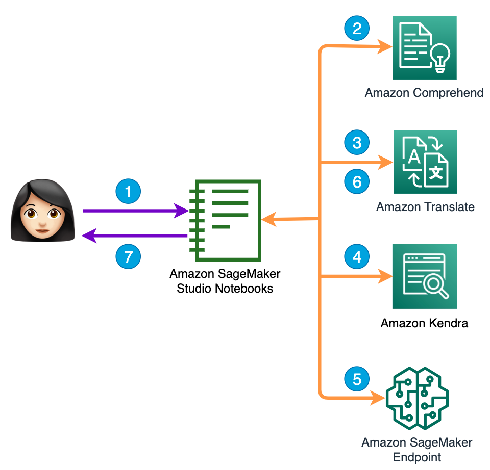
<h4 align="center">Fig 1. Create an Amazon Kendra Index. </h4> 

In Fig 1 you can see what the solution consists of: 

1. The user asks the question. 

2. The language in which the query is made is detected using [Amazon Comprehend](https://aws.amazon.com/comprehend/?sc_channel=el&sc_campaign=datamlwave&sc_content=build-a-knowledge-base-with-multilingual-q-and-a-gen-ai&sc_geo=mult&sc_country=mult&sc_outcome=acq). 

3. Using [Amazon Translate](https://aws.amazon.com/translate/?sc_channel=el&sc_campaign=datamlwave&sc_content=build-a-knowledge-base-with-multilingual-q-and-a-gen-ai&sc_geo=mult&sc_country=mult&sc_outcome=acq), the question is translated into the data soruce language. 

4. The intelligent knowledge base is consulted. 

5. Use Amazon Kendra's answer and user question to ask the LLM for a summarized and improved answer.

6. The answer is translated into the language of the question. 

7. Provide the summary answer and the source where it can be expanded. 

We will build it in five parts:

- Part 1 - Build the smart database with [Amazon Kendra](https://aws.amazon.com/kendra/), using the sample data.🤖
- Part 2 - Queries to an index in [Amazon Kendra](https://aws.amazon.com/kendra/). 
- Part 3 - Add multilingual features 🤖🌎: detect the language of the text and translate it.
- Part 4 - Create ENDPOINT to invoke Generative AI Large Language Model (LLM) 🚀.
- Part 5 - Summarize answer using the LLM.
- Part 6 - 🚨Delete resources🚨.

Let’s get started!

## Part 1 - Build the Smart Database with [Amazon Kendra](https://aws.amazon.com/kendra) 🤖

Kendra is an intelligent search service powered by machine learning, where you can add, update, or delete automatically synchronize [multiples data source](https://docs.aws.amazon.com/kendra/latest/dg/hiw-data-source.html?sc_channel=el&sc_campaign=datamlwave&sc_content=build-a-knowledge-base-with-multilingual-q-and-a-gen-ai&sc_geo=mult&sc_country=mult&sc_outcome=acq), and also index web pages by providing the URLs to crawling.

First you need to create a Kendra Index, to hold the contents of your documents and structure them in a way to make the documents searchable. Follow the steps to create a [Kendra](https://console.aws.amazon.com/kendra/?sc_channel=el&sc_campaign=datamlwave&sc_content=build-a-knowledge-base-with-multilingual-q-and-a-gen-ai&sc_geo=mult&sc_country=mult&sc_outcome=acq) Index in the console [here](https://docs.aws.amazon.com/kendra/latest/dg/gs-console.html).

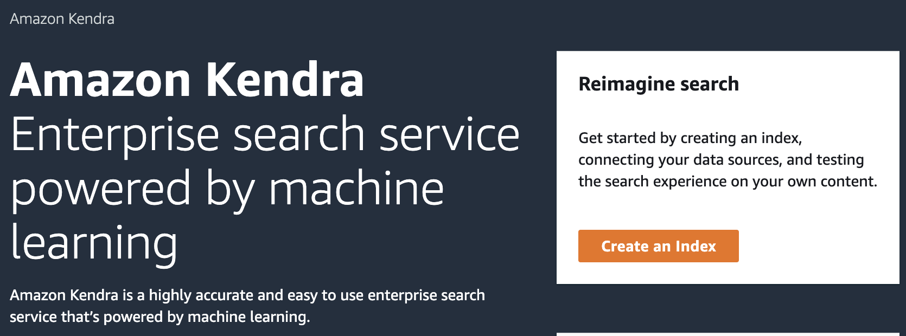<h4 align="center">Fig 2. Create an Amazon Kendra Index.</h4> 

Once the Index is **Active**, add a data source to an Index (Fig. 3), select **Add data source** and then select **Add dataset**, add a name and select English(en) in Language.

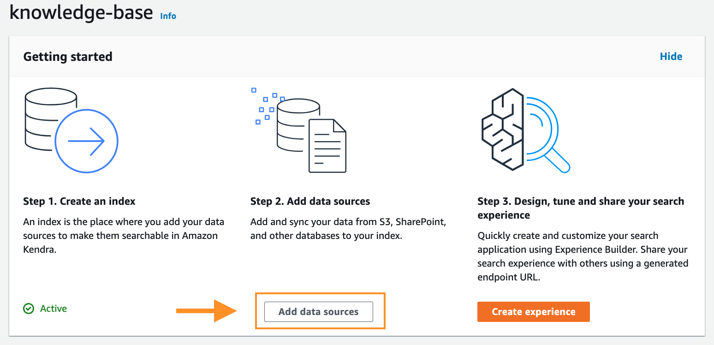
<h4 align="center">Fig 3. add a data source to an Index.</h4> 

At the end of the data synchronization, you will have the knowledge base ready for queries.

[Here](https://docs.aws.amazon.com/kendra/latest/dg/getting-started.html?sc_channel=el&sc_campaign=datamlwave&sc_content=build-a-knowledge-base-with-multilingual-q-and-a-gen-ai&sc_geo=mult&sc_country=mult&sc_outcome=acq) you can see more ways to upload sources to Kendra.

> 🚨**Note:** You can get started for free with the Amazon Kendra Developer Edition, that provides free usage of up to 750 hours for the first 30 days, check [pricing here](https://aws.amazon.com/kendra/pricing/).

## Part 2 - Searching an Amanzon Kendra Index

To search an Amazon Kendra index, you use the [Retrieve](https://boto3.amazonaws.com/v1/documentation/api/latest/reference/services/kendra/client/retrieve.html) API and it returns information about the indexed documents of data sources. You can alternatively use the [Query API](https://docs.aws.amazon.com/kendra/latest/APIReference/API_Query.html). However, the Query API only returns excerpt passages of up to 100 token words, whereas with the Retrieve API, you can retrieve longer passages of up to 200 token words.

Amazon Kendra utilizes various factors to determine the most relevant documents based on the search terms entered. These factors include the text/body of the document, document title, searchable custom text fields, and other relevant fields.

Additionally, filters can be applied to the search to narrow down the results, such as filtering documents based on a specific custom field like "department" (e.g., returning only documents from the "legal" department). For more information, see [Custom fields or attributes](https://docs.aws.amazon.com/kendra/latest/dg/custom-attributes.html?sc_channel=el&sc_campaign=datamlwave&sc_content=build-a-knowledge-base-with-multilingual-q-and-a-gen-ai&sc_geo=mult&sc_country=mult&sc_outcome=acq).

You can make search the Amazon Kendra Index in several ways.

### Searching with the Console

Go to the navigation panel on the left, choose the **Search indexed content** option, then enter a query in the text box and press **enter** (Fig. 4).

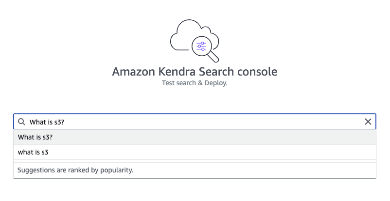<h4 align="center">Fig 4.  Search in a Kendra Index.</h4> 

**To search with AWS SDK for [Python(Boto3)](https://boto3.amazonaws.com/v1/documentation/api/latest/reference/services/kendra.html?sc_channel=el&sc_campaign=datamlwave&sc_content=build-a-knowledge-base-with-multilingual-q-and-a-gen-ai&sc_geo=mult&sc_country=mult&sc_outcome=acq)** use this code:

``` python
import boto3

kendra_client = boto3.client("kendra")

def QueryKendra(index_id,query): 
    response = kendra_client.retrieve(
        QueryText = query,
        IndexId = index_id)
    return response
```

### Search in Other Ways

You can also search with [AWS SDK for Java](https://sdk.amazonaws.com/java/api/latest/software/amazon/awssdk/services/kendra/KendraClient.html?sc_channel=el&sc_campaign=datamlwave&sc_content=build-a-knowledge-base-with-multilingual-q-and-a-gen-ai&sc_geo=mult&sc_country=mult&sc_outcome=acq) and [Postman](https://docs.aws.amazon.com/kendra/latest/dg/searching-example.html?sc_channel=el&sc_campaign=datamlwave&sc_content=build-a-knowledge-base-with-multilingual-q-and-a-gen-ai&sc_geo=mult&sc_country=mult&sc_outcome=acq).

## Part 3 - Add Multilingual Features 🤖🌎: Detect the Language of the Text and Translate It

In this segment, you will use two AI/ML services that you can use with an API call:

- [Amazon Comprehend](https://aws.amazon.com/comprehend/?sc_channel=el&sc_campaign=datamlwave&sc_content=build-a-knowledge-base-with-multilingual-q-and-a-gen-ai&sc_geo=mult&sc_country=mult&sc_outcome=acq), to detect the dominant language in which the question is asked, using [DetectDominantLanguage](https://boto3.amazonaws.com/v1/documentation/api/latest/reference/services/comprehend/client/detect_dominant_language.html#detect-dominant-language?sc_channel=el&sc_campaign=datamlwave&sc_content=build-a-knowledge-base-with-multilingual-q-and-a-gen-ai&sc_geo=mult&sc_country=mult&sc_outcome=acq) from [Boto3 Comprehend client](https://boto3.amazonaws.com/v1/documentation/api/latest/reference/services/comprehend.html?sc_channel=el&sc_campaign=datamlwave&sc_content=build-a-knowledge-base-with-multilingual-q-and-a-gen-ai&sc_geo=mult&sc_country=mult&sc_outcome=acq)

- [Amazon Translate](https://aws.amazon.com/translate/?sc_channel=el&sc_campaign=datamlwave&sc_content=build-a-knowledge-base-with-multilingual-q-and-a-gen-ai&sc_geo=mult&sc_country=mult&sc_outcome=acq), to translate the question to the language of the Kendra knowledge base (English in this case) and translate the answer back to the language of the original question, using [TranslateText](https://boto3.amazonaws.com/v1/documentation/api/latest/reference/services/comprehend/client/detect_dominant_language.html#detect-dominant-language?sc_channel=el&sc_campaign=datamlwave&sc_content=build-a-knowledge-base-with-multilingual-q-and-a-gen-ai&sc_geo=mult&sc_country=mult&sc_outcome=acq) from [Boto3 Translate client](https://boto3.amazonaws.com/v1/documentation/api/latest/reference/services/comprehend.html?sc_channel=el&sc_campaign=datamlwave&sc_content=build-a-knowledge-base-with-multilingual-q-and-a-gen-ai&sc_geo=mult&sc_country=mult&sc_outcome=acq).

The TranslateText API needs the following parameters:

- **Text (string)**: The text to translate.
- **SourceLanguageCode (string):** One of the [supported language codes](https://docs.aws.amazon.com/translate/latest/dg/what-is-languages.html?sc_channel=el&sc_campaign=datamlwave&sc_content=build-a-knowledge-base-with-multilingual-q-and-a-gen-ai&sc_geo=mult&sc_country=mult&sc_outcome=acq) for the source text, if you specify **auto**, Amazon Translate will call Amazon Comprehend to determine the source language.
- **TargetLanguageCode (string):** One of the supported language codes for the target text.

This is the function we will use to perform the translation:

```python
import boto3

translate_client = boto3.client('translate')

def TranslateText(text,SourceLanguageCode,TargetLanguage):
    response = translate_client.translate_text(
    Text=text,
    SourceLanguageCode=SourceLanguageCode,
    TargetLanguageCode=TargetLanguage
)
    translated_text = response['TranslatedText']
    source_language_code = response['SourceLanguageCode'] #you need SourceLanguageCode to answer in the original language
    return translated_text, source_language_code
```

If you want to know more about these services as API calls, you can visit this blog: [All the things that Comprehend, Rekognition, Textract, Polly, Transcribe, and Others Do](/posts/all-the-things-that-comprehend-rekognition-textract-polly-transcribe-and-others-do?sc_channel=el&sc_campaign=datamlwave&sc_content=build-a-knowledge-base-with-multilingual-q-and-a-gen-ai&sc_geo=mult&sc_country=mult&sc_outcome=acq).

> 🚨**Note:** Amazon Translate and Amazon Comprehend have Free Tier for up 12 months. Check [pricing here](https://aws.amazon.com/translate/pricing/?sc_channel=el&sc_campaign=datamlwave&sc_content=build-a-knowledge-base-with-multilingual-q-and-a-gen-ai&sc_geo=mult&sc_country=mult&sc_outcome=acq) and [here](https://aws.amazon.com/comprehend/pricing/?sc_channel=el&sc_campaign=datamlwave&sc_content=build-a-knowledge-base-with-multilingual-q-and-a-gen-ai&sc_geo=mult&sc_country=mult&sc_outcome=acq).

To know the language code for documents in the data source in Amazon Kendra, you use [Describe Data Source API](https://boto3.amazonaws.com/v1/documentation/api/latest/reference/services/kendra/client/describe_data_source.html#describe-data-source): 

```python
def get_target_language_code(data_source_id,index_id): 
    response_data_source = kendra_client.describe_data_source(
        Id = data_source_id,
        IndexId = index_id
    )
    return response_data_source['LanguageCode']
```

**🥳 The code of the multilingual Q&A intelligent knowledge base is:**

```python
text = "¿que es Amazon S3?"
index_id = "xxxxxxxx-xxxx-xxxx-xxxx-xxxxxxxxxxxx"
data_source_id = "xxxxxxxx-xxxx-xxxx-xxxx-xxxxxxxxxxxx"

target_language_code = get_target_language_code(data_source_id,index_id)

query,source_language_code = TranslateText(text,"auto",target_language_code)
response = QueryKendra(index_id,query)

#print the result

for query_result in response["ResultItems"]:
    print("-------------------")
    document_title = query_result['DocumentTitle']
    document_title_translated,language = TranslateText(document_title,target_language_code,source_language_code)
    print("DocumentTitle: " + document_title_translated)
    document_content = query_result['Content']
    document_content_translated,language = TranslateText(document_content,target_language_code,source_language_code)
    print("Content: ",document_content_translated)
    print("Go deeper: ", query_result['DocumentURI']) 
```

Amazon Kendra delivers a list of answers, which could be big (Fig. 5). Wouldn't a summarized result be better?

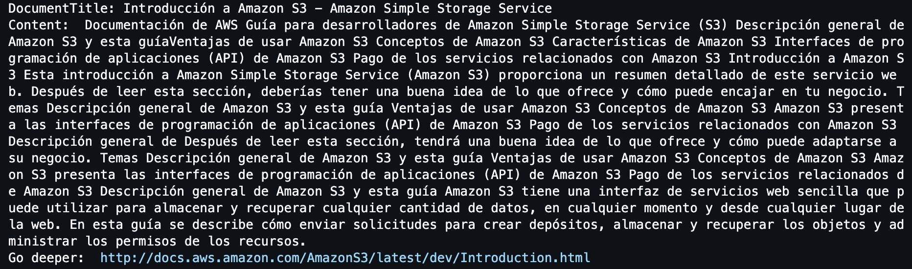<h4 align="center">Fig 5.  Amazon Kendra answer result in spanish.</h4>

## Part 4 - Create ENDPOINT to Invoke Generative AI Large Language Models (LLMs) 🚀

In this part you are going to use [Amazon SageMaker JumpStart](https://aws.amazon.com/sagemaker/jumpstart/), which provides pre-trained, open-source models for a wide range of problem types (including our summarization problem) to help you get started with machine learning. The best part is that you can also access models using the [SageMaker Python SDK](https://sagemaker.readthedocs.io/en/stable/overview.html#use-sagemaker-jumpstart-algorithms-with-pretrained-models).

To summarize, you will use [Flan UL2](https://huggingface.co/google/flan-ul2) fundamental model, a Text2Text Generation model based on the [FLAN-T5](https://huggingface.co/docs/transformers/model_doc/flan-t5) architecture, a popular open-source LLM, for: 

- Text summarization
- Common sense reasoning / natural language inference
- Question and answering
- Sentence / sentiment classification
- Translation (at the time of writing this blog, between [fewer languages](https://arxiv.org/pdf/2210.11416.pdf) than [Amazon Translate](https://docs.aws.amazon.com/translate/latest/dg/what-is-languages.html))
- Pronoun resolution
 
**👷🏻‍♀️🧰 Now let's start working with it:**

|| |
|--- | --- |
| 1. Open the [Amazon Sagemaker console](https://console.aws.amazon.com/sagemaker/?sc_channel=el&sc_campaign=datamlwave&sc_content=build-a-knowledge-base-with-multilingual-q-and-a-gen-ai&sc_geo=mult&sc_country=mult&sc_outcome=acq) | 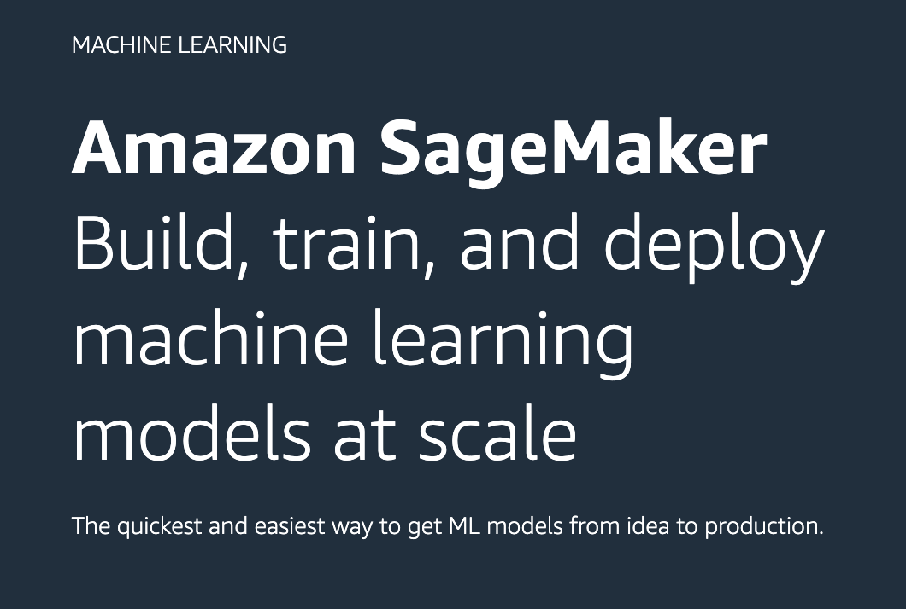| 
|2. Find JumpStart on the left-hand navigation panel and choose Foundation models.|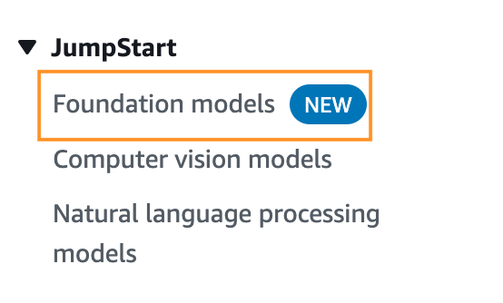|
|3. Search for a [**Flan UL2**](https://huggingface.co/google/flan-ul2) model, and then click on **View model**.|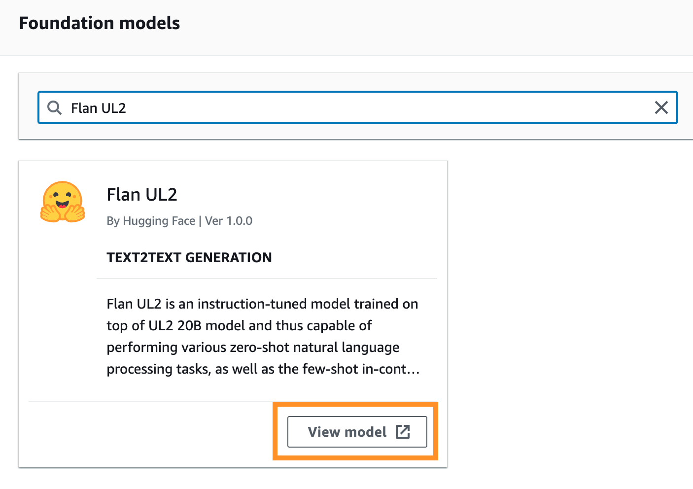|
|4. Open notebook in [Studio](https://aws.amazon.com/sagemaker/studio/?sc_channel=el&sc_campaign=datamlwave&sc_content=build-a-knowledge-base-with-multilingual-q-and-a-gen-ai&sc_geo=mult&sc_country=mult&sc_outcome=acq)||
|5. Create a [Sagemaker Domain](https://docs.aws.amazon.com/sagemaker/latest/dg/gs-studio-onboard.html?sc_channel=el&sc_campaign=datamlwave&sc_content=build-a-knowledge-base-with-multilingual-q-and-a-gen-ai&sc_geo=mult&sc_country=mult&sc_outcome=acq) using [Quick setup](https://docs.aws.amazon.com/sagemaker/latest/dg/onboard-quick-start.html?sc_channel=el&sc_campaign=datamlwave&sc_content=build-a-knowledge-base-with-multilingual-q-and-a-gen-ai&sc_geo=mult&sc_country=mult&sc_outcome=acq), this takes a few minutes⏳... or **Select domain and user profile** if you already have one created.|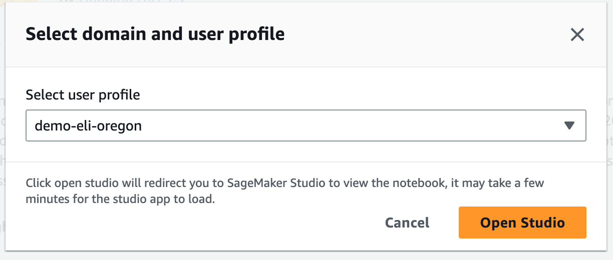|
|6. Follow the steps in jupyter notebook, explore it, and wait for me in step **5**|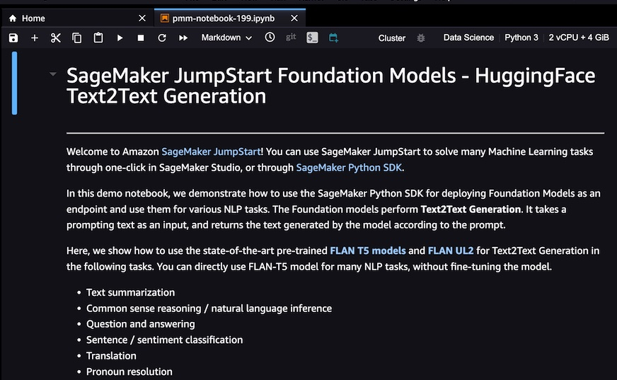|

In the jupyter notebook you can explore the functionalities of the FLAN-T5 model.

Go to part 3 in jupyter notebook to deploy a [sagemaker endpoint](https://docs.aws.amazon.com/sagemaker/latest/dg/inference-recommender.html?sc_channel=el&sc_campaign=datamlwave&sc_content=build-a-knowledge-base-with-multilingual-q-and-a-gen-ai&sc_geo=mult&sc_country=mult&sc_outcome=acq). This is the call to do [real-time inference](https://docs.aws.amazon.com/sagemaker/latest/dg/realtime-endpoints.html?sc_channel=el&sc_campaign=datamlwave&sc_content=build-a-knowledge-base-with-multilingual-q-and-a-gen-ai&sc_geo=mult&sc_country=mult&sc_outcome=acq) to ML model as an API call, using Boto3 and AWS credentials.

You can get the Sagemaker Endpoint in two ways:

- [SageMaker Python SDK](https://sagemaker.readthedocs.io/en/stable/overview.html#use-prebuilt-models-with-sagemaker-jumpstart):

```code
model_predictor.endpoint_name
```

- Console:

Find **Inference** on the left-hand navigation panel and choose **Endpoints**.

> 🚨**Note:** You have to be careful, because while the endpoint is active, you will be billing. Check [pricing here](https://aws.amazon.com/es/sagemaker/pricing/).

## Part 5 - Summarize Answers Using the LLM

In **[step 5](https://github.com/aws/amazon-sagemaker-examples/blob/main/introduction_to_amazon_algorithms/jumpstart-foundation-models/text2text-generation-flan-t5-ul2.ipynb)** on Jupyter notebook, you can see the advanced parameters to control the generated text while performing inference definition that this model supports.

Let's define the parameters as follows:

```python
import json
newline, bold, unbold = "\n", "\033[1m", "\033[0m"
parameters = {
    "max_length": 50,
    "max_time": 50,
    "num_return_sequences": 3,
    "top_k": 50,
    "top_p": 0.95,
    "do_sample": True,
}
```

Where: 
- **num_return_sequences:** corresponds to the number of answers per query that the LLM will deliver.
- **max_length:** the maximum number of tokens that the model will generate.
- **top_k:** limit random sampling to choose k value of sample with the highest probabilities. 
- **top_p:** Select an output using the random-weighted strategy with the top-ranked consecutive results by probability and with a cumulative probability <= p. 
- **do_sample**: Set `True` because Flan-T5 model use sampling technique.

To get inferences from the model hosted at the specified endpoint you need to use the [InvokeEndpoint API](https://docs.aws.amazon.com/sagemaker/latest/APIReference/API_runtime_InvokeEndpoint.html?sc_channel=el&sc_campaign=datamlwave&sc_content=build-a-knowledge-base-with-multilingual-q-and-a-gen-ai&sc_geo=mult&sc_country=mult&sc_outcome=acq) from the [Amazon SageMaker Runtime](https://boto3.amazonaws.com/v1/documentation/api/latest/reference/services/sagemaker-runtime.html?sc_channel=el&sc_campaign=datamlwave&sc_content=build-a-knowledge-base-with-multilingual-q-and-a-gen-ai&sc_geo=mult&sc_country=mult&sc_outcome=acq), you do it with the following function:

```python
def query_endpoint_with_json_payload(encoded_json, endpoint_name):
    client = boto3.client("runtime.sagemaker")
    response = client.invoke_endpoint(
        EndpointName=endpoint_name, ContentType="application/json", Body=encoded_json
    )
    return response
```

[InvokeEndpoint API parameters](https://boto3.amazonaws.com/v1/documentation/api/latest/reference/services/sagemaker-runtime/client/invoke_endpoint.html?sc_channel=el&sc_campaign=datamlwave&sc_content=build-a-knowledge-base-with-multilingual-q-and-a-gen-ai&sc_geo=mult&sc_country=mult&sc_outcome=acq)

To make the response readable to humans, use the following function:

```python
def parse_response_multiple_texts(query_response):
    model_predictions = json.loads(query_response["Body"].read())
    generated_text = model_predictions["generated_texts"]
    return generated_text
```

For the LLM to generate an improved answer, you provide a prompt (or `text_inputs` in the code) composed of Amazon Kendra document part and the user's question, so that the model understands the context.

A good prompt provides a good result. If you want to know more about how to improve the prompt, I leave you this [Prompt Engineering Guide](https://www.promptingguide.ai/).

```python
def summarization(text,query):
    
    payload = {"text_inputs": f"{text}\n\nBased on the above article, answer a question. {query}", **parameters}
    query_response = query_endpoint_with_json_payload(
            json.dumps(payload).encode("utf-8"), endpoint_name=endpoint_name
        )

    generated_texts = parse_response_multiple_texts(query_response)

    print(f"{bold} The {num_return_sequences} summarized results are{unbold}:{newline}")

    for idx, each_generated_text in enumerate(generated_texts):
        #Translate the answer to the original language of the question
        answer_text_translated,language = TranslateText(each_generated_text,TargetLanguage,source_language_code)

        print(f"{bold}Result {idx}{unbold}: {answer_text_translated}{newline}")  

    return
```

Play with the `text_inputs` and discover the best one according to your needs.

Bring all the code together and **Build your own knowledge base with multilingual Q&A powered by Generative AI** 🥳.

```python
text = "¿que es Amazon S3?"

target_language_code = get_target_language_code(data_source_id,index_id)

query,source_language_code = TranslateText(text,"auto",target_language_code)
response = QueryKendra(index_id,query)

for query_result in response["ResultItems"]:
    print("-------------------")
    document_title = query_result['DocumentTitle']
    document_title_translated,language = TranslateText(document_title,target_language_code,source_language_code)
    print("DocumentTitle: " + document_title_translated)
    document_content = query_result['Content']
    document_content_translated,language = TranslateText(document_content,target_language_code,source_language_code)
    print("Go deeper: ", query_result['DocumentURI'])
    summarization(document_content,query)
```

In Fig 6 you can see 3 results of the summarized text. This is because you set num_return_sequences parameter to 3:

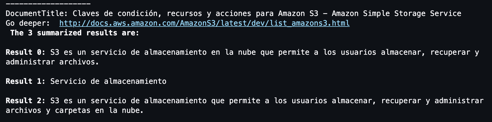<h4 align="center">Fig 6.  Amazon Kendra answer summarized results in spanish.</h4> 

## Part 6 - 🚨 Delete Resources 🚨

If your intention was to create to learn and you are not going to continue using the services, you must eliminate them so as not to overspend. 

### Delete Amazon Kendra Index

1. Open the [Amazon Kendra console](https://console.aws.amazon.com/kendra/).
2. In the navigation panel, choose Indexes, and then choose the index to delete.
3. Choose Delete to delete the selected index.

### Delete Amazon Sagemaker Model and Endpoint

In the notebook in Sagemaker Studio where you deploy an Endpoint, execute the following lines:

```python
# Delete the SageMaker endpoint
model_predictor.delete_model()
model_predictor.delete_endpoint()
```

## Conclusion

Thank you for joining me on this journey, where you gather all the code and build your own knowledge base with multilingual Q&A powered by generative AI. This database allows you to make inquiries in any language, receiving summarized responses in the desired language, all prioritizing data privacy.

You can improve the LLM response by applying [Prompt Engineering Techniques](https://www.promptingguide.ai/techniques). An interesting one is Self-Consistency, that is, answering in the same way we did here but for the most relevant documents from Amazon Kendra, and then use the LLM to answer based on all responses (most consistent answer). Just try by yourself!

Then you can place the code in an [AWS Lambda Function](https://aws.amazon.com/es/lambda/) and, to improve the performance of this application, you can introduce a caching mechanism by incorporating an Amazon DynamoDB table. In this table, you can store the responses obtained from Amazon Kendra, utilizing the response as the partition key and the summary as the sort key. By implementing this approach, you can first consult the table before generating the summary, thereby delivering faster responses and optimizing the overall user experience.

Some links for you to continue learning:

- [Learn the fundamentals of generative AI for real-world applications](https://www.deeplearning.ai/courses/generative-ai-with-llms/)

- [Amazon SageMaker Examples - Introduction to Amazon Algorithms](https://github.com/aws/amazon-sagemaker-examples/tree/main/introduction_to_amazon_algorithms?sc_channel=el&sc_campaign=datamlwave&sc_content=build-a-knowledge-base-with-multilingual-q-and-a-gen-ai&sc_geo=mult&sc_country=mult&sc_outcome=acq)

- [Welcome to Kendra Essentials+](https://catalog.us-east-1.prod.workshops.aws/workshops/df64824d-abbe-4b0d-8b31-8752bceabade/en-US?sc_channel=el&sc_campaign=datamlwave&sc_content=build-a-knowledge-base-with-multilingual-q-and-a-gen-ai&sc_geo=mult&sc_country=mult&sc_outcome=acq)

- [Integrate Amazon Kendra and Amazon Lex using a search intent](https://aws.amazon.com/blogs/machine-learning/integrate-amazon-kendra-and-amazon-lex-using-a-search-intent/?sc_channel=el&sc_campaign=datamlwave&sc_content=build-a-knowledge-base-with-multilingual-q-and-a-gen-ai&sc_geo=mult&sc_country=mult&sc_outcome=acq)
