Asset tracking is critical to supply chain operations. Whether it is tracking trucks across the country or last mile deliveries around a neighborhood, knowing where your fleet is located can add business value around loss prevention, sustainability, and [overall cost savings](https://aws.amazon.com/solutions/case-studies/geo-me-case-study/?sc_channel=el&sc_campaign=appswave&sc_geo=mult&sc_country=mult&sc_outcome=acq). In this tutorial, we will deploy a simple web application that shows an asset's current location, as well as historical location. We'll then use AWS IoT Core to simulate a vehicle, making use of the MQTT protocol, a lightweight messaging protocol designed for IoT use cases. We will cover how to:

- Use [AWS Amplify](https://aws.amazon.com/amplify/?sc_channel=el&sc_campaign=appswave&sc_geo=mult&sc_country=mult&sc_outcome=acq) to build a web application to display current and historical device locations on a map
- Configure Amazon Location Service [trackers](https://docs.aws.amazon.com/location/latest/developerguide/geofence-tracker-concepts.html?sc_channel=el&sc_campaign=appswave&sc_geo=mult&sc_country=mult&sc_outcome=acq) to store location data
- [Connect Amazon Location Service with AWS IoT Core](https://docs.aws.amazon.com/location/latest/developerguide/tracking-using-mqtt.html?sc_channel=el&sc_campaign=appswave&sc_geo=mult&sc_country=mult&sc_outcome=acq) to ingest data from MQTT via the [Iot Core Rules Engine](https://docs.aws.amazon.com/iot/latest/developerguide/location-rule-action.html?sc_channel=el&sc_campaign=appswave&sc_geo=mult&sc_country=mult&sc_outcome=acq)

## Prerequisites

Before starting this tutorial, you will need the following:

 - An AWS Account (if you don't yet have one, you can create one and [set up your environment here](https://aws.amazon.com/getting-started/guides/setup-environment/?sc_channel=el&sc_campaign=appswave&sc_geo=mult&sc_country=mult&sc_outcome=acq)).

## Sections

| Info                | Level                                  |
| ------------------- | -------------------------------------- |
| ✅ AWS Level        | Intermediate                               |
| ⏱ Time to complete  | 45 minutes                             |
| 💰 Cost to complete | Free tier eligible      |
| 🧩 Prerequisites    | - [AWS Account](https://portal.aws.amazon.com/billing/signup#/start/email?sc_channel=el&sc_campaign=appswave&sc_geo=mult&sc_country=mult&sc_outcome=acq)<br>|
| 💻 Code Sample         | Code sample used in tutorial on [GitHub](https://github.com/aws-samples/amazon-location-samples/tree/main/maplibre-js-react-iot-asset-tracking)                             |
| 📢 Feedback            | <a href="https://pulse.buildon.aws/survey/DEM0H5VW" target="_blank">Any feedback, issues, or just a</a> 👍 / 👎 ?    |
| ⏰ Last Updated     | 2023-05-10                             |

| ToC |
|-----|

---

## Deploy a Cloud9 Instance

To deploy our asset tracking app, we will be using AWS Cloud9. Cloud9 is a cloud-based IDE that lets you write, run, and debug your code with just a browser. Using Cloud9 makes it easy to build and deploy applications while reducing the need for local development on builder workstations. Cloud9 also comes bundled with many AWS builder tools to get started developing quickly.

Navigate to the AWS Console and select **Cloud9**. Next select **Create environment**. 

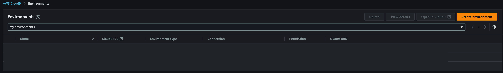

Set the instance type to `t3.small` and provide a name. Select **Create**.

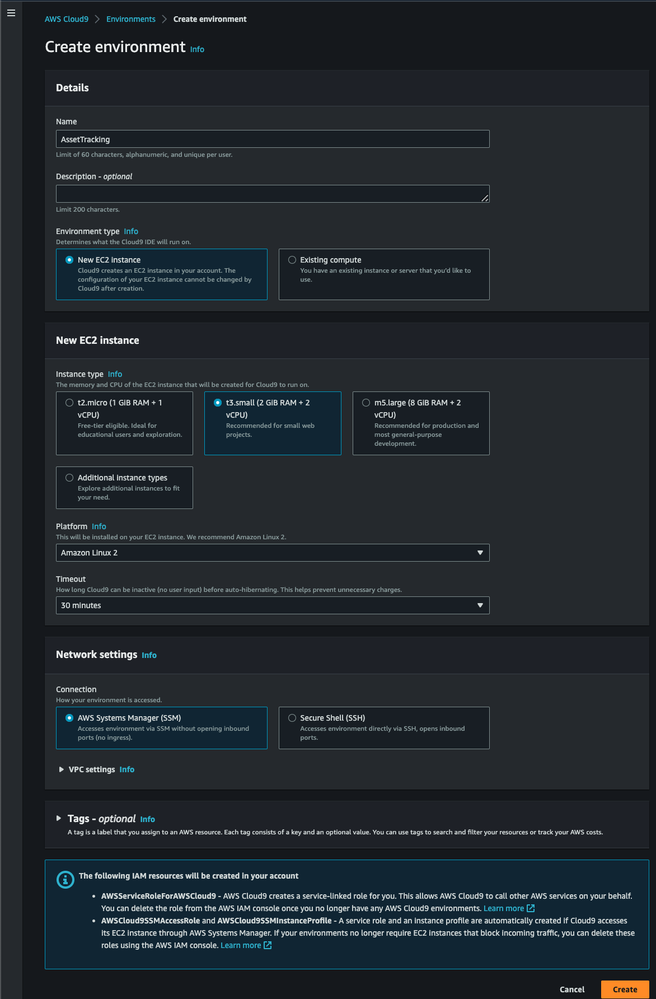

Once the Cloud9 instance has launched, we can begin deploying our app.

## Deploy the Tracking App
Now that the Cloud9 instance has been launched, we can download the code to build our application. From your Cloud9 terminal, clone the repo:

```bash
git clone https://github.com/aws-samples/amazon-location-samples.git
``` 

Next, navigate to the app directory:

```bash
cd amazon-location-samples/maplibre-js-react-iot-asset-tracking/
```

Install our dependencies:

```bash
npm install
```

In order to configure Amplify, we need to set up an AWS Profile on the Cloud9 instance. To do this, enter the following command, making sure to replace the region with the region you are running the lab in. For example, for us-east-1:

```bash
echo $'[profile default]\nregion=us-east-1' > ~/.aws/config
```

Next we need to ensure Amplify is installed:

```bash
npm install -g @aws-amplify/cli
```

Now we can initialize our Amplify environment:

```bash
amplify init
```

Accept the default options.

```bash
Note: It is recommended to run this command from the root of your app directory
? Enter a name for the project maplibrejsreactiotas
The following configuration will be applied:

Project information
| Name: maplibrejsreactiotas
| Environment: dev
| Default editor: Visual Studio Code
| App type: javascript
| Javascript framework: react
| Source Directory Path: src
| Distribution Directory Path: build
| Build Command: npm run-script build
| Start Command: npm run-script start

? Initialize the project with the above configuration? Yes
Using default provider  awscloudformation
? Select the authentication method you want to use: AWS profile

For more information on AWS Profiles, see:
https://docs.aws.amazon.com/cli/latest/userguide/cli-configure-profiles.html?sc_channel=el&sc_campaign=appswave&sc_geo=mult&sc_country=mult&sc_outcome=acq

? Please choose the profile you want to use default
```

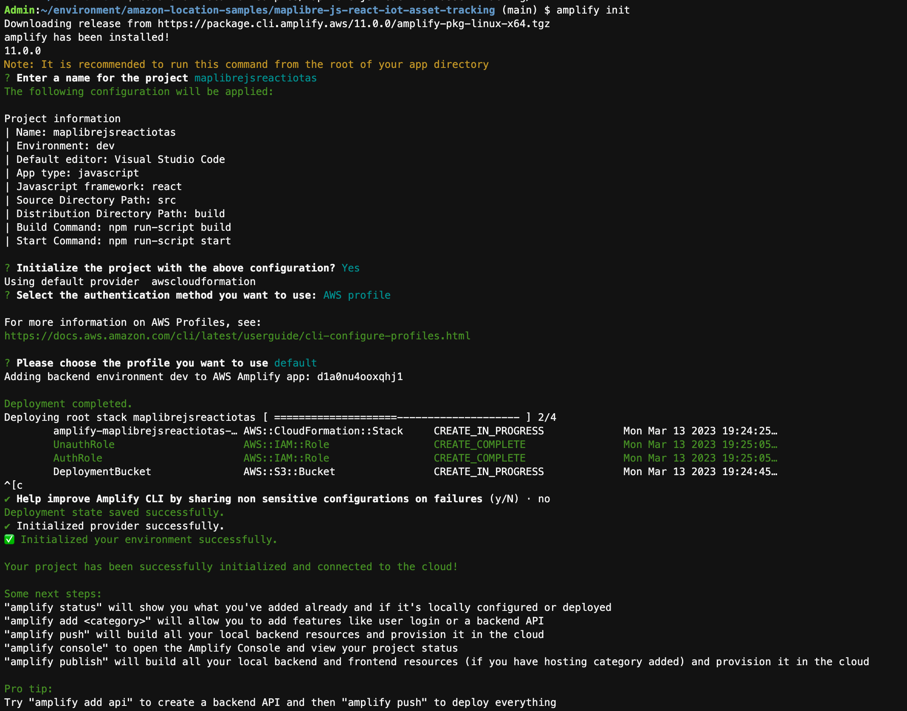

Now we can use AWS Amplify to add our Amazon Location Service resources:

```bash
amplify add geo
```

And select the following options. Note we change the map data provider due to [Terms of Service](https://aws.amazon.com/service-terms/#:~:text=82.5.%20In,in%20your%20business?sc_channel=el&sc_campaign=appswave&sc_geo=mult&sc_country=mult&sc_outcome=acq) that require us to use the HERE data provider for asset tracking use cases. Also make sure to select `Authorized and Guest users` when choosing who can access the map. If your app has authentication such as a login portal, you can choose that only authorized users can view the map resource. However for our application, we do not have a login, so unauthenticated users can access the map.

```bash
? Select which capability you want to add: Map (visualize the geospatial data)
✔ geo category resources require auth (Amazon Cognito). Do you want to add auth now? (Y/n) · yes
Using service: Cognito, provided by: awscloudformation

 The current configured provider is Amazon Cognito.

 Do you want to use the default authentication and security configuration? Default configuration
 Warning: you will not be able to edit these selections.
 How do you want users to be able to sign in? Username
 Do you want to configure advanced settings? No, I am done.
✅ Successfully added auth resource maplibrejsreactiotase08797a2 locally

✅ Some next steps:
"amplify push" will build all your local backend resources and provision it in the cloud
"amplify publish" will build all your local backend and frontend resources (if you have hosting category added) and provision it in the cloud

✔ Provide a name for the Map: · mapiottracker
✔ Who can access this Map? · Authorized and Guest users
Available advanced settings:
- Map style & Map data provider (default: Streets provided by Esri)

✔ Do you want to configure advanced settings? (y/N) · yes
✔ Specify the map style. Refer https://docs.aws.amazon.com/location-maps/latest/APIReference/API_MapConfiguration.html · Explore (data provided by HERE)
⚠️ Auth configuration is required to allow unauthenticated users, but it is not configured properly.
✅ Successfully updated auth resource locally.
✅ Successfully added resource mapiottracker locally.

✅ Next steps:
"amplify push" builds all of your local backend resources and provisions them in the cloud
"amplify publish" builds all of your local backend and front-end resources (if you added hosting category) and provisions them in the cloud
```

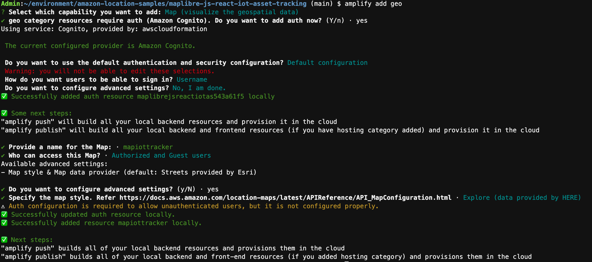

Before we push our Amplify configuration, we need to make one small change to allow our application to work with Amazon Location Service Trackers.

```bash
amplify override project
```

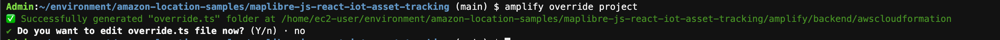

Now navigate to the amplify/backend/awscloudformation/override.ts file that was just created, and replace the contents with the following:

```javascript
import { AmplifyRootStackTemplate } from "@aws-amplify/cli-extensibility-helper";

export function override(resources: AmplifyRootStackTemplate) {
  resources.unauthRole.addOverride("Properties.Policies", [
    {
      PolicyName: "trackerPolicy",
      PolicyDocument: {
        Version: "2012-10-17",
        Statement: [
          {
            Effect: "Allow",
            Action: ["geo:GetDevicePositionHistory"],
            Resource: {
              "Fn::Sub":
                "arn:aws:geo:${AWS::Region}:${AWS::AccountId}:tracker/trackerAsset01",
            },
          },
        ],
      },
    },
  ]);
}
```

This will update the policy used by Amazon Cognito to display the tracker position on the map.

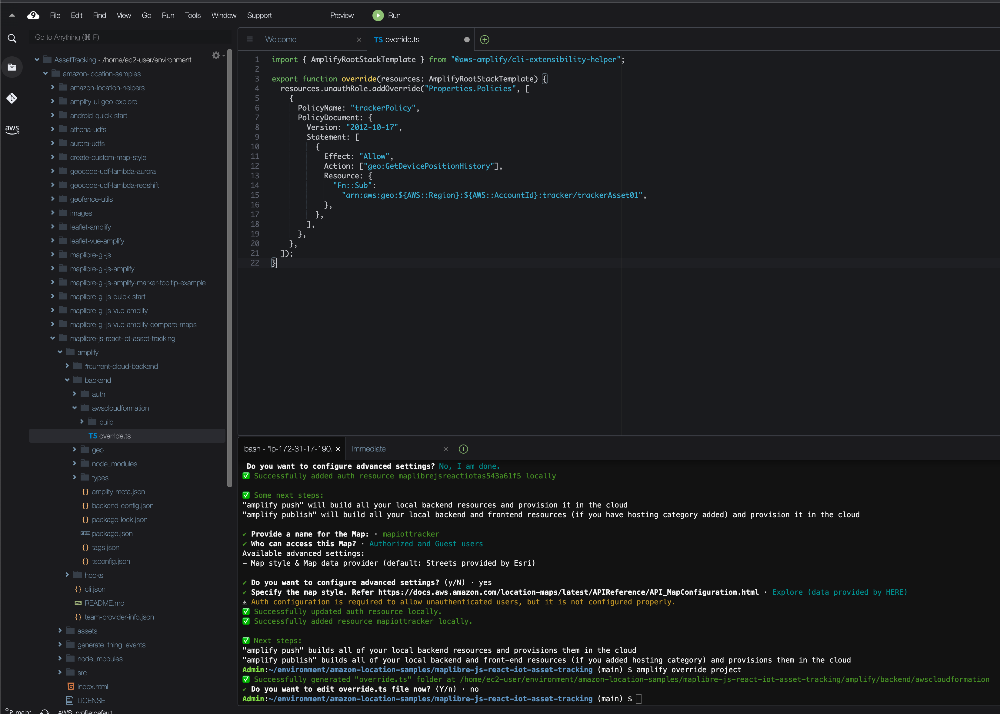

Save the `override.ts` file and now we can push our Amplify configuration and create our resources in the cloud.

```bash
amplify push
```

Select `y` for the options presented here:

```bash
✔ Successfully pulled backend environment dev from the cloud.

    Current Environment: dev
    
┌──────────┬──────────────────────────────┬───────────┬───────────────────┐
│ Category │ Resource name                │ Operation │ Provider plugin   │
├──────────┼──────────────────────────────┼───────────┼───────────────────┤
│ Auth     │ maplibrejsreactiotas543a61f5 │ Create    │ awscloudformation │
├──────────┼──────────────────────────────┼───────────┼───────────────────┤
│ Geo      │ mapiottracker                │ Create    │ awscloudformation │
└──────────┴──────────────────────────────┴───────────┴───────────────────┘
✔ Are you sure you want to continue? (Y/n) · yes
```

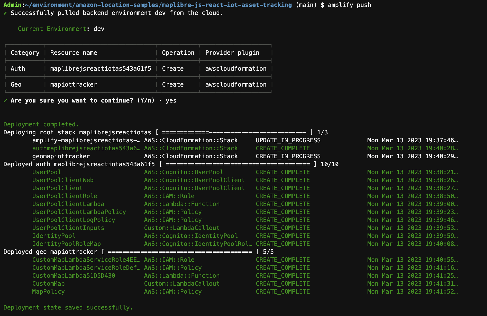

Next start the application by running:

```bash
npm start
```

Keep `npm start` running throughout this tutorial in order to keep the asset tracking app running.

In your Cloud9, navigate to **Run** and then select **Preview running application** to view the app.

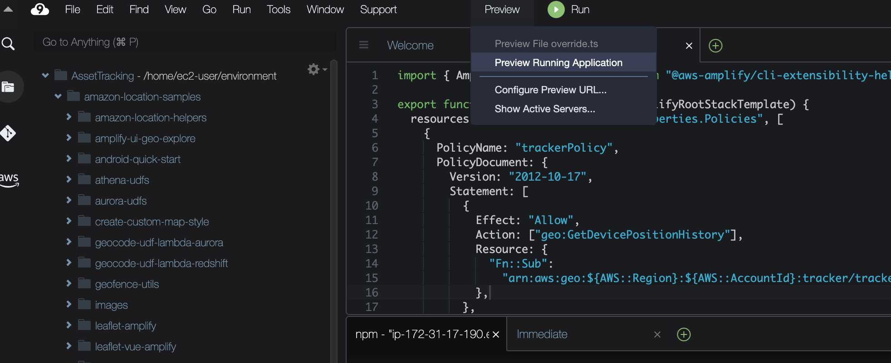

You should now see your application running inside Cloud9, like this.

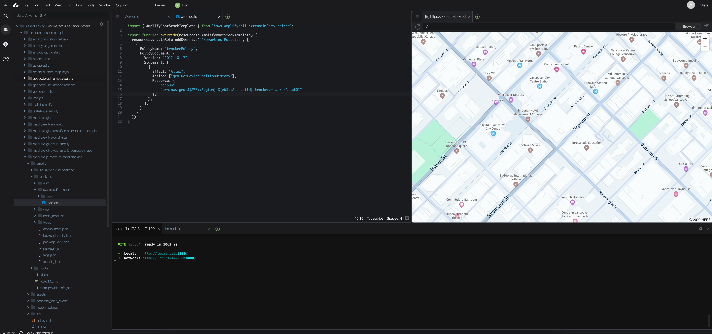

## Setting up IoT Core Resources

Now that we have our Amazon Location Service resources configured and our web app up and running, we need to configure an IoT Rule to send MQTT events to our new Amazon Location Service Tracker. This rule will watch for messages on the `assets/tracker` MQTT topic, parse the message, and send the location information to the `AssetTracker` Amazon Location Service tracker which updates the `thing123` device that is displayed on the map.

Navigate to the IoT Core Console, and click on **Message Routing** then **Rules**.

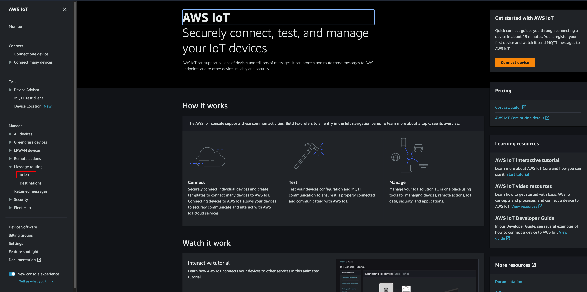

Click on **Create Rule**.

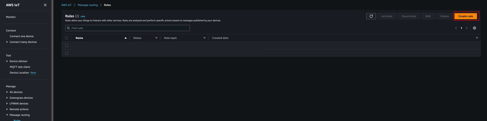

Now let's give our rule the name `AssetTrackingRule` and click **Next**.

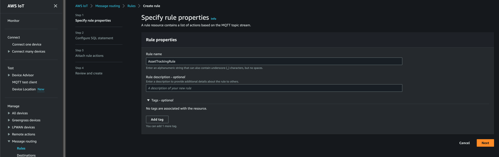

Now we need our SQL statement. We will be using the topic `assets/trackers`. Enter `SELECT * FROM 'assets/trackers'`.

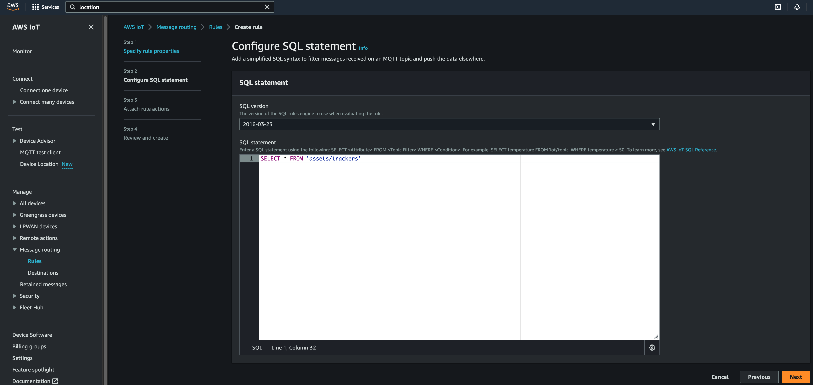

Then click **Next**.

Now it's time to set up our Location Action. Select **Location** from the **Choose an action** dropdown.

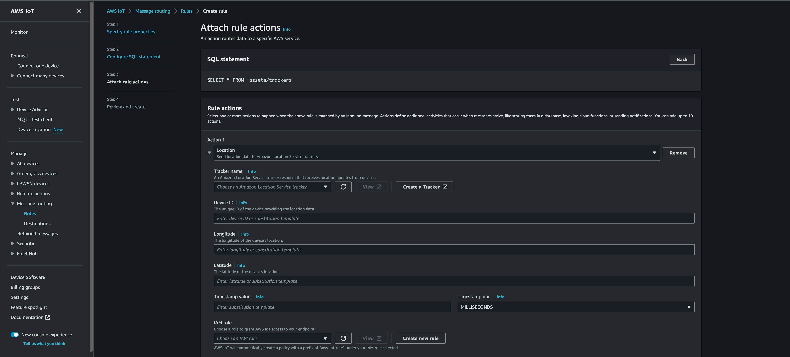

Select **Create a Tracker** and enter the name `AssetTracker`. 

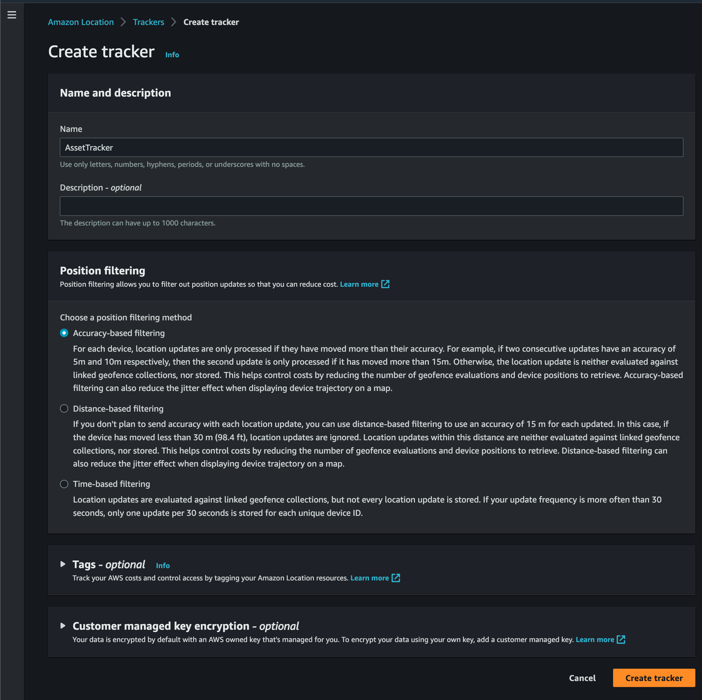

Select **Create tracker**.

Now we can configure mapping of our payload to the rule. In order to do this, we will use substitution templates in IoT Core. Select trackerAsset01 for the Tracker name dropdown, then, for each field, copy/paste the following values: 

Device ID: `thing123`

Longitude: `${longitude}`

Latitude: `${latitude}`

Timestamp value: `${timestamp()}`

Finally, we need to create a new IAM Role that will give IoT Core Rules Engine permissions to update the Amazon Location Service Tracker resource. Click Create new role, give it the name `AssetTrackerIoTRule` and click **Create**.

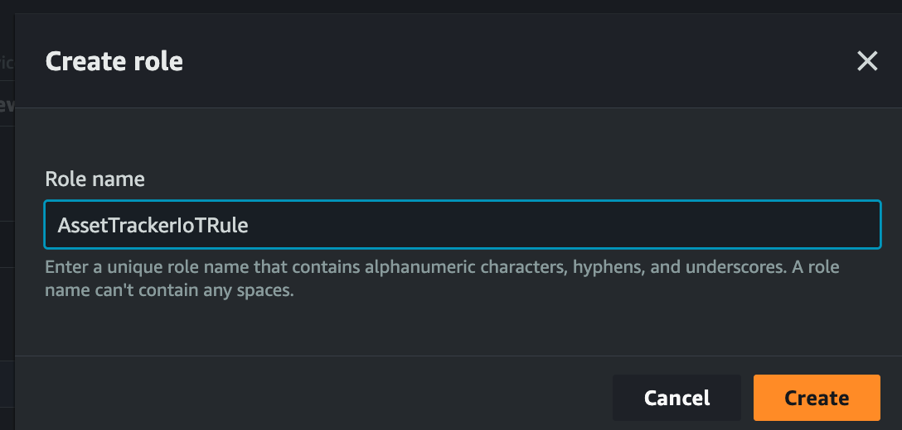

Our configuration should look like this. 

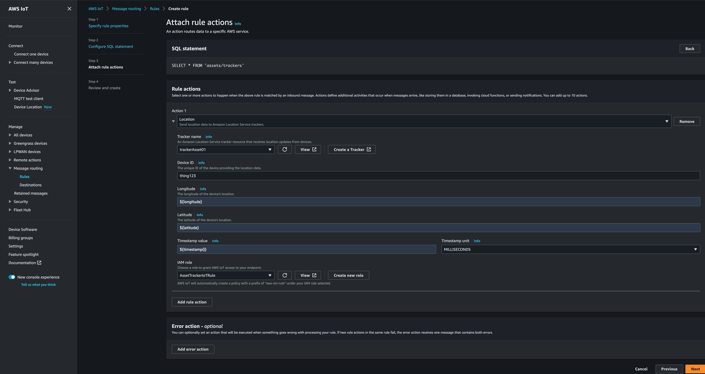

Select **Next**.

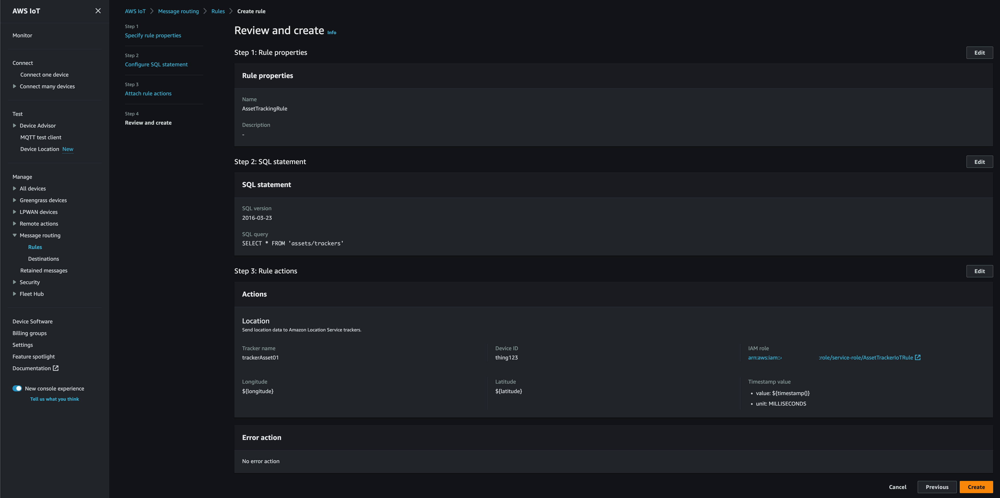

Now select **Create**.

Now that we've created our IoT Core Rule, we can start sending messages.

## Sending MQTT Messages
Now we will send a device location to AWS IoT Core and our MQTT Topic. This simulates a message that would come from an IoT Device such as an asset tracker.

From the IoT Core console, navigate to **MQTT test client** and select the **Publish to a topic** tab.

For the **Topic name** enter `assets/tracker`

Enter the following in **Message payload** to send our first point:

```json
{
  "deviceId": "thing123",
 "latitude": "49.282301",
"longitude": "-123.118408"
}
```

Then select **Publish**.

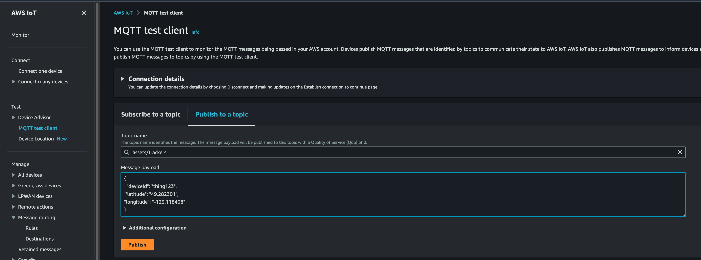

Navigate back to Cloud9 and your running application. Refresh the application and you should see the point on the map.

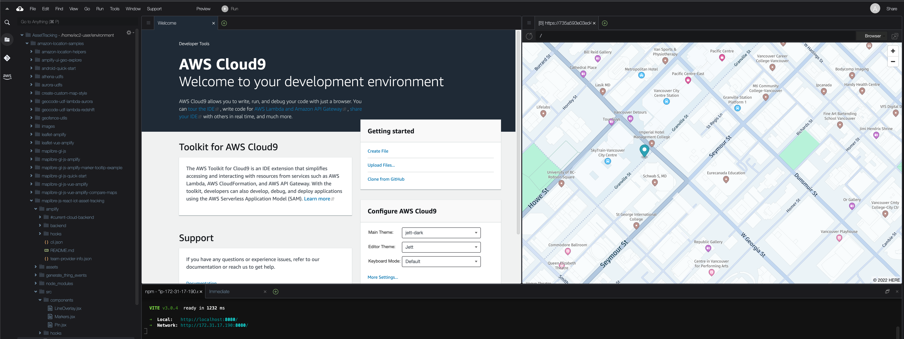

Now let's enter another point. In the **MQTT test client** enter the following, then select **Publish**:

```json
{
  "deviceId": "thing123",
 "latitude": "49.282144",
"longitude": "-123.117574"
}
```

Refresh the page and you will see a second pin, with a line connecting it with the previous point. 

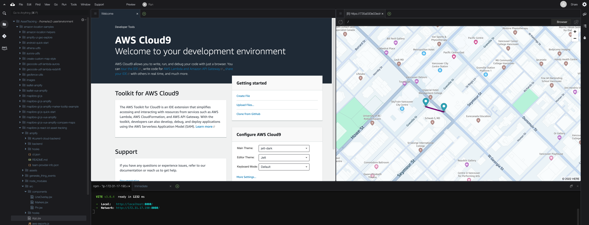

## Cleaning up your AWS Environment

In order to remove resources created as part of this tutorial, we need to complete the following steps.

### Delete Cloud9

In order to avoid incurring charges from our Cloud9 Instance, we need to delete the environment. Follow the steps [here](https://docs.aws.amazon.com/cloud9/latest/user-guide/delete-environment.html?sc_channel=el&sc_campaign=appswave&sc_geo=mult&sc_country=mult&sc_outcome=acq) to remove the `AssetTracking` environment.

### Delete Amazon Location Service Tracker

Navigate to the Amazon Location Service console, select **Trackers**, select `trackerAsset01`, and select **Delete**, confirming you wish to delete it.

### Delete IoT Core Rule

Navigate to the IoT Core Console, select **Message Routing** and **Rules**. Select `AssetTrackingRule` and select **Delete**, confirming you wish to delete it.

## Next Steps

Now that you've built an asset tracking solution, think about ways to send location information to AWS IoT Core. If you're interested in physical asset tracking devices, check out the [AWS Partner Device Catalog](https://devices.amazonaws.com/search?page=1&type=tracker?sc_channel=el&sc_campaign=appswave&sc_geo=mult&sc_country=mult&sc_outcome=acq) or if you are interested in setting up more simulated devices at scale, check out the [IoT Device Simulator Solution](https://aws.amazon.com/solutions/implementations/iot-device-simulator/?sc_channel=el&sc_campaign=appswave&sc_geo=mult&sc_country=mult&sc_outcome=acq) provided by AWS, which has the ability to simulate a moving device. Finally if you want to learn more about how the web app is built, check out the [Amplify Geo documentation](https://docs.amplify.aws/lib/geo/getting-started/q/platform/js/?sc_channel=el&sc_campaign=appswave&sc_geo=mult&sc_country=mult&sc_outcome=acq).

## Conclusion

Congratulations! You just built a simple asset tracking app using AWS Amplify, Amazon Location Service, and AWS IoT Core. If you enjoyed this tutorial, found any issues, or have feedback us, <a href="https://pulse.buildon.aws/survey/DEM0H5VW" target="_blank">please send it our way!</a>
