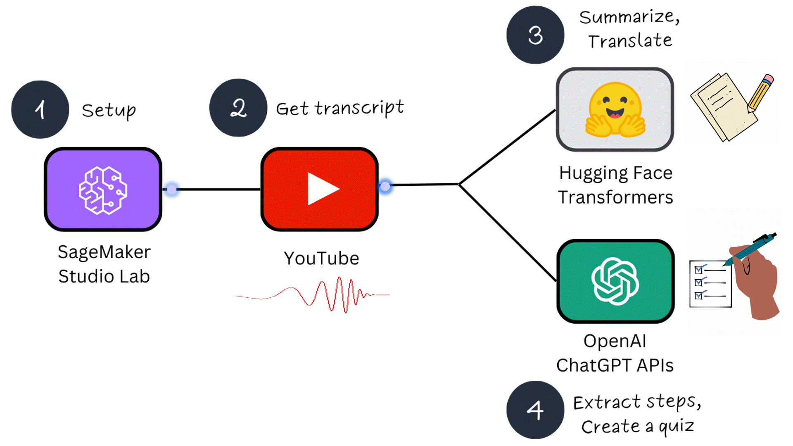
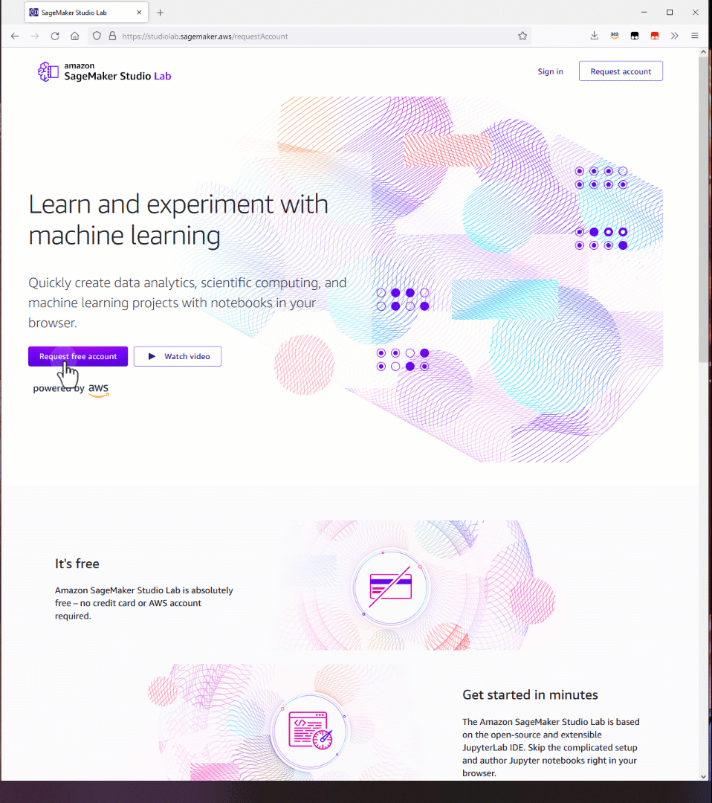
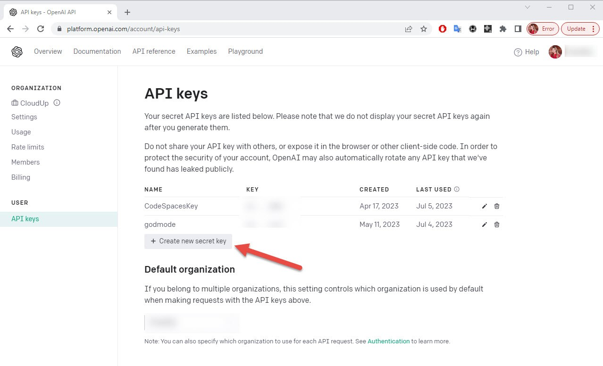
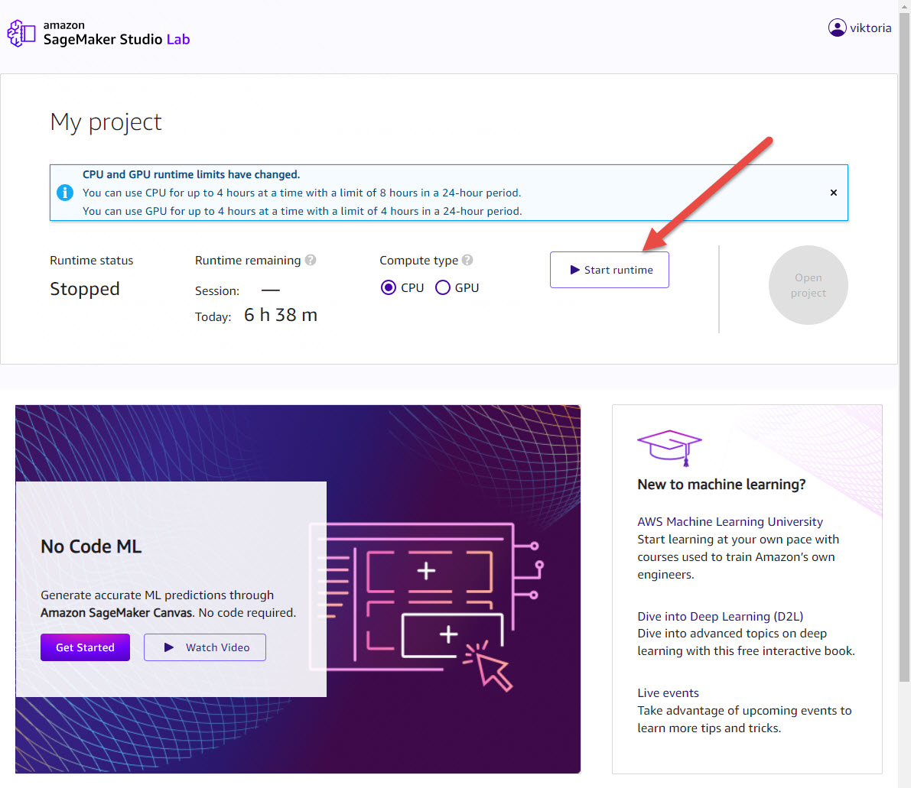
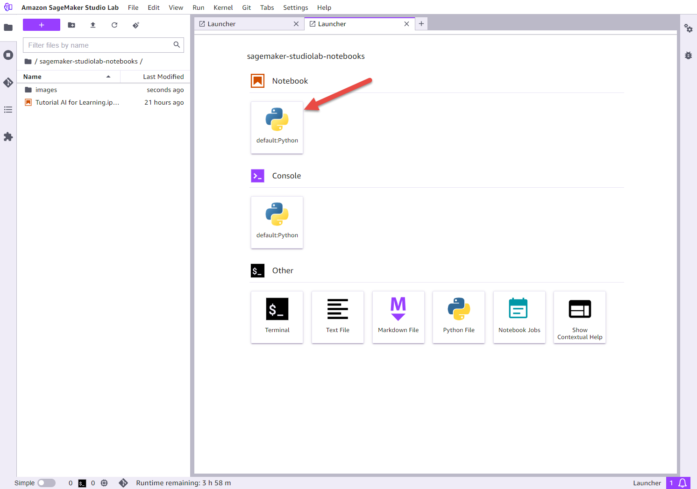
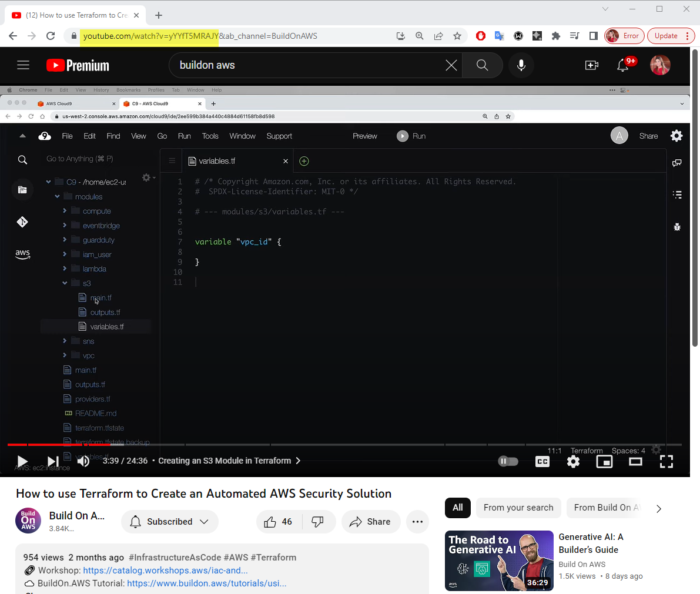
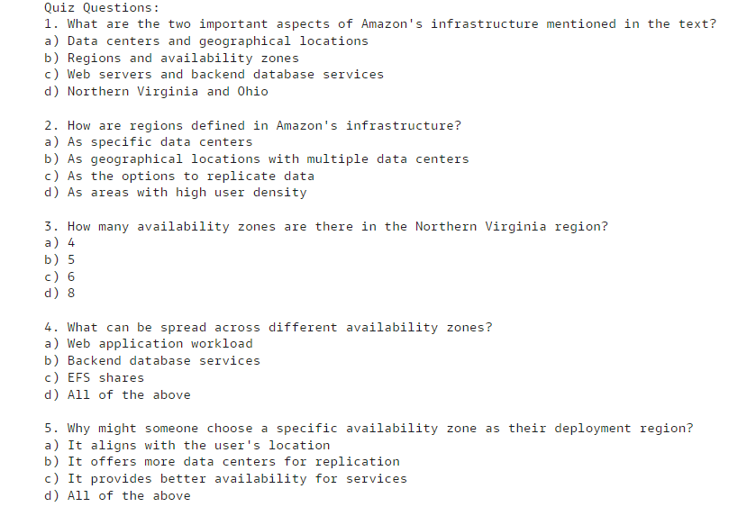

When was the last time you watched a YouTube video to learn something new? According to a [recent survey](https://www.techsmith.com/blog/video-statistics/) most respondents view videos 2-to-4 times per week, and [in a 2019 Google study](https://www.thinkwithgoogle.com/marketing-strategies/video/youtube-learning-statistics/), 86% of U.S. viewers said they used YouTube to learn new things.

This shouldn't come as a surprise: YouTube has educational content on pretty much any topic, from academic subjects like math and programming to hands-on projects, tutorials, and preparation for professional certifications.

But as a learning tool, YouTube isn't perfect. Some videos have too many ads and sponsorship interruptions, some are slowed down by non-essential information, while others require viewers to pause frequently just to follow the steps.

Imagine if you could get a concise video summary, review it to determine whether it's worth watching, extract step-by-step guidance so you could easily follow along, and at the end, generate a quiz to test your understanding. Wouldn't that be awesome?

In this tutorial, we will build exactly that!

I will walk you through a step-by-step process on how to configure a free ML development environment using Amazon SageMaker Studio Lab, integrate it with open-source ML models from Hugging Face, and use OpenAI's ChatGPT APIs.

You will be able to apply these steps to other use cases by selecting different ML models or adjusting ChatGPT prompts.

| Attributes                |                                   |
| ------------------- | -------------------------------------- |
| ✅ AWS Level        | Intermediate - 200                         |
| ⏱ Time to complete  | 30 minutes                             |
| 💰 Cost to complete | Free when using the OpenAI API credit or less than $0.10      |
| 🧩 Prerequisites    | - [Amazon SageMaker Studio Lab Account](https://studiolab.sagemaker.aws?sc_channel=el&sc_campaign=datamlwave&sc_geo=mult&sc_country=mult&sc_outcome=acq&sc_content=build-ai-with-hf-chatgpt) <br>-  [Foundational knowledge of Python](https://catalog.us-east-1.prod.workshops.aws/workshops/3d705026-9edc-40e8-b353-bdabb116c89c/)    |                           |
| 📢 Feedback            | <a href="https://pulse.buildon.aws/survey/DEM0H5VW" target="_blank">Any feedback, issues, or just a</a> 👍 / 👎 ?    |
| ⏰ Last Updated     | 2023-07-22                             |

| ToC |
|-----|

## What you will learn

- How to set up free ML Dev Environment
- How to utilize pretrained open-source ML models
- How to use ChatGPT APIs

## Solution Overview

This tutorial consists of 4 parts:

- Part 1 - Setup: SageMaker Studio Lab and OpenAI API keys
- Part 2 - Obtaining a YouTube video transcript
- Part 3 - Summarizing and translating a transcript using ML models
- Part 4 - Extracting steps and creating a quiz using ChatGPT APIs



In Part 1, we will configure 2 prerequisites: accessing the [SageMaker Studio Lab Development](https://aws.amazon.com/sagemaker/studio-lab/?sc_channel=el&sc_campaign=datamlwave&sc_geo=mult&sc_country=mult&sc_outcome=acq&sc_content=build-ai-with-hf-chatgpt) environment and creating [OpenAI API](https://platform.openai.com/docs/api-reference) keys for interaction with ChatGPT. What makes SageMaker Studio Lab special is that it is completely free and separate from an AWS account. If you are new to machine learning, this free service is a fantastic way to get started!

In Part 2, we will create a machine learning project that allows writing code directly from your browser, eliminating the need for a local setup. You will also learn how to run the code on CPU or GPU cloud instances. We will create a notebook, install libraries, and start experimenting.

In Part 3, you will learn how to use open-source models from the [Hugging Face Hub](https://huggingface.co/models) for inference. We will utilize pre-trained sequence-to-sequence models to [summarize](https://huggingface.co/tasks/summarization) YouTube transcripts and [translate](https://huggingface.co/learn/nlp-course/chapter7/4?fw=tf) them to a different language.

In Part 4, we will experiment with ChatGPT APIs. We will discuss prompt engineering and leverage the ChatGPT APIs to generate a step-by-step guide from a YouTube video. Additionally, we will create a quiz to test your understanding of the material.

> Note: We will be using free resources in this tutorial. The only potential cost that you may incur is for utilizing ChatGPT APIs if you already consumed all free credits - in which case it will cost a few cents. When you create an OpenAI account, you will be given $5 to use within the first 3 months. This is enough to run hundreds of API requests.

Let’s get started!

## Part 1 - Setup: SageMaker Studio Lab and OpenAI API Keys

To get started, go to the [Studio Lab landing page](https://studiolab.sagemaker.aws?sc_channel=el&sc_campaign=datamlwave&sc_geo=mult&sc_country=mult&sc_outcome=acq&sc_content=build-ai-with-hf-chatgpt) and click `Request free account`. Fill in the required information in the form and submit your request. You will receive an email to verify your email address. Follow the instructions in the email.

> Please note that your account request needs to be approved before you can register for a Studio Lab account. The review process typically takes up to 5 business days. Once your account request is approved, you will receive an email containing a link to the Studio Lab account registration page. This link will remain active for 7 days after your request is approved.



To integrate and use Open AI models in your application, you need to register an [OpenAI account](https://platform.openai.com/signup/). Once you have completed the registration and sign-up process, you will need to create an API key. This API key is essential as it enables you to send requests to OpenAI from third-party services.

Navigate to the [OpenAI API keys](https://platform.openai.com/account/api-keys) page and click `Create new secret key`. Provide a name, copy the key and save it. You won’t be able to access the key again!

> Please note that OpenAI currently offers a $5 credit for new users, allowing you to start experimenting with their APIs at no cost. This credit is available for use during the first 3 months of your account. After the initial 3-month period, the pricing will transition to a pay-as-you-go model. To get detailed information about the rates and pricing structure, I recommend visiting the [pricing page](https://openai.com/pricing) on the OpenAI website.

You can set usage limits and monitor your current usage by visiting the [Usage Limits page](https://platform.openai.com/account/billing/limits).



In this tutorial, we will be utilizing the [GPT-3.5 Turbo](https://platform.openai.com/docs/guides/gpt/chat-completions-api) model. As shown in the table below, API calls for this model are priced at a fraction of a cent. With the free credit of $5, you will be able to run hundreds of experiments at no cost!

| Model       | Input               | Output             |
|-------------|---------------------|--------------------|
| 4K context  | $0.0015 / 1K tokens | $0.002 / 1K tokens |
| 16K context | $0.003 / 1K tokens  | $0.004 / 1K tokens |

## Part 2 - Obtaining a YouTube Video Transcript

Once you have obtained access to the Studio Lab, sign into [Amazon SageMaker Studio Lab](https://studiolab.sagemaker.aws?sc_channel=el&sc_campaign=datamlwave&sc_geo=mult&sc_country=mult&sc_outcome=acq&sc_content=build-ai-with-hf-chatgpt).

Under **My Project**, you can select a compute type and start project runtime based on a cloud compute instance. Studio Lab provides the option to choose between a CPU (Central Processing Unit) designed for compute intensive algorithms and a GPU (Graphical Processing Unit) which is recommended for deep learning tasks, particularly transformers and computer vision.

Select **GPU** instance; it will significantly reduce execution time. Click **Start runtime**. Then click **Open project**. You may be required to solve a CAPTCHA puzzle when you start runtime. If at any moment you need to take a break, click **Stop runtime** as GPU usage is limited to 4 hours per day. Your work will be saved.



A project contains files and folders, including Jupyter notebooks. The image below shows the Studio Lab Launcher. Click **on default: Python** under Notebook. A new notebook will be created.

Let’s give the notebook a name and save it. From the Studio Lab menu, choose **File**, choose **Save File As**, and then choose folder and give it name. For example, `learn-with-ai.ipynb`.



First, we will use pip to install all the packages required to complete this tutorial. Copy the code provided below and press `Shift + Enter` or click the `Play` button at the top to execute it.

```python
#installing libraries

!pip install python-dotenv
!pip install openai
!pip install youtube_dl
!pip install youtube_transcript_api
!pip install torchaudio
!pip install sentencepiece
!pip install sacremoses
!pip install transformers

```

Next, let's import all the necessary dependencies. Copy and run the following code:

```python
#importing dependencies

import re
from youtube_transcript_api import YouTubeTranscriptApi
import torch
import torchaudio
import openai
import textwrap
from transformers import pipeline
```

We've completed all the required setup!

Now we're ready to work on the second task as marked on the solution overview, which is to obtain a transcript of a YouTube video. I used [this educational video about AWS Regions and Availability Zones](https://www.youtube.com/watch?v=b9rs8yzpGYk). You can choose a different video and replace the link in the `youtube_url` variable. To get a YouTube video url, copy the URL up to the "&" sign, as shown in the screenshot below.

> Note: I recommend starting with a video that is under 30 minutes. This will allow you to complete the tutorial more quickly, as executing commands for longer videos will take more time.



Copy and run the following code:

```python
# Specify the YouTube video URL
youtube_url = "https://www.youtube.com/watch?v=b9rs8yzpGYk"

# Extract the video ID from the URL using regular expressions
match = re.search(r"v=([A-Za-z0-9_-]+)", youtube_url)
if match:
    video_id = match.group(1)
else:
    raise ValueError("Invalid YouTube URL")

# Get the transcript from YouTube
transcript = YouTubeTranscriptApi.get_transcript(video_id)

# Concatenate the transcript into a single string
transcript_text = ""
for segment in transcript:
    transcript_text += segment["text"] + " "
print(transcript_text)
```

This code checks if the URL link is valid and then uses the `YouTubeTranscriptApi.get_transcript(video_id)` method to retrieve the YouTube transcript using the YouTube API. This method provides accurate and official captions associated with the video.

## Part 3 - Summarizing and Translating a Transcript Using ML Models

Now that we have the full transcript of the YouTube video, we can proceed to utilize open-source models for natural language processing tasks, such as summarization, translation, and more. These models will help us to extract valuable insights from the transcript.

We will be using the [Transformers](https://huggingface.co/docs/transformers/index) library from Hugging Face 🤗. Hugging Face is a leading platform that specializes in natural language processing (NLP) and provides state-of-the-art models, tools, and libraries for building and deploying NLP applications. Transformers provides APIs and tools to easily download  pretrained models. By using pretrained models, you can significantly reduce your compute costs and carbon footprint - and you can save valuable time and resources that would otherwise be required to train a model from scratch.

Let's assume that English is not your first language, and you would like to translate the YouTube transcript to Spanish. To achieve this, we can utilize a pretrained machine learning model specifically designed for translation. Translation involves converting a sequence of text from one language to another. It is a task that can be formulated as a sequence-to-sequence problem. By leveraging a pretrained sequence-to-sequence translation model, we can effectively translate the YouTube transcript from English to Spanish.

 Hugging Face offers a wide range of over [2,500 translation models](https://huggingface.co/models?pipeline_tag=translation&sort=trending) to choose from. These models cover various languages. You can try different pretrained translation models by updating the `model_checkpoint` variable in the code below.

Copy and run the code below. It may take a few minutes to complete, depending on the length of a transcript.

```python
from transformers import pipeline

# Replace this with your own checkpoint
model_checkpoint = "Helsinki-NLP/opus-mt-en-es"
translator = pipeline("translation", model=model_checkpoint)

# Define the maximum sequence length
max_length = 512

# Split the input text into smaller segments
segments = [transcript_text[i:i+max_length] for i in range(0, len(transcript_text), max_length)]

# Translate each segment and concatenate the results
translated_text = ""
for segment in segments:
    result = translator(segment)
    translated_text += result[0]['translation_text']

print(translated_text)
```

Next, we will proceed with summarizing the video using a pretrained model for text [summarization](https://huggingface.co/docs/transformers/tasks/summarization#inference). In this case, I will be using the original transcript in English. However, if you choose to continue with a translated transcript, you can replace the `transcript_text` variable with the `translated_text` variable that contains the translated text. By applying the summarization model to the transcript, we can generate a concise summary of the video's content.

Copy and run the code below. Wait until you see a summary.

```python
from transformers import pipeline, AutoTokenizer

# Instantiate the tokenizer and the summarization pipeline
tokenizer = AutoTokenizer.from_pretrained('stevhliu/my_awesome_billsum_model')
summarizer = pipeline("summarization", model='stevhliu/my_awesome_billsum_model', tokenizer=tokenizer)

# Define chunk size in number of words
chunk_size = 200 # you may need to adjust this value depending on the average length of your words

# Split the text into chunks
words = transcript_text.split()
chunks = [' '.join(words[i:i+chunk_size]) for i in range(0, len(words), chunk_size)]

# Summarize each chunk
summaries = []
for chunk in chunks:
    # Summarize the chunk
    summary = summarizer(chunk, max_length=100, min_length=30, do_sample=False)

    # Extract the summary text
    summary_text = summary[0]['summary_text']

    # Add the summary to our list of summaries
    summaries.append(summary_text)

# Join the summaries back together into a single summary
final_summary = ' '.join(summaries)

print(final_summary)
```

We were able to get a concise summary of the video's content, excluding any sponsorships, advertisements, or other extraneous information. This enables us to quickly grasp the key points and main ideas from the video without being slowed down by unnecessary details. Well done on achieving this accomplishment!

We are now ready to move on to the final step, Step 4, where we will re-generate a summary to compare results from OpenAI vs an open-source model, as well as create a step-by-step tutorial based on the summarized transcript and a quiz to test our understanding and gained knowledge.

## Part 4 - Extracting Steps and Creating a Quiz Using ChatGPT APIs

To begin experimenting with ChatGPT, you will need to retrieve the API keys that you created in Part 1 and replace the value within the quotation marks for the `openai.api_key` variable in your code.

Let's obtain a video summary using the ChatGPT model and compare it to the summary we obtained in the previous step using open-source models.

> Note: I recommend utilizing the [OpenAI Playground](https://platform.openai.com/playground) to further explore and experiment with the OpenAI API models. The OpenAI Playground is a user-friendly web-based tool that allows you to test prompts and gain familiarity with the API's functionalities. It provides an interactive environment to fine-tune your prompts and observe the model's responses.

```python
def split_text_into_chunks(text, max_chunk_size):
    return textwrap.wrap(text, max_chunk_size)

openai.api_key = "provide your key here"
max_chunk_size = 4000

transcript_chunks = split_text_into_chunks(transcript_text, max_chunk_size)
summaries = ""

for chunk in transcript_chunks:
    response = openai.ChatCompletion.create(
        model="gpt-3.5-turbo-16k",
        messages=[
            {"role": "system", "content": "You are a helpful assistant."},
            {"role": "user", "content": f"{chunk}\n\nCreate short concise summary"}
        ],
        max_tokens=250,
        temperature=0.5
    )

    summaries += response['choices'][0]['message']['content'].strip() + " "

print("Summary:")
print(summaries)
```

Which summary do you think is better?

I found a summary created by ChatGPT to be much more insightful.

We can proceed by modifying the prompts and instructing ChatGPT to extract the necessary steps from the video transcript. By doing so, we can generate a step-by-step guide that provides clear instructions for us to follow along. This will help us to have a structured, guided approach while engaging with the video content.

The `system` parameter represents the instructions or context provided to the model to guide its behavior. It sets the overall behavior, tone, or role of the AI assistant. For example: "You are a technical instructor that provides step-by-step guidance". This helps set the expectation for the AI model and provides guidance on how it should respond.

The `user` parameter represents the input from the user. It is where you provide your specific requests, questions, or instructions to the AI model. For example, you might use a `user` prompt like, "Generate steps to follow from the transcript text".

```python
response = openai.ChatCompletion.create(
model="gpt-3.5-turbo-16k",
messages=[
{"role": "system", "content": "You are a technical instructor."},
{"role": "user", "content": transcript_text},
{"role": "user", "content": "Generate steps to follow from text."},
]
)

# The assistant's reply
guide= response['choices'][0]['message']['content']

print("Steps:")
print(guide)
```

To finish our experiment, let’s generate a quiz based on the materials covered in the video. The quiz will assess our understanding of the content.

```python
response = openai.ChatCompletion.create(
model="gpt-3.5-turbo-16k",
messages=[
{"role": "system", "content": "You are a helpful assistant that generates questions."},
{"role": "user", "content": transcript_text},
{"role": "user", "content": "Generate 10 quiz questions based on the text with multiple choices."},
]
)

# The assistant's reply
quiz_questions = response['choices'][0]['message']['content']

print("Quiz Questions:")
print(quiz_questions)
```

You will see a quiz with 10 question generated to test your knowledge. This can be especially helpful if you are preparing for exams. You can modify a prompt to explain the right answers - for example: "Generate 10 quiz questions based on the text with multiple choices and explain why a particular answer is the right one".



## Conclusion

Well done! You have successfully completed this tutorial and learned how to get started with ML projects using Jupyter notebooks, integrating open-source models from the Hugging Face library and leveraging ChatGPT APIs to develop your own creative AI/ML solutions.

As you continue your AI journey, I suggest exploring the Hugging Face library which hosts over 250,000 models. You can apply them to all sorts of different use cases. For instance, you can experiment with [text-to-image](https://huggingface.co/docs/diffusers/using-diffusers/conditional_image_generation) generation to create visuals for each quiz question, or you can synthesize an audio file from a transcript summary by using [text-to-speech](https://huggingface.co/tasks/text-to-speech) models.

The only limit now is your imagination!

Thank you for reading this tutorial, and I hope that it equipped you with practical skills to embark on your AI/ML journey.

## About the Author

Viktoria is a Senior Developer Advocate and passionate about helping developers to build and innovate using new technologies. She is a content creator and frequently shares content on [LinkedIn](https://www.linkedin.com/in/semaan/). Viktoria has been named one of the Top Cloud Influencers and one of the [Top 10 LinkedIn Female Content Creator WorldWide](https://app.favikon.com/creators-tops/women-content-creators/all-niches/linkedin/).

If you have feedback, <a href="https://pulse.buildon.aws/survey/DEM0H5VW" target="_blank">please send it my way!</a>
