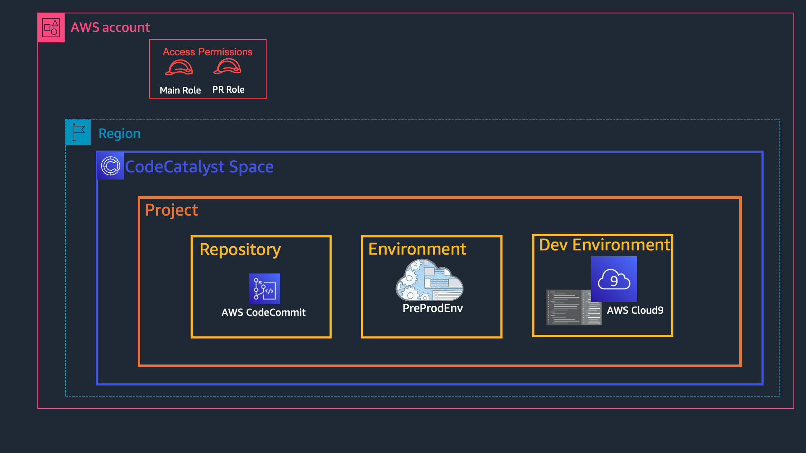
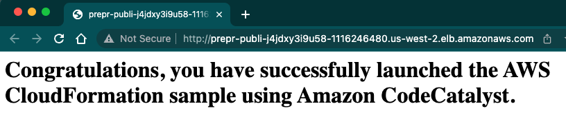

Infrastructure as Code (IaC) has been revolutionary for over a decade now. We can define our Cloud Infrastructure in a template file in YAML/JSON and use services like AWS CloudFormation to create the infrastructure. This is great as now I don't have to click in the AWS Management Console to set up everything, or create scripts and run using the CLI.

However, we are not done yet. Just writing CloudFormation templates and updating stacks manually is not using the ultimate superpower of defining IaC. The real purpose of defining IaC is to go through the same CI/CD pipeline as an application does during software development, applying the same versioning, track changes, code reviews, test, rollbacks to the infrastructure code. This will help you make your infrastructure more repeatable, reliable, consistent, increase in speed of deployments, reduce errors and eliminate configuration drift.

This tutorial will show you how to set up a CI/CD pipeline using Amazon CodeCatalyst for your Infrastructure as Code written with CloudFormation. The pipeline will utilize pull requests to submit, test, and review any changes requested to the infrastructure.


## Table of Contents

| Attributes             |                                                                 |
|------------------------|-----------------------------------------------------------------|
| ✅ AWS experience      | 100 - Beginner                                              |
| ⏱ Time to complete     | 30 minutes                                                      |
| 💰 Cost to complete    | Free tier eligible                                               |
| 🧩 Prerequisites       | - [AWS Account](https://portal.aws.amazon.com/billing/signup#/start/email)<br>- [CodeCatalyst Account](https://codecatalyst.aws)|
| 💻 Code Sample         | Code sample used in tutorial on [GitHub](https://github.com/build-on-aws/ci-cd-iac-cloudformation)                            |
| 📢 Feedback            | <a href="https://pulse.buildon.aws/survey/DEM0H5VW" target="_blank">Any feedback, issues, or just a</a> 👍 / 👎 ?    |
| ⏰ Last Updated        | 2023-03-02                                                      |

| ToC |
|-----|


## Pre-requisites

#### <b> AWS account. </b>
 Before we begin, ensure you have an AWS Account. You can create a new account by signing up [here]().

#### <b>CodeCatalyst account. </b>

Follow steps in the documentation to set [Setting up CodeCatalyst](https://docs.aws.amazon.com/codecatalyst/latest/userguide/setting-up-topnode.html)


#### <b>IAM Roles </b>
We need to create CloudCatalyst service roles in our AWS account. These will be using these to provide permission to CodeCatalyst. This is one time activity only.

Simply deploy a CloudFormation stack named `CodeCatalyst-IAM-roles` in any region with the template provided [here](https://raw.githubusercontent.com/build-on-aws/ci-cd-iac-cloudformation/cloudformation-templates/IAM_roles_CodeCatalyst.json). This will create 2 new AWS Identity and Access Management (IAM) roles - `main_branch_IAM_role` and `pr_branch_IAM_role` in your AWS account.

> Please note, the `main_branch_IAM_role` provides full access to AWS resources in EC2 and CloudFormation services, as those will be used by sample CloudFormation template mentioned in this blog. Please use this role carefully and delete it when not required.

## Getting started

### Setting up a CodeCatalyst Space, Project, Repo, Environment 
Before we create the CI/CD pipeline and workflows, lets setup CodeCatalyst. 


#### <b>Space </b>
Lets start with our CodeCatalyst Space. A space represents you, your company, department or group and your development teams can manage projects inside it. 

Create a new space by clicking on `Create Space` on the [CodeCatalyst Dashboard](https://codecatalyst.aws), add a name(we will use `CloudFormation CodeCatalyst`), add the AWS Account ID to link for billing. Follow the prompts to link your AWS Account with CodeCatalyst.

Please note, `012345678901` is a placeholder, replace it with your own account ID. You can find your account ID in the top right of your AWS Console. Before you can create the space, follow the `Verify in the AWS console` link and complete the verification! You should get green tick to proceed!

At the time of writing this blog, CodeCatalyst is in public preview, and only one region is currently supported.


</br>

Once the space is created, goto the `AWS Accounts` tab, click on your account ID and then click on `Manage roles from the AWS Management Console`. 

This will open a new browser tab to `Add IAM role to Amazon CodeCatalyst space`. In the dialog, select option `Add an existing role you have created in IAM` and select the `main_branch_IAM_role` from the dropdown. Click `Add role`. 
Follow same steps for the `pr_branch_IAM_role`. 


 
#### <b>Project </b>
Next, we create a new Project inside the space. We can have multiple projects inside a space.

To create a project click on the `Create Project` button, select `Start from scratch`, and give your project a name - we will use `CloudFormationCodeCatalyst` `ThreeTierApp`


</br>
 
#### <b>Repository</b> 
Now we create a new repository for our code - in our case the CloudFormation template and other resources. Click `Code` in the left-side navigation menu, then select `Source repositories`, `Add repository` and choose `Create repository`. Set a repository name ( we will use `3-tier-app` in this tutorial), add a description and any files for the .gitignore file :


</br>
 
#### <b>Environment </b>
Lastly, we need to setup the AWS environment where our CloudFormation stack will be deployed by automated workflows. 
From the left navigation panel, select `CI/CD`, `Environments` and click on `Create Environment`. In the Environment details enter following :
- Environment name : `PreProdEnv`
- Environment type : `Non-production`
- Description : `Preprod environment to learn, test and experiment with CloudFormation`
- AWS account connection 
    - `Connection` : Select the AWS account ID that will be used in the workflows to deploy this environment


</br>

## Setting up a Dev Environment

To work on our infrastructure as code with CloudFormation, we need a <b>Dev Environment</b>. You have option to use following support IDEs (Integrated Development Environments) : 
- AWS Cloud9
- Visual Studio Code
- JetBrains IDEs
  - IntelliJ IDEA Ultimate
  - GoLand
  - PyCharm Professional

For this blog, we will be using AWS Cloud9 for our development environment. 

From the left navigation panel, select `Code`, `Dev Environments`, and click on `Create Dev Environment`. In the `Create dev environment and open with AWS Cloud9` dialog box select following : 
- Repository : `Clone a repository` 
- Repository : Select the repo that you want to clone. We created a repo `3-tier-app1` above, so select same. 
- Branch : `Work in existing branch` <s>or Work in new branch.</s> 
- Alias : `bootstrap`

By default, it will launch a Small (2vCPU, 4 GB RAM), 16 Gib storage with 15minutes timeout. You can optionally configure the development environment.

 


</br>

Click on `Create` and it will open a new Cloud9 dev environment. It will take a minute or two, so grab a coffee before we start the CloudFormation magic. 


</br>
On the welcome screen, you can modify the Dev Environment Settings if you want.   
</br>
</br>

You will find an empty repository `3-tier-app`, with a readme.md, devfile.yaml and some hidden folders. The `devfile.yaml`, contains the definition to build your application libraries and toolchain. 

### Sample CloudFormation template

You can use your own CloudFormation template, or simply use one of the sample templates. 

For this blog, I am using the a [sample template](https://raw.githubusercontent.com/build-on-aws/ci-cd-iac-cloudformation/cloudformation-templates/VPC_AutoScaling_With_Public_IPs.json) that deploys a VPC with 2 subnets and publicly accessible Amazon EC2 instances that are in an Auto Scaling group behind a Load Balancer from. Feel free to use the same as I will be making changes to this template and run a pull request workflow.

>In real world, you would deploy the networking infrastructure and application deployment in separate CloudFormation templates. However, to keep your first deployment with CodeCatalyst simple, lets deploy everything in a single template.

Let's ensure we commit our changes to our git repo using the following commands:
```bash
# go to the root folder of the repo and run following

$ cd 3-tier-app/
$ wget https://raw.githubusercontent.com/build-on-aws/ci-cd-iac-cloudformation/cloudformation-templates/VPC_AutoScaling_With_Public_IPs.json

# check git status
$ git status

# add changed files, commit and push to the git repo
$ git add . -A
$ git commit -m "Adding main branch workflow"
$ git push
```

**Output :** 
```bash
$ git status
On branch main
Your branch is up to date with 'origin/main'.

Untracked files:
  (use "git add <file>..." to include in what will be committed)
        VPC_AutoScaling_With_Public_IPs.json

nothing added to commit but untracked files present (use "git add" to track)

$ git add .
$ git commit -m "Uploading first CloudFormation template"
[main eca3764] Uploading first CloudFormation template
 1 file changed, 560 insertions(+)
 create mode 100644 VPC_AutoScaling_With_Public_IPs.json

$ git push
Enumerating objects: 4, done.
Counting objects: 100% (4/4), done.
Delta compression using up to 2 threads
Compressing objects: 100% (3/3), done.
Writing objects: 100% (3/3), 4.59 KiB | 4.59 MiB/s, done.
Total 3 (delta 0), reused 0 (delta 0), pack-reused 0
remote: Validating objects: 100%
To https://git.us-west-2.codecatalyst.aws/v1/CloudFormation-CodeCatalyst/ThreeTierApp/3-tier-app
   cbbfab7..eca3764  main -> main
```
</br>

You can verify in the CodeCatalyst console if the CloudFormation template is successfully updated in the repo.

</br>

## Setting up workflows to deploy non-prod environment

Next step is to created automated workflows. The intention is whenever a commit is push to the main branch, trigger automated actions. In our case, we are defining only one action - deploy the updated CloudFormation template and/or update the stack.

Now you have 2 options for creating a workflow : 
1. Create Workflow using Code Catalyst Console in Visual drag-drop method [navigate to CI/CD -> Workflows]
2. Create Workflow using the dev environment using yaml [the method we are following in the blog]

To create the workflow, create a hidden folder in your repo and add a `main_branch.yaml` file:

```bash
# go to the root folder of the repo and run following

mkdir -p .codecatalyst/workflows
touch .codecatalyst/workflows/main_branch.yaml
```

Open `.codecatalyst/workflows/main_branch.yaml` in your IDE, and add the following - remember to replace the placeholder AWS account ID `123456789012` with the value of your account, and the IAM role name `main_branch_IAM_role`, if you changed it :

* main_branch.yaml
``` yaml
Name: Main_Branch_Workflow
SchemaVersion: "1.0"

# Optional - Set automatic triggers.
Triggers:
  - Type: Push
    Branches:
      - main

# Required - Define action configurations.
Actions:
  DeployAWSCloudFormationstack_7c:
    Identifier: aws/cfn-deploy@v1
    Configuration:
      parameter-overrides: KeyName=testKey,SSHLocation=54.10.10.2/32,WebServerInstanceType=t2.micro
      capabilities: CAPABILITY_IAM,CAPABILITY_NAMED_IAM,CAPABILITY_AUTO_EXPAND
      template: VPC_AutoScaling_With_Public_IPs.json
      region: us-west-2
      name: PreProdEnvStack
    Timeout: 10
    Environment:
      Connections:
        - Role: main_branch_IAM_role
          Name: "123456789012"
      Name: PreProdEnv
    Inputs:
      Sources:
        - WorkflowSource
```

In the workflow, we have provided parameter values for the CloudFormation stack creation. If you are using your own template, make sure you modify the parameter-overrides section and the template name accordingly.

Let's try out our new workflow! 

First, we need to stage, commit, and push our changes directly to the main branch - this is needed as only workflows committed to the repo will be run by CodeCatalyst. 

Use the following commands:
```bash
$ git add . -A
$ git commit -m "Adding main branch workflow"
$ git push
```

**Output :** 

```bash
$ git add . -A
$ git commit -m "Adding main branch workflow"
[main 5677f67] Adding main branch workflow
 1 file changed, 28 insertions(+)
 create mode 100644 .codecatalyst/workflows/main_branch.yaml
$ git push
Enumerating objects: 6, done.
Counting objects: 100% (6/6), done.
Delta compression using up to 2 threads
Compressing objects: 100% (3/3), done.
Writing objects: 100% (5/5), 911 bytes | 455.00 KiB/s, done.
Total 5 (delta 0), reused 0 (delta 0), pack-reused 0
remote: Validating objects: 100%
To https://git.us-west-2.codecatalyst.aws/v1/CloudFormation-CodeCatalyst/ThreeTierApp/3-tier-app
   eca3764..5677f67  main -> main
```


In your browser, navigate to the `CI/CD` -> `Workflows` page. You should see the workflow running:


 
</br>
 
If you click on Recent runs to expand it, you will see the details of the currently running job. Click on the job ID (Run-XXXXX) to view the different stages of the build:


 
</br>
 
It will take sometime for CodeCatalyst to go through all the stages and deploy the CloudFormation stack. The stack deployment time depends on the resources defined in the template. For example, this deployment was done in 3mins 48 seconds. 

Great our CloudFormation stack is successfully deployed by the Workflow! You can find the CloudFormation outputs in the `Variables` tab. 


 
</br>
 
If you open the Website link, you can access the sample application deployed by this template. 

 
</br>
 
> It might happen that the run fails due to errors. Read through the logs, to understand the issue and remediate it. If you get internal error, at this point it is good to check the  stack deployment in the CloudFormation dashboard of AWS Management Console. If the CloudFormation stack has rolled back, then delete the stack manually, fix the issues and run workflow again. You can find help in [Documentation for Troubleshooting](https://docs.aws.amazon.com/codecatalyst/latest/userguide/troubleshooting.html), [Premium Support center](https://support.console.aws.amazon.com/support/home#/) or [AWS re:Post](https://repost.aws/tags/TAT_2FdxcETxyhEvwsLjVZaA/amazon-code-catalyst). 


## Make code changes with Pull Request Workflow
Lets say you now want to make changes to the infrastructure. For example, we want to add a third subnet to the VPC, update LoadBalancer and Autoscaling groups to use it. 

As a **best practice**, you should never make changes directly to the main branch. We should always create a separate branch on which changes will be done, and once these changes are approved by reviewers they will be merged with main branch. There are many git branching strategies that you can explore and use for your specific org/team needs. 

For this blog, I am keeping it simple. I am creating a Pull Request (PR) from the main branch, anytime I need to make changes. Also, remember this is my non-prod environment. You might have different strategies and more tests for your production environment deployment.


"Branches and workflows used in the blog"

We are going to first write a PR workflow, so that anytime a new Pull request is created CodeCatalyst will first run this workflow. In this PR workflow, we are **NOT deploying** any changes to the PreProdEnv. When a PR is opened or revised, we are simply creating a CloudFormation changeset. 

Notice the `no-execute-changeset: "1"`option in the workflow below, it indicates whether to run the change set or have it reviewed. Default is `'0'`, which means it will run the change set. We don't want it to execute the changes, we just want to see the changes that will happen if PR is merged, hence we set it to `'1'`, do not execute the changeset.

Create a new file `pr_branch.yaml` in the hidden `.codecatalyst/workflows/` directory and paste following. 

Remember to replace the placeholder AWS account ID `123456789012` with the value of your account, and the IAM role name `pr_branch_IAM_role`, if you changed it :

* pr_branch.yaml
```yaml
Name: PR_Branch_Workflow
SchemaVersion: "1.0"

# Optional - Set automatic triggers.
Triggers:
  - Type: PULLREQUEST
    Branches:
      - main
    Events:
      - OPEN
      - REVISION

# Required - Define action configurations.
Actions:
  DeployAWSCloudFormationstack_7c:
    Identifier: aws/cfn-deploy@v1
    Configuration:
      parameter-overrides: KeyName=testKey,SSHLocation=54.10.10.2/32,WebServerInstanceType=t2.micro
      capabilities: CAPABILITY_IAM,CAPABILITY_NAMED_IAM,CAPABILITY_AUTO_EXPAND
      no-execute-changeset: "1"
      template: VPC_AutoScaling_With_Public_IPs.json
      region: us-west-2
      name: PreProdEnvStack
    Timeout: 10
    Environment:
      Connections:
        - Role: pr_branch_IAM_role
          Name: "123456789012"
      Name: PreProdEnv
    Inputs:
      Sources:
        - WorkflowSource
```
</br>
 
Now stage, commit, and push our changes directly to the main branch using following commands:
``` bash
$ git add . -A
$ git commit -m "Adding PR branch workflow"
$ git push
```

**Output :** 
``` bash
$ git add . -A
$ git commit -m "Adding PR branch workflow"
[main e844b70] Adding PR branch workflow
 1 file changed, 1 insertion(+), 1 deletion(-)
$ git push
Enumerating objects: 9, done.
Counting objects: 100% (9/9), done.
Delta compression using up to 2 threads
Compressing objects: 100% (4/4), done.
Writing objects: 100% (5/5), 451 bytes | 225.00 KiB/s, done.
Total 5 (delta 2), reused 0 (delta 0), pack-reused 0
remote: Validating objects: 100%
To https://git.us-west-2.codecatalyst.aws/v1/CloudFormation-CodeCatalyst/ThreeTierApp/3-tier-app
   d410f15..e844b70  main -> main
```
</br>
 
CodeCatalyst will then create another workflow. You can confirm this from the CodeCatalyst console CI/CD -> Workflow. You can see that `PR_Branch_Workflow`  is created but it has not run.


</br>
 
Now lets go back to our Dev Environment and make changes to our infrastructure - add a third subnet to the VPC and update resources.

Before we start making changes to the CloudFormation template, ensure we have created a new test-pr-workflow branch. 

**Output :** 
``` bash
$ git checkout -b test-pr-workflow
Switched to a new branch 'test-pr-workflow'
```

### Make changes to Cloudformation template

- If you are using your own CloudFormation template, make any changes to the template to create a change set.

- For the sample CloudFormation template used in this blog,
  - simply replace its content with [this already modified template](https://raw.githubusercontent.com/build-on-aws/ci-cd-iac-cloudformation/cloudformation-templates/VPC_AutoScaling_With_Public_IPs-3-subnets.json). Make sure the name of template file is same(*VPC_AutoScaling_With_Public_IPs.json*), as workflow has filename mentioned in it, or
  - you can make following changes to the template :

    Add following JSON code to the sample CloudFormation template under `Resources` section. 

      ``` JSON
        "PublicSubnet3" : {
          "Type" : "AWS::EC2::Subnet",
          "Properties" : {
            "VpcId" : { "Ref" : "VPC" },
            "CidrBlock" : { "Fn::FindInMap" : [ "SubnetConfig", "Public3", "CIDR" ]},
            "AvailabilityZone" : {"Fn::Select": [2, {"Fn::GetAZs": ""}]},
            "Tags" : [
              { "Key" : "Application", "Value" : { "Ref" : "AWS::StackId" } },
              { "Key" : "Network", "Value" : "Public" }
            ]
          }
        },
        "PublicSubnetRouteTableAssociation3" : {
          "Type" : "AWS::EC2::SubnetRouteTableAssociation",
          "Properties" : {
            "SubnetId" : { "Ref" : "PublicSubnet3" },
            "RouteTableId" : { "Ref" : "PublicRouteTable" }
          }
        },
        "PublicSubnetNetworkAclAssociation3" : {
          "Type" : "AWS::EC2::SubnetNetworkAclAssociation",
          "Properties" : {
            "SubnetId" : { "Ref" : "PublicSubnet3" },
            "NetworkAclId" : { "Ref" : "PublicNetworkAcl" }
          }
        },
      ```
 
     In the Mappings, LoadBalancer and AutoScaling resources, add the `PublicSubnet3` like following :

    ```JSON
        "Mappings" : {
          "SubnetConfig" : {
            "VPC"     : { "CIDR" : "10.0.0.0/16" },
            "Public1" : { "CIDR" : "10.0.0.0/24" },
            "Public2" : { "CIDR" : "10.0.1.0/24" },
            "Public3" : { "CIDR" : "10.0.2.0/24" } 
          },
            ...
    ```

    ```JSON
        "WebServerFleet" : {
          "Type" : "AWS::AutoScaling::AutoScalingGroup",
          "DependsOn" : "PublicRoute",
          "Properties" : {
            "VPCZoneIdentifier" : [{ "Ref" : "PublicSubnet1" }, { "Ref" : "PublicSubnet2" },  { "Ref" : "PublicSubnet3" }],
            ...
    ```
    ```JSON
        "PublicApplicationLoadBalancer" : {
          "Type" : "AWS::ElasticLoadBalancingV2::LoadBalancer",
          "Properties" : {
            "Subnets" : [ { "Ref" : "PublicSubnet1"}, { "Ref" : "PublicSubnet2" },  { "Ref" : "PublicSubnet3" }  ],
            "SecurityGroups" : [ { "Ref" : "PublicLoadBalancerSecurityGroup" } ]
          }
        },
    ```
</br>

Now save the modified file and push it to the `test-pr-workflow` branch, using  following commands:
```bash
$ git add .
$ git commit -m "Added third public subnet to VPC, RouteTable, NACL, LoadBalancer and ASG"
$ git push --set-upstream origin test-pr-workflow
``` 
</br> 

**Output :** 

```bash
$ git status
On branch test-pr-workflow
Changes not staged for commit:
  (use "git add <file>..." to update what will be committed)
  (use "git restore <file>..." to discard changes in working directory)
        modified:   VPC_AutoScaling_With_Public_IPs.json

no changes added to commit (use "git add" and/or "git commit -a")

$ git add .
$ git commit -m "Added third public subnet to VPC, RouteTable, NACL, LoadBalancer and ASG"
[test-pr-workflow e1a1d0e] Added third public subnet to VPC, RouteTable, NACL, LoadBalancer and ASG
 1 file changed, 33 insertions(+), 4 deletions(-)

$ git push --set-upstream origin test-pr-workflow
Enumerating objects: 5, done.
Counting objects: 100% (5/5), done.
Delta compression using up to 2 threads
Compressing objects: 100% (3/3), done.
Writing objects: 100% (3/3), 467 bytes | 467.00 KiB/s, done.
Total 3 (delta 2), reused 0 (delta 0), pack-reused 0
remote: Validating objects: 100%
To https://git.us-west-2.codecatalyst.aws/v1/CloudFormation-CodeCatalyst/ThreeTierApp/3-tier-app
 * [new branch]      test-pr-workflow -> test-pr-workflow
branch 'test-pr-workflow' set up to track 'origin/test-pr-workflow'.

```
</br>
 
In the CodeCatalyst Console, navigate to Code -> Repository. You can see the 2 branches main and test-pr-workflow.


</br>
 
## Create Pull Request and merge code
Now that we have all changes in the branch named `test-pr-workflow`, you can ask others to review the changes by creating a pull request. 

Perform following steps to create pull request to compare the changes in the test branch with the main branch. Goto Code -> Pull requests in the CodeCatalyst console. Click on `Create pull request` and enter following details


</br>
 
You can optionally add reviewers to approve/deny the merge.

Note, that our source branch is `test-pr-workflow` and our destination for merge is the main branch. Once this PR is created, it will trigger the `PR_Branch_Workflow` that will create a CloudFormation changeset (and not make any deployments!). You can goto CloudFormation Console, Changeset and verify the changes proposed by the new pull request. 


</br>

A reviewer will confirm the changes and then click on `Merge` 

If there are conflicts, or if the merge can't be completed, the merge button is inactive, and a `Not mergeable` label is displayed.


 
</br>
At this point you have 2 options for merge strategies. :

1. **Fast forward merge** - Merges the branches and moves the destination branch pointer to the tip of the source branch. This is the default merge strategy in Git.
</br>

2. **Squash and merge** - Combines all commits from the source branch into single merge commit in the destination branch.

You can optionally, delete the source branch after merging this pull request. In our case the source branch is `test-pr-workflow` and I am deleting this branch to keep my branching structure clean and simple. 


</br>
 
Once you click on merge, CodeCatalyst will merge the code changes from `test-pr-workflow` to `main` branch. This will trigger the `Main_Branch_Workflow` and deploy the updated CloudFormation code to the `PreProdEnv`.

You can optionally confirm the newly created subnet in the VPC console.


 
</br>
 

## Cleanup

We have now reached the end of this tutorial, you can further explore the features of CodeCatalyst like inviting team members, or creating issues. If you no longer wish to explore further, then delete all the resources we created here. Cleanup CloudFormation stacks in your AWS account. Open the [AWS CloudFormation console](https://console.aws.amazon.com/cloudformation), delete the `PreProdEnvStack` and `CodeCatalyst-IAM-roles`.

To delete the project we created in CodeCatalyst. In the left-hand navigation, go to `Project settings`, click on `Delete project`, and follow the instructions to delete the project.

Lastly, to delete the CodeCatalyst space, goto [CodeCatalyst dashboard](https://codecatalyst.aws/spaces/), then `Space settings` tab and click on `Delete space`.

</br>

## Conclusion

Congratulations! You've now learned how to deploy Infrastructure as Code using CloudFormation with CodeCatalyst, and can deploy any infrastructure changes using a pull request workflow. If you enjoyed this tutorial, found an issues, or have feedback us, [please send it our way!](https://pulse.buildon.aws/survey/DEM0H5VW)