Consider rewriting opening paragraph to hone in on what blog it about. First paragraph infers it's about the Internet and languages bridging communication. But this wonderful blog is more precise. It's about two things: 

1. the challenge of building something from scratch
2. using AWS to build a language translation app. 

I wrote a sample rewrite for the intro:

Half an hour may not seem like enough time for a major project but with AWS you can build and test a language app. There are hundreds of translator apps to help us engage with various cultures, people, and the 7,000+ languages spoken globally. But, building your own app gives you hands-on experience. It's the best way to learn and gain new skills. Creating something yourself is what matters: the key is developing your abilities through practice.

In this blog, you'll build a translation app. In just a few steps, you can make one capable of identifying the input language, translating into multiple languages, and generating audio files with correct pronunciation. I'll guide you step-by-step on how to combine AWS tools to bring your app to life and test it. 


Imagine creating your own translation app in just a few steps - one capable of identifying the input language, translating into multiple languages, and generating audio files with correct pronunciation. This is now possible with AWS. 

While translation apps exist, building your own and getting hands-on experience is the best way to learn and gain new skills. Creating something yourself is what matters: the key is developing your abilities through practice.


| Attributes                |                                   |
| ------------------- | -------------------------------------- |
| ✅ AWS Level        | Intermediate - 200                         |
| ⏱ Time to complete  | 30 minutes                             |
| 💰 Cost to complete | [AWS Free Tier](https://aws.amazon.com/free/)      |
| 🧩 Prerequisites    | - [AWS Account](https://aws.amazon.com/resources/create-account/?sc_channel=el&sc_campaign=devopswave&sc_content=cicdcfnaws&sc_geo=mult&sc_country=mult&sc_outcome=acq) <br>-  [Foundational knowledge of Python](https://catalog.us-east-1.prod.workshops.aws/workshops/3d705026-9edc-40e8-b353-bdabb116c89c/)    |                           |
| 📢 Feedback            | <a href="https://pulse.buildon.aws/survey/DEM0H5VW" target="_blank">Any feedback, issues, or just a</a> 👍 / 👎 ?    |
| ⏰ Last Updated     | 2023-08-22                             |

## What You Will Learn

- How to use Artificial Intelligence service to detect the dominant language in texts.
- How to use Artificial Intelligence service to translate text.
- How to use Artificial Intelligence service to convert text into lifelike speech. 
- How to create a Artificial Intelligence conversational interfaces bot to handle translation requests.

## Solution Overview

In this tutorial you are going to create a translator chatbot app, with [Amazon Lex](https://aws.amazon.com/lex/) that will handle the frontend interaction with the user, and the backend will be in charge of an [AWS Lambda Function](https://aws.amazon.com/lambda/) with the [AWS SDK for Python library Boto3](https://aws.amazon.com/sdk-for-python/) code using the following AWS services:

-	[Amazon Comprehend](https://aws.amazon.com/comprehend/) in charge of detecting the language entered.
-	[Amazon Translate](https://aws.amazon.com/translate/) it will translate into the desired language.
-	[Amazon Polly](https://aws.amazon.com/polly/) it delivers the audio with the correct pronunciation. 

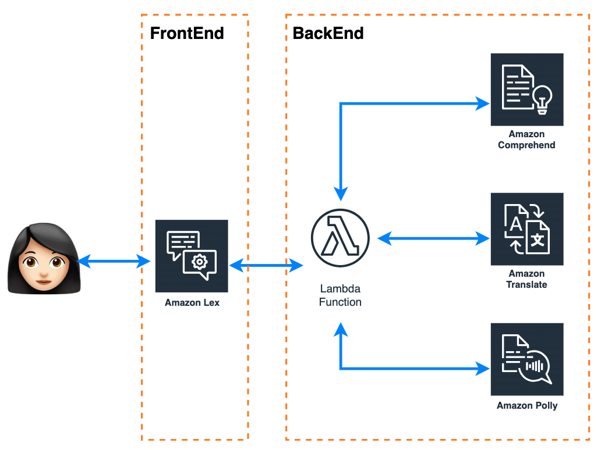
<div align="center">Fig 1. Diagram translator chatbot app. </div> 

### Build It in Seven Parts

- Part 1 - Create the function that detects the language and translates it into the desired language 🌎.
- Part 2 - Create the function to converts text into lifelike speech 🦜.
- Part 3 - Configure the chatbot interface with [Amazon Lex](https://aws.amazon.com/lex/). 🤖
- Part 4 - Build the interface between the backend and the frontend.
- Part 5 - Integrate the backend with the frontend.
- Part 6 - Let's get it to work!
- Part 7 - Deploy your translator app. 

You may doubt this build's speed. But, keep reading, you'll discover it can be done in under 30 minutes.

**Let’s get started!**

## Part 1 - Create the Function That Detects the Language and Translates It Into the Desired Language 🌎

In this part you are going to use two fully managed AI service,  [Amazon Translate](https://aws.amazon.com/translate/) to translate across [common languages](https://docs.aws.amazon.com/translate/latest/dg/what-is-languages.html) unstructured text (UTF-8) documents or to build applications that work in multiple languagues using [TranslateText](https://boto3.amazonaws.com/v1/documentation/api/latest/reference/services/comprehend/client/detect_dominant_language.html#detect-dominant-language) from [Boto3 Translate client](https://boto3.amazonaws.com/v1/documentation/api/latest/reference/services/comprehend.html), and [Amazon Comprehend](https://aws.amazon.com/comprehend/) to detect the dominant language of the text you want to translate using the API [DetectDominantLanguage](https://boto3.amazonaws.com/v1/documentation/api/latest/reference/services/comprehend/client/detect_dominant_language.html#detect-dominant-language?) from [Boto3 Comprehend client](https://boto3.amazonaws.com/v1/documentation/api/latest/reference/services/comprehend.html). 

You can also use Amazon Translate to determine the source language of the text, making an internal call to Amazon Comprehend to determine the source language, I'll explain how. 


### Parameters Requires for TranslateText API

- **Text (string)**: The text to translate.
- **SourceLanguageCode (string):** One of the [supported language codes](https://docs.aws.amazon.com/translate/latest/dg/what-is-languages.html) for the source text, if you specify **auto**, Amazon Translate will call Amazon Comprehend to determine the source language ✅.
- **TargetLanguageCode (string):** One of the supported language codes for the target text.


### Functions to calls TranslateText and perform the translation: 

```python
import boto3

translate_client = boto3.client('translate')

def TranslateText (text,language):
    response = translate_client.translate_text(
    Text=text,
    SourceLanguageCode="auto",
    TargetLanguageCode=language  
)
    text_ready =  response['TranslatedText'] 
    return text_ready
```

## Part 2 - Create the Function to Converts Text Into Lifelike Speech 🦜

To create the Text to Speech function you are going to use [Amazon Polly](https://aws.amazon.com/polly/), an AI service that uses advanced deep learning technologies to synthesize natural sounding human speech. It allows developers to convert text into lifelike speech that can be integrated into their applications.

In this part you'll use the [Boto3 Polly client](https://boto3.amazonaws.com/v1/documentation/api/latest/reference/services/polly.html) to call the APIs [StartSpeechSynthesisTask](https://boto3.amazonaws.com/v1/documentation/api/latest/reference/services/polly/client/start_speech_synthesis_task.html), and [GetSpeechSynthesisTask](https://boto3.amazonaws.com/v1/documentation/api/latest/reference/services/polly/client/get_speech_synthesis_task.html) to retrieve information of SpeechSynthesisTask based on its TaskID. It delivers status and a link to the [Amazon S3 Bucket](https://aws.amazon.com/s3/) containing the output of the task. 

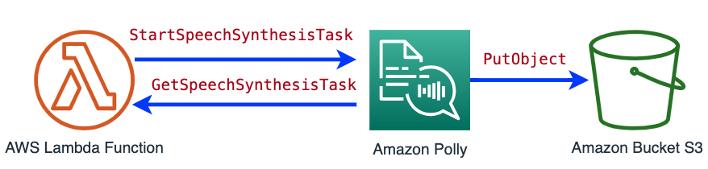
<div align="center">Fig 2. Converts text into lifelike speech.</div>


### Parameters for Amazon Lex APIs

|StartSpeechSynthesisTask Parameters | GetSpeechSynthesisTask Parameter|
| ------------------- | -------------------------------------- |
| <ul><li>**OutputFormat(string)**: The format in which the returned output will be encoded. For audio stream, this will be mp3, ogg_vorbis, or pcm. For speech marks, this will be json. <li>**OutputS3BucketName (string)**: [Amazon S3](https://aws.amazon.com/s3/) bucket name to which the output file will be saved. <li>**Text (string)**: The input text to synthesize. <li>**Engine (string)**: Specifies the engine ( standard or neural) for Amazon Polly to use when processing input text for speech synthesis. <li>**VoiceId (string)**: [Voice ID](https://docs.aws.amazon.com/polly/latest/dg/voicelist.html) to use for the synthesis.</li></ul>|  <ul><li>**TaskId (string)**: The Amazon Polly generated identifier for a speech synthesis task.</li></ul>|
|||

Amazon Polly supports [multiple languages](https://docs.aws.amazon.com/polly/latest/dg/voicelist.html) and voices that allow synthesized speech to sound very natural and humanlike. To generate the best audio we must choose the right voice for each language. Use the following dictionaries in Python:

```python
#Match the language code from Amazon Translate with the right voice from Amazon Polly.

def get_target_voice(language):
    to_polly_voice = dict( [ ('en', 'Amy'), ('es', 'Conchita'), ('fr', 'Chantal'), ('pt-PT', 'Cristiano'),('it', 'Giorgio'),("sr","Carmen"),("zh","Hiujin") ] )
    target_voice = to_polly_voice[language]
    return target_voice
```

### Functions to Calls the Amazon Lex APIs

<table>
<tr>
<th> StartSpeechSynthesisTask  </th> <th> GetSpeechSynthesisTask </th>
</tr>
<tr>
<td>

```python
import boto3
polly_client = boto3.client('polly')
def start_taskID(target_voice,bucket_name,text):
    response = polly_client.start_speech_synthesis_task(
                    VoiceId=target_voice,
                    OutputS3BucketName = bucket_name,
                    OutputFormat= "mp3", 
                    Text= text,
                    Engine= "standard")

    task_id = response['SynthesisTask']['TaskId']
    object_name = response['SynthesisTask']['OutputUri'].split("/")[-1] 
    return task_id, object_name
```
</td>
<td>

```python
import time
def get_speech_synthesis(task_id):
    max_time = time.time() + 2 
    while time.time() < max_time:
        response_task = polly_client.get_speech_synthesis_task(
        TaskId=task_id
        )
        status = response_task['SynthesisTask']['TaskStatus']
        print("Polly SynthesisTask: {}".format(status))
        if status == "completed" or status == "failed":
            if status == "failed": 
                TaskStatusReason = response_task['SynthesisTask']['TaskStatusReason']
                print("TaskStatusReason: {}".format(TaskStatusReason))
            else:
                value= response_task['SynthesisTask']['OutputUri']
                print("OutputUri: {}".format(value))
            break
            
    time.sleep(2)
    return status
```
</td>
</tr>
</table>

> 🚨**Note:** This application will not wait for the SpeechSynthesisTask, since the duration depends on the length of the text. GetSpeechSynthesisTask only delivers the status of the task id.


### Generate Presigned URL to Access the Audio File From Anywhere

By default, the files in an S3 bucket are private, only the object owner has permission to access them. However, the object owner may share objects with others by [creating a presigned URL](https://docs.aws.amazon.com/AmazonS3/latest/userguide/ShareObjectPreSignedURL.html), for the application you do it using the API [GeneratePresignedUrl](https://boto3.amazonaws.com/v1/documentation/api/latest/reference/services/s3/client/generate_presigned_url.html) from [Boto3 S3 client](https://boto3.amazonaws.com/v1/documentation/api/latest/reference/services/s3.html): 

```python
s3_client = boto3.client("s3")

def create_presigned_url(bucket_name, object_name, expiration=3600):
    value = object_name.split("/")[-1]
    response = s3_client.generate_presigned_url('get_object',
                                                    Params={'Bucket': bucket_name,
                                                            'Key': value},
                                                    ExpiresIn=expiration)
    return response
``` 
Up to this point, you have learned how to develop the backend of an application that can take in text input, translate it into a chosen output language, and produce audio with correct pronunciation. Moving forward, our focus will shift to constructing the user interface so users can engage with the translation and text-to-speech features.

## Part 3 - 🤖 Configure the Chatbot Interface With [Amazon Lex](https://aws.amazon.com/lex/) 

[Amazon Lex](https://aws.amazon.com/lex/) is an AWS service that allows developers to build conversational interfaces for applications using voice and text. It provides the deep functionality and flexibility of natural language understanding (NLU) and automatic speech recognition (ASR) and simplifies building natural conversation experiences for applications without needing specialized AI/ML skills. It can also be integrated with mobile, web, [contact center](https://docs.aws.amazon.com/lexv2/latest/dg/contact-center.html), [messaging platform](https://docs.aws.amazon.com/lexv2/latest/dg/deploying-messaging-platform.html) and other AWS services like [AWS Lambda functios](https://docs.aws.amazon.com/lexv2/latest/dg/lambda.html).

[Lex](https://docs.aws.amazon.com/lexv2/latest/dg/how-it-works.html), has the following components:

 |Component|Descripcion|Value|
 |--|--|--|
 |**Language**| You can select any [Languages and supported by Amazon Lex V2.](https://docs.aws.amazon.com/lexv2/latest/dg/how-languages.html)|English (US)|
 |**Intent**|An intent represents an action that the user wants to perform|TranslateIntent|
 |**Slot types**| Allow a Lex bot to dynamically collect data from users during a conversational flow in order to complete actions and provide customized responses. There are [built-in slot types](https://docs.aws.amazon.com/lex/latest/dg/howitworks-builtins-slots.html) and [Custom Slot Types](Chttps://docs.aws.amazon.com/lex/latest/dg/howitworks-custom-slots.html). In this tutorial you're going to create custom slots. |<ul><li>`text_to_translate:` the text you want to translate. </li><li>	`language:` the language into which you want to translate the text.</li></ul>|
 |**Utterances**|Indicate the user's intent, activate the chat. It should be in the language of the chatbot |<ul><li>I want to translate </li><li>I want to do a translation </li><li>I want to translate to {language}</li></ul>|

### Create an Amazon Lex Bot

Follow the steps below to set up [Amazon Lex](https://aws.amazon.com/lex/) on the console:
 
 1.  Sign in to the AWS Management Console and open the [Amazon Lex console](https://console.aws.amazon.com/lex/)
 2. Follow the instructions [To create an Amazon Lex V2 bot (Console)](https://docs.aws.amazon.com/lexv2/latest/dg/exercise-1.html#:~:text=To%20create%20an%20Amazon%20Lex%20V2%20bot%20(Console)) for the **Creation method** chosse **Create a blank bot** and [To add a language to a bot](https://docs.aws.amazon.com/lexv2/latest/dg/exercise-1.html#:~:text=To%20add%20a%20language%20to%20a%20bot)

The next step is to create the flow of the conversation using the information from the components. 

The language already selected in the previous step, so change the name of Intent in **Intent details** -> **Intent Name** and then **Save Intent**, now create the Slots type (`text_to_translate`, `language`).


### Create Slot Types

1. In the left menu, choose **Slot types**, then **Add slot type** and select **Add blank** slot type. 
2. Complete with the following parameters for each slot type:

|Parameter|`language`|`text_to_translate`|
|--|--|--|
|**Slot type name**|language|text_to_translate|
|**Slot value resolution**|built-in slot type|Restrict to slot values|
|**Slot type values**|[0-9][a-z][A-Z] |**Value**: Language Code  - **new Value**: Language ([Find Language code and Languages values here](https://docs.aws.amazon.com/translate/latest/dg/what-is-languages.html)) - Add as many as you want|
|**Image result** | 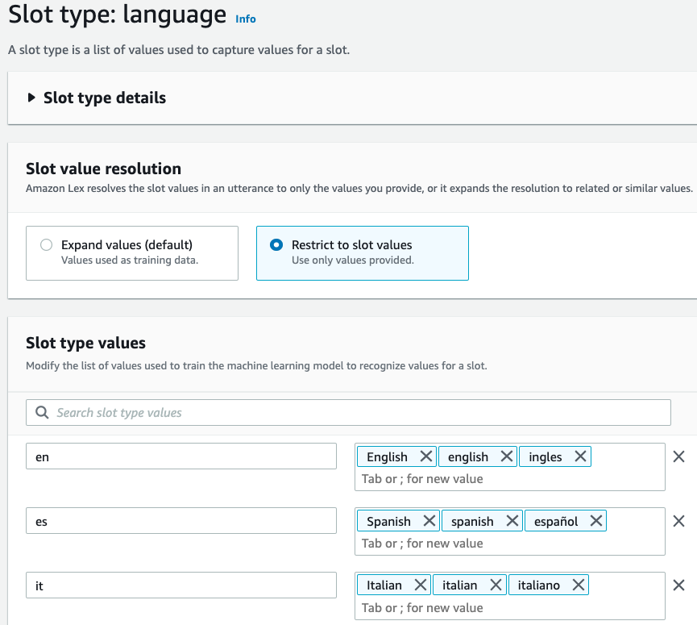 <div align="center">Fig 3. Slot `language` type. </div> |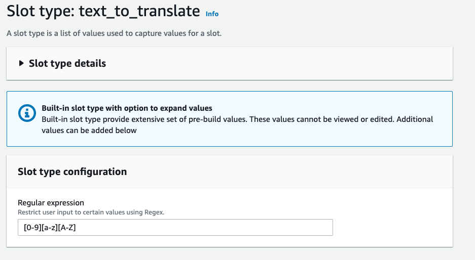 <div align="center">Fig 4. Slot `text_to_translate` type. </div> |
    

### Configure the Intent

Configure the Translate attempt to fulfill a user's request to make a translation with the following values:

- **Sample utterances:** Type the values of Utterances
- **Slots:** Select Add Slot and complete the following information:

|Parameter|`language`|`text_to_translate`|
|--|--|--|
|**Name**|language|text_to_translate|
|**Slot type**|language|Restrict to slot values|
|**Prompts**| What language do you want to translate? | What do you want to translate? Just type and I'll tell you the language... magic!|
|**Image result** | 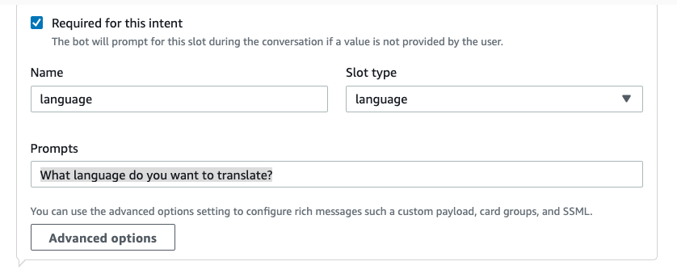 <div align="center">Fig 5. Slot language required for intent fulfillment. </div> |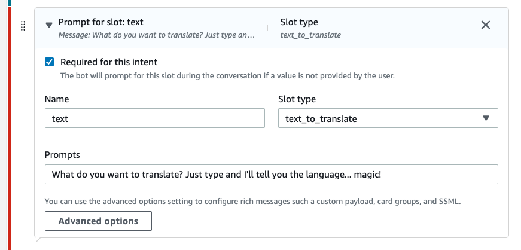 <div align="center">Fig 6. Slot language required for intent fulfillment. </div> |    

>🚨**Important:** The order matters, make sure that `language` type is the first slot to be required. 

This bot will invoke a Lambda function as a [dialog code hook](https://docs.aws.amazon.com/lexv2/latest/dg/paths-code-hook.html), to validate user input and to fulfill the intent. For that, select Use a Lambda function for initialization and validation (Fig. 7).

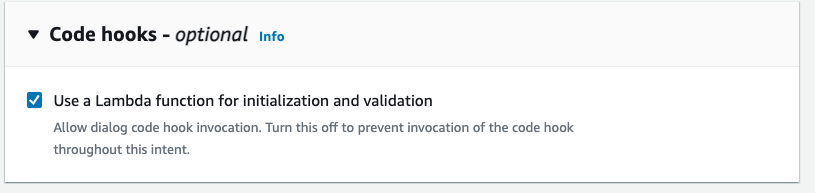 <div align="center">Fig 7. Use a Lambda function for initialization and validation. </div> 

To finish creating the chatbot, press **Save intent** and then **Build** in the top left.

>👩🏻‍💻**Note:** When you build a Lex bot, you are re-training the bot with updated configurations and logic, allowing it to learn from the new parameters.

### Test and inspect the bot you have created so far follow the instructions in [this link](https://docs.aws.amazon.com/lexv2/latest/dg/test-bot.html).


## Part 4 - Build the Interface Between the Backend and the Frontend

The interaction from backend to frontend will be handled through specific states called [Dialog Action](https://docs.aws.amazon.com/lex/latest/dg/API_runtime_DialogAction.html). It refers to the next action that the bot must perform in its interaction with the user. Possible values are:

- **ConfirmIntent** - The next action is asking the user if the intent is complete and ready to be fulfilled. This is a yes/no question such as "Place the order?"
- **Close** - Indicates there will not be a response from the user. For example, the statement "Your order has been placed" does not require a response.
- **Delegate** - The next action is determined by Amazon Lex.
- **ElicitIntent** - The next action is to determine the intent that the user wants to fulfill.
- **ElicitSlot** - The next action is to elicit a slot value from the user.

### The Conversation Flow’s Three Main States

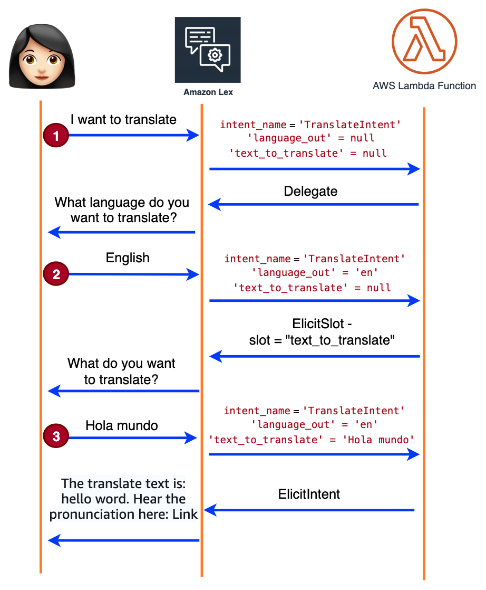
<div align="center">Fig 8. Conversation flow. </div> 

1. The user starts the Intent, triggering the Lambda Function which is always listening. Lambda does not receive the expected `language` value, so it will **Delegate** Lex to continue handling the conversation by eliciting the `language` slot.
2. The user provides the language and Lex interprets the value as a language code. The Lambda Function sees the `language` value and asks Lex to **ElicitSlot** `text_to_translate`.
3. The user provides the text to translate. Since the text is variable and unpredictable, Lex cannot interpret it as the `text_to_translate` value. So the Lambda Function interprets the text insted Lex and starts the translation and text-to-speech process. Finally, it replies to Lex with an **ElicitIntent** containing the translated text and a pre-signed link.

To integrate the backend and frontend, the Lambda Function needs to interpret the format of the Lex output events, which get passed to the Lambda function as input events. The [Interpreting the input event format developer guide](https://docs.aws.amazon.com/lexv2/latest/dg/lambda-input-format.html) provides more details. In this tutorial, you will learn how to extract the necessary information from the input events to get the translation application running.

To begin, the Lambda Function must extract the values in [interpretations](https://docs.aws.amazon.com/lexv2/latest/APIReference/API_runtime_Interpretation.html) and with possible matches to the user's utterance: 

```python
def get_intent(intent_request):
    interpretations = intent_request['interpretations'];
    if len(interpretations) > 0:
        return interpretations[0]['intent']
    else:
        return None;
```
`interpretation` is an array with values of the slots and the state of the conversation. 

To extract the values of slots interpreted by Lex you use the following function: 

```python
def get_slot(slotname, intent, **kwargs):
    try:
        slot = intent['slots'].get(slotname)
        if not slot:
            return None
        slotvalue = slot.get('value')
        if slotvalue:
            interpretedValue = slotvalue.get('interpretedValue')
            originalValue = slotvalue.get('originalValue')
            if kwargs.get('preference') == 'interpretedValue':
                return interpretedValue
            elif kwargs.get('preference') == 'originalValue':
                return originalValue
            # where there is no preference
            elif interpretedValue:
                return interpretedValue
            else:
                return originalValue
        else:
            return None
    except:
        return None
```
    
To maintain the dialogue between the Lambda Function and Lex it is necessary to know the context that a user is using in a session ([`activeContexts`](https://docs.aws.amazon.com/lexv2/latest/APIReference/API_runtime_ActiveContext.html)) inside of the state of the user's session ([`sessionState`](https://docs.aws.amazon.com/lexv2/latest/APIReference/API_runtime_SessionState.html)) value. To get it, use:

```python
def get_active_contexts(event):
    try:
        return event['sessionState'].get('activeContexts')
    except:
        return []
```
You need the session-specific context information [`sessionAttributes`](https://docs.aws.amazon.com/lexv2/latest/APIReference/API_runtime_SessionState.html#:~:text=Required%3A%20No-,sessionAttributes,-Map%20of%20key):

```python
def get_session_attributes(event):
    try:
        return event['sessionState']['sessionAttributes']
    except:
        return {}
```

To send the DialogAction state use this function definition:

<table>
<tr>
<th> DialogueAction State  </th> <th> Function Definition </th>
</tr>
<tr>
<td><b> Delegate </b></td> 
<td>

```python
def remove_inactive_context(context_list):
    if not context_list:
        return context_list
    new_context = []
    for context in context_list:
        time_to_live = context.get('timeToLive')
        if  time_to_live and time_to_live.get('turnsToLive') != 0:
            new_context.append(context)
    return new_context
def delegate(active_contexts, session_attributes, intent):
    print ('delegate!')
    active_contexts = remove_inactive_context(active_contexts)
    return {
        'sessionState': {
            'activeContexts': active_contexts,
            'sessionAttributes': session_attributes,
            'dialogAction': {
                'type': 'Delegate'
            },
            'intent': intent,
            'state': 'ReadyForFulfillment'
        },
    }
``` 

</td>
</tr>
<td><b> ElicitSlot</b></td> 
<td>

```python
def elicit_slot(slotToElicit, active_contexts, session_attributes, intent, messages):
    intent['state'] = 'InProgress'
    active_contexts = remove_inactive_context(active_contexts)
    if not session_attributes:
        session_attributes = {}
    session_attributes['previous_message'] = json.dumps(messages)
    session_attributes['previous_dialog_action_type'] = 'ElicitSlot'
    session_attributes['previous_slot_to_elicit'] = slotToElicit
    
    return {
        'sessionState': {
            'sessionAttributes': session_attributes,
            'activeContexts': active_contexts,
            'dialogAction': {
                'type': 'ElicitSlot',
                'slotToElicit': slotToElicit
            },
            'intent': intent
        },
    }
``` 
</td>
</tr>
<td><b> ElicitIntent</b></td> 
<td>

```python
def elicit_intent(active_contexts, session_attributes, intent, messages):
    intent['state'] = 'Fulfilled'
    active_contexts = remove_inactive_context(active_contexts)
    if not session_attributes:
        session_attributes = {}
    session_attributes['previous_message'] = json.dumps(messages)
    session_attributes['previous_dialog_action_type'] = 'ElicitIntent'
    session_attributes['previous_slot_to_elicit'] = None
    session_attributes['previous_intent'] = intent['name']
    
    return {
        'sessionState': {
            'sessionAttributes': session_attributes,
            'activeContexts': active_contexts,
            'dialogAction': {
                'type': 'ElicitIntent'
            },
            "state": "Fulfilled"
        },
        'requestAttributes': {},
     'messages': messages
    }
``` 
</td>
</tr>
</table>


With the backend and frontend functions built, it's time to integrate them!

## Part 5 - Integrate the Backend With the Frontend

With all the code built up in the previous parts, you are going to assemble the Lambda Handler as follows.

### Lambda Handler Code

```python
def lambda_handler(event, context):
    print(event)
    #Lambda Function Input Event and Response Format
    interpretations = event['interpretations']
    intent_name = interpretations[0]['intent']['name']
    intent = get_intent(event)
    #need it to Response Format
    active_contexts = get_active_contexts(event) 
    session_attributes = get_session_attributes(event) 
    previous_slot_to_elicit = session_attributes.get("previous_slot_to_elicit") #to find out when Amazon Lex is asking for text_to_translate and join the conversation.
    print(session_attributes)
    
    if intent_name == 'TranslateIntent':
        print(intent_name)
        print(intent)
        language = get_slot('language',intent)
        text_to_translate = get_slot("text_to_translate",intent)
        print(language,text_to_translate)

        if language == None:
            print(language,text_to_translate)
            return delegate(active_contexts, session_attributes, intent)
            
        if (text_to_translate == None) and (language != None) and (previous_slot_to_elicit != "text_to_translate"):
            print(language,text_to_translate)
            response = "What text do you want to translate?"
            messages =  [{'contentType': 'PlainText', 'content': response}]
            print(elicit_slot("text_to_translate", active_contexts, session_attributes, intent, messages))
            return elicit_slot("text_to_translate", active_contexts, session_attributes, intent, messages)
            
        if previous_slot_to_elicit == "text_to_translate": 
            print("diferente a none")
            text_to_translate = event["inputTranscript"]
            text_ready = TranslateText(text_to_translate,language)
            target_voice = get_target_voice(language)
            object_name,task_id = start_taskID(target_voice,bucket_name,text_ready)
            
            url_short = create_presigned_url(bucket_name, object_name, expiration=3600)
            
            print ("text_ready: ", text_ready)
            status = get_speech_synthesis(task_id)
            
            response = f"The translate text is: {text_ready}. Hear the pronunciation here {url_short} "
            messages =  [{'contentType': 'PlainText', 'content': response}]
            
            print(elicit_intent(active_contexts, session_attributes, intent, messages))
            return elicit_intent(active_contexts, session_attributes, intent, messages)
```

>🚨**Important:**  Import the necessary libraries, define the name of the bucket_name and initialize the clients for Boto3 from the AWS services, and **Deploy** to save.

### Lambda Function Permissions

For this Lambda Function have permissions to invoke AWS services and resources, it is necessary to create an execution role that has the necessary permissions, to do this, follow the following steps: 

1. Open the [Functions page](https://console.aws.amazon.com/lambda/home#/functions) of the Lambda console, and choose the name of a function.
2. Choose **Configuration**, and then choose **Permissions**, then click on the **Role name** (Fig. 9).

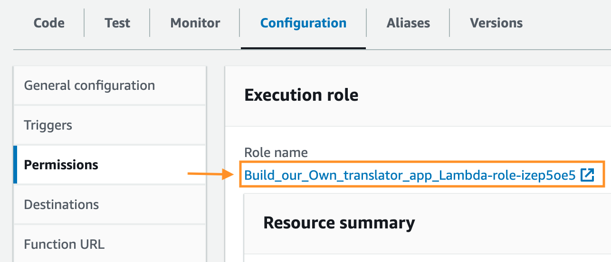
<div align="center">Fig 9. Role name. </div> 

3. In the Identity and Access Management (IAM) console, go to **Add Permision** --> **Create inline policy**
4. Select JSON, in the Policy editor. Copy this JSON: 

```json
{
	"Version": "2012-10-17",
	"Statement": [
		{
			"Sid": "VisualEditor0",
			"Effect": "Allow",
			"Action": [
				"polly:SynthesizeSpeech",
				"polly:StartSpeechSynthesisTask",
                "polly:GetSpeechSynthesisTask",
				"comprehend:DetectDominantLanguage",
				"translate:TranslateText"
			],
			"Resource": "*"
		},
		{
			"Sid": "VisualEditor1",
			"Effect": "Allow",
			"Action": [
				"s3:PutObject",
				"s3:GetObject"
			],
			"Resource": [
				"arn:aws:s3:::YOU-BUCKET-NAME/*",
				"arn:aws:s3:::YOU-BUCKET-NAME"
			]
		}
	]
}
```

> 🚨**Important:**  Replace **YOU-BUCKET-NAME** with your bucket name.

5. Select **Next**, write the *Policy name* and then **Create policy**.

🥳 Ok, you have all the code ready, now let's get it to work!


## Part 6 - Let’s Get It to Work!

Now, we have the code ready. Are you ready to see it work? 🥳

### Attaching a Lambda Function to a Bot Alias
To trigger the Lambda Function when a user interacts with Amazon Lex like a Dialog code hook, Lambda Function its attaching to a bot alias [following these steps](https://docs.aws.amazon.com/lexv2/latest/dg/lambda-attach.html):

1. Open the [Amazon Lex console](https://console.aws.amazon.com/lex) choose the name of the bot that created in **Part 2**. 
2. In the left panel choose **Aliases**, choose the name of the alias (Fig. 10).

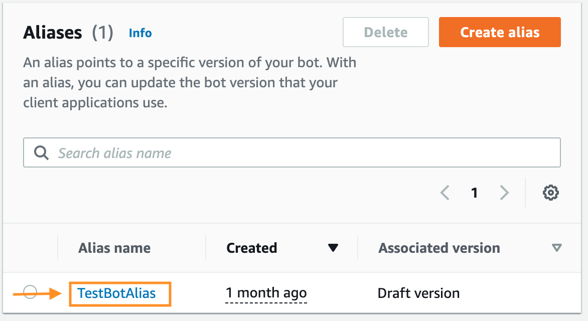
<div align="center">Fig 10. Choose Aliases name. </div> 

3. From the list of supported languages, choose the language (English (US)).

4. Choose the name of the Lambda function to use, then choose the version or alias of the function and choose **Save**.

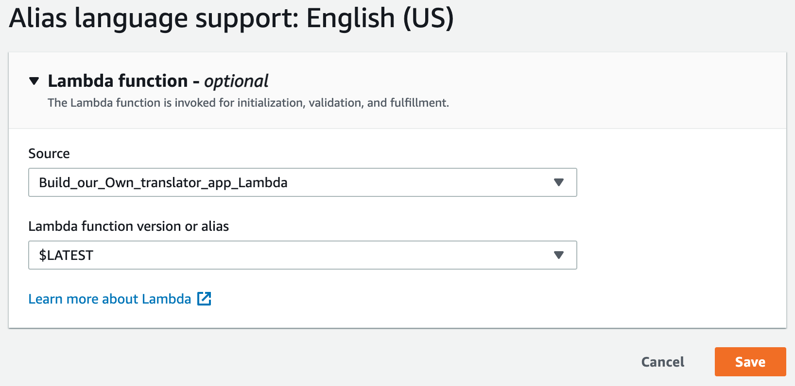
<div align="center">Fig 11. The Lambda function is invoked for initialization, validation, and fulfillment. </div>

To finish the integration, click **Build** to create and configure the bot using the new logic, once the building process is finished, you can [test the bot](https://docs.aws.amazon.com/lexv2/latest/dg/test-bot.html)(Fig.12). 

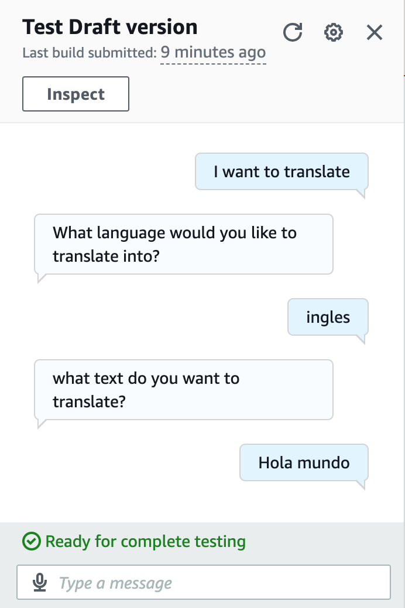
<div align="center">Fig 12. Testing the bot. </div>


## Part 7 - Deploy Your Translator App

You now have a functional translator conversational interfaces bot with text-to-speech that you built and tested quickly using Amazon Lex. However, it is only accessible through the console and you have worked with a draft version. 

Draft is the working copy of your bot. You can only update the Draft version and until you publish your first version, Draft is the only version of the bot you have. 

You need to create immutable versions in order to bring your bot into production. A version is a numbered snapshot of your work that you can publish for use in different parts of your workflow, such as development, beta deployment, and production. 

An alias is a pointer to a specific version of a bot. With an alias, you can easily update the version that your client applications are using without having to change any code. Aliases allow you to seamlessly direct traffic to different versions as needed.

Now that I've explained what a version is, you'll learn how to create versions of your bot and how to point the alias to it. 

### Create Version Steps

 1. Go to your **Bot**, then in the left panel select **Bot version** and select **Create version** (Fig. 13).  

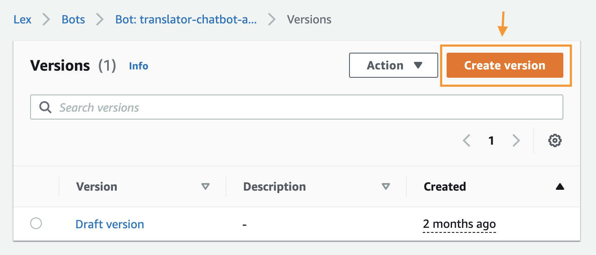
<div align="center">Fig 13. Create a new bot version. </div>

2. Create a Bot version and select **Create**.
3. Then to **Deployment** --> **Aliases** and select **Create Alias**. 
4. Named de Alias and Associate with a version, choose the new version (Fig. 14), and select **Create**. 

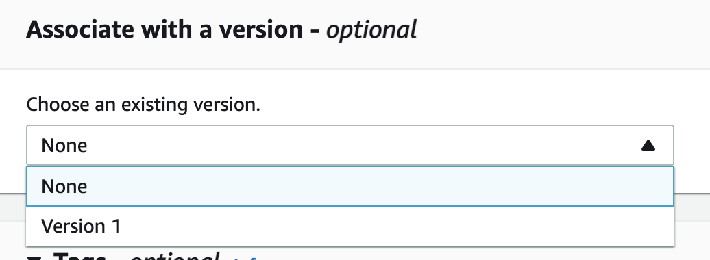
<div align="center">Fig 14. Associate with a version, choose the new version. </div>

### Integrate Your Bot With an Application

You already have everything you need to integrate your bot with messaging platforms, mobile apps, and websites, build your application by following some of these instructions:

- [Using a Java application to interact with an Amazon Lex bot](https://docs.aws.amazon.com/lexv2/latest/dg/deploy-java.html). 
- [Integrating an Amazon Lex bot with a messaging platform](https://docs.aws.amazon.com/lexv2/latest/dg/deploying-messaging-platform.html) ([Facebook](https://docs.aws.amazon.com/lexv2/latest/dg/deploy-facebook-messenger.html), [Slack](https://docs.aws.amazon.com/lexv2/latest/dg/deploy-slack.html), [Twilio](https://docs.aws.amazon.com/lexv2/latest/dg/deploy-twilio-sms.html)). 
- [Integrating an Amazon Lex bot with a contact center](https://docs.aws.amazon.com/lexv2/latest/dg/contact-center.html) ([Amazon Chime SDK](https://docs.aws.amazon.com/lexv2/latest/dg/contact-center-chime.html), [Amazon Connect](https://docs.aws.amazon.com/lexv2/latest/dg/contact-center-connect.html), [Genesys Cloud](https://docs.aws.amazon.com/lexv2/latest/dg/contact-center-genesys.html)). 
- [Web UI for Your Chatbot](https://aws.amazon.com/blogs/machine-learning/deploy-a-web-ui-for-your-chatbot/). 


## Conclusion

Building this multilingual app using AWS was, hopefully, an eye-opening experience for you. By leveraging Amazon Comprehend, Amazon Translate, Amazon Polly, and Amazon Lex, you were able to create a powerful translation tool with text-to-speech capabilities in a short amount of time. 

The process demonstrated how easy it is to integrate AWS AI through AWS Lambda functions. With some coding knowledge, anyone can build sophisticated applications like language translation and speech synthesis.

Experimenting hands-on is the best way to gain skills. Though translation apps already exist, creating your own solution drives learning. Building things yourself matters more than whether it's already been done.

Overall, this project exemplified how AWS lets us rapidly turn ideas into reality. With knowledge and the right tools, we can create apps that make a difference in the world. Coding skills combined with AWS services are a powerful toolkit for building the future.

The takeaway is if you can imagine it, you can build it with AWS. This project expanded you skills while creating something meaningful. 

### 🚀 Continue Learning

To read more about [Amazon Polly Sample Code] visit (https://docs.aws.amazon.com/polly/latest/dg/sample-code-overall.html).

- [All the things that Amazon Comprehend, Rekognition, Textract, Polly, Transcribe, and Others Do](https://community.aws/posts/all-the-things-that-comprehend-rekognition-textract-polly-transcribe-and-others-do)

- Check out there examples of Amazon Translate [Code Samples](https://github.com/aws-samples/document-translation).. [more code samples](https://docs.aws.amazon.com/translate/latest/dg/examples.html).

