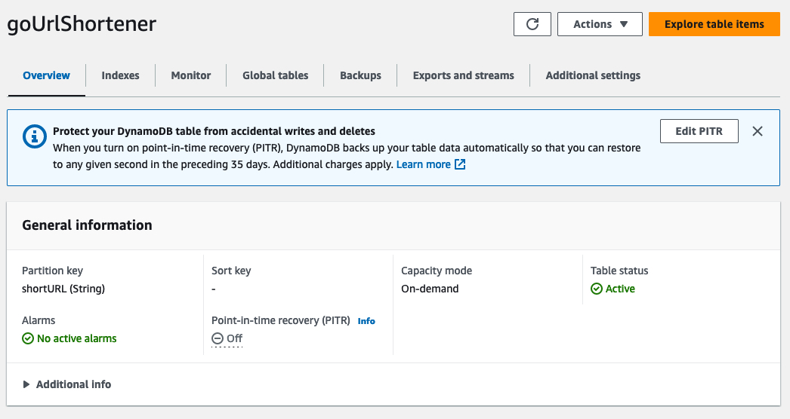

Companies today are making sustainability a key goal for their business in order to improve operational efficiency and drive down cost while also lowering carbon emissions. Achieving these sustainability goals means change across all levels of the business, with application and software development being a key focus. With Go applications, one of the easiest ways to make progress towards a sustainability goal is to adopt [AWS Graviton instances](https://aws.amazon.com/ec2/graviton/). AWS Graviton processors are designed by AWS to deliver the best price performance for your cloud workloads running in Amazon EC2.

In this tutorial, I will walk through the steps to take an existing application running on x86 instances today and migrate to AWS Graviton powered instances in order to achieve a higher level of sustainability for your Go application. This guide includes creating AWS resources that you will be charged for.

## What you will learn

- How to build a Go application for AWS Graviton
- How to port an existing Go application to AWS Graviton

| Attributes                |                                   |
| ------------------- | -------------------------------------- |
| ✅ AWS Level        | 200 - Intermediate                          |
| ⏱ Time to complete  | 30 minutes                             |
| 💰 Cost to complete | Free when using the AWS Free Tier or USD 2.62      |
| 🧩 Prerequisites    | - [AWS Account](https://docs.aws.amazon.com/accounts/latest/reference/manage-acct-creating.html?sc_channel=el&sc_campaign=costwave&sc_content=building-go-applications-for-aws-graviton&sc_geo=mult&sc_country=mult&sc_outcome=acq)<br> - [Amazon DynamoDB Table](https://docs.aws.amazon.com/amazondynamodb/latest/developerguide/getting-started-step-1.html?sc_channel=el&sc_campaign=costwave&sc_content=building-go-applications-for-aws-graviton&sc_geo=mult&sc_country=mult&sc_outcome=acq)|
| 💻 Code Sample         | Code sample used in tutorial on [GitHub](https://github.com/build-on-aws/building-go-applications-for-aws-graviton)                             |
| 📢 Feedback            | <a href="https://pulse.buildon.aws/survey/DEM0H5VW" target="_blank">Any feedback, issues, or just a</a> 👍 / 👎 ?    |
| ⏰ Last Updated     | 2023-07-20                             |

| ToC |
|-----|

## Setup

### EC2 Setup

To demonstrate how to move a Go application to AWS Graviton-based Instances, I have built a simple link shortener microservice in Go. I’m not a front end developer, so I will be relying on cURL to interact with my application’s APIs. The application is written with Go 1.20.6 and [gin](https://github.com/gin-gonic/gin) for my HTTP framework. The application generates a unique 10 character string for each URL that it shortens, and stores the original URL and the 10 character string in a Amazon DynamoDB table. The code is not meant to be used in production and is provided as a sample only.

For this demo, [launch two EC2 instances](https://docs.aws.amazon.com/AWSEC2/latest/UserGuide/EC2_GetStarted.html#ec2-launch-instance?sc_channel=el&sc_campaign=costwave&sc_content=building-go-applications-for-aws-graviton&sc_geo=mult&sc_country=mult&sc_outcome=acq) running Amazon Linux 2023. The first instance will be of `c5.xlarge` instance-type, and the second will be of `c6g.xlarge` instance-type. Once they are running, [connect to each instance](https://docs.aws.amazon.com/AWSEC2/latest/UserGuide/AccessingInstances.html?sc_channel=el&sc_campaign=costwave&sc_content=building-go-applications-for-aws-graviton&sc_geo=mult&sc_country=mult&sc_outcome=acq) and [install Go.](https://go.dev/doc/install)

### Code Checkout

To checkout the sample project, go to [building-go-applications-for-aws-graviton](https://github.com/build-on-aws/building-go-applications-for-aws-graviton) and clone the repository using command below:

```bash
git clone https://github.com/build-on-aws/building-go-applications-for-aws-graviton
```

Check out the code on your x86 instance and your AWS Graviton Instance. You should now have a `building-go-applications-for-aws-graviton` directory containing all of the appropriate code.

### DynamoDB Setup

The link shortener application will leverage DynamoDB as its data store. Our DynamoDB table will run in On-Demand mode. Let's [create a table](https://docs.aws.amazon.com/amazondynamodb/latest/developerguide/GettingStarted.CreateTable.html) called `goUrlShortener` with a Partition Key of `shortUrl` for our application to use.



Notice we have a Partition Key of **shortUrl (String)** and a Capacity mode of **On-demand**.

## Compiling for x86

On your `c5.xlarge` instance, navigate to the `building-go-applications-for-aws-graviton` directory and run the following command to build the application:

```shell
go build -o goLinkShortener
```

When the build is finished you may not see any output but a binary named `goLinkShortener` should be in your working directory.

## Compiling for AWS Graviton (ARM64)

There are two main ways you can build a binary with Go. The first is by natively compiling the code on the same system architecture you plan to run on in production. This is what we did when compiling for x86. The other option is cross-compiling for a different architecture. This can be useful when experimenting early on in the development process. This post will cover both options, but I recommend building on the same architecture you plan to run on in production whenever possible.

### Cross-Compiling for AWS Graviton (ARM64)

On your `c5.xlarge` instance, navigate to the `building-go-applications-for-aws-graviton` directory and run the following command to build the application:

```shell
export GOOS=linux
export GOARCH=arm64

go build -o goLinkShortener_arm64
```

Just like before when the build is finished you may not see any output, but a binary named `goLinkShortener_arm64` should be in your working directory. You can then take and copy this binary to any Linux system running on the arm64 architecture and it will execute. If you try to run it on a Linux system running the x86 architecture it will fail with the following error:

```shell
bash: ./goLinkShortener_arm64: cannot execute binary file: Exec format error
```

The Exec format error means you're trying to execute a binary built for a different CPU architecture.

### Natively Compiling for AWS Graviton (ARM64)

On your `c6g.xlarge` instance, navigate to the `building-go-applications-for-aws-graviton` directory and run the following command to build the application:

```shell
go build -o goLinkShortener
```

You now have a working binary named `goLinkShortener` built natively on the arm64 architecture. Lets move on to the next step and test our application to verify its working as expected.

## Start the Application

On both your c5.xlarge and c6g.xlarge instances run the following commands to start the application.

```sh
#Set GIN_MODE=release to minimize the amount of debug logging that would otherwise occur
export GIN_MODE=release
./golang-link-shortener
```

## Testing the Application

To test the application we will use cURL to make a few example requests and verify our application is working properly. All of the commands below can be run against both the EC2 instances.

### Shortening a URL

The following command will shorten a URL. My c5.xlarge instance has an IP address of 10.3.71.184, so I’m using that in my command. Make sure to replace the IP address with the address of your EC2 Instance:

```shell
curl -X POST http://10.3.71.184:8080/shortenURL -H 'Content-Type: application/json' -d '{"OriginalURL":"https://aws.amazon.com/ec2/graviton/"}'
```

You should get output that looks like the following:

```shell
{
    "shortURL": "7fcLy5Cqwd",
    "originalURL": "https://aws.amazon.com/ec2/graviton/"
}
```

The `7fcLy5Cqwd` is our application’s identifier for our URL. In a finished application this shortURL value would be used to redirect the user from the shortenedURL to their original URL. For the purposes of this demo, the JSON response is good enough.

### Retrieving Full URL

In order to retrieve the original URL, we will need to make another request to the application and pass this value in to the `getFullURL` API, as shown in the following command.

Replace the shortened URL identifier with the identifier you got from the previous command, and make sure your IP address is correct.

```shell
ccurl -X GET http://10.3.69.250:8080/getFullURL/7fcLy5Cqwd
```

You should get output that looks like the following:

```shell
"https://aws.amazon.com/ec2/graviton/
```

## Load Testing Results

Performance testing is key when comparing multiple instance types. In order to compare a `c6g.xlarge` and a `c5.xlarge` instance we will be performing a load test to verify that the application built for Graviton is working as expected. We discuss various load testing methodologies in the [Graviton Technical Guide on GitHub](https://github.com/aws/aws-graviton-getting-started) and recommend using a framework like [wrk2](https://github.com/kinvolk/wrk2). `wrk2` is a  version of `wrk` that is modified to produce a constant throughput load and report accurate latency details across various percentiles. I decided to go ahead and use `wrk2` to test the `shortenURL` function of our application and compare the total requests per second served as well as the latency at each percentile during our load test. I've kept the load tests simple in this guide to illustrate that testing is important.

Every time you make a software or hardware change you should re-evaluate your existing configuration and assumptions to ensure you are getting the full benefit of your new configuration. While full performance testing and optimization is outside the scope of this blog we have a [comprehensive performance runbook](https://github.com/aws/aws-graviton-getting-started/blob/main/optimizing.md) and [Go specific page](https://github.com/aws/aws-graviton-getting-started/blob/main/golang.md) in our Graviton Technical Guide on GitHub and your AWS team is always ready to help with any questions you may have.

### Load test setup

Because our `shortenURL` function uses the POST method and requires some data, we need a lua config file to pass to wrk2. My `post.lua` file has the following content:

```yaml
wrk.method = "POST"
wrk.headers["content-type"] = "application/json"
wrk.body = "https://aws.amazon.com/ec2/graviton/"
```

### Running the load test

Load tests are great for verifying your application performs correctly under load. For our example application lets pretend that the application should serve 99.9% of requests in under 70ms. I will then run a load test against each instance to see how many requests per second each instance can handle before this latency threshold is breached. I'll be running my load tests from a c5.18xlarge instance in the same availability zone as our test instances.

To start with I ran a 30 minutes load test against each instance using the following commands. While running each command, make sure your IP address is correct.

```shell
# AWS C5 (Intel) Instance
./wrk -c60 -t30 -d 30m -L -R 600 -s ./post.lua http://10.3.69.250:8080/shortenURL

# AWS Graviton2 Instance
./wrk -c60 -t30 -d 30m -L -R 600 -s ./post.lua http://10.3.71.184:8080/shortenURL
```

### Initial Results

|Latency Percentiles |C5.xlarge |C6g.xlarge |
|--- |--- |--- |
|50 |31.02ms |15.02ms |
|75 |42.88ms |22.82ms |
|90 |49.73ms |26.64ms |
|99 |57.22ms |35.42ms |
|99.9 |69.31ms |49.38ms |
|99.99 |93.38ms |87.87ms |
|99.999 |180.48ms |172.80ms |
|100 |230.65ms |240.64ms |

### Driving More Load

So far our initial results look great. Intel is staying just under our threshold and our Graviton instances look like there is enough overhead to take additional traffic without breaching our latency target. Lets push each instance a bit harder and see what happens to our latency target under more load.

```shell
# AWS C5 (Intel) Instance
./wrk -c60 -t30 -d 30m -L -R 700 -s ./post.lua http://10.3.69.250:8080/shortenURL

# AWS Graviton2 Instance
./wrk -c60 -t30 -d 30m -L -R 700 -s ./post.lua http://10.3.71.184:8080/shortenURL
```
<!-- Rerun this graviton test, see if 100% changes -->
|Latency Percentiles |C5.xlarge |C6g.xlarge |
|--- |--- |--- |
|50 |29.23ms |17.15ms |
|75 |43.07ms |24.43ms |
|90 |50.37ms |28.05ms |
|99 |57.57ms |36.70ms |
|99.9 |72.06ms |58.56ms |
|99.99 |312.58ms |132.74ms |
|99.999 |427.26ms |327.17ms |
|100 |571.39ms |728.58ms |

### Pushing Graviton To The Limit

Intel instances are now breaching our latency target, but Graviton instances still are under threshold. How much more can we push it until they tip over? Lets find out.

```shell
# AWS Graviton2 Instance
./wrk -c60 -t30 -d 30m -L -R 800 -s ./post.lua http://10.3.71.184:8080/shortenURL
```

|Latency Percentiles | C6g.xlarge |
|---  |--- |
|50  |17.10ms |
|75  |24.43ms |
|90  |28.03ms |
|99  |37.12ms |
|99.9  |58.49ms |
|99.99  |92.10ms |
|99.999  |217.85ms |
|100  |480.00ms |

```shell
# AWS Graviton2 Instance
./wrk -c60 -t30 -d 30m -L -R 900 -s ./post.lua http://10.3.71.184:8080/shortenURL
```

|Latency Percentiles | C6g.xlarge |
|---  |--- |
|50  |13.42ms |
|75  |22.45ms |
|90  |26.38ms |
|99  |34.72ms |
|99.9  |56.83ms |
|99.99  |105.60ms |
|99.999  |184.83ms |
|100  |462.59ms |

We're getting pretty close to the breaking point here. This next test is likely to breach all of our latency thresholds, but lets give it a shot to be sure.

```shell
# AWS Graviton2 Instance
./wrk -c60 -t30 -d 30m -L -R 1000 -s ./post.lua http://10.3.71.184:8080/shortenURL
```

|Latency Percentiles | C6g.xlarge |
|---  |--- |
|50  |12.28ms |
|75  |20.78ms |
|90  |25.28ms |
|99  |57.82ms |
|99.9  |1.18s |
|99.99  |2.19s |
|99.999  |2.4s |
|100  |2.49s |

1,000 requests per second is definitely too many requests to handle while maintaining acceptable latency thresholds. Our Graviton instance is capable of powering 900 requests per second before breaching latency thresholds. Our Intel based x86 instance can only handle approximately 700 before breaching our latench thresholds. This means our application can serve approximately 28% more requests per instance than our Intel counterpart. With further testing in a production scenario we can capitalize on this by running fewer instances to serve the same amount of traffic leading to even greater cost and sustainability gains. For Go applications Graviton is proving to be the most cost effective and sustainable instance selection AWS offers today.

## Cleanup

Now that we are done testing, it is time to clean up all the resources we created in this tutorial. Make sure to [terminate any EC2 Instances](https://docs.aws.amazon.com/AWSEC2/latest/UserGuide/terminating-instances.html?sc_channel=el&sc_campaign=costwave&sc_content=building-go-applications-for-aws-graviton&sc_geo=mult&sc_country=mult&sc_outcome=acq) you launched and [delete your DynamoDB table](https://docs.aws.amazon.com/amazondynamodb/latest/developerguide/getting-started-step-8.html?sc_channel=el&sc_campaign=costwave&sc_content=building-go-applications-for-aws-graviton&sc_geo=mult&sc_country=mult&sc_outcome=acq) so you won't incur any additional costs.

## Conclusion

Migrating your Go applications from x86 EC2 Instances to AWS Graviton powered instances is simple and easy, as shown in this tutorial. AWS Graviton powered instances performed better in our load test across all latency percentiles. The ability to serve more load per instance unlocks even more cost and efficiency savings with AWS Graviton when compared to other x86 instances.

For common performance considerations and other information, visit our [Graviton Technical Guide](https://github.com/aws/aws-graviton-getting-started/blob/main/golang.md) repository on Github and start migrating your application today.
