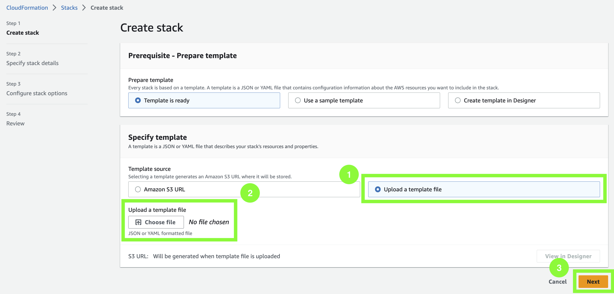

In today’s fast-paced digital world, real-time streaming analytics has become increasingly important as organisations need to understand what customers, application and products are doing right now and react promptly. For example, businesses want to analyse data in real-time to continuously monitor an application to ensure high service uptime and personalize promotional offers and product recommendations to customers.
However, building such an end-to-end real-time streaming application with an Apache Kafka producer and Kafka consumer can be quite challenging.

This tutorial shows you how to setup and implement a real-time data pipeline using Amazon Managed Streaming for Apache Kafka (MSK). More specifically, the guide details how streaming data can be ingested to the Kafka cluster, processed in real-time and consumed by a downstream application.

| Attributes          |                                   |
| ------------------- | -------------------------------------- |
| ✅ AWS Level        | Intermediate - 200                             |
| ⏱ Time to complete  | 45 mins - 60 mins                      |
| 💰 Cost to complete | USD 4.00                               |
| 🧩 Prerequisites       | - An [AWS Account](https://aws.amazon.com/resources/create-account/?sc_channel=el&sc_campaign=datamlwave&sc_geo=mult&sc_country=mult&sc_outcome=acq&sc_content=building-real-time-streaming-analytics-application-on-apache-kafka) <br> - An IAM user that has the access to create AWS resources <br> - Basic understanding of CLI <br> - Java and Apache Maven installed |
| 💻 Code         | Code sample used in tutorial on [GitHub](https://github.com/build-on-aws/real-time-streaming-analytics-application-using-apache-kafka) |
| 📢 Feedback            | <a href="https://pulse.buildon.aws/survey/DEM0H5VW" target="_blank">Any feedback, issues, or just a</a> 👍 / 👎 ?    |
| ⏰ Last Updated     | 2023-06-20                          |

|ToC|
|--|

## What We Will Accomplish

In this tutorial, we will:

* Start a Serverless Amazon MSK Cluster
* Produce streaming data to MSK Serverless using Kafka Client Container
* Consume and process the streaming data using Amazon Kinesis Data Analytics
* Visualise streaming data in Amazon OpenSearch Service

Let’s get started!

## Architecture

The following architecture provides an overview of all the AWS resources and services that we will use to write real-time clickstream data to the Kafka cluster and subsequently consume it. We make use of AWS Fargate to deploy a container application that produces sample clickstream data to the MSK Serverless cluster. The clickstream data is consumed by an Apache Flink application running in Amazon Kinesis Data Analytics. More specifically, the Flink application processes the clickstream by *windowing*, which involves splitting the data stream into buckets of finite size. We rely on these windows to apply computations and analyze the data within each one. Finally, the resulting analyses are written to Amazon OpenSearch Service for visualisation.


## Implementation

The following provides a step-by-step tutorial to implement a real-time streaming analytics application on Apache Kafka. Before you start, make sure you have the following pre-requisites installed on your machine:

* Java JDK
* Apache Maven

### Step 1: Get the Repository

The repository `build-on-aws/real-time-streaming-analytics-application-using-apache-kafka` contains the required files that help us to get started. Run the following command to download the repository to your local machine:

```bash
git clone https://github.com/build-on-aws/real-time-streaming-analytics-application-using-apache-kafka.git
```

### Step 2: Build the Flink Application

After you have successfully installed Apache Maven on your machine, navigate to the `flink-clickstream-consumer` folder using the following command inside the previously downloaded repository:

```bash
cd flink-clickstream-consumer
```

Then, you can build the Flink application from inside the `flink-clickstream-consumer` folder by running:

```bash
mvn package
```

Once the application is successfully built you should see a following message in your terminal:


Maven packages the compiled source code of the project in a distributable JAR format in the directory `flink-clickstream-consumer/target/` named `ClickStreamProcessor-1.0.jar`. If you want to better understand the inner workings of the Flink application, you can have a look at the `ClickstreamProcessor.java` file in the `src` directory. This is the entry point of the Java application where the `main` function resides.

Next, we have to provide Amazon Kinesis Data Analytics with the JAR file by uploading it to Amazon S3.

### Step 3: Upload the File to Amazon S3

1. Log into your AWS account, navigate to the [Amazon S3 console](https://s3.console.aws.amazon.com/s3/?sc_channel=el&sc_campaign=datamlwave&sc_geo=mult&sc_country=mult&sc_outcome=acq&sc_content=building-real-time-streaming-analytics-application-on-apache-kafka), and click `Create bucket`.


2. Provide a unique bucket name of your choice and choose an AWS region (e.g. `us-east-1`) and click `Create Bucket` at the bottom of the page. Take note of your bucket name.


3. Click on the newly created bucket and click `Upload` to upload the following file to the S3 bucket.


4. Click `Add files` and select the JAR file `ClickStreamProcessor-1.0.jar` that you have recently generated.


Perfect! Now, that the JAR file is uploaded to the S3 bucket, we can easily run the Flink application in Kinesis Data Analytics without having to manage any servers. Note that we can either upload the package as JAR file, or can compress the package and upload it as a ZIP file.

### Step 4:  Create a Stack using AWS CloudFormation

Next, we'll create a CloudFormation stack and automatically deploy the following resources by uploading the CloudFormation template:

* `Amazon OpenSearch Cluster`: This is where we can visualize the consumed clickstream data. It is deployed in private subnets of a VPC.
* `Amazon ECS Cluster + Task definition`: The container application that generates the sample clickstream data runs inside the ECS cluster as a Fargate task.
* `Amazon Kinesis Data Analytics`: This is where the Flink application runs, consuming the clickstream data from the MSK cluster, processing it and writing it to the OpenSearch Service.
* `Amazon EC2 Instance (Kafka client)`: This EC2 instance serves as a Kafka client and allows us to interact with the MSK cluster by among other things creating Kafka topics.
* `Amazon EC2 Instance (Nginx proxy)`: This EC2 instance serves as a Nginx proxy and allows us to access the OpenSearch Dashboard from outside of the VPC, i.e., from the Internet.
* `Security groups`: Security groups help us to control the traffic that is allowed to reach and leave a particular resource.
* `IAM roles`: An IAM role is an IAM identity that has specific permissions attached to it and can be assumed by an IAM user or an AWS service. For example, an IAM role can be used to grant permissions to an application running on an EC2 instance that requires access to a specific Amazon S3 bucket.

Rather than creating the required resources manually we make use of the CloudFormation template to automatically deploy the resources in the AWS account.

1. Navigate to the [CloudFormation console](https://console.aws.amazon.com/cloudformation/?sc_channel=el&sc_campaign=datamlwave&sc_geo=mult&sc_country=mult&sc_outcome=acq&sc_content=building-real-time-streaming-analytics-application-on-apache-kafka) and click on `Create Stack`.

2. Choose `Upload a template file` and click `Choose file` to upload the CloudFormation template file `cf_template.yml` that can be found in the root directory of the downloaded repository. Then, click `Next`.



3. Provide the stack with a `Stack name` of your choice (e.g. `msk-serverless-stack`). Additionally, you have to provide a value to the parameter `AssetsBucketName`. Enter the name of the S3 bucket that you created earlier. You can leave the default `ClickstreamProcessor-1.0.jar` as `KdaAppKey` unless you have changed the name of the JAR file that you have generated earlier. Leave the `LatestAmiId` as well as the `OpenSearchmasterUserName` as is. Click `Next`.


4. Scroll down the page `Configure stack options` and click `Next`.

5. Scroll down the page `Review <Your_Stack_Name>`. Make sure to tick the box that reads, `I acknowledge that AWS CloudFormation might create IAM resources with custom names`. Lastly, click `Submit` to create the CloudFormation stack.

Wait until the status of the stack changes from `CREATE_IN_PROGRESS` to `CREATE_COMPLETE`. Note: This can take some time.


Once the status changes to `CREATE_COMPLETE`, the resources that were defined in the CloudFormation template have been created in your AWS account. However, there are few more resources and configurations required until we end up with an end-to-end real-time streaming application.

Next, we will create the MSK cluster on AWS. There are two types of clusters available on AWS: MSK Serverless that provides on-demand capacity with automatic scaling, and MSK Provisioned which grants greater control by allowing you to specify the number of brokers and amount of storage per broker in your cluster. However, MSK Provisioned does not scale automatically as your application I/O demand changes. In this tutorial, we'll choose MSK Serverless as we do not want to worry about the underlying infrastructure and keep the management overhead to a minimum.

### Step 5: Create the MSK Serverless Cluster

1. Navigate to the [Amazon MSK console](https://console.aws.amazon.com/msk/?sc_channel=el&sc_campaign=datamlwave&sc_geo=mult&sc_country=mult&sc_outcome=acq&sc_content=building-real-time-streaming-analytics-application-on-apache-kafka) and click `Create cluster`.

2. Choose `Custom create` and provide a cluster name of your choice (e.g. `msk-cluster`). Select `Serverless` as cluster type. Then, click `Next`.


3. In the `Networking` view, select the custom VPC named `MMVPC`. Then, click `Add subnet` to add a third subnet and choose the three available private subnets (`PrivateSubnetMSKOne`, `PrivateSubnetMSKTwo`, `PrivateSubnetMSKThree`) for the the different zones in `us-east-1a`, `us-east-1b` and `us-east-1c`.

4. Rather than the default security group, select the security group named `MSK Security Group`. Lastly, click `Next`.


5. Click `Next`.

6. Click `Next`.

7. Finally, click `Create cluster` to create the MSK Serverless cluster.

8. Once your MSK Serverless cluster status changes to `Active`, click on `View client information`.


9. Take note of the endpoint of your MSK Serverless cluster. Notice that we use IAM access control to handle the authentication to the MSK cluster.


At the moment, MSK Serverless only supports IAM authentication. If you choose MSK Provisioned, you have the option of using IAM, TLS or SASL/SCRAM to authenticate clients and allow or deny actions.

### Step 6: Create the Kafka Topics

Now that the MSK Serverless cluster is ready and available to use, we need to create a Kafka topic to produce and consume the data. We can create Kafka topics as shown below:

1. Navigate to the [Amazon EC2 console](https://console.aws.amazon.com/ec2/?sc_channel=el&sc_campaign=datamlwave&sc_geo=mult&sc_country=mult&sc_outcome=acq&sc_content=building-real-time-streaming-analytics-application-on-apache-kafka). On the EC2 home page click on `Instances (running)`.


2. On the EC2 Instances page select the checkbox for the instance named `KafkaClientInstance` and click on the `Connect` button on top right as shown in the image below.


3. On the page `Connect to instance`, ensure to select `Session Manager` and click the `Connect button`. This opens a new tab with an EC2 terminal window.

4. In the terminal window execute the following command to change to `ec2-user`:

```bash
sudo su - ec2-user
```


5. Execute the command below to set your MSK cluster endpoint to the shell variable BS. Please replace `<Your_Cluster_Endpoint>` with the endpoint you noted down after you created the MSK Serverless cluster.

```bash
export BS=<Your_Cluster_Endpoint>
```


6. Then, execute the following command to create the Kafka topic.

```bash
bash create_topics.sh
```

You will encounter warnings printed to the terminal. You may ignore them.


7. You should see a single MSK topic that has been created: `clickstream`.

You can run the following command to view the bash script and see details of the executed Kafka commands within:

```bash
cat create_topics.sh
```

If you'd like, feel free to run other Kafka commands to get a better understanding of your MSK cluster. For example, run the following command to view details of the topic that you have created:

```bash
/home/ec2-user/kafka/bin/kafka-topics.sh --bootstrap-server $BS --describe --topic clickstream
```

### Step 7: Start a Container Application to Generate Clickstream Data

After we have successfully created the MSK cluster, the next step is to set up the producer that will write data to the topic `clickstream`. For that we'll deploy a serverless Amazon ECS Fargate container which runs an application, generating sample clickstream data to the MSK Serverless cluster.

1. Navigate to the [Amazon ECS console](https://console.aws.amazon.com/ecs/v2/?sc_channel=el&sc_campaign=datamlwave&sc_geo=mult&sc_country=mult&sc_outcome=acq&sc_content=building-real-time-streaming-analytics-application-on-apache-kafka). On the left side menu click on `Task Definitions` to view all available Task definitions. Select the checkbox of the available Task definition and select `Run task` from the `Deploy` menu.


2. On the Run Task page, select the existing cluster (`msk-serverless-[...]-cluster`) and leave the default settings.


3. Expand the `Networking` section. Change the default VPC to `MMVPC`. Similar to before, select the three subnets `PrivateSubnetMSKOne`, `PrivateSubnetMSKTwo` and `PrivateSubnetMSKThree`. Finally, uncheck the default security group and select the security group that contains `-ProducerECSTaskSecurityGroup-`.


4. Expand the `Container overrides` section. For `BOOTSTRAP_STRING` enter the value to your MSK Serverless cluster endpoint (written down earlier with `View client information` from the MSK cluster console page).


5. Finally, click the `Create button`.

6. Wait for your task to change to the `Running` status as shown below.


You have now successfully created a producer ECS task that will continuously generate clickstream data to the MSK Serverless cluster.

More specifically, the ECS task produces random click events. Hereby, an event comprises a user IP, a product type, an event timestamp and other information. There is also a user ID associated with each event, serving as key. The partition number of the event is determined by using a hash of that key. Before we send the data to the MSK cluster, the event data is serialized using a Avro serializer provided by the AWS Glue Schema Registry. Every generated event is sent to the previously created topic `clickstream`.

### Step 8: Check Schema in AWS Glue Schema Registry

In the last step, we successfully created an ECS producer task. Now we have to create the clickstream schema in the AWS Glue Schema Registry.

1. Navigate to the [Amazon Glue console](https://console.aws.amazon.com/glue/?sc_channel=el&sc_campaign=datamlwave&sc_geo=mult&sc_country=mult&sc_outcome=acq&sc_content=building-real-time-streaming-analytics-application-on-apache-kafka). Select `Stream schema registries` under `Data Catalog` from the left menu. You can see the schema registry named `serverless`. Click on it.

2. You can see the available schemas of the schema registry `serverless`. Click on the schema `clickstream` to see the different schema versions. You should see version `1` here.


3. Click on the version `1` to see the Avro schema of the clickstream data produced by the ECS task.


Apache Avro is a data serialization system that allows for efficient and compact encoding of structured data, especially in big data or streaming data use cases. To this end, Avro provides a compact binary format for data storage and exchange. The producer makes use of a Avro serializer provided by the AWS Glue Schema Registry and automatically registers the schema version in the Glue Schema Registry.

### Step 9: Consume Clickstream Data Using Kinesis Data Analytics

We have set up the MSK Serverless Cluster and are continuously writing clickstream data to the cluster. Now, we would like to consume the clickstream data from the MSK Serverless cluster using Amazon Kinesis Data Analytics and Flink. The Apache Flink Application processes the clickstream data in real-time and writes the analyses to Amazon OpenSearch Service.

The OpenSearch Service is already deployed in your AWS account and the Dashboard is already configured. What's missing are the correct runtime parameters for the Kinesis Data Analytics application.

1. Navigate to the [AWS Kinesis Analytics console](https://console.aws.amazon.com/kinesisanalytics/?sc_channel=el&sc_campaign=datamlwave&sc_geo=mult&sc_country=mult&sc_outcome=acq&sc_content=building-real-time-streaming-analytics-application-on-apache-kafka) and click on the open streaming application `KDAFlinkCLickstream-msk-serverless-stack`.

2. Configure and update the application by clicking on the `Configure` button.


3. Scroll down to the `Runtime properties`. Update `BootstrapServers` to the MSK Serverless cluster endpoint you have written down earlier. Keep the rest of the values as default.


4. Finally, save your changes.

5. Click on the `Run` button to run the Flink application. Choose `Run without snapshot`.


6. Once the Kinesis Analytics application is running, click on `Open Apache Flink dashboard` to open the Flink dashboard.


7. Click on `Running Jobs` on the left side of the menu. Click on `Flink Streaming Job` to access the details of the running job.


8. This opens a screen with a directed acyclic graph (DAG), representing the flow of data throughout each of the operators of your application. Each blue box in the job workflow represents a series of chained operators, known as *Tasks* in Apache Flink.

As mentioned before, the Flink application processes the clickstream by windowing, i.e., dividing a continuous stream of data into finite, discrete chunks or windows for processing. More precisely, the Flink application uses `EventTimeSessionWindows` to extract user sessions from the clickstream data by grouping events that are within a specified time gap of each other. Then, the application deploys `TumblingEventTimeWindows` to calculate specific aggregation characteristics within a certain period of time by dividing the clickstream in fixed-size, non-overlapping windows. For example, that could involve calculating the aggregate count of user sessions that have made a purchase within the past 10 seconds.

In addition, we can see the status of each task, as well as the `Bytes Received`, `Bytes Sent`, `Records Received` and `Records Sent` at the bottom of the screen. Note that Flink can only measure the bytes sent or received between operators. That’s why you can't see the metrics for the source or sink operator as the data is coming from outside of Flink.


We have now successfully setup a Kinesis Analytics application that reads messages from a Kafka topic, processes the data, and then writes the analyses to Amazon OpenSearch Service. Let’s check the data in the OpenSearch dashboard!

### Step 10: View Clickstream Data in the Amazon OpenSearch Dashboard

In this final step, we want to see the dashboard visualisation generated based on the ingested data from Kinesis Analytics application.

1. Navigate to the [CloudFormation console](https://console.aws.amazon.com/cloudformation/?sc_channel=el&sc_campaign=datamlwave&sc_geo=mult&sc_country=mult&sc_outcome=acq&sc_content=building-real-time-streaming-analytics-application-on-apache-kafka) and click on the stack that we created earlier. Go to the `Outputs` tab of the stack.

2. Take note of the `OpenSearchMasterUserName` and `OpenSearchMasterPassword`. We will need the values in the next step.


3. Click on the `OpenSearchDashboardEndpoint` to open the OpenSearch Dashboard login page in a new tab. As the OpenSearch Service is deployed in a VPC, we are relying on Nginx reverse proxy to access the OpenSearch Dashboard outside of the VPC. Note that we are using a self signed certificate for Nginx. However, we strongly recommend using a valid certificate for production deployments.

4. If you are accessing the URL using Google Chrome, click on the `Advanced` button and click on `Proceed to <Your_EC2_DNS>`.


5. Use the `OpenSearchMasterUserName` and `OpenSearchMasterPassword` from the previous step and log into to OpenSearch Dashboards.


6. Select `Global` tenant on the popup dialog box.

7. Click on the hamburger menu on the left of the screen and click on `Dashboards` as shown below.


8. In the `Dashboards` view select the dashboard named `Clickstream Dashboard` to see the plotted data:


We have now confirmed data flowing to OpenSearch Service and visualisations are rendered. But how does the data come from the Flink application to Opensearch. Well, we make use of the [Elasticsearch Connector](https://nightlies.apache.org/flink/flink-docs-master/docs/connectors/datastream/elasticsearch/) of Apache Flink. This connector provides sinks that can request document actions to an Elasticsearch index. You can navigate to the file `AmazonOpenSearchSink.java` in the downloaded repository to view the implementation of the connector.

## Clean Up the Resources

Now that you’ve finished building a real-time streaming analytics application on Apache Kafka, you can delete all resources to avoid incurring unexpected costs.

* Delete the MSK Serverless Cluster under the `Actions` menu.


* Delete the CloudFormation Stack.


* Empty and delete the S3 Bucket you have created earlier.


## Conclusion

Congratulations! You have built a real-time streaming analytics application on Apache Kafka. More specifically, you have set up an ECS task to produce sample clickstream data to the MSK Serverless Cluster. This clickstream data is then consumed by a Flink application running in Amazon Kinesis Analytics, processed and written to Amazon OpenSearch.

If you want to learn more about streaming and Apache Kafka on AWS, you can check out the following blog posts:

* [Data processing with Kafka Streams - An overview of stateless operations](/posts/data-processing-with-kafka-streams-stateless-operations)
* [In the land of the sizing, the one-partition Kafka topic is king](/posts/in-the-land-of-the-sizing-the-one-partition-kafka-topic-is-king/01-what-are-partitions)
* [My Event is More Urgent than Yours: Prioritizing Event Processing with Apache Kafka](/posts/prioritizing-event-processing-with-apache-kafka)

If you enjoyed this step-by-step guide, found any issues or have feedback for us, [please send it our way!](https://pulse.buildon.aws/survey/DEM0H5VW)
