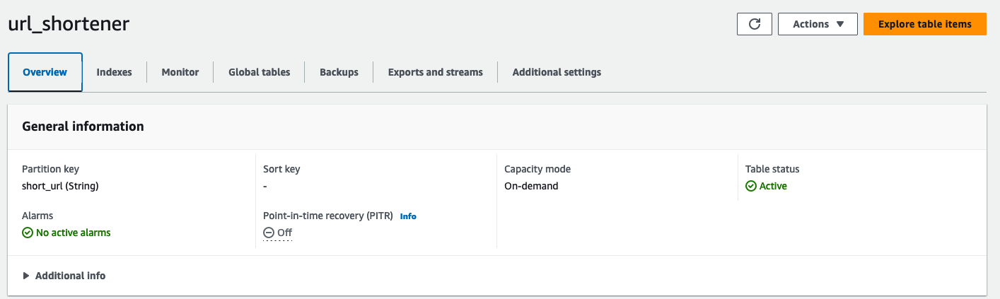

Companies today are making sustainability a key goal for their business in order to improve operational efficiency and drive down cost while also lowering carbon emissions. Achieving these sustainability goals means change across all levels of the business, with application and software development being a key focus. With Rust applications, one of the easiest ways to make progress towards a sustainability goal is to adopt [AWS Graviton instances](https://aws.amazon.com/ec2/graviton/). AWS Graviton processors are designed by AWS to deliver the best price performance for your cloud workloads running in Amazon EC2.

In this tutorial, I will walk through the steps to take an existing application running on x86 instances today and migrate to AWS Graviton powered instances in order to achieve a higher level of sustainability for your Rust application. This guide includes creating AWS resources that you will be charged for.

## What you will learn

- How to build a Rust application for AWS Graviton
- How to port an existing Rust application to AWS Graviton

| Attributes                |                                   |
| ------------------- | -------------------------------------- |
| ✅ AWS Level        | 200 - Intermediate                          |
| ⏱ Time to complete  | 30 minutes                             |
| 💰 Cost to complete | Free when using the AWS Free Tier or USD 2.62      |
| 🧩 Prerequisites    | - [AWS Account](https://docs.aws.amazon.com/accounts/latest/reference/manage-acct-creating.html?sc_channel=el&sc_campaign=costwave&sc_content=building-rust-applications-for-aws-graviton&sc_geo=mult&sc_country=mult&sc_outcome=acq)<br> - [Amazon DynamoDB Table](https://docs.aws.amazon.com/amazondynamodb/latest/developerguide/getting-started-step-1.html?sc_channel=el&sc_campaign=costwave&sc_content=building-rust-applications-for-aws-graviton&sc_geo=mult&sc_country=mult&sc_outcome=acq)|
| 💻 Code Sample         | Code sample used in tutorial on [GitHub](https://github.com/build-on-aws/building-rust-applications-for-aws-graviton)                             |
| 📢 Feedback            | <a href="https://pulse.buildon.aws/survey/DEM0H5VW" target="_blank">Any feedback, issues, or just a</a> 👍 / 👎 ?    |
| ⏰ Last Updated     | 2023-07-20                             |

| ToC |
|-----|

## Setup

### EC2 Setup

To demonstrate how to move a Rust application to AWS Graviton-based Instances, I have built a simple link shortener application in Rust. I’m not a front end developer, so I will be relying on cURL to interact with my application’s APIs. The application is written with the most current release version of Rust at the time of writing, and Rocket 0.5.0-rc3. The application generates a unique 8 character string for each URL that it shortens, and stores the original URL and the 8 character string in a Amazon DynamoDB table. The code is not meant to be used in production and is provided as a sample only.

For this demo, [launch two EC2 instances](https://docs.aws.amazon.com/AWSEC2/latest/UserGuide/EC2_GetStarted.html#ec2-launch-instance?sc_channel=el&sc_campaign=costwave&sc_content=building-rust-applications-for-aws-graviton&sc_geo=mult&sc_country=mult&sc_outcome=acq) running Ubuntu 22.04. The first instance will be of `c5.xlarge` instance-type, and the second will be of `c6g.xlarge` instance-type. Once they are running, [connect to each instance](https://docs.aws.amazon.com/AWSEC2/latest/UserGuide/AccessingInstances.html?sc_channel=el&sc_campaign=costwave&sc_content=building-rust-applications-for-aws-graviton&sc_geo=mult&sc_country=mult&sc_outcome=acq) and install Rust using the following command:

```shell
curl --proto '=https' --tlsv1.2 -sSf https://sh.rustup.rs | sh
```

### Code Checkout

To checkout the sample project, go to [building-rust-applications-for-aws-graviton](https://github.com/build-on-aws/building-rust-applications-for-aws-graviton) and clone the repository using command below:

```bash
git clone https://github.com/build-on-aws/building-rust-applications-for-aws-graviton
```

Check out the code on both - your x86 instance and your AWS Graviton Instance. You should now have a `rust-link-shortener` directory containing all of the appropriate code.

### DynamoDB Setup

The link shortener application will leverage DynamoDB as its data store. Our DynamoDB table will run in On-Demand mode. Let's create a table called `url_shortener` with a Partition Key of `short_url` for our application to use.



Notice we have a Partition Key of **short_url(String)** and a Capacity mode of **On-demand**.

## Compiling for X86

On your `c5.xlarge` instance, navigate to the `building-rust-applications-for-aws-graviton` directory and run the following command to build the application:

```rust
cargo build --release
```

When the build is finished, you should see output as following:

```shell
Finished release [optimized] target(s) in 2m 41s

real    2m41.674s
user    10m6.078s
sys    0m25.774s
```

Navigate to the `target/release` directory and the `rust-link-shortener` binary will be there ready for launch. To launch it run command `./rust-link-shortener`. The application is configured to run on port 8000 and listen on all interfaces for the purposes of this demo.

## Compiling for AWS Graviton (ARM64)

On your `c6g.xlarge` instance, navigate to the `building-rust-applications-for-aws-graviton` directory and run the following command to build the application:

```rust
cargo build --release
```

When the build is finished, you should see output as following:

```shell
Finished release [optimized] target(s) in 3m 27s

real    3m27.946s
user    12m57.304s
sys    0m26.632s
```

Navigate to the `target/release` directory and the `rust-link-shortener` binary will be there ready for launch. To launch it run command `./rust-link-shortener`. The application is configured to run on port 8000 and listen on all interface for the purposes of this demo.

## Testing the Application

To test the application we will use cURL to make a few example requests and verify our application is working properly. All of the commands below can be run against both the EC2 instances.

### Shortening a URL

The following command will shorten a URL. My instance has an IP address of 10.3.76.37, so I’m using that in my command. Make sure to replace the IP address with the address of your EC2 Instance:

```shell
curl -X POST -d "https://aws.amazon.com/ec2/graviton/" http://10.3.76.37:8000/shorten_url -H 'Content-Type: application/json'
```

You should get output that looks like the following:

```shell
https://myservice.localhost/rlbnDueu
```

The `rlbnDueu` is our application’s identifier for our URL.

### Retrieving Full URL

In order to retrieve the original URL, we will need to make another request to the application and pass this value in to the `get_full_url` API, as shown in the following command.

Replace the shortened URL identifier with the identifier you got from the previous command, and make sure your IP address is correct.

```shell
curl -X GET -d "rlbnDueu" http://10.3.76.37:8000/get_full_url -H 'Content-Type: application/json'
```

You should get output that looks like the following:

```shell
Your full URL is https://aws.amazon.com/ec2/graviton/
```

## Load Testing Results

Performance testing is key when comparing multiple instance types. In order to compare a `c6g.xlarge` and a `c5.xlarge` instance we will be performing a load test to verify that the application built for Graviton is working as expected. We discuss various load testing methodologies in the [Graviton Technical Guide on GitHub](https://github.com/aws/aws-graviton-getting-started) and recommend using a framework like [wrk2](https://github.com/kinvolk/wrk2). `wrk2` is a  version of `wrk` that is modified to produce a constant throughput load and report accurate latency details across various percentiles. I decided to go ahead and use `wrk2` to test the `shorten_url` function of our application and compare the total requests per second served as well as the average latency at each percentile during our load test. I've kept the load tests simple in this guide to illustrate that testing is important.

Every time you make a software or hardware change you should re-evaluate your existing configuration and assumptions to ensure you are getting the full benefit of your new configuration. While full performance testing and optimization is outside the scope of this blog we have a [comprehensive performance runbook](https://github.com/aws/aws-graviton-getting-started/blob/main/optimizing.md) and [Rust specific page](https://github.com/aws/aws-graviton-getting-started/blob/main/rust.md) in our AWS Graviton Technical Guide and your AWS team is always ready to help with any questions you may have.

### Load test setup

Because our `shorten_url` function uses the POST method and requires some data, we need a lua config file to pass to wrk2. My `post.lua` file has the following content:

```yaml
wrk.method = "POST"
wrk.headers["content-type"] = "application/json"
wrk.body = "https://aws.amazon.com/ec2/graviton/"
```

### Running the load test

I ran a 30 minutes load test against both the instances using following command:

```shell
wrk -c64 -t30 -d 30m -L -R 90000 -s ./post.lua http://10.3.76.37:8000/shorten_url
```

While running this command, make sure your IP address is correct.

### Results

|Latency Percentiles |C5.xlarge |C6g.xlarge |
|--- |--- |--- |
|50 |12.83ms |13.44ms |
|75 |19.24ms |19.73ms |
|90 |23.31ms |23.49ms |
|99 |25.76ms |25.76ms |
|99.9 |26.00ms |26.00ms |
|99.99 |26.02ms |26.02ms |
|99.999 |26.02ms |26.02ms |
|100 |26.04ms |26.02ms |

| |C5.xlarge |C6g.xlarge |
|--- |--- |--- |
|Requests/Second |11,947.12 |11,960.24 |
|Total Requests Served |21,504,877 |21,528,469 |

Using the same load test our AWS Graviton powered instance achieved similar request latencies across all percentiles, while serving a large number of requests per second and a larger number of total requests. AWS Graviton instances deliver up to 40% better price performance for Rust applications while also increasing your Rust application's sustainability by using up to 60% less energy for the same performance than comparable EC2 instances.

## Cleanup

Now that we are done testing, it is time to clean up all the resources we created in this tutorial. Make sure to [terminate any EC2 Instances](https://docs.aws.amazon.com/AWSEC2/latest/UserGuide/terminating-instances.html?sc_channel=el&sc_campaign=costwave&sc_content=building-rust-applications-for-aws-graviton&sc_geo=mult&sc_country=mult&sc_outcome=acq) you launched and [delete your DynamoDB table](https://docs.aws.amazon.com/amazondynamodb/latest/developerguide/getting-started-step-8.html?sc_channel=el&sc_campaign=costwave&sc_content=building-rust-applications-for-aws-graviton&sc_geo=mult&sc_country=mult&sc_outcome=acq) so you won't incur any additional costs.

## Conclusion

Migrating your Rust applications from x86 EC2 Instances to AWS Graviton powered instances is simple and easy, as shown in this tutorial. Now it is time to try AWS Graviton with your own Rust application!

For common performance considerations and other information, visit our [Graviton Technical Guide](https://github.com/aws/aws-graviton-getting-started/blob/main/rust.md) repository on Github and start migrating your application today.
