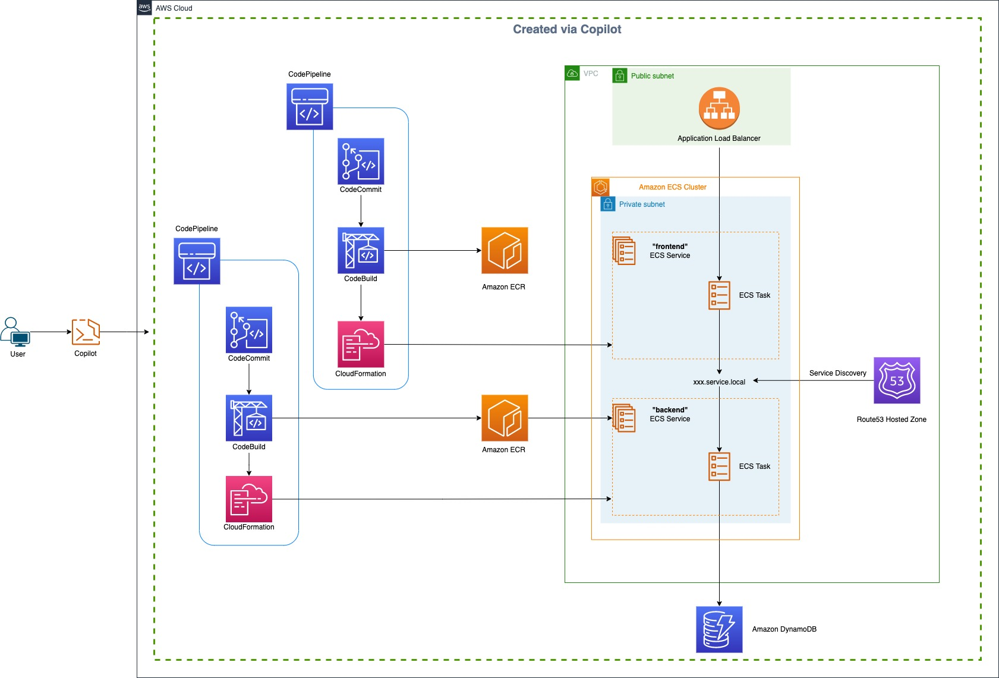
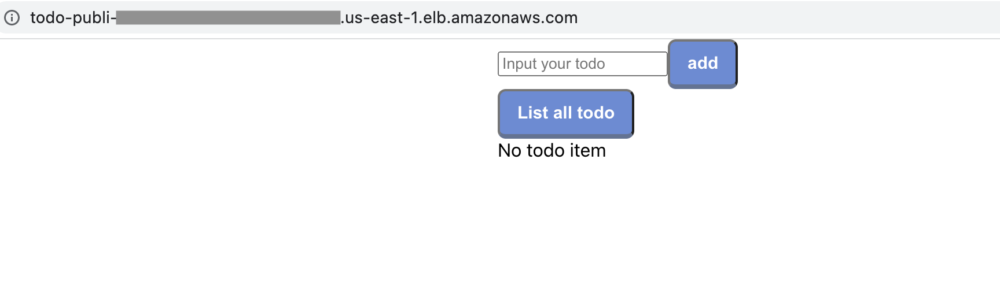

With the rise of application modernization, a significant topic of discussion is breaking down monolithic applications into microservices. Essentially, the process begins with breaking the monolith into its individual working parts, making it easier to create a virtualized application environment using tools like containers. During the process, another question arises: whether to use a single (mono) repository for all microservices or to keep each microservice in its own repository.

Using a repository for each microservice has several benefits:

* Facilitating faster software release
* Enabling the creation of smaller teams to develop and deliver a single service
* Allowing the team to maintain a smaller codebase, reducing complexity
* Allowing for faster build and deployment processes with a smaller codebase
* Allowing for the freedom to write code independently and differently from all other services (using different programming languages, libraries, approaches, etc)

Creating a separate repository for each microservice benefits a team in maintaining its own development and release cycles. Having said this, the next question that arises is how to set up the required infrastructure easily when the microservices are interconnected with each other. As with most things, there is a trade-off: the complexity doesn't just magically disappear. In this instance, the complexity of having multiple parts of a system in single application is reduced by splitting them into separate services, and the complexity is moved to the infrastructure and coordination. Luckily the tooling and approaches to manage this have improved in the last decade as microservice architecture has matured.

This tutorial will show you how you can take advantage of [AWS Copilot CLI](https://docs.aws.amazon.com/AmazonECS/latest/developerguide/AWS_Copilot.html?sc_channel=el&sc_campaign=devopswave&sc_content=cicd_copilot&sc_geo=mult&sc_country=mult&sc_outcome=acq) - that accelerates you to build efficient CI/CD Pipelines for connected microservices in under an hour using AWS Copilot. AWS Copilot CLI is a tool for developers to build, release, and operate production-ready, containerized applications on [AWS App Runner](https://docs.aws.amazon.com/apprunner/latest/dg/what-is-apprunner.html?sc_channel=el&sc_campaign=devopswave&sc_content=cicd_copilot&sc_geo=mult&sc_country=mult&sc_outcome=acq), [Amazon ECS](https://docs.aws.amazon.com/AmazonECS/latest/developerguide/Welcome.html?sc_channel=el&sc_campaign=devopswave&sc_content=cicd_copilot&sc_geo=mult&sc_country=mult&sc_outcome=acq), and [AWS Fargate](https://docs.aws.amazon.com/AmazonECS/latest/developerguide/Welcome.html?sc_channel=el&sc_campaign=devopswave&sc_content=cicd_copilot&sc_geo=mult&sc_country=mult&sc_outcome=acq). More information about Copilot, core concepts can be found in [the Copilot official documentation](https://aws.github.io/copilot-cli/docs/concepts/overview/).

## Table of Contents

| Attributes             |                                                                 |
|------------------------|-----------------------------------------------------------------|
| ✅ AWS experience      | 100 - Beginner                                              |
| ⏱ Time to complete     | 60 minutes                                                      |
| 💰 Cost to complete    | Free tier eligible                                               |
| 🧩 Prerequisites       | - [AWS Account](https://aws.amazon.com/resources/create-account/?sc_channel=el&sc_campaign=devopswave&sc_content=cicd_copilot&sc_geo=mult&sc_country=mult&sc_outcome=acq)|
| 💻 Code Sample         | Code sample used in tutorial on [GitHub](https://github.com/build-on-aws/automate-container-microservices-aws-copilot)                            |
| 📢 Feedback            | <a href="https://pulse.buildon.aws/survey/DEM0H5VW" target="_blank">Any feedback, issues, or just a</a> 👍 / 👎 ?    |
| ⏰ Last Updated        | 2023-04-24                                                     |

| ToC |
|-----|

## Architecture



The architecture diagram above shows a three-tier application with an Application Load Balancer (ALB) forwarding traffic to the **frontend** ECS Service. The frontend ECS service serves the webpage content to the browser and also acts as a router, communicating to the **backend** ECS service that executes the business logic. The backend ECS service in turn uses a DynamoDb table to insert/update/delete data. In this case, the frontend and backend are separate microservices that are maintained using their own CI/CD pipelines and Git repositories. The frontend communicates with the backend using a user-friendly DNS domain name that is created as part of service discovery. The service discovery feature on Amazon ECS manages the DNS records during scale-in and scale-out events. The infrastructure above allows us to deploy each microservice as an independent unit, even though the applications depend on each other for functionality and can be accessed individually.

In the next section, you will build and deploy the above architecture using [AWS Copilot](https://docs.aws.amazon.com/AmazonECS/latest/developerguide/AWS_Copilot.html?sc_channel=el&sc_campaign=devopswave&sc_content=cicd_copilot&sc_geo=mult&sc_country=mult&sc_outcome=acq). You will use a sample “*Todo*” application. It has a UI built using ReactJs and is served from a frontend service. Todo service allows you to organize your work and life, and that is stored on the DynamoDB table for subsequent access of the service. It also lets you add more to-dos, and also delete the ones you don’t need. The frontend service also behaves as a router to the backend service using a Nginx proxy server for the requests received from the LoadBalancer. The backend service does the actual business logic of managing the data that is stored in the DynamoDB table. The Service discovery associated with the backend service maintains the DNS records within the Route53 private hosted zone. This is essential for maintaining the correct DNS records for the frontend service to access the backend service using a user-friendly URL, since the internal IP addresses of the backend service can change due to scaling events. Both frontend and backend are deployed within the same VPC and placed within the private subnets. The Application Load Balancer is placed within the public subnets. All the infrastructure that is required for this functionality to work can be created using AWS Copilot.

## Prerequisites

There are some prerequisites required for you to proceed in this post. Make sure you have the below items configured to proceed with the next sections on this post:

1. An active [AWS Account](https://aws.amazon.com/resources/create-account/?sc_channel=el&sc_campaign=devopswave&sc_content=cicd_copilot&sc_geo=mult&sc_country=mult&sc_outcome=acq)
2. [AWS Copilot installed](https://docs.aws.amazon.com/AmazonECS/latest/developerguide/AWS_Copilot.html?sc_channel=el&sc_campaign=devopswave&sc_content=cicd_copilot&sc_geo=mult&sc_country=mult&sc_outcome=acq)
3. AWS CLI [installed](https://docs.aws.amazon.com/cli/latest/userguide/getting-started-install.html?sc_channel=el&sc_campaign=devopswave&sc_content=cicd_copilot&sc_geo=mult&sc_country=mult&sc_outcome=acq) and [configured](https://docs.aws.amazon.com/cli/latest/userguide/cli-chap-configure.html?sc_channel=el&sc_campaign=devopswave&sc_content=cicd_copilot&sc_geo=mult&sc_country=mult&sc_outcome=acq) to interact with your account
4. [Git client](https://docs.aws.amazon.com/codecommit/latest/userguide/setting-up-gc.html#setting-up-gc-install-git) installed
5. Docker [installed](https://docs.docker.com/engine/install/) and [running](https://docs.docker.com/config/daemon/start/) on your workstation

## Initial Setup

In this section, you will do the initial setup of pulling down the sample application code, initialize the application and environment on to your terminal as a starting point requirement for using Copilot. We will start with this sample application where all the code is in a single, mono-repo, deploy the frontend and backend service as a separate unit, and then move the code into its own repository with a CI/CD process. If you have not already set up the Copilot CLI, please ensure you have installed it.

### 1. Download copy of sample application

Pull down the sample application to your local workstation and change the directory to the code location:

```bash
git clone git@github.com:build-on-aws/automate-container-microservices-aws-copilot.git
cd automate-container-microservices-aws-copilot/code
```

The code directory structure should look like this (if you interested, this is generated using [tree](https://linux.die.net/man/1/tree) using `tree -d`):

```bash
.
├── backend
│   └── manifests
│       ├── backend
│       │   └── addons
│       ├── environments
│       │   └── development
│       └── pipelines
│           └── todobackend-main
└── frontend
    ├── manifests
    │   ├── environments
    │   │   └── development
    │   ├── frontend
    │   └── pipelines
    │       └── todofrontend-main
    └── webapp
        ├── public
        └── src
            ├── components
            └── modules
```

### 2. Navigate into the backend folder

Make sure you are within the `backend` folder on your terminal. If not, run the below command to change directory:

```bash
cd backend/
```

The folder structure should look like this:

```bash
.
├── Dockerfile
├── app.py
└── requirements.txt
```

### 3. Initialize an application using copilot

The first step in using Copilot is to initialize a new application using our existing code. Run this command to initialize the backend with Copilot:

```bash
copilot app init todo
```

As a result of executing the command above, you should see something similar to this:

```bash
✔ Proposing infrastructure changes for stack todo-infrastructure-roles
- Creating the infrastructure for stack todo-infrastructure-roles                               [create complete]  [39.0s]
  - A StackSet admin role assumed by CloudFormation to manage regional stacks                   [create complete]  [16.0s]
  - An IAM role assumed by the admin role to create ECR repositories, KMS keys, and S3 buckets  [create complete]  [17.2s]
✔ The directory copilot will hold service manifests for application todo.

Recommended follow-up action:
  - Run `copilot init` to add a new service or job to your application.
```

When you run `copilot app init`, Copilot creates an IAM role using CloudFormation to manage services and jobs. Copilot also registers the `/copilot/applications/todo` parameter to the Systems Manager Parameter Store. If you run `copilot app ls`, for example, Copilot would check the Parameter Store and notify you of all applications in the AWS Region.

You can see the newly created `copilot` directory. This directory saves the manifest files.

### 4. Set up a development environment

Now that we have initialized an application, we need somewhere to deploy it to. Copilot allows defining multiple environments, and we will be setting up one called `development`. Run a `copilot env init` command to create a development environment. Follow the interactive terminal and provide the inputs. You will be asked a few questions, and you should provide the following answers:

* What is your environment's name? Enter `development`.
* Which credentials would you like to use to create development? **Choose the profile for your development account** and press Enter.
* Would you like to use the default configuration for a new environment? Select `Yes, use default.` and press Enter.

This command generates a yaml file in `copilot/environments/development/manifest.yml`. This manifest file contains the configuration for the environment that Copilot set up.

When creating an environment, Copilot registers the of it in the AWS Systems Manager Parameter Store, and creates an IAM Role to manage the CloudFormation stack it creates for all infrastructure. You can see the progress in the terminal. When the environment creation is complete, you will see the output on the screen:

```bash
Environment name: development
Credential source: [profile default]
Default environment configuration? Yes, use default.
✔ Wrote the manifest for environment development at copilot/environments/development/manifest.yml
- Update regional resources with stack set "todo-infrastructure"  [succeeded]  [0.0s]
- Update regional resources with stack set "todo-infrastructure"  [succeeded]        [125.6s]
  - Update resources in region "us-west-2"                        [create complete]  [127.7s]
    - KMS key to encrypt pipeline artifacts between stages        [create complete]  [120.6s]
    - S3 Bucket to store local artifacts                          [create complete]  [3.0s]
✔ Proposing infrastructure changes for the todo-development environment.
- Creating the infrastructure for the todo-development environment.  [create complete]  [41.5s]
  - An IAM Role for AWS CloudFormation to manage resources           [create complete]  [15.7s]
  - An IAM Role to describe resources in your environment            [create complete]  [16.3s]
✔ Provisioned bootstrap resources for environment development in region us-west-2 under application todo.
Recommended follow-up actions:
  - Update your manifest copilot/environments/development/manifest.yml to change the defaults.
  - Run `copilot env deploy --name development` to deploy your environment.
```

Run the `copilot env ls` command and check if the development environment has been created. You should see an output like this:

```bash
$ copilot env ls
development
```

### 5. Set up required infrastructure in the development environment

Now that we have our Copilot application initialized, and an environment set up, it is time to set up the required infrastructure to run our containerized applications. Run the `copilot env deploy` command, it should only prompt you for inputs if you've used Copilot before and have set up some applications in the account you specified in the initialize command. If you only set up a single environment, it will default to using it. It will now proceed to create the VPC, Public Subnets, Private Subnets, Route53 Private HostedZone for Service discovery, custom route table, Security Group for containers to talk to each other, and an ECS Cluster to group the ECS services. When the environment creation is complete, you will see this output:

```bash
Only found one environment, defaulting to: development
✔ Proposing infrastructure changes for the todo-development environment.
- Creating the infrastructure for the todo-development environment.           [update complete]  [73.1s]
  - An ECS cluster to group your services                                     [create complete]  [7.5s]
  - A security group to allow your containers to talk to each other           [create complete]  [0.0s]
  - An Internet Gateway to connect to the public internet                     [create complete]  [17.1s]
  - Private subnet 1 for resources with no internet access                    [create complete]  [3.4s]
  - Private subnet 2 for resources with no internet access                    [create complete]  [3.3s]
  - A custom route table that directs network traffic for the public subnets  [create complete]  [10.9s]
  - Public subnet 1 for resources that can access the internet                [create complete]  [3.3s]
  - Public subnet 2 for resources that can access the internet                [create complete]  [0.0s]
  - A private DNS namespace for discovering services within the environment   [create complete]  [42.6s]
  - A Virtual Private Cloud to control networking of your AWS resources       [create complete]  [11.0s]
```

We now have everything ready to deploy our first service. In the next sections, we will deploy the infrastructure and the application. We will deploy the backend first, and then our frontend.

## Set Up the Backend Service

We're now ready to deploy our backend. To illustrate practically how to split a monolith, we will be deploying the existing code from our `backend` folder inside the mono-repo, create the DynamoDB table it requires, and then move it to a new repo. Once the code is committed to the new repo, we will set up a CI/CD pipeline that will automatically build and deploy any future changes we make to it.

### 1. Initialize the backend service

In this step, you will create an ECS service that hosts the backend application within the ECS tasks. As pictured in the architecture diagram, the backend service also needs a DynamoDB table for database. You will be creating that as well in this step via Copilot.

Run the `copilot svc init` command to create a manifest file which defines your backend service.

You will be asked a few questions and should provide the following answers:

* Which service type best represents your service's architecture? Select **Backend** **Service** and press Enter.
* What do you want to name this service? Enter **backend**.
* Which Dockerfile would you like to use for backend? Select **./Dockerfile** and press Enter.

This command creates an ECR repository to save Docker images for the backend service and creates a `copilot/backend` directory to save a manifest file. When the backend service creation is complete, you will see this output:

```bash
$ copilot svc init
Note: It's best to run this command in the root of your workspace.
Service type: Backend Service
Service name: backend
Dockerfile: ./Dockerfile
✔ Wrote the manifest for service backend at copilot/backend/manifest.yml
Your manifest contains configurations like your container size and port (:10000).

- Update regional resources with stack set "todo-infrastructure"  [succeeded]        [11.8s]
  - Update resources in region "us-west-2"                        [update complete]  [6.3s]
    - ECR container image repository for "backend"                [create complete]  [2.2s]
Recommended follow-up actions:
  - Update your manifest copilot/backend/manifest.yml to change the defaults.
  - Run `copilot svc deploy --name backend --env test` to deploy your service to a test environment.
```

This will only create the ECR repository for the container image, and not build the image, or deploy it yet. The `copilot svc init` command created a manifest file within the `copilot/backend/manifest.yml` file. to ensure we can monitor if our container is healthy, we need to add a healthcheck. This is an endpoint that is periodically accessed to report if the application is healthy. It can run a series of internal checks, or just respond with an HTTP "OK" (HTTP response 200). To add a healthcheck, modify `copilot/backend/manifest.yml`, and add the `healthcheck` section shown below in the `image` section directly below `port`:

```yml
image:
  build: backend/Dockerfile
  # Port exposed through your container to route traffic to it.
  port: 10000
  healthcheck:
    command: ["CMD-SHELL", "curl -f http://localhost:10000/ishealthy || exit 1"]
    interval: 10s
    retries: 2
    timeout: 6s 
    start_period: 10s
```

If you are curious how the healthcheck was implemented in the backend, take a look at the [route](https://github.com/build-on-aws/automate-container-microservices-aws-copilot/blob/main/code/backend/app.py#L29-L31) added in `app.py`:

```python
@app.route('/ishealthy')
def receive_health_check():
    return "Health check succeed\n"
```

### 2. Create a DynamoDB table

In this step, you will be creating the [DynamoDB](https://aws.amazon.com/dynamodb/) table required by the backend service using Copilot. The backend service uses a DynamoDB table to save to-do items. You can add storage resources to services with the `copilot storage init` command.

Run the `copilot storage init` command to create a DynamoDB table to be used by the backend service.

You will be asked a few questions and should provide the following answers:

* What type of storage would you like to associate with backend? Select **DynamoDB** and press Enter.
* What would you like to name this DynamoDB Table? Enter **todotable**.
* Do you want the storage to be created and deleted with the backend service? Select **Yes, the storage should be created and deleted at the same time as backend**
* What would you like to name the partition key of this DynamoDB? Enter **TodoId**.
* What datatype is this key? Select **Number** and press **Enter**.
* Would you like to add a sort key to this table? Enter **n**.

By running the `copilot storage init` command, Copilot creates a `copilot/backend/addons` directory and a CloudFormation template: `todotable.yml` in the directory. Copilot uses this template to create additional resources. Once the CloudFormation template has been created, you should see the following output:

``````bash
$ copilot storage init
Storage type: DynamoDB
Only found one workload, defaulting to: backend
Storage resource name: todotable
Lifecycle:  Yes, the storage should be created and deleted at the same time as backend
Partition key: TodoId
Partition key datatype: Number
Sort key? No
✔ Wrote CloudFormation template at copilot/backend/addons/todotable.yml

Recommended follow-up actions:
  - Update backend's code to leverage the injected environment variable TODOTABLE_NAME.
    For example, in JavaScript you can write:
```
const storageName = process.env.TODOTABLE_NAME
```
  - Run `copilot deploy --name backend` to deploy your storage resources.
``````

The above setup also creates an environment variable in the ECS Task definition with the name `TODOTABLE_NAME`. If you look at the `app.ts` file, the application is [already equipped to use this environment variable](https://github.com/build-on-aws/automate-container-microservices-aws-copilot/blob/main/code/backend/app.py#L7) with the following line of the code:

```python
table_name = os.getenv('TODOTABLE_NAME')
```

### 3. Deploy the backend service

Run the `copilot svc deploy` command to deploy the backend service to the development environment automatically. You have not built the Docker image, so it will take some time to build a container image. You can see the progress on the terminal.

After the deployment is complete, you should see this output:

```bash
✔ Proposing infrastructure changes for stack todo-development-backend
- Creating the infrastructure for stack todo-development-backend              [create complete]  [325.6s]
  - An Addons CloudFormation Stack for your additional AWS resources          [create complete]  [42.5s]
    - An IAM ManagedPolicy for your service to access the todotable db        [create complete]  [18.6s]
    - An Amazon DynamoDB table for todotable                                  [create complete]  [11.4s]
  - Service discovery for your services to communicate within the VPC         [create complete]  [0.0s]
  - Update your environment's shared resources                                [create complete]  [0.0s]
  - An IAM role to update your environment stack                              [create complete]  [20.4s]
  - An IAM Role for the Fargate agent to make AWS API calls on your behalf    [create complete]  [20.4s]
  - A CloudWatch log group to hold your service logs                          [create complete]  [0.0s]
  - An ECS service to run and maintain your tasks in the environment cluster  [create complete]  [245.3s]
    Deployments                                                                                   
               Revision  Rollout      Desired  Running  Failed  Pending                                   
      PRIMARY  1         [completed]  1        1        0       0                                         
  - An ECS task definition to group your containers and run them on ECS       [create complete]  [3.2s]
  - An IAM role to control permissions for the containers in your tasks       [create complete]  [18.5s]
✔ Deployed service backend.
Recommended follow-up action:
  - You can access your service at backend:10000 with service connect.
```

After deployment, run `copilot svc status` to see the service status. If the status is ACTIVE, then your container is running normally.

```bash
Found only one deployed service backend in environment development
Task Summary

  Running   ██████████  1/1 desired tasks are running

Tasks

  ID        Status      Revision    Started At
  --        ------      --------    ----------
  121b23ed  RUNNING     1           12 minutes ago
```

For the backend service, Copilot also sets up service discovery. Service discovery uses AWS Cloud Map API actions to manage HTTP and DNS namespaces for your Amazon ECS services to enable other services to send requests to your services. `COPILOT_SERVICE_DISCOVERY_ENDPOINT` is a special environment variable that the Copilot CLI sets for you when it creates the service. The format is `{env name}.{app name}.local` and requests to `/api` are passed to `http://backend.development.todo.local:10000/`. The endpoint `backend.development.todo.local` resolves to a private IP address and is routed privately within your VPC to the backend service. When configuring the frontend service, you will be using the `COPILOT_SERVICE_DISCOVERY_ENDPOINT` environment variable to access the backend service using service discovery. More information about Service Discovery can be found [here](https://docs.aws.amazon.com/AmazonECS/latest/developerguide/service-discovery.html).

### 4. Set up the CI/CD pipeline for backend

We are now ready to move our backend service's code to its own repository. First, let's move the code to a new, empty directory. First, change back to the root directory containing the originally cloned `automate-container-microservices-aws-copilot` directory, and then run:

```bash
mkdir todobackend
mv automate-container-microservices-aws-copilot/code/backend/* todobackend/
```

The `todobackend` folder should now contain the following:

```bash
.
├── Dockerfile
├── app.py
├── copilot
│   ├─ backend
│   │   ├─ addons
│   │   │   └── todotable.yml
│   │   └── manifest.yml
│   └── environments
│       └── development
│           └── manifest.yml
├─ manifests
│   ├─ backend
│   │   ├─ addons
│   │   │   └── todotable.yml
│   │   └── manifest.yml
│   └── environments
│       └── development
│           └── manifest.yml
└── requirements.txt
```

We are now ready to initialize this new directory as a git repository, create a hosted git repository, and set our local git repository to use the new remote one. We will be using an AWS CodeCommit repository to illustrate this approach. Use the following commands to change into the backend source directory, set up the new CodeCommit repo, initialize the local directory as a git repository, and then set it to use the remote CodeCommit repository:

```bash
cd todobackend
aws codecommit create-repository --repository-name todobackend --repository-description "My todoapp repository"
git init
git switch -c main
git remote add origin https://git-codecommit.$(aws configure get region).amazonaws.com/v1/repos/todobackend
```

Next, run `copilot pipeline init` to generate a pipeline manifest - this will create the configuration for the pipeline in the manifest file, but not yet set it up. You will notice the `$(aws configure get region)` in the URL, this will get the region that your AWS CLI is set up to use to ensure we create the CodeCommit repository in the same region as the rest of our infrastructure. You will also see an error message between the command you entered and where it is asking for input with the following:

```bash
Only one git remote detected. Your pipeline will follow 'https://git-codecommit.us-west-2.amazonaws.com/v1/repos/todobackend'.
fatal: ambiguous argument 'HEAD': unknown revision or path not in the working tree.
Use '--' to separate paths from revisions, like this:
'git <command> [<revision>...] -- [<file>...]'
Your pipeline will follow branch 'main'.
```

This is due to git still using `master` as the branch name, and we changed it to use `main` with the `git switch -c main` command, but have yet to commit anything. Copilot will default to using `main` since it is the currently selected branch, so you can safely ignore this error. Let's continue with the prompts to set up our CI/CD pipeline. You will be asked a few questions and should provide the following answers:

* What would you like to name this pipeline? Type **todobackend-main** and press Enter.
* What type of continuous delivery pipeline is this? Move to **Workloads** and press Enter.
* Which environment would you like to add to your pipeline? Move to **development** and press Enter.
* Which environment would you like to add to your pipeline? Move to **No additional environments** and press Enter. (If you have never used Copilot, this option will not be shown, and default to the `development` environment)

Then you should see this output:

```bash
Pipeline name: todobackend-main
What type of continuous delivery pipeline is this? Workloads
1st stage: development

✔ Wrote the pipeline manifest for todobackend at 'copilot/pipelines/todobackend-main/manifest.yml'
The manifest contains configurations for your pipeline.
Update the file to add stages, change the tracked branch, add test commands or manual approval actions.
✔ Wrote the buildspec for the pipeline's build stage at 'copilot/pipelines/todobackend-main/buildspec.yml'
The buildspec contains the commands to push your container images, and generate CloudFormation templates.
Update the "build" phase to unit test your services before pushing the images.

Required follow-up actions:
- Commit and push the copilot/ directory to your repository.
- Run `copilot pipeline deploy` to create your pipeline.
```

We are now ready to create our pipeline, run `copilot pipeline deploy` to create it. This command uses the CodeCommit repository that was was added as a remote git repository as a source stage to CodePipeline. Once this command succeeds, you should see the output on the terminal, like this:

```bash
$ copilot pipeline deploy
Only found one pipeline; defaulting to: todobackend-main
✔ Successfully added pipeline resources to your application: todo
✔ Successfully created a new pipeline: todobackend-main
```

Finally, push the local code to CodeCommit repository:

```bash
git add -A
git commit -m 'initial commit'
git push origin main
```

At this point, you can go to the [CodePipeline console](https://us-west-2.console.aws.amazon.com/codesuite/codepipeline/pipelines?region=us-west-2) in your AWS account to see the pipeline running. Any future changes to the backend application can be made within the git repository, and pushing it to the remote repository should automatically deploy your code via CodePipeline.  

## Set Up the Frontend Service

We will now set up the frontend service. Since we already set up the Copilot application and environment while configuring the backend service in the previous section, we won't need to create those again, and just use the existing ones. We will follow the same approach of first creating and deploying the frontend, then move it to its own repository, and then set up the CI/CD pipeline to deploy any changes made to that repository.

### 1. Initialize the frontend service

To deploy our frontend, first, navigate back to the `code/frontend` directory in the `automate-container-microservices-aws-copilot`. The folder structure should look like this:

```bash
.
├── Dockerfile
├── backend.conf.template
├── nginx.conf
└── webapp
    ├── README.md
    ├── package.json
    ├── public
    │   ├── index.html
    │   ├── manifest.json
    │   └── robots.txt
    ├── src
    │   ├── App.css
    │   ├── App.test.tsx
    │   ├── App.tsx
    │   ├── Types.ts
    │   ├── components
    │   │   ├── TableOperation.tsx
    │   │   ├── TaskInput.tsx
    │   │   ├── TaskItem.tsx
    │   │   ├── TaskList.tsx
    │   │   └── util.ts
    │   ├── index.css
    │   ├── index.tsx
    │   ├── modules
    │   │   └── tasksModule.ts
    │   ├── react-app-env.d.ts
    │   ├── reportWebVitals.ts
    │   ├── rootReducer.ts
    │   ├── setupTests.ts
    │   └── store.ts
    └── tsconfig.json
```

Execute `copilot app init` to initialize the frontend application. Copilot will detect the previous application and environment we created. You will be asked a few questions and should provide the following answers:

* Would you like to use one of your existing applications? (Y/n) Choose **Y**.
* Which existing application do you want to add a new service or job to? [Use arrows to move, type to filter, ? for more help] Choose **todo**.

You should see these results:

```bash
Use existing application: Yes
Application name: todo
✔ Proposing infrastructure changes for stack todo-infrastructure-roles
✔ The directory copilot will hold service manifests for application todo.

Recommended follow-up action:
  - Run `copilot init` to add a new service or job to your application.
```

### 2. Initialize the frontend service

We are now ready to initialize and deploy frontend service. You may have noticed that we skipped the step to set up the environment, and that is intentional as Copilot will detect if there are any configured. If you have used Copilot before, you will be presented with a list to choose from. If this is your first time, it will detect there is only the `development` environment, and default to using it.

To initialize our frontend service, run the `copilot svc init` command to create a manifest file that defines it. You will be asked a few questions and should provide the following answers:

* Which service type best represents your service's architecture? Select **Load Balanced Web Service** and press Enter.
* What do you want to name this service? Enter **frontend**.
* Which Dockerfile would you like to use for backend? Select **.Dockerfile** and press Enter.

Similar to the backend service, this will create an ECR repository to store Docker images for the frontend service, and create the manifest file in `copilot/frontend`. When completed, you should see similar output:

```bash
Note: It's best to run this command in the root of your workspace.
Service type: Load Balanced Web Service
Service name: frontend
Dockerfile: ./Dockerfile
✔ Wrote the manifest for service frontend at copilot/frontend/manifest.yml
Your manifest contains configurations like your container size and port (:80).

- Update regional resources with stack set "todo-infrastructure"  [succeeded]        [10.2s]
  - Update resources in region "us-west-2"                        [update complete]  [9.0s]
    - ECR container image repository for "frontend"               [create complete]  [4.4s]
Recommended follow-up actions:
  - Update your manifest copilot/frontend/manifest.yml to change the defaults.
  - Run `copilot svc deploy --name frontend --env test` to deploy your service to a test environment.
```

### 4. Deploy the frontend service

We're now ready to deploy the frontend, let's run `copilot svc deploy` to deploy it to the development environment. We have not built a docker image yet, so it will take a bit of time to do so. The output from the command will keep you updated with the progress, and any errors it encountered. Once the deployment is done, you should see the following:

```bash
✔ Proposing infrastructure changes for stack todo-development-frontend
- Creating the infrastructure for stack todo-development-frontend                 [create complete]    [299.3s]
  - Service discovery for your services to communicate within the VPC             [create complete]    [0.0s]
  - Update your environment's shared resources                                    [update complete]    [115.4s]
    - A security group for your load balancer allowing HTTP traffic               [create complete]    [2.5s]
    - An Application Load Balancer to distribute public traffic to your services  [create complete]    [88.2s]
    - A load balancer listener to route HTTP traffic                              [create in progress]  [154.6s]
  - An IAM role to update your environment stack                                  [create complete]    [18.7s]
  - An IAM Role for the Fargate agent to make AWS API calls on your behalf        [create complete]    [16.3s]
  - An HTTP listener rule for path `/` that forwards HTTP traffic to your tasks   [create complete]    [3.3s]
  - A custom resource assigning priority for HTTP listener rules                  [create complete]    [2.6s]
  - A CloudWatch log group to hold your service logs                              [create complete]    [0.0s]
  - An IAM Role to describe load balancer rules for assigning a priority          [create complete]    [14.7s]
  - An ECS service to run and maintain your tasks in the environment cluster      [create complete]    [125.2s]
    Deployments                                                                                         
               Revision  Rollout      Desired  Running  Failed  Pending                                         
      PRIMARY  1         [completed]  1        1        0       0                                               
  - A target group to connect the load balancer to your service on port 80        [create complete]    [17.1s]
  - An ECS task definition to group your containers and run them on ECS           [create complete]    [2.2s]
  - An IAM role to control permissions for the containers in your tasks           [create complete]    [17.1s]
✔ Deployed service frontend.
Recommended follow-up action:
  - You can access your service at http://todo-Publi-14BEAZOWSOFPS-1809648126.us-west-2.elb.amazonaws.com over the internet.
```

You can now access the todo app using a browser and the URL that was returned by the deployment. To see more details about the services, you can run `copilot svc status`, and select which service you want the status of. To confirm that the container deployed successfully, select the `frontend` service, and look for the `RUNNING` status. You should see output similar to this:

```bash
Service: frontend
Task Summary

  Running   ██████████  1/1 desired tasks are running
  Health    ██████████  1/1 passes HTTP health checks

Tasks

  ID        Status      Revision    Started At   HTTP Health
  --        ------      --------    ----------   -----------
  fc25084a  RUNNING     1           2 hours ago  HEALTHY
```

At this point, we have deployed both the frontend and backend services, and you should see the service running opening a browser and using the output URL. It should look something like this:



If you are wondering how the frontend service knows about the backend service, then take a look at the Nginx configuration file: `backend.conf.template`. Requests to `/api` are passed to `backend.${COPILOT_SERVICE_DISCOVERY_ENDPOINT}`. `COPILOT_SERVICE_DISCOVERY_ENDPOINT` is a special environment variable that the Copilot CLI sets for you when it creates your service. It uses the format `{env name}.{app name}.local`, and requests to `/api` are passed to `http://backend.development.todo.local:10000/`. The endpoint `backend.development.todo.local` resolves to a private IP address and is routed privately within your VPC to the backend service. More information about Service Discovery can be found [here](https://docs.aws.amazon.com/AmazonECS/latest/developerguide/service-discovery.html).

We still have one more task left, and that is to set up the CI/CD pipeline to automatically deploy any changes to the frontend for us.

### 5. Setup CI/CD pipeline for frontend

Similar to the backend, we will be moving the frontend code to its own repository, and use CodeCommit again. Please make sure you are in the directory that contains the `automate-container-microservices-aws-copilot` directory, and run the following commands:

```bash
mkdir todofrontend
mv automate-container-microservices-aws-copilot/code/frontend/* todofrontend/
```

The `todobackend` folder should now contain the following:

```bash
.
├── Dockerfile
├── backend.conf.template
├── manifests
│   ├── environments
│   │   └── development
│   │       └── manifest.yml
│   └─── frontend
│           └── manifest.yml
├── nginx.conf
└── webapp
    ├── README.md
    ├── package.json
    ├── public
    │   ├── index.html
    │   ├── manifest.json
    │   └── robots.txt
    ├── src
    │   ├── App.css
    │   ├── App.test.tsx
    │   ├── App.tsx
    │   ├── Types.ts
    │   ├── components
    │   │   ├── TableOperation.tsx
    │   │   ├── TaskInput.tsx
    │   │   ├── TaskItem.tsx
    │   │   ├── TaskList.tsx
    │   │   └── util.ts
    │   ├── index.css
    │   ├── index.tsx
    │   ├── modules
    │   │   └── tasksModule.ts
    │   ├── react-app-env.d.ts
    │   ├── reportWebVitals.ts
    │   ├── rootReducer.ts
    │   ├── setupTests.ts
    │   └── store.ts
    └── tsconfig.json
```

We are now ready to set up the new repository with the following commands:

```bash
cd todofrontend
aws codecommit create-repository --repository-name todofrontend --repository-description "My todoapp frontend repository"
git init
git switch -c main
git remote add origin https://git-codecommit.$(aws configure get region).amazonaws.com/v1/repos/todofrontend
```

Similar to before, we use `$(aws configure get region)` to inject the region our AWS CLI is set up to use so it matches the rest of our infrastructure.

We can now generate our pipeline manifest by running `copilot pipeline init`. You will be asked a few questions and should provide the following answers:

* What would you like to name this pipeline? Type **todofrontend-main** and press Enter.
* What type of continuous delivery pipeline is this? Move to **Workloads** and press Enter.
* Which environment would you like to add to your pipeline? Move to **development** and press Enter.
* Which environment would you like to add to your pipeline? Move to **No additional environments** and press Enter. This will only be asked if you have used Copilot before and created addition environments.

You should see the following output (and ignoring the error regarding which branch to use as before):

```bash
Only one git remote detected. Your pipeline will follow 'https://git-codecommit.us-west-2.amazonaws.com/v1/repos/todofrontend'.
fatal: ambiguous argument 'HEAD': unknown revision or path not in the working tree.
Use '--' to separate paths from revisions, like this:
'git <command> [<revision>...] -- [<file>...]'
Your pipeline will follow branch 'main'.
Pipeline name: todofrontend-main
What type of continuous delivery pipeline is this? Workloads
1st stage: development

✔ Wrote the pipeline manifest for todofrontend at 'copilot/pipelines/todofrontend-main/manifest.yml'
The manifest contains configurations for your pipeline.
Update the file to add stages, change the tracked branch, add test commands or manual approval actions.
✔ Wrote the buildspec for the pipeline's build stage at 'copilot/pipelines/todofrontend-main/buildspec.yml'
The buildspec contains the commands to push your container images, and generate CloudFormation templates.
Update the "build" phase to unit test your services before pushing the images.

Required follow-up actions:
- Commit and push the copilot/ directory to your repository.
- Run `copilot pipeline deploy` to create your pipeline.
```

Next, run `copilot pipeline deploy` to create the pipeline. This command uses the CodeCommit repository that was was added as a remote git repository as the source stage to CodePipeline. Once this command succeeds, you should see this output:

```bash
Only found one pipeline; defaulting to: todofrontend-main
✔ Successfully added pipeline resources to your application: todo
✔ Successfully created a new pipeline: todofrontend-main
```

Finally, push the local code to CodeCommit repository with:

```bash
git add -A
git commit -m 'initial commit'
git push origin main
```

> Note: Make sure you push the Copilot directory with all its contents.

At this point, you can go to the [AWS CodePipeline console](https://us-west-2.console.aws.amazon.com/codesuite/codepipeline/pipelines?region=us-west-2) in your AWS account to see the pipeline running. Any future changes to the front application can be made within the git repository, and pushing it to the remote repository should automatically deploy your code via CodePipeline.

## Conclusion

Congratulations! You have just deployed a two service microservice application using Copilot! I hope you enjoyed how much easier AWS Copilot makes it to deploy microservices that are well architected and applied with AWS best practices, along with CI/CD pipelines to deploy any changes. This tutorial illustrated how to set up two microservices, and how they communicate with each other, but you can add as many services as you need by following what you learnt. You can continue to use the application we just deployed, or remove it to avoid incurring a monthly running cost.

## Clean up

To remove all the resources created in this tutorial, please run the following commands:

1. In the `todofrontend` run `copilot app delete` and press `y` and enter to confirm. This will delete the backend, frontend, CI/CD pipelines, and the `development` environment. You should see the following output once it completed successfully after a few minutes:
    ```bash
    $ copilot app delete
    Sure? Yes
    ✔ Delete stack todo-development-backend
    - Update regional resources with stack set "todo-infrastructure"  [succeeded]        [7.9s]
      - Update resources in region "us-west-2"                        [update complete]  [7.0s]

    ✔ Deleted service backend from application todo.
    ✔ Delete stack todo-development-frontend
    - Update regional resources with stack set "todo-infrastructure"  [succeeded]        [6.7s]
      - Update resources in region "us-west-2"                        [update complete]  [3.8s]

    ✔ Deleted service frontend from application todo.
    ✔ Retained IAM roles for the "development" environment
    ✔ Delete environment stack todo-development
    ✔ Deleted environment "development" from application "todo".
    ✔ Cleaned up deployment resources.
    ✔ Deleted pipeline todofrontend-main from application todo.
    ✔ Deleted pipeline todobackend-main from application todo.
    ✔ Deleted regional resources for application "todo"
    ✔ Delete application roles stack todo-infrastructure-roles
    ✔ Deleted application configuration.
    ✔ Deleted local .workspace file.
    ```
2.  Run the following two commands to delete the CodeCommit repositories created:
    ```bash
    aws codecommit delete-repository --repository-name todofrontend
    aws codecommit delete-repository --repository-name todobackend
    ```

If you enjoyed this tutorial, found an issues, or have feedback for us, <a href="https://pulse.buildon.aws/survey/DEM0H5VW" target="_blank">please send it our way!</a>
