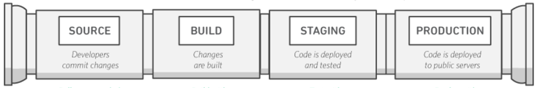

Continuous Integration and Continuous Delivery (CI/CD) is a method for implementing [DevOps](/concepts/what-is-devops). It is both a process and infrastructure that enables developers to rapidly and incrementally build and deliver software updates. In this article, we start with a high level overview of Continuous Integration, examining how it improves software quality and rapid delivery. To better understand the process, we’ll use a concrete example of each step to illustrate the process and demonstrate how DevOps and CI improves the software development process.

So what is continuous integration in simple terms? Think about it like this: DevOps emphasizes testing, incremental updates, and frequent releases; CI is a software development process that implements DevOps practices. It is often described as a pipeline, in which code is submitted, built, tested, and published through a series of iterative stages. Each stage is a step toward delivering software. Code changes are built and tested automatically through the pipeline. If the change fails a stage or creates a regression, the stage detects the error and stops the process until it is resolved. When the error is fixed, the code moves to the next stage. The pipeline ensures software quality because the process stops when the software fails to meet the conditions of a stage. In DevOps, code changes are small and incremental, allowing for rapid releases.

|  |
|-|

The figure above illustrates a simple pipeline; however, stages can be added to meet business requirements. For example, a pipeline may have a test stage for unit tests that test for specific functions and it may have an integration test stage where the application is tested as a whole. Stages can also define where the responsibility of one team ends and [another team's starts](https://docs.aws.amazon.com/whitepapers/latest/practicing-continuous-integration-continuous-delivery/a-pathway-to-continuous-integrationcontinuous-delivery.html?sc_channel=el&sc_campaign=devopswave&sc_content=continuous-integration-with-gitlab-at-10000-feet&sc_geo=mult&sc_country=mult&sc_outcome=acq).

## Table of Content

|ToC|
|---|

## GitLab

There are many CI/CD solutions and in this article, we’ll use [GitLab](https://gitlab.com/), a DevOps software package. GitLab contains essential DevOps tools for delivering software such as repositories, testing, packaging, and releasing software. In addition it provides additional support for configuration, monitoring, and governance. We’ll walk through the Continuous Integration process by building a project and running through the stages in a simple pipeline. The pipeline has the following stages:

- build - create a test container with a Python Flask application
- test - performs a unit test on the container
- release - the test container is tagged for release

> Note: The example demonstrates Continuous Integration concepts and takes a short cut when handling secrets, such as API keys to external services. The best practice is to store secrets in a vault or key store and configure GitLab to retrieve the key during the build process. Establishing and adding a key store is beyond the scope of this example.

## Terminology

**Repository** - where code is stored and changes to code are tracked.

**Pipeline** - the implementation of Continuous Integration as software divided into stages for delivering software.

**Job** - a task, such as compiling code or running a test

**Stage** - a logical division in that pipeline that defines jobs  and the the order to perform them.

**Runner** - software that executes a job in the pipeline. Each job is run independently of other jobs, and the runner moves on to the next job only if the previous job completes successfully.

**.git Choose *New Project* to get started.lab-ci.yml** - a configuration file used by GitLab to define the pipeline, the stages, and the jobs to run.
To use GitLab CI/CD, you need:

## An Example Pipeline

The example application is available on GitHub. Deploying it on the public GitLab service is optional, if you just want to read along.

For this example you will need:

- a GitHub account and a personal access token
- a *"Pay as you call"* API key from [openweather.org](https://openweathermap.org/api)
- a validated [public GitLab account](https://gitlab.com/users/sign_up)*

> ***Note**: To use free CI/CD minutes on shared runners, you'll need to validate your account with a credit card. If you prefer not to provide one, you can run pipelines by bringing your own runners and disabling shared runners for your project. This is required to discourage and reduce abuse on GitLab infrastructure. GitLab will not charge your card, it will only be used for validation.

All right, let's get to it!

## Step 1. Import a repository in GitLab

The [application repository](https://GitHub.com/build-on-aws/continuous-integration-weather-app) is on GitHub. We will import the repository to GitLab by [forking the repository](https://docs.GitHub.com/en/get-started/quickstart/fork-a-repo) to your GitHub account. Choose **New Project** to get started.

> Caution: Use the public GitLab service to ensure the `docker:dind` service for building and testing containers is available.

|  |
|-|

If you don’t have a personal access token, [create the token](https://docs.GitHub.com/en/authentication/keeping-your-account-and-data-secure/creating-a-personal-access-token).

## Step 2: Import the repository into GitLab

Choose **Create a project**.

|  |
|-|

Then choose **Import project**.

|  |
|-|

Choose **GitHub**.

|  |
|-|

Authenticate to GitHub with your **Personal Access Token**.

|  |
|-|

Import repositories from GitHub (search with user_name/continuous-integration-weather-app). Choose **Import**.

|  |
|-|

You will be notified when the import is complete. Select the link to go to the repository.

|  |
|-|

## Step 3: Start the pipeline

The pipeline is triggered when new code or updates are committed. You can trigger the pipeline by adding the Openweather API key to the app.py file. Choose **app.py** to open the file.

|  |
|-|

To edit the app.py file, choose the down arrow next to **Open in Web IDE**; choose **Edit - Edit this file only**.

|  |
|-|

Select **Edit**.

|  |
|-|

Before adding the OpenWeather API key, confirm that the project is private. In the side menu, choose **Settings > General**.

|  |
|-|

Replace the OpenWeather `api_key` with your key. Note that you will incur charges if the application exceeds 1,000 API calls per day.

|  |
|-|

Select **Commit changes** after adding your API key.

|  |
|-|

## Step 4: Running the pipeline, step-by-step  

Choosing **Commit changes** starts the pipeline for building, testing, and releasing the application. Lets examine the `.gitlab-ci.yml` file which defines the pipeline.

**Choose *CI/CD* in the side bar, and choose *Pipelines* to see the pipeline as it runs**.

|  |
|-|

The first part of `.gitlab-ci.yml` defines the stages and the order of execution of the stages. The pipeline will build a Docker image, run a unit test on the image, and releases the image when it passes the test.

```yaml
stages:
  - build
  - test
  - release
```

The build stage creates a container image with the application. To accomplish this, the pipeline runs Docker in a Docker container to create the image. This is the Docker-in-Docker service (`dind`).

```yaml
image: docker:latest
services:
  - docker:dind
```

The `build_job` script defines the tasks:

- logging into the GitLab registry
- building the image from the Dockerfile
- tagging the image as test
- pushing the image to the GitLab image repository

```yaml
  build_job:
  stage: build
  script:
    - docker login -u "$CI_REGISTRY_USER" -p "$CI_REGISTRY_PASSWORD" "$CI_REGISTRY"
    - docker build --tag $CI_REGISTRY_IMAGE:test .
    - docker push $CI_REGISTRY_IMAGE:test
```

> Note that the script uses GitLab predefined variables that contain the values about the pipeline or the job required by the script when the pipeline is triggered. GitLab provides a [reference of predefined variables](https://docs.gitlab.com/ee/ci/variables/predefined_variables.html).

You can examine the progress of a stage by choosing the blue colored icon under **Stages**.

|  |
|-|

Choose `build_job` to see the build log.

|  |
|-|

|  |
|-|

When the pipeline finishes building the test container, it pushes it into the GitLab Container Registry.

After the build stage, the pipeline runs a unit test on the test container. It pulls the test image from the Container Registry and runs the test script.

```yaml
test_job:
  stage: test
  script:
    - docker pull $CI_REGISTRY_IMAGE:test
    - docker run $CI_REGISTRY_IMAGE:test /app/test.py
```

If the container passes the unit test, the runner logs the result of the test and any additional output.

|  |
|-|

The last stage in the pipeline is the release stage. The test image is pulled from the Container Registry and tagged as ‘latest.’

```yaml
release_job:
  stage: release
  script:
    - docker login -u "GITLAB-CI-TOKEN" -p "$CI_BUILD_TOKEN" $CI_REGISTRY
    - docker pull $CI_REGISTRY_IMAGE:test
    - docker tag $CI_REGISTRY_IMAGE:test $CI_REGISTRY_IMAGE:latest
    - docker push $CI_REGISTRY_IMAGE:latest
```

The release image is pushed into the **Container Registry**.

|  |
|-|

The CI portion of the pipeline is complete and the release artifact is ready for deployment into production.

## Summary

By examining each stage in the pipeline, we can see how Continuous Integration automates the software delivery process. Developers can start the process by committing their changes, and the code is built and tested automatically as it passes through the stages. By including testing as part of the build process, errors and regressions can be discovered before the software is accepted as a release candidate. Continuous Integration is an important tool for DevOps enabling organizations to deliver high quality software rapidly.

If you want to learn more about DevOps, checkout [What is DevOps](/concepts/what-is-devops); and if you want to setup GitLab, try one of the [DevOps Modernization Workshops](https://awsworkshop.io/categories/devops/?sc_channel=el&sc_campaign=devopswave&sc_content=continuous-integration-with-gitlab-at-10000-feet&sc_geo=mult&sc_country=mult&sc_outcome=acq).
