In this tutorial, you will learn how to use AWS Step Functions to design and run a serverless workflow that coordinates multiple AWS Lambda functions. AWS Lambda is a compute service that lets you run code without provisioning or managing servers.

In our example, you are a developer tasked with creating a serverless application to automate handling support tickets in a call center. While you could have one Lambda function call the other, you worry that managing all of those connections will become challenging as the call center application becomes more sophisticated. Additionally, any change in the flow of the application will require changes in multiple places, and you may result in writing the same code over again.

To solve this challenge, you decide to use AWS Step Functions. Step Functions is a serverless orchestration service that coordinates multiple Lambda functions into flexible workflows that are easy to debug and change. Step Functions will keep your Lambda functions free of additional logic by triggering and tracking each step of your application for you.

Specifically, you will learn how to: 

- Create a Step Functions state machine to describe the current call center process
- Create a few simple Lambda functions that simulate the tasks of the support team
- Pass data between each Lambda function to track the progress of the support case
- Perform several tests of your workflow to observe how it responds to different inputs
- Delete the AWS resources you used in the tutorial


## Table of Contents

| Attributes                |                                   |
| ------------------- | -------------------------------------- |
| ✅ AWS Level        | 100 - Beginner                          |
| ⏱ Time to complete  | 10 minutes                             |
| 💰 Cost to complete | [Free Tier](https://aws.amazon.com/free/) eligible |
| 🧩 Prerequisites    | [AWS Account](https://aws.amazon.com/resources/create-account/?sc_channel=el&sc_campaign=devopswave&sc_content=cicdcdkpthnec2aws&sc_geo=mult&sc_country=mult&sc_outcome=acq) *(Accounts that have been created within the last 24 hours might not yet have access to the resources required for this project.)*                        |
| 📢 Feedback            | <a href="https://pulse.buildon.aws/survey/DEM0H5VW" target="_blank">Any feedback, issues, or just a</a> 👍 / 👎 ?    |
| ⏰ Last Updated     | YYYY-MM-DD                             |


| ToC |
|-----|


## Creating an AWS Identity and Access Management (IAM) role

AWS Identity and Access Management (IAM) is a web service that helps you securely control access to AWS resources. In this step, you will create an IAM role that allows Step Functions to access Lambda.

First, open the [IAM Management Console](https://us-east-1.console.aws.amazon.com/iamv2/home?region=us-east-1#/home). Select `Roles` from the left navigation pane and then choose `Create role`:

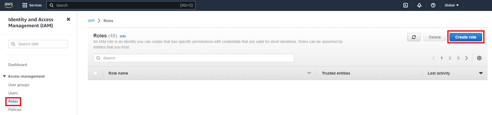

On the `Create role` screen, under `Trusted entity type`, keep `AWS service` selected. For `Use case`, search *Step Functions* in the drop-down and select `Step Functions`, then choose `Next`:

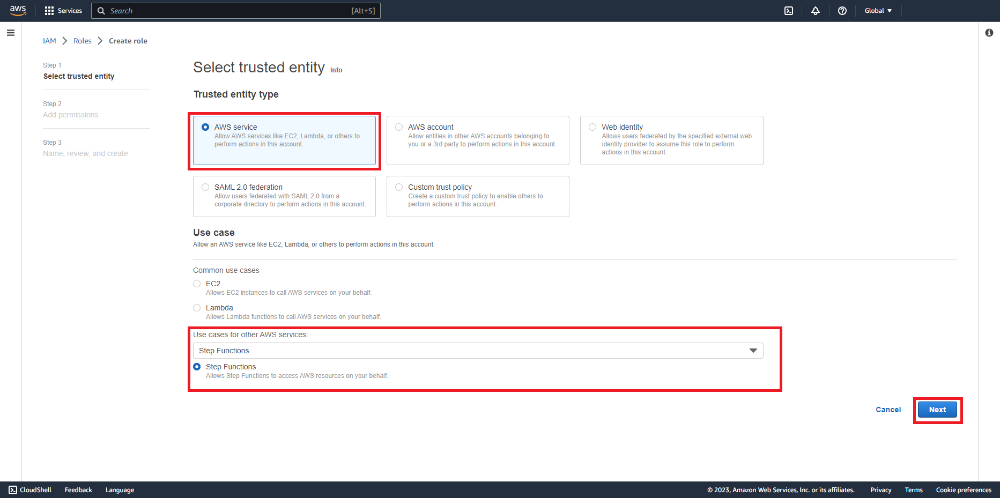

For the `Add permissions` section, choose `Next`:

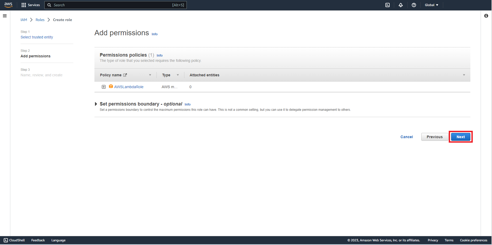

In the `Name, review, and create` section, for `Role name`, enter *step_functions_basic_execution* and select `Create role`:

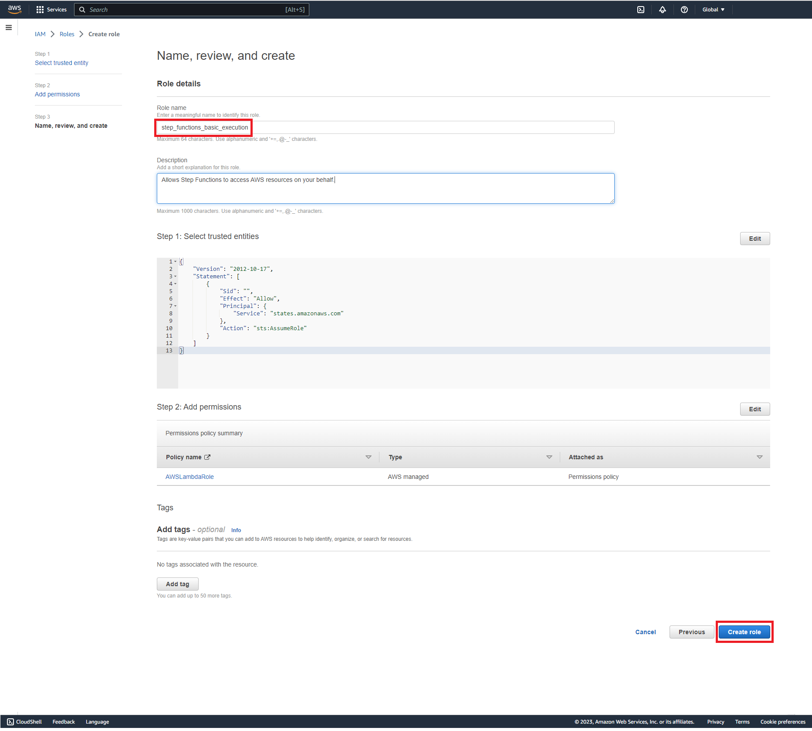

Once your IAM role is successfully created, you can proceed to the next step. 


## Creating a state machine and serverless workflow

The first step is to design a workflow that describes how you want support tickets to be handled in your call center. Workflows describe a process as a series of discrete tasks that can be repeated.

In this example, imagine you sit down with the call center manager to talk through best practices for handling support cases. Using the visual workflows in Step Functions as an intuitive reference, you define the workflow together.

After, you design your workflow in AWS Step Functions. Your workflow calls one AWS Lambda function to create a support case, invokes another function to assign the case to a support representative for resolution, and so on. It also passes data between Lambda functions to track the status of the support case as it's being worked on.

Begin by opening the [AWS Step Functions console](https://console.aws.amazon.com/states/home#/statemachines/create). Select `Write your workflow in code`:

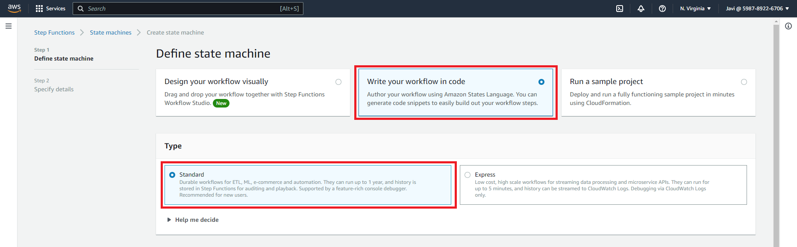

Replace the contents of the state machine definition window with the [Amazon States Language (ASL)](https://states-language.net/spec.html) state machine definition in the following example. Amazon States Language is a JSON-based, structured language used to define your state machine.

This state machine uses a series of `Task` states to open, assign, and work on a support case. A `Choice` state is also used to determine if the case can be closed or not. Two more `Task` states then close or escalate the support case as appropriate:

```json
{
  "Comment": "A simple AWS Step Functions state machine that automates a call center support session.",
  "StartAt": "Open Case",
  "States": {
    "Open Case": {
        "Type": "Task",
        "Resource": "arn:aws:lambda:REGION:ACCOUNT_ID:function:FUNCTION_NAME",
        "Next": "Assign Case"
   },
   "Assign Case": {
        "Type": "Task",
        "Resource": "arn:aws:lambda:REGION:ACCOUNT_ID:function:FUNCTION_NAME",
        "Next": "Work on Case"
   },
   "Work on Case":{
        "Type": "Task",
        "Resource": "arn:aws:lambda:REGION:ACCOUNT_ID:function:FUNCTION_NAME",
        "Next": "Is Case Resolved"
   },
   "Is Case Resolved": {
        "Type" : "Choice",
        "Choices": [
            {
             "Variable": "$.Status",
             "NumericEquals": 1,
             "Next": "Close Case"
            },
            {
             "Variable": "$.Status",
             "NumericEquals": 0,
             "Next": "Escalate Case"
            }
        ]
   },
   "Close Case": {
        "Type": "Task",
        "Resource": "arn:aws:lambda:REGION:ACCOUNT_ID:function:FUNCTION_NAME",
        "End": true
  },
   "Escalate Case": {
        "Type": "Task",
        "Resource": "arn:aws:lambda:REGION:ACCOUNT_ID:function:FUNCTION_NAME",
        "Next": "Fail"
  },
    "Fail": {
        "Type": "Fail",
        "Cause": "Engage Tier 2 Support." }
  }
}
```

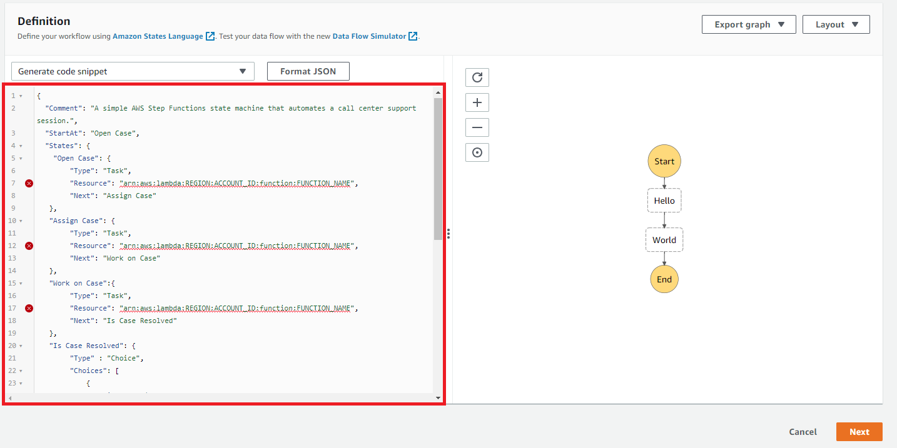

After you’ve replaced the contents, press the refresh button to show the ASL state machine definition as a visual workflow. In our example, you can verify that the process is described correctly by reviewing the visual workflow with the call center manager. Choose `Next` to review this:

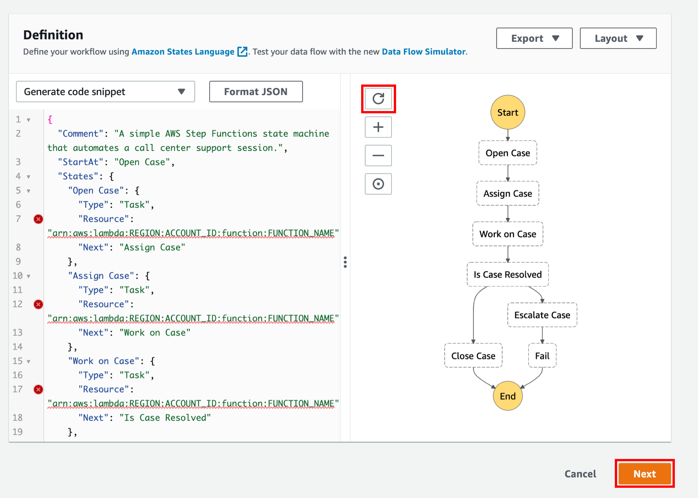

In the `State machine name` text box, enter *CallCenterStateMachine*:

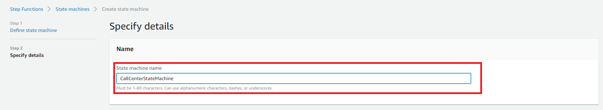

 For `Permissions`, select `Choose an existing role` and choose*step_functions_basic_execution* from the drop-down:

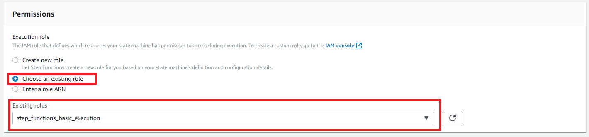

At the end of the page, choose `Create state machine`:

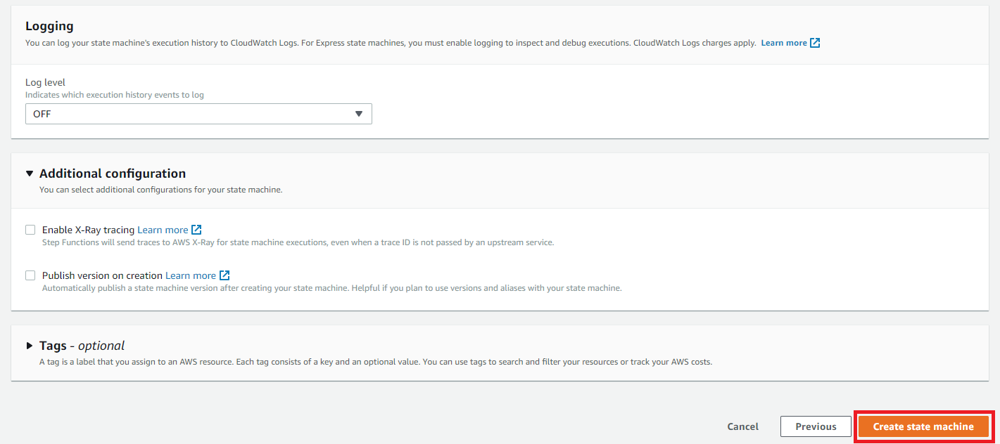

Now that you’ve created your state machine and serverless workflow, next you will create Lambda functions. 


## Creating your Lambda functions

With your state machine ready to go, now you can decide how you want it to perform work. You can connect your state machine to Lambda functions and other microservices that already exist in your environment, or create new ones. In this step, you will create a few simple Lambda functions that simulate various steps for handling support calls, such as assigning the case to a customer support representative.

Begin by opening the [AWS Lambda console](https://us-east-1.console.aws.amazon.com/lambda/home?region=us-east-1#/functions) then choosing *Create function*:

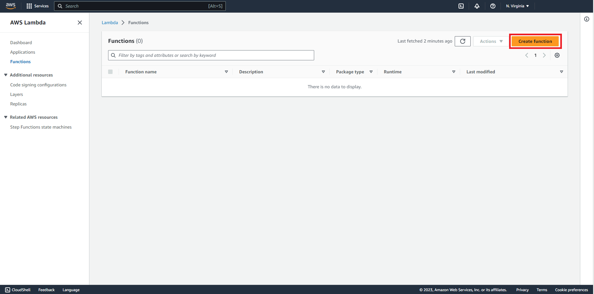

Next, select `Author from scratch` and then configure your first Lambda function with the following settings:

- `Name`: OpenCaseFunction.
- `Runtime`: Node.js 16.x.
- `Execution role`: Create a new role called *lambda_basic_execution*

After you’ve done this,hoose `Create function`:

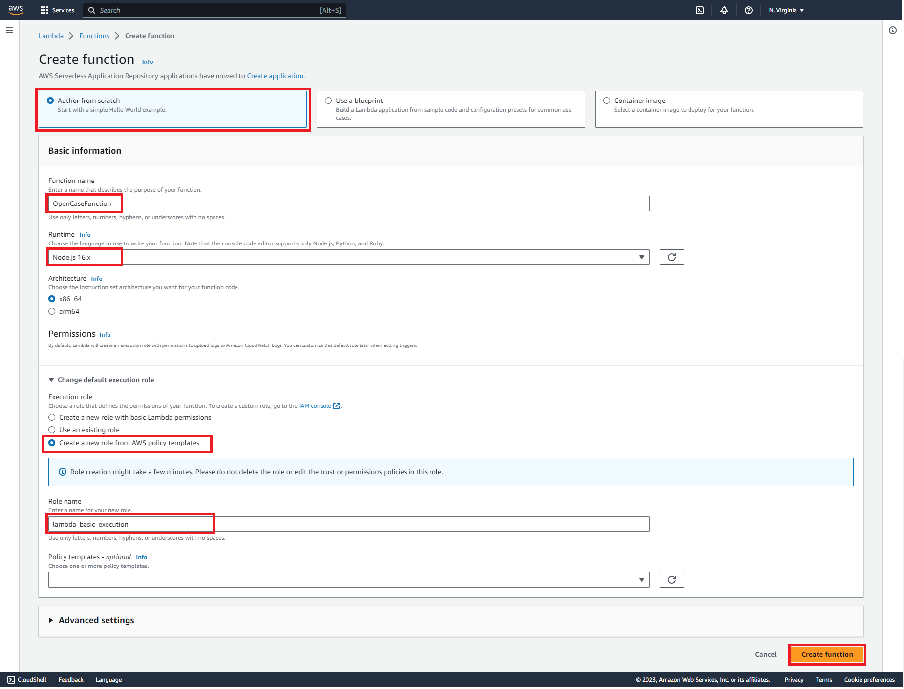

Replace the contents of the `Function code` window with the following code, and then choose `Deploy`:

```javascript
exports.handler = (event, context, callback) => {
    // Create a support case using the input as the case ID, then return a confirmation message
   var myCaseID = event.inputCaseID;
   var myMessage = "Case " + myCaseID + ": opened...";
   var result = {Case: myCaseID, Message: myMessage};
   callback(null, result);
};
```

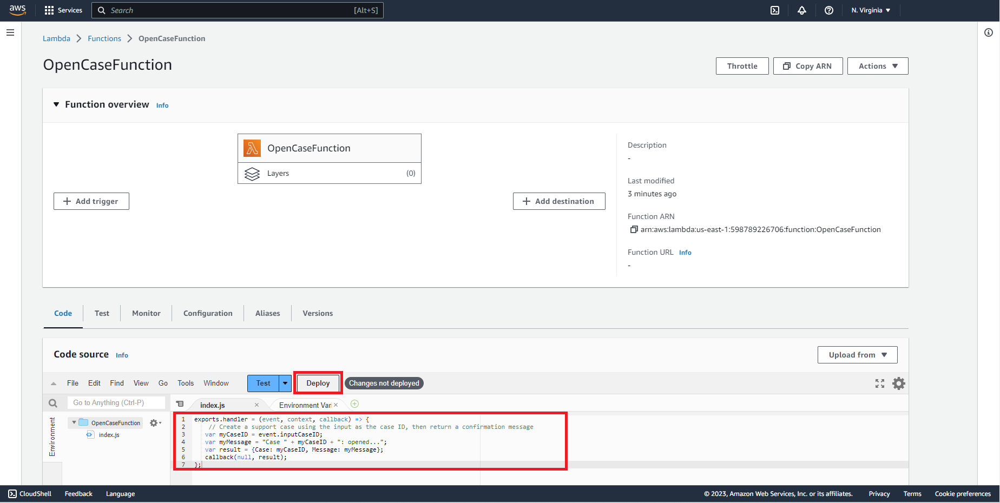

Then, at the beginning of the page, select `Functions`:

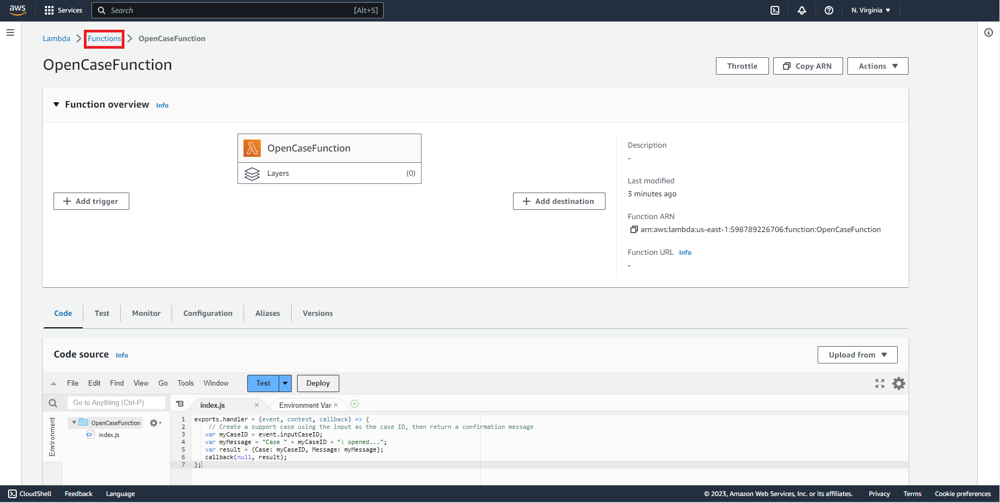

Repeat steps 2–4 to create four more Lambda functions, using the `lambda_basic_execution` IAM role you created in Step 3.

First, define `AssignCaseFunction` as the following:

```javascript
exports.handler = (event, context, callback) => {
    // Assign the support case and update the status message
    var myCaseID = event.Case;
    var myMessage = event.Message + "assigned...";
    var result = {Case: myCaseID, Message: myMessage};
    callback(null, result);
};
```

Then define `WorkOnCaseFunction` as the following:

```javascript
exports.handler = (event, context, callback) => {
    // Generate a random number to determine whether the support case has been resolved, then return that value along with the updated message.
    var min = 0;
    var max = 1;
    var myCaseStatus = Math.floor(Math.random() * (max - min + 1)) + min;
    var myCaseID = event.Case;
    var myMessage = event.Message;
    if (myCaseStatus == 1) {
        // Support case has been resolved
        myMessage = myMessage + "resolved...";
    } else if (myCaseStatus == 0) {
        // Support case is still open
        myMessage = myMessage + "unresolved...";
    }
    var result = {Case: myCaseID, Status : myCaseStatus, Message: myMessage};
    callback(null, result);
};
```

Next, define `CloseCaseFunction` as the following:

```javascript
exports.handler = (event, context, callback) => {
    // Close the support case
    var myCaseStatus = event.Status;
    var myCaseID = event.Case;
    var myMessage = event.Message + "closed.";
    var result = {Case: myCaseID, Status : myCaseStatus, Message: myMessage};
    callback(null, result);
};
```

Finally, define `EscalateCaseFunction` as the following:

```javascript
exports.handler = (event, context, callback) => {
    // Escalate the support case
    var myCaseID = event.Case;
    var myCaseStatus = event.Status;
    var myMessage = event.Message + "escalating.";
    var result = {Case: myCaseID, Status : myCaseStatus, Message: myMessage};
    callback(null, result);
};
```

Once this is complete, you should have five Lambda functions:

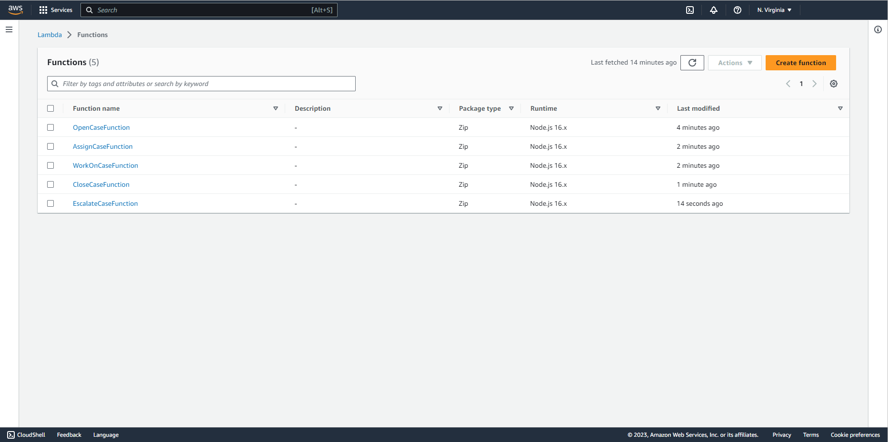

Now that you’ve successfully created your Lambda functions, next you can populate your workflow. 


## Populating and executing your workflow

The next step is to populate the task states in your Step Functions workflow with the Lambda functions you just created.

First, open the [AWS Step Functions console](https://console.aws.amazon.com/states/home#/statemachines/create). In the `State machines` section, select `CallCenterStateMachine` and choose `Edit`:

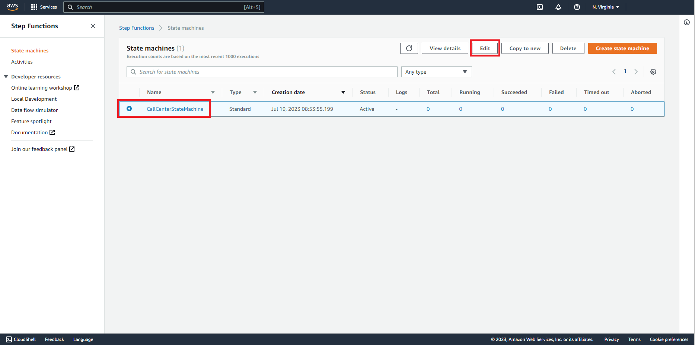

In the state machine `Definition` section, find the line following the `Open Case` state which starts with *Resource*.

Then, replace the ARN with the ARN of your `OpenCaseFunction`:

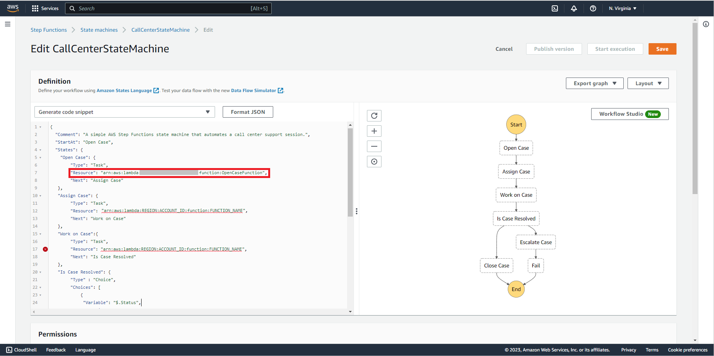

Repeat the previous step to update the Lambda function ARNs for the `Assign Case, Work on Case, Close Case` and `Escalate Case` task states in your state machine, then choose `Save`:

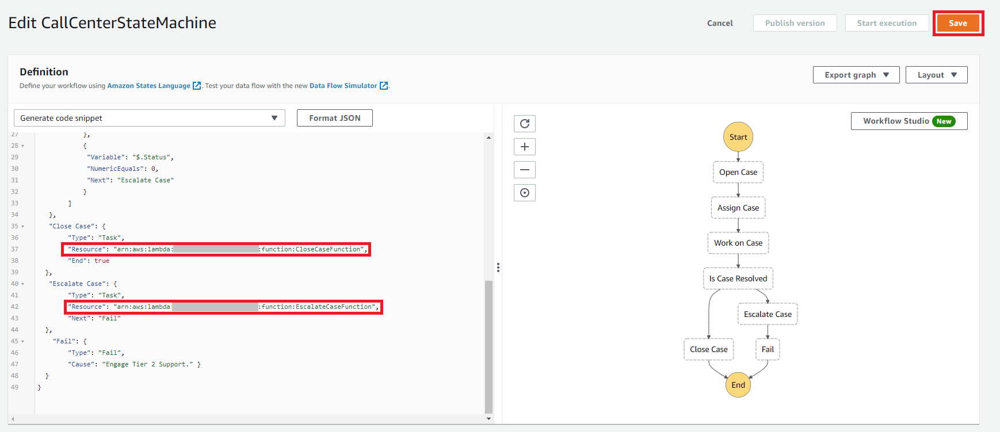

Your serverless workflow is now ready to be executed. A state machine execution is an instance of your workflow, and occurs each time a Step Functions state machine runs and performs its tasks. Each Step Functions state machine can have multiple simultaneous executions, which you can initiate from the Step Functions console or by using AWS SDKs, Step Functions API actions, or the AWS CLI. An execution receives JSON input and produces JSON output.

Begin by selecting `Start execution`:

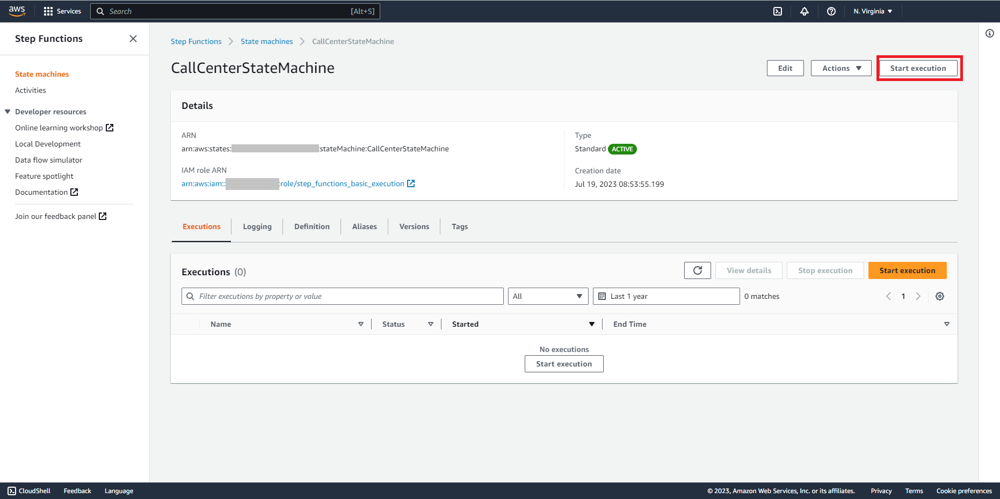

A `New execution` dialog box appears. To supply an ID for your support case, enter the following content in the `New execution` dialog box in the `Input` window, then choose `Start execution`:

```json
{
  "inputCaseID": "001"
}
```

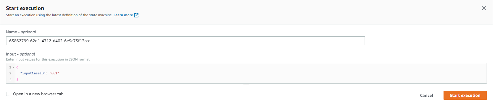

As your workflow executes, each step will change color in the `Visual workflow` pane. Wait a few seconds for execution to complete. Then in the `Execution` details pane, choose `Execution input and output` to view the inputs and results of your workflow:

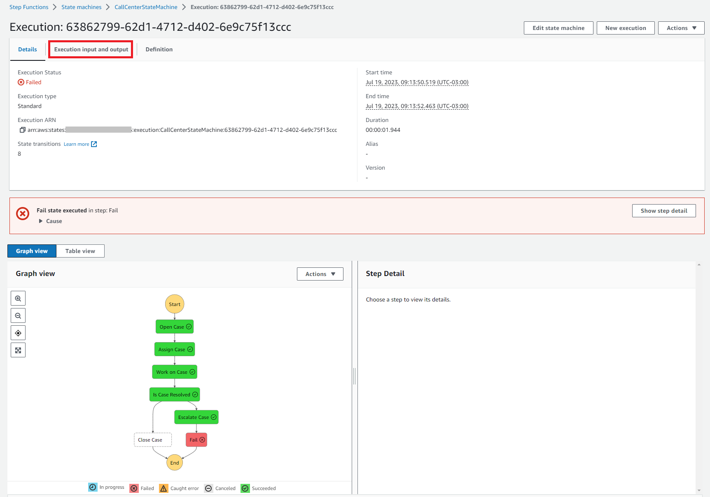

Scroll toward the end of the `Events` section. Press through each step of the execution to see how Step Functions called your Lambda functions and passed data between functions:

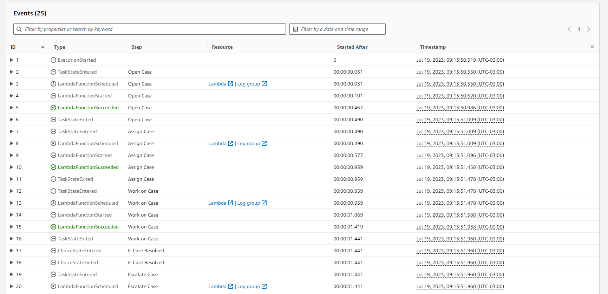

Depending on the output of your `WorkOnCaseFunction`, your workflow may have ended by resolving the support case and closing the ticket, or escalating the ticket to the next tier of support. You can re-run the execution a few more times to observe this different behavior. The following image shows an execution of the workflow where the support case was escalated, causing the workflow to exit with a `Fail` state.

In a real-world scenario, you might decide to continue working on the case until it’s resolved instead of failing out of your workflow. To do that, you could remove the `Fail` state and edit the `Escalate Case` task in your state machine to loop back to the `Work On Case` state. No changes to your Lambda functions would be required: 

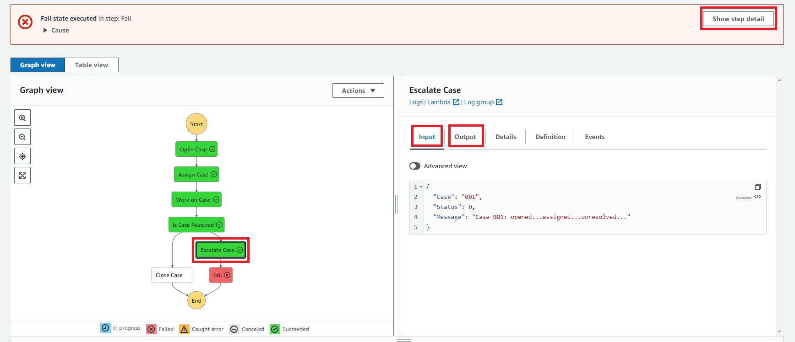

Remember, the functions we built for this tutorial are example samples only, so now let’s clean up your resources in the next step.


## Cleaning up resources

In this step, you will terminate your AWS Step Functions and AWS Lambda resources.

**Important:** To avoid incurring unexpected charges, it's best practice to terminate active resources that you no longer need.

Start at the beginning of your AWS Step Functions console window and choose `State machines`:

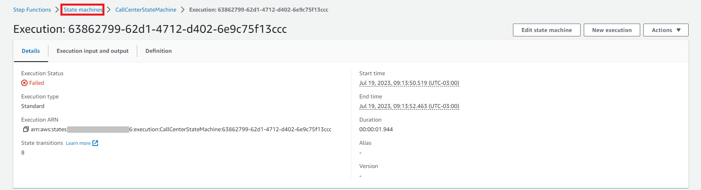

In the `State machines` window, select `CallCenterStateMachine` and choose `Delete`. To confirm you want to delete the state machine, choose `Delete state machine` in the dialog box that appears. Your state machine will be deleted in a minute or two, after Step Functions has confirmed that any in-process executions have completed:

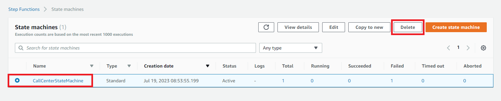

In the [AWS Lambda console](https://us-east-1.console.aws.amazon.com/lambda/home?region=us-east-1#/functions), on the `Functions` screen, select each of the functions you created for this tutorial and then select `Actions` and then `Delete`. Confirm the deletion by selecting `Delete` again:

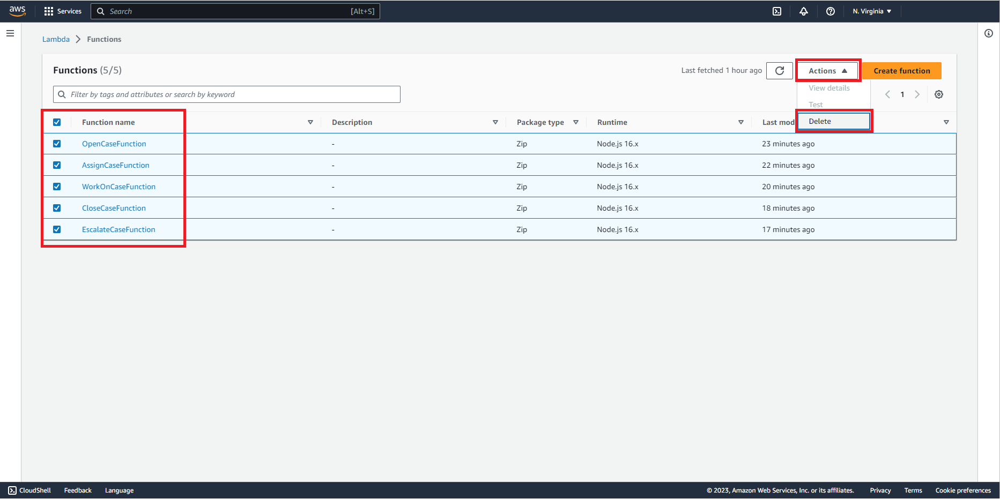

Lastly, you will delete your IAM roles. In the [IAM console](https://us-east-1.console.aws.amazon.com/iamv2/home?region=us-east-1#/roles) `Roles` section, enter `step` into the search, select *step_functions_basic_execution*, and choose `Delete`:

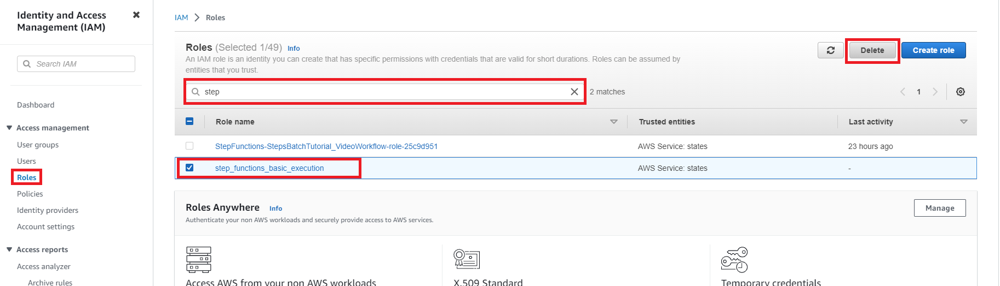

You can now sign out of the AWS Management console:


You’ve now successfully terminated all of your resources. 


## Conclusion

Now that you have learned to design and run a serverless workflow, next you can try creating an AWS Step Functions state machine with a `Catch` field. The `Catch` field uses an AWS Lambda function to respond with conditional logic based on error message type. This is a technique called function error handling.
