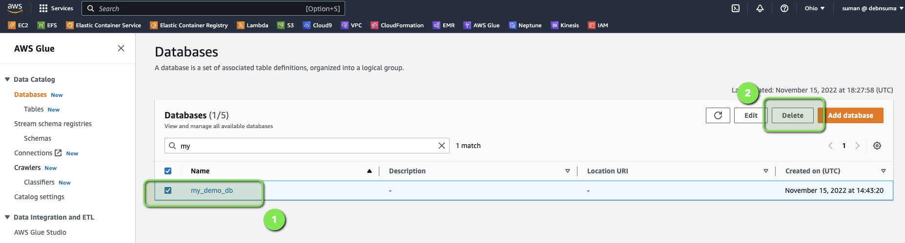

In this tutorial, you will learn how you can build an ETL (Extract, Transform, and Load) pipeline for batch processing using [Amazon EMR (Amazon Elastic MapReduce)](https://docs.aws.amazon.com/emr/latest/ManagementGuide/emr-what-is-emr.html) and [Spark](https://spark.apache.org/). During this process we will also learn about a few of the use cases of batch ETL processes and how EMR can be leveraged to solve such problems.

Batch ETL is a common use case across many organizations. This tutorial will provide you with a starting point, which can help you to build more complex data pipelines in AWS using Amazon EMR.

We are going to use [PySpark](https://spark.apache.org/docs/latest/api/python/) to interact with the Spark cluster. PySpark allows you to write Spark applications using Python APIs. 

| Attributes          |                                   |
| ------------------- | -------------------------------------- |
| ✅ AWS Level        | Beginner                               |
| ⏱ Time to complete  | 30 mins - 45 mins                      |
| 💰 Cost to complete | USD 0.30                               |
| 🧩 Prerequisites       | - An [AWS Account](https://portal.aws.amazon.com/billing/signup#/start/email) (if you don't yet have one, please create one and [set up your environment](https://aws.amazon.com/getting-started/guides/setup-environment/)) <br> - An IAM user that has has the access to create AWS resources. <br> - Basic understanding of Python

## Table of Content
| ToC |
|-----|

## What you will accomplish

In this guide, you will:
- Create and set up an Amazon EMR cluster 
- Submit a PySpark job on Amazon EMR 
- Integrate Amazon EMR with Amazon S3 

Let's get started!

## Use case and problem statement

For this tutorial, let's assume you have a vendor who provides incremental sales data at the end of every month. The file arrives in S3 as a `CSV` file, it needs to be processed, and made available to your data analysts for querying and analysis. 

## Architecture 

To implement this data pipeline, we will use an EMR cluster with Spark as the distributed processing engine. And we are going to use S3 for storing the:
<<<<<<< HEAD
=======
    - `RAW` data (which is the input and unprocessed data) and 
    - `CLEANSED` data (which is output and processed data)
>>>>>>> 04cc1dbf22f15614bc941653fd7e88705850ce29

-  `RAW` data (which is the input and unprocessed data) and 
-  `CLEANSED` data (which is output and processed data)

We need to build a data pipeline such that it will take this new sales file from the S3 bucket, processes it with required transformations using Amazon EMR, and saves the cleaned and transformed data into the target S3 bucket, which will be used later on for querying using Amazon Athena. 


## Implementation 

To implement our data processing pipeline, we need to first create an Amazon EMR cluster that will run our ETL jobs, an SSH key pair to allow connecting to the server, an S3 bucket to store the raw and processed data, and finally start our job on the cluster.

### Step 1: Create an Amazon EMR Cluster

Before we create our cluster we need to create a `Key Pair`, which we would need to access the cluster's master node later on. So, lets create that first. 

1. Login to your AWS account and navigate to the EC2 console, and click on [**Key Pairs**](https://docs.aws.amazon.com/AWSEC2/latest/UserGuide/create-key-pairs.html) option on the left menu bar. And then, click on `Create Key Pair` 


2. Provide a name (`mykey-emr`) for your key pair and click on `Create Key Pair`. 


3. Now, we can go ahead and create an `Amazon EMR cluster`. For that, navigate to `Amazon EMR` in the console and click on **Create Cluster** to create the cluster


4. Provide `Cluster name` as `MyDemoEMRCluster` to your EMR cluster, and select the following:
    - Select the **latest release** of EMR under **Software configuration** section
    - Select **Spark** under **Application bundle** section, 
    - Select the right **EC2 key pair** (which you created in the previous step) under the **Security and access** section
 
   Keep everything else as default and click on Create cluster, it will create a cluster with 3 instances. 


5. Cluster creation will take some time, and after couple of minutes, you will see that the cluster is **up and running** with a state as `Waiting` (which means the cluster is now ready and waiting to execute any ETL job)


### Step 2: Create an S3 bucket

Now we will create an S3 bucket and create two sub-folders within that, which will be used for store `RAW` and `CLEANSED` data

1. Navigate to the S3 console and click on **Create Bucket** 


2. Create a **bucket** (e.g. `etl-batch-emr-demo`) 


3. Once the bucket is created, create two sub-folders namely 
    - `cleaned_data` 
    - `raw_data`


<<<<<<< HEAD
4. Upload the [sales dataset CSV file](https://github.com/aws-samples/data-engineering-on-aws/blob/main/dataset/SalesData.csv) in the bucket under the folder `raw_data`
=======
4. Upload the [sales dataset CSV file](https://myblog-imgs.s3.amazonaws.com/datasets/SalesData.csv) in the bucket under the folder `raw_data`.
>>>>>>> 04cc1dbf22f15614bc941653fd7e88705850ce29


### Step 3: Submit the PySpark job 

Now, that we have the dataset uploaded in S3, its time to submit the PySpark job from our cluster. 

<<<<<<< HEAD
1. Sign in to the AWS Management Console, and open the [Amazon EMR console](https://console.aws.amazon.com/emr/)
=======
1. Navigate to the Amazon EMR console, select the `myDemoEMRCluster` which you created in earlier, and click on **Connect to the Master Node Using SSH** 
>>>>>>> 04cc1dbf22f15614bc941653fd7e88705850ce29

2. Under **EMR on EC2** in the left navigation pane, choose **Clusters**, and then select the `myDemoEMRCluster` cluster where you want to retrieve the public DNS name.

<<<<<<< HEAD
3. Note the **Primary node public DNS** value in the Summary section of the cluster details page.


4. SSH to the EMR cluster's Master node from your terminal 

```bash
ssh -i "mykey-emr.pem" root@ec2-18-219-203-79.us-east-2.compute.amazonaws.com
```

5. Copy the PySpark code [`etl-job.py`](/emr-etl-job.py) and save on the `Master Node` under the home directory and make the following changes and save the file:
=======
2. SSH to the cluster's master node from your terminal 

3. Create a new file called `etl-job.py`, and save it on the `Master Node` under the home directory with the following content (*NB: Change the bucket name and location to match the values you used in the variables used [`S3_INPUT_DATA`, and `S3_OUTPUT_DATA`]):
>>>>>>> 04cc1dbf22f15614bc941653fd7e88705850ce29

```python
from pyspark.sql import SparkSession
from pyspark.sql import functions as F

S3_INPUT_DATA = '<YOUR_BUCKET_LOCATION_OF_RAW_DATA>'
S3_OUTPUT_DATA = '<YOUR_BUCKET_LOCATION_OF_CLEANED_DATA>'


def main():

    spark = SparkSession.builder.appName("My Demo ETL App").getOrCreate()
    spark.sparkContext.setLogLevel('ERROR')

    # Spark Dataframe (Raw)- Transformation 
    df = spark.read.option("Header", True).option("InferSchema", True).csv(S3_INPUT_DATA)

    replacements = {c:c.replace(' ','_') for c in df.columns if ' ' in c}
    final_df = df.select([F.col(c).alias(replacements.get(c, c)) for c in df.columns])

    print(f"Total no. of records in the source data set is : {final_df.count()}")

try:
    final_df.write.mode('overwrite').parquet(S3_OUTPUT_DATA)
    print('The cleaned data is uploaded')
except:
    print('Something went wrong, please check the logs :P')

if __name__ == '__main__':
    main()
```

6. Submit the `PySpark job` and wait for the job to complete before proceeding.

```bash
sudo spark-submit etl-job.py 
``` 

7. Once the job completes, check the S3 bucket under the folder `cleaned_data`, you will see the new transformed and processed data in parquet format 


### Step 4: Validating the output using Amazon Athena

Now, the `cleansed` data is available in S3 in the form of parquet format, but to make it more consumable for data analysts or data scientists, it would be great if we could enable querying the data through SQL by making it available as a database table.

To make that integration, we can follow a two-step approach:
1. We need to run the AWS Glue crawler to create a AWS Glue Data Catalog table on top of the S3 data.
2. Once that is done, we can run a query in Athena to validate the output

### Step 5: Creating an AWS Glue Data Catalog

1. Navigate to the AWS Glue crawler console and click on **Create Crawler** 


2. Give a **name** for the Glue Crawler (`my-crawler-1`)


3. Add the **data source** as S3 bucket where you have your cleansed and processed data (`s3://etl-batch-emr-demo/cleaned_data`)


4. Create an **IAM role** (`AWSGlueServiceRole-default`) and attached the same. You can create a role and attach the following policies (for more details you can refer to [this](https://docs.aws.amazon.com/glue/latest/dg/crawler-prereqs.html) and follow the steps:

- The `AWSGlueServiceRole` AWS managed policy, which grants the required permissions on the Data Catalog

- An inline policy that grants permissions on the data source (`S3_INPUT_DATA` location)


5. Create a **database** by clicking on **Add database** and select the same from dropdown menu (`my_demo_db`) 


6. Review and verify all the details and click on **Create crawler** 


7. Once the crawler is created, select the crawler and click on **Run** 


8. Once the crawler finishes its run, you will see `detected tables`


Now that we have the AWS Glue Data Catalog table created, we can navigate to Athena to query the data using SQL.

Till now, we have extracted the data from S3, and then transformed the data by converting the data into parquet format
using a AWS Glue ETL (pySpark) job, and then used the cleaned data for analysis using Athena. 

### Step 6: Querying output data using Athena standard SQL 

1. Open Athena query editor, you can keep Data Source as the default `AwsDataCatalog` and select `my_demo_db` for Database (as show in the screen shot) and run the following query. 

```sql
SELECT * FROM "my_demo_db"."cleaned_data" limit 10;
```


2. Now, you can perform other SQL queries to analyze the data. For example, if we would like to know the `forcast_monthly_revenue` for each `region per segment wise`, you can run this:

```sql 
SELECT 
    region, 
    segment, 
    SUM(forecasted_monthly_revenue) as forcast_monthly_revenue 
FROM "my_demo_db"."cleaned_data" 
GROUP BY segment, region;
```


## Clean up resources 

Now that you’ve finished this walk-through, you can delete all the following resources to avoid incurring unexpected costs:

- Delete the **EMR Cluster** 


- Delete the **S3 bucket**

```bash
aws s3 rb s3://<YOUR_BUCKET_LOCATION> --force
```

- Delete the **Glue Database**

 

## Conclusion

Congratulations! You have finished the tutorial on creating an ETL pipeline with Amazon EMR and Apache Spark. In this tutorial, we learnt how we can extract the data from S3, transform the data based on our requirements by using a AWS Glue ETL (`pySpark`) job, and finally, to analyze the data using SQL via Athena.
