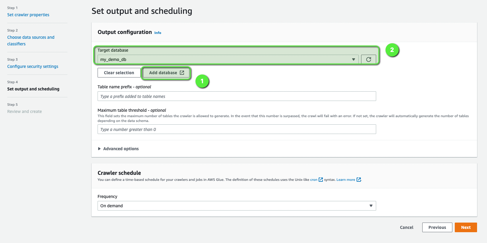

Extract, Transform, and Load (or ETL) - sometimes called Ingest, Transform, and Export - is vital for building a robust data engineering pipeline for any organization. Essentially, if the ETL pipeline is designed and built using the right tools and services, it brings high value to any organization both for batch and real-time processing. But designing and building such a pipeline is a time-consuming task, and it requires different skillsets considering the number of tools and frameworks in this big data space. Luckily, it's pretty easy if you're using EMR and Spark.

Batch ETL is a common use case across many organizations. This tutorial will provide a starting point, which can help you to build more complex data pipelines in AWS using [Amazon EMR (Amazon Elastic MapReduce)](https://docs.aws.amazon.com/emr/latest/ManagementGuide/emr-what-is-emr.html?sc_channel=el&sc_campaign=devopswave&sc_content=cicdetlsprkaws&sc_geo=mult&sc_country=mult&sc_outcome=acq) and [Apache Spark](https://spark.apache.org/). Here's how to do it.

We are going to use [PySpark](https://spark.apache.org/docs/latest/api/python/) to interact with the Spark cluster. PySpark allows you to write Spark applications using Python APIs.

## Table of Content

| Attributes          |                                   |
| ------------------- | -------------------------------------- |
| ✅ AWS Level        | 200 - Intermediate                               |
| ⏱ Time to complete  | 30 mins - 45 mins                      |
| 💰 Cost to complete | USD 0.30                               |
| 🧩 Prerequisites       | - An [AWS Account](https://aws.amazon.com/resources/create-account/?sc_channel=el&sc_campaign=devopswave&sc_content=cicdetlsprkaws&sc_geo=mult&sc_country=mult&sc_outcome=acq) (if you don't yet have one, create one and [set up your environment](https://aws.amazon.com/getting-started/guides/setup-environment/)) <br> - An IAM user that has the access to create AWS resources. <br> - Basic understanding of Python |
| 📢 Feedback            | <a href="https://pulse.buildon.aws/survey/DEM0H5VW" target="_blank">Any feedback, issues, or just a</a> 👍 / 👎 ?    |
| ⏰ Last Updated     | 2023-03-30                            |

|ToC|
|--|

## What you will accomplish

In this guide, you will:

- Create and set up an Amazon EMR cluster
- Submit a PySpark job on EMR
- Integrate Amazon EMR with Amazon S3

Let's get started!

## Use case and problem statement

For this tutorial, let's assume you have a vendor who provides incremental sales data at the end of every month. The file arrives in S3 as a `CSV` file and it needs to be processed and made available to your data analysts for querying and analysis.

## Architecture

To implement this data pipeline, we will use an EMR cluster with Spark as the distributed processing engine. We'll use S3 for storing the:

- `RAW` data (which is the input and unprocessed data)
- `CLEANSED` data (which is output and processed data)

We need to build a data pipeline such that it will take this new sales file from the S3 bucket, process it with required transformations using Amazon EMR, and save the cleaned and transformed data into the target S3 bucket, which will be used later on for querying using Amazon Athena.


## Implementation

To implement our data processing pipeline, we need to create an EMR cluster that will run our ETL jobs and an S3 bucket to store the raw and processed data. Then we can start our job on the cluster.

### Step 1: Create an EMR Cluster

Before we create an EMR cluster we need to create a `Key Pair`, which we would need to access the EMR cluster's master node later on. So let's do that really quickly.

1. Log in to your AWS account and navigate to the EC2 console and click on the [**Key Pairs**](https://docs.aws.amazon.com/AWSEC2/latest/UserGuide/create-key-pairs.html?sc_channel=el&sc_campaign=devopswave&sc_content=cicdetlsprkaws&sc_geo=mult&sc_country=mult&sc_outcome=acq) option on the left menu bar. And then, click `Create Key Pair`.


2. Provide a name (`mykey-emr`) for your key pair and click `Create Key Pair`.


3. Now we can go ahead and create an `Amazon EMR cluster`. For that, navigate to Amazon EMR in the console and click **Create Cluster** to create an EMR cluster.


4. Provide `Cluster name` as `MyDemoEMRCluster` to your EMR cluster, and select the following:
    - Select the **latest release** of EMR under **Software configuration** section
    - Select **Spark** under **Application bundle** section,
    - Select the right **EC2 key pair** (which you created in the previous step) under the **Security and access** section
 
Keep everything else as default and click on Create cluster. This will create a cluster with three instances.


5. Cluster creation will take some time, and after couple of minutes, you will see that the cluster is **up and running** with a state as `Waiting` (which means the cluster is now ready and waiting to execute any ETL job).


### Step 2: Create an Amazon S3 bucket

Now we will create an Amazon S3 bucket and create two sub-folders within that, which will be used to store `RAW` and `CLEANSED` data.

1. Navigate to the Amazon S3 console and click on **Create Bucket**.


2. Create a **bucket** (e.g. `etl-batch-emr-demo`).


3. Once the bucket is created, create two sub-folders named:

  - `cleaned_data`
  - `raw_data`


4. Upload the [sales dataset CSV file](https://github.com/aws-samples/data-engineering-on-aws/blob/main/dataset/SalesData.csv) in the bucket under the folder `raw_data`.


### Step 3: Submit the PySpark job

Now, that we have the dataset uploaded in S3, it's time to submit the PySpark job from our EMR cluster.

1. Sign in to the AWS Management Console, and open the [Amazon EMR console](https://console.aws.amazon.com/emr/).

2. Under **EMR on EC2** in the left navigation pane, choose **Clusters**, and then select the `myDemoEMRCluster` cluster where you want to retrieve the public DNS name.

3. Note the **Primary node public DNS** value in the Summary section of the cluster details page.


4. SSH to the EMR cluster's Primary node from your terminal

```bash
ssh -i "mykey-emr.pem" root@ec2-18-219-203-79.us-east-2.compute.amazonaws.com
```

5. Copy the PySpark code [`etl-job.py`](https://github.com/aws-samples/data-engineering-on-aws/blob/main/create-an-etl-pipeline-apache-spark/emr-etl-job.py) and save on the `Primary Node` under the home directory and make the following changes and save the file:

    - `S3_INPUT_DATA`  = 's3://<YOUR_BUCKET_LOCATION_OF_RAW_DATA>'
    - `S3_OUTPUT_DATA` = 's3://<YOUR_BUCKET_LOCATION_OF_CLEANED_DATA>'

6. Submit the `PySpark job` and wait for the job to complete before proceeding.

```bash
sudo spark-submit etl-job.py 
```

7. Once the job completes, check the S3 bucket under the folder `cleaned_data`, you will see the new transformed and processed data in parquet format.


### Step 4: Validating the output using Amazon Athena

Now the `cleansed` data is available in Amazon S3 in the form of parquet format, but to make it more consumable for data analysts or data scientists, it would be great if we could enable querying the data through SQL by making it available as a database table.

To make that integration, we can follow a two-step approach:

1. We need to run the Glue crawler to create an AWS Glue Data Catalog table on top of the S3 data.
2. Once that is done, we can run a query in Amazon Athena to validate the output.

### Step 5: Creating an AWS Glue Data Catalog

1. Navigate to the AWS Glue crawler console and click on **Create Crawler**.


2. Give a **name** for the Glue Crawler (`my-crawler-1`).


3. Add the **data source** as S3 bucket where you have your cleansed and processed data (`s3://etl-batch-emr-demo/cleaned_data`).


4. Create an **IAM role** (`AWSGlueServiceRole-default`) and attached the same. You can create a role and attach the following policies for more details you can refer to [this](https://docs.aws.amazon.com/glue/latest/dg/crawler-prereqs.html?sc_channel=el&sc_campaign=devopswave&sc_content=cicdetlsprkaws&sc_geo=mult&sc_country=mult&sc_outcome=acq) and follow the steps:

- The AWSGlueServiceRole AWS managed policy, which grants the required permissions on the Data Catalog

- An inline policy that grants permissions on the data source (`S3_INPUT_DATA` location)


5. Create a **database** by clicking on **Add database** and select the same from dropdown menu (`my_demo_db`).



6. Review and verify all the details and click on **Create crawler**.


7. Once the crawler is created, select the crawler and click on **Run**.


8. Once the crawler finishes its run, you will see `detected tables`.


Now that we have the Glue Data Catalog table created, we can navigate to Amazon Athena to query the data using SQL.

Until now, we have extracted the data from Amazon S3, and then transformed the data by converting the data into parquet format
using a Glue ETL (pySpark) job. Finally we will use that cleaned data for analysis using Amazon Athena.

### Step 6: Querying output data using Amazon Athena standard SQL

1. Open Athena query editor. You can keep Data Source as the default `AwsDataCatalog` and select `my_demo_db` for Database (as show in the screen shot) and run the following query.

```sql
SELECT * FROM "my_demo_db"."cleaned_data" limit 10;
```


2. Now you can perform other SQL queries to analyze the data. For example, if we would like to know the `forecast_monthly_revenue` for each `region per segment wise`, you can run this:

```sql
SELECT 
    region, 
    segment, 
    SUM(forecasted_monthly_revenue) as forecast_monthly_revenue 
FROM "my_demo_db"."cleaned_data" 
GROUP BY segment, region;
```


## Clean up resources

Now that you’ve finished this walk-through, you can delete all the following resources to avoid incurring unexpected costs:

- Delete the **EMR Cluster**


- Delete the **Amazon S3 bucket**

```bash
aws s3 rb s3://<YOUR_BUCKET_LOCATION> --force
```

- Delete the **Glue Database**


## Conclusion

Congratulations! You have finished the tutorial on creating an ETL pipeline with Amazon EMR and Apache Spark.

In this tutorial, we learned how to build an ETL pipeline, which can be applied in different batch processing use-cases, like e-commerce sales data analysis. We learned how to extract the data from S3 and then transform the data based on our requirement by using a simple Glue ETL (pySpark) job. And then finally, we analyzed the data using SQL via Amazon Athena. If you're interested in learning more about ERM and Spark-based ETL, you may like to check out this [workshop](https://catalog.us-east-1.prod.workshops.aws/workshops/c86bd131-f6bf-4e8f-b798-58fd450d3c44/en-US/spark-etl).

If you enjoyed this tutorial, found any issues, or have feedback for us, [please send it our way!](https://pulse.buildon.aws/survey/DEM0H5VW).
