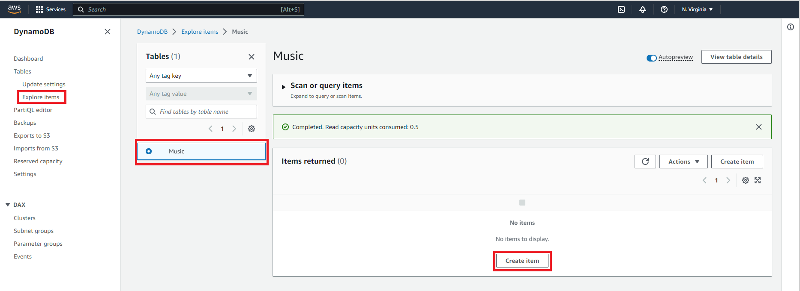
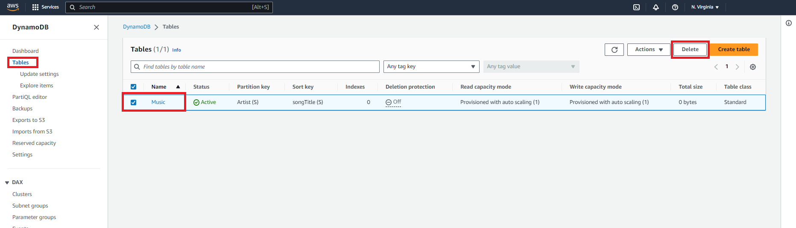

In this tutorial, you will learn how to create a simple table, add data, scan and query the data, delete data, and delete the table using the DynamoDB console. DynamoDB is a fully managed NoSQL database that supports both document and key-value store models. DynamoDB’s flexible data model, reliable performance, and automatic scaling of throughput capacity make it a great fit for mobile, web, gaming, ad tech, IoT, and many other applications.

All the steps in this tutorial are free-tier eligible, and you will learn how to do the following: 

* Create a NoSQL database with Amazon DynamoDB
* Create a simple table, add data, and performg scan and query operations on the data by using the DynamoDB console
* Delete data and the table using the DynamoDB console

## Table of Contents

| Attributes                |                                   |
| ------------------- | -------------------------------------- |
| ✅ AWS Level        | 100 - Beginner                          |
| ⏱ Time to complete  | 10 minutes                             |
| 💰 Cost to complete | [Free Tier](https://aws.amazon.com/free/) eligible |
| 🧩 Prerequisites    | [AWS Account](https://aws.amazon.com/resources/create-account/?sc_channel=el&sc_campaign=devopswave&sc_content=cicdcdkpthnec2aws&sc_geo=mult&sc_country=mult&sc_outcome=acq) *(Accounts created within the past 24 hours might not yet have access to the services required for this tutorial.)*                        |
| 📢 Feedback            | <a href="https://pulse.buildon.aws/survey/DEM0H5VW" target="_blank">Any feedback, issues, or just a</a> 👍 / 👎 ?    |
| ⏰ Last Updated     | YYYY-MM-DD                             |

| ToC |
|-----|

## Getting started

First, open the [AWS Management Console](https://console.aws.amazon.com/console/home) so that you can keep this tutorial open for reference. When the screen loads, write *DynamoDB* in the search bar and open the DynamoDB console:

Now that you’ve opened your DynamoDB console, next you’ll create your table. 

## Creating a NoSQL table

You will use the DynamoDB console to create a table. In the DynamoDB console, choose `Create table`:

For this example, we will use a music library as our use-case. In the `Table name` box, type in *Music*:

The partition key is used to spread data across partitions for scalability. It’s important to choose an attribute with a wide range of values that evenly distributes access patterns. Type *Artist* in the `Partition key box`:

Since each artist may write many songs, you can enable easy sorting with a sort key. Enter *songTitle* in the `Sort key` box:

Next, you will enable DynamoDB auto-scaling for your table.

DynamoDB auto-scaling will change the read and write capacity of your table based on request volume. Using an AWS Identity and Access Management (AWS IAM) role called *DynamoDBAutoscaleRole*, DynamoDB will manage the scaling process on your behalf. DynamoDB creates this role for you the first time you enable auto-scaling in an account.

To enable DynamoDB auto-scaling for your table, select `Customize settings`:

Now scroll toward the end of the screen past `Secondary indexes, Estimated read/write capacity cost, Encryption at rest` and `Tags`, to the `Create table` button. We won't change these settings in this tutorial.

Choose `Create table`. When the `Music` table is ready to use, it appears in the table list with a check box.

Congratulations! You have successfully created a NoSQL table using the DynamoDB console:

Now that you’ve created your table, next you’ll populate your table with data. 

## Adding data to the NoSQL table

You will now add data to your new DynamoDB table. Begin by selecting `Explore items` from the left menu, then select the radio button next to the `Music` table. Then, choose `Create item`:

In the data entry window, insert the following:

- For the `Artist` attribute, write *No One You Know*.
- For the `songTitle` attribute, write *Call Me Today*.

Then choose `Create item`:

Repeat the process to add a few more items to your Music table like in the following:

- `Artist`: *No One You Know*; `songTitle`: *My Dog Spot*
- `Artist`: *No One You Know*; `songTitle`: *Somewhere Down The Road*
- `Artist`: *The Acme Band*; `songTitle`: *Still in Love*
- `Artist`: *The Acme Band*; `songTitle`: *Look Out, World*

Now that your table has data, next you will run some queries on your table.  

## Querying the NoSQL table

You will now search for data in the table using query operations. In DynamoDB, query operations are efficient and use keys to find data. Scan operations traverse the entire table.

Start by selecting the arrow next to "`Scan or Query items`". Then select "`Query`":

You can use the console to query the *Music* table in various ways. For your first query, do the following:

- In the `Artist` box, write *No One You Know*, and choose `Run`. All songs performed by *No One You Know* are displayed.
- In the `Artist` box, write The *Acme Band*, and choose `Run`. All songs performed by The *Acme Band* are displayed:

Try one more query, but this time narrow down the search results:

- In the `Artist` box, write The *Acme Band*.
- In the `songTitle` box, select `Begins with` from the drop-down list and insert *S*.
- Choose `Run`. Your output will only list "Still in Love" performed by The *Acme Band*:

Now that you’ve performed some queries, next you will practice deleting items. 

## Deleting an existing item

To delete an item from your DynamoDB table, first change the Query drop-down list back to `Scan`.

Select the checkbox next to *The Acme Band*. In the `Actions` drop-down list, choose `Delete items`. You will be asked whether to delete the item. Choose `Delete` and your item will be deleted:

Now that you know how to delete items, next you will learn how to delete a table. 

## Delete a NoSQL table

You can easily delete a table using the DynamoDB console. It is a best practice to delete tables you are no longer using so that you don’t incur additional charges.

In the DynamoDB console, select the checkbox next to the `Music` table and then choose `Delete`. In the confirmation dialog box, enter the text *delete* and choose `Delete table`:

You have now successfully deleted your NoSQL table. 

## Conclusion

Congratulations! You have created your first DynamoDB table, added items to your table, and then queried the table to find the items you were looking for. You also learned how to visually manage your DynamoDB tables and items through the AWS Management Console.
