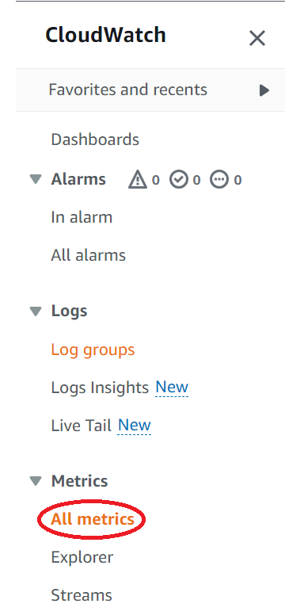

Anytime we are asynchronously replicating data, we need to be concerned with the lag in that replication time. The longer the replication lag, the greater the potential amount of data that could be lost, resulting in a higher potential recovery point objective (RPO). This tutorial explains how to configure [Amazon CloudWatch](https://docs.aws.amazon.com/AmazonCloudWatch/latest/monitoring/WhatIsCloudWatch.html?sc_channel=el&sc_campaign=resiliencewave&sc_geo=mult&sc_country=mult&sc_outcome=acq&sc_content=ddb-globaltables-lag) to monitor that replication lag for [Amazon DynamoDB GlobalTables](https://docs.aws.amazon.com/amazondynamodb/latest/developerguide/GlobalTables.html?sc_channel=el&sc_campaign=resiliencewave&sc_geo=mult&sc_country=mult&sc_outcome=acq&sc_content=ddb-globaltables-lag).

DynamoDB GlobalTables provide a fully managed, multi-Region, and multi-active database option that delivers fast and localized read and write performance for massively scaled global applications. This is a powerful capability that, when properly leveraged in our architectures, provides us with a very low recovery point objective (RPO) and recovery time objective (RTO) in the case of a [disaster](https://docs.aws.amazon.com/whitepapers/latest/disaster-recovery-workloads-on-aws/what-is-a-disaster.html?sc_channel=el&sc_campaign=resiliencewave&sc_geo=mult&sc_country=mult&sc_outcome=acq&sc_content=ddb-globaltables-lag). 

During a disaster scenario where we failover to our GlobalTable in another region, we need to take steps to minimize the amount of data loss that could occur. The primary factor that contributes to how much data could be lost in this scenario is the amount of lag time that occurs between when the data is written to the original table and when it is replicated to another GlobalTable. Changes to a DynamoDB GlobalTable are replicated asynchronously, with [typical latency](https://docs.aws.amazon.com/amazondynamodb/latest/developerguide/V2globaltables_HowItWorks.html?sc_channel=el&sc_campaign=resiliencewave&sc_geo=mult&sc_country=mult&sc_outcome=acq&sc_content=ddb-globaltables-lag) of between 0.5 - 2.5 seconds between AWS Regions in the same geographic area. 

In this blog, we'll walk through the steps of monitoring that replication lag by configuring proper [observability](https://aws.amazon.com/cloudops/monitoring-and-observability?sc_channel=el&sc_campaign=resiliencewave&sc_geo=mult&sc_country=mult&sc_outcome=acq&sc_content=ddb-globaltables-lag) of the state of the data replication for GlobalTables.
## Prerequisites
This tutorial assumes that you have already [created a DynamoDB GlobalTable](https://docs.aws.amazon.com/amazondynamodb/latest/developerguide/V2globaltables.tutorial.html?sc_channel=el&sc_campaign=resiliencewave&sc_geo=mult&sc_country=mult&sc_outcome=acq&sc_content=ddb-globaltables-lag). There are no other prerequisites.
## The Procedure
### Step 1
Navigate to Amazon CloudWatch in the console, expand the left hand menu and select *All Metrics* as shown below.

**Important** Ensure you are in the same AWS Region as your source GlobalTable! 
### Step 2
Click on the Query tab and in the *Namespace* field enter "AWS/DynamoDB". In the *MetricName* field enter "AVG(ReplicationLatency)". The results should match the image below.

Click on the *Run* button on the bottom left of your query builder and the results will populate above. Your current query is looking at the average replication latency for **all** of your DynamoDB GlobalTables in this region, for this account. You probably want to have more fine grained visibility into each table. You can do that using the *Filter by* field. Type "TableName =" in the *Filter By* field as shown below.

In this case, you can see that the console is helpfully suggesting the name of an existing DynamoDB GlobalTable that I have setup. Choose one of the suggestions or simply type in your table name and hit enter, then click *Run* again. Now the graph above will show the average replication latency just for the table you have selected.

### Step 3
Right now, we just have a query that we can manually examine in the console. That's great, and it shows that we have the right configured, but it isn't going to solve your observability needs. Let's add our query to a CloudWatch dashboard as a widget. In the upper right hand of the screen, click on the *Action* button and the click on *Add to dashboard* as shown in the picture below.

You will be presented with a screen asking you to configure your new widget. You can select any of your existing dashboards, or create a new one. In my case, I created a new one that was helpfully autonamed for me. Be sure to use an intuitive name for your widget. In my case, I'm calling it Order ReplicationLag so I know which table it is monitoring. You can change the default widget type, but a line graph works well for this metric. Once you are satisfied with your widget, click *Add to dashboard*. You will be taken to the dashboard where you just added the widget

### Step 4
So far we have created a widget that monitors the average latency of either all of our DynamoDB GlobalTables, or individual tables, and we have added that widget to a dashboard. That's a great start! However, as it stands we still won't know if there is an issue unless someone is actively looking at the dashboard. That doesn't really scale, so let's add an alarm.

In the menu on the left side of the console screen expand the alarms section under CloudWatch and click on *All Alarms*. Next, click on the *Create Alarm* button on the top right of the screen. Then, click *Select Metric*. We need to define the metric we want to use for our alarm. Use the same information you used in [Step 2](#step-2) to create the query.  Note that you will need to click on *Run* to validate the metric before you can proceed by clicking on the *Select Metric* button.

Next, in the Conditions portion of the dialogue, we will define what will trigger our alarm. We're going to take the best practice from [Monitoring Amazon DynamoDB for operational awareness](https://aws.amazon.com/blogs/database/monitoring-amazon-dynamodb-for-operational-awareness?sc_channel=el&sc_campaign=resiliencewave&sc_geo=mult&sc_country=mult&sc_outcome=acq&sc_content=ddb-globaltables-lag) and trigger an alarm whenever average latency exceeds 180000 seconds (3 minutes). Clink *Next* when done. 

The next screen will provide you with various options on how to notify users when the alarm is triggered. Specific details on how to configure all of the various notification options can be found [here](https://docs.aws.amazon.com/AmazonCloudWatch/latest/monitoring/AlarmThatSendsEmail.html?sc_channel=el&sc_campaign=resiliencewave&sc_geo=mult&sc_country=mult&sc_outcome=acq&sc_content=ddb-globaltables-lag).

## Summary
That's it! You've created a dashboard widget and an alarm for your DynamoDB GlobalTable! Monitoring the replication latency will help to ensure that you are getting the lowest RPO possible in the event that you have to failover to your secondary region.