 In today's digital age, building and deploying applications to the cloud has become essential for businesses to stay competitive. Serverless computing has gained immense popularity among developers as it offers a cost-effective and scalable solution to deploy applications without managing the underlying infrastructure. 

The [AWS Serverless Application Model (SAM)](https://aws.amazon.com/serverless/sam/?sc_channel=el&sc_campaign=devopswave&sc_content=samapplncomposer&sc_geo=mult&sc_country=mult&sc_outcome=acq) is an open-source framework for building serverless applications. It provides developers with a simplified way of defining serverless applications using YAML or JSON templates. With AWS SAM, we can easily define our application's infrastructure, including Lambda functions, APIs, and Amazon DynamoDB tables, in a single template file. This helps reduce development time and simplifies deployment and management of serverless applications. With just few lines of code in YAML we can define our application. During deployment, SAM will transform it and expand the syntax into AWS CloudFormation magic. 

Well, SAM is awesome! It abstracts lot of code with simple few lines of code. However, no engineer wakes up with enthusiasm of maintaining YAML code for their serverless application. Moreover visualizing its architecture is not easy.

What if there was a way to build serverless application by simply dragging and dropping serverless resources on a canvas and build the app? 

[AWS Application Composer](https://aws.amazon.com/application-composer/?sc_channel=el&sc_campaign=devopswave&sc_content=samapplncomposer&sc_geo=mult&sc_country=mult&sc_outcome=acq) is a visual development tool that simplifies the creation of applications and their underlying infrastructure. It offers a drag-and-drop interface that allows developers to quickly and easily create new applications or modify existing ones. Application Composer supports a wide range of AWS services, including AWS Lambda, Amazon API Gateway, Amazon DynamoDB, and more.

In this blog post, we will explore the benefits of using AWS SAM and Application Composer for new and existing applications. We will also provide examples of how to use these tools to streamline our application development process and make it easier to manage our applications in the cloud. So, let's dive in!

In this blog, we will learn: 
- how we can get started with a blank canvas and build our SAM application 
- load existing SAM application, visualize and extend it

## Table of Contents

| Attributes             |                                                                 |
|------------------------|-----------------------------------------------------------------|
| ✅ AWS experience      | 100 - Beginner                                              |
| ⏱ Time to complete     | 30 minutes                                                      |
| 💰 Cost to complete    | Free tier eligible                                               |
| 🧩 Prerequisites       | - [AWS Account and the CLI installed](https://aws.amazon.com/getting-started/guides/setup-environment/?sc_channel=el&sc_campaign=devopswave&sc_content=samapplncomposer&sc_geo=mult&sc_country=mult&sc_outcome=acq)<br>- [Any Supported Local IDE from list](https://aws.amazon.com/developer/tools/)<br>- [AWS SAM CLI](https://docs.aws.amazon.com/serverless-application-model/latest/developerguide/install-sam-cli.html?sc_channel=el&sc_campaign=devopswave&sc_content=samapplncomposer&sc_geo=mult&sc_country=mult&sc_outcome=acq) <br>- [Node and NPM installed](https://docs.npmjs.com/cli/v9/configuring-npm/install)|
| 💻 Code Sample         | Code sample used in tutorial on [Serverless Land](https://serverlessland.com/repos/?sc_channel=el&sc_campaign=devopswave&sc_content=samapplncomposer&sc_geo=mult&sc_country=mult&sc_outcome=acq)                            |
| 📢 Feedback            | <a href="https://pulse.buildon.aws/survey/DEM0H5VW" target="_blank">Any feedback, issues, or just a</a> 👍 / 👎 ?    |
| ⏰ Last Updated        | 2023-04-06                                                     |

| ToC |
|-----|


## Design a new Serverless Application

Let's start with creating a folder in our local computer. Name this folder `buildon-sam-app`. We will place all the contents from this blog into this folder.

In the AWS Management Console, goto the **Application Composer** service.

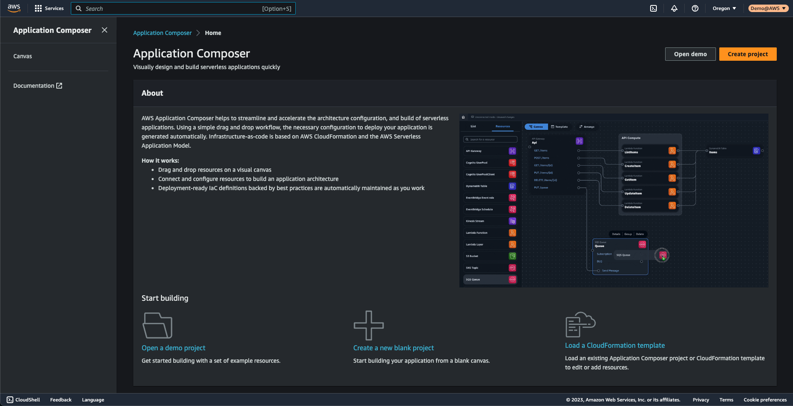

Click on `Create project` button in the Application Composer Dashboard to create a new project. As displayed in below image, for `Type of Project`, select the radio button for `New blank project`. 

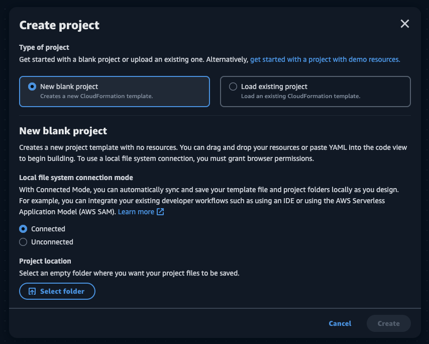

In the New blank project we have 2 modes:  Connected and Unconnected.
Application Composer is only in our browser, it does not store any of our files in AWS account. So, selection of mode determines how and where our design files will be stored.

- In the **Connected mode**, we can provide application composer access to a local folder on our computer. It will then automatically sync and save our template file and project folders locally as we design. 

- In the **Unconnected mode** we have to manually import and export our template files. We have to select `Menu` > `save changes` as often as needed to save and download the latest configuration of our template file. When designing in unconnected mode, only the application template file is generated and can be manually exported.

For the sake of this blog, we will be using **Connected mode**. 

The following files and folders are synced and saved to our local file system when designing in connected mode:
- **Application template file** – When we design in Application Composer, a singular application template file is generated.
- **Project folders** – When we design a Lambda function, a general Lambda directory structure is generated.
- **Backup template file** – A backup directory named `.aws-composer` will be created at the root of our project location and will contain a backup copy of our application template file and our project folders.


> Remember all this is happening in our browser! So we have to provide access to the browser to view and edit the local file in Connected mode. _When prompted to allow access, select View and Edit files._

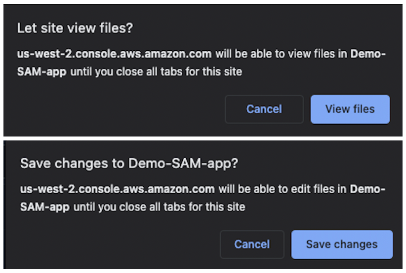
Now we have a blank project. Here, I have opened a local IDE like Visual Studio Code in the same folder, to show you how the local files created automatically by Application Composer.

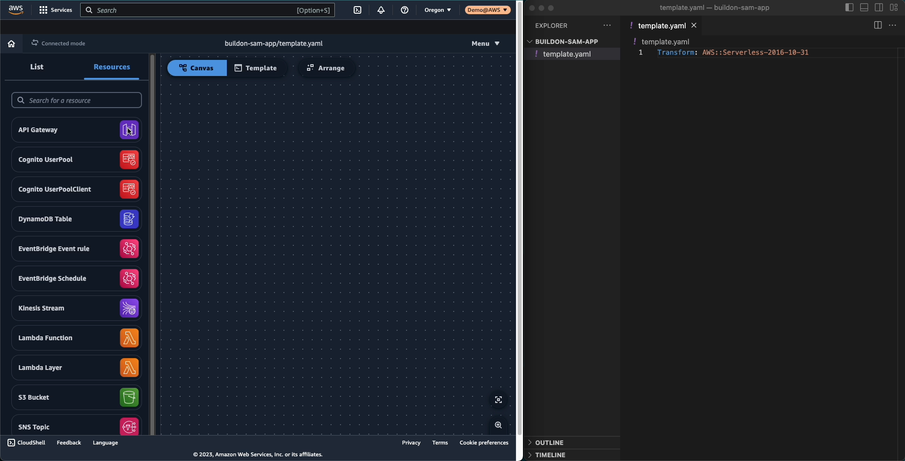

The Application composer console, has two sections : `"Canvas"` and `"Template"`. You can switch between the two anytime during the designing.

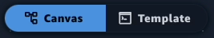

Let's create a simple application with 3 AWS Serverless services -> APIGateway, Lambda and DynamoDB. 

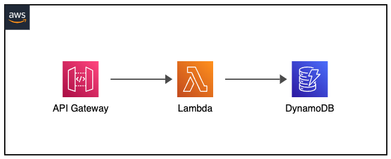


This is a simple Serverless pattern that demonstrates how making an HTTP POST request to an Amazon API Gateway endpoint invokes an AWS Lambda function and inserts an item into an Amazon DynamoDB table.

We will create a Nodejs application with 2 Lambda functions - one to insert data into the DynamoDB table and another to list data.

In the Application composer, we can find most of the serverless resources available in the `Resources` tab. The `List` tab is to quickly identify resources already on the canvas/template. To make this pattern, **drag and drop** components from the `Resources` tab onto the `Canvas`. 

When we drag the resources on the canvas, Application composer automatically writes required the YAML code in the `Template`. Also, as this is connected mode, these changes are also done to our local template file. Any changes we make on either canvas or template, they are automatically reflected on other side. 

We can see in the gif below, as we drag and drop resources (API Gateway, Lambda and, DynamoDB) on the Canvas, the template.yaml is automatically populated with its appropriate yaml definition.

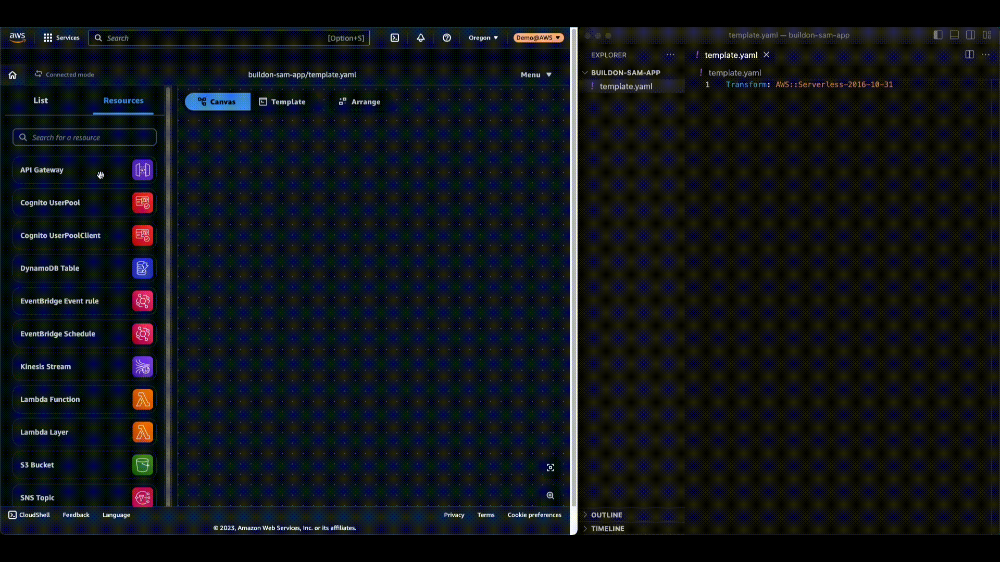

We can customize the template further in the `"Template"` tab. OR we can select the resource on `"Canvas"` and click `"Details"` to modify resources. 

For example, we dragged API Gateway resource, by clicking on `"Details"` we can see configurable `"Resource properties"` on the right. We can rename CloudFormation's logical ID of the resource, quickly add routes, authorizers, and CORS configuration.

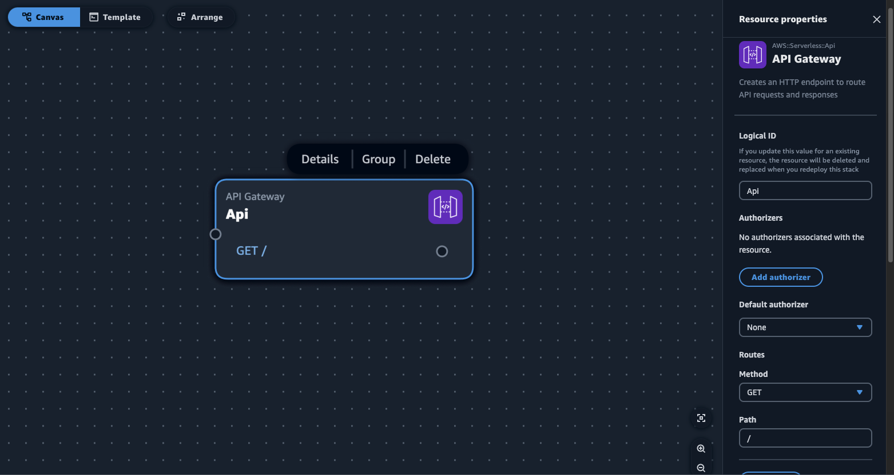

For our new SAM application, define following resources and their properties. Make sure you click on save every time resource properties are modified:  

* Resource:  **`API Gateway`**
  *  Properties:  
      * Name: `Api`
      * Routes: 
        * Method: `GET`; Path: `/`
        * Method: `POST`; Path: `/`
* Resource:  **`Lambda Function`**
  *  Properties:  
      * Name: `CustomerFunctionCreate`
      * Source path: `src/CreateCustomer`
      * Runtime: `nodejs18.x`
      * Handler: `index.handler`
* Resource: **`Lambda Function`**
  *  Properties:  
      * Name: `CustomerFunctionList`
      * Source path: `src/ListCustomer`
      * Runtime: `nodejs18.x`
      * Handler: `index.handler`
* Resource: **`DynamoDB Table`**
  *  Properties:  
      * LogicalId: `CustomerTable`
      * Partition key: `id`
      * Partition key type: `String`


### Groups

We have 2 Lambda functions to `Create` and `List` customers. We can group these functions into a `Functions group` for better visibility. Click on one of the functions, and select `Group`. 

This will create a group. Drag and drop the other Lambda function to be part of this group. If we double-click this group we can modify its name. We will rename the group `CustomerFunctionsGroup`. 

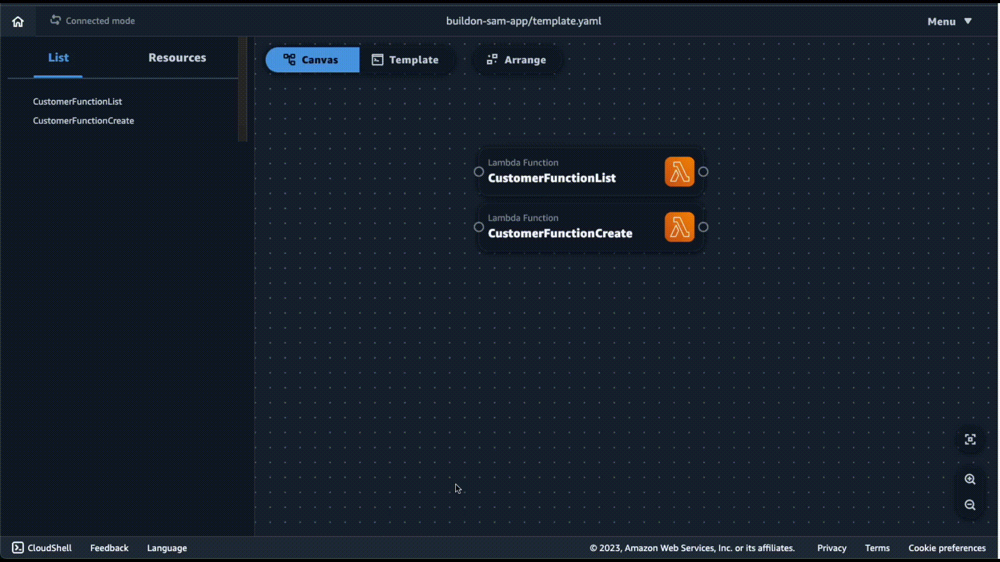

### Best practices 

AWS Application Composer is designed to configure Infrastructure as Code definitions that follow the AWS best practices. For example, when we add a Lambda function to the canvas, Application Composer will enable `"Tracing"` by default and add Amazon CloudWatch LogGroup for the function. Lambda logs all requests handled by our function and also automatically stores logs generated by our code through Amazon CloudWatch Logs.

### Connections  
Once we have all the 4 components, let's connect these. APIGateway -> Lambda -> DynamoDB.

When we make these connections, Application Composer will automatically update the template to reflect this, notice the changes in the image below:  


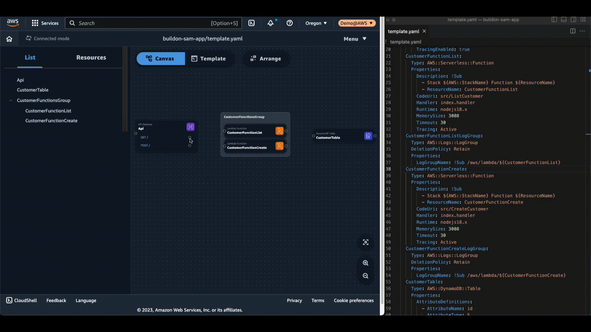

We have to connect the `GET /` route to `CustomerFunctionList` and the `POST /` to `CustomerFunctionCreate`. And connect both the Lambda functions to the DynamoDB table. 


We have 2 options to make these connections:  
 - We can manually connect them using the `"Canvas"` as shown in above image. Notice that we can only make connections where service integrations are possible. 

 
 </br>
OR
 - simply copy paste following template in the `"Template"` section to see the design pattern come alive.

 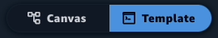

* template.yaml
```yaml
Transform: AWS::Serverless-2016-10-31
Resources:
  CustomerFunctionList:
    Type: AWS::Serverless::Function
    Properties:
      Description: !Sub
        - Stack ${AWS::StackName} Function ${ResourceName}
        - ResourceName: CustomerFunctionList
      CodeUri: src/ListCustomer
      Handler: index.handler
      Runtime: nodejs18.x
      MemorySize: 3008
      Timeout: 30
      Tracing: Active
      Events:
        Api23GET:
          Type: Api
          Properties:
            Path: /
            Method: GET
            RestApiId: !Ref Api23
      Environment:
        Variables:
          TABLE_NAME: !Ref CustomerTable
          TABLE_ARN: !GetAtt CustomerTable.Arn
      Policies:
        - DynamoDBCrudPolicy:
            TableName: !Ref CustomerTable
  CustomerFunctionListLogGroup:
    Type: AWS::Logs::LogGroup
    DeletionPolicy: Retain
    Properties:
      LogGroupName: !Sub /aws/lambda/${CustomerFunctionList}
  CustomerFunctionCreate:
    Type: AWS::Serverless::Function
    Properties:
      Description: !Sub
        - Stack ${AWS::StackName} Function ${ResourceName}
        - ResourceName: CustomerFunctionCreate
      CodeUri: src/CreateCustomer
      Handler: index.handler
      Runtime: nodejs18.x
      MemorySize: 3008
      Timeout: 30
      Tracing: Active
      Environment:
        Variables:
          TABLE_NAME: '!Ref CustomerTable'
          TABLE_ARN: '!GetAtt CustomerTable.Arn'
          TABLE_NAME_2: !Ref CustomerTable
          TABLE_ARN_2: !GetAtt CustomerTable.Arn
      Events:
        Api23POST:
          Type: Api
          Properties:
            Path: /
            Method: POST
            RestApiId: !Ref Api23
      Policies:
        - DynamoDBCrudPolicy:
            TableName: !Ref CustomerTable
  CustomerFunctionCreateLogGroup:
    Type: AWS::Logs::LogGroup
    DeletionPolicy: Retain
    Properties:
      LogGroupName: !Sub /aws/lambda/${CustomerFunctionCreate}
  CustomerTable:
    Type: AWS::DynamoDB::Table
    Properties:
      AttributeDefinitions:
        - AttributeName: id
          AttributeType: S
      BillingMode: PAY_PER_REQUEST
      KeySchema:
        - AttributeName: id
          KeyType: HASH
      StreamSpecification:
        StreamViewType: NEW_AND_OLD_IMAGES
  Api:
    Type: AWS::Serverless::Api
    Properties:
      Name: !Sub
        - ${ResourceName} From Stack ${AWS::StackName}
        - ResourceName: Api23
      StageName: Prod
      DefinitionBody:
        openapi: '3.0'
        info: {}
        paths:
          /:
            get:
              x-amazon-apigateway-integration:
                httpMethod: POST
                type: aws_proxy
                uri: !Sub arn:${AWS::Partition}:apigateway:${AWS::Region}:lambda:path/2015-03-31/functions/${CustomerFunctionList.Arn}/invocations
              responses: {}
            post:
              x-amazon-apigateway-integration:
                httpMethod: POST
                type: aws_proxy
                uri: !Sub arn:${AWS::Partition}:apigateway:${AWS::Region}:lambda:path/2015-03-31/functions/${CustomerFunctionCreate.Arn}/invocations
              responses: {}
      EndpointConfiguration: REGIONAL
      TracingEnabled: true
Metadata:
  AWS::Composer::Groups:
    Group:
      Label: CustomerFunctionsGroup
      Members:
        - CustomerFunctionList
        - CustomerFunctionCreate
Outputs:
  EndpointUrl:
    Description: HTTP REST endpoint URL
    Value: !Sub https://${Api23}.execute-api.${AWS::Region}.amazonaws.com/Prod
```


Before we proceed, add following `Output` section at the end of the `template.yaml` to get the API Endpoint once stack is created:
```yaml
Outputs:
  EndpointUrl:
    Description: HTTP REST endpoint URL
    Value: !Sub https://${Api}.execute-api.${AWS::Region}.amazonaws.com/Prod
```

Our design should look like this:  

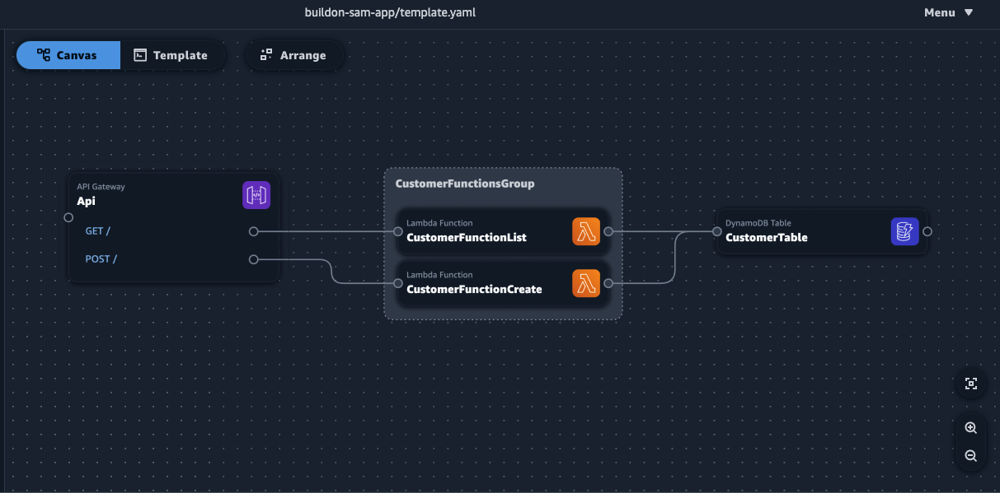

## Add Nodejs code

In the local folder, Application Composer would have created following folder structure and files:

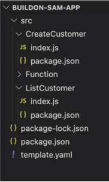

We now have to add Nodejs code, so whenever the APIs are invoked they will add/list customer information from the DynamoDB table.

Add following code in respective files :

* CreateCustomer/index.js
```javascript
const { DynamoDBClient } = require("@aws-sdk/client-dynamodb");
const { DynamoDBDocumentClient, PutCommand } = require("@aws-sdk/lib-dynamodb");

const client = new DynamoDBClient({});
const ddbClient = DynamoDBDocumentClient.from(client);

exports.handler = async event => {
  try {
    console.log(JSON.stringify(event, undefined, 2));
    const requestBody = JSON.parse(event.body);

    const customer = {
      id: Date.now().toString(), // Use a timestamp as the ID
      ...requestBody,
    };

    console.log(`Adding customer with ID '${customer.id}' to table '${process.env.TABLE_NAME}' with attributes: ${JSON.stringify(customer, null, 2)}`);

    const params = {
      TableName: process.env.TABLE_NAME,
      Item: customer,
    };

    // Add data to DynamoDB table
    await ddbClient.send(new PutCommand(params));
   
    console.log(`Successfully saved customer '${customer.id}'`);
   
    return {
      statusCode: 201,
      body: JSON.stringify(customer),
    };
  } catch (err) {
    console.error(err);

    return {
      statusCode: 500,
      body: 'Internal Server Error',
    };
  }
};


```
* CreateCustomer/package.json
```json
{
  "name": "function",
  "version": "1.0.0",
  "devDependencies": {
    "@aws-sdk/lib-dynamodb": "^3.214.0"
  }
}
```
* ListCustomer/index.js
```javascript
const { DynamoDBClient, ScanCommand } = require("@aws-sdk/client-dynamodb");

const client = new DynamoDBClient({});

exports.handler = async event => {
  try {
    // Log the event argument for debugging and for use in local development.
    console.log(JSON.stringify(event, undefined, 2));

    console.log(`Listing customers from table '${process.env.TABLE_NAME}'`);

    let ids = [];

    // Loop over all customers. If there are more customers after a request, 
    // the response LastEvaluatedKey will have a non-null value that we can
    // pass in the next request to continue fetching more customers.
    let 
    lastEvaluatedKey;
    do {
      const command = new ScanCommand({
        TableName: process.env.TABLE_NAME,
        ProjectionExpression: "id",
        ExclusiveStartKey: lastEvaluatedKey
      });

      const response = await client.send(command);

      const additionalIds = response.Items.map(customer => customer.id);

      ids = ids.concat(additionalIds);

      lastEvaluatedKey = response.LastEvaluatedKey;
    } while (lastEvaluatedKey);

    console.log(`Successfully scanned for list of IDs: ${JSON.stringify(ids, null, 2)}`);

    return {
      statusCode: 200,
      body: JSON.stringify({
        ids
      })
    };
  } catch (err) {
    console.error(`Failed to list customers: ${err.message} (${err.constructor.name})`);

    return {
      statusCode: 500,
      body: "Internal Service Error"
    };
  }
};

```
* ListCustomer/package.json
```json
{
  "name": "function",
  "version": "1.0.0",
  "devDependencies": {
    "@aws-sdk/lib-dynamodb": "^3.214.0"
  }
}
```


## Build and Deploy with AWS SAM
Now that we have our design and application files created for us, let's build deploy this using AWS Serverless Application Model (SAM). 

We will be skipping the `sam init` command, as we already have a sample application created for us. We will build, deploy and test the application in this section.

Open a terminal in your local IDE to execute following commands. Please make sure you have installed all the pre-requisites mentioned at the beginning.

As this is a Nodejs sample, let's make sure we have all the required modules installed for the application, run command:  
```bash
npm install aws-sdk
```

### Step 1: Build the application

In this step, we use the AWS SAM CLI to build our application and prepare for deployment. When we build, the AWS SAM CLI creates a `.aws-sam` directory and organizes our function dependencies, project code, and project files there.

```bash
sam build
```
**Output:**
```bash
➜  buildon-sam-app sam build
Building codeuri: ../buildon-sam-app/src/ListCustomer runtime: nodejs18.x metadata: {} architecture: x86_64 functions: CustomerFunctionList
Running NodejsNpmBuilder:NpmPack
Running NodejsNpmBuilder:CopyNpmrcAndLockfile
Running NodejsNpmBuilder:CopySource
Running NodejsNpmBuilder:NpmInstall
Running NodejsNpmBuilder:CleanUpNpmrc
Running NodejsNpmBuilder:LockfileCleanUp
Building codeuri: ../buildon-sam-app/src/CreateCustomer runtime: nodejs18.x metadata: {} architecture: x86_64 functions: CustomerFunctionCreate
Running NodejsNpmBuilder:NpmPack
Running NodejsNpmBuilder:CopyNpmrcAndLockfile
Running NodejsNpmBuilder:CopySource
Running NodejsNpmBuilder:NpmInstall
Running NodejsNpmBuilder:CleanUpNpmrc
Running NodejsNpmBuilder:LockfileCleanUp

Build Succeeded

Built Artifacts :  .aws-sam/build
Built Template  :  .aws-sam/build/template.yaml

Commands you can use next
=========================
[*] Validate SAM template: sam validate
[*] Invoke Function: sam local invoke
[*] Test Function in the Cloud: sam sync --stack-name {{stack-name}} --watch
[*] Deploy: sam deploy --guided
```

### Step 2: Deploy the application to the AWS Cloud
```bash
sam deploy --guided
```

This will ask multiple prompts to which answer them as the following output:
- Stack Name:  `buildon-sam-app`
- AWS Region:  `<REGION>`
- #Shows you resources changes to be deployed and require a 'Y' to initiate deploy. </br>
  Confirm changes before deploy:  `y`
- #SAM needs permission to be able to create roles to connect to the resources in your template. </br>
Allow SAM CLI IAM role creation:  `y`
- #Preserves the state of previously provisioned resources when an operation fails. </br>Disable rollback: `n`
- `CustomerFunctionList` may not have authorization defined, Is this okay?:  `y`
- `CustomerFunctionCreate` may not have authorization defined, Is this okay?:  `y`
- Save arguments to configuration file:  `y`
- SAM configuration file:  `samconfig.toml`
- SAM configuration environment:  `default`
- Deploy this changeset?: `y`

This will deploy the CloudFormation stack with all the resources defined in the SAM template.yaml generated by Application Composer, including all the source code for Lambda functions.


In the end, we should see prompt as following: 
**Output:**
```
...
CREATE_COMPLETE          AWS::CloudFormation::Stack   buildon-sam-app         -                                                    
------------------------------------------------------------------------
CloudFormation outputs from deployed stack
Outputs                    
------------------------------------------------------------------------
Key                 EndpointUrl                                                                 
Description         HTTP REST endpoint URL                                                      
Value               https://11yakge1yd.execute-api.<REGION>.amazonaws.com/Prod                 
------------------------------------------------------------------------

Successfully created/updated stack - buildon-sam-app in <REGION>
```

Note the HTTP REST API endpoint URL, we will be using this to call the API.

It will also create a local configuration file `samconfig.toml`, so that next time we run `sam deploy` it gets all the inputs from this file. The S3 bucket name is just an example here that SAM will use, we can set a different default S3 bucket here. <REGION> will be your AWS Region.

* samconfig.toml

```toml
version = 0.1
[default]
[default.deploy]
[default.deploy.parameters]
stack_name = "buildon-sam-app"
s3_bucket = "aws-sam-cli-managed-default-samclisourcebucket-<randomletters>"
s3_prefix = "buildon-sam-app"
region = "<REGION>"
confirm_changeset = true
capabilities = "CAPABILITY_IAM"
image_repositories = []
```

### Step 3: Test the application

Now that our application is up and running, let's call the API and add an item to our DynamoDB table. Running following code, replace the `<API_ENDPOINT>` with URL you noted in previous step. It will look something like `https://<API>.execute-api.<REGION>.amazonaws.com/Prod`.

#### Step 3.1: **Add** a customer to the table  
```bash
curl -X POST \                           
   https://<API_ENDPOINT> \      
  -H 'Content-Type: application/json' \
  -d '{
    "name": "John Doe",
    "email": "johndoe@example.com"
  }'
   
```
**Output:**
```bash
{"id":"1680294275167","name":"John Doe","email":"johndoe@example.com"}%    
```

#### Step 3.2: **List** the customer ids  
```bash
curl -X GET https://<API_ENDPOINT>
```
**Output:**
```bash
{"ids":[{"S":"1680294275167"}]}%    
```
</br>
</br>
🎉 That's it! 
</br>
You can add more APIs and Lambda functions to this serverless application. Every time you have to make application changes, run step 1, and step 2 to build and deploy the application!

## Visualize an existing application

Now, let's say we want to visualize an existing application in application composer. To do so clone the git repository using following commands:

```bash
git clone https://github.com/aws-samples/fresh-tracks.git
cd fresh-tracks/backend/FreshTracks/
vi template.yaml
```

Open Application Composer in the AWS Console, if you are in a design make sure it is saved and then click on the home 🏠 icon. 

This time in the `Create project` dialog box, select the radio option `Load existing project`. 

Use `Connected` mode again and in the `Project location` navigate to the folder `fresh-tracks/backend/FreshTracks/` that has this web applications backend `template.yaml`. Provide permissions for Application Composer in the browser to `View` the folders and files. 

Now that Application Composer can read the folder, it will list down all the `.yaml` files it can find in the folder. Here, let's select the `template.yaml` and select `Create` to visualize it. 

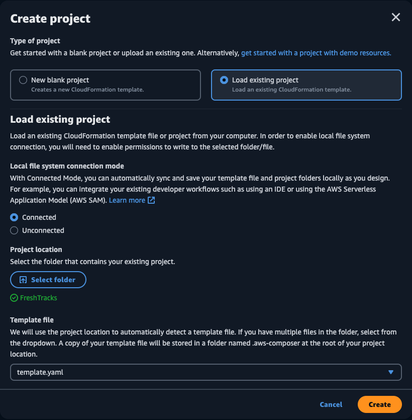

</br>
Provide the `Edit` access and we can see the visualization come to life: 


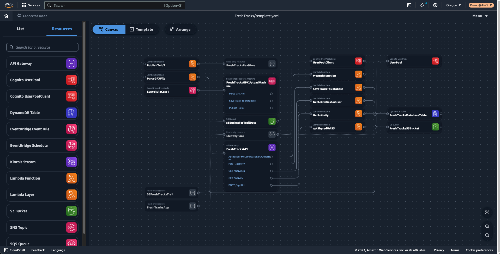

</br>
</br>
🎉 That's it! 
</br>

Now, we can visualize and continue building the application in Application Composer. Rest of the build and deployment steps in our IDE will remain same. You can find an amazing collection of serverless repositories on [Serverless Land](https://serverlessland.com/repos/).

Please note following points : 
- there is no cost for visualizing the applications in Application Composer. However, if you `sam build` and `sam deploy` these in your AWS Account, you will be charged for the resources it creates. This is outside of the scope of this blog and may go beyond free tier limits.
- Application Composer is going to help you create the visualized template in it, you continue using your local testing, peer review, or regular deployment through your own current method.


## Clean up 
Remember to delete the CloudFormation stacks we created here using following steps: 

1. Delete the stack. Replace <STACK_NAME> with the stack name, in the above example our stack name was ``.
```bash
sam delete --stack-name <STACK_NAME>
```

2. Confirm the stack has been deleted in the AWS CloudFormation console or using following command. Replace <STACK_NAME> with the stack name and ensure the name is within single quotes.

```bash
aws cloudformation list-stacks --query "StackSummaries[?contains(StackName,'<STACK_NAME>')].StackStatus"
```


## Conclusion

Congratulations! We just learned how to use AWS Application Composer to visualize and build Serverless applications.  If you enjoyed this tutorial, found any issues, or have feedback us, [please send it our way](https://pulse.buildon.aws/survey/DEM0H5VW)!

Checkout my other tutorial on how to [create a CI/CD pipeline from scratch using Amazon CodeCatalyst](https://www.buildon.aws/tutorials/build-ci-cd-pipeline-iac-cloudformation), to deploy Infrastructure as Code (IaC) with AWS CloudFormation.

For more DevOps related content, check out our [DevOps Essentials guide](https://www.buildon.aws/concepts/devops-essentials/) and learn about [How Amazon Does DevOps in Real Life](https://www.buildon.aws/posts/how-amazon-does-devops-in-real-life/).
