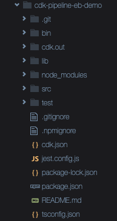

# Module 2: Create Infrastructure Using AWS CDK

In this module, you will create a CDK application that will create all the necessary infrastructure to deploy the Node.js web app using Elastic Beanstalk. We will setup CI/CD pipeline using CDK pipelines.

**Time to complete** 15 minutes

**Module prerequisites**

* AWS account with administrator-level access*
* Recommended browser: The latest version of Chrome or Firefox

  [*]Accounts created within the past 24 hours might not yet have access to the services required for this tutorial.


## Overview

In this module, you will create a CDK application that will create all the necessary infrastructure to deploy the Node.js web app using AWS Elastic Beanstalk.


## What you will accomplish

In this module, you will:

* How to create a new GitHub repo, 
* Create a simple CDK application
* Create an Elastic Beanstalk CDK app, app version, and environment
* Create CDK Pipelines to set up a continuous deployment pipeline for your CDK application


## Implementation

### Create GitHub Repository and personal access token

Create a repository on [GitHub](https://github.com/) to store these application files. Your repository can be public or private. 

If you need help, you can read the [GitHub documentation on how to create a repo](https://docs.github.com/en/get-started/quickstart/create-a-repo?tool=webui).

It is also a best practice to use tokens instead of passwords to access your github account via github api or command line.  Read more about [Creating a personal access token](https://docs.github.com/en/authentication/keeping-your-account-and-data-secure/creating-a-personal-access-token#creating-a-personal-access-token-classic).

The token should have the scopes **repo** (to read the repository) and **admin:repo_hook** (if you plan to use webhooks, true by default) as shown in below image.


### Create the CDK app

Create a new directory and move to that directory.
```bash
# Assuming at this point, you are inside the my_webapp folder created in Module 1. Goto root directory and run following
cd ..
mkdir cdk-pipeline-eb-demo
cd cdk-pipeline-eb-demo
```

Please install the specific version of the CDK to match the dependencies that are installed later on.

Example : 
```bash
npm install -g cdk@2.70.0
```

Initialize the CDK application that you will use to create the infrastructure.
```bash
cdk init app —-language typescript
```

CDK will also initiate a local git repository. Rename the branch to main.
```bash
git branch -m main
```


### Move Your Application into GitHub

After the GitHub repository is created, you will push your local application files to it. 

Move the application source files into new folder `src`. Add `!src/*` to not ignore any files except the node_modules and package-lock.json in the application source code `src`. This is to ensure that every time Beanstalk deploys the application into a new virtual machine it will install the node_modules.

```bash
cp -r ../my_webapp ./src
echo '!src/*' >> .gitignore
echo 'src/package-lock.json' >> .gitignore
echo 'src/node_modules' >> .gitignore
```

At this point, your folder structure should look like this:



In the following command, we are initiating a new local repository, changing branch name to `main`, adding all the files in current folder to stage, commit and push it to our remote github repository. 

Ensure to replace `YOUR_USERNAME` with your github org and `YOUR_REPOSITORY` with your repository name.

```bash
git add .
git commit -m "initial commit"
git remote add origin https://github.com/YOUR_USERNAME/YOUR_REPOSITORY.git 
git config credential.helper 'cache --timeout=3600'
git push -u origin main
```

For the first time, it will ask you username and password for the git repo and later cache it. If you created token as recommended before, then use the token for the password prompt. We have cached your credentials using the Git credentials caching command.


### Create the code for the resource stack

We are going to delete the default file created by CDK and define our own code for all the ElasticBeanstalk resources stack.

Simply run following code to remove the `/lib/cdk-pipeline-eb-demo.ts` and create a new file `/lib/eb-appln-stack.ts`.

```bash
rm -rf /lib/cdk-pipeline-eb-demo.ts
vi /lib/eb-appln-stack.ts
```

Paste following to `/lib/eb-appln-stack.ts` :
```Typescript
import * as cdk from 'aws-cdk-lib';
import { Construct } from 'constructs';
// Add import statements here

export class EBApplnStack extends cdk.Stack {
  constructor(scope: Construct, id: string, props?: cdk.StackProps) {
    super(scope, id, props);

    // The code that defines your stack goes here


  }
}
```

In this file `/lib/eb-appln-stack.ts`, you will write the code for all the resources stack you are going to create in this section.

A resource stack is a set of cloud infrastructure resources—all AWS resources in this case—that will be provisioned into a specific account. The account where these resources will be provisioned is the stack that you configured in the [prerequisite steps](https://aws.amazon.com/getting-started/guides/setup-cdk/). In this resource stack, you are going to create these resources:

* **S3 Assets**: This helps you to upload your zipped application into S3 and will provide the CDK application a way to get the object location.
* **Elastic Beanstalk App**: A logical collection of Elastic Beanstalk components, including environments, versions, and environment configurations.
* **Elastic Beanstalk App Version**: A specific, labeled iteration of deployable code for a web application. An application version points to an Amazon S3 object that contains the deployable code, in this case, the zip file that you will be uploading to S3 using S3 Assets. Applications can have many versions and each application version is unique.
* **Instance profile and role**: A container for an AWS Identity and Access Management (IAM) role that you can use to pass role information to an Amazon EC2 instance when the instance starts.
* **Elastic Beanstalk Environment**: A collection of AWS resources running an application version. Each environment runs only one application version at a time.


### <b>Upload the app to S3 automatically</b>

For deploying your web app, you need to package it and upload it to [Amazon S3](https://aws.amazon.com/s3/) so that Elastic Beanstalk can deploy the application in the environment.

To do that, you will be using a CDK constructor called S3 Assets. The S3 Assets module will zip up files in the provided directory, and upload the zip to S3.

In our CDK application, we first need to install the aws-s3-assets module.

In the `lib/eb-appln-stack.ts` file, add the dependency to the top of the file.

```Typescript
import * as s3assets from 'aws-cdk-lib/aws-s3-assets';
```

Inside the stack, under the commented line that says *The code that defines your stack goes here* add the following code. 

```Typescript
    // Construct an S3 asset Zip from directory up.
    const webAppZipArchive = new s3assets.Asset(this, 'WebAppZip', {
      path: `${__dirname}/../src`,
    });

```

This code uses the S3 Assets module and takes the folder of the web app located in the root of the CDK app, compresses into a zip file and uploads it to S3. Whenever you update the application source code and push to the GitHub repo, the file will automatically get updated in S3.


### <b>Add the Elastic Beanstalk CDK dependencies </b>


Next, we will create the Elastic Beanstalk application, application version, and environment so that you can deploy the web app that you just uploaded to S3 using S3 Assets.

Add the dependency to the Elastic Beanstalk module for CDK at the top of the `/lib/eb-appln-stack.ts` file.

```Typescript

import * as elasticbeanstalk from 'aws-cdk-lib/aws-elasticbeanstalk';
```

### <b>Create the Elastic Beanstalk application</b>

Now you can create the Elastic Beanstalk app. As mentioned before, an Elastic Beanstalk application is a logical collection of Elastic Beanstalk components, like a folder.

Put this code under the code of the S3 Assets in the `/lib/eb-appln-stack.ts` file. This code will create the application with the name MyWebApp in Elastic Beanstalk.

```Typescript
// Create a ElasticBeanStalk app.
const appName = 'MyWebApp';
const app = new elasticbeanstalk.CfnApplication(this, 'Application', {
    applicationName: appName,
});
```


### <b>Create Elastic Beanstalk application version</b>

Now you need to create an application version from the S3 asset that you created earlier. This piece of code will create the app version using the S3 bucket name and S3 object key that S3 Assets and CDK will provide to this method.

```Typescript
// Create an app version from the S3 asset defined earlier
const appVersionProps = new elasticbeanstalk.CfnApplicationVersion(this, 'AppVersion', {
    applicationName: appName,
    sourceBundle: {
        s3Bucket: webAppZipArchive.s3BucketName,
        s3Key: webAppZipArchive.s3ObjectKey,
    },
});
```

Before moving on, you want to make sure that the Elastic Beanstalk application exists before creating the app version. You can do this with CDK, as shown in the following code snippet.

```Typescript
// Make sure that Elastic Beanstalk app exists before creating an app version
appVersionProps.addDependency(app);
```

### <b>Create the instance profile</b>


To create your Elastic Beanstalk environment, you will need to provide an existing instance profile name.

An instance profile is a container for an AWS Identity and Access Management (IAM) role that you can use to pass role information to an Amazon EC2 instance when the instance starts.

In this case, the role will have attached the managed policy AWSElasticBeanstalkWebTier, which grants permissions to the app to upload logs to Amazon S3 and debugging information to AWS X-Ray.

Import the IAM module dependency in the CDK stack we have been working on:

```Typescript
import * as iam from 'aws-cdk-lib/aws-iam';
```

After the code that creates the application version, add this code:

```Typescript
// Create role and instance profile
const myRole = new iam.Role(this, `${appName}-aws-elasticbeanstalk-ec2-role`, {
    assumedBy: new iam.ServicePrincipal('ec2.amazonaws.com'),
});

const managedPolicy = iam.ManagedPolicy.fromAwsManagedPolicyName('AWSElasticBeanstalkWebTier')
myRole.addManagedPolicy(managedPolicy);

const myProfileName = `${appName}-InstanceProfile`

const instanceProfile = new iam.CfnInstanceProfile(this, myProfileName, {
    instanceProfileName: myProfileName,
    roles: [
        myRole.roleName
    ]
});

```

The first thing the code does is to create a new IAM role **(myRole)**.

To allow the EC2 instances in your environment to assume the role, the instance profile specifies Amazon EC2 as a trusted entity in the trust relationship policy.

To that role we then add the managed policy AWSElasticBeanstalkWebTier. We then create the instance profile with that role and the profile name.


### <b>Create Elastic Beanstalk environment</b>

The last part you need to create is the Elastic Beanstalk environment. The environment is a collection of AWS resources running an application version. For the environment, we will need to give some information about the infrastructure.

Let's start by creating the environment. When creating the environment you need to give it a name that will appear in the Elastic Beanstalk console—in this case, we are naming the environment MyWebAppEnvironment.

Then you need to give the application name, which you will get from the Elastic Beanstalk application definition earlier.

The solution stack name is the name of the managed platform that Elastic Beanstalk provides for running web applications. Using the right solution name, Elastic Beanstalk will provision the right resources for your application, for example, the Amazon EC2 instances. You should choose the right software stack depending on the framework and platform you chose to develop your web app. For this particular case, you are going to put this string `'64bit Amazon Linux 2 v5.7.0 running Node.js 14'`. At the end of this module, there is more information about solution stack names if you are interested where this string came from.

The option settings attribute allows you to configure the Elastic Beanstalk environment to your needs:

* **IamInstanceProfile**: Here you will reference the instance profile created in the previous steps.
* **MinSize, MaxSize, and InstanceTypes**: These are configurations for your instances and the autoscaling group that Elastic Beanstalk generates for you. These are optional parameters. If you don't set them up, Elastic Beanstalk will pick the instance type and the minimum and maximum sizes of the autoscaling group according to the platform definition. You are defining them so you can stay within the [AWS Free Tier](https://aws.amazon.com/free).

For more information about these settings, see [Configuration options for Elastic Beanstalk](https://docs.aws.amazon.com/elasticbeanstalk/latest/dg/command-options-general.html#command-options-general-autoscalingasg).
To define these configuration options, add the following lines of code:

```Typescript
// Example of some options which can be configured
const optionSettingProperties: elasticbeanstalk.CfnEnvironment.OptionSettingProperty[] = [
    {
        namespace: 'aws:autoscaling:launchconfiguration',
        optionName: 'IamInstanceProfile',
        value: myProfileName,
    },
    {
        namespace: 'aws:autoscaling:asg',
        optionName: 'MinSize',
        value: '1',
    },
    {
        namespace: 'aws:autoscaling:asg',
        optionName: 'MaxSize',
        value: '1',
    },
    {
        namespace: 'aws:ec2:instances',
        optionName: 'InstanceTypes',
        value: 't2.micro',
    },
];
```

Finally we have the version label. This is an important attribute as it needs to be a reference to the application version that we just created.

With this information, you can now create your Elastic Beanstalk environment.

Paste this code in your stack definition file.
```Typescript
// Create an Elastic Beanstalk environment to run the application
const elbEnv = new elasticbeanstalk.CfnEnvironment(this, 'Environment', {
    environmentName: 'MyWebAppEnvironment',
    applicationName: app.applicationName || appName,
    solutionStackName: '64bit Amazon Linux 2 v5.7.0 running Node.js 14',
    optionSettings: optionSettingProperties,
    versionLabel: appVersionProps.ref,
});
```

### Create the CDK Pipeline stack
### <b>Defining an empty pipeline</b>

After you define the stack that makes up your application, you can deploy it through a CI/CD pipeline.

CDK Pipelines is a high-level construct library that makes it easy to set up a continuous deployment pipeline for your CDK applications, powered by [AWS CodePipeline](http://aws.amazon.com/codepipeline).

The first step is to define your own subclass of stage, which describes a single logical, cohesive deployable unit of your application. This is similar to how you define custom subclasses of Stack to describe CloudFormation stacks. The difference is that a Stage can contain one or more Stacks, so it gives you the flexibility to make multiple copies of your potentially complex application via the pipeline. For this use case, your stage consists of only one stack.

Create a new file `lib/eb-stage.ts` and put the following code in it:

```Typescript
import { CfnOutput, Stage, StageProps } from 'aws-cdk-lib';
import { Construct } from 'constructs';
import { EBApplnStack } from './eb-appln-stack';

/**
 * Deployable unit of web service app
 */
export class CdkEBStage extends Stage {
      
  constructor(scope: Construct, id: string, props?: StageProps) {
    super(scope, id, props);

    const service = new EBApplnStack(this, 'WebService');
    
  }
}
```

To organize things neatly, put the pipeline definition into its own stack file. Create a new file `lib/cdk-pipeline-stack.ts`. Remember to replace OWNER and REPO in the code below:


```Typescript
import { CodePipeline, CodePipelineSource, ShellStep } from 'aws-cdk-lib/pipelines';
import { Construct } from 'constructs';
import {  Stack, StackProps } from 'aws-cdk-lib';


/**
 * The stack that defines the application pipeline
 */
export class CdkPipelineStack extends Stack {
  constructor(scope: Construct, id: string, props?: StackProps) {
    super(scope, id, props);

    const pipeline = new CodePipeline(this, 'Pipeline', {
      // The pipeline name
      pipelineName: 'MyServicePipeline',

       // How it will be built and synthesized
       synth: new ShellStep('Synth', {
         // Where the source can be found
         input: CodePipelineSource.gitHub('OWNER/REPO', 'main'),
         
         // Install dependencies, build and run cdk synth
         installCommands: ['npm i -g npm@latest'],
         commands: [
           'npm ci',
           'npm run build',
           'npx cdk synth'
         ],
       }),
    });

    // This is where we add the application stages
  }
}
```

The code defines the following basic properties of the pipeline:
* Its name.
* Where to find the source in GitHub.
* How to do the build and synthesis. For this use case, you install latest npm packages and a standard NPM build (this type of build runs npm run build followed by npx cdk synth).

You also need to instantiate `CdkPipelineStack` with the account and aws region where you want to deploy the pipeline. Put the following code in `bin/cdk-pipeline-eb-demo.ts`. Please be sure to replace `ACCOUNT` and the `REGION` in there if necessary: 

```Typescript
#!/usr/bin/env node
import 'source-map-support/register';
import * as cdk from 'aws-cdk-lib';
import { CdkPipelineStack } from '../lib/cdk-pipeline-stack';

const app = new cdk.App();

new CdkPipelineStack(app, 'CdkPipelineStack', {
   env: { account: 'ACCOUNT', region: 'REGION' },
});

app.synth();

```

CDK Pipelines use some new features of the CDK framework that you need to explicitly turn on. Add the following to your `cdk.json` file in the `"context"` section, add a comma accordingly:

```JSON
{
  ...
  "context": {
    "@aws-cdk/core:newStyleStackSynthesis": true
  }
}
```
#### <b>Connect GitHub to CodePipelines</b>

For AWS CodePipeline to read from this GitHub repo, you also need to configure the GitHub personal access token we created earlier. 

This token should be stored as a plaintext secret (not a JSON secret) in AWS [Secrets Manager](https://aws.amazon.com/secrets-manager) under the exact name `github-token`. 

Replace GITHUB_ACCESS_TOKEN with your plaintext secret and REGION in following command and run it : 

```bash
aws secretsmanager  create-secret --name github-token --description "Github access token for cdk" --secret-string GITHUB_ACCESS_TOKEN --region REGION
```
For more help, see [Creating and Retrieving a Secret](https://docs.aws.amazon.com/secretsmanager/latest/userguide/create_secret.html).

If you are interested to use a different secret name other than the default name `github-token`, there is more information at the end of this module. 


## Common mistakes

### Using multiple versions of the CDK libraries

One common error you might get when using CDK is that when you import a library and start using it in your application, the word "this" gets highlighted and you receive a compilation error.


This might happen because you are using CDK module with a different version than the CDK core library. CDK updates happen often, so it's a common error.

To fix this, you need to update all the CDK packages to the same version. You can see the version of your CDK packages in the `package.json` file in your CDK application.


## More information

### Elastic Beanstalk solution stack name

In the [documentation](https://docs.aws.amazon.com/elasticbeanstalk/latest/platforms/platforms-supported.html), you can read about all the supported platforms for Elastic Beanstalk. We update this page as newer platforms are added and older platforms get retired.

If you are curious about how to get the right platform name, such as 64bit Amazon Linux 2 v5.6.1 running Node.js 14, you can use the AWS CLI to get a [list of all the supported platforms.](https://awscli.amazonaws.com/v2/documentation/api/latest/reference/elasticbeanstalk/list-available-solution-stacks.html)

```bash
aws elasticbeanstalk list-available-solution-stacks
```

This returns a long list of supported platforms strings that you can use in your CDK application.

### GitHub token to connect GitHub repository with CodePipeline

If your pipeline creation is failing with error on Access Denied to source code GitHub repository then you do not have a secret with name `github-token`, which is the default value in CDK. 

If you have token in a different name, e.g. `github-access-token-secret`, you have to update the CDK code in `lib/cdk-pipeline-stack.ts`. Import cdk and add authentication with secret name.

```Typescript
import * as cdk from 'aws-cdk-lib';

const pipeline = new CodePipeline(this, 'Pipeline', {
      // The pipeline name
      pipelineName: 'MyServicePipeline',

       // How it will be built and synthesized
       synth: new ShellStep('Synth', {
         // Where the source can be found
         input: CodePipelineSource.gitHub('OWNER/REPO', 'main', {
                    authentication: cdk.SecretValue.secretsManager('`github-access-token-secret`'), }),
```


## Conclusion


In this module, you learned how to create all the necessary resources of Elastic Beanstalk to deploy your application automatically. In the next module, you are going to learn how to deploy this to the cloud and how you can update your app when there are changes.
