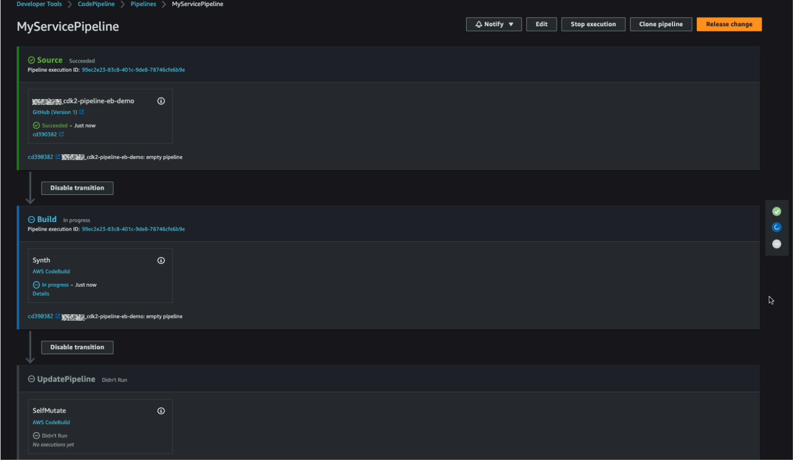
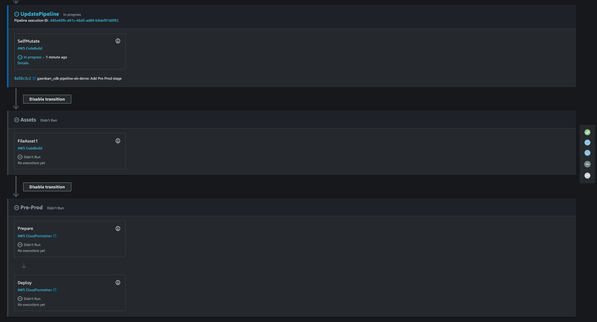

# Module 3: Deploy Web Application
In this module, we will deploy your application to the cloud

**Time to complete** 15 minutes

**Module prerequisites**
* AWS account with administrator-level access*
* Recommended browser: The latest version of Chrome or Firefox
  
  [*]Accounts created within the past 24 hours might not yet have access to the services required for this tutorial.

## Overview

In this module, you will learn to package your Node.js application so it can be deployed. You will also learn how to provision all the AWS Elastic Beanstalk resources you created in the previous module using AWS CDK.

## What you will accomplish

In this module, you will:
* Build and deploy your CDK Pipelines
* Add deployment stage to pipeline to build and deploy your ElasticBeanstalk environment 
* Update the Node.js application and push through automated CI/CD pipeline 
 


## Implementation

### Bootstrap CDK in your account

If this is the first time you are using AWS CDK in this account, and in this AWS Region, you will need to bootstrap it. When deploying AWS CDK apps into an AWS account and Region, CDK needs to provision resources that it needs to perform deployments. These resources include an Amazon S3 bucket for storing the deployment files, and IAM roles that grant the needed permissions to perform deployments. Provisioning these initial resources is called bootstrapping.

To bootstrap your AWS account and Region, run the following:

`cdk bootstrap aws://ACCOUNT-NUMBER/REGION`

This should look something like this:

`cdk bootstrap aws://123456789012/us-east-1`

You can get the account number from the AWS Management Console, and the Region name from [this list](https://aws.amazon.com/getting-started/guides/deploy-webapp-elb/module-three/#:~:text=Region%20name%20from-,this%20list,-.).


### Build and deploy your CDK application
After you have bootstrapped your AWS account and Region, you are ready to build and deploy your CDK application.

The first step is to build the CDK application.
```bash
npm run build
```

If there are no errors in your application, this will succeed. You can now push all the code to the GitHub repository.  

```bash
git add .
git commit -m "empty pipeline"
git push
```

You can now deploy the CDK application in the cloud. As a one-time operation, deploy the pipeline stack:
```bash
cdk deploy
```

Because we created a new role, you will be asked to confirm changes in your account security level. Note, the resource changes list will be longer than shown in the following image.


Respond with **y**, and then the deployment will start. It takes a few minutes to complete. When it is done, you will receive a message containing the ARN (Amazon Resource Name) of the CloudFormation stack that this deployment created for you.

If you open the CloudFormation Management console, you will see that there is a new stack there.


This take a couple of minutes to finish. At the end, you can find a pipeline in your [CodePipeline console](), as in the following screenshot.



_Troubleshooting tip: if you see an Internal Failure error during this step while the pipeline is being created, double check you have a Secrets Manager secret with the right name configured with your GitHub token in it as mentioned in the previous module._


### <b>Add a deploy stage for beanstalk environment</b>

So far, you’ve provisioned an empty pipeline, and the pipeline isn’t deploying your web application yet. You can do that by adding instances of your CdkEBStage to the pipeline.

Add a new import line at the top of `lib/cdk-pipeline-stack.ts` :  
```Typescript
import { CdkEBStage } from './eb-stage';
```

and following code after the mentioned comment: 
```Typescript
    // This is where we add the application stages
    // deploy beanstalk app
    const deploy = new CdkEBStage(this, 'Pre-Prod');
    const deployStage = pipeline.addStage(deploy); 
```

All you have to do now is to commit and push this, and the pipeline automatically reconfigures itself to add the new stage and deploy to it. `npm run build` first to make sure there are no typos.

Run the following commands to do so:
```bash

npm run build
git add .
git commit -m 'Add Pre-Prod stage'
git push
```

In CodePipeline, once the UpdatePipeline stage picks up new code for an additional stage, it will self-mutate and add 2 new stages, one for the Assets and another for Pre-Prod.



Once the UpdatePipeline has completed successfully, the pipeline will again run from start. This time it will deploy the Beanstalk application, environment and the `my_webapp` application. You can find 2 new CloudFormation stacks in the CloudFormation console.


The stack called `Pre-Prod-WebService` contains all the Elastic Beanstalk resources we created in the previous module: Elastic Beanstalk application, application version, instance profile, and environment.

The other stack (with the random string `awseb-e-randomstring-stack`), which was created by Elastic Beanstalk, contains all the resources the Elastic Beanstalk app needs to run—autoscaling groups, instances, Amazon CloudWatch alarms and metrics, load balancers, and security groups.

### Viewing your application in the cloud

After the pipeline finishes running through the final `Pre-Prod` stage, you can confirm that the service is up and running. 

In the CloudFormation console, you can find the application URL in the Outputs tab of the stack with random string.


Alternatively, you can find this URL by going to the Elastic Beanstalk service in the AWS Management Console, and look for the environment called `MyWebAppEnvironment`. Choose the URL to launch the web app.


### Update the Node.js application deployment

If you want to make a change to your web app, and you want to redeploy it to the cloud, follow these steps:

* Make the change in the web app
* Stage, Commit and Push the changes to GitHub repo

  ```git add . && git commit -am 'YOUR COMMIT MESSAGE GOES HERE' && git push```

It will automatically run the code through pipeline and deploy it.

Now, you can verify that there is a new version of the Elastic Beanstalk app deployed. If you visit the web app URL, the new version will be deployed. 


This takes a bit of time; the CodePipeline console will indicate when the new deployment is complete.


## Common mistakes
### Node modules when packaging your app
If you get the following error when your Node.js application is uploaded to Elastic Beanstalk, you will need to package your application differently.
`Failed to find package.json. Node.js may have issues starting. Verify package.json is valid or place code in a file named server.js or app.js.`

Remove the package-lock.json and node_modules directory and push the code to GitHub again. This will ensure that Beanstalk runs `npm install` and installs all required packages.

When you have this directory, Elastic Beanstalk assumes that no dependencies need to be downloaded.

Read more on the instructions on [handling Node.js dependencies in Elastic Beanstalk packages](https://docs.aws.amazon.com/elasticbeanstalk/latest/dg/nodejs-platform-dependencies.html).

## Conclusion
In this guide, you learned how to deploy a Node.js web application with Elastic Beanstalk as a CDK application. We also learned how to deploy all the infrastructure and application source code through a CI/CD Pipeline.