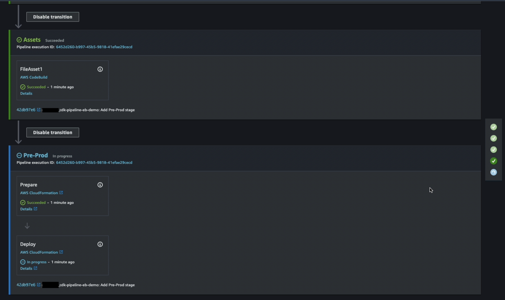

We as developers want to deploy our web applications in the fastest way possible without managing the underlying infrastructure. The cherry on top would be packaging both - the application and infrastructure, as a code and run it through the same CI/CD pipeline. We can then apply the same best practices of versioning, tracking changes, doing code reviews, tests, and rollbacks.

To achieve this, we can use **AWS Elastic Beanstalk**, which is an easy-to-use service for deploying and scaling web applications and services developed with Java, .NET, PHP, Node.js, Python, Ruby, Go, and Docker on familiar servers such as Apache, Nginx, Passenger, and IIS. We can simply upload our code in a single ZIP file or a WAR file and Elastic Beanstalk automatically handles the deployment, from capacity provisioning, load balancing, auto-scaling, to application health monitoring. At the same time, we retain full control over the AWS resources powering our application and can access the underlying resources at any time.

 In addition to that, we can also build the AWS Elastic Beanstalk resources using code! 
 
 The **[AWS Cloud Development Kit (AWS CDK)](https://docs.aws.amazon.com/cdk/api/v2/?sc_channel=el&sc_campaign=devopswave&sc_content=cicdcdkebaws&sc_geo=mult&sc_country=mult&sc_outcome=acq)** is an open-source software development framework to define cloud infrastructure in familiar programming languages and provision it through AWS CloudFormation. It consists of three major components : a **core framework** for modeling reusable infrastructure components, a **CLI** to interact with it, and a **[Construct Library](https://docs.aws.amazon.com/cdk/api/v2/docs/aws-construct-library.html?sc_channel=el&sc_campaign=devopswave&sc_content=cicdcdkebaws&sc_geo=mult&sc_country=mult&sc_outcome=acq)**, that has abstracted high-level components of AWS resources.

**CDK Pipelines** is a high-level construct library that makes it easy to set up a continuous deployment pipeline for CDK applications, powered by AWS CodePipeline. 

In this guide, we will learn how to : 
- create a simple non-containerized Node.js web application, and 
- then we will use AWS CDK to :
    - package the web application source code
    - create the deployment infrastructure (using AWS Elastic Beanstalk resources), and 
    - create the CI/CD pipeline (using AWS CDK Pipelines).


## Table of Contents

| Attributes             |                                                                 |
|------------------------|-----------------------------------------------------------------|
| ✅ AWS experience      | 100 - Beginner                                              |
| ⏱ Time to complete     | 40 minutes                                                      |
| 💰 Cost to complete    | Free tier eligible                                               |
| 🧩 Prerequisites       | - [AWS Account and the CLI installed](https://aws.amazon.com/getting-started/guides/setup-environment/)<br>- [AWS CDK v2.7.0 installed](https://aws.amazon.com/getting-started/guides/setup-cdk)<br>- [GitHub account](https://github.com/)|
| 💻 Code Sample         | Code sample used in tutorial on [GitHub](https://github.com/build-on-aws/aws-elastic-beanstalk-cdk-pipelines?sc_channel=el&sc_campaign=devopswave&sc_content=cicdcdkebaws&sc_geo=mult&sc_country=mult&sc_outcome=acq)                            |
| 📢 Feedback            | <a href="https://pulse.buildon.aws/survey/DEM0H5VW" target="_blank">Any feedback, issues, or just a</a> 👍 / 👎 ?    |
| ⏰ Last Updated        | 2023-03-28                                                     |

| ToC |
|-----|

## Prerequisites
Before proceeding, ensuring we have following prerequisites setup and ready to use:

* **An AWS account and CLI installed**: If you don't already have an account, follow the [Setting Up Your AWS Environment](https://aws.amazon.com/getting-started/guides/setup-environment/?sc_channel=el&sc_campaign=devopswave&sc_content=cicdcdkebaws&sc_geo=mult&sc_country=mult&sc_outcome=acq) guide for a quick overview and CLI installation steps.
* **CDK installed**: Visit our [Get Started with AWS CDK](https://aws.amazon.com/getting-started/guides/setup-cdk/?sc_channel=el&sc_campaign=devopswave&sc_content=cicdcdkebaws&sc_geo=mult&sc_country=mult&sc_outcome=acq) guide to learn more.
* A **GitHub account** : Visit [GitHub.com](https://github.com/) and follow the prompts to create your account.

## Build a Web Application

We will create a non-containerized application that we will deploy to the cloud. For this example, we are going to use Node.js to build a web application.

The web application will be a simple web app server that will serve static HTML files and also have a REST API endpoint. The focus of this tutorial is not to teach you how to build web applications, so feel free to use the example application, or build your own one. While this tutorial focuses on using Node.js, you can also build a similar web app with other Elastic Beanstalk supported programming languages, such as Java, .NET, PHP, Ruby, Python, Go, and Docker.

You can implement this in your local computer or in an [AWS Cloud9 environment](https://docs.aws.amazon.com/cloud9/latest/user-guide/tutorial.html?sc_channel=el&sc_campaign=devopswave&sc_content=cicdcdkebaws&sc_geo=mult&sc_country=mult&sc_outcome=acq).

### Create the client app
The first step is to create a new directory for our application.
```bash
mkdir my_webapp
cd my_webapp
```

Then we can initialize the Node.js project. This creates the package.json file that will contain all the definitions of our Node.js application.
```bash
npm init -y
```

If npm is not installed, install it in your local terminal following the instructions found at [Setting up your Node.js development environment](https://docs.aws.amazon.com/elasticbeanstalk/latest/dg/nodejs-devenv.html?sc_channel=el&sc_campaign=devopswave&sc_content=cicdcdkebaws&sc_geo=mult&sc_country=mult&sc_outcome=acq).

### Create Express app
We are going to use [Express](https://expressjs.com/) as our web application framework. To use it, we need to install Express as a dependency in our Node.js project.

```bash
npm install express
```

After running this command, we will see the dependency appear in the package.json file. Additionally, the `node_modules` directory and `package-lock.json` files are created.

Now we can create a new file called `app.js`. This file will contain the business logic for where our Node.js Express server will reside.

We are now ready to start adding some code. The first thing we need to add is the dependencies for the app—in this case, adding Express to allow use of the module we previously installed, and then the code to start up the web server. We will specify the web server to use port 8080, as that is what Elastic Beanstalk uses by default.

```JavaScript
var express = require('express');
var app = express();
var fs = require('fs');
var port = 8080;

app.listen(port, function() {
  console.log('Server running at http://127.0.0.1:', port);
});

```

We can start up our application now, but it won't do anything yet as we have not defined any code to process requests.

### Create a REST API

We will now add code to serve a response for a HTTP REST API call. To create our first API call, add the following code in the `app.js` file:

```JavaScript
var express = require('express');
var app = express();
var fs = require('fs');
var port = 8080;
/*global html*/

// New code
app.get('/test', function (req, res) {
    res.send('the REST endpoint test run!');
});


app.listen(port, function() {
  console.log('Server running at http://127.0.0.1:%s', port);
});

```

This is just to illustrate how to connect the `/test` endpoint to our code; you can add in a different response, or code that does something specific.

### Serve HTML content

Our Express Node.js application can also serve a static web page. We need to create an HTML page to use as an example. Let's create a file called `index.html`.

Inside this file, add the following HTML with a link to the REST endpoint we created earlier to show how it connects to the backend:

```html
<html>
    <head>
        <title>Elastic Beanstalk App</title>
    </head>

    <body>
        <h1>Welcome to the demo for ElasticBeanstalk</h1>
        <a href="/test">Call the test API</a>
    </body>
</html>
```


To serve this HTML page from our Express server, we need to add some more code to render the `/path` when it is called. 

To do this, add the following code **before** the `/test` call in `app.js` file:

```JavaScript
app.get('/', function (req, res) {
    html = fs.readFileSync('index.html');
    res.writeHead(200);
    res.write(html);
    res.end();
});
```

This code will serve the `index.html` file whenever a request for the root of the app (/) is made.

### Running the code locally

We are now ready to run our application and test if it is working locally. To do this, we are going to update `package.json` with a script to make it easier to run. In the `package.json` file, replace the scripts section as following:

```JSON
"scripts": {
    "start": "node app.js"
  },
```

Now we can go to our terminal and run:
```bash
npm start
```

This will start a local server with the URL **http://127.0.0.1:8080** or **http://localhost:8080**.

When we paste this URL in our browser, we should see the following:


To stop the server, press **ctrl + c** to stop the process in the terminal where we ran `npm start`. 

## Create Infrastructure Using AWS CDK

Now that we have our sample application, let's create a CDK application that will create all the necessary infrastructure to deploy the Node.js web app using AWS Elastic Beanstalk.

### Create GitHub Repository and personal access token

Create a repository on [GitHub](https://github.com/) to store these application files. Your repository can be public or private. 

If you need help, you can read the [GitHub documentation on how to create a repo](https://docs.github.com/en/get-started/quickstart/create-a-repo?tool=webui).

It is also a best practice to use tokens instead of passwords to access your github account via github api or command line.  Read more about [Creating a personal access token](https://docs.github.com/en/authentication/keeping-your-account-and-data-secure/creating-a-personal-access-token#creating-a-personal-access-token-classic).

The token should have the scopes **repo** (to read the repository) and **admin:repo_hook** (if you plan to use webhooks, true by default) as shown in below image.


### Create the CDK app

Create a new directory and move to that directory.
```bash
# Assuming at this point, you are inside the my_webapp folder 
cd ..
mkdir cdk-pipeline-eb-demo
cd cdk-pipeline-eb-demo
```

Please install the specific version of the CDK to match the dependencies that are installed later on.

Example : 
```bash
npm install -g cdk@2.70.0
```

Initialize the CDK application that we will use to create the infrastructure.
```bash
cdk init app —-language typescript
```

CDK will also initiate a local git repository. Rename the branch to main.
```bash
git branch -m main
```


### Move the Application into GitHub

After the GitHub repository is created, we will push the local application files to it. 

Move the application source files into new folder `src`. 

We are also updating `.gitignore` file. We are asking git to include all files from the `src/*` folder, except `node_modules` and `package-lock.json`. This is to ensure that every time Beanstalk deploys the application into a new virtual machine it will install the node_modules. Read more on the instructions on [handling Node.js dependencies in Elastic Beanstalk packages](https://docs.aws.amazon.com/elasticbeanstalk/latest/dg/nodejs-platform-dependencies.html?sc_channel=el&sc_campaign=devopswave&sc_content=cicdcdkebaws&sc_geo=mult&sc_country=mult&sc_outcome=acq).


```bash
cp -r ../my_webapp ./src
echo '!src/*' >> .gitignore
echo 'src/package-lock.json' >> .gitignore
echo 'src/node_modules' >> .gitignore
```

At this point, our folder structure should look like this:


In the following commands, we are adding all the files in current folder to stage, commit and push it to our remote github repository. We are also caching the credentials using the Git credentials cache command.

Ensure to replace `YOUR_USERNAME` with your github org and `YOUR_REPOSITORY` with your repository name.

```bash
git add .
git commit -m "initial commit"
git remote add origin https://github.com/YOUR_USERNAME/YOUR_REPOSITORY.git 
git config credential.helper 'cache --timeout=3600'
git push -u origin main
```

For the first time, it will ask you username and password for the git repo and later cache it. If you created token as recommended before, then use the token for the password prompt. 


### Create the code for the resource stack

We are going to delete the default file created by CDK and define our own code for all the ElasticBeanstalk resources stack.

Simply run following code to remove the `/lib/cdk-pipeline-eb-demo.ts` and create a new file `/lib/eb-appln-stack.ts`.

```bash
rm -rf /lib/cdk-pipeline-eb-demo.ts
vi /lib/eb-appln-stack.ts
```

Paste following to `/lib/eb-appln-stack.ts` :
```Typescript
import * as cdk from 'aws-cdk-lib';
import { Construct } from 'constructs';
// Add import statements here

export class EBApplnStack extends cdk.Stack {
  constructor(scope: Construct, id: string, props?: cdk.StackProps) {
    super(scope, id, props);

    // The code that defines your stack goes here


  }
}
```

In this file `/lib/eb-appln-stack.ts`, we will write the code for all the resources stack we are going to create in this section. You can also copy-paste contents of this file from [here](https://raw.githubusercontent.com/build-on-aws/aws-elastic-beanstalk-cdk-pipelines/main/lib/eb-appln-stack.ts).

A resource stack is a set of cloud infrastructure resources—all AWS resources in this case—that will be provisioned into a specific account. The account where these resources will be provisioned is the stack that you configured in the prerequisite. In this resource stack, we are going to create these resources:

* **IAM Instance profile and role**: A container for an AWS Identity and Access Management (IAM) role that we can use to pass role information to an Amazon EC2 instance when the instance starts.
* **S3 Assets**: This helps us to upload the zipped application into S3 and will provide the CDK application a way to get the object location.
* **Elastic Beanstalk App**: A logical collection of Elastic Beanstalk components, including environments, versions, and environment configurations.
* **Elastic Beanstalk App Version**: A specific, labeled iteration of deployable code for a web application. An application version points to an Amazon S3 object that contains the deployable code, in this case, the zip file that we will be uploading to S3 using S3 Assets. Applications can have many versions and each application version is unique.
* **Elastic Beanstalk Environment**: A collection of AWS resources running an application version. Each environment runs only one application version at a time.


### Upload the app to S3 automatically

For deploying the web app, we need to package it and upload it to [Amazon S3](https://aws.amazon.com/s3/?sc_channel=el&sc_campaign=devopswave&sc_content=cicdcdkebaws&sc_geo=mult&sc_country=mult&sc_outcome=acq) so that Elastic Beanstalk can deploy the application in the environment.

To do that, we will be using a CDK constructor called S3 Assets. The S3 Assets module will zip up files in the provided directory, and upload the zip to S3.

In the `lib/eb-appln-stack.ts` file, add the dependency to the top of the file.

```Typescript
import * as s3assets from 'aws-cdk-lib/aws-s3-assets';
```

Inside the stack, under the commented line that says *The code that defines your stack goes here* add the following code:

```Typescript
    // Construct an S3 asset Zip from directory up.
    const webAppZipArchive = new s3assets.Asset(this, 'WebAppZip', {
      path: `${__dirname}/../src`,
    });

```

This code uses the S3 Assets module and takes the folder of the web app located in the root of the CDK app, compresses into a zip file and uploads it to S3. Whenever we update the application source code and push to the GitHub repo, the file will automatically get updated in S3.


### Add the Elastic Beanstalk CDK dependencies 


Next, we will create the Elastic Beanstalk application, application version, and environment so that we can deploy the web app that we just uploaded to S3 using S3 Assets.

Add the dependency to the Elastic Beanstalk module for CDK at the top of the `/lib/eb-appln-stack.ts` file.

```Typescript
import * as elasticbeanstalk from 'aws-cdk-lib/aws-elasticbeanstalk';
```

### Create the Elastic Beanstalk application

Now we can create the Elastic Beanstalk app. As mentioned before, an Elastic Beanstalk application is a logical collection of Elastic Beanstalk components, like a folder.

Put this code under the code of the S3 Assets in the `/lib/eb-appln-stack.ts` file. This code will create the application with the name `MyWebApp` in Elastic Beanstalk.

```Typescript
// Create a ElasticBeanStalk app.
const appName = 'MyWebApp';
const app = new elasticbeanstalk.CfnApplication(this, 'Application', {
    applicationName: appName,
});
```


### Create Elastic Beanstalk application version

Now we need to create an application version from the S3 asset that we created earlier. This piece of code will create the app version using the S3 bucket name and S3 object key that S3 Assets and CDK will provide to this method.

```Typescript
// Create an app version from the S3 asset defined earlier
const appVersionProps = new elasticbeanstalk.CfnApplicationVersion(this, 'AppVersion', {
    applicationName: appName,
    sourceBundle: {
        s3Bucket: webAppZipArchive.s3BucketName,
        s3Key: webAppZipArchive.s3ObjectKey,
    },
});
```

Before moving on, we want to make sure that the Elastic Beanstalk application exists before creating the app version. We can do this with CDK by adding a dependency, as shown in the following code snippet.

```Typescript
// Make sure that Elastic Beanstalk app exists before creating an app version
appVersionProps.addDependency(app);
```

### Create the instance profile

To create the Elastic Beanstalk environment, we will need to provide an existing instance profile name.

An instance profile is a container for an AWS Identity and Access Management (IAM) role that we can use to pass role information to an Amazon EC2 instance when the instance starts.

In this case, the role will have attached the managed policy `AWSElasticBeanstalkWebTier`, which grants permissions to the app to upload logs to Amazon S3 and debugging information to AWS X-Ray.

Import the IAM module dependency in the CDK stack we have been working on:

```Typescript
import * as iam from 'aws-cdk-lib/aws-iam';
```

After the code that creates the application version, add this code:

```Typescript
// Create role and instance profile
const myRole = new iam.Role(this, `${appName}-aws-elasticbeanstalk-ec2-role`, {
    assumedBy: new iam.ServicePrincipal('ec2.amazonaws.com'),
});

const managedPolicy = iam.ManagedPolicy.fromAwsManagedPolicyName('AWSElasticBeanstalkWebTier')
myRole.addManagedPolicy(managedPolicy);

const myProfileName = `${appName}-InstanceProfile`

const instanceProfile = new iam.CfnInstanceProfile(this, myProfileName, {
    instanceProfileName: myProfileName,
    roles: [
        myRole.roleName
    ]
});
```

The first thing the code does is to create a new IAM role **(myRole)**.

To allow the EC2 instances in our environment to assume the role, the instance profile specifies Amazon EC2 as a trusted entity in the trust relationship policy.

To that role we then add the managed policy A`WSElasticBeanstalkWebTier`. We then create the instance profile with that role and the profile name.


### Create Elastic Beanstalk environment

The last part we need to create is the Elastic Beanstalk environment. The environment is a collection of AWS resources running an application version. For the environment, we will need to give some information about the infrastructure.

Let's start by creating the environment. When creating the environment we need to give it a **environment name** that will appear in the Elastic Beanstalk console — in this case, we are naming the environment `MyWebAppEnvironment`.

Then we need to give the **application name**, which we will get from the Elastic Beanstalk application definition earlier.

The **solution stack name** is the name of the managed platform that Elastic Beanstalk provides for running web applications. Using the right solution name, Elastic Beanstalk will provision the right resources for our application, for example, the Amazon EC2 instances. We should choose the right software stack depending on the framework and platform we chose to develop our web app. 
For this particular case, we are going to put this string `'64bit Amazon Linux 2 v5.7.0 running Node.js 14'`. At the end of this blog, there is more information about solution stack names, if you are interested to know where this string came from.

The option settings attribute allows us to configure the Elastic Beanstalk environment to our needs:

* **IamInstanceProfile**: Here we will reference the instance profile created in the previous steps.
* **MinSize, MaxSize, and InstanceTypes**: These are configurations for our instances and the autoscaling group that Elastic Beanstalk generates for us. These are optional parameters. If we don't set them up, Elastic Beanstalk will pick the instance type and the minimum and maximum sizes of the autoscaling group according to the platform definition. We are defining them so we can stay within the [AWS Free Tier](https://aws.amazon.com/free?sc_channel=el&sc_campaign=devopswave&sc_content=cicdcdkebaws&sc_geo=mult&sc_country=mult&sc_outcome=acq).

For more information about these settings, see [Configuration options for Elastic Beanstalk](https://docs.aws.amazon.com/elasticbeanstalk/latest/dg/command-options-general.html#command-options-general-autoscalingasg?sc_channel=el&sc_campaign=devopswave&sc_content=cicdcdkebaws&sc_geo=mult&sc_country=mult&sc_outcome=acq).

To define these configuration options, add the following lines of code:

```Typescript
// Example of some options which can be configured
const optionSettingProperties: elasticbeanstalk.CfnEnvironment.OptionSettingProperty[] = [
    {
        namespace: 'aws:autoscaling:launchconfiguration',
        optionName: 'IamInstanceProfile',
        value: myProfileName,
    },
    {
        namespace: 'aws:autoscaling:asg',
        optionName: 'MinSize',
        value: '1',
    },
    {
        namespace: 'aws:autoscaling:asg',
        optionName: 'MaxSize',
        value: '1',
    },
    {
        namespace: 'aws:ec2:instances',
        optionName: 'InstanceTypes',
        value: 't2.micro',
    },
];
```

Finally we have the **version label**. This is an important attribute as it needs to be a reference to the application version that we created in previous step.

With this information, we can now create our Elastic Beanstalk environment.

Add following code in the stack definition file `/lib/eb-appln-stack.ts`: 

```Typescript
// Create an Elastic Beanstalk environment to run the application
const elbEnv = new elasticbeanstalk.CfnEnvironment(this, 'Environment', {
    environmentName: 'MyWebAppEnvironment',
    applicationName: app.applicationName || appName,
    solutionStackName: '64bit Amazon Linux 2 v5.7.0 running Node.js 14',
    optionSettings: optionSettingProperties,
    versionLabel: appVersionProps.ref,
});
```

## Create the CDK Pipeline stack
### Defining an empty pipeline

After we define the stack that makes up our application, we can deploy it through a CI/CD pipeline.

CDK Pipelines is a high-level construct library that makes it easy to set up a continuous deployment pipeline for our CDK applications, powered by [AWS CodePipeline](http://aws.amazon.com/codepipeline).

A pipeline consists of several stages, which represent logical phases of the deployment. Each stage contains one or more actions that describe what to do in that particular stage. A CDK pipeline starts with several predefined stages and actions. 

For this step, we are only creating these predefined stages - `Source`, `Build` and `UpdatePipeline`and hence it is an empty pipeline. In the next section, we will add stages (`PublishAssets`, `Stage1`) and actions to it to suit the needs of our application.


To organize things neatly, put the pipeline definition into its own stack file. Create a new file `lib/cdk-pipeline-stack.ts`. Remember to replace OWNER and REPO in the code below:


```Typescript
import { CodePipeline, CodePipelineSource, ShellStep } from 'aws-cdk-lib/pipelines';
import { Construct } from 'constructs';
import {  Stack, StackProps } from 'aws-cdk-lib';


/**
 * The stack that defines the application pipeline
 */
export class CdkPipelineStack extends Stack {
  constructor(scope: Construct, id: string, props?: StackProps) {
    super(scope, id, props);

    const pipeline = new CodePipeline(this, 'Pipeline', {
      // The pipeline name
      pipelineName: 'MyServicePipeline',

       // How it will be built and synthesized
       synth: new ShellStep('Synth', {
         // Where the source can be found
         input: CodePipelineSource.gitHub('OWNER/REPO', 'main'),
         
         // Install dependencies, build and run cdk synth
         installCommands: ['npm i -g npm@latest'],
         commands: [
           'npm ci',
           'npm run build',
           'npx cdk synth'
         ],
       }),
    });

    // This is where we add the application stages
  }
}
```

The code defines the following basic properties of the pipeline:
* **Name** for the pipeline.
* Where to find the **source in GitHub**. This is `Source` stage. Every time we push new commits to this repo, the pipeline is triggered.
* How to do the **build and synthesis**. For this use case, the `Build` stage will install latest npm packages and a standard NPM build (this type of build runs `npm run build` followed by `npx cdk synth`).

We also need to instantiate `CdkPipelineStack` with the account and aws region where we want to deploy the pipeline. Put the following code in `bin/cdk-pipeline-eb-demo.ts`. Please be sure to replace `ACCOUNT` and the `REGION` in there if necessary: 

```Typescript
#!/usr/bin/env node
import 'source-map-support/register';
import * as cdk from 'aws-cdk-lib';
import { CdkPipelineStack } from '../lib/cdk-pipeline-stack';

const app = new cdk.App();

new CdkPipelineStack(app, 'CdkPipelineStack', {
   env: { account: 'ACCOUNT', region: 'REGION' },
});

app.synth();

```

CDK Pipelines use some new features of the CDK framework that we need to explicitly turn on. Add the following to our `cdk.json` file in the `"context"` section, add a comma accordingly:

```JSON
{
  ...
  "context": {
    "@aws-cdk/core:newStyleStackSynthesis": true
  }
}
```
#### Connect GitHub to CodePipelines

For AWS CodePipeline to read from this GitHub repo, we also need to configure the GitHub personal access token we created earlier. 

This token should be stored as a plaintext secret (not a JSON secret) in AWS [Secrets Manager](https://aws.amazon.com/secrets-manager?sc_channel=el&sc_campaign=devopswave&sc_content=cicdcdkebaws&sc_geo=mult&sc_country=mult&sc_outcome=acq) under the exact name `github-token`. 

Replace `GITHUB_ACCESS_TOKEN` with your plaintext secret and `REGION` in following command and run it : 

```bash
aws secretsmanager  create-secret --name github-token --description "Github access token for cdk" --secret-string GITHUB_ACCESS_TOKEN --region REGION
```
For more help, see [Creating and Retrieving a Secret](https://docs.aws.amazon.com/secretsmanager/latest/userguide/create_secret.html?sc_channel=el&sc_campaign=devopswave&sc_content=cicdcdkebaws&sc_geo=mult&sc_country=mult&sc_outcome=acq).

If you are interested to use a different secret name other than the default name `github-token`, there is more information at the end of this blog. 

## Deploy Web Application

### Bootstrap CDK in your account

If this is the first time you are using AWS CDK in this account, and in this AWS Region, you will need to bootstrap it. When deploying AWS CDK apps into an AWS account and Region, CDK needs to provision resources that it needs to perform deployments. These resources include an Amazon S3 bucket for storing the deployment files, and IAM roles that grant the needed permissions to perform deployments. Provisioning these initial resources is called bootstrapping.

To bootstrap your AWS account and Region, run the following:

`cdk bootstrap aws://ACCOUNT-NUMBER/REGION`

This should look something like this:

`cdk bootstrap aws://123456789012/us-east-1`

You can get the account number from the AWS Management Console, and the Region name from [this list](https://docs.aws.amazon.com/general/latest/gr/rande.html?sc_channel=el&sc_campaign=devopswave&sc_content=cicdcdkebaws&sc_geo=mult&sc_country=mult&sc_outcome=acq).


### Build and deploy the CDK application
After we have bootstrapped our AWS account and Region, we are ready to build and deploy our CDK application.

The first step is to build the CDK application.
```bash
npm run build
```

If there are no errors in our application, this will succeed. We can now push all the code to the GitHub repository.  

```bash
git add .
git commit -m "empty pipeline"
git push
```

We can now deploy the CDK application in the cloud.

Please note, the pipeline created by CDK pipelines is self-mutating. This means we only need to run `cdk deploy` one time to get the pipeline started. After that, the pipeline will automatically update itself, when we add the new stage (or CDK applications) in the source code.

So, as a one-time operation, deploy the pipeline stack:
```bash
cdk deploy
```

Because we created a new role, we will be asked to confirm changes in our account security level. Please note, the resource changes list will be longer than shown in the following image. This is for representation purposes only.


Respond with **y**, and then the deployment will start. It takes a few minutes to complete. When it is done, we will receive a message containing the ARN [(Amazon Resource Name)](https://docs.aws.amazon.com/IAM/latest/UserGuide/reference-arns.html?sc_channel=el&sc_campaign=devopswave&sc_content=cicdcdkebaws&sc_geo=mult&sc_country=mult&sc_outcome=acq) of the CloudFormation stack that this deployment created for us.

Open the CloudFormation Management console, to see the new CloudFormation stack.


This take a couple of minutes to finish. At the end, we can find a pipeline in our [CodePipeline console](http://console.aws.amazon.com/codesuite/codepipeline/home?sc_channel=el&sc_campaign=devopswave&sc_content=cicdcdkebaws&sc_geo=mult&sc_country=mult&sc_outcome=acq), as in the following screenshot.


_Troubleshooting tip: if you see an Internal Failure error during this step while the pipeline is being created, double check you have a Secrets Manager secret with the right name configured with your GitHub token in it as mentioned in the previous section._


### Add a deploy stage for beanstalk environment

So far, we have provisioned an empty pipeline, and the pipeline isn’t deploying our web application yet. 

The first step is to define our own subclass of stage, which describes a single logical, cohesive deployable unit of our application. This is similar to how we define custom subclasses of Stack to describe CloudFormation stacks. The difference is that a Stage can contain one or more Stacks, so it gives us the flexibility to make multiple copies of our potentially complex application via the pipeline. For this use case, our stage consists of only one stack.

Create a new file `lib/eb-stage.ts` and put the following code in it:

```Typescript
import { CfnOutput, Stage, StageProps } from 'aws-cdk-lib';
import { Construct } from 'constructs';
import { EBApplnStack } from './eb-appln-stack';

/**
 * Deployable unit of web service app
 */
export class CdkEBStage extends Stage {
      
  constructor(scope: Construct, id: string, props?: StageProps) {
    super(scope, id, props);

    const service = new EBApplnStack(this, 'WebService');
    
  }
}
```

Now, add instances of our CdkEBStage to the pipeline.

Add a new import line at the top of `lib/cdk-pipeline-stack.ts` :  
```Typescript
import { CdkEBStage } from './eb-stage';
```

and following code after the mentioned comment: 
```Typescript
    // This is where we add the application stages
    // deploy beanstalk app
    const deploy = new CdkEBStage(this, 'Pre-Prod');
    const deployStage = pipeline.addStage(deploy); 
```

All we have to do now is to commit and push this, and the pipeline will automatically reconfigures itself to add the new stage and deploy to it. Let's run `npm run build` first to make sure there are no typos.

Run the following commands to do so:
```bash
npm run build
git add .
git commit -m 'Add Pre-Prod stage'
git push
```

In CodePipeline console, once the UpdatePipeline stage picks up new code for an additional stage, it will self-mutate and add 2 new stages, one for the `Assets` and another for `Pre-Prod`.


Once the `UpdatePipeline` stage has completed successfully, the pipeline will again run from start. This time it will not stop at `UpdatePipeline` stage. It will transition further to the new stages `Assets` and `Pre-prod` to deploy the Beanstalk application, environment and the `my_webapp` application. 



 We can find 2 new CloudFormation stacks from the `Pre-Prod` stage in the CloudFormation console.


The stack called `Pre-Prod-WebService` contains all the Elastic Beanstalk resources we created in the previous module: Elastic Beanstalk application, application version, instance profile, and environment.

The other stack (with the random string `awseb-e-randomstring-stack`), which was created by Elastic Beanstalk, contains all the resources the Elastic Beanstalk app needs to run—autoscaling groups, instances, Amazon CloudWatch alarms and metrics, load balancers, and security groups.

### Viewing application deployed in the cloud

After the pipeline finishes running through the final `Pre-Prod` stage, we can confirm that the service is up and running. 

We can find this URL by going to the Elastic Beanstalk service in the AWS Management Console, and look for the environment called `MyWebAppEnvironment`. Choose the URL to launch the web app.


The application should now be available to be accessed from anywhere.


## Update the Node.js application deployment

If we want to make a change to our web application, and redeploy it to the cloud, follow these steps:

* Make the changes in the web app
* Stage, Commit and Push the changes to GitHub repo. 

  ```git add . && git commit -am 'YOUR COMMIT MESSAGE GOES HERE' && git push```

</br>
That's it! 

CodePipeline will be triggered as soon as the code is pushed to the GitHub repo. It will automatically run the code through the entire pipeline and deploy the new application version to our ElasticBeanstalk environment. This takes a bit of time.

Once the `Pre-prod` stage of CodePipeline has completed successfully, we can verify that there is a new version of the Elastic Beanstalk app deployed. Simply refresh the application URL in the browser to see the deployed changes.


# Clean up 
The benefit of using AWS CDK and CloudFormation for all infrastructure is that cleaning up AWS environment is easy. 
Run the following command inside the CDK application directory:

```bash
cdk destroy
```

We can verify the `CdkPipelineStack` stack was deleted by going to the AWS CloudFormation Management Console.

However, please note this will only destroy resources created by cdk when we run the `cdk deploy` command. It will not destroy the 2 CloudFormation stacks that were deployed by the `Pre-Prod` stage. 

We have to delete the `Pre-Prod-WebService` manually from the CloudFormation Console or using following command :

```bash
aws cloudformation delete-stack --stack-name Pre-Prod-WebService
```

If the stack delete fails with the error  `Cannot delete entity, must detach all policies first.` Then delete the IAM role (name starts with _Pre-Prod-WebService-MyWebAppawselasticbeanstalkec2-randomstring_) manually from IAM Console and retry deleting the CloudFormation stack. For help, read  [Deleting roles or instance profiles](https://docs.aws.amazon.com/IAM/latest/UserGuide/id_roles_manage_delete.html?sc_channel=el&sc_campaign=devopswave&sc_content=cicdcdkebaws&sc_geo=mult&sc_country=mult&sc_outcome=acq) in the AWS Documentation.

Goto CloudFormation Console, check if all the three stacks that were created are deleted successfully.


## Conclusion

Congratulations! We have now learned how to deploy a non-containerized application in the cloud. We created a simple Node.js web application, and then we used AWS CDK to create deployment infrastructure(using AWS Elastic Beanstalk resources) and the CI/CD pipeline (using AWS CDK Pipelines).  If you enjoyed this tutorial, found any issues, or have feedback us, [please send it our way](https://pulse.buildon.aws/survey/DEM0H5VW)!

For more DevOps related content, check out our DevOps Essentials guide and learn about How Amazon Does DevOps in Real Life.


## More information and troubleshooting

### Using multiple versions of the CDK libraries

One common error you might get when using CDK is that when you import a library and start using it in your application, the word "this" gets highlighted and you receive a compilation error.


This might happen because you are using CDK module with a different version than the CDK core library. CDK updates happen often, so it's a common error.

To fix this, you need to update all the CDK packages to the same version. You can see the version of your CDK packages in the `package.json` file in your CDK application.

### Elastic Beanstalk solution stack name

In the [documentation](https://docs.aws.amazon.com/elasticbeanstalk/latest/platforms/platforms-supported.html?sc_channel=el&sc_campaign=devopswave&sc_content=cicdcdkebaws&sc_geo=mult&sc_country=mult&sc_outcome=acq), you can read about all the supported platforms for Elastic Beanstalk. We update this page as newer platforms are added and older platforms get retired.

If you are curious about how to get the right platform name, such as `64bit Amazon Linux 2 v5.7.0 running Node.js 14`, you can use the AWS CLI to get a [list of all the supported platforms.](https://awscli.amazonaws.com/v2/documentation/api/latest/reference/elasticbeanstalk/list-available-solution-stacks.html?sc_channel=el&sc_campaign=devopswave&sc_content=cicdcdkebaws&sc_geo=mult&sc_country=mult&sc_outcome=acq)

```bash
aws elasticbeanstalk list-available-solution-stacks
```

This returns a long list of supported platforms strings that you can use in your CDK application.

### GitHub token to connect GitHub repository with CodePipeline

If your pipeline creation is failing with error `Access Denied` to source code GitHub repository, then you do not have a secret with name `github-token`, which is the default value in CDK. 

If you have token in a different name, e.g. `github-access-token-secret`, you have to update the CDK code in `lib/cdk-pipeline-stack.ts`. Import cdk and add authentication with secret name using following code:

```Typescript
import * as cdk from 'aws-cdk-lib';

const pipeline = new CodePipeline(this, 'Pipeline', {
      // The pipeline name
      pipelineName: 'MyServicePipeline',

       // How it will be built and synthesized
       synth: new ShellStep('Synth', {
         // Where the source can be found
         input: CodePipelineSource.gitHub('OWNER/REPO', 'main', {
                    authentication: cdk.SecretValue.secretsManager('`github-access-token-secret`'), }),
```