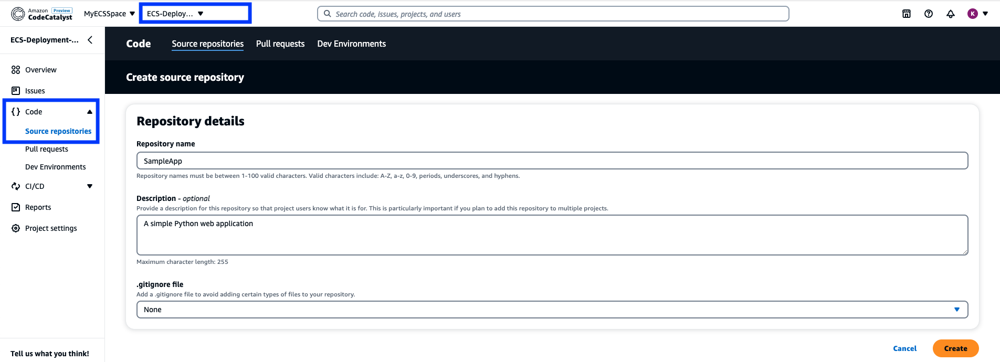

Amazon ECS is a fully managed container orchestration service that helps you easily deploy, manage, and scale containerized applications. It integrates with the rest of the AWS platform to provide a secure and easy-to-use solution for running container workloads in the cloud and now on your infrastructure with Amazon ECS Anywhere.

Amazon CodeCatalyst is an integrated DevOps service which you can leverage to plan, collaborate on code, build, test, and deploy applications with continuous integration and continuous delivery (CI/CD) tools. With all of these stages and aspects of an application’s lifecycle in one tool, you can deliver software quickly and confidently.

In this guide, you will learn how to deploy a containerized application on Amazon Elastic Container Service (Amazon ECS) using Amazon CodeCatalyst.

## What You Will Learn

In addition to learning about Amazon ECS and its various components, you will:

- Create the infrastructure to run your container with Amazon ECS
- Deploy a containerized application to Amazon ECS using Amazon CodeCatalyst

| Attributes            |                                   |
| ------------------- | -------------------------------------- |
| ✅ AWS Level        | Beginner                               |
| ⏱ Time to complete  | 15-20 minutes                             |
| 💰 Cost to complete | Less than $0.02 USD if completed in under an hour.     |
| 🧩 Prerequisites    | - [AWS Account](https://aws.amazon.com/resources/create-account/?sc_channel=el&sc_campaign=devopswave&sc_content=cicd_ecs_codecatalyst&sc_geo=mult&sc_country=mult&sc_outcome=acq) with administrator-level access*<br>- [CodeCatalyst Account](https://codecatalyst.aws) <br> [*]Accounts created within the past 24 hours might not yet have access to the services required for this tutorial.
| 💻 Code Sample         | Code sample used in tutorial on [GitHub](https://github.com/build-on-aws/automate-web-app-amazon-ecs-cdk-codecatalyst)                             |
| 📢 Feedback            | <a href="https://pulse.buildon.aws/survey/DEM0H5VW" target="_blank">Any feedback, issues, or just a</a> 👍 / 👎 ?    |
| ⏰ Last Updated     | 2023-04-26                             |

| ToC |
|-----|

## Prerequisites

Before starting this tutorial, you will need the following:

- An AWS Account (if you don't yet have one, you can create one and [set up your environment here](https://aws.amazon.com/getting-started/guides/setup-environment/?sc_channel=el&sc_campaign=devopswave&sc_content=cicd_ecs_codecatalyst&sc_geo=mult&sc_country=mult&sc_outcome=acq)).
- CDK installed: Visit the [**Get Started with AWS CDK guide**](/getting-started/guides/setup-cdk/) to learn more.
- The example project code downloaded to extract the SampleApp.
- Docker installed and running.
- [CodeCatalyst](https://codecatalyst.aws/) Account and Space setup with Space administrator role assigned to you (if you don't have a CodeCatalyst setup already, you can follow the [Amazon CodeCatalyst setting up guide](https://docs.aws.amazon.com/codecatalyst/latest/userguide/setting-up-topnode.html?sc_channel=el&sc_campaign=devopswave&sc_content=cicd_ecs_codecatalyst&sc_geo=mult&sc_country=mult&sc_outcome=acq)).

## Understanding ECS

The focus of this section is to introduce you to the concepts of Amazon ECS. We will cover the components of Amazon ECS (cluster, task definition, service), what orchestration is, and how to choose which type of compute to use to run your containers. If you are already familiar with Amazon ECS, you can skip ahead to the [Create Infrastructure](#create-infrastructure) section.

### What is Amazon ECS?

Amazon ECS is a fully managed container orchestration service that helps you easily deploy, manage, and scale containerized applications. It integrates with the rest of the AWS platform to provide a secure and easy-to-use solution for running container workloads in the cloud and now on your infrastructure with [**Amazon ECS Anywhere**](https://aws.amazon.com/ecs/anywhere/). An orchestrator manages the lifecycle of your container: deploying it, ensuring that it is healthy, replacing unhealthy nodes, and handling new deployments.  

### What Are the Components of ECS?

An Amazon ECS cluster is a logical construct that will group all the containers deployed into a cluster. There is no cost for a cluster - only for the compute and other infrastructure you use to run your containers.

To launch a container, you provide a [**task definition**](https://docs.aws.amazon.com/AmazonECS/latest/developerguide/task_definitions.html?sc_channel=el&sc_campaign=devopswave&sc_content=cicd_ecs_codecatalyst&sc_geo=mult&sc_country=mult&sc_outcome=acq), which contains properties like the container image location, amount of CPU and memory, logging configuration, and so on. This does not launch a container; it just provides all the configuration needed to be able to run it. To launch it, you will define a [**service**](https://docs.aws.amazon.com/AmazonECS/latest/developerguide/ecs_services.html?sc_channel=el&sc_campaign=devopswave&sc_content=cicd_ecs_codecatalyst&sc_geo=mult&sc_country=mult&sc_outcome=acq).

In the service, you define how many copies of the container you want (or if you need it to run on every instance, a [**daemon**](https://docs.aws.amazon.com/AmazonECS/latest/developerguide/ecs_services.html#service_scheduler_daemon?sc_channel=el&sc_campaign=devopswave&sc_content=cicd_ecs_codecatalyst&sc_geo=mult&sc_country=mult&sc_outcome=acq) that needs to run on every host, and ECS will handle the orchestration of it). To expose your services to the internet, you will need to set up an Application Load Balancer to forward requests to your service. Lastly, Amazon ECS can be configured to deploy across multiple Availability Zones (AZs), and will automatically balance the deployment across the number of AZs available and update the load balancer with details of each deployment to allow traffic to be routed to it.

The following diagram shows what the infrastructure would look like:  


### Compute Capacity Planning, and Options

Amazon ECS can schedule services to run on an EC2 host (virtual machine), or using [AWS Fargate](https://docs.aws.amazon.com/AmazonECS/latest/userguide/what-is-fargate.html?sc_channel=el&sc_campaign=devopswave&sc_content=cicd_ecs_codecatalyst&sc_geo=mult&sc_country=mult&sc_outcome=acq), a serverless compute engine for containers. When running containers, you need to account for capacity planning. As an example, if you have two hosts available in your cluster, each with 512MB of memory, the cluster will show a total of 1024MB of memory available, but you won't be able to launch a new container that requires more than 512MB of memory as there is no single host with enough memory. You can mitigate this by using capacity providers to automatically scale the cluster.

Alternatively, you can use Fargate, which allows you to specify the CPU and memory requirements for each container, and which then launches the required compute to run the container for you. The main difference between Fargate and EC2 hosts is that you do not need to set up, manage, or maintain the operating system on the host when using Fargate, nor do you need to do capacity planning as it will launch exactly the amount of capacity you need.

## Create Infrastructure

In this section, you will create an AWS CDK application that will create all the necessary infrastructure to set up an Amazon ECS cluster, and deploy a sample container to it.

### Create the CDK App

First, ensure you have CDK installed. If you do not have it installed, please follow the [**Get Started with AWS CDK guide**](https://aws.amazon.com/getting-started/guides/setup-cdk/module-two/?sc_channel=el&sc_campaign=devopswave&sc_content=cicd_ecs_codecatalyst&sc_geo=mult&sc_country=mult&sc_outcome=acq).  

```Bash
    cdk --version
```

We will now create the skeleton CDK application using TypeScript as our language of choice. Run the following commands in your terminal:  

```Bash
    mkdir cdk-ecs-infra
    cd cdk-ecs-infra
    cdk init app --language typescript
```

This will output the following:

```Bash
    Applying project template app for typescript
    # Welcome to your CDK TypeScript project
    
    This is a blank project for CDK development with TypeScript.
    
    The `cdk.json` file tells the CDK Toolkit how to execute your app.
    
    ## Useful commands
    
    * `npm run build`   compile typescript to js
    * `npm run watch`   watch for changes and compile
    * `npm run test`    perform the jest unit tests
    * `cdk deploy`      deploy this stack to your default AWS account/region
    * `cdk diff`        compare deployed stack with current state
    * `cdk synth`       emits the synthesized CloudFormation template
    
    Initializing a new git repository...
    hint: Using 'master' as the name for the initial branch. This default branch name
    hint: is subject to change. To configure the initial branch name to use in all
    hint: of your new repositories, which will suppress this warning, call:
    hint: 
    hint:   git config --global init.defaultBranch <name>
    hint: 
    hint: Names commonly chosen instead of 'master' are 'main', 'trunk' and
    hint: 'development'. The just-created branch can be renamed via this command:
    hint: 
    hint:   git branch -m <name>
    Executing npm install...
    npm WARN deprecated w3c-hr-time@1.0.2: Use your platform's native performance.now() and performance.timeOrigin.
    ✅ All done!
```

#### Create the Code for the Resource Stack

Go to the file `lib/cdk-ecs-infra-stack.ts`. This is where you will write the code for the resource stack you are going to create.

A resource stack is a set of cloud infrastructure resources (in your particular case, they will all be AWS resources) that will be provisioned into a specific account. The account/Region where these resources are provisioned can be configured in the stack (as covered in the [**Get Started with AWS CDK guide**](https://aws.amazon.com/getting-started/guides/setup-cdk/module-two/?sc_channel=el&sc_campaign=devopswave&sc_content=cicd_ecs_codecatalyst&sc_geo=mult&sc_country=mult&sc_outcome=acq)).

In this resource stack, you are going to create the following resources:

- IAM role: This role will be assigned to the container to allow it to call other AWS services.
- ECS Task definition: The specific parameters to use when launching the container.
- ECS Pattern for Fargate load balanced service: This abstracts away the complexity of all the components required to create the cluster, load balancer, and service, and configures everything to work together.

#### Create the ECS Cluster

Before we can define any resources, we need to import the required libraries. We will be using the `aws-ec2`, `aws-ecs`, `aws-ecr`, and `aws-cdk-lib/aws-ecs-patterns` ones. To add them, edit the `lib/cdk-ecs-infra-stack.ts` file to add the dependency at the top of the file:  

```JavaScript
import * as ec2 from "aws-cdk-lib/aws-ec2";
import * as ecs from "aws-cdk-lib/aws-ecs";
import * as ecr from "aws-cdk-lib/aws-ecr";
import * as ecs_patterns from "aws-cdk-lib/aws-ecs-patterns";
```

These sections provide access to all the components you need for you to deploy the web application. The first step is to find the existing default VPC in your account by adding the following code:  

```JavaScript
    // Look up the default VPC
    const vpc = ec2.Vpc.fromLookup(this, "VPC", {
       isDefault: true
    });
```

Next, you will need to define which container to use and how it should be configured. This is done by creating a task definition to supply the container port, the amount of CPU and memory it needs, and the container image to use. For this guide, we will be building an Nginx container by using the publicly available Nginx image and having the CDK manage the build, upload, and deployment of the container for us. We will also be creating an IAM role to attach to the task definition and an ECR repository for future use when we deploy the sample application in the next section [Deploy Application](#deploy-application).

To create the task definition and IAM role, add the following code:  

```JavaScript
    const repository = new ecr.Repository(this, 'My-Repository',{
      repositoryName: 'my-respository-cdkecsinfrastack'
    });

    const taskIamRole = new cdk.aws_iam.Role(this, "AppRole", {
      roleName: "AppRole",
      assumedBy: new cdk.aws_iam.ServicePrincipal('ecs-tasks.amazonaws.com'),
    });
    
    taskIamRole.addManagedPolicy(
      cdk.aws_iam.ManagedPolicy.fromAwsManagedPolicyName(
        "service-role/AmazonECSTaskExecutionRolePolicy"
    ));

    const taskDefinition = new ecs.FargateTaskDefinition(this, 'Task', {
      taskRole: taskIamRole,
      family : 'CdkEcsInfraStackTaskDef',
    });

    taskDefinition.addContainer('MyContainer', {
      image: ecs.ContainerImage.fromRegistry('nginx:latest'),
      portMappings: [{ containerPort: 80 }],
      memoryReservationMiB: 256,
      cpu: 256,
    });
```

In the code above, you can see that you specified a task definition type to deploy to Fargate by using `FargateTaskDefintion`, and by using ContainerImage.fromRegistry. CDK will use the Nginx container image from DockerHub.

Next, you need to set up the Amazon ECS cluster, define a service, create a load balancer, configure it to connect to the service, and set up the required security group rules. A service in ECS is used to launch a task definition by specifying the number of copies you want, deployment strategies, and other configurations. For this example, we will only be launching one copy of the container. A security group acts as a virtual firewall for your instance to control inbound and outbound traffic, but you do not need to configure it because the ECS Pattern you are using will do that for you.

Add the following code to your project below the task definition:  

```javascript
    new ecs_patterns.ApplicationLoadBalancedFargateService(this, "MyApp", {
      vpc: vpc,
      taskDefinition: taskDefinition,
      desiredCount: 1,
      serviceName: 'MyWebApp',
      assignPublicIp: true,
      publicLoadBalancer: true,
      healthCheckGracePeriod: cdk.Duration.seconds(5),
    }); 
```

You are passing in the VPC object that you looked up previously to specify where to create all the resources, along with the task definition that defines which container image to deploy. The `desiredCount` indicates how many copies you want, `serviceName` designates what you want to call the service, and `publicLoadBalancer` is set to true so that you can access it over the internet. The line setting the `assignPublicIp` to true is important in this example because we are using the default VPC that does not have private subnets. Best practice recommends launching services in private subnets, but that is outside the scope of this guide.

Lastly, we need to output the URL of our web app, and also the ARN of the ECS cluster (we will use this later in when setting up the CodeCatalyst workflow to deploy changes). Add the following below the end of the `ecs_pattern.ApplicationLoadBalancedFargateService` block:

```javascript
    // Output the URL of the site
    new cdk.CfnOutput(this, "MyApp URL", {
      value: "http://" + ecs_app.loadBalancer.loadBalancerDnsName
    });
    
    // Output the ARN of the ECS Cluster
    new cdk.CfnOutput(this, "ECS cluster ARN", {
      value: ecs_app.cluster.clusterArn
    });
```

You are now ready to deploy the web application, but first, you need to set up CDK on the account you are deploying to.

Edit the `bin/cdk-ecs-infra.ts` file, and uncomment line 14:  

```JavaScript
    env: { account: process.env.CDK_DEFAULT_ACCOUNT, region: process.env.CDK_DEFAULT_REGION },
```

This will use the Account ID and Region configured in the AWS CLI. Before you can use CDK, it needs to be bootstrapped — this will create the required infrastructure for CDK to manage infrastructure in your account. To bootstrap CDK, run **cdk bootstrap**. You should see output similar to:  

```Bash  
    cdk bootstrap
    
    #output
    ⏳  Bootstrapping environment aws://0123456789012/<region>...
    ✅  Environment aws://0123456789012/<region> bootstrapped
```

This will create the required infrastructure for CDK to manage infrastructure in your account. We recommend working through the [**Get Started with AWS CDK**](https://aws.amazon.com/getting-started/guides/setup-cdk/module-two/?sc_channel=el&sc_campaign=devopswave&sc_content=cicd_ecs_codecatalyst&sc_geo=mult&sc_country=mult&sc_outcome=acq) guide if you are not familiar with setting up a CDK application.

Once the bootstrapping has completed, you will run `cdk deploy` to deploy the container, cluster, and all the other infrastructure required. Please note that Docker must be running to build the containerized application. You should see output similar to the following:  


CDK will prompt you before creating the infrastructure because it is creating infrastructure that changes security configuration — in your case, by creating IAM roles and security groups. Press `y` and then `Enter` to deploy. CDK will now set up all the infrastructure you defined, and it will take a few minutes to complete.

While it is running, you will see updates like this:  


Once it completes, you will see output with the link to the public URL to access your service like this:  


Open the MyServiceAppURL link in a browser of your choice to verify the Nginx deployment.


#### Full code sample

```JavaScript
import * as ec2 from "aws-cdk-lib/aws-ec2";
import * as ecs from "aws-cdk-lib/aws-ecs";
import * as ecs_patterns from "aws-cdk-lib/aws-ecs-patterns";
import * as cdk from 'aws-cdk-lib';
import { Construct } from 'constructs';

export class CdkEcsInfraStack extends cdk.Stack {
  constructor(scope: Construct, id: string, props?: cdk.StackProps) {
    super(scope, id, props);

    // Look up the default VPC
    const vpc = ec2.Vpc.fromLookup(this, "VPC", {
      isDefault: true
    });

    const repository = new ecr.Repository(this, 'My-Repository',{
      repositoryName: 'my-respository-cdkecsinfrastack'
    });

    const taskIamRole = new cdk.aws_iam.Role(this, "AppRole", {
      roleName: "AppRole",
      assumedBy: new cdk.aws_iam.ServicePrincipal('ecs-tasks.amazonaws.com'),
    });

    taskIamRole.addManagedPolicy(
    cdk.aws_iam.ManagedPolicy.fromAwsManagedPolicyName(
        "service-role/AmazonECSTaskExecutionRolePolicy"
    ));

    const taskDefinition = new ecs.FargateTaskDefinition(this, 'Task', {
      taskRole: taskIamRole,
      family : 'CdkEcsInfraStackTaskDef',
    });

    taskDefinition.addContainer('MyContainer', {
      image: ecs.ContainerImage.fromRegistry('nginx:latest'),
      portMappings: [{ containerPort: 80 }],
      memoryReservationMiB: 256,
      cpu: 256,
    });

    new ecs_patterns.ApplicationLoadBalancedFargateService(this, "MyApp", {
      vpc: vpc,
      taskDefinition: taskDefinition,
      desiredCount: 1,
      serviceName: 'MyWebApp',
      assignPublicIp: true,
      publicLoadBalancer: true,
    });

    // Output the URL of the site
    new cdk.CfnOutput(this, "MyApp URL", {
      value: "http://" + ecs_app.loadBalancer.loadBalancerDnsName
    });
    
    // Output the ARN of the ECS Cluster
    new cdk.CfnOutput(this, "ECS cluster ARN", {
      value: ecs_app.cluster.clusterArn
    });
  }
}
```

This sample CDK project is available under cdk-ecs-infra directory in [GitHub](https://github.com/build-on-aws/automate-web-app-amazon-ecs-cdk-codecatalyst) repository.

## Deploy Application

In this section, you will create an Amazon CodeCatalyst project, a code repository and a workflow to deploy a containerized [sample application](https://github.com/build-on-aws/automate-web-app-amazon-ecs-cdk-codecatalyst) to the Amazon ECS cluster created in the [Create Infrastructure](#create-infrastructure) section.

### Create CodeCatalyst CodeCatalystPreviewDevelopmentAdministrator Role

You need IAM roles to create workflows to build and deploy your application. Instead of creating two roles, you can create a single role called the `CodeCatalystPreviewDevelopmentAdministrator` role. The `CodeCatalystPreviewDevelopmentAdministrator` role has broad permissions which may pose a security risk, so we recommend that you only use this role in tutorials and scenarios where security is less of a concern.

You can create the role by navigating to the summary page of your space, then clicking on the 'Settings' tab and going to the 'AWS Account' page. Open the 'Manage roles from AWS Management Console' page and create a `CodeCatalystPreviewDevelopmentAdministrator` role.


In the **Add IAM Role** page, choose to create a new CodeCatalystPreviewDevelopmentAdministrator role.


The role will be created as 'codeCatalystPreviewDevelopmentAdministrator', appended with a unique identifier.

### Create CodeCatalyst Project

To create a CodeCatalyst project, you need to have the [CodeCatalyst](https://codecatalyst.aws/) account and space setup. If you don't have a CodeCatalyst setup already, you can follow the [Amazon CodeCatalyst setting up guide](https://docs.aws.amazon.com/codecatalyst/latest/userguide/setting-up-topnode.html?sc_channel=el&sc_campaign=devopswave&sc_content=cicd_ecs_codecatalyst&sc_geo=mult&sc_country=mult&sc_outcome=acq).

Let's create a project in your CodeCatalyst Space. In the 'Create Project' page, choose 'Start from Scratch' and provide a valid name to create a project.


### Create CodeCatalyst Repository

You can either create a new repository or link an existing GitHub repository. For this tutorial, we will be creating a source repository. You can create a repository 'SampleApp' in your project by navigating to the project that we created in previous step.



### Create CodeCatalyst Dev Environment

Now we'll create a Dev environment, which will help us to add the sample application to the repository. You can choose an IDE of your choice from the list. For this tutorial, we recommend using AWS Cloud9 or Visual Studio Code.


Create the Dev environment with the following values:


The next step is to download the sample application from [GitHub](https://github.com/build-on-aws/automate-web-app-amazon-ecs-cdk-codecatalyst) to your local machine and add it to the Dev environment. We will download the project as a `zip` file, uncompress it, and move it into our project folder with the following commands (the `adb68cd` part of the directory name may be different for you, please confirm the value, and replace as needed):

```bash
wget -O SampleApp.zip https://github.com/build-on-aws/automate-web-app-amazon-ecs-cdk-codecatalyst/zipball/main/
unzip SampleApp.zip
mv build-on-aws-automate-web-app-amazon-ecs-cdk-codecatalyst-adb68cd/SampleApp/* SampleApp/
rm -rf build-on-aws-automate-web-app-amazon-ecs-cdk-codecatalyst-adb68cd
rm SampleApp.zip
```

Next, we need to update the task definition file for our application. Open `task.json` in the `SampleApp` folder, and replace the `<account ID>` with your account ID.

```json
{
    "executionRoleArn": "arn:aws:iam::<account ID>:role/AppRole",
    "containerDefinitions": [
         {
             "name": "MyContainer",
             "image": "$REPOSITORY_URI:$IMAGE_TAG",
             "essential": true,
             "portMappings": [
                 {
                     "hostPort": 80,
                     "protocol": "tcp",
                     "containerPort": 80
                 }
             ]
         }
     ],
     "requiresCompatibilities": [
         "FARGATE"
     ],
     "networkMode": "awsvpc",
     "cpu": "256",
     "memory": "512",
     "family": "CdkEcsInfraStackTaskDef"
}
```

Your sample application is ready to be uploaded to CodeCatalyst repository, and you can commit the changes to the repo. In the `SampleApp` directory, run the following:

```bash
git add .
git commit -m "Adding sample app"
git push
```

### Create a CodeCatalyst CI/CD Environment

In this step, we will create a CI/CD environment (using a non-production environment), which will be used to execute the workflow. You can create the CI/CD environment by navigating to the **CI/CD** section of your project, selecting **Environments**, and clicking on the **Create Environment** button. You need to select an AWS account connection to execute the workflow on the selected AWS account.


### Create a CodeCatalyst Workflow

Next, we will create a workflow to build the sample application into a Docker image and deploy it to the ECS cluster. A workflow is an automated procedure that describes how to build, test, and deploy your code as part of a continuous integration and continuous delivery (CI/CD) system. With the workflow you can define the events or triggers to start the workflow and actions to take during a workflow run.

To set up a workflow, you can create a workflow definition file using the CodeCatalyst console's visual or YAML editor. Let's create an empty workflow definition for **SampleApp** repository by navigating to the CI/CD section of your project, selecting **Workflows** within CI/CD section, and then clicking on the **Create workflow** button.


The default workflow will have a trigger to any push to the `main` branch, and will have the following content:

```yaml
Name: Workflow_752b
SchemaVersion: "1.0"

# Optional - Set automatic triggers.
Triggers:
  - Type: Push
    Branches:
      - main

# Required - Define action configurations.
Actions:
```

### Add a Build Action

First, let's rename the workflow to `BuildAndDeployToECS` by changing the first line to `Name: BuildAndDeployToECS`. You can configure a workflow using either `yaml`, or the visual editor. Let's define the steps we need to create, and then add them using the `yml` editor. We will need to create the following:

1. Build the application to generate a Docker image using a **Build** action in the workflow and define a set of input variables.
    1. **Region** is used to configure the AWS region in which you would like the application to be deployed. Provide the same region where your ECS cluster infrastructure is provisioned.
    2. **Registry** is used to configure the Docker ECR endpoints, which will be used in the further build steps.
    3. **Image** is the name of your ECR repository, which is created within the CDK project, and should be `my-respository-cdkecsinfrastack` if you used the default values provided.
2. Tag the Docker image
3. Push the tagged Docker image to our ECR repository.
4. Export the ECR URl for the image we just created to pass it to the deploy step
5. Deploy the container image to the ECS cluster.

Add the following to the workflow, replacing `<Account-Id>` with your account ID, and `<CodeCatalystPreviewDevelopmentAdministrator role>` (if you used the default, it should be `CodeCatalystWorkflowDevelopmentRole-AWS`):

```YAML
Actions:
  Build_application:
    Identifier: aws/build@v1
    Inputs:
      Sources:
        - WorkflowSource
      Variables:
        - Name: region
          Value: us-west-2
        - Name: registry
          Value: <Account-Id>.dkr.ecr.us-west-2.amazonaws.com
        - Name: image
          Value: my-respository-cdkecsinfrastack
    Outputs:
      AutoDiscoverReports:
        Enabled: false
      Variables:
        - IMAGE
    Compute:
      Type: EC2
    Environment:
      Connections:
        - Role: <CodeCatalystPreviewDevelopmentAdministrator role>
        # Add account id within quotes. Eg: "123456789012"
          Name: "<Account-Id>"
      Name: Non-prod
    Configuration:
      Steps:
        - Run: export account=`aws sts get-caller-identity --output text | awk '{ print $1 }'`
        - Run: aws ecr get-login-password --region ${region} | docker login --username AWS --password-stdin ${registry}
        - Run: docker build -t appimage .
        - Run: docker tag appimage ${registry}/${image}:${WorkflowSource.CommitId}
        - Run: docker push --all-tags ${registry}/${image}
        - Run: export IMAGE=${registry}/${image}:${WorkflowSource.CommitId}
```

To confirm everything was configured correctly, click the `Validate` button - it should add a green banner with `The workflow definition is valid.` at the top. You can see the details of any errors by clicking on `Warnings: 1` at the bottom of the page - the `1` indicates how many errors were detected. You can also now click on the `Visual` button to inspect the workflow using the Visual editor.

### Add a Render Amazon ECS Task Definition Action

We now need to add the last steps to deploy our container image to the ECS cluster. We will be using the **Render Amazon ECS Task Definition** action to update the image field in an ECS task definition file (`task.json`) we created earlier with the Docker image URI that we exported in the **Build** action as the `IMAGE` output. This value will change every time we make changes to our sample application's source code, and we need a step in our workflow to handle this update to `task.json` for us.

To add the **Render Amazon ECS Task Definition** action and configure the **image** field with the Docker image URI that we exported in the **Build** action, configure the **container-name** field with the container's name created in the CDK project, and configure the **task-definition** field with **task.json**, which refers to the `task.json` file in the **SampleApp** repository. This task will output an updated task definition file at the runtime.

The code snippet below shows the **Render Amazon ECS Task Definition** action configurations to add to the workflow - **ensure you keep the indentation below, the `RenderAmazonECStaskdefinition` line should be indented with 2 spaces at the start**:

```YAML
  RenderAmazonECStaskdefinition:
    Identifier: aws/ecs-render-task-definition@v1
    Configuration:
      image: ${Build_application.IMAGE}
      container-name: MyContainer
      task-definition: task.json
    Outputs:
      Artifacts:
        - Name: TaskDefinition
          Files:
            - task-definition*
    DependsOn:
      - Build_application
    Inputs:
      Sources:
        - WorkflowSource
```

### Add a Deploy To Amazon ECS Action

As a final step to your workflow, add the **Deploy To Amazon ECS** action. This action registers the task definition file that is created in the **Render Amazon ECS Task Definition** action. Upon registration, the task definition is then instantiated by your Amazon ECS service running in your Amazon ECS cluster. Instantiating a task definition as a service is equivalent to deploying an application into Amazon ECS.

Set the task definition file created in the **Render Amazon ECS Task Definition** action as an input artifact to this action. In the configuration section of the action, configure **task-definition** to the input artifact file path, configure **cluster** to the ECS cluster ARN that you have created in the CDK project. You can find the ECS cluster ARN from the AWS Console - Amazon Elastic Container Service - Clusters. Replace `<ECS cluster ARN>` with your ECS cluster ARN - this was part of the output after running `cdk deploy`, and should be something like `arn:aws:ecs:us-west-2:<account Id>:CdkEcsInfraStack-EcsDefaultClusterMnL3mNNYNVPC9C1EC7A3-UdnuAwVtK2q2`. Configure **service** to the ECS Service's name, which we defined in the CDK project. Alternatively, you can find the ECS service name in the AWS Console - Amazon Elastic Container Service - Clusters. **Region** is used to configure the AWS Region in which you would like your application to be deployed. Provide the same region where your ECS cluster infrastructure is provisioned. Provide the environment connection and CI/CD environment information under **Environments**.

For this action to work properly, ensure that the ECS cluster and ECS Service names match the infrastructure that you have already provisioned in your AWS environment.

The code snippet below shows the **Deploy To Amazon ECS** action configurations - **as before, please note the 2 spaces before `DeploytoAmazonECS`**:

```YAML
  DeploytoAmazonECS:
    Identifier: aws/ecs-deploy@v1
    Configuration:
      task-definition: /artifacts/DeploytoAmazonECS/TaskDefinition/${RenderAmazonECStaskdefinition.task-definition}
      service: MyWebApp
      cluster: <ECS cluster ARN>
      region: us-west-2
    Compute:
      Type: EC2
      Fleet: Linux.x86-64.Large
    Environment:
      Connections:
        - Role: <CodeCatalystPreviewDevelopmentAdministrator role>
        # Add account id within quotes. Eg: "12345678"
          Name: "<Account Id>"
      Name: Non-Prod
    DependsOn:
      - RenderAmazonECStaskdefinition
    Inputs:
      Artifacts:
        - TaskDefinition
      Sources:
        - WorkflowSource
```

### Trigger the Workflow

Now you have automated the build and deployment workflow. The workflow should look this this (with your `<account ID>`, `<CodeCatalystPreviewDevelopmentAdministrator role>`, and `<ECS cluster ARN>` values replaces with appropriate values):

```yaml
Name: BuildAndDeployToECS
SchemaVersion: "1.0"

# Optional - Set automatic triggers.
Triggers:
  - Type: Push
    Branches:
      - main

# Required - Define action configurations.
Actions:
  Build_application:
    Identifier: aws/build@v1
    Inputs:
      Sources:
        - WorkflowSource
      Variables:
        - Name: region
          Value: us-west-2
        - Name: registry
          Value: <Account-Id>.dkr.ecr.us-west-2.amazonaws.com
        - Name: image
          Value: my-respository-cdkecsinfrastack
    Outputs:
      AutoDiscoverReports:
        Enabled: false
      Variables:
        - IMAGE
    Compute:
      Type: EC2
    Environment:
      Connections:
        - Role: <CodeCatalystPreviewDevelopmentAdministrator role>
        # Add account id within quotes. Eg: "123456789012"
          Name: "<Account-Id>"
      Name: Non-prod
    Configuration:
      Steps:
        - Run: export account=`aws sts get-caller-identity --output text | awk '{ print $1 }'`
        - Run: aws ecr get-login-password --region ${region} | docker login --username AWS --password-stdin ${registry}
        - Run: docker build -t appimage .
        - Run: docker tag appimage ${registry}/${image}:${WorkflowSource.CommitId}
        - Run: docker push --all-tags ${registry}/${image}
        - Run: export IMAGE=${registry}/${image}:${WorkflowSource.CommitId}
  RenderAmazonECStaskdefinition:
    Identifier: aws/ecs-render-task-definition@v1
    Configuration:
      image: ${Build_application.IMAGE}
      container-name: MyContainer
      task-definition: task.json
    Outputs:
      Artifacts:
        - Name: TaskDefinition
          Files:
            - task-definition*
    DependsOn:
      - Build_application
    Inputs:
      Sources:
        - WorkflowSource
  DeploytoAmazonECS:
    Identifier: aws/ecs-deploy@v1
    Configuration:
      task-definition: /artifacts/DeploytoAmazonECS/TaskDefinition/${RenderAmazonECStaskdefinition.task-definition}
      service: MyWebApp
      cluster: <ECS cluster ARN>
      region: us-west-2
    Compute:
      Type: EC2
      Fleet: Linux.x86-64.Large
    Environment:
      Connections:
        - Role: <CodeCatalystPreviewDevelopmentAdministrator role>
        # Add account id within quotes. Eg: "12345678"
          Name: "<Account Id>"
      Name: Non-Prod
    DependsOn:
      - RenderAmazonECStaskdefinition
    Inputs:
      Artifacts:
        - TaskDefinition
      Sources:
        - WorkflowSource
```

Use the `Commit` button to add the workflow to the repository - it will be added in the `.codecatalyst/workflows` directory as `BuildAndDeployToECS.yaml`. After it is committed, it should start running automatically. You can click on the `Run-xxxxx` link under `Recent runs` to view the execution. Once completed, it should show all the step as successful with a green checkmark:


Your **SampleApp** web application is successfully deployed to your ECS Cluster. You can verify it by refreshing your browser, which was previously displaying the Nginx welcome page.


## Cleanup

Congratulations! You have just deployed a containerized application to ECS by setting up the infrastructure with CDK, and creating a CI/CD pipeline to build and deploy with CodeCatalyst. If you do not plan to use this setup further, we recommend deleting it to save costs. In this last part of the guide, you will learn how to remove all the different AWS resources you created in this guide.

### Cleaning Up Your AWS Environment

You have now completed this guide, but you still need to clean up the resources created during it. If your account is still in the free tier, it will cost ~$9.00 USD per month to run, or 1.2c USD per hour. To remove all the infrastructure you created, use the **cdk destroy** command - this will only remove infrastructure created during this guide.  

```Bash
cdk destroy
```

You should receive the below prompt. After pressing **y** and **enter**, it will start removing all the infrastructure and provide updates. Once completed, you will see the following:  

```Bash
Are you sure you want to delete: CdkEcsInfraStack (y/n)? y
CdkEcsInfraStack: destroying...

  ✅  CdkEcsInfraStack: destroyed
```

ECR repository created in the cdk project needs to be deleted manually in the AWS console as CDK will not delete any resources storing data by default.


### Cleaning Up Your CodeCatalyst Environment

Clean up the resources created in this tutorial to free up the storage in your CodeCatalyst space.

Manually delete the below resources from your CodeCatalyst Space:

1. Delete CodeCatalyst dev environment
2. Delete CodeCatalyst source-repository
3. Delete CodeCatalyst project

## Conclusion

Congratulations! You have learned how to deploy a web application to an ECS cluster using CDK and CodeCatalyst. If you enjoyed this tutorial, found any issues, or have feedback for us, [please send it our way](https://pulse.buildon.aws/survey/DEM0H5VW)!

For more DevOps related content, check out [How Amazon Does DevOps in Real Life](/posts/how-amazon-does-devops-in-real-life/), or other [DevOps](/tags/devops) pieces.
