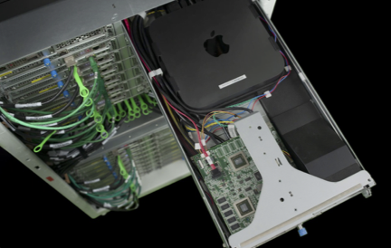
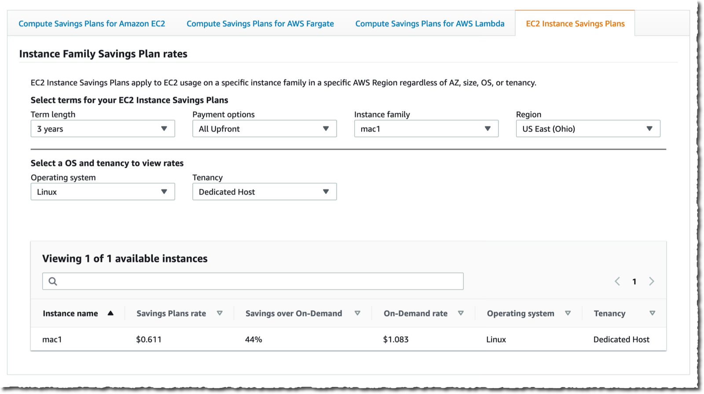
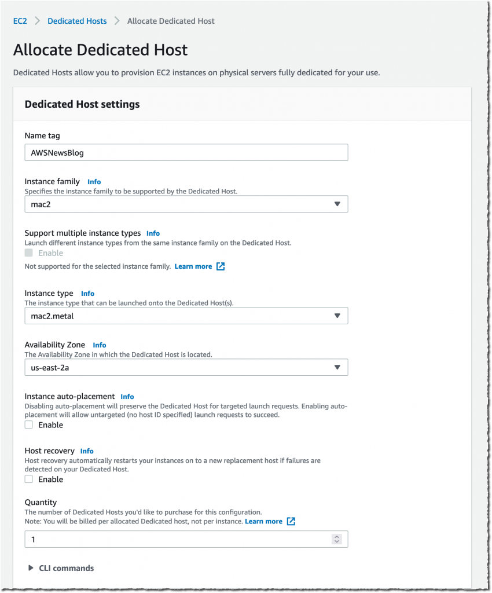
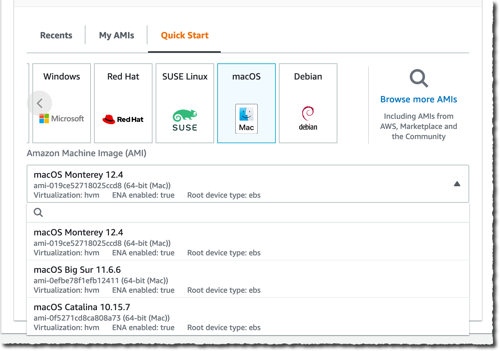
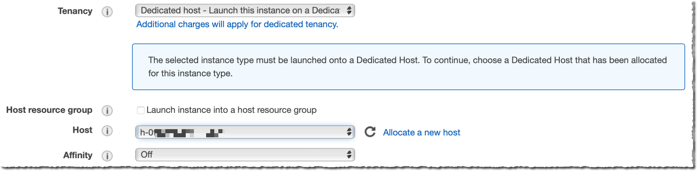
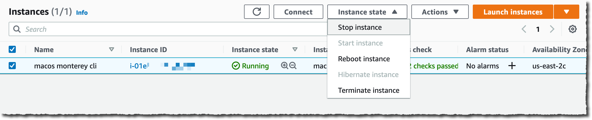

When developing applications for Apple systems (iPhone, iPad, Watch, TV, or Vision Pro), you are required to use a macOS machine at some point of your development workflow. Either to provide remote developers or temporary contractors a managed and secured desktop machine, or to automate your build, test, sign, and release pipelines (also known as continuous integration and continuous deployment or CI/CD ). [You can get a high level overview of a macOS-based CI/CD system by reading my first article from this series](/posts/cicd-for-ios-app). 

Getting access to a macOS-based machine might take time because of additional procurement, installation, and configuration processes. To make it easier, you can choose to start a macOS-based machine on [Amazon EC2](https://aws.amazon.com/ec2/getting-started/?sc_channel=el&sc_campaign=tutorial&sc_geo=mult&sc_country=mult&sc_outcome=acq&sc_content=01-start-an-ec2-mac-instance).

This series of tutorials takes you through the typical tasks required to start, connect, or configure macOS-based machines in the AWS cloud. Each tutorial is independent, you don't have to follow them all in sequence. Just pick and read the ones that cover the tasks you want to do.

For this series of tutorial, we assume you're somewhat familiar with Amazon EC2. You can quickly jump in by reading [this short tutorial](https://docs.aws.amazon.com/AWSEC2/latest/UserGuide/EC2_GetStarted.html?sc_channel=el&sc_campaign=tutorial&sc_geo=mult&sc_country=mult&sc_outcome=acq&sc_content=01-start-an-ec2-mac-instance). We will rather focus on the aspects that are specific to Mac on EC2.

This is part 2 in an eleven article series about EC2 Mac instances and advanced CLI usage on macOS, including command-line build, test, sign, archive and deploy.

- This is the first part, where you will learn how to allocate a Mac mini host and start it.

- In [part 2](/tutorials/ec2-mac/02-connect-to-an-ec2-mac-instance/), you will learn how to remotely connect to the EC2 Mac instance you just started.

- other parts will be added over time. **TODO : should I add the 11 parts now, or add them one by one as I publish them?**

Enjoy the reading !


| Attributes             |                                                                 |
|------------------------|-----------------------------------------------------------------|
| ✅ AWS experience      | 100 - Beginner                                                   |
| ⏱ Time to complete     | 10 minutes                                                      |
| 💰 Cost to complete    | $22 for 24 hours                                                 |
| 🧩 Prerequisites       | An [AWS Account](https://aws.amazon.com/resources/create-account)|
| 💻 Code Sample         | - none -                              |
| 📢 Feedback            | <a href="https://pulse.buildon.aws/survey/DEM0H5VW" target="_blank">Any feedback, issues, or just a</a> 👍 / 👎 ?    |
| ⏰ Last Updated        | 2023-06-12                                                      |

| ToC |
|-----|


## Why should you use a macOS machine in the cloud?

The introduction of EC2 Mac instances brings to all Apple developers the flexibility, scalability and security of AWS. Now it is possible to have one or multiple development machines running in the cloud, running different macOS or Xcode versions. It gives you the flexibility you need to build and test your iOS, macOS, watchOS, tvOS, ipadOS applications without having to manage a local fleet of machines. The AWS cloud APIs gives you the possibility to image, snapshot, start, stop machines in an automated way, bringing the same level of flexibility and automation you have today for your Linux-based or Windows-based development pipelines.



EC2 Mac instances are Mac mini computers that we racked in our data centers, and connected to the rest of the AWS infrastructure. We use the Mac [Thunderbolt](https://en.wikipedia.org/wiki/Thunderbolt_(interface)) port to connect the machine to [AWS Nitro](https://aws.amazon.com/ec2/nitro/?sc_channel=el&sc_campaign=tutorial&sc_geo=mult&sc_country=mult&sc_outcome=acq&sc_content=01-start-an-ec2-mac-instance). Nitro is the virtualisation system built by AWS, it allows to access [the VPC network](https://aws.amazon.com/vpc/getting-started/?sc_channel=el&sc_campaign=tutorial&sc_geo=mult&sc_country=mult&sc_outcome=acq&sc_content=01-start-an-ec2-mac-instance), [the EBS volumes](https://aws.amazon.com/ebs/getting-started/?sc_channel=el&sc_campaign=tutorial&sc_geo=mult&sc_country=mult&sc_outcome=acq&sc_content=01-start-an-ec2-mac-instance), and other functions. 

There is no virtualisation involved when running an EC2 Mac instance, you have the full Mac mini for you and macOS runs on bare metal. This design decision helps you to comply with Apple macOS license that restricts sharing virtualized macOS environments (you might run macOS in a virtual machine on your EC2 instance, but that's a different story). This design decision has two important consequences for you.

First, in terms of workflow, there is an additional step at the beginning, and one at the end: you must reserve and release an EC2 dedicated host. A dedicated host is a physical Mac mini that will be allocated to your AWS account until you release it. The machine is exclusively used by you.

Second, the billing depends on dedicated host allocation, not when an EC2 instance runs or not. In other words, you pay for the time the physical host is reserved for your usage, independently of the fact the OS is running on not. Just like usual, the on-demand billing is accrued by the second. The allocation period is for 24h minimum, as per Apple macOS license. It means when you allocate a host, you can not release it before 24h. After that initial period, you may release the host whenever you want. Check [the dedicated host EC2 pricing page](https://aws.amazon.com/ec2/dedicated-hosts/pricing/?sc_channel=el&sc_campaign=tutorial&sc_geo=mult&sc_country=mult&sc_outcome=acq&sc_content=01-start-an-ec2-mac-instance) for the details. If you know you're going to spend a minimum amount per month on EC2, [Saving Plans](https://aws.amazon.com/savingsplans/compute-pricing/?sc_channel=el&sc_campaign=tutorial&sc_geo=mult&sc_country=mult&sc_outcome=acq&sc_content=01-start-an-ec2-mac-instance) allows you to save up to 44% of the on-demand price.

To check our [Savings Plans](https://aws.amazon.com/savingsplans/?sc_channel=el&sc_campaign=tutorial&sc_geo=mult&sc_country=mult&sc_outcome=acq&sc_content=01-start-an-ec2-mac-instance) pricing and options, go to [Saving Plans Compute Pricing page](https://aws.amazon.com/savingsplans/compute-pricing/), then select **EC2 Instance Savings Plans** tab. You can then choose the length of your plan (**one year or three years**), the payment option (**all upfront, partial upfront, or nothing upfront**), one the **`mac`** instances family, and the AWS Region. Note that, at this time, **OS** must be `linux` and **Tenancy** must be **Dedicated Host**.



### Acquire a dedicated host

When you want to use an EC2 Mac instance for your development workflow, the first step is to reserve a host for your own usage. You can use the [AWS Console](https://eu-central-1.console.aws.amazon.com) or the [command line interface](https://docs.aws.amazon.com/cli/latest/userguide/getting-started-install.html?sc_channel=el&sc_campaign=tutorial&sc_geo=mult&sc_country=mult&sc_outcome=acq&sc_content=01-start-an-ec2-mac-instance) to do so. The **Dedicated Hosts** section is available in the EC2 console.



Notice you have the choice between x86 based Mac Mini (`mac1.metal`) and Apple silicon Mac Mini, featuring M1 SoC with 8 CPU cores, 8 GPU cores, 16 GiB of memory, and a 16 core Apple Neural Engine (`mac2.metal`)

Alternatively, we may use the AWS CLI, as following:

```zsh
aws ec2 allocate-hosts                   \
     --instance-type mac2.metal          \
     --availability-zone us-east-2b      \
     --quantity 1 

{
    "HostIds": [
        "h-0fxxxxxxx90"
    ]
}
```

Keep note of the returned `HostIds` as you will need it to start the EC2 instance on that host. Remember that the billing, and the 24h minimum period of lease time, start at this moment.

## Amazon EC2 Mac instances

Once the host is allocated to your account, you can start or stop the operating system on it. At this point, all the things you know and love from EC2 are also available on macOS. Here is the list of my five favorites features.

- We can create [EBS snapshots](https://docs.aws.amazon.com/AWSEC2/latest/UserGuide/EBSSnapshots.html?sc_channel=el&sc_campaign=tutorial&sc_geo=mult&sc_country=mult&sc_outcome=acq&sc_content=01-start-an-ec2-mac-instance) of my volumes and create [Amazon Machine Image](https://docs.aws.amazon.com/AWSEC2/latest/UserGuide/EBSSnapshots.html) from these. It means we can capture the state of our disk, snapshot it, and create boot images to start other machines.  This is particularly useful if you need a common set of tools to be available on all instances and when the installation of these tools takes a long time, for example [Xcode](https://developer.apple.com/xcode/).

- Our EC2 Mac instances are protected from unwanted network access by [VPC Security Groups](https://docs.aws.amazon.com/vpc/latest/userguide/VPC_SecurityGroups.html?sc_channel=el&sc_campaign=tutorial&sc_geo=mult&sc_country=mult&sc_outcome=acq&sc_content=01-start-an-ec2-mac-instance). It means we can control what incoming connection is authorised, on which ports and from what IP addresses.

- Speaking of networking, we can access other AWS services from macOS, using the same VPC routing mechanisms defined at network-level ([NAT Gateways](https://docs.aws.amazon.com/vpc/latest/userguide/vpc-nat-gateway.html?sc_channel=el&sc_campaign=tutorial&sc_geo=mult&sc_country=mult&sc_outcome=acq&sc_content=01-start-an-ec2-mac-instance), [PrivateLink](https://docs.aws.amazon.com/vpc/latest/privatelink/what-is-privatelink.html?sc_channel=el&sc_campaign=tutorial&sc_geo=mult&sc_country=mult&sc_outcome=acq&sc_content=01-start-an-ec2-mac-instance), [Site-to-Site VPN](https://docs.aws.amazon.com/vpc/latest/privatelink/what-is-privatelink.html), [Direct Connect](https://aws.amazon.com/directconnect/getting-started?sc_channel=el&sc_campaign=tutorial&sc_geo=mult&sc_country=mult&sc_outcome=acq&sc_content=01-start-an-ec2-mac-instance), etc.)

- We can script (and therefore automate) the provisioning, de-provisioning of dedicated hosts, and the start and stop of instances. This opens the door to all sorts of automations you can implement to support your build and test pipelines.

- [AWS Systems Manager agent](https://docs.aws.amazon.com/systems-manager/latest/userguide/install-ssm-agent-macos.html?sc_channel=el&sc_campaign=tutorial&sc_geo=mult&sc_country=mult&sc_outcome=acq&sc_content=01-start-an-ec2-mac-instance) for macOS is preinstalled on EC2 Mac instances. It means we can remotely connect, create tunnels, or send commands to be executed on the host, without having to manage credentials, SSH keys, or network access.

### Start, Stop, or Terminate 

Now that we have a Mac Mini reserved for our own usage, we can start and stop it to run macOS. When starting any EC2 instance, AWS expects you to share a couple of details. The minimal list of parameters is:

- the instance type. It must be the same as the one of the dedicated host. At the time of this writing, we do support `mac1.metal` for x86 Mac mini and `mac2.metal` for Apple silicon Mac mini.

- an (optional) SSH keyname. SSH keys are required if you want to connect over SSH to your instance. You must create a keypair on your laptop, securely keep the private part of the key pair, and upload the public part to EC2.  [The documentation has step by step instructions to help you with this](https://docs.aws.amazon.com/AWSEC2/latest/UserGuide/create-key-pairs.html?sc_channel=el&sc_campaign=tutorial&sc_geo=mult&sc_country=mult&sc_outcome=acq&sc_content=01-start-an-ec2-mac-instance). The doc says `Linux`, but the steps are the same for macOS. The web console may also generates a key pair for you.

- the host identifier where you want to start the EC2 instance. This must be the `HostIds` parameter received from the `allocate-hosts` you ran earlier. You can only start one instance on a dedicated host.

- a Security Group Id. [Security Groups](https://docs.aws.amazon.com/AWSEC2/latest/UserGuide/ec2-security-groups.html?sc_channel=el&sc_campaign=tutorial&sc_geo=mult&sc_country=mult&sc_outcome=acq&sc_content=01-start-an-ec2-mac-instance) are network filters acting like shields around your instance. If you plan to connect to your instance, you must create a Security Group that authorises incoming TCP connections to port TCP 22 from your source IP address or range of addresses. The console guides you to do so. [Our documentation has you covered as well](https://docs.aws.amazon.com/AWSEC2/latest/UserGuide/ec2-security-groups.html?sc_channel=el&sc_campaign=tutorial&sc_geo=mult&sc_country=mult&sc_outcome=acq&sc_content=01-start-an-ec2-mac-instance).

- an Amazon Machine Image. This is a disk snapshot containing the operating system and some AWS-specific tools and agents already installed.  You can specify your own AMI if you have one (more about this in the part four of this blog series). AWS provides you with the three last major versions of macOS. It means that, at the time of this writing, you can start an EC2 Mac instance running macOS Monterey 12.4, macOS Big Sur 11.6.6, or macOS Catalina 10.15.7.



Once you have all these parameters, the procedure is no different from starting any EC2 instance type. We have to ensure we select a macOS AMI version that suits our requirements. Select the `mac2.metal` instance type, and select host **Tenancy** and the **Host** we just created.



Alternatively, we can use the command line:

```zsh
 aws ec2 run-instances                                         \
	    --instance-type mac2.metal                             \
        --key-name my_key                                      \
        --placement HostId=h-0fxxxxxxx90                       \
        --security-group-ids sg-01000000000000032              \
        --image-id AWS_OR_YOUR_AMI_ID
		
{
    "Groups": [],
    "Instances": [
        {
            "AmiLaunchIndex": 0,
            "ImageId": "ami-01xxxxbd",
            "InstanceId": "i-08xxxxx5c",
            "InstanceType": "mac2.metal",
            "KeyName": "my_key",
            "LaunchTime": "2021-11-08T16:47:39+00:00",
            "Monitoring": {
                "State": "disabled"
            },
... redacted for brevity ....
```
 
It will take a few minutes to start your instance, and it will be allocated a public IP address (when started in the default or a public VPC). And you will soon be able to SSH connect to it. More about this in [the second part of this blog series](../remotely-connect-a-mac-instance/index.md).

Similarly you can stop, reboot or terminate your instance. Reboot is pretty obvious, it tells the operating system to perform a shutdown and restart cycle. This is equivalent to selecting **Restart** from the  menu on your locale machine.

Stopping an EC2 instance is equivalent to the **Shutdown** menu option from the  menu on your local machine. It shuts down the operating system and the machine. You can restart it at a later stage.  Remember that this does not stop billing, as the billing is linked to the dedicated host allocation. Your disks (EBS volumes) are preserved.

Terminating an instance is very different. It is a permanent action. Once an instance is terminated, it can not be restarted. By default, its associated disks (EBS volumes) are deleted upon termination.

For security reasons, the underlying host is entirely scrubbed to erase any data from the local disk, the EFI [NVRAM](https://en.wikipedia.org/wiki/Non-volatile_random-access_memory), and [secured area of the memory](https://support.apple.com/guide/security/secure-enclave-sec59b0b31ff/web) when stopping or terminating an instance.

You can change the instance state by using the **Instance state** drop down menu in the console.



Alternatively, you may use the CLI.

```zsh
# to stop the instance
aws ec2 stop-instances --instance-id i-08xxxxx5c

# to reboot the instance
aws ec2 reboot-instances --instance-id i-08xxxxx5c

# to terminate the instance
aws ec2 terminate-instances --instance-id i-08xxxxx5c
```

### Release the dedicated host

Remember that the unit of billing is the time your dedicated host is allocated. It is not the time the instance is running. When you're done using the Mac mini, be sure to release the dedicated host from the AWS console or using the command line.

```zsh
aws ec2 release-hosts --host-ids h-0fxxxxxxx90
```

You can not release a host during the first 24h after allocating it, as per [macOS license agreement](https://www.apple.com/legal/sla/docs/macOSMonterey.pdf) (section 3.A.ii)

---

Congrats 🎉👏🥳 ! You launched your first EC2 Mac instance. [In the next tutorial of this series](/tutorials/ec2-mac/02-connect-to-an-ec2-mac-instance/), you're going to learn how to remotely connect to it.
