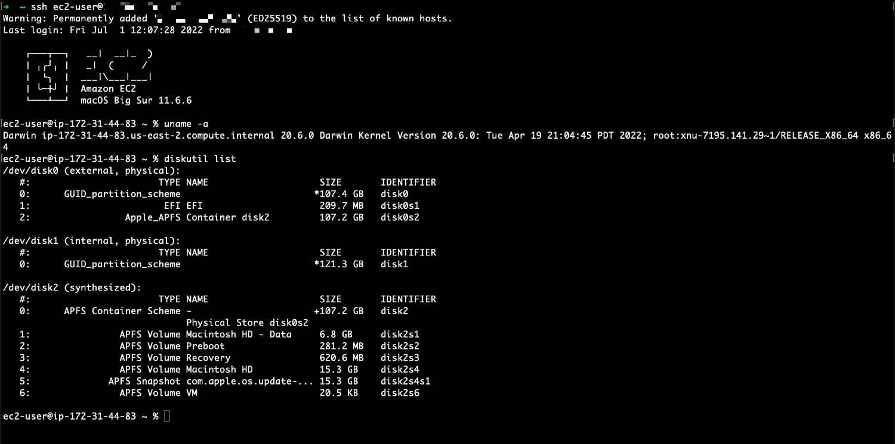
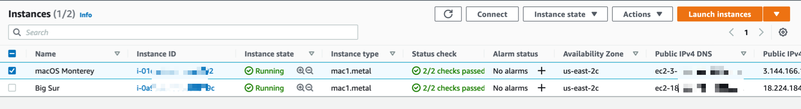
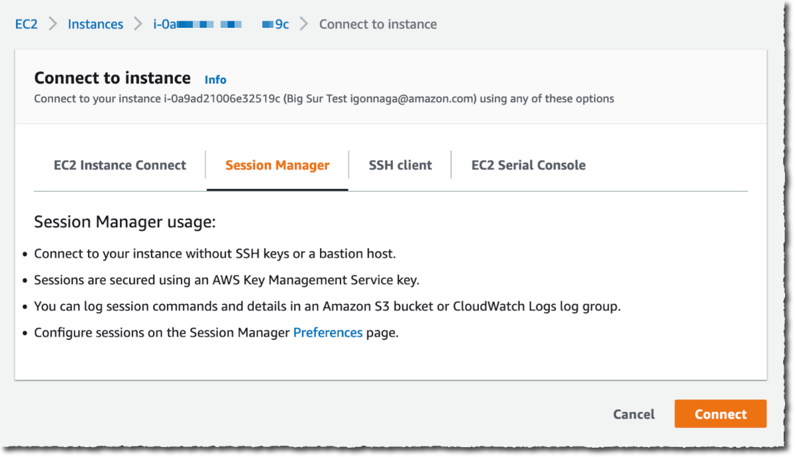
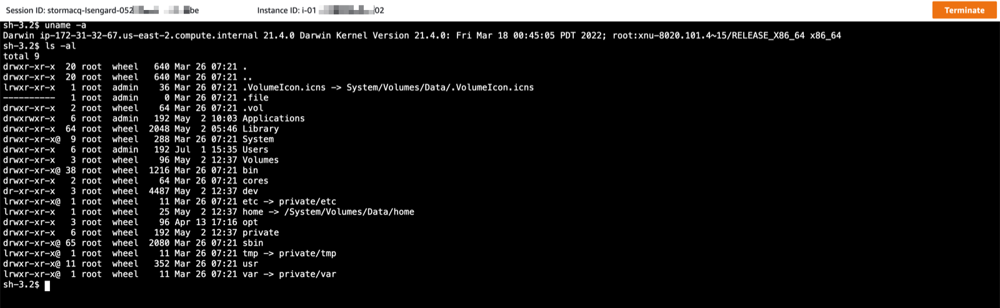
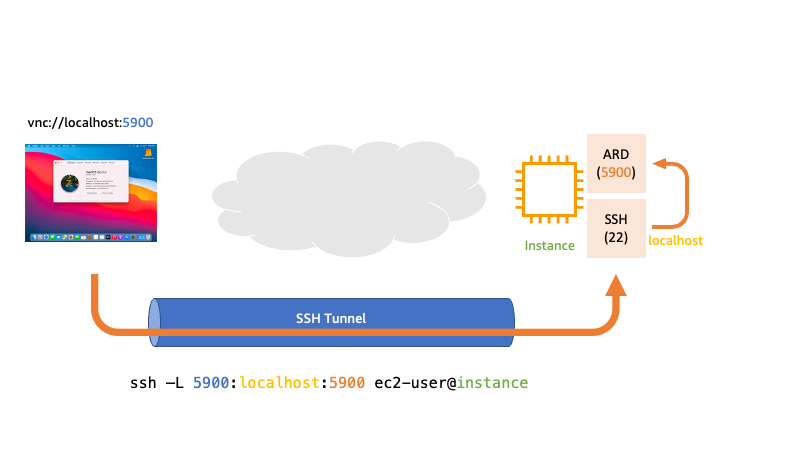
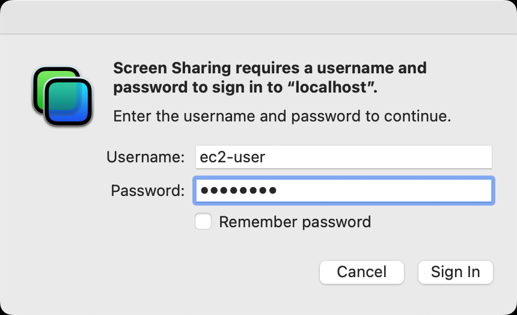
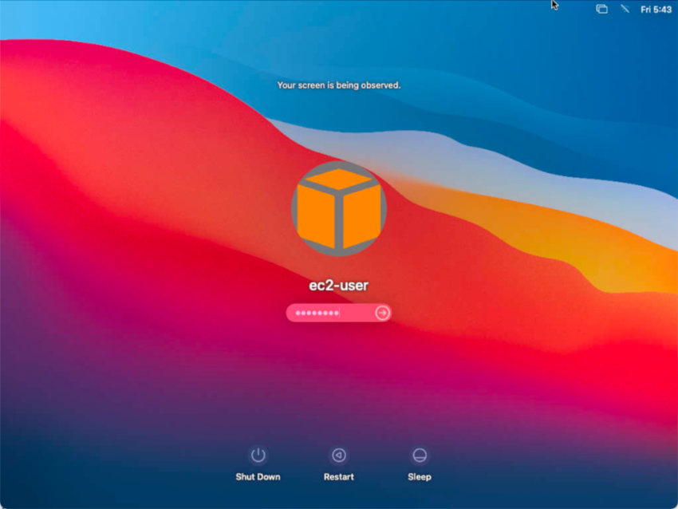
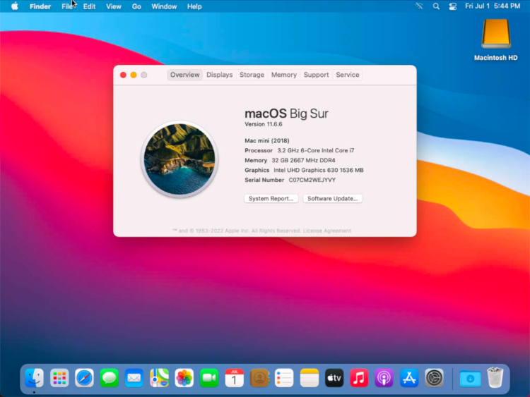

When developing applications for Apple systems (iPhone, iPad, Watch, TV, or Vision Pro), you are require to use a macOS machine at some point of your development workflow. Either to provide remote developers or temporary contractors a managed and secured desktop machine, or to automate your build, test, sign, and release pipelines (also known as continuous integration and continuous deployment or CI/CD ). [You can get a high level overview of a macOS-based CI/CD system by reading my first article from this series](/posts/cicd-for-ios-app). 

Getting access to a macOS-based machine might take time because of additional procurement, installation, and configuration processes. To make it easier, you can choose to start a macOS-based machine on [Amazon EC2](https://aws.amazon.com/ec2/getting-started/).

This series of tutorials takes you through the typical tasks required to start, connect, or configure macOS-based machines in the AWS cloud. Each tutorial is independent from each other, you don't have to follow them all in sequence. Just pick and read the ones that cover the tasks you want to do.

For this series of tutorial, we assume you're somewhat familiar with Amazon EC2. You can quickly jump in by reading [this short tutorial](https://docs.aws.amazon.com/AWSEC2/latest/UserGuide/EC2_GetStarted.html). We will rather focus on the aspects that are specific to Mac on EC2.

This is a 11 parts article about EC2 Mac instances and advanced CLI usage on macOS, including command-line build, test, sign, archive and deploy.

- When reading [part one](/tutorials/ec2-mac/01-start-an-ec2-mac-instance), you learn how to allocate a Mac mini to your AWS Account and start it.

- This is the second part, you learn how to remotely connect to the EC2 Mac instance you just started.

- When reading part 3, you will learn how to resize your boot volume to accommodate for more space before installing your development tools and libraries.

- other parts will be added over time. **TODO : should I add the 11 parts now, or add them one by one as I publish them?**

Enjoy the reading !

## Table of Contents

| Attributes             |                                                                 |
|------------------------|-----------------------------------------------------------------|
| ✅ AWS experience      | 100 - Beginner                                                   |
| ⏱ Time to complete     | 20 minutes                                                      |
| 💰 Cost to complete    | $22 for 24 hours                                                 |
| 🧩 Prerequisites       | An [AWS Account](https://aws.amazon.com/resources/create-account)|
| 💻 Code Sample         | - none -                              |
| 📢 Feedback            | <a href="https://pulse.buildon.aws/survey/TODO" target="_blank">Any feedback, issues, or just a</a> 👍 / 👎 ?    |
| ⏰ Last Updated        | 2023-06-12                                                      |

| ToC |
|-----|

## Remotely connect an EC2 Mac instance

After you launched an EC2 Mac instance, you most probably want to remotely connect to it to install your favorite tools, libraries and other dependencies to build and test the applications you're developing.

> Note that there are some cases where the instance is already configured at start (this article shows you how to configure an instance ready to use). In those cases, there is no need to remotely connect to your instance. It is perfectly possible to start and use a pre-configured EC2 Mac instance without ever connecting to it. But for this tutorial, we assume you started the EC2 Mac instance from one of [the AWS-provided Amazon Machine Image](https://docs.aws.amazon.com/AWSEC2/latest/UserGuide/ec2-mac-instances.html#ec2-macos-images) (AMI) and you have a clean macOS installation available.

There are at least three options to connect to your EC2 Mac instance without installing any additional tools or drivers on it: SSH, SSM, and ARD/VNC. Two of them are for command line connections (SSH and SSM). The last one is to start a full graphical use interface (ARD/VNC).

## CLI : connect with SSH

The most common option is to use [SSH](https://en.wikipedia.org/wiki/Secure_Shell). To establish an SSH connection to your EC2 Mac instance, there are three pre-requisites:

- at launch time, you have specified [the SSH keypair that will be used for user authentication](https://docs.aws.amazon.com/AWSEC2/latest/UserGuide/create-key-pairs.html). Note that this can only be done at launch time. If you forgot to do it launch, you may terminate your instance and start a new one, on the same dedicated host (it might take a while to scrub the machine when you terminate it, and before it becomes available again).

- the instance has been launched on a network (VPC) that has public network connectivity (a public subnet of the VPC), and your instance has a public IP address. These two parameters are the default values when launching an EC2 instance.

- at launch time, or afterwards, you have associated a [Security Group](https://docs.aws.amazon.com/vpc/latest/userguide/VPC_SecurityGroups.html) with your EC2 Mac instance. The security Group is configured to authorize inbound TCP 22 (SSH) traffic from your laptop IP address or your client network IP range.

Assuming these three pre-requisites are met, connecting to a macOS instance is no different than connecting a Linux server. The user name associated with your key pair is `ec2-user` and you have to use the `-i` option to refer to your private key, stored on your laptop.

Using the AWS Console, find the IP address of your EC2 instance. Alternatively, you may use the command line interface using this command (assuming you have only one `mac1.metal` instance running) - your IP address will be different than `1.0.0.0` used below:

```bash
aws ec2 describe-instances \
    --query "Reservations[].Instances[? InstanceType == 'mac1.metal'].NetworkInterfaces[][].Association.PublicIp"

[
    1.0.0.0
]
```

You will now use SSH with your secret key `pem` file with the `-i` option and use the default username AWS created for you on macOS: `ec2-user`. In this example, we connect to a Big Sur instance.

```bash
ssh -i ./path_to/my_private_key.pem ec2-user@1.0.0.0

Last login: Fri Jul  1 12:07:28 2022 from 52.95.4.11

    ┌───┬──┐   __|  __|_  )
    │ ╷╭╯╷ │   _|  (     /
    │  └╮  │  ___|\___|___|
    │ ╰─┼╯ │  Amazon EC2
    └───┴──┘  macOS Big Sur 11.6.6

ec2-user@ip-172-31-44-83 ~ %
```

Once you are connected, feel free to explore your instance. You will verify it is a regular macOS installation.



`ec2-user` is included in the `/etc/sudoers` file and you can elevate privileges to root with the `sudo` command, without a password.

## CLI : connect with AWS SSM

We chose to start with SSH because many of you are familiar with this tool. However, if you look at it through the prism of security and management, there are a couple of areas of improvements.

The first area of improvement is the networking. SSH requires your instance to live in a public subnet of your VPC, to have a public IP address and to have a Security Group rule allowing inbound TCP traffic on port 22. As EC2 Mac instances are mostly used for development use cases, such as continuous integration and continuous deployment pipelines, all these network constraints do not make sense. Most of you would like to keep these build, test, and deploy instances in private subnets, without public IP addresses attached to it, and without Security Group rules allowing inbound traffic.

The second area of improvement is in terms of access control. SSH authenticates users with a keypair. You have the private part of the keypair on your laptop and the public part is injected on macOS file system as part as the [EC2 macOS Init process](https://docs.aws.amazon.com/AWSEC2/latest/UserGuide/ec2-mac-instances.html#ec2-macos-init) (if you are curious, macOS Init fetches the public key from the instance meta-data service at [this address](http://169.254.169.254/latest/meta-data/public-keys/0/openssh-key/)). Good security practices mandate to securely store private keys and rotate keypair on a regular basis. How do you do that at scale on a fleet of EC2 instances?

To improve your security and management posture, there is another option to connect to your EC2 Mac instance: [AWS Systems Manager Session Manager](https://docs.aws.amazon.com/systems-manager/latest/userguide/session-manager.html) (SSM). AWS SSM is a versatile service that is able to initiate a shell connection to your instance, with the help of an agent running on the host macOS. The agent comes pre-installed on AMIs provided by AWS.

There are two advantages of connecting through SSM over SSH. First, there is no inbound network connection from your network. The SSM agent polls the SSM service, and the service takes care of forwarding information, such as keystrokes, to the instance. This means the EC2 Mac instance might have just a private IP address, sits in a private VPC, and no Security Group is required. Secondly, there is no need to use SSH keypairs to manage user authentication. You manage connection permissions from IAM, granting AWS users or roles permission to connect or not to your instance.

To be functional, the agent running on the instance must have permissions to call SSM APIs. To grant permissions, you create an IAM Role, add permissions to the role, and attach the role to the EC2 instance. You can do so in the [IAM Console](https://us-east-1.console.aws.amazon.com/iamv2/home) or using the CLI.

In this tutorial, I show you the steps using the CLI. One of the CLI command requires the instance Id of your EC2 Mac instance. It searches the instance based on it's name. I assume our instance is named "macOS Monterey". Please adapt it to your configuration.

First create a role that can be attached (trusted) by any EC2 instances:

```bash
# First create the trust policy file 
cat << EOF > ec2-role-trust-policy.json
{
  "Version": "2012-10-17",
  "Statement": [
    {
      "Effect": "Allow",
      "Principal": { "Service": "ec2.amazonaws.com"},
      "Action": "sts:AssumeRole"
    }
  ]
}
EOF

# Second, create role
aws iam create-role \
    --role-name ssmAccess \
    --assume-role-policy-document file://ec2-role-trust-policy.json

# Output
{
    "Role": {
        "Path": "/",
        "RoleName": "ssmAccess",
        "RoleId": "AROAXCTVZHOCU72YCLAQT",
        "Arn": "arn:aws:iam::123456789012:role/ssmAccess",
        "CreateDate": "2022-07-01T15:52:13+00:00",
        "AssumeRolePolicyDocument": {
            "Version": "2012-10-17",
            "Statement": [
                {
                    "Effect": "Allow",
                    "Principal": {
                        "Service": "ec2.amazonaws.com"
                    },
                    "Action": "sts:AssumeRole"
                }
            ]
        }
    }
}
```

Once the role is created, we need to attach permissions to it. Instead of defining the permissions by myself, I will reuse an AWS-managed policy that contains all the permissions required by SSM. The name of the AWS managed policy is `arn:aws:iam::aws:policy/AmazonSSMManagedInstanceCore`.

```bash
 aws iam attach-role-policy \
     --policy-arn arn:aws:iam::aws:policy/AmazonSSMManagedInstanceCore \
     --role-name ssmAccess-Profile
```

The last three steps create an EC2 instance profile, attach the role to the profile, and attach the profile to my instance.

```bash
# Create an instance profile 
aws iam create-instance-profile \
     --instance-profile-name ssmAccess-Profile

# Output
{
    "InstanceProfile": {
        "Path": "/",
        "InstanceProfileName": "ssmAccess-Profile",
        "InstanceProfileId": "AIPAXCTVZHOC4QNUPTLZT",
        "Arn": "arn:aws:iam::123456789012:instance-profile/ssmAccess-Profile",
        "CreateDate": "2022-07-01T16:02:52+00:00",
        "Roles": []
    }
}

# Attach the role to the profile
aws iam add-role-to-instance-profile \
    --instance-profile-name ssmAccess-Profile \
    --role-name ssmAccess     

# Search for my EC2 Mac Instance Id, search by name=macOS Monterey
INSTANCE_ID=$(aws ec2 describe-instances \
               --filter "Name=tag:Name,Values=macOS Monterey" \
               --query "Reservations[].Instances[?State.Name == 'running'].InstanceId[]" \
               --output text)

# Associate the profile to the instance 
aws ec2 associate-iam-instance-profile \
    --instance-id $INSTANCE_ID \
    --iam-instance-profile Name=" ssmAccess-Profile"

# Output
{
    "IamInstanceProfileAssociation": {
        "AssociationId": "iip-assoc-07d308386ff04f72d",
        "InstanceId": "i-01e833b396e0cbf02",
        "IamInstanceProfile": {
            "Arn": "arn:aws:iam::123456789012:instance-profile/ssmAccess-Profile",
            "Id": "AIPAXCTVZHOC4QNUPTLZT"
        },
        "State": "associating"
    }
}
```

This is a bit long, but this is a one time operation. Now you can reuse the role and attach to instances at launch time or at any moment after launch. Once the role is attached to the instance, all processes running on macOS, including the SSM agent, are authorized to call SSM API, which is required to establish a connection to your instance.

Ok, now that the initial setup is done, let's connect to the instance. You can do so using the AWS Console or the CLI.

Using the AWS Console, navigate to EC2 section, select the instance you want to connect to. Then select the **Connect** button.



On the next screen we will verify the instance meets the pre-requisites and select **Connect** again.



When the instance has correct permission, and if you followed the above instructions, it should have, a black screen opens in your browser. It is a browser based shell connection to your instance.



Alternatively, you may use the command line to connect using SSM.

There is a one-time installation required however. [Install the SSM plugin for the AWS CLI](https://docs.aws.amazon.com/systems-manager/latest/userguide/session-manager-working-with-install-plugin.html#install-plugin-macos).

```bash
# Search for my EC2 Mac Instance Id, search by name=macOS Monterey
INSTANCE_ID=$(aws ec2 describe-instances                                                 \
               --filter "Name=tag:Name,Values=macOS Monterey"                            \
               --query "Reservations[].Instances[?State.Name == 'running'].InstanceId[]" \
               --output text)

aws ssm start-session --target $INSTANCE_ID         

Starting session with SessionId: sst-0a9c1047a20fdbd7c

sh-3.2$ uname -a
Darwin ip-172-31-32-67.us-east-2.compute.internal 21.4.0 Darwin Kernel Version 21.4.0: Fri Mar 18 00:45:05 PDT 2022; root:xnu-8020.101.4~15/RELEASE_X86_64 x86_64

sh-3.2$ diskutil list
/dev/disk0 (internal, physical):
   #:                       TYPE NAME                    SIZE       IDENTIFIER
   0:      GUID_partition_scheme                        *121.3 GB   disk0

/dev/disk1 (external, physical):
   #:                       TYPE NAME                    SIZE       IDENTIFIER
   0:      GUID_partition_scheme                        *214.7 GB   disk1
   1:                        EFI EFI                     209.7 MB   disk1s1
   2:                 Apple_APFS Container disk2         214.5 GB   disk1s2

/dev/disk2 (synthesized):
   #:                       TYPE NAME                    SIZE       IDENTIFIER
   0:      APFS Container Scheme -                      +214.5 GB   disk2
                                 Physical Store disk1s2
   1:                APFS Volume Macintosh HD - Data     48.3 GB    disk2s1
   2:                APFS Volume Preboot                 267.0 MB   disk2s2
   3:                APFS Volume Recovery                1.1 GB     disk2s3
   4:                APFS Volume Macintosh HD            15.2 GB    disk2s4
   5:              APFS Snapshot com.apple.os.update-... 15.2 GB    disk2s4s1
   6:                APFS Volume VM                      20.5 KB    disk2s6

sh-3.2$ id
uid=502(ssm-user) gid=20(staff) groups=20(staff),12(everyone),61(localaccounts),701(com.apple.sharepoint.group.1),100(_lpoperator)

exit
```

When using SSM, you are authenticated as `ssm-user` (and not `ec2-user` as with SSH). Both users are included in the `/etc/sudoers` file and you can elevate privileges to root with the `sudo` command, without using a password.

To avoid having to remember two different commands, some advanced users configure their local `ssh` to use `aws ssm start-session` command as proxy command when SSH'ing to your hosts. If you're interested, or just curious, [check out this documentation](https://docs.aws.amazon.com/systems-manager/latest/userguide/session-manager-getting-started-enable-ssh-connections.html).

## GUI : connect with Apple Remote Desktop

When discovering a new environment, or when you want to install a set of tools on a new instance, or simply to use the graphical user interface you know and love from macOS, you might want to connect to your EC2 Mac instance using the traditional macOS GUI.

The good news is that all the required tools are provided by macOS, no installation is necessary. However, the server side Screen Sharing capability is disabled by default and must be enabled before to attempt to connect. Usually, you use the **System Preferences** application and the **Sharing** tab to do so, but here we just have a CLI. Let's see how to enable screen sharing with the CLI.

The first step is to connect to your instance using either SSH or SSM as described before.

Once connected, let's enable Apple Remote Desktop (ARD). This is a two steps process. First set a password for the` ec2-user`, then start the Apple Remote Desktop server component.

```bash
# NB: These commands are when using SSH to connect, when connected with SSM, switch to ec2-user first with 'su -c ec2-user'

# set a password to ec2-user
sudo passwd ec2-user

# enable ARD 
sudo /System/Library/CoreServices/RemoteManagement/ARDAgent.app/Contents/Resources/kickstart \
-activate -configure -access -on \
-restart -agent -privs -all

Starting...
Warning: macos 10.14 and later only allows control if Screen Sharing is enabled through System Preferences.
Activated Remote Management.
Stopped ARD Agent.
ec2-user: Set user remote control privileges.
ec2-user: Set user remote access.
ssm-user: Set user remote control privileges.
ssm-user: Set user remote access.
Done.
```

We do not recommend to connect to Apple Remote Desktop (ARD) over the public network. This involves using the public IP address of the instance, and adding a rule to the instance security group to allow inbound traffic on port TCP 5900 (the default for ARD). ARD user authentication is password-based.

Instead, we recommend creating an encrypted tunnel between your client and the EC2 Mac instance. Tunnels are encrypted, and they are not using a username and password to authenticate users.

You can create tunnels either using SSH or SSM. We wil start with SSH, and will show the SSM alternative towards the end of this blog post.

### SSH Tunnels to connect to Apple Remote Desktop

 When you create a SSH tunnel, the SSH client on your machine becomes a server and starts to accept incoming connections on localhost. Every data received on this connection is encrypted, and optionally compressed, before being sent to the remote server: your EC2 Mac instance. The SSH server on macOS decrypts and decompresses the data, then send it over the network to the destination you specified on the client. In this case it forwards the traffic to the Apple Remote Desktop Server running on the instance (`localhost:5900`).

[You can learn more about SSH tunnels on this site](https://www.ssh.com/academy/ssh/tunneling/example). The whole process is illustrated below:



To start an SSH tunnel, collect your instance public IP address as described before. Then, use the following command:

```bash
# We assume the EC2 Mac instance public IP address is 1.0.0.0
ssh -C -N -L 5900:localhost:5900 -i /path/my-key-pair.pem ec2-user@1.0.0.0
```

Let's explain the options used:

- `-i`, allows to specify the private part of the keypair used for authentication 

- `-L` is the SSH tunneling option. It tells the SSH client on your machine to start to listen to incoming connections on TCP port 5900 (`5900:`), and to forward all traffic received to the destination host (`1.0.0.0`). Once on the destination host, to send the traffic to `localhost:5900` which is the address of the ARD server.

- `-C` tells SSH to compress the traffic in the tunnel

- `-N` tells SSH to not start an interactive session on the client. The command blocks until you interrupt it with `Ctrl-C`

Once the tunnel is created, open another tab in your Terminal application and open the ARD client as usual. Just point it to `localhost`. The SSH tunnel will act as a server and forward all the traffic to the actual ARD server running on your EC2 Mac instance on the other side of the tunnel.

```bash
open vnc://localhost 
```

> Note that the URI starts with `vnc://` because Apple Remote Desktop client is based on [Virtual Network Computing](https://en.wikipedia.org/wiki/Virtual_Network_Computing) (VNC) protocol.

The ARD authentication screen appears. Type the username (`ec2-user`) and the password you choose when you enabled ARD.



When the VNC authentication succeeds, you are presented with the standard macOS login screen. Enter your credentials again.



And after a few seconds, you should see the familiar macOS desktop.



### Change the resolution of the EC2 Mac instance screen 

Once connected, you most probably want to increase the screen resolution. 

To do so, you use `displayplacer`, [the open source command line tool developed by Jake Hilborn](https://github.com/jakehilborn/displayplacer).

Using your SSH session, or the Terminal application in the GUI session, install the tool, list the display and resolutions available, and select the one you want.

```bash
# install the displaylist command line tool
brew tap jakehilborn/jakehilborn && brew install displayplacer

# then list available resolutions 
displayplacer list

Persistent screen id: 69784AF1-CD7D-B79B-E5D4-60D937407F68
Contextual screen id: 1020887298
Type: 24 inch external screen
Resolution: 1024x768
Hertz: 60
Color Depth: 8
Scaling:off
Origin: (0,0) - main display
Rotation: 0
Resolutions for rotation 0:
  mode 0: res:1024x768 hz:60 color_depth:4
  mode 1: res:1024x768 hz:60 color_depth:8 <-- current mode
  mode 2: res:640x480 hz:60 color_depth:4
  mode 3: res:640x480 hz:60 color_depth:8
  mode 4: res:720x480 hz:60 color_depth:4
  mode 5: res:720x480 hz:60 color_depth:8
  mode 6: res:640x480 hz:60 color_depth:4
  mode 7: res:640x480 hz:60 color_depth:8
  mode 8: res:800x600 hz:60 color_depth:4
  mode 9: res:800x600 hz:60 color_depth:8
  mode 10: res:1280x720 hz:60 color_depth:4
  mode 11: res:1280x720 hz:60 color_depth:8
  mode 12: res:1440x900 hz:60 color_depth:4
  mode 13: res:1440x900 hz:60 color_depth:8
  mode 14: res:1680x1050 hz:60 color_depth:4
  mode 15: res:1680x1050 hz:60 color_depth:8
  mode 16: res:1920x1080 hz:60 color_depth:4
  mode 17: res:1920x1080 hz:60 color_depth:8
  mode 18: res:1920x1200 hz:60 color_depth:4
  mode 19: res:1920x1200 hz:60 color_depth:8
  mode 20: res:2560x1440 hz:60 color_depth:4
  mode 21: res:2560x1440 hz:60 color_depth:8
  mode 22: res:2560x1600 hz:60 color_depth:4
  mode 23: res:2560x1600 hz:60 color_depth:8
  mode 24: res:1024x576 hz:60 color_depth:4
  mode 25: res:1024x576 hz:60 color_depth:8

Execute the command below to set your screens to the current arrangement:

displayplacer "id:69784AF1-CD7D-B79B-E5D4-60D937407F68 res:1024x768 hz:60 color_depth:8 scaling:off origin:(0,0) degree:0"

# Lastly, set the display resolution. We will choose 1440x900
displayplacer "id:69784AF1-CD7D-B79B-E5D4-60D937407F68 res:1440x900 origin:(0,0) degree:0"
```

The nice thing is that it is not necessary to restart your VNC client, it adjusts automatically. 

### SSM Tunnels to connect to Apple Remote Desktop

As explained earlier, SSH connections and tunnels require your instances to be publicly available on the Internet. It also requires you to manage the generation, secured storage, and rotation of keypairs.

For these reasons, you may chose to use AWS Systems Manager Session Manager (SSM) to connect to your instances. SSM also supports tunneling. 

Once the tunnel is started, all the rest: opening the client, connect to the server, and resize the display is similar between SSH and SSM tunnels.

Before starting an SSM tunnel for Apple Remote Desktop, be sure the EC2 Mac instance is attached to an IAM role that has permissions to use SSM APIs, as described earlier. 

To start the tunnel, use the following command:

```bash
# first, select the instance ID of the machine you want to connect
# the below command search for a machine named "macOS Monterey"
INSTANCE_ID=$(aws ec2 describe-instances                                                 \
               --filter "Name=tag:Name,Values=macOS Monterey"                            \
               --query "Reservations[].Instances[?State.Name == 'running'].InstanceId[]" \
               --output text)

# second, start the SSM tunnel
aws ssm start-session --target $INSTANCE_ID                           \
                       --document-name AWS-StartPortForwardingSession \
                       --parameters '{"portNumber":["5900"],"localPortNumber":["5900"]}'

Starting session with SessionId: sst-0f3b970f24182795d
Port 5900 opened for sessionId sst-0f3b970f24182795d.
Waiting for connections...              
```

Once the tunnel is opened, connect to the instance from your computer using the following command:

```bash 
open vnc://localhost 
```

All the remaining steps are similar as with SSH tunnels.

When done, close the tunnel by interrupting the `aws ssm` command with `Ctrl-C`.

## Conclusion

Congrats 🎉. You can now connect securely to your EC2 Mac instance, using either SSH, or SSM. Read part 3 where you will learn how to resize your boot volume to accommodate for more space before installing your development tools and libraries.
