Have you ever considered the connection between how securing your infrastructure and a cost effective infrastructure go hand in hand?  Most often, when we think about security our minds go to adversaries and risk, controls and inspection, compliance and auditing.  However, paying attention to your security posture and understanding what happens with network traffic, both desired and undesired, contributes to cost effective design in a cloud environment.

In this tutorial, we will focus on controlling egress traffic with the [Amazon Route53 DNS Resolver Firewall](https://aws.amazon.com/about-aws/whats-new/2021/03/introducing-amazon-route-53-resolver-dns-firewall/?sc_channel=el&sc_campaign=costwave&sc_content=egress-controls-1&sc_geo=mult&sc_country=mult&sc_outcome=acq).  Our first goal of this capability is to provide a secure environment, ensuring that only desired egress traffic is allowed.  Our secondary goal, and really a side-outcome of the capabilities we will enable, is that we will minimize our cloud costs for egress traffic.  

> For the purpose of this tutorial, egress traffic refers to traffic from our protected subnet within our Virtual Private Cloud (VPC), leaving the VPC, and being routed toward the internet.

In this tutorial, we will work with the Amazon Route53 DNS Resolver Firewall, Amazon EC2 Instances, and Amazon Virtual Private Clouds.

## What you will learn

- How to configure Custom Domain Lists in Amazon Route53 DNS Resolver Firewall and use that list in a filtering rule.
- How to use Managed Domain Lists in Amazon Route53 DNS Resolver Firewall
- How to enable logging to see what DNS queries are blocked as a result of the rules you have enabled.

## Prerequisites

Before starting this tutorial, you will need the following:

| Attributes                |                                   |
| ------------------- | -------------------------------------- |
| ✅ AWS Level        | Intermediate - 200                         |
| ⏱ Time to complete  | 30 minutes                             |
| 💰 Cost to complete | < $5 USD when cleanup is performed upon completion     |
| 🧩 Prerequisites    | - [AWS Account](https://aws.amazon.com/resources/create-account/?sc_channel=el&sc_campaign=costwave&sc_content=egress-controls-1&sc_geo=mult&sc_country=mult&sc_outcome=acq)|
| 💻 Code Sample         | Code sample used in tutorial on [GitHub](https://github.com/build-on-aws/testing-egress-controls-for-cloud-workloads)                             |
| 📢 Feedback            | <a href="https://pulse.buildon.aws/survey/DEM0H5VW" target="_blank">Any feedback, issues, or just a</a> 👍 / 👎 ?    |
| ⏰ Last Updated     | 2023-08-09                             |

| ToC |
|-----|

This is a 3-part series:

| SeriesToC |
|-----------|

## What is Amazon Route 53 resolver DNS Firewall?

With Amazon Route 53 Resolver DNS Firewall , you define domain name filtering rules in rule groups that you associate with your VPCs. You can specify lists of domain names to allow or block, and you can customize the responses for the DNS queries that you block.

A primary use of Route 53 Resolver DNS Firewall is to block communication with known malicious domains and/or only allow communication with trusted domains. This is one of the features we will be configuring in this tutorial.  Not only can DNS Firewall prevent the resolution of untrusted domains (and the IP addresses needed to communicate with them) but it can also help prevent DNS exfiltration of your data. DNS exfiltration can happen when there is unauthorized access that compromises resources in your VPC. DNS queries can then be used to send data or tunnel other network protocols out of the VPC to malicious DNS servers. With DNS Firewall, you can monitor and control the domains that your application workloads can query. You can deny access to the domains that AWS knows to be malicious and allow other queries to pass through. Alternately, you can build a DNS Allow-List model where you implement a default deny to all domains except for the ones that you explicitly trust.

## How DNS Firewall works with AWS Network Firewall

DNS Firewall and AWS Network Firewall both offer domain name filtering, but for different types of traffic. With DNS Firewall and AWS Network Firewall together, you can configure domain-based filtering for traffic over two different network egress paths.

DNS Firewall provides filtering for outbound DNS queries that pass through the Route 53 Resolver from within your VPCs. You can also configure DNS Firewall to send custom responses for queries to blocked domain names.

AWS Network Firewall provides filtering for all network traffic that is routed through firewall endpoints, but does not have visibility into queries made to the Route 53 Resolver.

In this tutorial we will focus on filtering the initial DNS request that AWS Network Firewall would not normally have visibility into.  To understand why this is important let's examine our sample architecture seen in the following image.

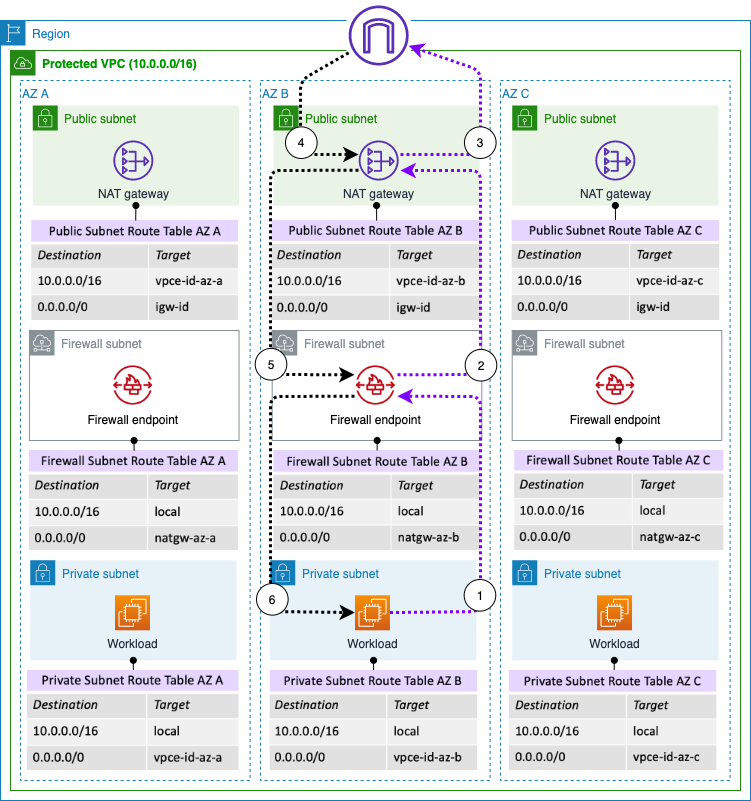

The above image is a simplified, single availability zone, distributed deployment architecture.  

### Understanding traffic flow

Traffic from protected workloads going to the Internet is routed via the default route (0.0.0.0/0) to a Network Firewall endpoint which in turn has a default route pointing to a NAT Gateway endpoint. You can see this highlighted in number 1 and 2.

The Public subnet where the NAT Gateway is located has a default route pointing to the Internet Gateway for the VPC, and it also has a specific route for return traffic to protected workloads pointing to the Network Firewall endpoint. This ensures the traffic is symmetric for full inspection. You can see this highlighted in number 3 and 4. With a NAT Gateway deployed in a dedicated public subnet, instances in private subnets can communicated with resources on the Internet.

This is the typical egress traffic flow when  AWS Network Firewall is deployed. However, what's not depicted in the above image is the traffic flow for DNS Queries within the VPC.  

In the image below, we can see what the traffic flow with DNS resolution looks like.  

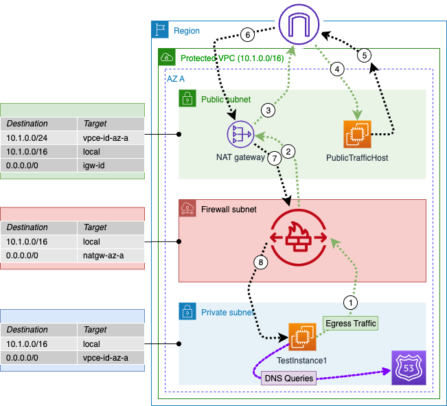

The Amazon Route 53 Resolver operates on the .2 address of each VPC subnet.  Therefore, when DNS queries are sent, they are not evaluated by DNS Firewall because the query does not leave the private subnet and traverse the firewall subnet.

### Cost efficient architecture

Considering a firewall architecture such as the one used in this tutorial, there are a few areas that lend themselves to a cost efficient architecture.

1. DNS traffic doesn't cross VPCs

DNS traffic does not cross VPCs and it doesn't need to traverse the internet.  By keeping the DNS local we wont incur additional cost for egress data.

2. DNS control makes sure that malicious connections are not made out of the VPC, thus reducing the compute and data costs.

A common technique for bad actors is to establish command and control connections from internal resources.  The compute resource can then be used to initiate DDoS attacks, mine crypto, and perform other nefarious acts.  By blocking dns requests to TLDs that are know to be malicious you essentially block this command and control channel from happening.  This keeps compute costs and data costs down.

1. Modify the current architecture to use a centralized inspection VPC.

While this is not specific to this tutorial, you can make a minor adjustment to the firewall configuration, and use a centralized inspection VPC rather than a distributed VPC. This will minimize the cost involved with having a firewall endpoint distributed across VPCs.

## Environment setup

This tutorial starts with a baseline configuration that's built with an AWS CloudFormation template that you can find in the sample code repo.  You will need to deploy this template in your own AWS environment before following along with the tutorial.

Once you have the CloudFormation Template deployed, we will check the baseline posture of the environment.  We are checking to see that certain traffic is allowed out of the environment.  Once verified we will configure the Amazon Route 53 resolve DNS firewall to block this undesired egress traffic and we will also enable logging.

> Note: Deploying this CloudFormation template in your environment will incur costs.  By using the template you assume all responsibility for these costs as well as the cleanup of the environment afterwards.  We will walk you through the process at the end of this tutorial, but it is your responsibility to ensure the environment is cleaned up.

Let's begin by connecting to our test EC2 server instance and running a script to test egress traffic.

#### Establishing a default egress baseline

1. Begin by navigating to CloudFormation in the AWS Console.

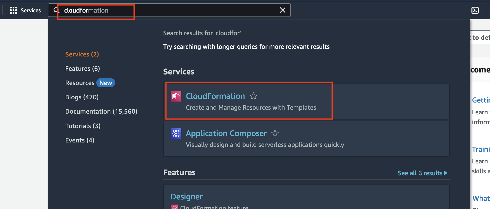

<<<<<<< HEAD
2. Click on the stack that has been created.

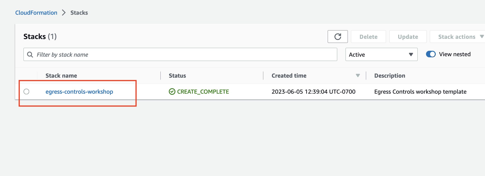

3. Click on `Outputs` and check the resources that are created.
4. Find the TestHostSession in the key column.  The URL link for TestHostSession opens an interactive shell on an EC2 instance (**TestInstance1** in the earlier diagram) within an AWS Network Firewall protected subnet which you will be using to send test traffic in this tutorial.
5. Click on the link to connect to it.  You may find it useful to open this in a separate tab so you can return here to use this and the other links as shortcuts.  There are also links to the AWS Network Firewall, Route 53 Resolver DNS Firewall, and Cloudwatch Logs services.

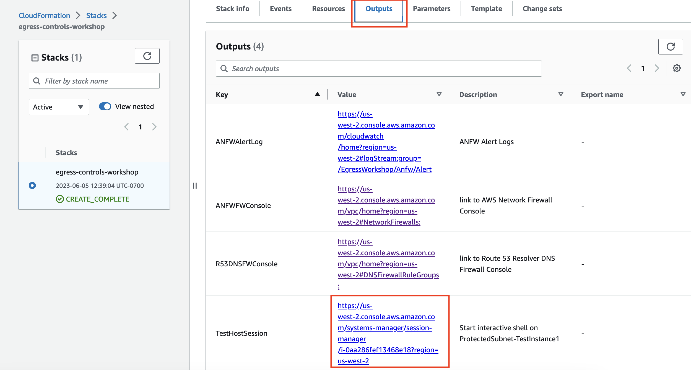
=======
2. Click on the "Create stack" option and add the stack from the tutorial repo called **Egress-Controls-Tutorial.yaml**.  
3.Name the stack and select an availability zone as seen below. Click next and finish the creation pages.


3. Once the stack is in a create complete state, navigate into the stack by clicking on the stack name.


>>>>>>> 809eb8d (redid the images)

4. Click on `Outputs` and check the resources that are created. 
5. Find the TestHostSession in the key column.  The URL link for TestHostSession opens an interactive shell on an EC2 instance (**TestInstance1** in the earlier diagram) within an AWS Network Firewall protected subnet which you will be using to send test traffic in this tutorial. 
6. Click on the link to connect to it.  You may find it useful to open this in a separate tab so you can return here to use this and the other links as shortcuts.  There are also links to the AWS Network Firewall, Route 53 Resolver DNS Firewall, and Cloudwatch Logs services.

<<<<<<< HEAD
Once you are connected to the command-line session on the EC2 instance, we will execute a command that runs a wrapper for an egress-check.sh script.   This script runs multiple egress tests involving DNS queries and network protocol tests shown in the image below. Note the IP address of `testhost.aws` (**PublicTrafficHost** in the topology diagram) which is another EC2 instance configured for this tutorial to receive and respond to our test traffic. We should also be able to ping this address, (`ping testhost.aws`) from the command-line and receive replies back.  All of the egress filtering tests should currently show as `ALLOWED`.  
=======

>>>>>>> 809eb8d (redid the images)

7. Change into the ssm-user home folder using the `cd ~/` command.
8. Clone the git repo into the ssm-user home directory using the `git clone` command.
9. cd into the `testing-egress-controls-for-cloud-workloads` directory.
10. Run the test-egress script using the command `sh test-egress.sh` command.  This should show that nothing is currently being blocked.

<<<<<<< HEAD
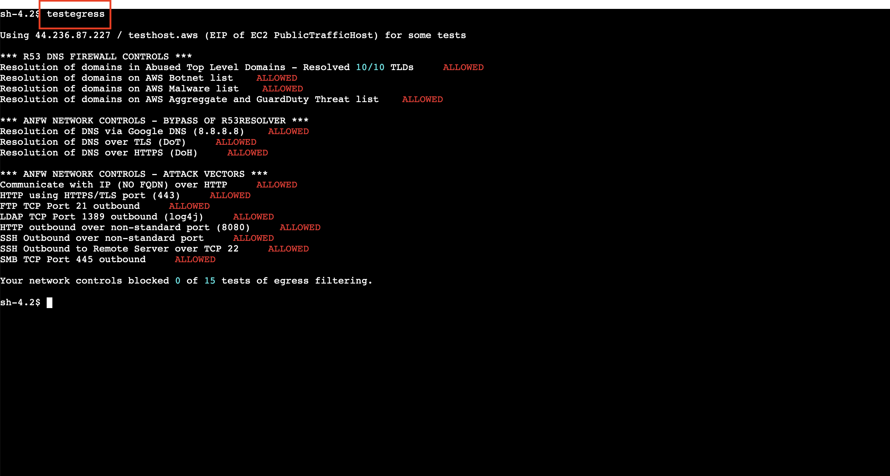
=======

>>>>>>> 809eb8d (redid the images)

> **Note:** in this tutorial we will only be using the checks in the **R53 DNS FIREWALL CONTROLS** section of the output. This testing script is used in for other tutorials and not all of the tests performed are addressed in this tutorial.

In the subsequent portions of this tutorial, we will configure the Amazon Route 53 Resolver DNS firewall to filter our DNS queries and Internet-bound traffic until these tests return a `BLOCKED` status.

Let's configure the Amazon Route 53 Resolver DNS Firewall.

## Configure the Amazon Route 53 Resolver DNS Firewall

In this section, we will use Amazon Route53 DNS Firewall to create a custom list of commonly abused top-level domains (TLDs) and set them to be blocked within our Egress VPC.

#### Step 1 - Create a DNS Firewall custom domain list

A domain list is a set of domain-matching specifications you can use in a Route 53 Resolver DNS firewall rule to ALLOW, BLOCK, or ALERT against matching domains.  Within a single rule group you can have many rules that each match against a different domain list.  You can create your own lists, and there are also AWS-managed lists which will be discussed in later sections of the lab. When you associate a rule group with a VPC, DNS firewall compares the DNS queries against the domain list in the rules and handles the DNS queries according the matching rule’s action.

In this step, we create a domain list that will specify the domain-matching patterns for top-level domains that will be blocked.

#### Create a domain list of commonly abused top-level domains (TLDs)

- Navigate to **VPC** → **DNS firewall** (remember there is a shortcut link labeled **R53DNSFWConsole** in the `Outputs` of the CloudFormation template) and click on **Domain lists**.

- Here you can see any custom lists created as well as AWS managed domain lists.

- Click on **Add domain list** shown in the image below.

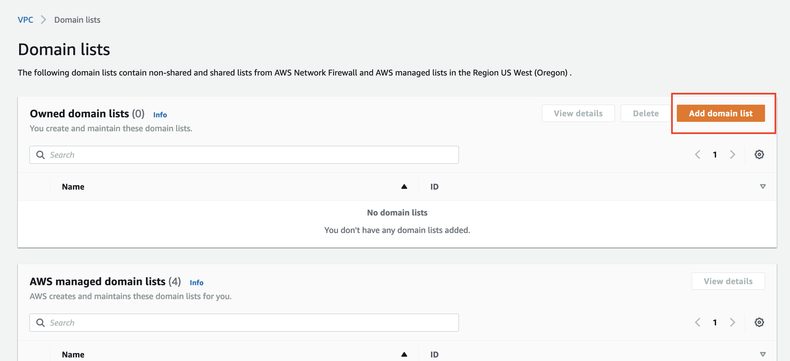

<<<<<<< HEAD
- Give the domain list a name of your choosing.
- Enter TLD-matching patterns from the image below(one-per-line) following the format shown (e.g.:code[*.ru]{showCopyAction=true}).
- The `*` acts as a wildcard to match all the subdomains within each of these TLDs
- We can always write exceptions later to our broad TLD-matching rules by creating an `ALLOW` rule to match any needed exceptions and giving it a higher priority than our `BLOCK` rule.
- We'll use this list to BLOCK ten commonly abused top-level domains in our VPC
=======
* Give the domain list a name of your choosing.
* Enter TLD-matching patterns from the image below(one-per-line) following the format shown (e.g.`[*.ru]`).
* The `*` acts as a wildcard to match all the subdomains within each of these TLDs
* We can always write exceptions later to our broad TLD-matching rules by creating an `ALLOW` rule to match any needed exceptions and giving it a higher priority than our `BLOCK` rule.
* We'll use this list to BLOCK ten commonly abused top-level domains in our VPC
>>>>>>> 809eb8d (redid the images)

```javascript
*.ru
*.cn
*.xyz
*.cyou
*.pw
*.ws
*.gq
*.surf
*.cf
*.ml
```

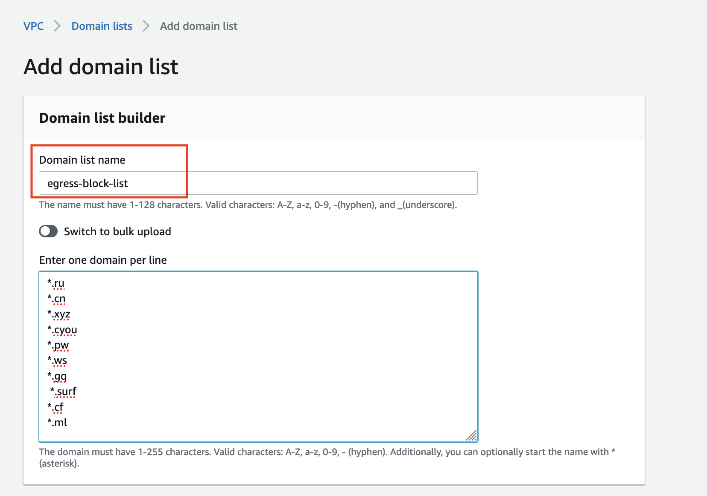

- After entering the domains, click on **Add domain list**.

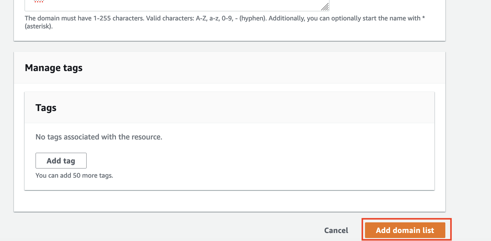

#### Step 2 - Create Rule groups

DNS Firewall rule groups are a set of rules that will allow, deny, or alert on DNS request that match the associated domain lists. In this step we are going to create a rule group and add the domain list just created.

- Navigate to **VPC** → **DNS firewall** → **Rule groups** and click on **Create rule group**.

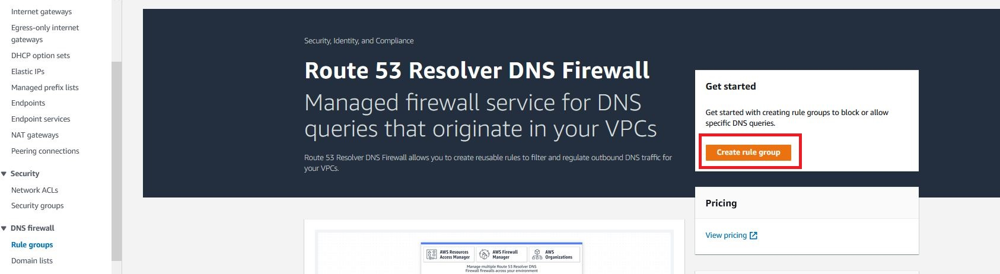

- Give a name to rule group and click next.

<<<<<<< HEAD
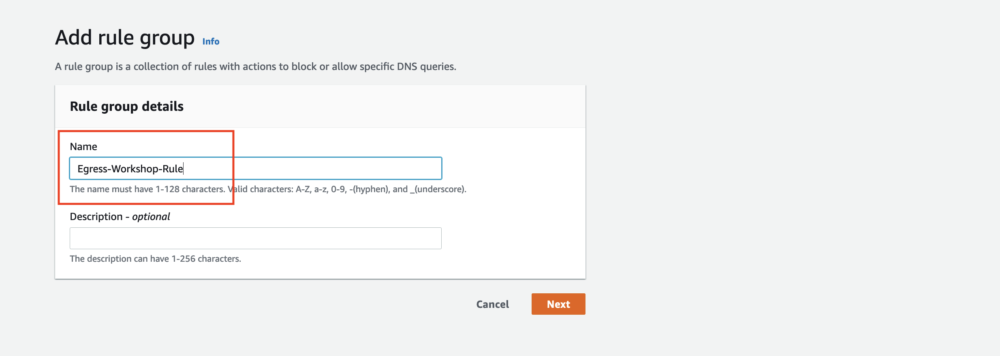
=======

>>>>>>> 809eb8d (redid the images)

- Click on Add rule to add the domain list you just created.

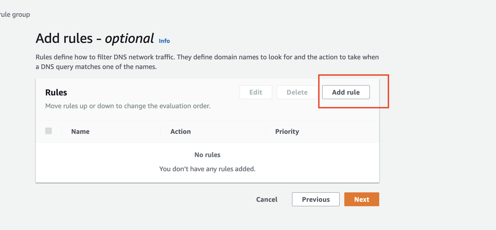

- Enter a name for the rule and select the previously created domain list from the drop down and select **BLOCK** for the action on matches.

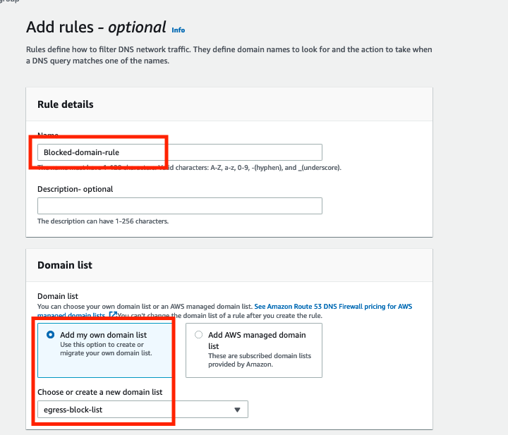

- Select **OVERRIDE** in the response for Block action and enter :code[dns-firewall-block]{showCopyAction=true} as the custom response and `CNAME` as record type.
- Having an override value in our response action makes it easier to say with certainty that a particular query was blocked by DNS Firewall as **NXDOMAIN** or **NODATA** responses could also indicate the absence of a queried record, rather than a BLOCK response from DNS Firewall.  The CNAME value can also be used to redirect a blocked request to a web page with details on why the domain resolution was blocked.
- Leave TTL as `0` and click on **Add rule** (DO NOT CLICK `Next` as it will skip adding the created rule).

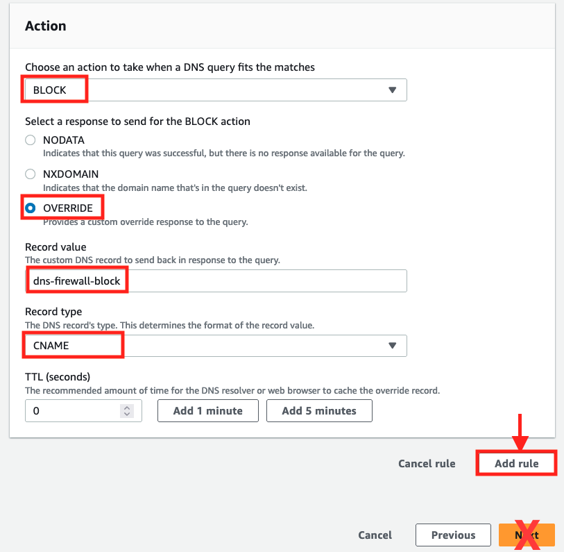

- You can set the priority for the rules in this page which controls the order in which rules are evaluated.  The first rule that matches a domain query will determine the action taken.  If we were creating `ALLOW` rule exceptions a `BLOCK` rule, we would use this screen to increase the priority for the `ALLOW` rule.
- Leave the default value and click **Next**.

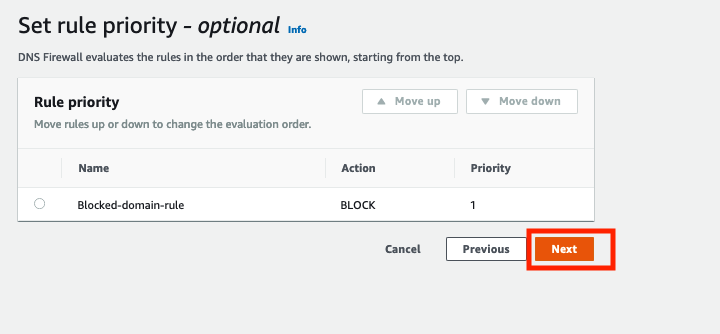

- Adding tags are optional. Leave blank and and click **Next**
- On the final **Review and create** screen click on **Create rule group**.

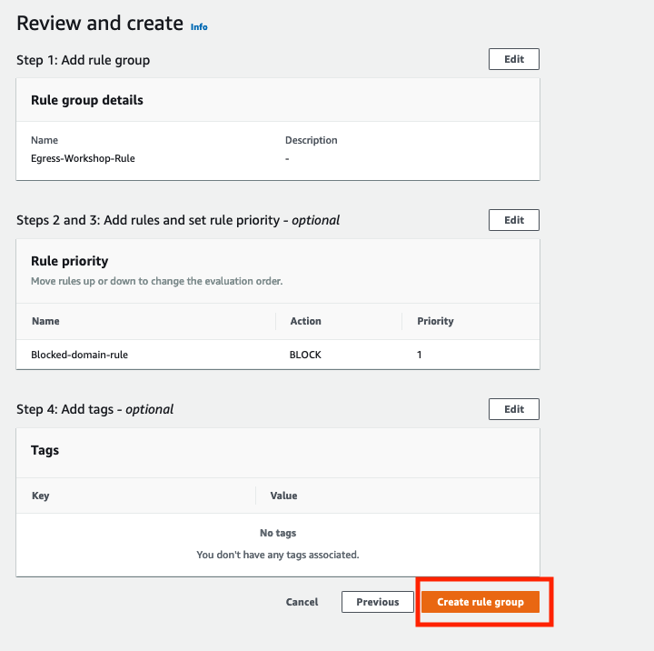

- You can now see the rule group created in the console. Note it is currently **Not Associated** to a VPC.

<<<<<<< HEAD
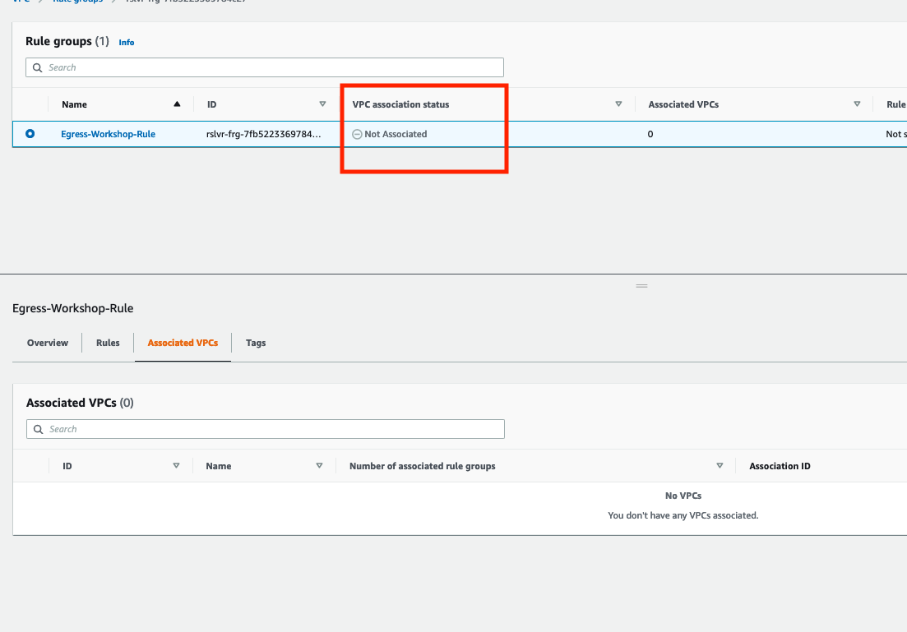
=======

>>>>>>> 809eb8d (redid the images)

#### Step 3 - Associate DNS Firewall Rule group to Egress VPC

- In this step, we will associate a VPC with the newly created Rule group. Click on Rule group and then on Associate VPC as shown below.

<<<<<<< HEAD
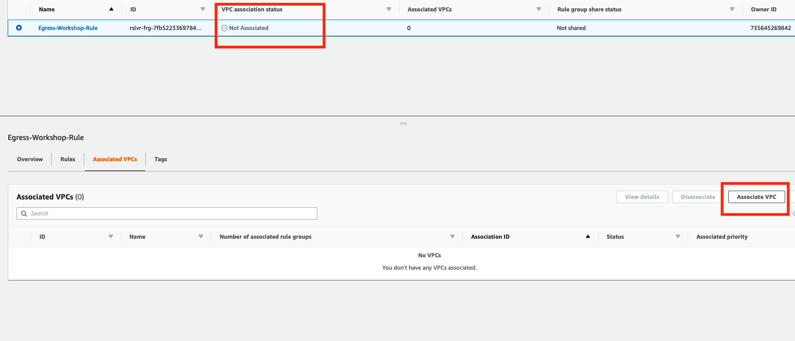
=======

>>>>>>> 809eb8d (redid the images)

- You will see multiple VPCs from the drop down. Select EgressVPC. After selecting the VPC, click on `Associate` to associate the VPC with Rule group.

<<<<<<< HEAD
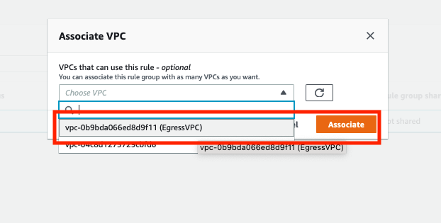
=======

>>>>>>> 809eb8d (redid the images)

- You can see the VPC associated with the rule group once done.

<<<<<<< HEAD
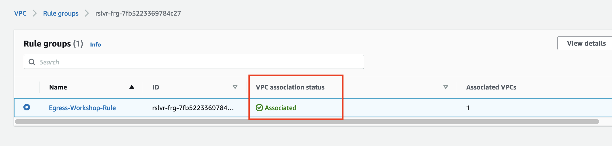
=======

>>>>>>> 809eb8d (redid the images)

#### Step 4 - Verify domain name query resolution

You have deployed and created a DNS Firewall Rule group, configured a rule to BLOCK matches from a custom domain list, and associated this config with the tutorial Egress VPC.

<<<<<<< HEAD
- Navigate to the EC2 session and execute `testegress`. You can see that `Resolution of domains in Abused Top Level Domains` is changed from Allowed to Blocked.
- If some TLDs are still being resolved double-check the values entered in our custom domain list. It should contain all these these domain matching patterns (one per line)
- `*.ru *.cn *.xyz *.cyou *.pw *.ws *.gq *.surf *.cf *.ml`

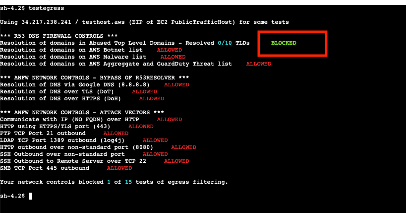
=======
* Navigate to the EC2 session and execute the test script. You can see that `Resolution of domains in Abused Top Level Domains` is changed from Allowed to Blocked.
* If some TLDs are still being resolved double-check the values entered in our custom domain list. It should contain all these these domain matching patterns (one per line)
* `*.ru *.cn *.xyz *.cyou *.pw *.ws *.gq *.surf *.cf *.ml`


>>>>>>> 809eb8d (redid the images)

At this point we have successfully created DNS Firewall Domain lists and rule groups and have associated them with a VPC. We are now blocking traffic from commonly abused top level domains. In the next section we will work with managed Domain Lists.  

## DNS Firewall managed Domain lists

Amazon Route 53 Resolver DNS Firewall comes with Managed Domain Lists that can be used to block the resolution of domain names associated with malicious activity or other potential threats.

AWS provides the following Managed Domain Lists, in the Regions where they are available, for all users of Route 53 Resolver DNS Firewall.

- **AWSManagedDomainsMalwareDomainList**  – Domains associated with sending malware, hosting malware, or distributing malware.

- **AWSManagedDomainsBotnetCommandandControl** – Domains associated with controlling networks of computers that are infected with spamming malware.

- **AWSManagedAggregateThreatList** – Domains associated with multiple DNS threat categories including malware, ransomware, botnet, spyware, and DNS tunneling to help block multiple types of threats.

- **AWSManagedDomainsAmazonGuardDutyThreatList** – Domains associated with DNS security threats, such as malware, command and control, or cryptocurrency related activity, sourced from Amazon GuardDuty.

AWS Managed Domain Lists cannot be downloaded or browsed. To protect intellectual property, you can't view or edit the individual domain specifications within the AWS Managed Domain Lists. While this may seem a bit restrictive, the real benefit of is that it also helps prevent malicious users from designing threats that specifically circumvent published lists. The reality of it all is that you don't want these lists to be published.

So, in this section we are going to remove some of the manual work on our part, and not write a custom list.  Instead, we will use the managed domain lists, that are created and maintained by AWS, to filter egress DNS queries.

Let's return to our test script and see the result of the `testergress` command again.  By running the script in the EC2 session again, we observe that DNS resolution of domains within the Botnet, Malware, and Amazon GuardDuty threat lists are currently allowed.

<<<<<<< HEAD
> **Note:** The `testegress` script uses control/test domains managed by AWS which can be used for verifying the response of a rule configured to match on a managed list.
=======
> **Note:** The `egress-check.sh` script uses control/test domains managed by AWS which can be used for verifying the response of a rule configured to match on a mananged list.

 In the next steps, we will create a new rule group with rules that block the managed domain lists. 
>>>>>>> 809eb8d (redid the images)

 In the next steps, we will create a new rule group with rules that block the managed domain lists.

#### Create a rule group

- Similar to the previous section, navigate to rule groups and click on `add rule group`. Enter a name to the Rule group and click on `Next`.

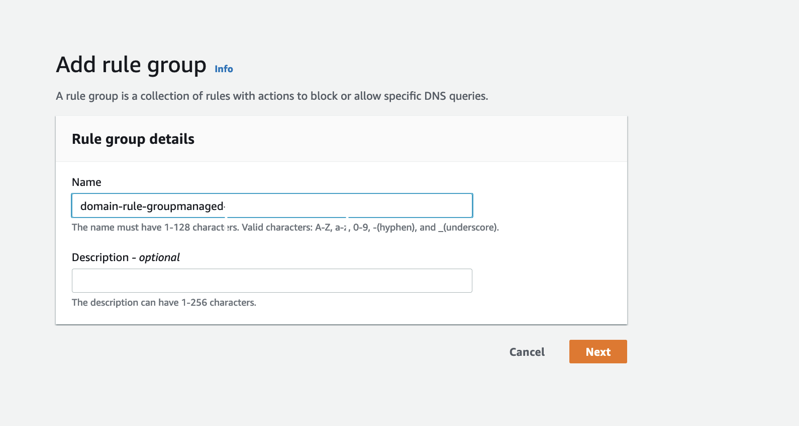

- Click on `Add rule`.

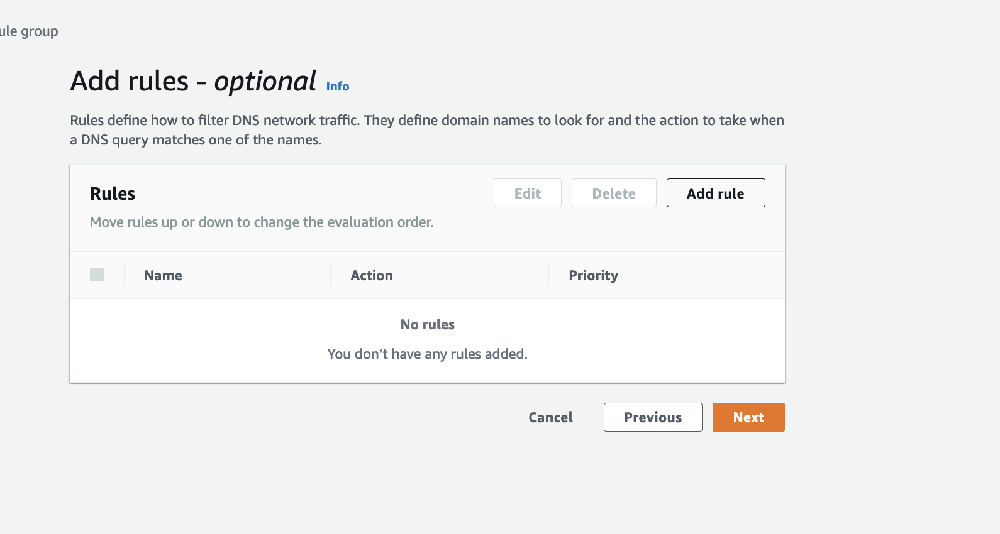

- We will add the botnet managed domain list in this step. Enter a name for the rule, select `Add AWS managed domain list` and select `AWSManagedDomainsBotnetCommandandControl ` from the domain list dropdown.

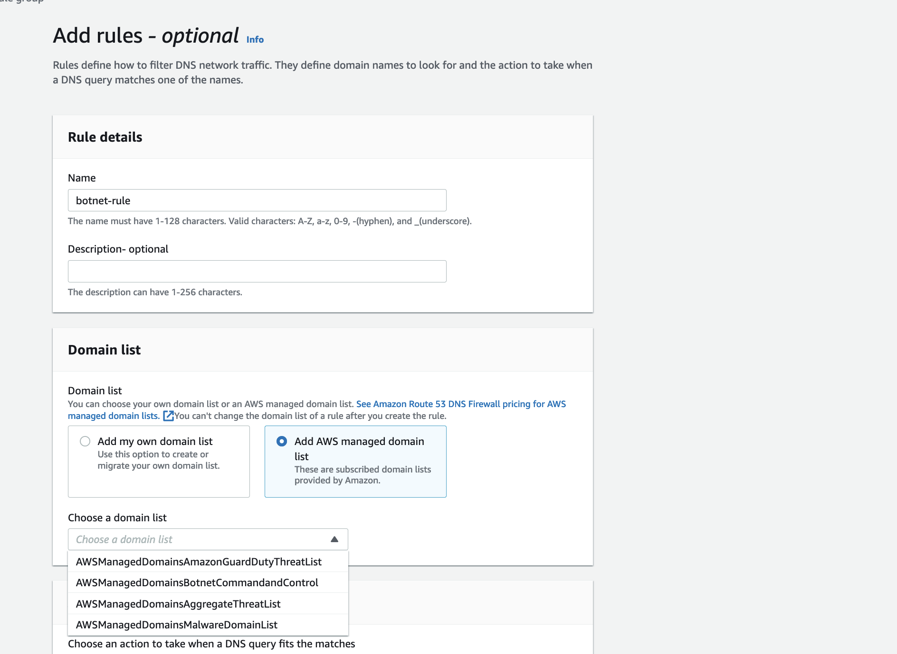

- Select `Block` as Action, `OVERRIDE` as response, and give :code[dns-firewall-block]{showCopyAction=true} as the record value. Select `CNAME` as Record type, leave `0` as TTL and click on `Add rule`. (In some test sandbox environments we saw an error that failed rule creation when selecting the CNAME override.  You can also select `NODATA` or `NXDOMAIN` option for the block instead if you get this.)


- Similarly, add two more rules for `AWSManagedDomainsAmazonGuardDutyThreatList`, `AWSManagedDomainsMalwareDomainList`. You can see three rule groups as shown below. Click `Next`.

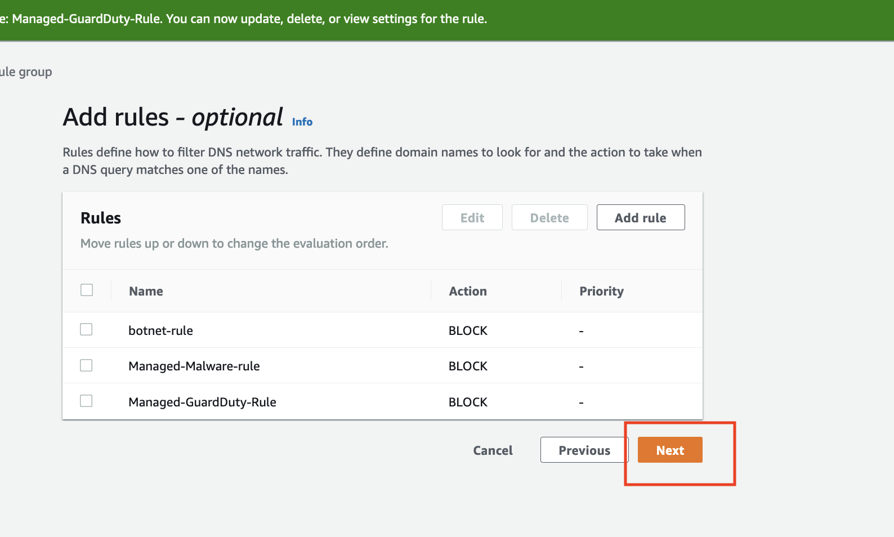

- Click Next at screens for **Set rule priority** and **Add tags** to keep default values
- At **Review and create** screen click on `Create rule group`.

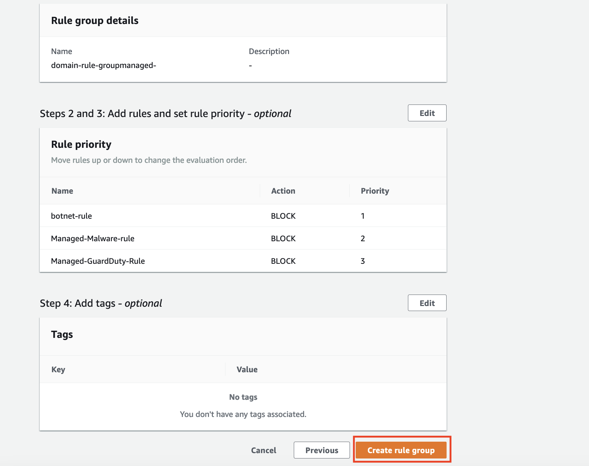

- The newly created rule group is not associated with a VPC. Click on `Associate the VPC`.

<<<<<<< HEAD
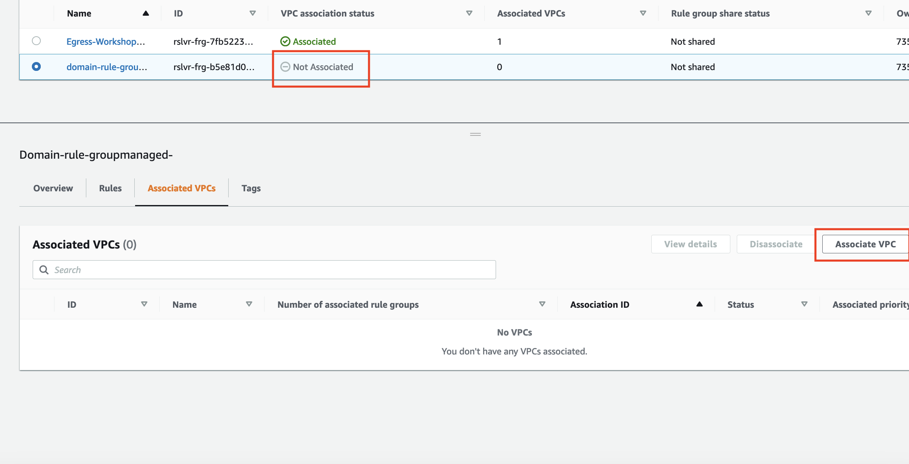
=======

>>>>>>> 809eb8d (redid the images)

- Select `EgressVPC` and Click on `Associate`.

<<<<<<< HEAD
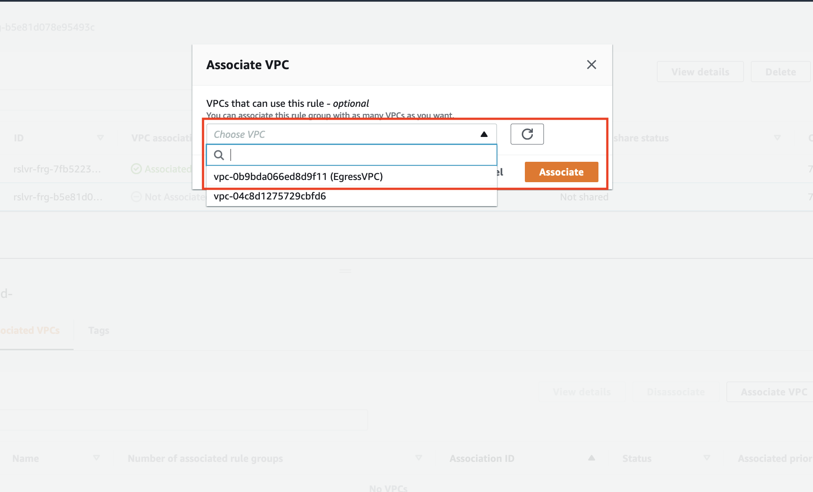

We have now created a new rule group and associated managed domain lists to block malicious FQDNs tracked by these lists.

- Note that we've associated two separate DNS Firewall rule groups with our Egress VPC
- The first rule group assigned to the VPC has a higher priority (lower number) which can be viewed for reach rule group on  the **Associated VPCs** tab.
- Priority for multiple rule groups attached to a single VPC is determined by the order they were associated with the VPC with earlier associated rule groups having a higher priority.
- In most cases it will be easiest to manage the priority of rules by combining into a single rule group.
- Navigate to the EC2 Test host instance and execute `testegress` to test the results of our new configuration.

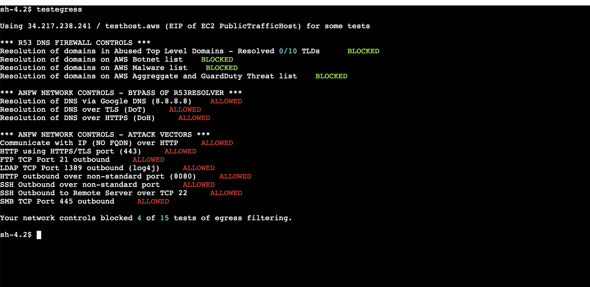

- If any of the domain checks is still showing `ALLOWED` double-check the rules in your new rule group.
- One reason it may still show `ALLOWED` is if any domains being queried are still cached locally on our test instance which might happen if not enough time has lapsed from our last run of `testegress` (in the last exercise).
- You can find the test domains used for this exercise by running the following command: `cat egress-check.sh | grep controldomain`. You can then run a `dig` command against these domains to see if the response is coming from a cache.  Run repeated `dig`'s to watch the TTL (time to live) value decrease until it reaches `0` and then re-run `testegress` to verify the tests change to `BLOCKED`.
=======


We have now created a new rule group and associated managed domain lists to block malicious FQDNs tracked by these lists.

* Note that we've associated two separate DNS Firewall rule groups with our Egress VPC
* The first rule group assigned to the VPC has a higher priority (lower number) which can be viewed for reach rule group on  the **Associated VPCs** tab. 
* Priority for multiple rule groups attached to a single VPC is determined by the order they were associated with the VPC with earlier associated rule groups having a higher priority.
* In most cases it will be easiest to manage the priority of rules by combinining into a single rule group.
* Navigate to the EC2 Test host instance and execute `egress-check.sh` to test the results of our new configuration.


* If any of the domain checks is still showing `ALLOWED` double-check the rules in your new rule group.
* One reason it may still show `ALLOWED` is if any domains being queried are still cached locally on our test instance which might happen if not enough time has lasped from our last run of `egress-check.sh` (in the last exercise).
* You can find the test domains used for this excericse by running the following command: `cat egress-check.sh | grep controldomain`. You can then run a `dig` command against these domains to see if the response is coming from a cache.  Run repeated `dig`'s to watch the TTL (time to live) value decrease until it reaches `0` and then re-run `egress-check.sh` to verify the tests change to `BLOCKED`.
>>>>>>> 809eb8d (redid the images)

At this point we have successfully blocked resolution of domains in the managed lists using DNS Firewall.

## Configure query logging

To log the DNS queries that are filtered by DNS Firewall rules that originate in your VPCs, you need to configure Query Logging in Route 53.

This is a best practices for security across your AWS environment including VPCs where you are not using Route 53 Resolver DNS Firewall. Query logging has the added benefit of showing DNS firewall rule actions.

<<<<<<< HEAD
> By default Route 53 > Resolver > Query logging opens in N. Virginia (us-east-1) region. **Make sure you select the Region where the workshop is running.** If appropriate region is not selected from the drop down, depending on the access permission, you might run into an error.
=======

> By default Route 53 > Resolver > Query logging opens in N. Virginia (us-east-1) region. **Make sure you select the Region where the tutorial is running.** If appropriate region is not selected from the drop down, depending on the access permission, you might run into an error.
>>>>>>> 809eb8d (redid the images)

#### Step 1 - Set up query logging

- We need to configure Query logging to start logging the queries that are filtered by DNS Firewall. Query logging is under the Route53 in AWS Console. Navigate to Route53 → Resolver → Query logging.

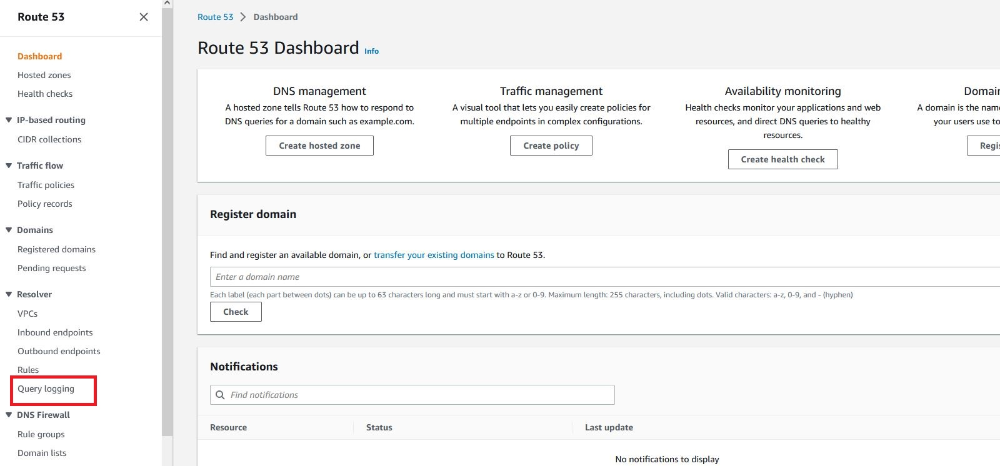

- Click on Configure Query logging

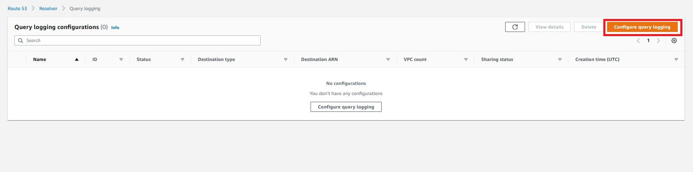

- Enter a name for this configuration. You can save these logs to CloudWatch logs, S3 buckets, or a Kinesis Data Firehose delivery stream. Select CloudWatch Logs, log group, and send the logs to a new log group by creating a new log group.

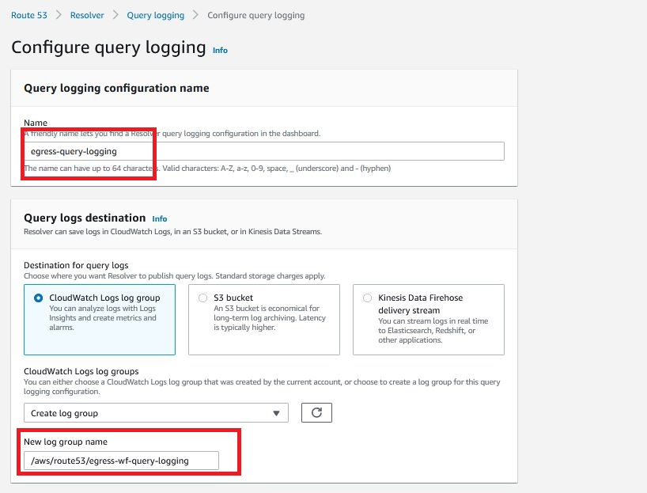

- Add egressVPC to this Query logging.
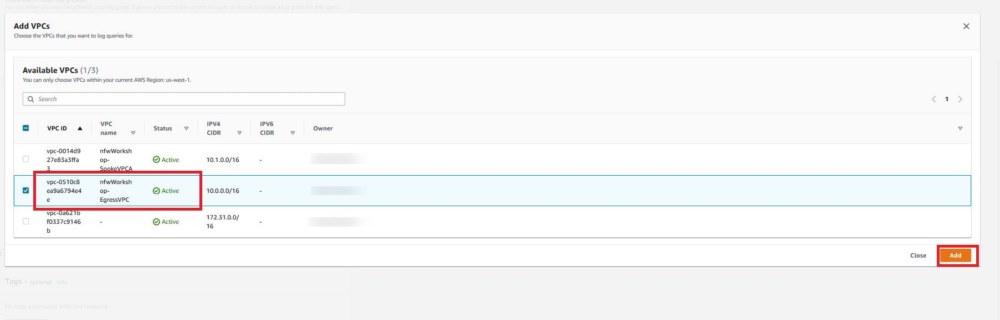

- Click on Configure query logging to complete the set up.

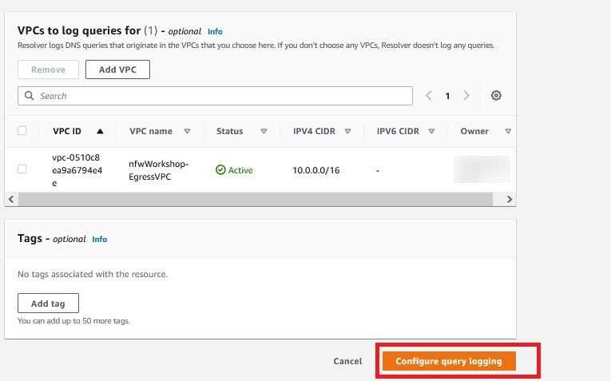

- We can see the Query logging details as shown below once we've completed the configuration.

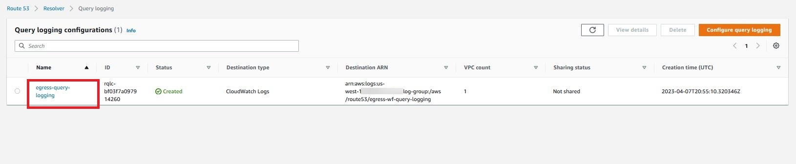

#### Step 2 - Verify DNS query logs in CloudWatch

- Navigate to the EC2 session and execute the command `nslookup google.cn`. Since dns queries resolving this domain name are blocked you can see that the server cannot find the domain.

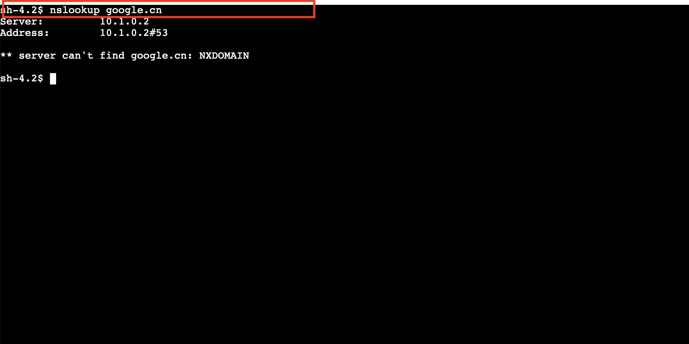

<<<<<<< HEAD
- Navigate to `CloudWatch` on AWS Console. Click on `Log groups` and then click on the log group created for query logging in this workshop.
=======
* Navigate to `CloudWatch` on AWS Console. Click on `Log groups` and then click on the log group created for query logging in this tutorial. 
>>>>>>> 809eb8d (redid the images)

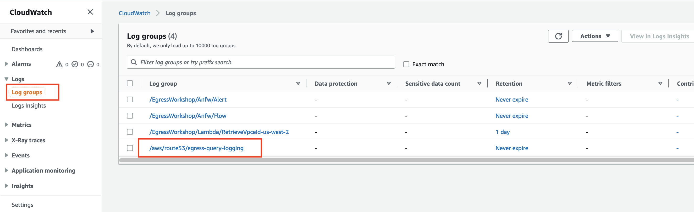

- Click on the latest log group.

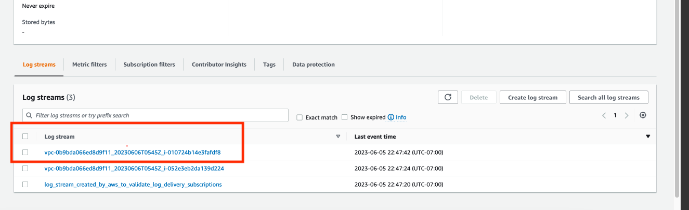

- Search `google.cn` in the search bar and observe the results.

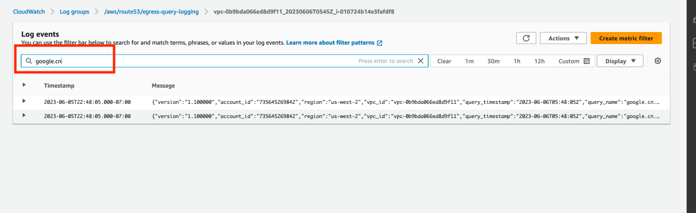

- We can see that the traffic is blocked. We can also see the custom response `dns-firewall-block` that we gave while creating the DNS Rule group.
  
  > **Note:** If you used a different block response of NXDOMAIN or NODATA you will see this instead.

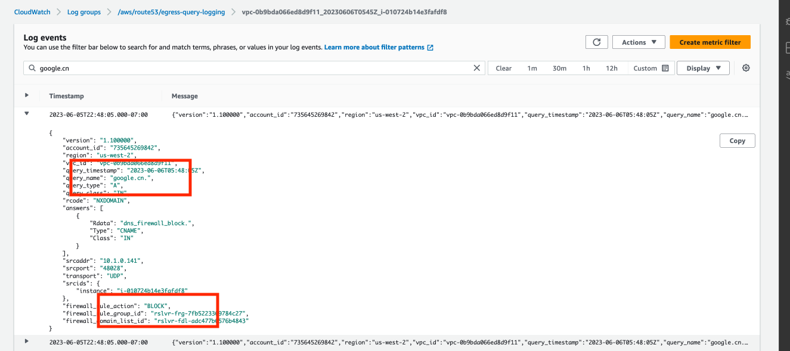

In this portion of the tutorial, we have evaluated DNS Firewall rules using Query Logging with CloudWatch Logs.

## Clean up

#### Delete the DNS Firewall rules

* First, Disassociate the VPC from each of the rules.
  


* Next, delete the Rule groups from each of the two rules you created. 


* Navigate to `VPC -> DNS Firewall -> Rule groups`. Select the Rule groups and click on Delete. 


* Finally to `VPC -> DNS Firewall -> Domain Lists`. Select the Domain List and click on Delete. 


#### Delete the CloudFormation template

- Navigate to CloudFormation on Console, select the CloudFormation template and click on `Delete`.

<<<<<<< HEAD
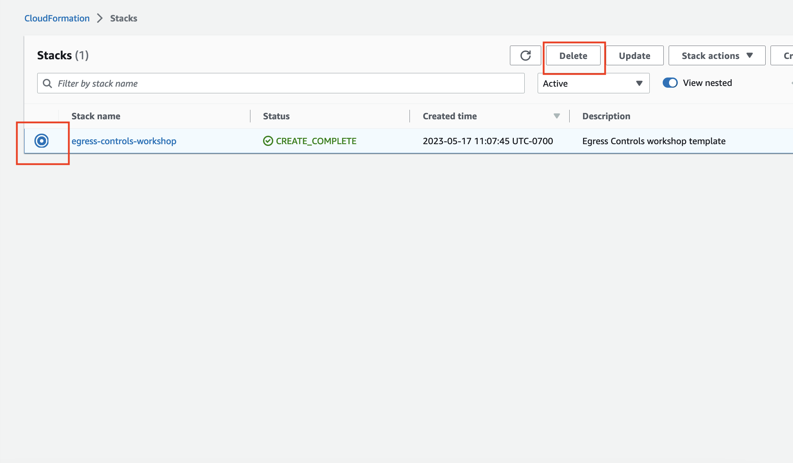
=======

>>>>>>> 809eb8d (redid the images)

- You can see a message that it's a permanent deletion. Click on `Delete` on the prompt.

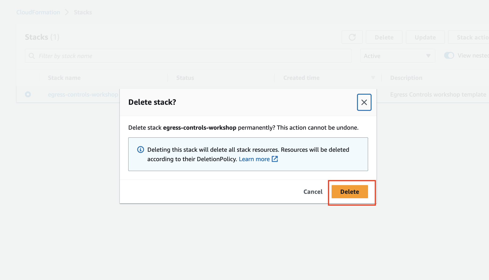

- It may take few minutes to delete the resources and the status will be updated to `DELETE_COMPLETE`.

<<<<<<< HEAD
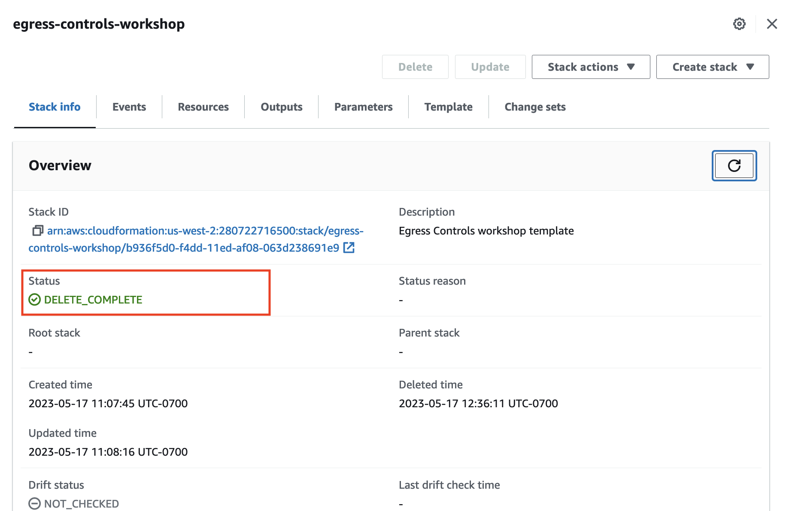
=======

>>>>>>> 809eb8d (redid the images)


<<<<<<< HEAD
- Navigate to `VPC -> DNS Firewall -> Rule groups`. Select the Rule groups and click on Delete.

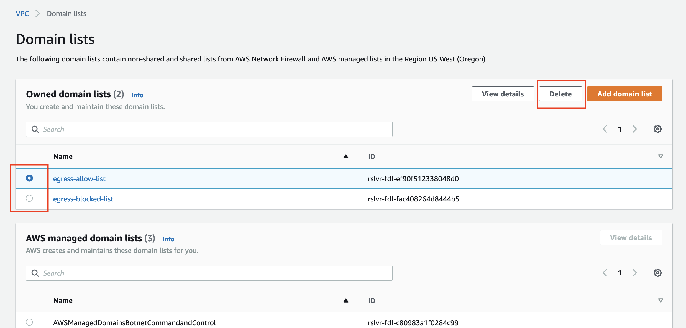

- Disassociate the VPC and delete the Rule group.

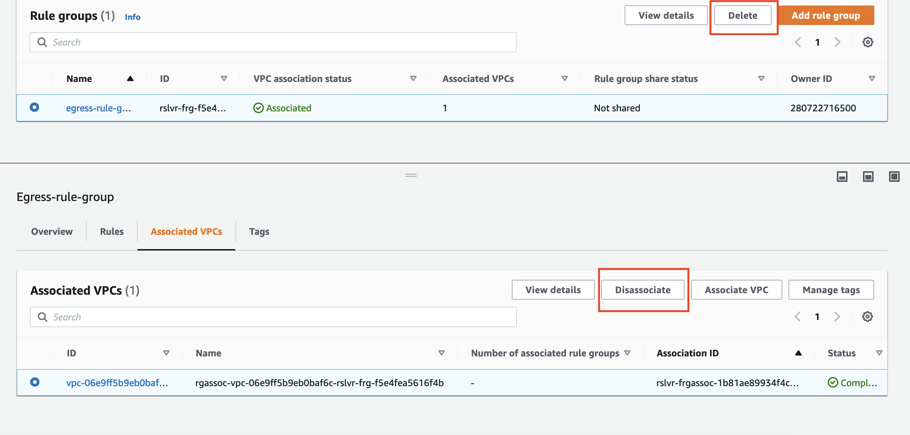
=======
>>>>>>> 809eb8d (redid the images)

#### Delete the CloudWatch logs

- Navigate to CloudWatch, click on Log groups, select the log groups and click on `Delete`.


## Conclusion

And that's it!  In this tutorial we learned how to use Route53 DNS Firewall to secure our VPC egress traffic. As we've progressed through this tutorial we saw how to configure a custom list of TLDs that we do not want our cloud resources communicating with.  By blocking resolution to these TLDs we not only protected our account, but we also controlled egress traffic cost. We also controlled egress traffic using managed lists.  Remember, the benefit to the managed lists is that we don't have to come up with them ourselves.  Rather, we have expert guidance from AWS that curates and manages these lists for us. Lastly, we enabled logging and now have visibility into the DNS queried traffic that we blocked.

What we have seen here is just one aspect of controlling egress traffic.  Implementing this simple approach to filtering DNS traffic can improve our security posture and minimizing costs incurred with undesired egress traffic.

If you enjoyed this tutorial, found any issues, or have feedback for us, <a href="https://pulse.buildon.aws/survey/DEM0H5VW" target="_blank">please send it our way!</a>.
