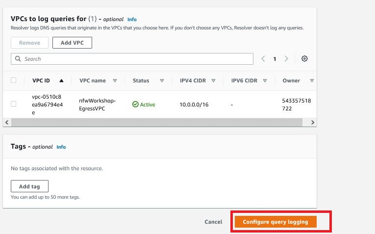

Have you ever considered the connection between securing your infrastructure and optimizing costs?  Most often, when we think about security our minds go to adversaries and risk, controls and inspection, compliance and auditing.  But the truth is, creating a solid security posture contributes to cost control in a cloud environment.

In this tutorial we will focus on controlling egress traffic with the [Amazon Route53 DNS Resolver Firewall](https://aws.amazon.com/about-aws/whats-new/2021/03/introducing-amazon-route-53-resolver-dns-firewall/).  Our first goal of this capability is to provide a secure environment, ensuring that only desired egress traffic is allowed to leave our cloud environment.  Our secondary goal, and really a side-outcome of the capabilities we will enable, is that we will minimnize our cloud costs for egress traffic.  

In this tutorial we will work with the Amazon Route53 DNS Resolver Firewall, Amazon EC2 Instances, and Amazon Virtual Private Clouds. 

## What is Amazon Route 53 resolver DNS Firewall?

With Amazon Route 53 Resolver DNS Firewall , you define domain name filtering rules in rule groups that you associate with your VPCs. You can specify lists of domain names to allow or block, and you can customize the responses for the DNS queries that you block.

A primary use of Route 53 Resolver DNS Firewall is to block communication with known malicious domains and/or only allow communication with trusted domains. This is one of the features we will be configuring in this tutorial.  Not only can DNS Firewall prevent the resolution of untrusted domains (and the IP addresses needed to communicate with them) but it can also help prevent DNS exfiltration of your data. DNS exfiltration can happen when there is unauthorized access that compromises resources in your VPC. DNS queries can then be used to send data or tunnel other network protocols out of the VPC to malicious DNS servers. With DNS Firewall, you can monitor and control the domains that your application workloads can query. You can deny access to the domains that AWS knows to be malicious and allow other queries to pass through. Alternately, you can build a DNS Allow-List model where you implement a default deny to all domains except for the ones that you explicitly trust.

## How DNS Firewall works with AWS Network Firewall

DNS Firewall and AWS Network Firewall both offer domain name filtering, but for different types of traffic. With DNS Firewall and AWS Network Firewall together, you can configure domain-based filtering for traffic over two different network egress paths.

DNS Firewall provides filtering for outbound DNS queries that pass through the Route 53 Resolver from within your VPCs. You can also configure DNS Firewall to send custom responses for queries to blocked domain names.

AWS Network Firewall provides filtering for all network traffic that is routed through firewall endpoints, but does not have visibility into queries made to the Route 53 Resolver.

In this tutorial we will focus on filtering DNS traffic that AWS Network Firewall does not have visibility into.

## Traffic Flow

For this tutorial, we use a simplified (single availability zone) version of the distributed deployment architecture as shown in the below image. Traffic from protected workloads going to the Internet is routed via the default route (0.0.0.0/0) to a Network Firewall endpoint which in turn has a default route pointing to a NAT Gateway endpoint.

The Public subnet where the NAT Gateway is located has a default route pointing to the Interet Gateway for the VPC, and it also has a specific route for return traffic to protected workloads pointing to the Network Firewall endpoint. This ensures the traffic is symmetric for full inspection.

NAT Gateway deployed in a dedicated public subnet allows instances in private subnet to communicated with resources on the Internet.

This is the typical egress traffic flow when  AWS Network Firewall is deployed. However, what's not depicted in the above image is the traffic flow for DNS Queries within the VPC.  

In the image below, we see what this traffic flow looks like with DNS resolution.  

Route 53 Resolver DNS queries are evaluated by DNS Firewall, and this traffic flows from our endpoints to the DNS Resolver located at the .2 address of each VPC subnet.

## Tutorial Setup

This tutorial starts with a baseline configuration that's built with a CloudFormation template that you can find in the sample code repo.  

Once you have the CloudFormation Template deployed, we will check the baseline posture of the environment.  We are checking to see that certain traffic is allowed out of the environment.  Once verified we will configure the Amazon Route 53 resolve DNS firewall to block this undesired egress traffic and we will also enable logging.

> Note: Deploying this CloudFormation template in your environment will incur costs.  By using the template you assume all responsability for these costs as well as the cleanup of the environment afterwards.  We will walk you through the process at the end of this tutorial, but it is your responsability to ensure the environment is cleaned up.

Let's begin by connecting to our test EC2 server instance and running a script to test egress traffic.

#### Establishing a default egress baseline

1. Begin by navigating to CloudFormation in the AWS Console. 

2. Click on the stack that has been created. 

3. Click on `Outputs` and check the resources that are created. 
4. Find the TestHostSession in the key column.  The URL link for TestHostSession opens an interactive shell on an EC2 instance (**TestInstance1** in the earlier diagram) within an AWS Network Firewall protected subnet which you will be using to send test traffic in this tutorial. 
5. Click on the link to connect to it.  You may find it useful to open this in a separate tab so you can return here to use this and the other links as shortcuts.  There are also links to the AWS Network Firewall, Route 53 Resolver DNS Firewall, and Cloudwatch Logs services.

#### Manual scanning of the environment

Once you are connected to the command-line session on the EC2 instance, we will execute a command that runs a wrapper for an egress-check.sh script.   This script runs multiple egress tests involving DNS queries and network protocol tests shown in the image below. Note the IP address of `testhost.aws` (**PublicTrafficHost** in the topology diagram) which is another EC2 instance configured for this tutorial to receive and respond to our test traffic. We should also be able to ping this address, (`ping testhost.aws`) from the commmand-line and receive replies back.  All of the egress filtering tests should currently show as `ALLOWED`.  

1. Enter the `testgress` command and note the response output.

As you can see from the test, the egress controls in this environment are wide open, so we have our work cut out for us!

In the subsequent portions of this tutorial, we will configure the Amazon Route 53 Resolver DNS firewall to filter our DNS queries and Internet-bound traffic until these tests return a `BLOCKED` status. 

Let's begin to configure the Amazon Route 53 Resolver DNS Firewall.

## Configure the Amazon Route 53 Resolver DNS Firewall

In this section, we will use Amazon Route53 DNS Firewall to create a custom list of commonly abused top-level domains (TLDs) and set them to be blocked within our Egress VPC. 

#### Step 1 - Create a DNS Firewall custom domain list

A domain list is a set of domain-matching specifications you can use in a Route 53 Resolver DNS firewall rule to ALLOW, BLOCK, or ALERT against matching domains.  Within a single rule group you can have many rules that each match against a different domain list.  You can create your own lists, and there are also AWS-managed lists which will be discussed in later sections of the lab. When you associate a rule group with a VPC, DNS firewall compares the DNS queries against the domain list in the rules and handles the DNS queries according the matching rule’s action. 

In this step, we create a domain list that will specify the domain-matching patterns for top-level domains that will be blocked. 

#### Create a domain list of commonly abused top-level domains (TLDs)

* Navigate to **VPC** → **DNS firewall** (remember there is a shortcut link labeled **R53DNSFWConsole** in the `Outputs` of the CloudFormation template) and click on **Domain lists**.

* Here you can see any custom lists created as well as AWS managed domain lists.

* Click on **Add domain list** shown in the image below.

* Give the domain list a name of your choosing.
* Enter TLD-matching patterns from the image below(one-per-line) following the format shown (e.g.:code[*.ru]{showCopyAction=true}).
* The `*` acts as a wildcard to match all the subdomains within each of these TLDs
* We can always write exceptions later to our broad TLD-matching rules by creating an `ALLOW` rule to match any needed exceptions and giving it a higher priority than our `BLOCK` rule.
* We'll use this list to BLOCK ten commonly abused top-level domains in our VPC

* After entering the domains, click on **Add domain list**. 

#### Step 2 - Create Rule groups

DNS Firewall rule groups are a set of rules that will allow, deny, or alert on DNS request that match the associated domain lists. In this step we are going to create a rule group and add the domain list just created. 

* Navigate to **VPC** → **DNS firewall** → **Rule groups** and click on **Create rule group**. 

* Give a name to rule group and click next. 

* Click on Add rule to add the domain list you just created. 

* Enter a name for the rule and select the previously created domain list from the drop down and select **BLOCK** for the action on matches. 

* Select **OVERRIDE** in the response for Block action and enter :code[dns-firewall-block]{showCopyAction=true} as the custom response and `CNAME` as record type.
* Having an override value in our response action makes it easier to say with certainity that a particular query was blocked by DNS Firewall as **NXDOMAIN** or **NODATA** responses could also indicate the absence of a queried record, rather than a BLOCK response from DNS Firewall.  The CNAME value can also be used to redirect a blocked request to a web page with details on why the domain resolution was blocked.
* Leave TTL as `0` and click on **Add rule** (DO NOT CLICK `Next` as it will skip adding the created rule).

* You can set the priority for the rules in this page which controls the order in which rules are evaluated.  The first rule that matches a domain query will determine the action taken.  If we were createing `ALLOW` rule exceptions a `BLOCK` rule, we would use this screen to increase the priority for the `ALLOW` rule.
* Leave the default value and click **Next**. 

* Adding tags are optional. Leave blank and and click **Next**
* On the final **Review and create** screen click on **Create rule group**. 

*  You can now see the rule group created in the console. Note it is currently **Not Associated** to a VPC. 

#### Step 3 - Associate DNS Firewall Rule group to Egress VPC

* In this step, we will associate a VPC with the newly created Rule group. Click on Rule group and then on Associate VPC as shown below. 

* You will see multiple VPCs from the drop down. Select EgressVPC. After selecting the VPC, click on `Associate` to associate the VPC with Rule group. 

* You can see the VPC associated with the rule group once done. 

#### Step 4 - Verify domain name query resolution

You have deployed and created a DNS Firewall Rule group, configured a rule to BLOCK matches from a custom domain list, and associated this config with the tutorial Egress VPC. 

* Navigate to the EC2 session and execute `testegress`. You can see that `Resolution of domains in Abused Top Level Domains` is changed from Allowed to Blocked.
* If some TLDs are still being resolved double-check the values entered in our custom domain list. It should contain all these these domain matching patterns (one per line)
* `*.ru *.cn *.xyz *.cyou *.pw *.ws *.gq *.surf *.cf *.ml`

At this point we have successfully created DNS Firewall Domain lists and rule groups and have associated them with a VPC. We are now blocking traffic from commonly abused top level domains. In the next section we will work with managed Domain Lists.  

## DNS Firewall managed Domain lists

Amazon Route 53 Resolver DNS Firewall comes with Managed Domain Lists that can be used to block the resolution of domain names associated with malicious activity or other potential threats. 

AWS provides the following Managed Domain Lists, in the Regions where they are available, for all users of Route 53 Resolver DNS Firewall.

* **AWSManagedDomainsMalwareDomainList**  – Domains associated with sending malware, hosting malware, or distributing malware.

* **AWSManagedDomainsBotnetCommandandControl** – Domains associated with controlling networks of computers that are infected with spamming malware.

* **AWSManagedAggregateThreatList** – Domains associated with multiple DNS threat categories including malware, ransomware, botnet, spyware, and DNS tunneling to help block multiple types of threats.

* **AWSManagedDomainsAmazonGuardDutyThreatList** – Domains associated with DNS security threats, such as malware, command and control, or cryptocurrency related activity, sourced from Amazon GuardDuty.

AWS Managed Domain Lists cannot be downloaded or browsed. To protect intellectual property, you can't view or edit the individual domain specifications within the AWS Managed Domain Lists. A real benefit of this restriction is that it also helps  prevent malicious users from designing threats that specifically circumvent published lists.

In this section we will use the managed domain lists to filter egress DNS queries. If we check the result of the `testergress` command in the EC2 session, we observe that currently DNS resolution of domains within the Botnet, Malware, and Amazon GuardDuty threat lists are allowed. The `testegress` script uses control/test domains managed by AWS which can be used for verifying the response of a rule configured to match on a mananged list.

 In the next steps, we will create a new rule group with rules that block the managed domain lists. 

#### Create a rule group

*  Similar to the previous section, navigate to rule groups and click on `add rule group`. Enter a name to the Rule group and click on `Next`. 

* Click on `Add rule`. 

* We will add the botnet managed domain list in this step. Enter a name for the rule, select `Add AWS managed domain list` and select `AWSManagedDomainsBotnetCommandandControl ` from the domain list dropdown. 

* Select `Block` as Action, `OVERIDE` as response, and give :code[dns-firewall-block]{showCopyAction=true} as the record value. Select `CNAME` as Record type, leave `0` as TTL and click on `Add rule`. (In some test sandbox environments we saw an error that failed rule creation when selecting the CNAME ovverride.  You can also select `NODATA` or `NXDOMAIN` option for the block instead if you get this.)

* Similarly, add two more rules for `AWSManagedDomainsAmazonGuardDutyThreatList`, `AWSManagedDomainsMalwareDomainList`. You can see three rule groups as shown below. Click `Next`.

* Click Next at screens for **Set rule priority** and **Add tags** to keep default values
* At **Review and create** screen click on `Create rule group`. 

* The newly created rule group is not associated with a VPC. Click on `Associate VPC`.

* Select `EgressVPC` and Click on `Associate`. 

We have now created a new rule group and associated managed domain lists to block malicious FQDNs tracked by these lists.

* Note that we've associated two separate DNS Firewall rule groups with our Egress VPC
* The first rule group assigned to the VPC has a higher priority (lower number) which can be viewed for reach rule group on  the **Associated VPCs** tab. 
* Priority for multiple rule groups attached to a single VPC is determined by the order they were associated with the VPC with earlier associated rule groups having a higher priority.
* In most cases it will be easiest to manage the priority of rules by combinining into a single rule group.
* Navigate to the EC2 Test host instance and execute `testegress` to test the results of our new configuration.

* If any of the domain checks is still showing `ALLOWED` double-check the rules in your new rule group.
* One reason it may still show `ALLOWED` is if any domains being queried are still cached locally on our test instance which might happen if not enough time has lasped from our last run of `testegress` (in the last exercise).
* You can find the test domains used for this excericse by running the following command: `cat egress-check.sh | grep controldomain`. You can then run a `dig` command against these domains to see if the response is coming from a cache.  Run repeated `dig`'s to watch the TTL (time to live) value decrease until it reaches `0` and then re-run `testegress` to verify the tests change to `BLOCKED`.

At this point we have successfully blocked resolution of domains in the managed lists using DNS Firewall. 

## Configure Query Logging

To log the DNS queries that are filtered by DNS Firewall rules that originate in your VPCs, you need to configure Query Logging in Route 53.

This is a best practices for security across your AWS environment including VPCs where you are not using Route 53 Resolver DNS Firewall. Query logging has the added benefit of showing DNS firewall rule actions.

> By default Route 53 > Resolver > Query logging opens in N. Virginia (us-east-1) region. **Make sure you select the Region where the workshop is running.** If appropriate region is not selected from the drop down, depending on the access permission, you might run into an error.

#### Step 1 - Set up Query logging

* We need to configure Query logging to start logging the queries that are filtered by DNS Firewall. Query logging is under the Route53 in AWS Console. Navigate to Route53 → Resolver → Query logging. 

* Click on Configure Query logging 

* Enter a name for this configuration. You can save these logs to CloudWatch logs, S3 buckets, or a Kinesis Data Firehose delivery stream. Select CloudWatch Logs, log group, and send the logs to a new log group by creating a new log group. 

* Add egressVPC to this Query logging. 

* Click on Configure query logging to complete the set up. 

* We can see the Query logging details as shown below once we've completed the configuration. 

#### Step 2 - Verify DNS query logs in CloudWatch

* Navigate to the EC2 session and execute the command `nslookup google.cn`. Since dns queries resolving this domain name are blocked you can see that the server cannot find the domain. 

* Navigate to `CloudWatch` on AWS Console. Click on `Log groups` and then click on the log group created for query logging in this workshop. 

* Click on the latest log group. 

* Search `google.cn` in the search bar aand observe the results. 

* We can see that the traffic is blocked. We can also see the custom response `dns-firewall-block` that you have given while creating the DNS Rule group. (Note if you used a different block response of NXDOMAIN or NODATA you will see this instead.)

In this portion of the tutorial, we have evaluated DNS Firewall rules using Query Logging with CloudWatch Logs. 

## Wrap Up

In this tutorial you have leared how to use Route53 DNS Firewall to secure your VPC egress traffic. As we've progressed through this tutorial we first saw how we can configure a custom list of TLDs that we do not want our cloud resources communicating with.  By blocking resolution to these TLDs we not only protect our account, but we also control egress traffic cost. We also looked at how to control egress traffic using managed lists.  The benefit to the managed lists is that we don't have to come up with them ourselves.  Rather we have expert guidance from AWS that curates and manages these lists.  And finally, we enabled logging so that when we do filter DNS queried traffic we can see it. While this is just one aspect of controlling egress traffic, the importance here is that our DNS resolution within a VPC s not seen by the AWS Network Firewall, so using Route53 DNS Firewall ensures that this egress traffic is controlled. This improves our security posture and minimizes unnecessary costs on undesired egress traffic.