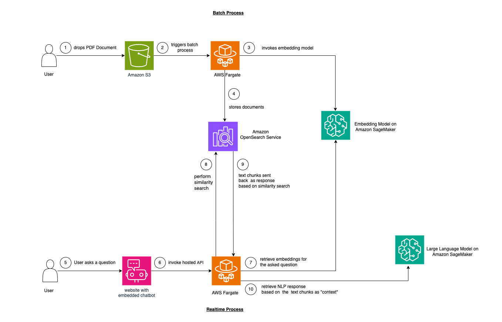
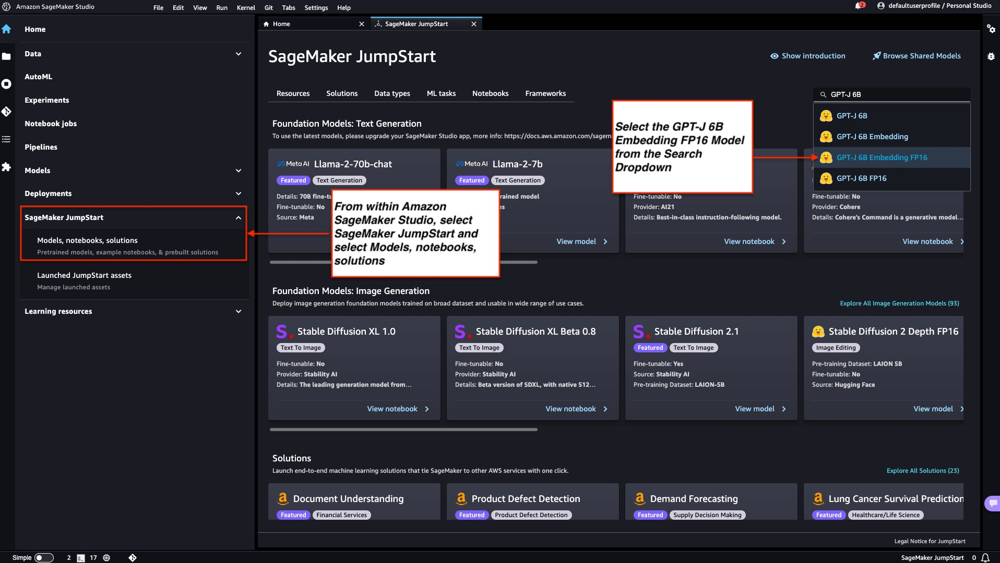
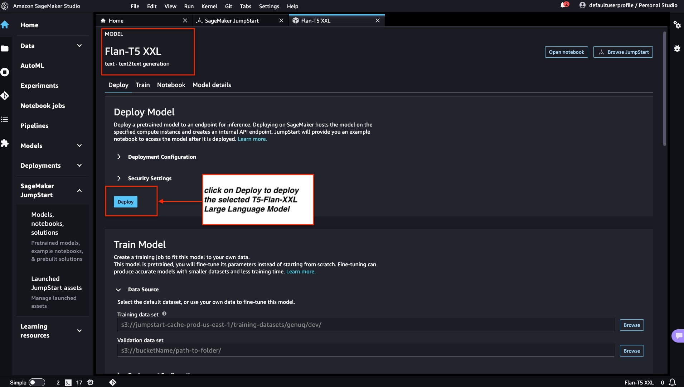
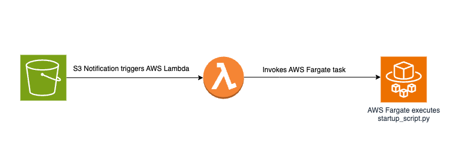
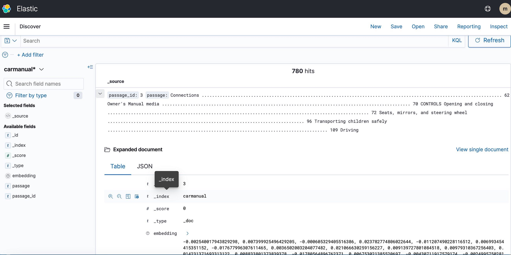

Imagine being able to converse with your unstructured data, extracting valuable information with ease. In today’s data-driven landscape, extracting meaningful insights from unstructured documents remains a challenge, inhibiting decision-making and innovation.  In this tutorial, we will learn about embeddings, explore using Amazon OpenSearch as a vector database and seamlessly integrate [Langchain](https://python.langchain.com/docs/get_started/introduction/) framework with Large Language Models (LLMs) to build a website with an embedded NLP chatbot. We will go over the basics of LLM's to extract meaningful insights from an unstructured document with the help of an Open Source [Large Language Model](https://huggingface.co/google/flan-t5-xxl). By the end of this tutorial, you’ll have a comprehensive understanding of how to derive meaningful insights from unstructured documents, and use the skills to explore and innovate with similar full stack AI-driven solutions.

| Attributes             |                                                                 |
|------------------------|-----------------------------------------------------------------|
| ✅ AWS experience      | 200 - Intermediate                                                        |
| ⏱ Time to complete    | 60 minutes                                                      |
| 💰 Cost to complete    | ~9$ an hour. To take advantage of [AWS free tier](https://docs.aws.amazon.com/whitepapers/latest/how-aws-pricing-works/get-started-with-the-aws-free-tier.html) for services like  (Amazon OpenSearch)[https://aws.amazon.com/opensearch-service/pricing/] use t2.small.search or t3.small.search instance. Additionally you can further reduce costs, by using a t5-flan small / t5-flan-xl LLM instead of a t5-flan-xxl LLM for experimentation.                                              |
| 🧩 Prerequisites       | 1. You should have an active AWS account. If you don't have one, you can sign up on the [AWS website](https://aws.amazon.com/resources/create-account/?sc_channel=el&sc_campaign=genaiwave&sc_content=fullstack-llm-langchain-chatbot-on-aws&sc_geo=mult&sc_country=mult&sc_outcome=acq)<br/>2. Make sure you have the AWS Command Line Interface (CLI) installed on your local machine, and it should be properly configured with the necessary credentials and default region. You can configure it using the aws configure command.<br/>3. Download and install Docker Engine. Follow the installation instructions for your specific operating system. |
|  💻 Code Sample         | Code sample used in tutorial on [GitHub](https://github.com/build-on-aws/fullstack-llm-langchain-chatbot-on-aws)  |
|

| ToC |
|-----|

## What Are We Going To Build?

In this example, we want to mimic the problem that is faced by many enterprises. Most of the data today is not structured but is rather unstructured in the form of audio and video transcripts, PDF and Word documents, manuals, scanned notes, social media dumps, etc. We will use the Flan-T5 XXL model as the LLM. This model can produce summaries and Q&A responses from unstructured texts. The following image is the architecture showing the various building blocks.



## Let’s Start With the Basics

We will use a technique called in-context learning to inject domain or use case-specific "Context" into our LLM. In this case, we have an unstructured PDF manual of a car that we want to add as "Context" for the LLM and we want the LLM to answer questions about this manual. It's as simple as that! We aim to go a step further by developing a real-time API that receives questions, forwards them to our backend, and is accessible from an open-source chatbot embedded in the website. This tutorial enables us to build the entire user experience and gain insights into various concepts and tools throughout the process.

1. The very first step to provide in-context learning is to ingest the PDF document and convert it into text chunks, generate vector representations of these text chunks called "embeddings" and finally store these embeddings in a vector database.

2. Vector databases enable us to perform a "similarity search" against the text embeddings that are stored in it.

3. [Amazon SageMaker JumpStart](https://docs.aws.amazon.com/sagemaker/latest/dg/studio-jumpstart.html?sc_channel=el&sc_campaign=genaiwave&sc_content=fullstack-llm-langchain-chatbot-on-aws&sc_geo=mult&sc_country=mult&sc_outcome=acq) provides one click executable solution templates for setting up the infrastructure for pre-trained, open-source models. We will be using Amazon SageMaker JumpStart to deploy the Embedding Model and the Large Language Model.

4. [Amazon OpenSearch](https://aws.amazon.com/opensearch-service/) is a search and analytics engine that can search for nearest neighbors of points in a vector space, making it suitable as a vector database.

### Diagram: Converting From PDF to Embeddings in Vector Database


Now, let's dive into the first step of our journey. In Step 1, we will deploy the GPT-J 6B FP16 Embedding model with Amazon SageMaker JumpStart. This model will play a crucial role in converting our PDF manual into embeddings for our vector database.

## Step 1 - Deploy GPT-J 6B FP16 Embedding Model With Amazon SageMaker JumpStart

Follow the steps outlined in [Amazon SageMaker Documentation - Open and use JumpStart section](https://docs.aws.amazon.com/sagemaker/latest/dg/studio-jumpstart.html) to launch Amazon SageMaker JumpStart node from the Home Menu of the Amazon SageMaker Studio. Choose **Models, notebooks, solutions** option and select the GPT-J 6B Embedding FP16 embedding model as shown in the image below. Then, click on 'Deploy' and Amazon SageMaker JumpStart will take care of the infrastructure setup for deploying this pre-trained model into the SageMaker environment.




## Step 2 - Deploy the Flan T5 XXL LLM With Amazon SageMaker JumpStart

Next, within Amazon SageMaker JumpStart, choose the Flan-T5 XXL LLM, and then click on 'Deploy' to initiate the automatic setup of infrastructure and deploy the model endpoint into the Amazon SageMaker environment.



## Step 3 - Check the Status of the Deployed Model Endpoints

We check the status of the deployed model endpoints from Step 1 and Step 2 in the Amazon SageMaker console and make note of their endpoint names, since we will use them in our code. Here is how my console looks like after the model endpoints are deployed.


## Step 4 - Create the Amazon OpenSearch Cluster

Amazon OpenSearch is a search and analytics service that supports k-Nearest Neighbors (kNN) algorithm. This functionality is incredibly valuable for similarity-based searches, allowing us to use OpenSearch effectively as a vector database. To explore further and learn about which versions of Elasticsearch/OpenSearch support the kNN plugin, please refer the following link: [k-NN Plugin Documentation](https://docs.aws.amazon.com/opensearch-service/latest/developerguide/knn.html).

We will use the AWS CLI to deploy the AWS CloudFormation template file from the GitHub location `Infrastructure/opensearch-vectordb.yaml`. Execute the `aws cloudformation create-stack` command as follows to create the Amazon OpenSearch Cluster. Before executing the command we have to replace `<username>` and `<password>` with our own values.

```bash
aws cloudformation create-stack --stack-name opensearch-vectordb \
  --template-body file://opensearch-vectordb.yaml \
  --parameters ParameterKey=ClusterName,ParameterValue=opensearch-vectordb \
               ParameterKey=MasterUserName,ParameterValue=<username> \
               ParameterKey=MasterUserPassword,ParameterValue=<password> 
```

## Step 5 - Build the Document Ingestion and Embedding Workflow

In this step, we will create an ingestion and processing pipeline designed to read a PDF document when it is placed in an Amazon Simple Storage Service (S3) bucket. This pipeline will perform the following tasks:

1. Chunk the text from the PDF document.
2. Convert the text chunks into embeddings (vector representations).
3. Store the embeddings in Amazon OpenSearch.

Dropping a PDF file into the S3 bucket will trigger an event-based workflow that involves an AWS Fargate task. This task will be responsible for converting the text to embeddings and inserting them into Amazon OpenSearch.

### Diagrammatic Overview

Below is a diagram illustrating the document ingestion pipeline for storing embeddings of text chunks into the Amazon OpenSearch vector database:



### Startup Script and File Structure

The core logic resides in the `create-embeddings-save-in-vectordb\startup_script.py` file. This Python script, `startup_script.py`, performs several tasks related to document processing, text embedding, and insertion into an Amazon OpenSearch cluster. The script downloads the PDF document from the Amazon S3 bucket, the loaded document is then split into smaller text chunks. For each chunk, the text content is sent to the GPT-J 6B FP16 Embedding model endpoint deployed on Amazon SageMaker (retrieved from the TEXT_EMBEDDING_MODEL_ENDPOINT_NAME environment variable) to generate text embeddings. The generated embeddings, along with other information are then inserted into the Amazon OpenSearch index. The script retrieves configuration parameters and credentials from environment variables, making it adaptable for different environments.  This script is intended to be run within a Docker container for consistent execution.

### Build and Publish the Docker Image

After understanding the code in `startup_script.py`, we proceed to build the Dockerfile from the `create-embeddings-save-in-vectordb` folder and push the image to [Amazon Elastic Container Registry (Amazon ECR)](https://aws.amazon.com/ecr/?sc_channel=el&sc_campaign=genaiwave&sc_content=fullstack-llm-langchain-chatbot-on-aws&sc_geo=mult&sc_country=mult&sc_outcome=acq). Amazon Elastic Container Registry (Amazon ECR) is a fully managed container registry offering high-performance hosting, so we can reliably deploy application images and artifacts anywhere. We will use the [AWS CLI](https://docs.aws.amazon.com/cli/latest/userguide/cli-chap-welcome.html) and [Docker CLI](https://docs.docker.com/engine/reference/commandline/cli/) to build and push the Docker Image to Amazon ECR. Replace `<AWS Account Number>` with the correct AWS Account Number in all the commands below.

1. Retrieve an authentication token and authenticate the Docker client to the registry in the AWS CLI.

```bash
aws ecr get-login-password --region us-east-1 | docker login --username AWS --password-stdin <AWS Account Number>.dkr.ecr.us-east-1.amazonaws.com 
```

2. Build your Docker image using the following command.

```bash
docker build -t save-embedding-vectordb .
```

3. After the build completes, tag the image so we can push the image to this repository:

```bash
docker tag save-embedding-vectordb:latest <AWS Account Number>.dkr.ecr.us-east-1.amazonaws.com/save-embedding-vectordb:latest
```

4. Run the following command to push this image to the newly created Amazon ECR repository:

```bash
docker push <AWS Account Number>.dkr.ecr.us-east-1.amazonaws.com/save-embedding-vectordb:latest
```

Once the Docker image is uploaded to Amazon ECR repository, it should resemble the image below:


### Build Infrastructure for Event-Driven PDF Embeddings Workflow

We can utilize the AWS Command Line Interface (AWS CLI) to create the CloudFormation stack for the event-based workflow with the provided parameters. The CloudFormation template is located in the GitHub repository at `Infrastructure/fargate-embeddings-vectordb-save.yaml`. We will need to override the parameters to match the AWS environment.

Here are the key parameters to update in the `aws cloudformation create-stack` command:

* BucketName: This parameter represents the Amazon S3 bucket where we will drop the PDF documents.
* VpcId and SubnetId: These parameters specify where the Fargate task will run.
* ImageName: This is the name of the Docker Image in your Amazon Elastic Container Registry (ECR) for save-embedding-vectordb.
* TextEmbeddingModelEndpointName: Use this parameter to provide the name of the Embedding Model deployed on Amazon SageMaker in Step 1.
* VectorDatabaseEndpoint: Specify the Amazon OpenSearch domain endpoint url.
* VectorDatabaseUsername and VectorDatabasePassword: These parameters are for the credentials needed to access the Amazon OpenSearch Cluster created in Step 4.
* VectorDatabaseIndex: Set the name of the index in Amazon OpenSearch where the PDF Document embeddings will be stored.

To execute the CloudFormation stack creation, we use the following AWS CLI command after updating the parameter values:

```bash
aws cloudformation create-stack \
  --stack-name ecs-embeddings-vectordb \
  --template-body file://fargate-embeddings-vectordb-save.yaml \
  --parameters \
    ParameterKey=BucketName,ParameterValue=car-manuals-12345 \
    ParameterKey=VpcId,ParameterValue=vpc-123456 \
    ParameterKey=SubnetId,ParameterValue=subnet-123456,subnet-123456 \
    ParameterKey=Imagename,ParameterValue=123456.dkr.ecr.us-east-1.amazonaws.com/save-embedding-vectordb:latest \
    ParameterKey=TextEmbeddingModelEndpointName,ParameterValue=jumpstart-dft-hf-textembedding-gpt-j-6b-fp16 \
    ParameterKey=VectorDatabaseEndpoint,ParameterValue=https://search-cfnopensearch2-xxxxxxxx.us-east-1.es.amazonaws.com  \
    ParameterKey=VectorDatabaseUsername,ParameterValue=master \
    ParameterKey=VectorDatabasePassword,ParameterValue=vectordbpassword \
    ParameterKey=VectorDatabaseIndex,ParameterValue=carmanual
```

By creating the above CloudFormation stack, we set up an S3 bucket and establish S3 notifications that trigger a Lambda function. This Lambda function, in turn, initiates a Fargate task. The Fargate task runs a Docker container with the `startup-script.py` file, responsible for generating embeddings in Amazon OpenSearch under a new OpenSearch index named `carmanual`.

### Test With a Sample PDF

Once the CloudFormation stack is executed, drop a PDF representing a car manual into the S3 bucket. I downloaded a car manual available [here](https://ownersman.com/manuals/2023-BMW-X3-owners-manual). After the event-based ingestion pipeline completes execution, the Amazon OpenSearch cluster should contain the `carmanual` index with embeddings as shown below.




## Step 6 - Deploy Real-Time Q&A API With Llm Contextual Support

Now that we have our text embeddings in the Vector Database powered by Amazon OpenSearch, let's dive into the next step. Here, we'll utilize the capabilities of the T5 Flan XXL LLM to provide real-time responses regarding our car manual.

We'll leverage the saved embeddings in the vector database to provide context to the LLM. This context enables the LLM to understand and respond to questions related to our car manual effectively. To achieve this, we'll utilize a framework called [LangChain](https://python.langchain.com/docs/get_started/introduction/), which simplifies the orchestration of various components required for our real-time context-aware question-answer system powered by the LLM.

The embeddings stored in the Vector Database capture word meanings and relationships, allowing us to perform calculations based on semantic similarities. While embeddings create vector representations of text chunks to capture meanings and relationships, the T5 Flan LLM specializes in generating contextually relevant responses based on context injected into prompts and queries. The goal is to compare user questions with text chunks by generating embeddings for the questions and then measuring their similarity to other embeddings stored in the Vector Database.

By representing text chunks and user questions as vectors, we can perform mathematical calculations to conduct context-aware similarity searches. To gauge similarity between two data points, we utilize distance metrics in a multi-dimensional space.

The diagram below illustrates the real-time question and answer workflow powered by LangChain and our T5 Flan LLM.

### Diagrammatic Overview of Realtime Q & A Support From T5-Flan-XXL LLM


### Build the API

Now that we've explored our LangChain and T5 Flan LLM workflow, let's delve into our API code, which takes in user questions and delivers context-aware responses. This real-time question-answer API resides in the `RAG-langchain-questionanswer-t5-llm` folder of our GitHub repository, with the core logic located in the `app.py` file. This Flask-based application defines a `/qa` route for question-answering.

When a user submits a question to the API, it utilizes the `TEXT_EMBEDDING_MODEL_ENDPOINT_NAME` environment variable, pointing to the Amazon SageMaker endpoint, to transform the question into numerical vector representations known as `embeddings`. These embeddings capture the semantic meaning of the text.

The API further utilizes Amazon OpenSearch to execute context-aware similarity searches, enabling it to fetch relevant text chunks from the OpenSearch index `carmanual` based on the embeddings derived from user queries. Following this step, the API calls the T5 Flan LLM endpoint, indicated by the environment variable `T5FLAN_XXL_ENDPOINT_NAME`, also deployed on Amazon SageMaker. The endpoint utilizes the retrieved text chunks from Amazon OpenSearch as `context` to generate responses. These text chunks, obtained from Amazon OpenSearch, serve as valuable context for the T5 Flan LLM endpoint, allowing it to produce meaningful responses to user queries. The API Code uses LangChain to orchestrate all these interactions.

### Build and Publish the Docker Image for the API

After understanding the code in `app.py`, we proceed to build the Dockerfile from the `RAG-langchain-questionanswer-t5-llm` folder and push the image to Amazon ECR. We will use the [AWS CLI](https://docs.aws.amazon.com/cli/latest/userguide/cli-chap-welcome.html?sc_channel=el&sc_campaign=genaiwave&sc_content=fullstack-llm-langchain-chatbot-on-aws&sc_geo=mult&sc_country=mult&sc_outcome=acq) and [Docker CLI](https://docs.docker.com/engine/reference/commandline/cli/) to build and push the Docker Image to [Amazon ECR](https://docs.aws.amazon.com/AmazonECR/latest/userguide/what-is-ecr.html?sc_channel=el&sc_campaign=genaiwave&sc_content=fullstack-llm-langchain-chatbot-on-aws&sc_geo=mult&sc_country=mult&sc_outcome=acq). Replace `<AWS Account Number>` with the correct AWS Account Number in all the commands below.

1. Retrieve an authentication token and authenticate the Docker client to the registry in the AWS CLI.

```bash
aws ecr get-login-password --region us-east-1 | docker login --username AWS --password-stdin <AWS Account Number>.dkr.ecr.us-east-1.amazonaws.com 
```

2. Build the Docker image using the following command.

```bash
docker build -t qa-container .
```

3. After the build completes, tag the image so we can push the image to this repository:

```bash
docker tag qa-container:latest <AWS Account Number>.dkr.ecr.us-east-1.amazonaws.com/qa-container:latest
```

4. Run the following command to push this image to the newly created Amazon ECR repository:

```bash
docker push <AWS Account Number>.dkr.ecr.us-east-1.amazonaws.com/qa-container:latest
```

Once the Docker image is uploaded to Amazon ECR repository, it should resemble the image below:


### Build the CloudFormation Stack for Hosting the API Endpoint

We use the AWS Command Line Interface (CLI) to create the CloudFormation stack for the [Amazon ECS Cluster](https://aws.amazon.com/ecs/?sc_channel=el&sc_campaign=genaiwave&sc_content=fullstack-llm-langchain-chatbot-on-aws&sc_geo=mult&sc_country=mult&sc_outcome=acq) which hosts a Fargate task to expose the API. The CloudFormation template is located in the GitHub repository at `Infrastructure/fargate-api-rag-llm-langchain.yaml`. We will need to override the parameters to match the AWS environment. Here are the key parameters to update in the `aws cloudformation create-stack` command:

* DemoVPC: This parameter specifies the Virtual Private Cloud (VPC) where your service will run.
* PublicSubnetIds: This parameter requires a list of public subnet IDs where your load balancer and tasks will be placed.
* Imagename: Provide the name of the Docker Image in your Amazon Elastic Container Registry (ECR) for qa-container.
* TextEmbeddingModelEndpointName: Specify the endpoint name of the Embeddings model deployed on Amazon SageMaker in Step 1.
* T5FlanXXLEndpointName: Set the endpoint name of the T5-FLAN endpoint deployed on Amazon SageMaker in Step 2.
* VectorDatabaseEndpoint: Specify the Amazon OpenSearch domain endpoint url.
* VectorDatabaseUsername and VectorDatabasePassword: These parameters are for the credentials needed to access the OpenSearch Cluster created in Step 4.
* VectorDatabaseIndex: Set the name of the index in Amazon OpenSearch where your service data will be stored. The name of the index that we have used in this example is carmanual.

To execute the CloudFormation stack creation, we use the following AWS CLI command after updating the parameter values:

```bash
aws cloudformation create-stack \
  --stack-name ecs-questionanswer-llm \
  --template-body file://fargate-api-rag-llm-langchain.yaml \
  --parameters \
    ParameterKey=DemoVPC,ParameterValue=vpc-123456 \
    ParameterKey=PublicSubnetIds,ParameterValue=subnet-123456,subnet-789012  \
    ParameterKey=Imagename,ParameterValue=123456.dkr.ecr.us-east-1.amazonaws.com/qa-container:latest \
    ParameterKey=TextEmbeddingModelEndpointName,ParameterValue=jumpstart-dft-hf-textembedding-gpt-j-6b-fp16 \
    ParameterKey=T5FlanXXLEndpointName,ParameterValue=jumpstart-example-huggingface-text2text-2023-08-06-16-40-45-080 \
    ParameterKey=VectorDatabaseEndpoint,ParameterValue=https://search-cfnopensearch2-xxxxxxxx.us-east-1.es.amazonaws.com  \
    ParameterKey=VectorDatabaseUsername,ParameterValue=master \
    ParameterKey=VectorDatabasePassword,ParameterValue=vectordbpassword \
    ParameterKey=VectorDatabaseIndex,ParameterValue=carmanual
```

After successfully executing the CloudFormation stack mentioned above, navigate to the AWS Console and access the 'CloudFormation Outputs' tab for the `ecs-questionanswer-llm` stack. In this tab, we will find essential information, including the API endpoint. Below is an example of what the output will resemble:


### Test the API

We can test the API endpoint via curl command as follows:-

```bash
curl -X POST -H "Content-Type: application/json" -d '{"question":"How can I clean my windshield?"}' http://quest-Publi-abc-xxxx.us-east-1.elb.amazonaws.com/qa
```

We will see a response as shown below

```json
{"response":"To clean sensors and camera lenses, use a cloth moistened with a small amount of glass detergent."}
```

## Step 7 - Create and Deploy the Website with the Integrated Chatbot

Next we move on to the last step for our full stack pipeline, which is integrating the API with our embedded chatbot in a HTML website. For this website and the embedded chatbot, our source code is a Nodejs application consisting of an index.html integrated with Open Source botkit.js as the chatbot. To make things easy I have created a Dockerfile and provided it alongside the code in the folder `homegrown_website_and_bot`.We will use the [AWS CLI](https://docs.aws.amazon.com/cli/latest/userguide/cli-chap-welcome.html?sc_channel=el&sc_campaign=genaiwave&sc_content=fullstack-llm-langchain-chatbot-on-aws&sc_geo=mult&sc_country=mult&sc_outcome=acq) and [Docker CLI](https://docs.docker.com/engine/reference/commandline/cli/) to build and push the Docker Image to [Amazon ECR](https://docs.aws.amazon.com/AmazonECR/latest/userguide/what-is-ecr.html?sc_channel=el&sc_campaign=genaiwave&sc_content=fullstack-llm-langchain-chatbot-on-aws&sc_geo=mult&sc_country=mult&sc_outcome=acq) for the front end website. Replace `<AWS Account Number>` with the correct AWS Account Number in all the commands below.

1. Retrieve an authentication token and authenticate the Docker client to the registry in the AWS CLI.

```bash
aws ecr get-login-password --region us-east-1 | docker login --username AWS --password-stdin <AWS Account Number>.dkr.ecr.us-east-1.amazonaws.com 
```

2. Build the Docker image using the following command:

```bash 
docker build -t web-chat-frontend .
```

3. After the build completes, tag the image so we can push the image to this repository:

```bash
docker tag web-chat-frontend:latest <AWS Account Number>.dkr.ecr.us-east-1.amazonaws.com/web-chat-frontend:latest
```

4. Run the following command to push this image to the newly created Amazon ECR repository:

```bash
docker push <AWS Account Number>.dkr.ecr.us-east-1.amazonaws.com/web-chat-frontend:latest
```

After the Docker image for the website is pushed to the ECR repository, we build the CloudFormation stack for the front end by executing the `Infrastructure\fargate-website-chatbot.yaml` file. We will need to override the parameters to match the AWS environment. Here are the key parameters to update in the `aws cloudformation create-stack` command:

* DemoVPC: This parameter specifies the Virtual Private Cloud (VPC) where your website will be deployed. 
* PublicSubnetIds: This parameter requires a list of public subnet IDs where your load balancer and tasks for the website will be placed.
* Imagename: Provide the name of the Docker Image in your Amazon Elastic Container Registry (ECR) for the website. 
* QUESTURL: Specify the endpoint URL of the API deployed in Step 6. It is of the format `http://<DNS Name of API ALB>/qa` 

To execute the CloudFormation stack creation, we use the following AWS CLI command after updating the parameter values:

```bash
aws cloudformation create-stack \
  --stack-name ecs-website-chatbot \
  --template-body file://fargate-website-chatbot.yaml \
  --parameters \
    ParameterKey=DemoVPC,ParameterValue=vpc-12345 \
    ParameterKey=PublicSubnetIds,ParameterValue=subnet-1,subnet-2  \
    ParameterKey=Imagename,ParameterValue=123456.dkr.ecr.us-east-1.amazonaws.com/web-chat-frontend:latest \
    ParameterKey=QUESTURL,ParameterValue=http://your-api-alb-dns-name/qa
```

## Step 8 - Checkout the Car Savvy AI Assistant

After successfully building the CloudFormation stack mentioned above, navigate to the AWS Console and access the `CloudFormation Outputs` tab for the `ecs-website-chatbot` stack. In this tab we will find the DNS name of the Application Load Balancer (ALB) associated with the front end. Below is an example of what the output will resemble:


Invoke the end point URL in the browser to see how the website looks. Ask natural language questions to the embedded chatbot. Some questions we could ask are -  "How should I clean the windshield?" , "Where can I find the VIN?", "How should I report safety defects?"  


## What's Next ?

Hopefully, the above shows you how you can build your own production ready full stack pipelines for LLMs and integrate the pipeline with your front end and embedded NLP chatbots. Let me know other things you want to read about using open source , analytics, machine learning and AWS technologies!

As you continue on your learning journey, I encourage you to delve deeper into Embeddings, Vector Databases, LangChain, several other LLMs. They're available on Amazon SageMaker JumpStart as well as AWS tools that we used in this tutorial like Amazon OpenSearch, Docker Containers, Fargate. Here are some next steps to help you master these technologies:

1. [Amazon SageMaker](https://aws.amazon.com/sagemaker/?sc_channel=el&sc_campaign=genaiwave&sc_content=fullstack-llm-langchain-chatbot-on-aws&sc_geo=mult&sc_country=mult&sc_outcome=acq): As you progress with SageMaker, familiarize yourself with additional algorithms it offers.

2. [Amazon OpenSearch](https://docs.aws.amazon.com/opensearch-service/latest/developerguide/knn.html?sc_channel=el&sc_campaign=genaiwave&sc_content=fullstack-llm-langchain-chatbot-on-aws&sc_geo=mult&sc_country=mult&sc_outcome=acq): Familiarize yourself with K-NN algorithm and other distance algorithms

3. [Langchain](https://python.langchain.com/docs/get_started/introduction/?sc_channel=el&sc_campaign=genaiwave&sc_content=fullstack-llm-langchain-chatbot-on-aws&sc_geo=mult&sc_country=mult&sc_outcome=acq): LangChain is a framework designed to simplify the creation of applications using LLMs.

4. [Embeddings](https://huggingface.co/blog/getting-started-with-embeddings/?sc_channel=el&sc_campaign=genaiwave&sc_content=fullstack-llm-langchain-chatbot-on-aws&sc_geo=mult&sc_country=mult&sc_outcome=acq): An embedding is a numerical representation of a piece of information, for example, text, documents, images, audio, etc.

5. [Amazon SageMaker JumpStart](https://docs.aws.amazon.com/sagemaker/latest/dg/studio-jumpstart.html/?sc_channel=el&sc_campaign=genaiwave&sc_content=fullstack-llm-langchain-chatbot-on-aws&sc_geo=mult&sc_country=mult&sc_outcome=acq): SageMaker JumpStart provides pre-trained, open-source models for a wide range of problem types to help you get started with machine learning.

## Clean Up

1. Log in to the AWS CLI.Make sure you have the AWS CLI properly configured with the required permissions to perform these actions.

2. Delete the PDF file from the Amazon S3 bucket by executing the following command. Replace your-bucket-name with the actual name of your Amazon S3 bucket and adjust the path to your PDF file as needed.

```bash 
aws s3 rm s3://your-bucket-name/path/to/your-pdf-file.pdf
```

3. Delete the CloudFormation stacks. Replace the stack names with the actual names of your CloudFormation stacks.

```bash
# Delete 'ecs-website-chatbot' stack
aws cloudformation delete-stack --stack-name ecs-website-chatbot

# Delete 'ecs-questionanswer-llm' stack
aws cloudformation delete-stack --stack-name ecs-questionanswer-llm

# Delete 'ecs-embeddings-vectordb' stack
aws cloudformation delete-stack --stack-name ecs-embeddings-vectordb

# Delete 'opensearch-vectordb' stack
aws cloudformation delete-stack --stack-name opensearch-vectordb
```

4. Delete SageMaker endpoints. Replace `endpoint-name-1` and `endpoint-name-2` with the names of your SageMaker endpoints.

```bash
# Delete SageMaker endpoint 1
aws sagemaker delete-endpoint --endpoint-name endpoint-name-1

# Delete SageMaker endpoint 2
aws sagemaker delete-endpoint --endpoint-name endpoint-name-2
```

## Conclusion

In this tutorial, we built a full-stack Q&A chatbot using AWS technologies and open source tools. We leveraged Amazon OpenSearch as a vector database, integrated GPT-J 6B FP16 embeddings model, and used Langchain with a LLM. This chatbot extracts insights from unstructured documents. Here's a quick summary of the steps:

* Deployed GPT-J 6B FP16 Embedding Model.
* Deployed the Flan T5 XXL LLM.
* Created an Amazon OpenSearch cluster.
* Built a document ingestion and embedding workflow.
* Deployed a real-time Q&A API with LLM support.
* Created and deployed a website with an integrated chatbot.

This tutorial equips you to build similar AI-driven solutions and innovate further. [Here](https://github.com/build-on-aws/content/tree/main/posts/amazon-bedrock-quick-start) is an additional post to learn more ways to integrate LLMs into your application.
