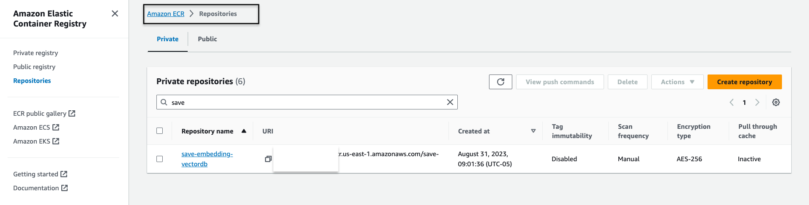
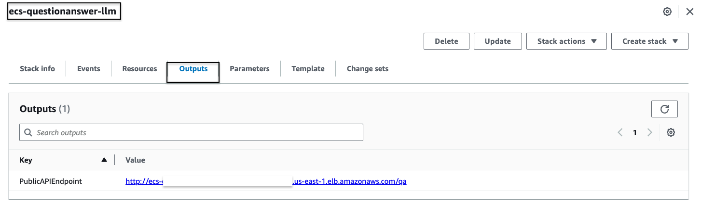

In today’s data-driven landscape, extracting meaningful insights from unstructured documents remains a challenge, inhibiting decision-making and innovation. Imagine being able to converse with your unstructured data, extracting valuable information with ease. In this tutorial, we will explore using AWS tools to create a vector databases, learn about Hugging Face embeddings, and seamlessly integrate Open source Langchain’s capabilities to engage with Large Language Models (LLMs) to build a website with an embedded NLP chatbot that interacts with our unstructured data. In this article we will go over the basics of Generative AI and then use those basics to extract meaningful insights from an unstructured document with the help of an Open source Large Language Model (https://huggingface.co/google/flan-t5-xxl). By the end of this tutorial, you’ll have a comprehensive understanding of how to derive meaningful insights from unstructured documents, and use the skills to explore and innovate with similar full stack AI-driven solutions.

| Attributes             |                                                                 |
|------------------------|-----------------------------------------------------------------|
| ✅ AWS experience      | 200 - Intermediate                                                        |
| ⏱ Time to complete    | 60 minutes                                                      |
| 💰 Cost to complete    | Free tier eligible                                               |
| 🧩 Prerequisites       | - [AWS Account](https://aws.amazon.com/resources/create-account/?sc_channel=el&sc_campaign=tutorial&sc_content=recommendation-engine-full-stack&sc_geo=mult&sc_country=mult&sc_outcome=acq)|
|  💻 Code Sample         | Code sample used in tutorial on [GitHub](https://github.com/build-on-aws/fullstack-llm-langchain-chatbot-on-aws)  |
|

| ToC |
|-----|

## What You'll Learn


## What We're Going to Build
In this example today, I want to mimic the problem that is faced by many enterprises. Most of today's data is not structured but is rather unstructured in the form of audio and video transcripts, pdf and word documents, manuals, scanned notes, social media dumps, etc. We will use flan-t5-xxl model as the Large Language Model. This model can produce summaries, Q&A responses from unstructured texts.

## Let's start with some basics
We will use a technique called as "In-Context" learning to inject domain or use case specific "context" into our LLM. In my case, I have an unstructured pdf manual of BMW that I want to add as "context" for my LLM and I want my LLM to answer questions about this manual. As simple as that!. And I want to go a step further. I want to create an API that takes in my question real time, sends it over to my backend and this API should be callable from my open source chatbot which is embedded in my Website. So we will build this entire experience and understand a lot of concepts along the way.

The very first step to provide in-context learning is to ingest the pdf document, break down the pdf document into text chunks and store these text chunks as vectors in a vector database. The vector representations of the text chunks are called embeddings. By converting text into embeddings and storing it in a vector database, we can identify the most identical pieces of information. Vector databases help us perform a "similarity search" against the text embeddings that are stored in it. We will use the Open source Hugging Face embeddings model and will take help of the Sagemaker Jumpstart to deploy the Hugging Face embeddings Model. Additionally, we will use AWS OpenSearch as a Vector Database.

## Diagrammatic overview of how to convert PDF Document into Embeddings and store in the Vector Database.


## Step 1 - Deploy Hugging Face Embeddings Model with Sagemaker Jumpstart
Within your Sagemaker Studio environment, use Sagemaker Jumpstart and select the GPT-J 6B Embedding FP16 embedding model and click on Deploy to deploy it onto the Sagemaker environment.


## Step 2 - Deploy the Flan T5 XXL LLM Model with AWS Jumpstart
Next within your Sagemaker Studio environment, use Sagemaker Jumpstart and select the Flan-T5 XXL FP16 Large Language Model(LLM) and click on Deploy to deploy it onto the Sagemaker environment.


## Step 3 - Find the embedding endpoint name and the flan-t5-xxl LLM in the sagemaker console and make note of their endpoint names, since we will use them in our code.

## Step 4 - Create the AWS OpenSearch Cluster
I've set up the OpenSearch cluster to be publicly accessible, enabling easy access. I've configured a master username and password for security and applied a permission policy to control domain access. One feature of OpenSearch is its support for k-Nearest Neighbors (k-NN). This functionality is incredibly valuable for similarity-based searches, allowing us to use OpenSearch effectively as a vector database. To explore further and learn about which versions of Elasticsearch/Open search support the k-NN plugin, you can refer to the following link: K-NN Plugin Documentation. 

Here are screenshots depicting the configuration of my AWS OpenSearch cluster.


## Step 5 - Create document ingestion pipeline that will create embeddings for your unstructured document and store them into AWS OpenSearch.
Now that we have setup the OpenSearch cluster as well as deployed the hugging face embeddings model and the t5 LLM endpoint, we will create a ingestion and processing batch pipeline that will read a pdf document when dropped into an S3 bucket, chunk the text from the document, convert the text chunks into embeddings and store the embeddings (i.e vector representations) into AWS OpenSearch so that we can perform similarity search later on. Dropping the file in the S3 bucket would trigger an event based workflow as depicted in the figure below. A fargate task will convert the text to embeddings and insert into AWS OpenSearch.

<b>Here is a Diagrammatic Overview of a production like document ingestion pipeline to store embeddings of text chunks into the OpenSearch vector database</b>


The code for document processing, building the embeddings and inserting into the AWS OpenSearch cluster is in `create-embeddings-save-in-vectordb`. Let's build the Dockerfile inside the `create-embeddings-save-in-vectordb` folder and push to AWS Elastic Container Registry (ECR). 


The screenshots below explain the code in `startup_script.py` file to create text embeddings using the Embedding Model deployed on AWS Sagemaker and to insert the embeddings into the AWS Opensearch Vector Database for similiarity search later on.


Now that we understand the code in `startup_script.py` file, build the `Dockerfile` from the same `create-embeddings-save-in-vectordb` folder and push the Image to AWS ECR. Once I push the image to AWS ECR this is how my ECR repository looks like :- 




Run the cloudformation template that will create the event based workflow from the GitHub Repository folder `Infrastructure/fargate-embeddings-vectordb-save.yaml`. Overide the parameters based on your AWS environment. Here is how my Cloudformation parameters looks like.


Creating this Cloudformation stack will create the S3 bucket, as well as create the plumbing for the S3 notification that will invoke a Lambda function which will in turn invoke the Fargate task which will execute the Docker container that executes startup-script.py file which will create the embeddings in AWS OpenSearch and create a new index by the name `carmanual`

After the Cloudformation is executed, drop the pdf representing the car manual into the S3 bucket. I have provided the sample test data named `car_manual.pdf` in the data folder. After the event based ingestion pipeline completes execution, this is how the AWS OpenSearch cluster looks like for the index `carmanual`.


## Step 6 - Build and deploy an API for providing real time "context" to the LLM and retrieve back meaningful responses.

Now that we have our text embeddings in the Vector Database powered by AWS OpenSearch, let us move to the next step where we will utilize the T5 Flan XXL Model to respond to inquiries about our car manual. We will use our saved embeddings in the vector database to <b>provide context</b> to the LLM and use the LLM's capabilities to interpret text to answer questions that we ask the LLM about our car manual. To implement our use case, we will rely heavily on Open source LangChain. LangChain is a Python framework that makes it easy to orchestrate and combine the various components that we need to create our real-time <b>context aware question-answer system powered by our LLM</b>. LangChain makes it easy for us to inject our car manual content into our prompt template, and send the final prompt to our LLM model.

The saved Embeddings in the Vector Database (AWS OpenSearch) capture the relationships between words and their meanings so that we can perform calculations with them. The difference between the Hugging Face embedding model and the T5 Flan LLM is that Embedding Model creates vector representations of our text chunks in such a way that it capture the meanings and relationships , while the T5 Flan LLM is a Language Model trained to generate contextually relevant text based on the context injected into our prompts and our queries. The idea is that Embeddings that are numerically similar are also semantically similar.

We aim to compare the users' questions with the text chunks by generating embeddings for the question and then comparing it with the other embeddings that are saved in the Vector Database. When we represent the text chunks and the user's question as vectors, <b>we can perform mathematical calculations to do context aware similarity search</b> . To gauge how similar two data points are, we must measure how close they are in a multi-dimensional space, a task accomplished through distance metrics.

In the image below, you can see where these components come into play.

<b>Diagrammatic overview of realtime Question and Answer support from T5-flan-XXL LLM.</b>


Now that we have seen the overall flow of how we will use LangChain and our T5 Flan LLM, let's briefly look at our code that we will expose as an API to which we will provide a question as input and it will return back a context aware response. The code for this is in the same GitHub repository and in the folder `RAG-langchain-questionanswer-t5-llm` . The API code depicted in the figure above is in `app.py` file.

<b>Here are some code snippets from `app.py` and some explanation in the below diagrams.</b>


Build a Docker container from the Dockerfile provided in the same folder and push the image to ECR repository. Here is how my image looks like in ECR.


Create the Cloudformation stack to build the ECS Cluster with a Fargate task by importing the Cloudformation tempalte from `Infrastructure/genai-chatbot-llm-rag-langchain.yaml` file. Override the following parameters as shown in the screen shot below and this will build out the ECS cluster with the Fargate task exposing the API .


Once my stack is built the Cloudformation Outputs tab shows the DNS Name of the fronting ALB for the ECS Fargate API which invokes the LLM Model for the question sent to it. Here is how my Output looks like:- 



You can test the API endpoint via curl command  by replacing the as follows:-
```bash 
curl -X POST -H "Content-Type: application/json" -d '{"question":"How can I clean my windshield?"}' http://quest-Publi-abc-xxxx.us-east-1.elb.amazonaws.com/qa
```
You will see a response as shown below 
```bash 
{"response":"To clean sensors and camera lenses, use a cloth moistened with a small amount of glass detergent."}
```

## Step 7 - Build and deploy a Website with an embedded Chatbot that is integrated to our API.

Next we move on to the last step for our full stack pipeline, which is integrating the API with our open source embedded chatbot using opensource botkit in a HTML website. For this website and the embedded chatbot, our source code is a node based application consisting of an index.html integrated with open source botkit.js as the chatbot. To make things easy I have created a Dockerfile and provided it alongside the code in the folder `homegrown_website_and_bot`. Once again, build the Docker container and push the image to AWS ECR repository.

After the image for the front end is pushed to the ECR repository, build the Cloudformation stack by importing the `fargate-website-chatbot.yaml` file in the `Infrastructure` folder. Override the values of vpc,subnets and `QUESTURL` while creating the stack.


## Step 8 - See the whole thing working. Checkout our Car Savvy AI Assistant

Get the DNS name of the ALB for the front end from the Cloudformation outputs tab


Hit this end point url in the browser and this is how the website looks .


## What's Next ?

I want to try this setup using some other LLM's like Cohere and other Vector DB's like Redis. Hopefully, the above shows you how you can build your own production ready full stack pipelines for Generative AI Models and integrate the pipeline with your front end and embedded NLP chatbots. Let me know other things that you want to read about using Open source , analytics, machine learning and AWS technologies!

## Clean Up Steps

Delete the pdf file from the s3 bucket.
Delete the 3 Cloudformation stacks.
Delete the 2 deployed endpoints in Sagemaker.


