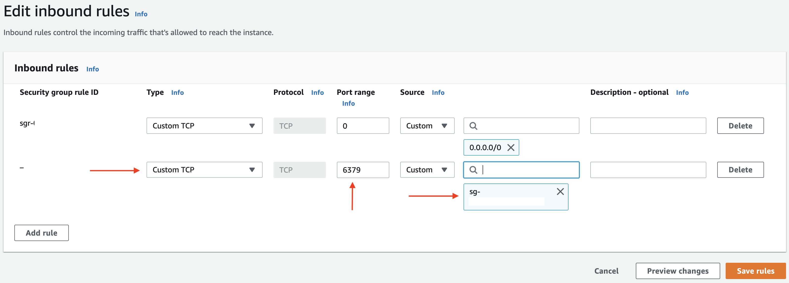
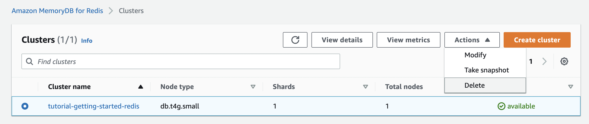

Amazon MemoryDB for Redis is a Redis compatible, durable, in-memory database service with which you can build applications using the same flexible and friendly Redis data structures, APIs, and commands.

This tutorial will get you started with Amazon MemoryDB for Redis and Java using the [Jedis client library](https://github.com/redis/jedis).

## What you will learn

- Create a Memory DB for Redis cluster along with an AWS Cloud9 environment (using the AWS Management console)
- Grant access to the cluster so that it's accessible from AWS Cloud9
- Configure and run a Java application (from AWS Cloud9 environment) to execute basic Redis commands on MemoryDB and also model a leaderboard solution (a popular use case for Redis).

## Sidebar

| Attributes                |                                   |
| ------------------- | -------------------------------------- |
| ✅ AWS Level        | Beginner                               |
| ⏱ Time to complete | 30 minutes                                 |
| 💰 Cost to complete | Free when using the AWS Free Tier |

## Prerequisites

An AWS Account (if you don't yet have one, please create one and [set up your environment](https://aws.amazon.com/getting-started/guides/setup-environment/). [Follow these steps](https://docs.aws.amazon.com/memorydb/latest/devguide/set-up.html) to complete the one-time actions you must take to start using MemoryDB, such as getting an AWS Access Key, configuring your credentials, etc.

For the purposes of this tutorial, we will use [the default VPC](https://docs.aws.amazon.com/vpc/latest/userguide/default-vpc.html) which is available in each AWS Region. It comes with a public subnet in each Availability Zone, an internet gateway, and settings to enable DNS resolution.

> You can [view your default VPC and subnets](https://docs.aws.amazon.com/vpc/latest/userguide/default-vpc.html#view-default-vpc) using the Amazon VPC console or the command line.

The upcoming sections will guide you through how to:

1. Setup a single node Amazon MemoryDB for Redis cluster
2. Set up an AWS Cloud9 instance
3. Configure Cloud9 instance to access Amazon MemoryDB for Redis cluster

## Setup an Amazon MemoryDB for Redis cluster

Sign in to the AWS Management Console and open the MemoryDB for Redis console at https://console.aws.amazon.com/memorydb/

Choose **Clusters** In the left navigation pane and then choose **Create cluster**.


Complete the **Cluster info** section.

In **Name**, enter a name for your cluster. In the **Description** box, enter a description for this cluster.


In **Subnet groups** section, choose **Create a new subnet group**. From the **VPC ID** dropdown, select the *default* VPC.


To choose subnet, choose **Manage**. In the **Manage subnets** section, select one subnet and click **Choose**.


In **Selected subnets** section, you should see the selected subnet.


Complete the **Cluster settings** section.

- For **Redis version compatibility**, accept the default *6.2*
- For **Port**, accept the default *6379*
- For **Parameter groups**, accept the default *default.memorydb-redis6* parameter group
- For **Node type**, choose *db.t4g.small*
- For **Number of shards**, enter *1* and for **Replicas per shard**, enter *0* - This will result in a single node cluster with one shard that has 1 Primary node and no replica nodes. It is sufficient for this tutorial.


Choose **Next** to move to the **Advanced settings** section.
To select Security group, choose **Manage**. 


In the **Manage security groups** section, choose the *default* security group for your VPC


You should see the selected Security group.


For **Encryption key** and **Encryption in transit**, accept the defaults.

For **Access control lists (ACL)**, choose **Create ACL** (a new window will open)


In **ACL settings** section, enter **ACL Name** and choose **Create user** (a new window will open).


In **User settings** section under **Create user**, enter **User name**. In **Passwords** section, enter **Password 1**

> [Password constraints](https://docs.aws.amazon.com/memorydb/latest/devguide/clusters.acls.html#rbac-using): Passwords must be 16–128 printable characters. The following nonalphanumeric characters are not allowed: `, "" / @`.

For **Access String**, enter `on ~* &* +@all` and choose **Create** to proceed.


In **Create access control list (ACL)**, from Selected users choose **Manage**, select the user you just created and click **Choose**.


CLick **Create** to create the ACL.


Select the ACL you just created.


Accept defaults for rest of the configuration and choose **Next**.


Review the final cluster settings and choose **Create**.


> As soon as your cluster becomes available, you're billed for each hour or partial hour that the cluster is active, even if you're not actively using it. To stop incurring charges for this cluster, you must delete it.

Wait for cluster to become available.


Note down the MemoryDB **Cluster endpoint**.

## Setup an AWS Cloud9 environment

Sign in to the AWS Cloud9 console: https://console.aws.amazon.com/cloud9/

Choose **Create environment**.

> If you have no AWS Cloud9 environments yet, the button is shown on a welcome page.


On the **Name environment** page, for **Name**, enter a name for your environment. For **Description**, enter something about your environment and choose **Next** step.


On the **Configure settings** page, for Environment type, choose **Create a new EC2 instance for environment (direct access)**. This launches an Amazon EC2 instance that AWS Cloud9 can connect to directly over SSH.

For **Instance type**, leave the default choice. This choice has relatively low RAM and vCPUs, which is sufficient for this tutorial.

For **Platform**, choose **Amazon Linux 2** as the Amazon EC2 instance that you want.

Accept default value for **Cost-saving** setting - When all web browser instances that are connected to the IDE for the environment are closed, AWS Cloud9 waits the amount of time specified and then shuts down the Amazon EC2 instance for the environment.


Expand **Network settings (advanced)**.

AWS Cloud9 uses Amazon Virtual Private Cloud (Amazon VPC) to communicate with the newly created Amazon EC2 instance. For this tutorial, choose the VPC you used for MemoryDB.


Choose **Next**. On the **Review** page, choose **Create environment**. 


Wait while AWS Cloud9 creates your environment. This can take several minutes.


After AWS Cloud9 creates your environment, it displays the AWS Cloud9 IDE for the environment.


## Access MemoryDB from AWS Cloud9

MemoryDB clusters are designed to be accessed from an Amazon EC2 instance. A common scenario is to access a MemoryDB cluster from an Amazon EC2 instance (created by AWS Cloud9) in the same Amazon Virtual Private Cloud (Amazon VPC), which will be the case for this tutorial.

Before you can connect to a cluster from an EC2 instance, you must authorize the EC2 instance to access the cluster.

In **Environment details** section of your AWS Cloud9 instance, copy the the security group ID for your Cloud9 instance.


Open the security group for your MemoryDB cluster, available under **Network and security** settings.


Under **Inbound Rules**, select **Edit Inbound Rules** and then select **Add Rule**. This security group will allow access to members of another security group.


From Type choose **Custom TCP** Rule.

For **Port Range**, specify the port *6379* for MemoryDB cluster.

In the **Source** box, enter the ID of the AWS Cloud9 security group. and select the security group from the list.

Choose **Save rules**.



You are now ready to connect to the MemoryDB cluster from Cloud9.

## Run a Java program from AWS Cloud9 to connect to MemoryDB

The AWS Cloud9 IDE [supports many programming languages](https://docs.aws.amazon.com/cloud9/latest/user-guide/language-support.html), including Java.

> Enhanced support for Java SE 11 features can be activated in AWS Cloud9 EC2 development environments with 2 GiB or more of memory. For more information, see [Enhanced support for Java development](https://docs.aws.amazon.com/cloud9/latest/user-guide/enhanced-java.html).

You will run a sample Java program to connect and execute operations on MemoryDB. This tutorial uses the [Jedis client](https://github.com/redis/jedis) library, but there are several other open-source Java clients for Redis including [Lettuce](https://lettuce.io/) and [Redisson](https://redisson.org/).

To start a terminal session in AWS Cloud9, choose **Window**, **New Terminal** on the menu bar. Or, choose the "plus" icon next to the **Console** tabs and choose **New Terminal**.


Check Java version. 

```bash
java -version

#output
openjdk version "11.0.16.1" 2022-08-12 LTS
OpenJDK Runtime Environment Corretto-11.0.16.9.1 (build 11.0.16.1+9-LTS)
OpenJDK 64-Bit Server VM Corretto-11.0.16.9.1 (build 11.0.16.1+9-LTS, mixed mode)
```
> The version might differ in your case

Install [Maven](https://maven.apache.org/index.html)

```
sudo wget http://repos.fedorapeople.org/repos/dchen/apache-maven/epel-apache-maven.repo -O /etc/yum.repos.d/epel-apache-maven.repo

sudo sed -i s/\$releasever/6/g /etc/yum.repos.d/epel-apache-maven.repo

sudo yum install -y apache-maven
```

Clone GitHub repo

Go to the terminal window or open a new one.

```bash
git clone TODO
cd TODO
```

Set environment variables required by the application.

```bash
export MEMORYDB_ENDPOINT_URL=<enter cluster endpoint>
export MEMORYDB_USERNAME=<enter username>
export MEMORYDB_PASSWORD=<enter password>
```

Run the program

```bash
mvn compile && mvn exec:java
```

You will see an output similar to this.

```
foo==bar
adding player scores
fetching top 5 players!
[player-20,8.916911121480902]
[player-3,8.410280717852055]
[player-15,7.497831450052759]
[player-7,7.462831549151375]
[player-13,7.374095678576235]
```

## Code walk through

The file `src/main/java/com/example/MemoryDBSampleApp.java` contains logic to connect to MemoryDB and execute Redis operations.

> You can refer to the code in this GitHub repo TODO

Let's take a look at code snippets different parts of the program.

**Connect to MemoryDB**

Since MemoryDB is a Redis Cluster, you need a cluster compatible client. We create an instance of `JedisCluster` and connect in SSL mode along with a username and password (from the MemoryDB ACL user created earlier in the tutorial):

```java
Set<HostAndPort> jedisClusterNodes = new HashSet<>();
String host = endpointURL.split(":")[0];
Integer port = Integer.valueOf(endpointURL.split(":")[1]);

jedisClusterNodes.add(new HostAndPort(host, port));

jedis = new JedisCluster(jedisClusterNodes,DefaultJedisClientConfig.builder().ssl(true).user(username).password(password).build());
```

Execute a basic [SET](https://redis.io/commands/set/) and [GET](https://redis.io/commands/get/) operations (for key `foo`):

```java
public static void setAndGet() {
    jedis.set("foo", "bar");
    System.out.println("foo="+jedis.get("foo"));
}
```

**Simulate a Leaderboard**

Use [ZADD](https://redis.io/commands/zadd/) to populate a Redis Sorted Set with random player data and query the top players by score (leader board) using [ZREVRANGE](https://redis.io/commands/zrevrange/):

```java
public static void leaderboard(int topN) {
    System.out.println("adding player scores");

    for(int i = 1; i <= 20; i++) {
        jedis.zadd(topPlayersSortedSet, Math.random()*10, "player-"+i);
    }

    System.out.println("fetching top "+ topN+" players!");

    List<Tuple> topPlayers = jedis.zrevrangeWithScores(topPlayersSortedSet, 0, (topN-1));
    
    for(Tuple player: topPlayers){
        System.out.println(player);
    }
}
```

## Delete MemoryDB cluster

Sign in to the AWS Management Console and open the MemoryDB for Redis console at https://console.aws.amazon.com/memorydb/

To choose the cluster to delete, choose the radio button next to the cluster's name from the list of clusters. In this case, the name of the cluster you created earlier in this tutorial.

For **Actions**, choose **Delete**.



Select **No** for **Create snapshot**. Then, enter *delete* in the confirmation box and choose **Delete** to delete the cluster.


As soon as your cluster is no longer listed in the list of clusters, you stop incurring charges for it.

## Delete AWS Cloud9 environment

Sign in to the AWS Cloud9 console: https://console.aws.amazon.com/cloud9/

Choose the environment you created earlier in the tutorial, and then choose **Delete**.


In the **Delete** dialog box, enter *Delete*, and then choose **Delete**. The operation takes a few minutes.


## Conclusion

In this tutorial, you setup a MemoryDB cluster along with a AWS Cloud9 environment. Then you configured the security group settings to allow AWS Cloud9 to access the MemoryDB cluster and executed a Java program to interact with MemoryDB using Jedis client for Redis.

Now that you have tried this tutorial, you can explore the following sections to learn more about MemoryDB:

- High-level overview of [MemoryDB features](https://docs.aws.amazon.com/memorydb/latest/devguide/servicename-feature-overview.html)
- How to [manage MemoryDB clusters](https://docs.aws.amazon.com/memorydb/latest/devguide/clusters.html)?
- Adopt [best practices](https://docs.aws.amazon.com/memorydb/latest/devguide/bestpractices.html)
- When to [use MemoryDB or ElastiCache for Redis](https://docs.aws.amazon.com/memorydb/latest/devguide/related-services-choose-between-memorydb-and-redis.html)?
