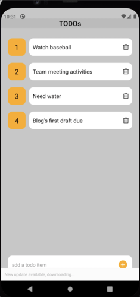

In this post we're going to take a React Native Todo app and address few of the common issues faced by developers. We will start by looking into offline first app development, which is basically an approach that in case users' mobile device loses connectivity how can we handle allowing the app to continue to function by persisting data on the device itself and for that we will take look into adding Amplify DataStore client library to handle that for us. We will first demonstrate this without using any external environment in the cloud. Next, we will gradually add integration with AWS using Amplify to add authentication. Lastly, we will establish cloud backend resources and use AWS Amplify DataStore to help orchestrate data synchronization between the time our device lost connectivity and the time it regained connection and update our AWS backend storage for our Todo app.

## What you will learn

- Handling offline data storage on-device via Amplify DataStore by adding aws-amplify library dependency to your app.
- Adding authentication with Amplify Auth.
- Use of Amplify DataStore to orchestrate data synchronization between mobile app and Amplify's backend services.

## Sidebar
| Info                | Level                                  |
| ------------------- | -------------------------------------- |
| ✅ AWS Level        | Beginner                               |
| ⏱ Time to complete  | 45 minutes                                 |
| 💰 Cost to complete | Free when using the AWS Free Tier |

## Prerequisites

Before starting this tutorial, you will need the following:

 - An AWS Account (if you don't yet have one, please create one and [set up your environment](https://aws.amazon.com/getting-started/guides/setup-environment/)).
 - Nodejs version 14.x or latest [installed](https://nodejs.org/en/download/).
 - AWS Amplify CLI installed and configured to connect to your AWS account - see [getting started](https://docs.amplify.aws/cli/start/install/).
 - Have your [local environment setup](https://docs.expo.dev/get-started/installation/) for React Native development using Expo CLI.
 

## Sections
- [What you will learn](#what-you-will-learn)
- [Sidebar](#sidebar)
- [Prerequisites](#prerequisites)
- [Sections](#sections)
- [TODOs App](#todos-app)
- [Amplify DataStore persisting data on device](#amplify-datastore-persisting-data-on-device)
- [Using Amplify to add authentication](#using-amplify-to-add-authentication)
- [Testing happy path](#testing-happy-path)
- [Simulating Network Connectivity Issue](#simulating-network-connectivity-issue)
- [Testing a delete operation](#testing-a-delete-operation)
- [Adding a Sing Out button](#adding-a-sing-out-button)
- [What next](#what-next)

---

## TODOs App
We're working off of a very simple React Native app that for now simply takes some tasks and displays them. You can also delete the todo items and it removes them from the UI. However, what this app can not do at this time is to store these updates anywhere. If you add an item or delete an item, kill the app and re-start it none of your changes are persisted anywhere.

 

However, there are few problems. One is if the app is closed and or re-loaded we lose our todo items, see screenshot below. Also, our app lacks authentication, and in addition at some point we would ideally want to synchronize its data back and forth to a backend service.

App re-loading | App after re-loading
- | -
 | 

First, a high level overview of the code base for the app before evolving its features. There are two main components, `TodoInput.js` and `TodoItem.js` that are then are referenced in our `App.js` to bring everything together.

Let's start with **`TodoInput.js`**

```javascript
import React, { useState } from 'react';
import { KeyboardAvoidingView, StyleSheet, View, TextInput, TouchableOpacity, } from "react-native";
import { AntDesign } from '@expo/vector-icons';

export default TodoInput = (props) => {
    const [task, setTask] = useState();

    const handleAddTask = (value) => {
        props.addTask(value);
        setTask(null);
    }

    return (
        <KeyboardAvoidingView
            behavior={Platform.OS === "ios" ? "padding" : "height"}
            style={styles.container}
        >
            <TextInput style={styles.inputField} value={task} onChangeText={text => setTask(text)} placeholder={'add a todo item'} placeholderTextColor={'#888'} />
            <TouchableOpacity onPress={() => handleAddTask(task)}>
                <View style={styles.button}>
                    <AntDesign name="pluscircle" size={24} color="orange" />
                </View>
            </TouchableOpacity>
        </KeyboardAvoidingView>
    );
}

const styles = StyleSheet.create({
    container: {
        borderColor: '#fff',
        backgroundColor: '#fff',
        borderWidth: 1,
        marginHorizontal: 20,
        borderRadius: 12,
        flexDirection: 'row',
        alignItems: 'center',
        justifyContent: 'space-between',
        paddingHorizontal: 10,
        position: 'absolute',
        bottom: 20,
    },
    inputField: {
        color: '#000',
        height: 50,
        flex: 1,
    },
    button: {
        height: 30,
        width: 30,
        borderRadius: 5,
        backgroundColor: '#fff',
        alignItems: 'center',
        justifyContent: 'center'
    },
});
```

The above component renders an input field in which we can simply provide a todo task. The second component, **`TodoItem.js`** is responsible to display a list of one or more todo items

```javascript
import React from 'react';
import { StyleSheet, Text, View, TouchableOpacity, } from "react-native";
import { AntDesign } from '@expo/vector-icons';

export default TodoItem = (props) => {
    return (
        <View style={styles.container}>
            <View style={styles.indexContainer}>
                <Text style={styles.index}>{props.index}</Text>
            </View>
            <View style={styles.todoContainer}>
                <Text style={styles.task}>{props.task}</Text>
                <TouchableOpacity onPress={() => props.deleteTask()}>
                    <AntDesign style={styles.delete} name="delete" size={18} color='#000' />
                </TouchableOpacity>
            </View>
        </View>
    );
}


const styles = StyleSheet.create({
    container: {
        flexDirection: 'row',
        marginHorizontal: 20,
    },
    indexContainer: {
        alignItems: 'center',
        justifyContent: 'center',
        width: 50,
        height: 50,
        backgroundColor: '#ffa500',
        borderRadius: 12,
        marginRight: 10,
    },
    index: {
        color: '#000',
        fontSize: 20,
    },
    todoContainer: {
        alignItems: 'center',
        flex: 1,
        paddingHorizontal: 10,
        paddingVertical: 5,
        minHeight: 50,
        backgroundColor: '#fff',
        borderRadius: 12,
        flexDirection: 'row',
        justifyContent: 'space-between'
    },
    task: {
        color: '#000',
        width: '90%',
        fontSize: 16,
    },
    delete: {
        marginLeft: 10
    },
});
```
Now to bring everything together as one here is **`App.js`**

```javascript
import React, { useEffect, useState } from 'react';
import { Keyboard, ScrollView, StyleSheet, Text, View } from 'react-native';
import TodoInput from './components/TodoInput';
import TodoItem from './components/TodoItem';

export default function App() {
  const [tasks, setTasks] = useState([]);

  const addTask = async (task) => {
    if (task == null) return;
    Keyboard.dismiss();
  }

  const deleteTask = (task, deleteIndex) => {
    setTasks(tasks.filter((value, index) => index != deleteIndex));
  }

  return (
    <View style={styles.container}>
      <Text style={styles.heading}>TODOs</Text>
      <ScrollView style={styles.scrollView}>
        {
          tasks.map((task, index) => {
            return (
              <View key={index} style={styles.taskContainer}>
                <TodoItem index={index + 1} task={task.task} deleteTask={() => deleteTask(task, index)} />
              </View>
            );
          })
        }
      </ScrollView>
      <TodoInput addTask={addTask} />
    </View>
  );
}

const styles = StyleSheet.create({
  container: {
    backgroundColor: '#c0c0c0',
    flex: 1
  },
  heading: {
    color: '#000',
    fontSize: 20,
    fontWeight: '600',
    marginTop: 30,
    marginBottom: 10,
    textAlign: 'center',
  },
  scrollView: {
    marginBottom: 70,
  },
  taskContainer: {
    marginTop: 20,
  }
});
```


## Amplify DataStore persisting data on device

In order to add Amplify DataStore functionality to our project without fully integrating with AWS cloud services we're going to first run:

```bash
npx amplify-app@latest
```

As a result of running `npx amplify-app` a new script entry was added our project's `package.json`: 
```json
"amplify-modelgen": "node amplify/scripts/amplify-modelgen.js",
```
Why do we care? To re-iterate, at this point we're going to persist our todo items in our device's local storage. So, we need to have some sort of schema to model our data around. Amplify DataStore is built on top of AWS AppSync and uses GraphQL schema definition language as an abstraction for how it communicates with various AWS services by using AWS Appsync as its API layer. In our case we're not using AppSync, not just yet. We just need to let DataStore's client library handle all the CRUD operations for us and that requires that our data is modeled as graphql schema. DataStore will handle all the communication protocols with the underlying local storage for us. 

Before running the script let's head to `amplify/backend/api/amplifyDatasource/schema.graphql`. This directory and its content were just generated for us when we execute `npx amplify-app`. We're going to modify its content with our schema of todo item: 

```javascript
type Task @model {
  id: ID!
  task: String!
}
```

This is not the most elaborate schema but simple enough to get the point across. However, few things to point out here. `@model` in Amplify terms is using a transform library that creates a schema and CRUD operations on a DynamoDB table behind the scenes from our `Todo` base type up there. Great thing about all this is that we get it by just running the script that's going to be pulled down for us when we executed 

```bash
npx amplify-app@latest
```
We got our schema setup so now let's generate the resources that tell Amplify what model we need to generate:

```bash
npm run amplify-modelgen
```
The end result of executing the script is that Amplify will generate the model for us under `src/models/`. In our code we will `import` from there to get a reference to our model in order to use for database operations. Take a peek under that directory and you will see number of javascript and typescript files containing the our model and other logic that DataStore requires to handle communication with local storage.

Let's add dependencies for Amplify client libraries in addition to what React Native itself requires for local storage. Amplify DataStore library will use them under the hood to make it seamless for developers to handle database transactions:

```bash
npm install aws-amplify @react-native-community/netinfo @react-native-async-storage/async-storage
```

Let's look at code changes required by thinking about where are the integration points. For us they are when we create a todo item and when we delete one.

Starting with adding/creating items which is handled in **`TodoInput.js`**:

```javascript
import { DataStore } from "aws-amplify";
import { Todo } from "../src/models";

export default TodoInput = (props) => {
    const [task, setTask] = useState();

    const handleAddTask = async (value) => {
        const newTodo = await DataStore.save(
            new Todo({
                task: value,
                id: Math.random().toString(36).substring(7)
            })
        )
        props.addTask(value);
        setTask(null);
    }
```

In this component's `handleAddTask` function expression we refactored it to instantiate a new Todo object, call the `save` method from Amplify's DataStore API `DataStore.save()`, then assigning a value passed from UI for Todo's value and finally an arbitrary id, that's it. Take note that we modified the function to use `aync-await` given we're going a database which is an asynchronous operation. Moving to **`App.js`** and main modifications:

```Javascript
useEffect(() => {
    fetchTasks();
  }, []);

  async function fetchTasks() {
    let DataStoreItems = await DataStore.query(Task);
    setTasks(DataStoreItems.map((item) => item));
  }

  async function deleteTaskFromStorage(deleteItem) {
    const todoDelete = await DataStore.query(Task, deleteItem);
    DataStore.delete(todoDelete);
  }
```

We added two new functions, `fetachTasks()` as the name implies fetches data from local storage on the device and sets the state when the app is loaded.
The second is to handle deletion, and the approach used is to query the item to be deleted first and then proceed with delete.
Why? Models in DataStore are immutable. To update or delete a record you must use a copy and then apply update or delete to the item's fields rather than mutating the instance directly. Below, can see this component in its entirety: 

```javascript
import React, { useEffect, useState } from 'react';
import { Keyboard, ScrollView, StyleSheet, Text, View } from 'react-native';
import TodoInput from './components/TodoInput';
import TodoItem from './components/TodoItem';
import { DataStore } from "aws-amplify";
import { Task } from "./src/models";

export default function App() {
  const [tasks, setTasks] = useState([]);

  useEffect(() => {
    fetchTasks();
  }, []);

  async function fetchTasks() {
    let DataStoreItems = await DataStore.query(Task);
    setTasks(DataStoreItems.map((item) => item));
    console.log('fetchTasks', DataStoreItems)
  }

  async function deleteTaskFromStorage(deleteItem) {
    const todoDelete = await DataStore.query(Task, deleteItem);
    DataStore.delete(todoDelete);
  }

  const addTask = async (task) => {
    console.log('addTask', task);
    if (task == null) return;
    fetchTasks();
    Keyboard.dismiss();
  }

  const deleteTask = (task, deleteIndex) => {
    deleteTaskFromStorage(task);
    setTasks(tasks.filter((value, index) => index != deleteIndex));
  }

  return (
    <View style={styles.container}>
      <Text style={styles.heading}>TODOs</Text>
      <ScrollView style={styles.scrollView}>
        {
          tasks.map((todo, index) => {
            return (
              <View key={index} style={styles.taskContainer}>
                <TodoItem index={index + 1} task={todo.task} deleteTask={() => deleteTask(todo, index)} />
              </View>
            );
          })
        }
      </ScrollView>
      <TodoInput addTask={addTask} />
    </View>
  );
}

const styles = StyleSheet.create({
  container: {
    backgroundColor: '#c0c0c0',
    flex: 1
  },
  heading: {
    color: '#000',
    fontSize: 20,
    fontWeight: '600',
    marginTop: 30,
    marginBottom: 10,
    textAlign: 'center',
  },
  scrollView: {
    marginBottom: 70,
  },
  taskContainer: {
    marginTop: 20,
  }
});
```

these are screenshots of when we have Amplify DataStore applied to enable local storage. As you can see the data has been persisted to device's local storage, therefore the UI still has access to data even after a re-load:

re-loading with DataStore | after re-loading
- | -
 | 


Below we are demonstrating a delete action. We deleted what used to be item 4 `Buy Coffee` and likewise when deleting an item we used Amplify DataStore to handle the local storage delete for us. Screenshots below depict this behavior:
App re-loading | App after re-loading
- | -
 | 


## Using Amplify to add authentication

Before adding authentication to our app there are few housekeeping we are required to do by Amplify. Using Amplify CLI first thing we need to is initialize our project by running the following command from the root of your project:

**`amplify init`** initializes a new project, sets up deployment resources in the cloud, and makes your project ready for Amplify.

resources created running `amplify init` are used by Amplify itself these are not part of your application. 

Now that we have initialized our app the result of `amplify-status` shows the state of local resources not yet pushed to the cloud (Create/Update/Delete). In our case `amplifyDatasource` API.


and a look at our AWS Amplify console we see that our app was deployed


Currently, the Authorization mode for the DataStore in the app is set to API key but we want to use AWS Cognito instead. We can execute **`amplify add auth`** to first add authentication using AWS Cognito followed by `amplify status` to see where we stand 


It's time to add the necessary dependency to `App.js` so Amplify can handle user registration and authentication for us on the UI.

```bash
npm install aws-amplify-react-native
```

`App.js` after adding dependency for authentication, note styles section not added here for brevity.

```javascript
import React, { useEffect, useState } from 'react';
import { Keyboard, ScrollView, StyleSheet, Text, View, Pressable } from 'react-native';
import TodoInput from './components/TodoInput';
import TodoItem from './components/TodoItem';
import { DataStore } from "aws-amplify";
import { Task } from "./src/models";
import { Amplify } from 'aws-amplify';
import awsconfig from './src/aws-exports';
import { withAuthenticator } from 'aws-amplify-react-native';
import { Auth } from 'aws-amplify';

Amplify.configure(awsconfig);

function App() {
  const [tasks, setTasks] = useState([]);

  useEffect(() => {
    fetchTasks();
  }, []);

  async function fetchTasks() {
    let dataStoreItems = await DataStore.query(Task);
    setTasks(dataStoreItems.map((item) => item));
    console.dir(dataStoreItems);
  }

  async function deleteTaskFromStorage(deleteItem) {
    const todoDelete = await DataStore.query(Task, deleteItem);
    DataStore.delete(todoDelete);
  }

  const addTask = async (task) => {
    console.log('addTask', task);
    if (task == null) return;
    fetchTasks();
    Keyboard.dismiss();
  }

  const deleteTask = (task, deleteIndex) => {
    deleteTaskFromStorage(task);
    setTasks(tasks.filter((value, index) => index != deleteIndex));
  }

  async function signOut() {
    try {
      await Auth.signOut();
    } catch (error) {
      console.log('error signing out: ', error);
    }
  }

  return (
    <View style={styles.container}>
      <Text style={styles.heading}>TODOs</Text>
      <ScrollView style={styles.scrollView}>
        <Pressable style={styles.button} onPress={signOut}>
          <Text style={styles.text}>Sing Out</Text>
        </Pressable>
        {
          tasks.map((todo, index) => {
            return (
              <View key={index} style={styles.taskContainer}>
                <TodoItem index={index + 1} task={todo.task} deleteTask={() => deleteTask(todo, index)} />
              </View>
            );
          })
        }
      </ScrollView>
      <TodoInput addTask={addTask} />
    </View>
  );
}
export default withAuthenticator(App);
...
```

Now, we can update our datastore to use AWS Cognito using `amplify update api` 


We can now push our changes to the cloud. Run `amplify push` and monitor its progress as it will a few minutes to complete and should see something similar as screenshot below:


At this point it's a good idea to take peek at our AWS backend that was setup for us by Amplify specifically DynamoDB which DataStore uses to store our data.


Start the app to see the signin/signup UI added for us via Amplify. Tap on `Sing Up`, complete the form and you should receive an email with your confirmation code. Once you provide you confirmation code, you will be redirected to signin page. Login with your username and password.

|

## Testing happy path
We're going to do some testing by adding a few test entries, and validate DataStore has sync'd the data on our DynamoDB table.

DynamoDB table before sync


adding few todo entries


and validate the sync on DynamoDB side

Both todo entries were sync'd via DataStore into DynamoDB table

## Simulating Network Connectivity Issue

To simulate a network connectivity issue - I did this by just disconnecting my WiFi on my laptop - then adding a new Todo entry in the app


 check DynamoDB to make sure new entry was not sync'd on a different computer
 

 after establishing WiFi connection we see that our new todo has been sync'd
 


## Testing a delete operation

We bought our bread, so go ahead and delete it from list in the app


Check the table and you can see that `Get bread` has been marked under `_deleted` column as `true`


## Adding a Sing Out button
Since we can sing in to the app let's also add a feature to sing out. Amplify 

In `App.js` to our imported list of `react-native` components add `Pressable`, import Amplify's `Auth` and right below the opening `<ScrollView>` make the changes seen below and add `<Pressable>`

```javascript
import { Keyboard, ScrollView, StyleSheet, Text, View, Pressable } from 'react-native';
import { Auth } from 'aws-amplify';
...
<ScrollView style={styles.scrollView}>
        <Pressable style={styles.button} onPress={signOut}>
          <Text style={styles.text}>Sing Out</Text>
        </Pressable>
```
then also include the function handling the `Sing Out` in `App.js`

```javascript
async function signOut() {
    try {
      await Auth.signOut();
    } catch (error) {
      console.log('error signing out: ', error);
    }
  }
```

reload your app


## What next

In regards to Amplify DataStore, we barely have scratched surface. We did not cover all of the data operations available via DataStore

- Review [Manipulating Data](https://docs.amplify.aws/lib/datastore/data-access/q/platform/react-native/#create-and-update) from Amplify docs
- Dive deepe in [Relational Model](https://docs.amplify.aws/lib/datastore/relational/q/platform/react-native/) and how GraphQL transforms are used in Amplify
- Setting up [Authorization Rules](https://docs.amplify.aws/lib/datastore/setup-auth-rules/q/platform/react-native/)
- Look into [conflict resolution strategies](https://docs.amplify.aws/lib/datastore/conflict/q/platform/react-native/) offered.
- Stop by and meet the AMplify team and other developers using Amplify by joining [Amplify Discord](https://discord.gg/amplify) 
