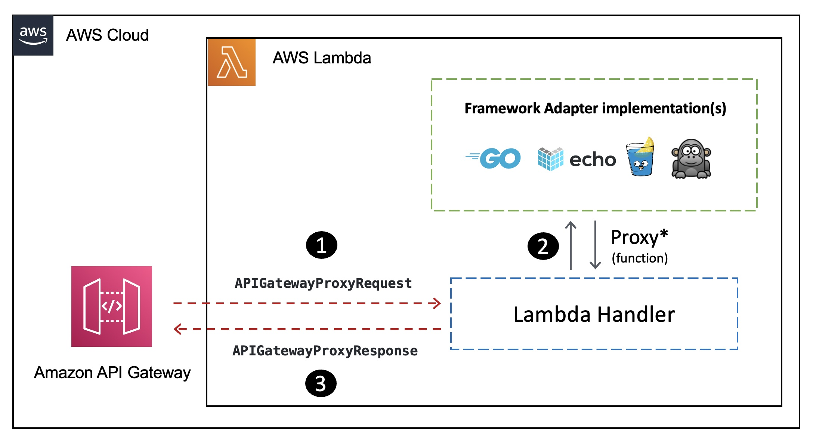
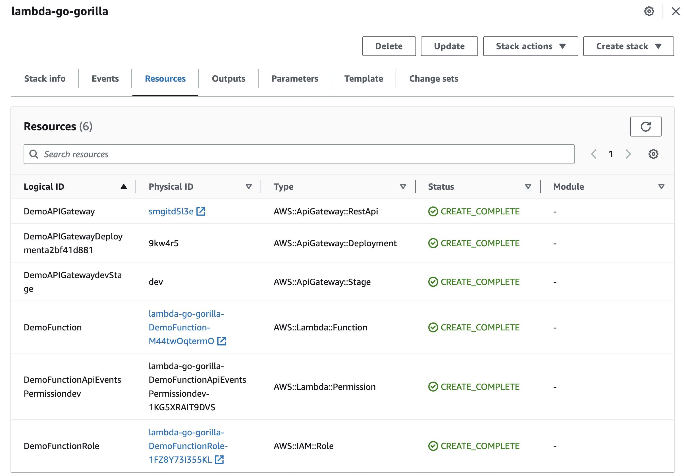

|ToC|
|---|

The [Go](http://go.dev/) programming language has always had rich support for building REST APIs. This includes an [excellent standard library (net/http)](https://pkg.go.dev/net/http) along with many popular packages such as [gorilla mux](https://github.com/gorilla/), [Gin](https://github.com/gin-gonic/gin), [negroni](https://github.com/urfave/negroni), [echo](https://echo.labstack.com/), [fiber](https://github.com/gofiber/fiber) etc.

Thanks to the [AWS Lambda Go runtime](https://docs.aws.amazon.com/lambda/latest/dg/golang-handler.html?sc_channel=el&sc_campaign=appswave&sc_content=golang-apis-on-aws-lambda&sc_geo=mult&sc_country=mult&sc_outcome=acq), you can use Go to build AWS Lambda functions. Imagine a web app that needs to authenticate users, store user data, and send emails. A Serverless approach for this would to implement each functionality/API as a separate Lambda function. For example, you could have a Lambda function to handle user registration, another to handle user login, and so on.

This is great if you are building everything from scratch. But what if you wanted to run existing Go REST APIs as AWS Lambda functions?
Broadly speaking, you would need to:

1. Split the existing code into multiple Lambda functions.
2. Refactor each of them to work with AWS Lambda Go runtime APIs.

With the **AWS Lambda Go API Proxy**, there is an easier way!

This blog will demonstrate how to run existing Go frameworks based APIs in a serverless way with AWS Lambda and Amazon API Gateway. You will walk through simple code examples for `net/http` package, `gorilla` and `echo` framework to understand how they work and deploy them using [AWS Serverless Application Model](https://docs.aws.amazon.com/serverless-application-model/latest/developerguide/what-is-sam.html?sc_channel=el&sc_campaign=appswave&sc_content=golang-apis-on-aws-lambda&sc_geo=mult&sc_country=mult&sc_outcome=acq).

> The code is available in this [GitHub repository](https://github.com/build-on-aws/golang-apis-on-aws-lambda)

Let's start with a brief introduction to the AWS Lambda Go API Proxy.

## AWS Lambda Go API Proxy: How does it work?

The [aws-lambda-go-api-proxy](https://github.com/awslabs/aws-lambda-go-api-proxy) package makes it easy to run Go APIs written using frameworks (such as Gin) with AWS Lambda and [Amazon API Gateway](https://docs.aws.amazon.com/apigateway/latest/developerguide/welcome.html?sc_channel=el&sc_campaign=appswave&sc_content=golang-apis-on-aws-lambda&sc_geo=mult&sc_country=mult&sc_outcome=acq). In addition to adapter implementations for the `net/http` (Go standard library) and other frameworks such as `gorilla/mux`, `echo`, etc., `aws-lambda-go-api-proxy` also declares a `core` package that contains utility methods and interfaces to translate API Gateway proxy events into Go's default `http.Request` and `http.ResponseWriter` objects and allows you to adapt *any* framework to the AWS Lambda Go runtime.



Here is a gist on how it works at a high level:

1. The API Gateway request is accepted by the Lambda function handler.
2. The function handler proxies the request to the adapter implementation corresponding to the framework.
3. Finally, the API Gateway proxy response is returned to the client.

Let's look into the framework specific behavior.

### gorilla/mux library

Package `gorilla/mux` implements a request router and dispatcher for matching incoming requests to their respective handler. Like `http.ServeMux` in the Go standard library, `mux.Router` matches incoming requests against a list of registered routes and calls a handler for the route that matches the URL or other conditions. Because `gorilla/mux` implements the `http.Handler` interface, it is compatible with `http.ServeMux`.

Here is a simple example of a Lambda function that uses an adapter implementation to work with `gorilla/mux` package:

```go
var gorillaLambda *gorillamux.GorillaMuxAdapter

func init() {
	r := mux.NewRouter()

	r.HandleFunc("/ping", func(w http.ResponseWriter, r *http.Request) {
		json.NewEncoder(w).Encode(Response{From: "gorilla", Message: time.Now().Format(time.UnixDate)})
	})

	gorillaLambda = gorillamux.New(r)
}

func Handler(ctx context.Context, req events.APIGatewayProxyRequest) (events.APIGatewayProxyResponse, error) {
	r, err := gorillaLambda.ProxyWithContext(ctx, *core.NewSwitchableAPIGatewayRequestV1(&req))
	return *r.Version1(), err
}

func main() {
	lambda.Start(Handler)
}
```

- In the `init` function: `gorillamux.New` function takes in a `mux.Router` (which has the `HTTP` `GET` route defined) and returns a `gorillamux.GorillaMuxAdapter`.
- In the `Handler` implementation:
  - The `Proxy` (or `ProxyWithContext`) method of the `gorillamux.GorillaMuxAdapter` object receives the `events.APIGatewayProxyRequest`, converts it into a `http.Request` object, and sends it to the `mux.Router` for routing.
  - It returns a proxy response object (`events.APIGatewayProxyResponse`) generated from the data written to the response writer (`http.ResponseWriter`).

### echo framework

Echo another popular Go web framework which is minimalist, yet highly extensible.

Here is a simple example of a Lambda function that uses an adapter implementation to work with the `echo` framework:

```go
var echoLambda *echoadapter.EchoLambda

func init() {
	e := echo.New()

	e.Use(middleware.Logger())
	e.Use(middleware.Recover())

	e.GET("/ping", func(c echo.Context) error {
		return c.JSON(http.StatusOK, Response{From: "echo", Message: time.Now().Format(time.UnixDate)})
	})

	echoLambda = echoadapter.New(e)
}

func Handler(ctx context.Context, req events.APIGatewayProxyRequest) (events.APIGatewayProxyResponse, error) {
	return echoLambda.ProxyWithContext(ctx, req)
}

func main() {
	lambda.Start(Handler)
}
```

The concept is similar to the previous example.

- The `init` function sets up the router (`echo.Echo`) and passes it into the `echoadapter.New` thar returns a `echoadapter.EchoLambda` (the adapter implementation).
- In the `Handler` function:  
  - The `ProxyWithContext` method of the `echoadapter.EchoLambda` object receives the `events.APIGatewayProxyRequest` object and converts it into an `http.Request` object and sends it to `echo.Echo` for routing.
  -  It returns a proxy response object (`events.APIGatewayProxyResponse`) generated from the data written to the response writer (`http.ResponseWriter`).

### net/http package

The adapter implementation for `net/http` also works the same way. Here is the code snippet:

```go
var httpLambda *httpadapter.HandlerAdapter

func init() {
	http.HandleFunc("/ping", func(w http.ResponseWriter, r *http.Request) {
		json.NewEncoder(w).Encode(Response{From: "net/http", Message: time.Now().Format(time.UnixDate)})
	})

	httpLambda = httpadapter.New(http.DefaultServeMux)
}

func Handler(ctx context.Context, req events.APIGatewayProxyRequest) (events.APIGatewayProxyResponse, error) {

	return httpLambda.ProxyWithContext(ctx, req)
}

func main() {
	lambda.Start(Handler)
}
```

- To use with the standard library, the `httpadapter.New` function takes in a `http.Handler` (which has the route defined) and returns a `httpadapter.HandlerAdapter` object.
- The `ProxyWithContent` method on the `httpadapter.HandlerAdapter` can then be used as a Lambda handler.

Let's see how this works in practice.

## Deploy to AWS Lambda

Let's deploy each of these functions to AWS Lambda using the SAM CLI.

### Pre-requisites

Before you proceed, make sure you have the [Go programming language](https://go.dev/dl/) (**v1.18** or higher) and [AWS SAM](https://docs.aws.amazon.com/serverless-application-model/latest/developerguide/install-sam-cli.html?sc_channel=el&sc_campaign=appswave&sc_content=golang-apis-on-aws-lambda&sc_geo=mult&sc_country=mult&sc_outcome=acq) installed.

Clone the project and change to the right directory:

```bash
git clone https://github.com/build-on-aws/golang-apis-on-aws-lambda

cd golang-apis-on-aws-lambda
```

### gorilla/mux based Lambda function

First, update the `CodeUri` in `template.yaml` to `gorilla/` (which is the local folder where the code is located).

Build the function:

```bash
sam build

#expected output

Building codeuri: <path>/lambda-go-api-proxy-getting-started/gorilla runtime: go1.x metadata: {} architecture: x86_64 functions: DemoFunction
Running GoModulesBuilder:Build

Build Succeeded
....
```

Deploy the function (follow the SAM CLI prompts):

```bash
export STACK_NAME=lambda-go-gorilla

sam deploy --stack-name $STACK_NAME --guided

# response to the prompts

Stack Name [lambda-go-gorilla]: <press enter>
AWS Region [us-east-1]: <enter alternate region or press enter>
#Shows you resources changes to be deployed and require a 'Y' to initiate deploy
Confirm changes before deploy [y/N]: n
#SAM needs permission to be able to create roles to connect to the resources in your template
Allow SAM CLI IAM role creation [Y/n]: y
#Preserves the state of previously provisioned resources when an operation fails
Disable rollback [y/N]: n
DemoFunction may not have authorization defined, Is this okay? [y/N]: y
Save arguments to configuration file [Y/n]: y
SAM configuration file [samconfig.toml]: <press enter>
SAM configuration environment [default]: <press enter>
```

Once the deployment is complete, navigate to AWS `CloudFormation` console to check the deployed stack and associated resources. These include the Lambda function, [API Gateway (REST API)](https://docs.aws.amazon.com/apigateway/latest/developerguide/apigateway-rest-api.html?sc_channel=el&sc_campaign=appswave&sc_content=golang-apis-on-aws-lambda&sc_geo=mult&sc_country=mult&sc_outcome=acq), IAM role, etc.



You should see the API Gateway endpoint as the SAM CLI output (it will be different in your case) or the `CloudFormation` **Outputs** section.

```bash
-----------------------------------------------------------------------------------------------------
CloudFormation outputs from deployed stack
--------------------------------------------------------------------------------------------------------
Outputs                                                                                                
--------------------------------------------------------------------------------------------------------
Key                 APIGWEndpoint                                                                   
Description         API Gateway Endpoint                                                                                                
Value               https://whrd2yy3ug.execute-api.us-east-1.amazonaws.com/dev/ping                    
--------------------------------------------------------------------------------------------------------

Successfully created/updated stack - lambda-go-gorilla in us-east-1
```

To test the function, invoke the API Gateway using the following command:

```bash
export API_ENDPOINT=<enter the API Gateway endpoint here>

curl $API_ENDPOINT
```

You should get a `JSON` response similar to the following:

```json
{
  "from": "gorilla",
  "message": "Tue Jun 27 18:10:54 UTC 2023"
}
```

### net/http and echo based Lambda functions

Before you deploy either of these, make sure to update the `CodeUri` in `template.yaml` to refer to the local folder where the code is located:

- `http-stdlib/` in case of `net/http` package.
- `echo/` in case of `echo` framework.

Build and deploy the function (respond to the prompts, just like before):

```bash
sam build

# change the stack name to lambda-go-echo in case of "echo" framework
export STACK_NAME=lambda-go-nethttp

sam deploy --stack-name $STACK_NAME --guided
```

You can test the function by invoking the API Gateway endpoint:

```bash
export API_ENDPOINT=<enter your API endpoint here>

curl $API_ENDPOINT
```

You should get a `JSON` response similar to the following:

```json
{
  "from": "net/http",
  "message": "Tue Jun 27 18:20:42 UTC 2023"
}
```

In case of `echo` framework, you should get a `JSON` response similar to the following (notice the different name in the `from` field):

```json
{
  "from": "echo",
  "message": "Tue Jun 27 18:30:25 UTC 2023"
}
```

That's it! You have successfully deployed your Go APIs as AWS Lambda functions.

## Cleanup

Once you are done, delete the stacks:

```bash
sam delete --stack-name lambda-go-gorilla
sam delete --stack-name lambda-go-nethttp
sam delete --stack-name lambda-go-echo
```

## Conclusion

This blog post introduced you to the AWS Lambda Go API Proxy, and how it's framework/package (for `gorilla/mux`, `echo` and `net/http`) specific adapter implementations allow you to run existing Go applications as AWS Lambda functions fronted by an API Gateway. You learned the basic concepts with simple code examples, deployed these functions using AWS SAM CLI and verified it by invoking the API Gateway endpoint.

The AWS Lambda Go API Proxy also supports the [Gin](https://github.com/gin-gonic/gin), which one of the most popular Go web frameworks! The second part of this blog, will demonstrate how to run existing `Gin` framework based Go applications as AWS Lambda functions with the help of a simple (yet practical) URL shortener service.

Stay tuned!

|SeriesToc|
|---------|
