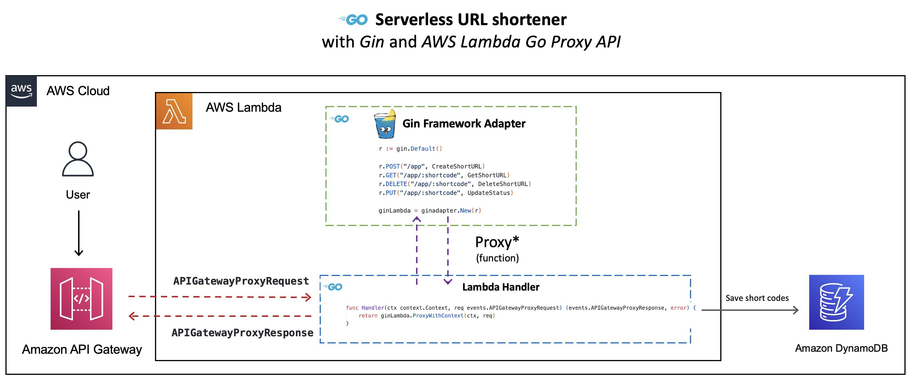
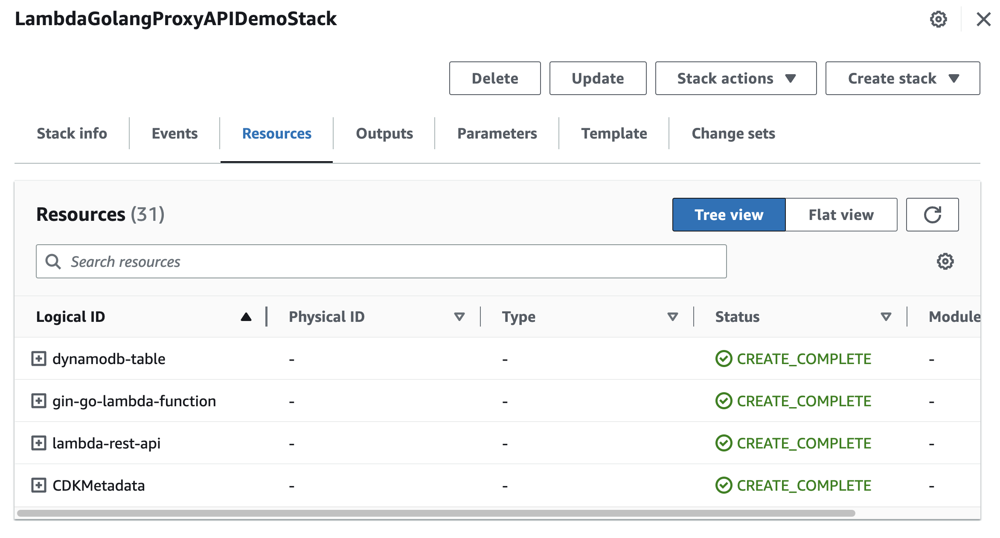
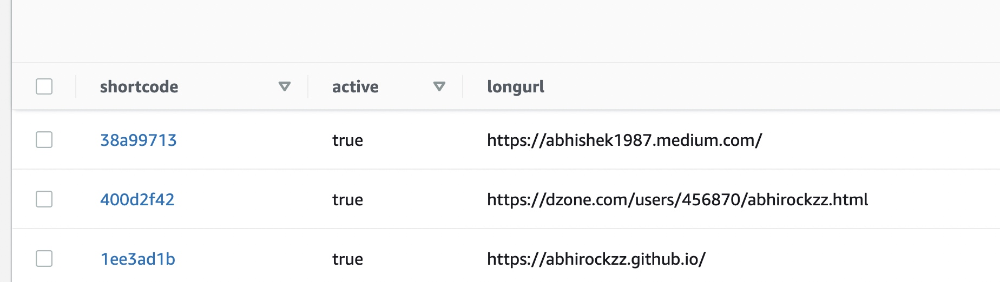

|ToC|
|---|

[The first part of this series](/tutorials/golang-and-aws-lambda/01-golang-apis-on-aws-lambda) introduced you to the [AWS Lambda Go API Proxy](https://github.com/awslabs/aws-lambda-go-api-proxy), and how it's framework/package specific adapter implementations (for `gorilla/mux`, `echo` and `net/http`) allows you to run existing Go applications as [AWS Lambda](https://docs.aws.amazon.com/lambda/latest/dg/welcome.html?sc_channel=el&sc_campaign=datamlwave&sc_content=02-golang-gin-app-on-aws-lambda&sc_geo=mult&sc_country=mult&sc_outcome=acq) functions fronted by [Amazon API Gateway](https://docs.aws.amazon.com/apigateway/latest/developerguide/welcome.html?sc_channel=el&sc_campaign=datamlwave&sc_content=02-golang-gin-app-on-aws-lambda&sc_geo=mult&sc_country=mult&sc_outcome=acq). If you haven't already, I encourage you to [take a look at it](/tutorials/golang-and-aws-lambda/01-golang-apis-on-aws-lambda) in order to get a basic understanding of the AWS Lambda Go API Proxy.

The AWS Lambda Go API Proxy also supports [Gin](https://github.com/gin-gonic/gin), is one of the most popular Go web frameworks! This follow-up blog post will demonstrate how take an existing URL shortener service written using the `Gin` framework, and run it as a serverless AWS Lambda function. Instead of using AWS SAM, we will change things up a bit and use the [AWS CDK](https://docs.aws.amazon.com/cdk/v2/guide/home.html?sc_channel=el&sc_campaign=datamlwave&sc_content=02-golang-gin-app-on-aws-lambda&sc_geo=mult&sc_country=mult&sc_outcome=acq) to deploy the solution.

> The code is available on [GitHub](https://github.com/build-on-aws/golang-gin-app-on-aws-lambda)

## How does the Gin adapter for AWS Lambda Go API Proxy work?

The `aws-lambda-go-api-proxy` package makes it possible to run Go APIs written using Gin, thanks to the framework specific adapter implementations.



To understand this, let's look into the `main.go` file of the Lambda function:

```go
var ginLambda *ginadapter.GinLambda

func init() {
	r := gin.Default()

	r.POST("/app", CreateShortURL)
	r.GET("/app/:shortcode", GetShortURL)
	r.DELETE("/app/:shortcode", DeleteShortURL)
	r.PUT("/app/:shortcode", UpdateStatus)

	ginLambda = ginadapter.New(r)
}

func Handler(ctx context.Context, req events.APIGatewayProxyRequest) (events.APIGatewayProxyResponse, error) {
	return ginLambda.ProxyWithContext(ctx, req)
}

func main() {
	lambda.Start(Handler)
}
```

- In the `init` function:
  - We use `gin.Default()` to create a `gin.Engine` object with the `Logger` and `Recovery` middleware already attached.
  - We create routes by associating a `gin.HandlerFunc` with each `HTTP` method and path using the `POST`, `GET`, `DELETE` and `PUT` methods of the `gin.Engine` object.
  - `ginadapter.New` function takes this `*gin.Engine` object and returns a `ginadapter.GinLambda`.
- In the `Handler` implementation:
  - The `Proxy` (or `ProxyWithContext`) method of the `ginadapter.GinLambda` object receives the `events.APIGatewayProxyRequest`, converts it into a `http.Request` object, and sends it to the `gin.Engine` for routing.
  - It returns a proxy response object (`events.APIGatewayProxyResponse`) generated from the data written to the response writer (`http.ResponseWriter`).

## Application overview

The sample application presented in this blog is a trimmed down version of `bit.ly` or other solutions you may have used. It uses [Amazon DynamoDB](https://docs.aws.amazon.com/amazondynamodb/latest/developerguide/Introduction.html?sc_channel=el&sc_campaign=datamlwave&sc_content=02-golang-gin-app-on-aws-lambda&sc_geo=mult&sc_country=mult&sc_outcome=acq) for persistence and exposes `HTTP` endpoints to access the application (basic CRUD operations).

Although we will not be discussing the application code in detail, it's important to understand the basic structure. Here is the package structure for the URL shortener application (in the [function](https://github.com/build-on-aws/golang-gin-app-on-aws-lambda/tree/main/function) directory):

```text
.
├── db
│   └── db.go
├── go.mod
├── go.sum
├── handler.go
├── main.go
```

- The `db` package contains code to interact with `DynamoDB`.
- The `handler.go` file has the implementation for the `HTTP` methods.
- The `main.go` file creates the Gin engine with the routes and `ginadapter.GinLambda` object to proxy requests and responses.

It's time to deploy the URL shortener application and give it a go!

## Prerequisites

Before you proceed, make sure you have the [Go programming language](https://go.dev/dl/) (**v1.18** or higher) and [AWS CDK](https://docs.aws.amazon.com/cdk/v2/guide/getting_started.html#getting_started_install?sc_channel=el&sc_campaign=datamlwave&sc_content=02-golang-gin-app-on-aws-lambda&sc_geo=mult&sc_country=mult&sc_outcome=acq) installed.

Clone the GitHub repository and change to the right directory:

```bash
git clone https://github.com/build-on-aws/golang-gin-app-on-aws-lambda

cd golang-gin-app-on-aws-lambda
```

## Use AWS CDK to deploy the solution

AWS CDK is a framework that lets you define your cloud infrastructure as code in one of its supported programming and provision it through [AWS CloudFormation](https://docs.aws.amazon.com/cloudformation?sc_channel=el&sc_campaign=datamlwave&sc_content=02-golang-gin-app-on-aws-lambda&sc_geo=mult&sc_country=mult&sc_outcome=acq). In this case, we will be using the [Go bindings for AWS CDK](https://docs.aws.amazon.com/cdk/v2/guide/work-with-cdk-go.html?sc_channel=el&sc_campaign=datamlwave&sc_content=02-golang-gin-app-on-aws-lambda&sc_geo=mult&sc_country=mult&sc_outcome=acq)

> You can refer to the code in the [cdk](https://github.com/build-on-aws/golang-gin-app-on-aws-lambda/tree/main/cdk) directory.

To start the deployment, invoke the `cdk deploy` command. You will see a list of resources that will be created and will need to provide your confirmation to proceed.

```bash
cd cdk

cdk deploy

# output

Bundling asset LambdaGolangProxyAPIDemoStack/gin-go-lambda-function/Code/Stage...

✨  Synthesis time: 5.94s

This deployment will make potentially sensitive changes according to your current security approval level (--require-approval broadening).
Please confirm you intend to make the following modifications:

//.... omitted

Do you wish to deploy these changes (y/n)? y
```

Enter `y` to start creating the AWS resources required for the application. This will start creating the AWS resources required for our application.

> If you want to see the AWS CloudFormation template which will be used behind the scenes, run `cdk synth` and check the `cdk.out` folder

You can keep track of the progress in the terminal or navigate to AWS console: `CloudFormation > Stacks > LambdaGolangProxyAPIDemoStack`

Once all the resources are created, you can try out the application. You should have:

- An [API Gateway REST API](https://docs.aws.amazon.com/apigateway/latest/developerguide/apigateway-rest-api.html?sc_channel=el&sc_campaign=datamlwave&sc_content=02-golang-gin-app-on-aws-lambda&sc_geo=mult&sc_country=mult&sc_outcome=acq).
- A Lambda function.
- A DynamoDB table to store application data.
- And a few other components (like `IAM` roles etc.).



## Try the URL shortener application

You will need the API Gateway endpoint to invoke with the application - it's available as part of the stack output (in the terminal or the **Outputs** tab in the AWS `CloudFormation` console for your stack). It should look something like this - `https://foobarbazl.execute-api.us-east-1.amazonaws.com/prod/`

### 1. Start by generating a short code

To generate a short code, you need to pass the original URL in the payload body as part of a `HTTP` `POST` request (for e.g. `https://abhirockzz.github.io/`)

```bash
# e.g. export URL_SHORTENER_APP_URL=https://foobarbazl.execute-api.us-east-1.amazonaws.com/prod/app
export URL_SHORTENER_APP_URL=<replace with API Gateway endpoint above>/app

# invoke the endpoint to create short code
curl -i -X POST -d '{"url":"https://abhirockzz.github.io/"}' $URL_SHORTENER_APP_URL
curl -i -X POST -d '{"url":"https://abhishek1987.medium.com/"}' $URL_SHORTENER_APP_URL
curl -i -X POST -d '{"url":"https://dzone.com/users/456870/abhirockzz.html"}' $URL_SHORTENER_APP_URL
```

If all goes well, you should get a `HTTP 201` along with the short code in the `HTTP` response (as a `JSON` payload).

```bash
HTTP/2 201 
content-type: text/plain; charset=utf-8
content-length: 25
apigw-requestid: VTzPsgmSoAMESdA=

{"short_code":"1ee3ad1b"}
```

Check the DynamoDB table to verify records with the short code with the corresponding URL.



### 2. Access the URL using the short code

The access link will have the following format - `<URL_SHORTENER_APP_URL>/app/<generated short code>` for e.g. `https://8zbqx074rl.execute-api.us-east-1.amazonaws.com/prod/app/4b824fad`

Once you navigate to the link using a browser, you will be automatically redirected to the original URL that you had specified.  To better understand what's going on behind the scenes, try accessing the same URL with `curl`

```bash
curl -i $URL_SHORTENER_APP_URL/app/1ee3ad1b
```

You should get a `HTTP` `302` response (`Found`) and the URL redirection happens due to the `Location` `HTTP` header which has the original URL.

```bash
# some of the headers omitted for brevity
HTTP/2 302 
content-type: application/json
content-length: 0
location: https://abhirockzz.github.io
....
```

### 3. Disable a short code

You can disable (and enable) the short codes. The original URL will only be accessible if the association is in **active** state.

To disable a short code:

```bash
export URL_SHORTENER_APP_URL=<replace with API Gateway endpoint above>/app

curl -i -X PUT -d '{"active": false}'  -H 'Content-Type: application/json' $URL_SHORTENER_APP_URL/3626fb51
```

This is a `HTTP` `PUT` request with a JSON payload that specifies the status (`false` in this case refers to `disable` action) along with the short code which is a path parameter to the API Gateway endpoint. If all works well, you should see an `HTTP 204` (`No Content`) response.

Check the corresponding record in DynamoDB - the **active** attribute should have switched to `false`.

### 4. Delete a short code

```bash
export URL_SHORTENER_APP_URL=<replace with API Gateway endpoint above>/app

curl -i -X DELETE $URL_SHORTENER_APP_URL/<short code>
```

Just like in the case of update, you should get a `HTTP 204` response. But this time, the respective DynamoDB record will be deleted.

We covered the basic operations for the URL shortener application. As an exercise, try out the following scenarios and check the response(s):

- Access a disabled URL.
- Enable a disabled URL (use `{"active": true}`).
- Access an invalid short code (that does not exist).

## Clean up

Once you're done, to delete all the services, simply use:

```bash
cdk destroy
```

## Conclusion

In this blog post you took a URL shortener application built using the Gin framework and deployed it as a Lambda function. Although this was a simple example, the same approach can be used to deploy more complex applications. As long as you have reasonable separation of concerns and your application is modular, most of the work will involve refactoring parts of the logic (`main.go` in this case) to wire up the Gin router (`gin.Engine`) to a Lambda function handler (entry point) by using [the adapter implementation for Gin](https://github.com/awslabs/aws-lambda-go-api-proxy/tree/master/gin).

Happy Building!

|SeriesToc|
|---------|
