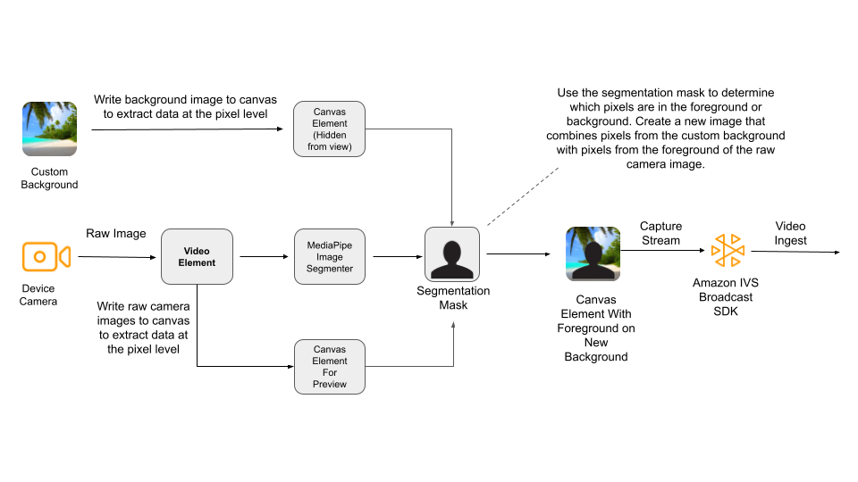
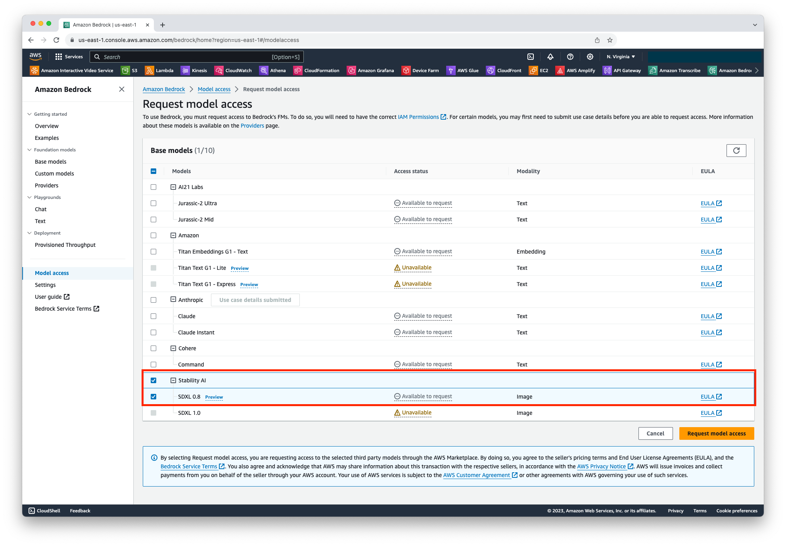
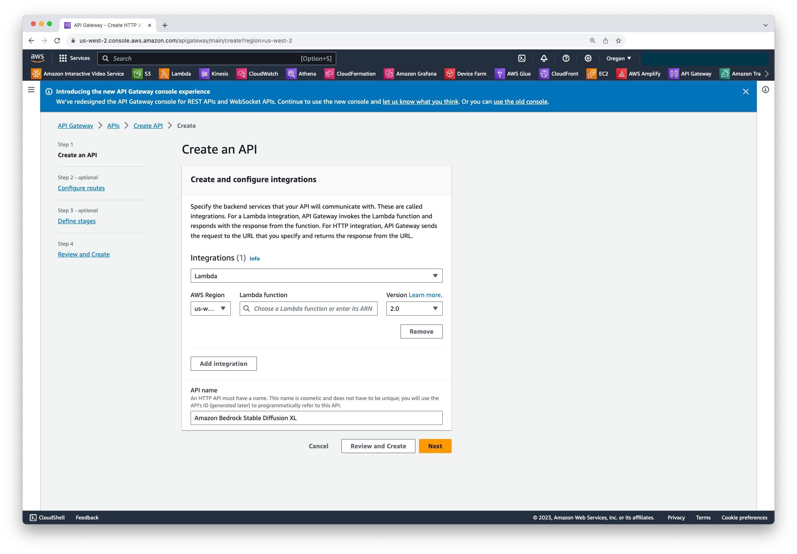
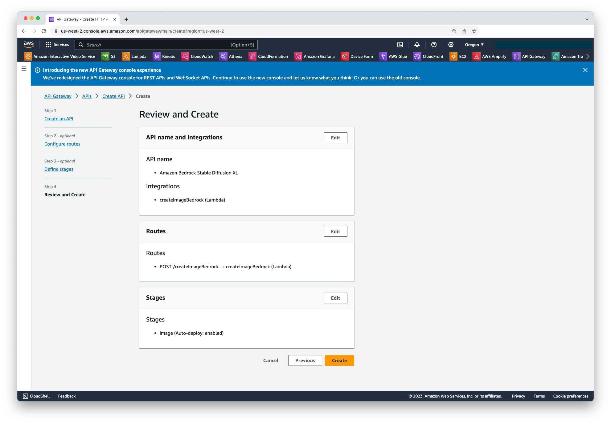
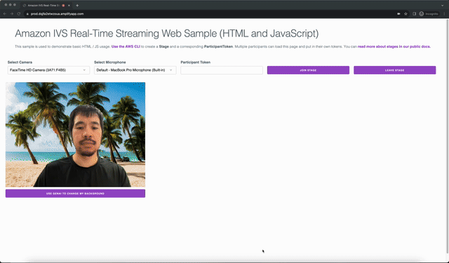

Amazon Interactive Video Service (IVS) is a managed live-video streaming service that lets you create real-time streaming experiences. Live stream creators have engaged audiences with content entailing live events, live shopping, and user generated content (UGC) to name a few.

As a live stream creator on Amazon IVS however, are you tired of the same old background in your live streams? What if I told you there’s a simple way to instantly transport your audience to a world of your choosing? Explore the magic of generative AI background replacement in this blog and give your live streams a captivating twist.

I will walk you through a step-by-step process on how to create a web app to replace the background of your web camera’s feed, integrate it with Stable Diffusion XL on Amazon Bedrock to generate a background image with a prompt, and create a real-time live stream experience with your new GenAI background image using Amazon IVS.

> The code for this tutorial is available on [Github](https://github.com/aws-samples/amazon-ivs-real-time-background-replacement-demo-for-web). You can also try a [live demo](https://prod.dqjfa2etwzoua.amplifyapp.com/) of this web app.

## What you will learn

- How to replace your background with a custom image using MediaPipe Image Segmenter
- How to live stream yourself with your custom background with Amazon IVS
- How to leverage generative AI to replace the background in your camera feed using Amazon Bedrock
- How to create a Lambda function to invoke the Stable Diffusion model via Amazon Bedrock

| Attributes          |                                                                                                                   |
| ------------------- | ----------------------------------------------------------------------------------------------------------------- |
| ✅ AWS Level        | Intermediate - 200                                                                                                |
| ⏱ Time to complete  | 60 minutes                                                                                                        |
| 💰 Cost to complete | Free when using the AWS Free Tier                                                                                 |
| 🧩 Prerequisites    | - [AWS Account](https://docs.aws.amazon.com/ivs/latest/LowLatencyUserGuide/getting-started-create-account.html)   |
| 💻 Code Sample      | [GitHub](https://github.com/aws-samples/amazon-ivs-real-time-background-replacement-demo-for-web)                 |
| 📢 Feedback         | <a href="https://pulse.buildon.aws/survey/DEM0H5VW" target="_blank">Any feedback, issues, or just a</a> 👍 / 👎 ? |
| ⏰ Last Updated     | 2023-12-15                                                                                                        |

| ToC |
| --- |

## Solution Overview

This tutorial consists of seven parts:

- Part 1 - Include dependencies and setup Mediapipe Image Segmenter
- Part 2 - Setup the Amazon IVS Web Broadcast SDK for live streaming
- Part 3 - Setup access to the Stable Diffusion model in Amazon Bedrock
- Part 4 - Create a Lambda and API Gateway to send a prompt to the Stable Diffusion model
- Part 5 - Prompt your way to a new background image with GenAI
- Part 6 - Replace your background with the new image
- Part 7 - Test your live stream

The following diagram shows how we will be replacing the background in our camera feed with a custom image. At a high level, we will get the underlying pixels from our custom background image and our raw camera feed by writing them both to canvas elements. Concurrently, we also pass our video feed to Mediapipe Image Segmenter which returns a segmentation mask indicating which pixels are more likely to be in the foreground or background. Using that data, we copy the corresponding pixels from the custom background image and the camera image to a canvas. We then capture the real-time video from that canvas and pass it to the Amazon IVS Web Broadcast SDK for live streaming.



## Part 1 - Include dependencies and setup Mediapipe Image Segmenter

To replace your background, the first step is to identify which parts of your image are in the background so that you don’t inadvertently replace what’s in the foreground. This is where [Mediapipe Image Segmenter](https://developers.google.com/mediapipe/solutions/vision/image_segmenter) comes in. This is a tool within the Mediapipe framework that enables developers to perform image segmentation in real-time. You will be using it to separate the foreground of an image from its background.

To use MediaPipe Image Segmenter, let's install the @mediapipe/tasks-vision. We will also install Webpack so that we can later bundle our JavaScript.

```bash
npm i @mediapipe/tasks-vision webpack webpack-cli
```

Next, create some starter HTML in an index.html file. We will also take this opportunity to include the [IVS real-time streaming Web Broadcast SDK](https://docs.aws.amazon.com/ivs/latest/RealTimeUserGuide/broadcast-web.html) for live streaming. Replace `<SDK Version>` with the [latest version number](https://docs.aws.amazon.com/ivs/latest/RealTimeUserGuide/broadcast-web.html).

```html
<!DOCTYPE html>
<html lang="en">
  <head>
    <meta charset="UTF-8" />
    <meta http-equiv="X-UA-Compatible" content="IE=edge" />
    <meta name="viewport" content="width=device-width, initial-scale=1.0" />

    <!-- Import the SDK -->
    <script src="https://web-broadcast.live-video.net/<SDK version>/amazon-ivs-web-broadcast.js"></script>
  </head>

  <body></body>
</html>
```

Let’s now add some crucial HTML elements to our burgeoning HTML file. Add a video element which will contain your live camera feed and will be used as input to the MediaPipe Image Segmenter. Also create a canvas element that will be used to render a preview of the feed that will be broadcast. You will also need to create a second canvas element that will be used to render the custom image provided by Stable Diffusion that will be used as our background. Since the second canvas with the custom image is used only as a source to programmatically copy pixels from it to the final canvas, it is hidden from view.

We will also add buttons to join and leave what is known as a stage in Amazon IVS. A stage is a virtual space where participants can exchange video in real time. In order to join a stage, you also need a participant token so we have added an input field to specify one. A participant token both identifies to Amazon IVS the specific stage to join and serves as an authentication mechanism. This token can be generated using the [AWS console](https://docs.aws.amazon.com/ivs/latest/RealTimeUserGuide/getting-started-distribute-tokens.html#getting-started-distribute-tokens-console), the [AWS CLI](https://docs.aws.amazon.com/ivs/latest/RealTimeUserGuide/getting-started-distribute-tokens.html#getting-started-distribute-tokens-cli), or the [AWS SDK](https://docs.aws.amazon.com/ivs/latest/RealTimeUserGuide/getting-started-distribute-tokens.html#getting-started-distribute-tokens-sdk).

Finally, let’s add a button we can click to send a prompt to Stable Diffusion to generate an image. Clicking this button will bring up a modal to enter a prompt to describe what we want our background image to look like.

```html
<div class="row">
  <div class="column">
    <label for="token">Participant Token</label>
    <input type="text" id="token" name="token" />
  </div>
  <div class="column" style="display: flex; margin-top: 1.5rem">
    <button class="button" style="margin: auto; width: 100%" id="join-button">Join Stage</button>
  </div>
  <div class="column" style="display: flex; margin-top: 1.5rem">
    <button class="button" style="margin: auto; width: 100%" id="leave-button">Leave Stage</button>
  </div>
</div>

<!-- Local Participant -->
<div class="row local-container">
  <video id="webcam" autoplay style="display: none"></video>
  <div class="column" id="local-media"></div>
  <div class="static-controls hidden" id="local-controls">
    <button class="button" id="mic-control">Mute Mic</button>
    <button class="button" id="camera-control">Mute Camera</button>
  </div>
</div>

<div class="row local-container">
  <canvas id="canvas" width="640px" height="480px"></canvas>
</div>
<div class="row local-container">
  <div class="column-50">
    <button class="button button-open" style="width: 640px" id="change-background-button">Use GenAI to change my background</button>
  </div>
</div>

<canvas id="background" width="640px" height="480px" style="display: none"></canvas>

<hr style="margin-top: 5rem" />

<!-- Remote Participants -->
<div class="row">
  <div id="remote-media"></div>
</div>

<!-- Bring up a modal to input a prompt for the background -->
<section class="modal hidden">
  <div>
    <h3>Describe your background</h3>
  </div>

  <input type="text" id="genai-background-prompt" placeholder="beach with palm trees" autofocus />
  <button class="btn" id="background-prompt-submit-btn">Submit</button>
</section>

<div class="overlay hidden"></div>
```

Add a script tag before the closing </body> tag to load a bundled JavaScript file that will contain the code to do the background replacement and publish it to a stage:

```html
    <script src="./dist/bundle.js"></script>
  </body>
</html>
```

Next, create a JavaScript file called `app.js` to get the element objects for the canvas and video elements that were created in the HTML page. Additionally, get the elements for our background change controls and model for later usage. To set up live streaming later with Amazon IVS, import Stage and LocalStageStream from IVSBroadcastClient. Additionally, import the ImageSegmenter and FilesetResolver modules. The ImageSegmenter module will be used to perform the segmentation task.

```javascript
const { Stage, LocalStageStream, SubscribeType, StageEvents, ConnectionState, StreamType } = IVSBroadcastClient;

const canvasElement = document.getElementById("canvas");
const background = document.getElementById("background");
const backgroundPromptInput = document.getElementById("genai-background-prompt");
const backgroundChangeBtn = document.getElementById("background-prompt-submit-btn");

const canvasCtx = canvasElement.getContext("2d");
const backgroundCtx = background.getContext("2d");
const video = document.getElementById("webcam");

// For GenAI prompt to change background
const modal = document.querySelector(".modal");
const overlay = document.querySelector(".overlay");
const openModalBtn = document.querySelector(".button-open");

import { ImageSegmenter, FilesetResolver } from "@mediapipe/tasks-vision";
```

Next, create an instance of ImageSegmenter, which will segment the image and return the result as a mask. When creating an instance of an ImageSegmenter, you will use the [selfie segmentation model](https://developers.google.com/mediapipe/solutions/vision/image_segmenter#selfie-model). This model is ideal for telling us which pixels in the image are in the foreground vs the background.

```javascript
const createImageSegmenter = async () => {
  const audio = await FilesetResolver.forVisionTasks("https://cdn.jsdelivr.net/npm/@mediapipe/tasks-vision@0.10.2/wasm");

  imageSegmenter = await ImageSegmenter.createFromOptions(audio, {
    baseOptions: {
      modelAssetPath: "https://storage.googleapis.com/mediapipe-models/image_segmenter/selfie_segmenter/float16/latest/selfie_segmenter.tflite",
      delegate: "GPU",
    },
    runningMode: "VIDEO",
    outputCategoryMask: true,
  });
};
```

## Part 2 - Setup the Amazon IVS Web Broadcast SDK for live streaming

In this part, we will go over how to use the Amazon IVS Web Broadcast SDK to live stream your camera feed from a canvas. To start live streaming, there are three core concepts that make real-time live streaming work.

- [Stage](https://docs.aws.amazon.com/ivs/latest/RealTimeUserGuide/web-publish-subscribe.html#web-publish-subscribe-concepts-stage): A virtual space where participants exchange audio or video. The Stage class is the main point of interaction between the host application and the SDK.
- [StageStrategy](https://docs.aws.amazon.com/ivs/latest/RealTimeUserGuide/web-publish-subscribe.html#web-publish-subscribe-concepts-strategy): An interface that provides a way for the host application to communicate the desired state of the stage to the SDK
- [Events](https://docs.aws.amazon.com/ivs/latest/RealTimeUserGuide/web-publish-subscribe.html#web-publish-subscribe-concepts-events): You can use an instance of a stage to communicate state changes such as when someone leaves or joins it, among other events.

The first thing we need to do is get the user’s live camera feed. We will later be using the pixel data from this video stream by writing it to a canvas element combined with a custom image to create a virtual background. Create a function called init() to retrieve a MediaStream from the user’s camera. We will later be calling this function and passing in the URL to an image from Stable Diffusion. As a default, let’s use an image of a beach.

```javascript
const init = async (srcImageUrl = "https://d1l5n2avb89axj.cloudfront.net/beach.jpg") => {
  localCamera = await navigator.mediaDevices.getUserMedia({
    video: true,
    audio: false,
  });
};
```

Next, in order to publish our video so the audience can see it, let’s capture the MediaStream from our first canvas element and assign it to segmentationStream. For now, this MediaStream will just contain our camera feed. Later on, we will add logic to replace the background with a custom image.

Once we have a MediaStream we want to publish to an audience, we need to join a stage. Joining a stage enables us to live stream the video feed to the audience or other participants in the stage. If we don’t want to live stream anymore, we can leave the stage. Let’s add event listeners that listen for click events when an end user clicks the join or leave stage buttons and implement the appropriate logic.

```javascript
const segmentationStream = canvasElement.captureStream();

joinButton.addEventListener("click", () => {
  joinStage(segmentationStream);
});

leaveButton.addEventListener("click", () => {
  leaveStage();
});
```

While we are creating this function, let’s also pull down the image from the URL provided earlier and draw it to our second canvas. We will need this later on so that we can access the underlying pixel data of the image to combine with our camera feed’s foreground and create a virtual background.

```javascript
initBackgroundCanvas(srcImageUrl);
```

The initBackgroundCanvas function is defined as follows, which is also added to app.js. This function simply loads our image into a canvas. We do this so that we can later copy its individual pixels to do the background replacement.

```javascript
const initBackgroundCanvas = () => {
  let img = new Image();
  img.src = srcImageUrl;
  img.crossOrigin = "Anonymous";

  img.onload = () => {
    backgroundCtx.clearRect(0, 0, canvas.width, canvas.height);
    backgroundCtx.drawImage(img, 0, 0);
  };
};
```

Next, assign the MediaStream from the local camera to our video element. Additionally, we also invoke a custom callback function every time a camera frame is loaded, which we will name renderVideoToCanvas. Later on in this article, we will implement this function and explain it in detail.

```javascript
video.srcObject = localCamera;
video.addEventListener("loadeddata", renderVideoToCanvas);
```

The complete `init` function now looks as follows.

```javascript
const init = async () => {
  localCamera = await navigator.mediaDevices.getUserMedia({
    video: true,
    audio: false,
  });

  const segmentationStream = canvasElement.captureStream();

  joinButton.addEventListener("click", () => {
    joinStage(segmentationStream);
  });

  leaveButton.addEventListener("click", () => {
    leaveStage();
  });

  initBackgroundCanvas(srcImageUrl);

  video.srcObject = localCamera;
  video.addEventListener("loadeddata", renderVideoToCanvas);
};
```

Next, let’s add the logic for the joinStage function. In this function, we’re going to get the MediaStream from the user’s microphone so that we can publish it to the stage. Publishing is the act of sending audio and/or video to the stage so other participants can see or hear the participant that has joined. We also need to implement the StageStrategy interface by defining the shouldSubscribeToParticipant, shouldPublishParticipant, and stageStreamsToPublish functions.

First, let’s implement the stageStreamsToPublish function. This function is used to determine what audio and video streams to publish. To do that, it returns an array of [LocalStageStream](https://aws.github.io/amazon-ivs-web-broadcast/docs/sdk-reference/classes/LocalStageStream) instances. Using the MediaStream instances from the microphone and the canvas, assigned to segmentationStream, we can create instances of a LocalStageStream. Then, all we need to do in the stageStreamsToPublish function is return the instances of LocalStageStream we just created in an array. This will enable the audience to hear our audio and see our video.

Next, implement the shouldPublishParticipant by simply returning true. This indicates whether you, the local participant, should publish your media streams.

Next, implement the [shouldSubscribeToParticipant](https://docs.aws.amazon.com/ivs/latest/RealTimeUserGuide/web-publish-subscribe.html#web-publish-subscribe-concepts-events#web-publish-subscribe-concepts-strategy-participants) function. This function indicates whether our app should subscribe to a remote participant’s audio only, audio and video, or nothing at all when they join the stage. We want both audio and video so we return SubscribeType.AUDIO_VIDEO.

To finish up the joinStage function, create a new Stage object passing in the participant token and strategy object we just set up as arguments. The participant token is used to authenticate with the stage as well as identify which stage we are joining. You can get a participant token by [creating a stage in the console](https://docs.aws.amazon.com/ivs/latest/RealTimeUserGuide/getting-started-create-stage.html) and subsequently [creating a participant token](https://docs.aws.amazon.com/ivs/latest/RealTimeUserGuide/getting-started-distribute-tokens.html#getting-started-distribute-tokens-console) within that stage using either the console or AWS SDK. Later on, we will call the join method on a stage object to join a stage.

```javascript
const joinStage = async (segmentationStream) => {
  if (connected || joining) {
    return;
  }
  joining = true;

  const token = document.getElementById("token").value;

  if (!token) {
    window.alert("Please enter a participant token");
    joining = false;
    return;
  }

  // Retrieve the User Media currently set on the page
  localMic = await navigator.mediaDevices.getUserMedia({
    video: false,
    audio: true,
  });
  cameraStageStream = new LocalStageStream(segmentationStream.getVideoTracks()[0]);
  micStageStream = new LocalStageStream(localMic.getAudioTracks()[0]);

  const strategy = {
    stageStreamsToPublish() {
      return [cameraStageStream, micStageStream];
    },
    shouldPublishParticipant() {
      return true;
    },
    shouldSubscribeToParticipant() {
      return SubscribeType.AUDIO_VIDEO;
    },
  };

  stage = new Stage(token, strategy);
};
```

Finally, let’s add some logic to listen for Stage events. These events occur when the state of the stage you’ve joined changes such as when someone joins or leaves it. Using these events, you can dynamically update the HTML code to display a new participant’s video feed when they join and remove it from display when they leave. The setupParticipant and teardownParticipant functions do each of these actions respectively. As a final step we call the join method on the stage object to join the stage.

```javascript
// Other available events:
// https://aws.github.io/amazon-ivs-web-broadcast/docs/sdk-guides/stages#events
stage.on(StageEvents.STAGE_CONNECTION_STATE_CHANGED, (state) => {
  connected = state === ConnectionState.CONNECTED;

  if (connected) {
    joining = false;
    controls.classList.remove("hidden");
  } else {
    controls.classList.add("hidden");
  }
});

stage.on(StageEvents.STAGE_PARTICIPANT_JOINED, (participant) => {
  console.log("Participant Joined:", participant);
});

stage.on(StageEvents.STAGE_PARTICIPANT_STREAMS_ADDED, (participant, streams) => {
  console.log("Participant Media Added: ", participant, streams);

  let streamsToDisplay = streams;

  if (participant.isLocal) {
    // Ensure to exclude local audio streams, otherwise echo will occur
    streamsToDisplay = streams.filter((stream) => stream.streamType === StreamType.VIDEO);
  }

  const videoEl = setupParticipant(participant);
  streamsToDisplay.forEach((stream) => videoEl.srcObject.addTrack(stream.mediaStreamTrack));
});

stage.on(StageEvents.STAGE_PARTICIPANT_LEFT, (participant) => {
  console.log("Participant Left: ", participant);
  teardownParticipant(participant);
});

try {
  await stage.join();
} catch (err) {
  joining = false;
  connected = false;
  console.error(err.message);
}
```

## Part 3 - Setup access to the Stable Diffusion model in Amazon Bedrock

We now have set up our app to stream our local camera’s video feed, but we don’t yet have a custom background image beyond the default one we hardcoded. This is where Amazon Bedrock with the Stable Diffusion XL image generation model comes in. To get set up with Amazon Bedrock, follow the [getting started guide](https://docs.aws.amazon.com/bedrock/latest/userguide/setting-up.html). Once Amazon Bedrock is set up, navigate to the [model access](https://docs.aws.amazon.com/bedrock/latest/userguide/model-access.html#add-model-access) link in the console, and go to the Manage model access page. Select the checkbox next to SDXL 0.8 under Stability AI which is short for the [Stable Diffusion XL Beta 0.8](https://aws.amazon.com/marketplace/pp/prodview-3j5jzj4k6slxs) model and click Request model access. This is an early beta for Stability AI’s foundation model for image generation.



Now that we have access, let’s quickly test it using the AWS CLI with a simple prompt. You will need AWS CLI version 2 or later to run the following comment. [Follow these instructions to update AWS CLI](https://docs.aws.amazon.com/cli/latest/userguide/getting-started-install.html) if you have an older version.

```bash
aws bedrock-runtime invoke-model \
--model-id stability.stable-diffusion-xl-v0 \
--body "{\"text_prompts\":[{\"text\":\"beach with palm trees\"}],\"cfg_scale\":10,\"seed\":0,\"steps\":50}" \
--cli-binary-format raw-in-base64-out \
--region us-east-1
```

Running this will return a JSON response (see truncated example below), indicating whether the call was successful, along with the image as a base64 encoded string.

```json
{ "result": "success", "artifacts": [{ "seed": 0, "base64": "iVBORw0KGg…", "finishReason": "SUCCESS" }] }
```

## Part 4 - Create a Lambda and API Gateway to send a prompt to the Stable Diffusion model

To programmatically access this from our web app, let’s create a Lambda function. Head over to the Lambda console and create a function with Python 3.9 as the runtime. Add the following code to your Lambda function

This code uses the AWS SDK for Python to invoke the Stable Diffusion XL model we just added through the Bedrock console. Since the generated image is returned as a base64 encoded string, we need to decode it so we save it to a s3 bucket as a JPEG image. In this case, the bucket has been given the name “virtual-backgrounds”. After storing it in s3, we can [create a Cloudfront distribution](https://docs.aws.amazon.com/AmazonCloudFront/latest/DeveloperGuide/distribution-web-creating-console.html) to more easily access it from our web app. Once you have set up your own cloudfront distribution, replace `<CLOUDFRONT DISTRIBUTION DOMAIN>` with your own domain.

```python
import os
import io
import boto3
import json
import csv
import base64
import uuid

# grab environment variables
brt = boto3.client(service_name='bedrock-runtime')

def lambda_handler(event, context):
    print("Received event: " + json.dumps(event, indent=2))

    unique_id = str(uuid.uuid4())
    object_key = "bg-image-" + unique_id + ".jpg"

    body = json.dumps({
        "prompt": event['body']['prompt'],
        "cfg_scale": 1,
        "seed": 0,
        "steps": 50,
        "width": event['body']['width'],
        "height": event['body']['height']
    })
    modelId = 'stability.stable-diffusion-xl-v0'
    accept = 'application/json;jpeg'
    contentType = 'application/json'
    bedrock_response = brt.invoke_model(body=body, modelId=modelId, accept=accept, contentType=contentType)
    response_body = json.loads(response.get('body').read())

    image_bytes = base64.b64decode(response_body['artifacts'][0]['base64'])
    s3 = boto3.client('s3')
    s3.put_object(Bucket='virtual-backgrounds-test', Key=object_key, Body=image_bytes)
    image_url = 'https://<CLOUDFRONT DISTRIBUTION DOMAIN>/' + object_key

    response = {
        "statusCode": 200,
        "body": json.dumps({"image_url": image_url}),
        "headers": {
            "Content-Type": "application/json"
        }
    }

    return response
```

Note that as of this writing, the AWS SDK for Python, Boto3, that comes with Lambda does not include the Bedrock runtime. If you get the error `"Unknown service: 'bedrock-runtime'"` when you invoke this Lambda, follow [these instructions](https://repost.aws/knowledge-center/lambda-python-runtime-errors) to create a layer that uses the latest version of Boto3. You will then need to add this new layer Lambda’s function configuration. Once you do that, this Lambda then returns a JSON response that looks similar to the following.

```json
{
  "image_url": "https://d123efghi.cloudfront.net/bg-image-0dcb6f26-6518-48ae-a1b5-2669773f2bed.jpg"
}
```

Next, create an API Gateway to trigger the Lambda function we just created. Open the [API Gateway console](https://us-west-2.console.aws.amazon.com/apigateway), click Create API, and then build a HTTP API. Add a Lambda integration and select the Lambda function we just created from the dropdown. Specify a name for the API and click Next.



On the next screen, configure a POST route and leave the resource path and integration targets as is. Click **Next** to configure stages. Remove the default stage and add a staged name “image”. Enable auto-deploy and then click **Next**. You should then see a screen similar to the following to review the configuration you have specified. Click **Create** to finish.



After creating the API gateway, you can then get the invoke URL by [following these instructions](https://docs.aws.amazon.com/apigateway/latest/developerguide/how-to-call-api.html#apigateway-how-to-call-rest-api) (follow the instructions under the New REST API console tab). Copy the invoke URL as we will be using it in the next step.

## Part 5 - Prompt your way to a new background image with GenAI

Let’s add logic to listen for a click event when the change background button is clicked. Clicking this button will bring up a modal with an input field to provide a description of the background we want. Once the form is submitted, it will call our API gateway endpoint and run inference on our Stable Diffusion Model via Amazon Bedrock to return an image.

```javascript
backgroundChangeBtn.addEventListener("click", async function (event) {
  backgroundChangeBtn.disabled = true;
  overlay.removeEventListener("click", closeModal);
  backgroundChangeBtn.innerText = "Please wait. This can take up to 10 sec.";

  // Get the input field's text value
  const prompt = backgroundPromptInput.value;
  // Create a JSON object with the text value
  const requestBody = { prompt, width: 640, height: 480 };

  // Convert the JSON object to a JSON string
  var requestBodyJSON = JSON.stringify(requestBody);

  // Make a POST request using the Fetch API
  const response = await fetch("<INSERT YOUR API GATEWAY INVOKE URL HERE>", {
    method: "POST",
    headers: {
      "Content-Type": "application/json",
    },
    body: requestBodyJSON,
  });

  const json = await response.json();

  closeModal();

  init(json.image_url);
  backgroundChangeBtn.disabled = false;
  openModalBtn.addEventListener("click", openModal);
  backgroundChangeBtn.innerText = "Submit";
});
```

## Part 6 - Replace your background with the new image

To replace the background in our camera feed with a new image, let’s now implement the renderVideoToCanvas function we mentioned earlier. This function renders the video feed to the second canvas element in our HTML. We need to render the video feed to a canvas so we can extract the foreground pixels from it using the Canvas 2D API. While doing this, we also will pass a video frame to our instance of ImageSegmenter, using the [segmentforVideo](https://developers.google.com/mediapipe/api/solutions/js/tasks-vision.imagesegmenter#imagesegmentersegmentforvideo) method to segment the foreground from the background in the video frame. When the segmentforVideo method returns, it invokes our custom callback function, replaceBackground, for doing the background replacement.

Create the replaceBackground function, which merges the custom background image with the foreground from the camera feed to replace the background. The function first retrieves the underlying pixel data of the custom background image and the video feed from the two canvas elements created earlier. It then iterates through the mask provided by ImageSegmenter, which indicates which pixels are in the foreground. As it iterates through the mask, it selectively copies pixels that contain the user’s camera feed to the corresponding background pixel data. Once that is done, it converts the final pixel data with the foreground copied on to the background and draws it to a canvas.

```javascript
function replaceBackground(result) {
  let imageData = canvasCtx.getImageData(0, 0, video.videoWidth, video.videoHeight).data;
  let backgroundData = backgroundCtx.getImageData(0, 0, video.videoWidth, video.videoHeight).data;
  const mask = result.categoryMask.getAsFloat32Array();
  let j = 0;

  for (let i = 0; i < mask.length; ++i) {
    const maskVal = Math.round(mask[i] * 255.0);

    j += 4;
    // Only copy pixels on to the background image if the mask indicates they are in the foreground
    if (maskVal < 255) {
      backgroundData[j] = imageData[j];
      backgroundData[j + 1] = imageData[j + 1];
      backgroundData[j + 2] = imageData[j + 2];
      backgroundData[j + 3] = imageData[j + 3];
    }
  }

  // Convert the pixel data to a format suitable to be drawn to a canvas
  const uint8Array = new Uint8ClampedArray(backgroundData.buffer);
  const dataNew = new ImageData(uint8Array, video.videoWidth, video.videoHeight);
  canvasCtx.putImageData(dataNew, 0, 0);
  window.requestAnimationFrame(renderVideoToCanvas);
}
```

## Part 7 - Test your live stream

To run this app locally, bundle your JavaScript by creating a webpack config file named webpack.config.js as follows

```javascript
const path = require("path");
module.exports = {
  entry: ["./app.js"],
  output: {
    filename: "bundle.js",
    path: path.resolve(__dirname, "dist"),
  },
};
```

Update your package.json file to run webpack as your JavaScript bundler when you run the build script. Specify webpack.config.js as your Webpack config file.

```json
{
  "dependencies": {
    "@mediapipe/tasks-vision": "^0.10.6",
    "copy-webpack-plugin": "^11.0.0",
    "html-webpack-plugin": "^5.5.3",
    "path": "^0.12.7"
  },
  "name": "ivs-stages-simple-background-replacement",
  "version": "1.0.0",
  "scripts": {
    "test": "echo \"Error: no test specified\" && exit 1",
    "build": "webpack --config webpack.config.js"
  },
  "keywords": [],
  "author": "",
  "license": "ISC",
  "description": "",
  "devDependencies": {
    "webpack": "^5.88.2",
    "webpack-cli": "^5.1.4"
  }
}
```

Now run your build script from the command line to bundle your JavaScript. Doing so lets us use the import statement within app.js without any issues.

```bash
npm run build
```

Finally, start a simple HTTP server from the directory containing index.html and open localhost:8000 to see the result. You should see a local camera feed with a new background image.

```bash
python3 -m http.server -d ./
```

In your browser window, create a participant token in the AWS console, provide it to the input field in your web app, and click join stage. You are now publishing your video feed with the custom background image to a stage.

To test if someone else joining the stage can see your avatar, open the [Amazon IVS Real-Time Streaming Web Sample](https://codepen.io/amazon-ivs/project/editor/DYapzL#) in another browser window, create another participant token, provide it in this browser window and click join stage. You should now see the video feed of yourself with the custom background applied. This is how other audience members joining the stage would see your video feed. You can click the change background button to provide a prompt for a new background image and within seconds you will see your video feed updated with the new background image!



## Conclusion

As we wrap up this tutorial, you should now be equipped with the knowledge to transform your live streams using AI-generated backgrounds, bringing a dynamic and polished look to your audience. AI-generated backgrounds open the door to transporting you and your live stream audience to a new world. Happy streaming, and let your creativity flow with your new, limitless streaming environment!

If you enjoyed this tutorial, found any issues, or have feedback for us, <a href="https://pulse.buildon.aws/survey/DEM0H5VW" target="_blank">please send it our way!</a>

## About the Author

Tony Vu is a Senior Partner Engineer at Twitch. He specializes in assessing partner technology for integration with Amazon Interactive Video Service (IVS), aiming to develop and deliver comprehensive joint solutions to our IVS customers. Tony enjoys writing and sharing content on [LinkedIn](https://www.linkedin.com/in/tonyv/).
