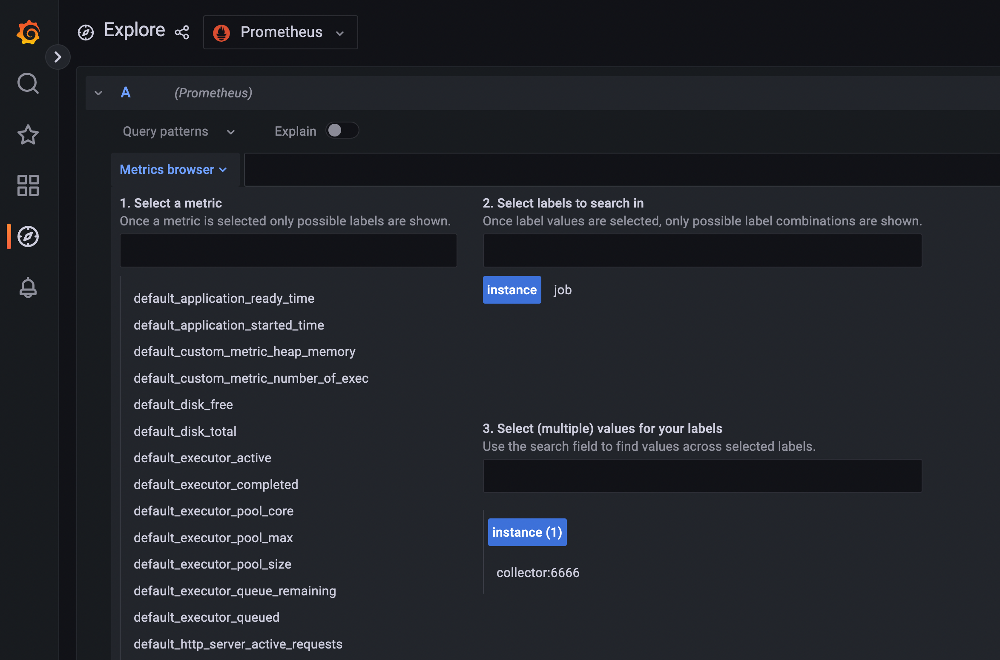
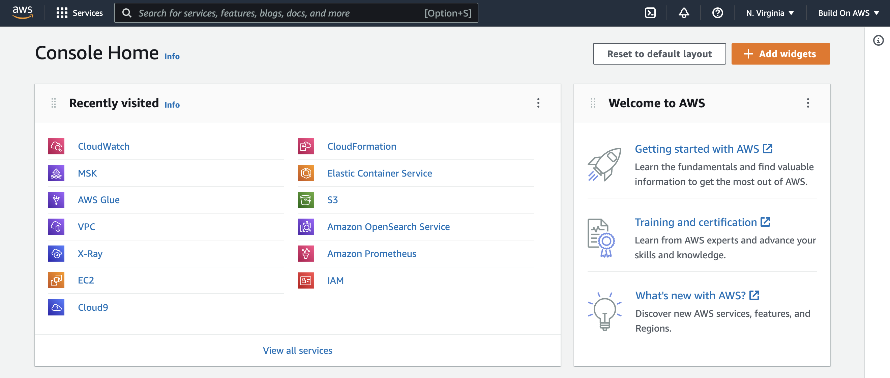
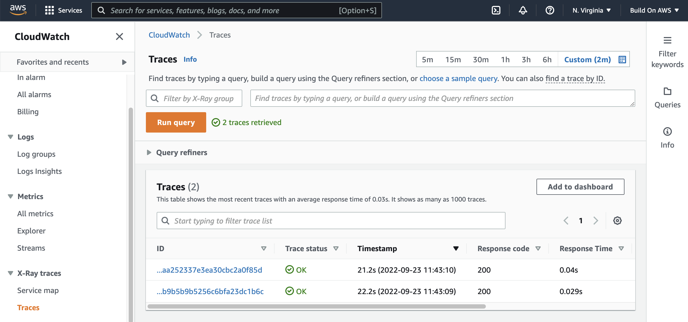
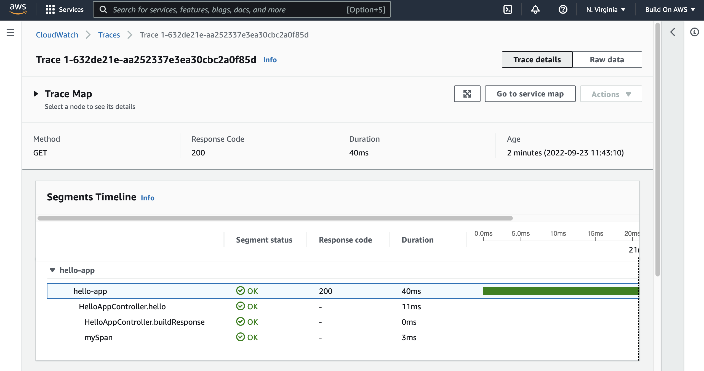
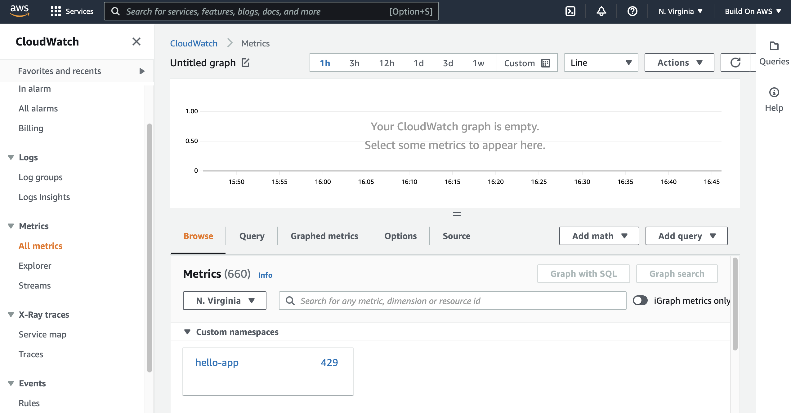
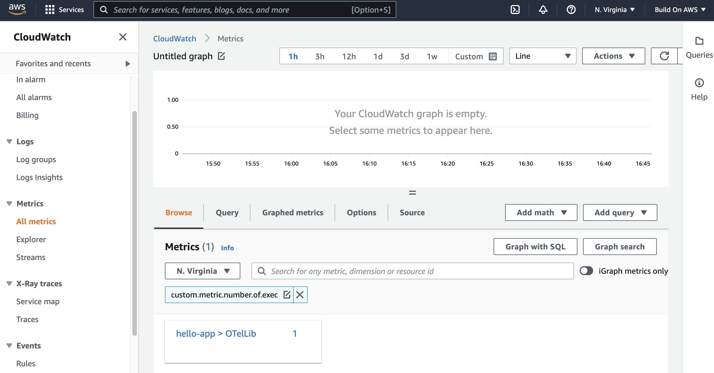
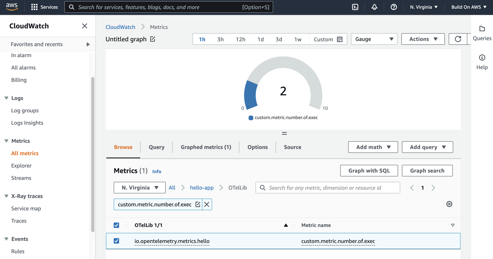

In this tutorial, you will learn how to instrument an existing microservice written in Java and SpringBoot to produce telemetry data using OpenTelemetry. You will learn the differences between instrumenting the microservice using an automatic approach, where everything is automatically discovered for you, and the manual approach, where you make the code observable with instrumentation that you provide using the OpenTelemetry SDK. You will also learn how to send this telemetry data to a compatible backend using the OpenTelemetry collector, and eventually switch to another compatible backend without any modifications in the microservice code.

## What you will learn

- How to use the OpenTelemetry Java agent with a microservice
- How to configure and implement the OpenTelemetry collector
- Differences between black-box and white-box instrumentation
- How to write your own telemetry data with the OpenTelemetry SDK
- How to send generated traces to Grafana Tempo and AWS X-Ray
- How to send generated metrics to Prometheus and Amazon CloudWatch
- How to switch between observability backends without code changes

## Sidebar
| Info                | Level                                  |
| ------------------- | -------------------------------------- |
| ✅ AWS Level        | Beginner                               |
| ⏱ Time to complete  | 45 minutes                                 |
| 💰 Cost to complete | Free when using the AWS Free Tier |

## Prerequisites

Before starting this tutorial, you will need the following:

 - [Docker](https://www.docker.com/get-started) 4.11+ (Required)
 - [Java](https://openjdk.org/install) 17+ (Required)
 - [Maven](https://maven.apache.org/download.cgi) 3.8.6+ (Required)
 - [AWS Account](https://portal.aws.amazon.com/billing/signup#/start/email) (Optional. Only required for the bonus section.)

 ## Sections
 - [Introduction](#introduction)
 - [Getting started with the existing code](#getting-started-with-the-existing-code)
 - [Automatic instrumentation with the OpenTelemetry agent](#automatic-instrumentation-with-the-opentelemetry-agent)
 - [Sending telemetry data to the collector](#sending-telemetry-data-to-the-collector)
 - [Sending all the traces to Grafana Tempo](#sending-all-the-traces-to-grafana-tempo)
 - [Manual instrumentation with the OpenTelemetry SDK](#manual-instrumentation-with-the-opentelemetry-sdk)
 - [Custom metrics with the OpenTelemetry SDK](#custom-metrics-with-the-opentelemetry-sdk)
 - [Sending all the metrics to Prometheus](#sending-all-the-metrics-to-prometheus)
 - [Bonus: switching the observability backend to AWS](#bonus-switching-the-observability-backend-to-aws)
 
## Introduction

[OpenTelemetry](https://opentelemetry.io/) is one of those technologies that you know you must learn and start using as soon as possible, but every time you get to work with it, you find it more complicated than it should be. If this is you, don't worry. You're not alone. Many other people also complain about OpenTelemetry being complicated. However, it is important for you to understand that some of this complexity is incidental because OpenTelemetry is not a ready-to-use library. It is a [framework](https://opentelemetry.io/docs/concepts/components).

If you've implemented observability before, you probably did so by leveraging technologies like agents and libraries that did the job of offloading from your hands much of the work related to collect, process, and transmit telemetry data to observability backends. But this simplicity had a price: you end up locked to that ‌observability backend. OpenTelemetry was created with the main purpose of providing a neutral and extensible way for developers to instrument their applications so telemetry data could be collected, processed, and transmitted to compatible observability backends. With OpenTelemetry, you trade the benefit of vendor portability for a little less encapsulation in how observability must be implemented. Therefore, you are exposed to the moving parts that comprise the implementation.

The good news is that once you understand these moving parts, OpenTelemetry becomes less complicated. It is just a matter of knowing what these moving parts are, how to implement them, and how to integrate them with your observability backend. And you know what? This is exactly what this tutorial is about. I will work with you, step by step, to create an end to end scenario using OpenTelemetry that will even allow for a migration of your observability backend. Let's get to it.

## Getting started with the existing code

To keep things focused, you are going to implement this observability scenario by using code that contains an existing microservice written in [Java](https://openjdk.org/) and [Spring Boot](https://spring.io/projects/spring-boot), and a pre-configured observability backend. This observability backend is based on [Grafana Tempo](https://grafana.com/oss/tempo) for handling tracing data, [Prometheus](https://prometheus.io/) for metrics, and [Grafana](https://grafana.com/oss/grafana) for visualizing both types of telemetry data. The repository containing this existing code can be found [here](https://github.com/build-on-aws/instrumenting-java-apps-using-opentelemetry).

However, instead of using the complete code already implemented, you are going to use a specific branch of this code called `build-on-aws-tutorial` that is incomplete. In this tutorial, you will implement the missing part to do things like transmit traces to Grafana Tempo and metrics to Prometheus using OpenTelemetry.

1. Clone the repository using the tutorial branch:

```bash
git clone https://github.com/build-on-aws/instrumenting-java-apps-using-opentelemetry -b build-on-aws-tutorial
```

You can use any tool to work with the files from this repository, including [Vim](https://www.vim.org/). But I would highly recommend using a full-fledged IDE, such as [Visual Studio Code](https://code.visualstudio.com/), for this, as you may need to work with different files simultaneously. It will make your life less dreadful.

Now let's make sure everything works as expected. Finishing this section successfully is paramount for you to start and complete the next ones. First, check if the microservice can be compiled, built, and executed. This will require you to have Java and Maven properly installed on your machine. The script `run-microservice.sh` builds the code and also executes the microservice at the same time.

2. Change the directory to the folder containing the code.

3. Execute the script `run-microservice.sh`.

```bash
sh run-microservice.sh
```

This is the log output from the microservice:

```bash

  .   ____          _            __ _ _
 /\\ / ___'_ __ _ _(_)_ __  __ _ \ \ \ \
( ( )\___ | '_ | '_| | '_ \/ _` | \ \ \ \
 \\/  ___)| |_)| | | | | || (_| |  ) ) ) )
  '  |____| .__|_| |_|_| |_\__, | / / / /
 =========|_|==============|___/=/_/_/_/
 :: Spring Boot ::                (v2.6.4)

2022-08-24 14:11:19.280  INFO 4523 --- [           main] tutorial.buildon.aws.o11y.HelloApp       : Starting HelloApp v1.0 using Java 17.0.2 on redacted-hostname with PID 4523 (/private/tmp/blog/otel-with-java/target/hello-app-1.0.jar started by redacted-user in /private/tmp/blog/otel-with-java)
2022-08-24 14:11:19.284  INFO 4523 --- [           main] tutorial.buildon.aws.o11y.HelloApp       : No active profile set, falling back to 1 default profile: "default"
2022-08-24 14:11:21.927  INFO 4523 --- [           main] o.s.b.w.embedded.tomcat.TomcatWebServer  : Tomcat initialized with port(s): 8888 (http)
2022-08-24 14:11:21.939  INFO 4523 --- [           main] o.apache.catalina.core.StandardService   : Starting service [Tomcat]
2022-08-24 14:11:21.940  INFO 4523 --- [           main] org.apache.catalina.core.StandardEngine  : Starting Servlet engine: [Apache Tomcat/9.0.58]
2022-08-24 14:11:22.009  INFO 4523 --- [           main] o.a.c.c.C.[Tomcat].[localhost].[/]       : Initializing Spring embedded WebApplicationContext
2022-08-24 14:11:22.010  INFO 4523 --- [           main] w.s.c.ServletWebServerApplicationContext : Root WebApplicationContext: initialization completed in 2603 ms
2022-08-24 14:11:23.232  INFO 4523 --- [           main] o.s.b.a.e.web.EndpointLinksResolver      : Exposing 1 endpoint(s) beneath base path '/actuator'
2022-08-24 14:11:23.322  INFO 4523 --- [           main] o.s.b.w.embedded.tomcat.TomcatWebServer  : Tomcat started on port(s): 8888 (http) with context path ''
2022-08-24 14:11:23.344  INFO 4523 --- [           main] tutorial.buildon.aws.o11y.HelloApp       : Started HelloApp in 4.905 seconds (JVM running for 5.849)
```

The microservice exposes a REST API over the port **8888**. Next, you'll test if the API is accepting requests.

4. Send an HTTP request to the API.

```bash
curl -X GET http://localhost:8888/hello
```

You should receive a reply like this:

```json
{"message":"Hello World","valid":true}
```

Once you are done with the tests, stop `run-microservice.sh` to shut down the microservice. You can do this by pressing `Ctrl+C`. From this point on, every time you need to execute the microservice again with a new version of the code that you changed, just execute the same script.

You can now check the observability backend. As mentioned before, this is based on Grafana Tempo, Prometheus, and Grafana. The code contains a `docker-compose.yaml` file with the three services pre-configured.

5. Start the observability backend using:

```bash
docker compose up -d
```

It may take several minutes until this command completes, as the respective container images need to be downloaded. But once it finishes, you should have Grafana Tempo running on port **3200**, Prometheus running on port **9090**, and Grafana running on port **3000**. Let's check if they are actually running.

6. Open a browser and point the location to [http://localhost:3200/status](http://localhost:3200/status).

You should see the following page:


You will learn later in this tutorial that Grafana Tempo is also leveraging the port **4317** to receive spans generated by the microservice. Now let's check Prometheus.

7. Point your browser to [http://localhost:9090/status](http://localhost:9090/status).

You should see the following page:


This means it is running OK. Finally, let's check Grafana.

8. Point your browser to [http://localhost:3000](http://localhost:3000/).

You should see the following page:


Just like the others, this means it is running OK. Before we wrap up and get you into the next section, there is one more thing you can check. Click on the option to `Explore` on Grafana. Then, a drop-down in the top will list all the datasources configured, one for Prometheus and another for Grafana Tempo.


This means once telemetry data for traces and metrics are transmitted to the respective backends — notably Grafana Tempo and Prometheus — you will be able to visualize them here.

9. Stop the observability backend using:

```bash
docker compose down
```

## Automatic instrumentation with the OpenTelemetry agent

You have your microservice ready to go, the observability backend is eager to receive telemetry data, so now it is time for you to start the instrumentation process. This is the process where you teach the code how to emit telemetry data. How intrusive in your code this process is depends on a lot of factors, like which programming language you are using, the level of detail you want to provide for the observability backend, and whether you can effectively change your code for this. These factors often dictate if you are going to use black-box instrumentation or white-box instrumentation.

When you don't want to change nothing in your code and still emit telemetry data, we call this black-box instrumentation. It is known this way because you treat your code as a black-box. While powerful and convenient, black-box instrumentation sometimes is not always a good idea. First, the level of instrumentation is limited, as there is only so much that can be automatically discovered. Second, not all technologies and programming languages have support for it. In most cases, you need to write the instrumentation code yourself. Examples of black-box instrumentation include observability achieved by cluster orchestrators such as Kubernetes, messaging backbones such as service meshes, kernel-level instrumentation with eBPF, and with programming languages that support the concept of agents like Java.

When black-box instrumentation is not available, you can use white-box instrumentation. This is when you open your code for changes, roll up your sleeves, and implement your way out to achieve the observability you need. It is the best way to achieve maximum visibility about what the code is doing, as you can narrate each step of its execution as if you were telling a story. You can implement your own metrics and update them the way you want. But, it is also a lot of work as coding is involved.

For the microservice of this tutorial, we will use both approaches so you can learn the differences. We will start with black-box instrumentation and later on you will practice white-box instrumentation. Since this microservice has been written in Java, we can leverage Java's agent architecture to attach an agent that can automatically add instrumentation code during the JVM bootstrap.

1. Edit the file `run-microservice.sh`.

You will change the code in `run-microservice.sh` to instruct the script to download the agent for OpenTelemetry that will instrument the microservice during bootstrap. If the agent was downloaded before, meaning that its file is available locally, then the script will simply reuse it. Here is how the updated script should look like.

```bash
#!/bin/bash

mvn clean package -Dmaven.test.skip=true
AGENT_FILE=opentelemetry-javaagent-all.jar

if [ ! -f "${AGENT_FILE}" ]; then
  curl -L https://github.com/aws-observability/aws-otel-java-instrumentation/releases/download/v1.17.0/aws-opentelemetry-agent.jar --output ${AGENT_FILE}
fi

java -javaagent:./${AGENT_FILE} -jar target/hello-app-1.0.jar
```

2. Execute the script `run-microservice.sh`.

After the changes, you will notice that nothing much will happen. It will continue to serve HTTP requests sent to the API as it would normally do. However, be sure that traces and metrics are being generated already. They are just not being properly processed. The OpenTelemetry agent is configured by default to export telemetry data to a local OTLP endpoint running on port **4317**. This is the reason why you will see messages like this in the logs:

```bash
[otel.javaagent 2022-08-25 11:18:14:865 -0400] [OkHttp http://localhost:4317/...] ERROR io.opentelemetry.exporter.internal.grpc.OkHttpGrpcExporter - Failed to export spans. The request could not be executed. Full error message: Failed to connect to localhost/[0:0:0:0:0:0:0:1]:4317
```

We will fix this later. But for now, you can visualize the traces and metrics created using plain old logging. Yes, the oldest debugging technique is available for the OpenTelemetry agent as well. To enable logging for your telemetry data:

3. Edit the file `run-microservice.sh`.

Here is how the updated `run-microservice.sh` file should look:

```bash
#!/bin/bash

mvn clean package -Dmaven.test.skip=true
AGENT_FILE=opentelemetry-javaagent-all.jar

if [ ! -f "${AGENT_FILE}" ]; then
  curl -L https://github.com/aws-observability/aws-otel-java-instrumentation/releases/download/v1.16.0/aws-opentelemetry-agent.jar --output ${AGENT_FILE}
fi

export OTEL_TRACES_EXPORTER=logging
export OTEL_METRICS_EXPORTER=logging

java -javaagent:./${AGENT_FILE} -jar target/hello-app-1.0.jar
```

4. Execute the script `run-microservice.sh`.

5. Send an HTTP request to the API.

```bash
curl -X GET http://localhost:8888/hello
```

You will notice that in the logs there will be an entry like this:

```bash
2022-08-25 11:36:27.883  INFO 53938 --- [nio-8888-exec-1] t.buildon.aws.o11y.HelloAppController    : The response is valid.
[otel.javaagent 2022-08-25 11:36:28:027 -0400] [http-nio-8888-exec-1] INFO io.opentelemetry.exporter.logging.LoggingSpanExporter - 'HelloAppController.hello' : 630796fbad88856390e52935c0eac4bb 3110a5a25d9c2c3c INTERNAL [tracer: io.opentelemetry.spring-webmvc-3.1:1.16.0-alpha] AttributesMap{data={thread.name=http-nio-8888-exec-1, thread.id=24}, capacity=128, totalAddedValues=2}
[otel.javaagent 2022-08-25 11:36:28:053 -0400] [http-nio-8888-exec-1] INFO io.opentelemetry.exporter.logging.LoggingSpanExporter - '/hello' : 630796fbad88856390e52935c0eac4bb 2a530f1005ab2a5e SERVER [tracer: io.opentelemetry.tomcat-7.0:1.16.0-alpha] AttributesMap{data={http.status_code=200, net.peer.ip=127.0.0.1, thread.name=http-nio-8888-exec-1, http.host=localhost:8888, http.target=/hello, http.flavor=1.1, net.transport=ip_tcp, thread.id=24, http.method=GET, http.scheme=http, net.peer.port=65388, http.route=/hello, http.user_agent=curl/7.79.1}, capacity=128, totalAddedValues=13}
```

This is a root span, a type of trace data, generated automatically by the OpenTelemetry agent. A root span will be created for every single execution of the microservice, meaning that if you send 5 HTTP requests to its API, then 5 root spans will be created. If you keep the microservice running for over one minute, you will also see entries like this in the logs:

```bash
[otel.javaagent 2022-08-25 11:41:18:676 -0400] [PeriodicMetricReader-1] INFO io.opentelemetry.exporter.logging.LoggingMetricExporter - Received a collection of 57 metrics for export.
[otel.javaagent 2022-08-25 11:41:18:677 -0400] [PeriodicMetricReader-1] INFO io.opentelemetry.exporter.logging.LoggingMetricExporter - metric: ImmutableMetricData{resource=Resource{schemaUrl=https://opentelemetry.io/schemas/1.9.0, attributes={host.arch="x86_64", host.name="redacted-hostname", os.description="Mac OS X 12.5.1", os.type="darwin", process.command_line="/Library/Java/JavaVirtualMachines/amazon-corretto-17.jdk/Contents/Home:bin:java -javaagent:./opentelemetry-javaagent-all.jar", process.executable.path="/Library/Java/JavaVirtualMachines/amazon-corretto-17.jdk/Contents/Home:bin:java", process.pid=55132, process.runtime.description="Amazon.com Inc. OpenJDK 64-Bit Server VM 17.0.2+8-LTS", process.runtime.name="OpenJDK Runtime Environment", process.runtime.version="17.0.2+8-LTS", service.name="unknown_service:java", telemetry.auto.version="1.16.0-aws", telemetry.sdk.language="java", telemetry.sdk.name="opentelemetry", telemetry.sdk.version="1.16.0"}}, instrumentationScopeInfo=InstrumentationScopeInfo{name=io.opentelemetry.runtime-metrics, version=null, schemaUrl=null}, name=process.runtime.jvm.classes.loaded, description=Number of classes loaded since JVM start, unit=1, type=LONG_SUM, data=ImmutableSumData{points=[ImmutableLongPointData{startEpochNanos=1661442018630466000, epochNanos=1661442078643186000, attributes={}, value=10629, exemplars=[]}], monotonic=true, aggregationTemporality=CUMULATIVE}}
[otel.javaagent 2022-08-25 11:41:18:678 -0400] [PeriodicMetricReader-1] INFO io.opentelemetry.exporter.logging.LoggingMetricExporter - metric: ImmutableMetricData{resource=Resource{schemaUrl=https://opentelemetry.io/schemas/1.9.0, attributes={host.arch="x86_64", host.name="redacted-hostname", os.description="Mac OS X 12.5.1", os.type="darwin", process.command_line="/Library/Java/JavaVirtualMachines/amazon-corretto-17.jdk/Contents/Home:bin:java -javaagent:./opentelemetry-javaagent-all.jar", process.executable.path="/Library/Java/JavaVirtualMachines/amazon-corretto-17.jdk/Contents/Home:bin:java", process.pid=55132, process.runtime.description="Amazon.com Inc. OpenJDK 64-Bit Server VM 17.0.2+8-LTS", process.runtime.name="OpenJDK Runtime Environment", process.runtime.version="17.0.2+8-LTS", service.name="unknown_service:java", telemetry.auto.version="1.16.0-aws", telemetry.sdk.language="java", telemetry.sdk.name="opentelemetry", telemetry.sdk.version="1.16.0"}}, instrumentationScopeInfo=InstrumentationScopeInfo{name=io.opentelemetry.runtime-metrics, version=null, schemaUrl=null}, name=process.runtime.jvm.system.cpu.utilization, description=Recent cpu utilization for the whole system, unit=1, type=DOUBLE_GAUGE, data=ImmutableGaugeData{points=[ImmutableDoublePointData{startEpochNanos=1661442018630466000, epochNanos=1661442078643186000, attributes={}, value=0.0, exemplars=[]}]}}
[otel.javaagent 2022-08-25 11:41:18:679 -0400] [PeriodicMetricReader-1] INFO io.opentelemetry.exporter.logging.LoggingMetricExporter - metric: ImmutableMetricData{resource=Resource{schemaUrl=https://opentelemetry.io/schemas/1.9.0, attributes={host.arch="x86_64", host.name="redacted-hostname", os.description="Mac OS X 12.5.1", os.type="darwin", process.command_line="/Library/Java/JavaVirtualMachines/amazon-corretto-17.jdk/Contents/Home:bin:java -javaagent:./opentelemetry-javaagent-all.jar", process.executable.path="/Library/Java/JavaVirtualMachines/amazon-corretto-17.jdk/Contents/Home:bin:java", process.pid=55132, process.runtime.description="Amazon.com Inc. OpenJDK 64-Bit Server VM 17.0.2+8-LTS", process.runtime.name="OpenJDK Runtime Environment", process.runtime.version="17.0.2+8-LTS", service.name="unknown_service:java", telemetry.auto.version="1.16.0-aws", telemetry.sdk.language="java", telemetry.sdk.name="opentelemetry", telemetry.sdk.version="1.16.0"}}, instrumentationScopeInfo=InstrumentationScopeInfo{name=io.opentelemetry.runtime-metrics, version=null, schemaUrl=null}, name=process.runtime.jvm.system.cpu.load_1m, description=Average CPU load of the whole system for the last minute, unit=1, type=DOUBLE_GAUGE, data=ImmutableGaugeData{points=[ImmutableDoublePointData{startEpochNanos=1661442018630466000, epochNanos=1661442078643186000, attributes={}, value=5.2939453125, exemplars=[]}]}}
[otel.javaagent 2022-08-25 11:41:18:679 -0400] [PeriodicMetricReader-1] INFO io.opentelemetry.exporter.logging.LoggingMetricExporter - metric: ImmutableMetricData{resource=Resource{schemaUrl=https://opentelemetry.io/schemas/1.9.0, attributes={host.arch="x86_64", host.name="redacted-hostname", os.description="Mac OS X 12.5.1", os.type="darwin", process.command_line="/Library/Java/JavaVirtualMachines/amazon-corretto-17.jdk/Contents/Home:bin:java -javaagent:./opentelemetry-javaagent-all.jar", process.executable.path="/Library/Java/JavaVirtualMachines/amazon-corretto-17.jdk/Contents/Home:bin:java", process.pid=55132, process.runtime.description="Amazon.com Inc. OpenJDK 64-Bit Server VM 17.0.2+8-LTS", process.runtime.name="OpenJDK Runtime Environment", process.runtime.version="17.0.2+8-LTS", service.name="unknown_service:java", telemetry.auto.version="1.16.0-aws", telemetry.sdk.language="java", telemetry.sdk.name="opentelemetry", telemetry.sdk.version="1.16.0"}}, instrumentationScopeInfo=InstrumentationScopeInfo{name=io.opentelemetry.runtime-metrics, version=null, schemaUrl=null}, name=process.runtime.jvm.cpu.utilization, description=Recent cpu utilization for the process, unit=1, type=DOUBLE_GAUGE, data=ImmutableGaugeData{points=[ImmutableDoublePointData{startEpochNanos=1661442018630466000, epochNanos=1661442078643186000, attributes={}, value=0.0, exemplars=[]}]}}
```

These are metrics generated automatically by the OpenTelemetry agent, that are updated [every minute](https://github.com/open-telemetry/opentelemetry-java/blob/main/sdk-extensions/autoconfigure/README.md#periodic-metric-reader). In your case, there will be more metrics than what was shown above for brevity. What matters is the microservice already generating useful telemetry data for traces and metrics without you changing a single line of its code. And it was achieved by one of the moving parts of OpenTelemetry called the agent. An agent, whether one that is pre-packaged like this, or one that you implemented yourself, is the component responsible for collecting the generated telemetry data and sending to a destination.

Now that you know your microservice is properly instrumented, we can work towards sending all this telemetry data to a useful place. We will achieve this by using the OpenTelemetry collector.

## Sending telemetry data to the collector

Any type of data is not very useful if it cannot be consumed and used to drive insight and support decisions. The same can be said for telemetry data. If you don't export telemetry data to an observability backend that allows you to put it to good use, there is no point in generating it in the first place. OpenTelemetry allows you to collect, process, and transmit the telemetry data to observability backends using a collector.


_(Image from the [OpenTelemetry Documentation](https://opentelemetry.io/docs/collector/), © 2022 The OpenTelemetry Authors, used under [CC-BY-4.0](https://creativecommons.org/licenses/by/4.0/) license)_

The function of the collector is to work as the glue between your instrumented code that generates telemetry data and the observability backend. Think of it as an integration middleware. It exposes APIs compatible with different protocols so your code can connect to and send the data in, provides mechanisms for you to process the data, and provides connectivity with observability backends also over different protocols.

You may ask: "Why don't we send the telemetry data directly to the observability backend?" Although sometimes you actually can if the observability backend supports the native protocol from OpenTelemetry called [OTLP](https://github.com/open-telemetry/opentelemetry-specification/blob/main/specification/protocol/otlp.md), it is often a best practice to use a collector instead. For example, you can co-locate the collector with your application to minimize the chances of data being lost while transmitted over the network. This is useful for edge-based scenarios such as IoT or if the observability backend sits far away from the application. You can also use the collector to buffer data before sending to the observability backend. If you have a high-volume telemetry data generation, this can protect your observability backend from bursts and being overloaded. You can also use the collector as a gateway for multiple applications to send telemetry data to the same collector, which can process and send the collected data to the observability backend. Finally, the collector acts as a layer of indirection between your application and the observability backend. This is useful to allow you to change, upgrade, and replace the observability backend without downtime to your applications.

Using the collector is straightforward. All you need to do is to create a configuration file that describes how the processing pipeline should work. A processing pipeline comprises three components: one or more receivers, optional processors, and one or more exporters.

1. Create a file named `collector-config-local.yaml` with the following content:

```yaml
receivers:
  otlp:
    protocols:
      grpc:
        endpoint: 0.0.0.0:5555

exporters:
  logging:
    loglevel: debug
    
service:
  pipelines:
    metrics:
      receivers: [otlp]
      exporters: [logging]
    traces:
      receivers: [otlp]
      exporters: [logging]
```

In this example, we want the collector to expose an endpoint over the port **5555** that will accept connections over **gRPC** using the **OTLP** protocol. Then, we will export any data received to the logging, whether these data are traces or metrics.

2. Execute the collector with a container:

```bash
docker run -v $(pwd)/collector-config-local.yaml:/etc/otelcol/config.yaml -p 5555:5555 otel/opentelemetry-collector:latest
```

You should see the following output:

```bash
2022-08-25T19:40:25.895Z        info    service/telemetry.go:102        Setting up own telemetry...
2022-08-25T19:40:25.895Z        info    service/telemetry.go:137        Serving Prometheus metrics      {"address": ":8888", "level": "basic"}
2022-08-25T19:40:25.895Z        info    components/components.go:30     In development component. May change in the future.     {"kind": "exporter", "data_type": "traces", "name": "logging", "stability": "in development"}
2022-08-25T19:40:25.895Z        info    components/components.go:30     In development component. May change in the future.     {"kind": "exporter", "data_type": "metrics", "name": "logging", "stability": "in development"}
2022-08-25T19:40:25.896Z        info    extensions/extensions.go:42     Starting extensions...
2022-08-25T19:40:25.896Z        info    pipelines/pipelines.go:74       Starting exporters...
2022-08-25T19:40:25.896Z        info    pipelines/pipelines.go:78       Exporter is starting... {"kind": "exporter", "data_type": "traces", "name": "logging"}
2022-08-25T19:40:25.896Z        info    pipelines/pipelines.go:82       Exporter started.       {"kind": "exporter", "data_type": "traces", "name": "logging"}
2022-08-25T19:40:25.896Z        info    pipelines/pipelines.go:78       Exporter is starting... {"kind": "exporter", "data_type": "metrics", "name": "logging"}
2022-08-25T19:40:25.896Z        info    pipelines/pipelines.go:82       Exporter started.       {"kind": "exporter", "data_type": "metrics", "name": "logging"}
2022-08-25T19:40:25.896Z        info    pipelines/pipelines.go:86       Starting processors...
2022-08-25T19:40:25.896Z        info    pipelines/pipelines.go:98       Starting receivers...
2022-08-25T19:40:25.896Z        info    pipelines/pipelines.go:102      Receiver is starting... {"kind": "receiver", "name": "otlp", "pipeline": "traces"}
2022-08-25T19:40:25.896Z        info    otlpreceiver/otlp.go:70 Starting GRPC server on endpoint 0.0.0.0:5555   {"kind": "receiver", "name": "otlp", "pipeline": "traces"}
2022-08-25T19:40:25.896Z        info    pipelines/pipelines.go:106      Receiver started.       {"kind": "receiver", "name": "otlp", "pipeline": "traces"}
2022-08-25T19:40:25.896Z        info    pipelines/pipelines.go:102      Receiver is starting... {"kind": "receiver", "name": "otlp", "pipeline": "metrics"}
2022-08-25T19:40:25.896Z        info    pipelines/pipelines.go:106      Receiver started.       {"kind": "receiver", "name": "otlp", "pipeline": "metrics"}
2022-08-25T19:40:25.896Z        info    service/collector.go:215        Starting otelcol...     {"Version": "0.56.0", "NumCPU": 4}
2022-08-25T19:40:25.896Z        info    service/collector.go:128        Everything is ready. Begin running and processing data.
```

Leave this collector running for now.

3. Edit the file `run-microservice.sh`.

Here is how the updated `run-microservice.sh` file should look:

```bash
#!/bin/bash

mvn clean package -Dmaven.test.skip=true
AGENT_FILE=opentelemetry-javaagent-all.jar

if [ ! -f "${AGENT_FILE}" ]; then
  curl -L https://github.com/aws-observability/aws-otel-java-instrumentation/releases/download/v1.16.0/aws-opentelemetry-agent.jar --output ${AGENT_FILE}
fi

export OTEL_TRACES_EXPORTER=otlp
export OTEL_METRICS_EXPORTER=otlp
export OTEL_EXPORTER_OTLP_ENDPOINT=http://localhost:5555
export OTEL_RESOURCE_ATTRIBUTES=service.name=hello-app,service.version=1.0

java -javaagent:./${AGENT_FILE} -jar target/hello-app-1.0.jar
```

Save the changes and execute the microservice. Then, send a HTTP request to its API.

4. Send an HTTP request to the API.

```bash
curl -X GET http://localhost:8888/hello
```

You will notice that in the logs from the collector, there will be the following output:

```bash
2022-08-25T19:50:23.289Z        info    TracesExporter  {"kind": "exporter", "data_type": "traces", "name": "logging", "#spans": 2}
2022-08-25T19:50:23.289Z        info    ResourceSpans #0
Resource SchemaURL: https://opentelemetry.io/schemas/1.9.0
Resource labels:
     -> host.arch: STRING(x86_64)
     -> host.name: STRING(b0de28f1021b.ant.amazon.com)
     -> os.description: STRING(Mac OS X 12.5.1)
     -> os.type: STRING(darwin)
     -> process.command_line: STRING(/Library/Java/JavaVirtualMachines/amazon-corretto-17.jdk/Contents/Home:bin:java -javaagent:./opentelemetry-javaagent-all.jar)
     -> process.executable.path: STRING(/Library/Java/JavaVirtualMachines/amazon-corretto-17.jdk/Contents/Home:bin:java)
     -> process.pid: INT(28820)
     -> process.runtime.description: STRING(Amazon.com Inc. OpenJDK 64-Bit Server VM 17.0.2+8-LTS)
     -> process.runtime.name: STRING(OpenJDK Runtime Environment)
     -> process.runtime.version: STRING(17.0.2+8-LTS)
     -> service.name: STRING(hello-app)
     -> service.version: STRING(1.0)
     -> telemetry.auto.version: STRING(1.16.0-aws)
     -> telemetry.sdk.language: STRING(java)
     -> telemetry.sdk.name: STRING(opentelemetry)
     -> telemetry.sdk.version: STRING(1.16.0)
ScopeSpans #0
ScopeSpans SchemaURL: 
InstrumentationScope io.opentelemetry.spring-webmvc-3.1 1.16.0-alpha
Span #0
    Trace ID       : 6307d27bed1faa3e31f7ff3f1eae4ecf
    Parent ID      : 27e7a5c4a62d47ba
    ID             : e8d5205e3f86ff49
    Name           : HelloAppController.hello
    Kind           : SPAN_KIND_INTERNAL
    Start time     : 2022-08-25 19:50:19.89690875 +0000 UTC
    End time       : 2022-08-25 19:50:20.071752042 +0000 UTC
    Status code    : STATUS_CODE_UNSET
    Status message : 
Attributes:
     -> thread.name: STRING(http-nio-8888-exec-1)
     -> thread.id: INT(25)
ScopeSpans #1
ScopeSpans SchemaURL: 
InstrumentationScope io.opentelemetry.tomcat-7.0 1.16.0-alpha
Span #0
    Trace ID       : 6307d27bed1faa3e31f7ff3f1eae4ecf
    Parent ID      : 
    ID             : 27e7a5c4a62d47ba
    Name           : /hello
    Kind           : SPAN_KIND_SERVER
    Start time     : 2022-08-25 19:50:19.707696 +0000 UTC
    End time       : 2022-08-25 19:50:20.099723333 +0000 UTC
    Status code    : STATUS_CODE_UNSET
    Status message : 
Attributes:
     -> http.status_code: INT(200)
     -> net.peer.ip: STRING(127.0.0.1)
     -> thread.name: STRING(http-nio-8888-exec-1)
     -> http.host: STRING(localhost:8888)
     -> http.target: STRING(/hello)
     -> http.flavor: STRING(1.1)
     -> net.transport: STRING(ip_tcp)
     -> thread.id: INT(25)
     -> http.method: STRING(GET)
     -> http.scheme: STRING(http)
     -> net.peer.port: INT(55741)
     -> http.route: STRING(/hello)
     -> http.user_agent: STRING(curl/7.79.1)
        {"kind": "exporter", "data_type": "traces", "name": "logging"}
```

This means that the generated root span from the microservice was successfully transmitted to the collector, which then exported the data to the logging. You may notice that it will take a couple seconds for the data to actually be printed into the collector logging. This is because by default the collector tries to buffer data as much as it can and flush periodically to the configured exporters. You can tweak this behavior by adding a batch processor to the processing pipeline that flushes the data every second. Stop both the microservice and the collector.

5. Edit the file `collector-config-local.yaml`

Here is how the updated `collector-config-local.yaml` file should look:

```yaml
receivers:
  otlp:
    protocols:
      grpc:
        endpoint: 0.0.0.0:5555

processors:
  batch:
    timeout: 1s
    send_batch_size: 1024        

exporters:
  logging:
    loglevel: debug
    
service:
  pipelines:
    metrics:
      receivers: [otlp]
      processors: [batch]
      exporters: [logging]
    traces:
      receivers: [otlp]
      processors: [batch]
      exporters: [logging]
```

As you can see, we have added a processor into the processing pipeline to change the batching behavior, and applied that processor for both the metrics and traces pipelines. This means that if the microservice now sends either traces or metrics to the collector, it will flush whatever has been buffered every second or until the buffer reaches 1K of size. You can check this behavior by executing the collector again, then executing the microservice one more time, and sending another HTTP request to its API. Once you are done with the tests, make sure to stop the collector's execution to free up the port **5555**.

Now that the microservice is properly sending telemetry data to the collector, and the collector works as expected, you can start preparing the collector to transmit telemetry data to the observability backend. Therefore, it is a good idea to have the collector being executed along with the observability backend. You can do this by adding a new service in the file `docker-compose.yaml` that represents the collector.

6. Edit the file `docker-compose.yaml`

You need to include the following service before Grafana Tempo:

```yaml
collector:
  image: otel/opentelemetry-collector:latest
  container_name: collector
  hostname: collector
  depends_on:
    tempo:
      condition: service_healthy
    prometheus:
      condition: service_healthy
  command: ["--config=/etc/collector-config.yaml"]
  volumes:
    - ./collector-config-local.yaml:/etc/collector-config.yaml
  ports:
    - "5555:5555"
    - "6666:6666"
```

Save the contents of the `docker-compose.yaml` file. The code is now in good shape so we can switch our focus to the observability backend, and how to configure the collector to send data to it.

## Sending all the traces to Grafana Tempo

So far, you have been using the logging from the console to visualize telemetry data. While logging is great for debugging and troubleshooting purposes, it is not very useful to analyze large amounts of telemetry data. This is particularly true for traces, where you would like to see the complete flow of the code using visualizations such as the timelines or waterfalls.

This is why you are going to configure the collector to send the traces to Grafana Tempo. Grafana Tempo is a tracing backend compatible with OpenTelemetry and other technologies that can process the received spans and make them available for visualization using Grafana. As you may expect, all the changes will occur in the collector configuration file.

1. Edit the file `collector-config-local.yaml`.

Here is how the updated `collector-config-local.yaml` file should look:

```yaml
receivers:
  otlp:
    protocols:
      grpc:
        endpoint: 0.0.0.0:5555

processors:
  batch:
    timeout: 1s
    send_batch_size: 1024        

exporters:
  logging:
    loglevel: debug
  otlp:
    endpoint: tempo:4317
    tls:
      insecure: true    
    
service:
  pipelines:
    metrics:
      receivers: [otlp]
      processors: [batch]
      exporters: [logging]
    traces:
      receivers: [otlp]
      processors: [batch]
      exporters: [logging, otlp]
```

Before testing this new configuration, let's understand what was done. We have added a new exporter called `otlp` that sends telemetry data to the endpoint `tempo:4317`. The port **4317** is being used by Grafana Tempo to receive any type of telemetry data; and since TLS is disabled in that port, the option `insecure` was used. Then, we have updated the traces pipeline to include another exporter along with the logging. Think about how powerful this is. Instead of just replacing the existing exporter, we added another one. This is useful for scenarios where you want to broadcast the same telemetry data to multiple observability backends — whether you are executing them side-by-side or you are working on a migration project.

2. Start the observability backend using:

```bash
docker compose up -d
```

3. Execute the script `run-microservice.sh`.

```bash
sh run-microservice.sh
```

4. Send a couple HTTP requests to the microservice API like you did in past steps.

5. Open your browser and point to the following location: [http://localhost:3000](http://localhost:3000/).

6. Click on the option to `Explore` on Grafana.

7. In the drop-down at the top, select the option `Tempo`.

You should see the following screen:


8. Click on the `Search` tab.

9. In the `Service Name` drop-down, select the option `hello-app`.

10. In the `Span Name` drop-down, select the option `/hello`.

11. Click on the blue button named `Run query` in the upper right corner of the UI.

You should see the following result:


These are the two traces generated when you sent two HTTP requests to the microservice API. To visualize the trace:

12. Click on the `Trace ID` link for one of the traces.

You will see that Grafana splits the screen in two, and on the right side of the screen, it will show the details of the selected trace.


This is a much better way to visualize traces, right? Take a moment to understand the amount of information that Grafana UI is sharing with you. For each trace, it details the relationship between the root span and the child spans created within that execution. It is also telling you how much time each span took to execute, which is valuable information to measure performance. Also, if you click on each span, you will see the inner details of that span.

All this information was generated without you changing a single line of the microservice code. Thanks to the support for black-box instrumentation offered by the OpenTelemetry agent for Java. However, there are situations that even when you have access to black-box instrumentation, you may need to provide additional context to the spans, and sometimes even new spans from scratch. You can achieve this by using the OpenTelemetry SDK for a particular programming language.

## Manual instrumentation with the OpenTelemetry SDK

In the previous section, you learned how to configure the collector to send traces to Grafana Tempo. You also learned how to visualize those traces using Grafana, where you could see all the details related to how the code was executed. Using tools like this is useful for situations where you need to troubleshoot performance-related problems in applications. Even more so when these applications are distributed, with code executed in different layers, platforms, and machines. But let's dig into what Grafana is showing a bit more.


For tools like this to make sense, whoever sees the execution timeline needs to truly believe that what is shown is the actual code execution. In the case above, we are seeing that it took **9.95ms** to complete the request sent to the microservice API represented by the `/hello` root span. **4.83ms** was spent with code for the `HelloAppController`, executed within the context of the microservice API call. In this example, `HelloAppController` is a child-span created automatically by the OpenTelemetry agent for Java.

Now let's look into the actual microservice code.

1. Go to **src/main/java** folder. You will see the code for the microservice.

2. Look into the code of the Java class `HelloAppController.java`.

```java
@RestController
public class HelloAppController {

    private static final Logger log =
        LoggerFactory.getLogger(HelloAppController.class);

    @RequestMapping(method= RequestMethod.GET, value="/hello")
    public Response hello() {
        Response response = buildResponse();
        if (response.isValid()) {
            log.info("The response is valid.");
        }
        return response;
    }

    private Response buildResponse() {
        return new Response("Hello World");
    }
    
}
```

The entry point of the code execution starts at the method `hello()` which is mapped to the URI `/hello`. Anything after this is what actually happens every time you send an HTTP request to the microservice API. Here, you can start having a sense that what Grafana was showing before wasn't complete. For instance, think about where the invocation call to the method `buildResponse()` is? What if that method alone took a greater part of the code execution? Working only with the visibility you have right now, you wouldn't know for sure where the time was actually spent. In this example, we know just by looking into the code that the method `buildResponse()` won't take much time to execute. But what if that method was executing code against a remote database that may take a while to reply? You would want people looking at Grafana to see that.

This is why I mentioned before that black-box instrumentation sometimes is not a good idea. It can only discover things to a certain level. There is a set of [libraries, frameworks, and application servers](https://github.com/open-telemetry/opentelemetry-java-instrumentation/blob/main/docs/supported-libraries.md#libraries--frameworks) that are supported by the OpenTelemetry agent for Java, but it is a limited set. Everything else that is not listed there, or what your code does besides using them, won't be captured by the instrumentation.

But you don't have to settle for this. You can use the OpenTelemetry SDK to provide white-box instrumentation to your code to fit your needs. By the way, the OpenTelemetry SDK is another moving part that you have to be aware of. In this section, you are going to change the code of the microservice to highlight other important parts of the code, and make sure that the traces sent to Grafana Tempo are going to show all of that.

3. Open the file `pom.xml`.

4. Add the following properties right after the XML tag `parent`:

```xml
<properties>
    <otel.traces.api.version>0.13.1</otel.traces.api.version>
    <otel.metrics.api.version>1.10.0-alpha-rc.1</otel.metrics.api.version>
</properties>
```

These properties will be used throughout many parts of the code.

5. Still in the `pom.xml` file, add the following dependencies:

```xml
<dependency>
    <groupId>io.opentelemetry</groupId>
    <artifactId>opentelemetry-api</artifactId>
    <version>1.18.0</version>
</dependency>

<dependency>
    <groupId>io.opentelemetry.instrumentation</groupId>
    <artifactId>opentelemetry-instrumentation-annotations</artifactId>
    <version>1.18.0-alpha</version>
</dependency>

<dependency>
    <groupId>io.opentelemetry</groupId>
    <artifactId>opentelemetry-api-trace</artifactId>
    <version>${otel.traces.api.version}</version>
</dependency>

<dependency>
    <groupId>io.opentelemetry</groupId>
    <artifactId>opentelemetry-api-metrics</artifactId>
    <version>${otel.metrics.api.version}</version>
</dependency>    
```

6. Save the changes made in the `pom.xml` file.

You now have everything you need to write code using the OpenTelemetry SDK for Java. Go back to the Java class `HelloAppControlller.java` that contains the code of the microservice.

7. Change its code to the following version:

```java
package tutorial.buildon.aws.o11y;

import org.slf4j.Logger;
import org.slf4j.LoggerFactory;
import org.springframework.beans.factory.annotation.Value;
import org.springframework.web.bind.annotation.*;

import io.opentelemetry.api.GlobalOpenTelemetry;
import io.opentelemetry.api.trace.Span;
import io.opentelemetry.api.trace.Tracer;
import io.opentelemetry.context.Scope;
import io.opentelemetry.instrumentation.annotations.WithSpan;

@RestController
public class HelloAppController {

    private static final Logger log =
        LoggerFactory.getLogger(HelloAppController.class);

    @Value("otel.traces.api.version")
    private String tracesApiVersion;

    private final Tracer tracer =
        GlobalOpenTelemetry.getTracer("io.opentelemetry.traces.hello",
            tracesApiVersion);

    @RequestMapping(method= RequestMethod.GET, value="/hello")
    public Response hello() {
        Response response = buildResponse();
        // Creating a custom span
        Span span = tracer.spanBuilder("mySpan").startSpan();
        try (Scope scope = span.makeCurrent()) {
            if (response.isValid()) {
                log.info("The response is valid.");
            }
        } finally {
            span.end();
        }
        return response;
    }

    @WithSpan
    private Response buildResponse() {
        return new Response("Hello World");
    }
    
}
```

Before testing this new version of the code, let's understand what was done. We have added a field-scoped variable called `tracer` into the class. This is how we are going to programmatically create custom spans for the parts of the code that we want to highlight. Note that, while creating the tracer, we provided the value of the traces API version that we have set in the `pom.xml` file. This is useful for debugging purposes, if you feel that certain tracing behaviors are not working as expected, so you can check if that has to do with versioning.

Within the `hello()` method, we have added a section that creates a span called `mySpan`, that will represent the portion of the code that verifies if the response is valid. While creating spans, it is important to always call the method `end()` to share how long that span duration was. Here, you control the time it takes. Also, we have added the annotation `@WithSpan` to the method `buildResponse()`. This means that whenever that method is executed, a span will be created for it, including the correct start and end time of its duration.

8. Save the changes made to the `HelloAppController.java` file.

If the microservice is running, stop it and execute it again so the next test can reflect the changes you made.

9. Once the microservice is up and running, send a couple of HTTP request to the microservice API.

10. Go to Grafana and search for the newly generated traces.

11. Select one of them to visualize its details.

This is how the timeline should look like right now.


Cool right? You now have a more realistic view of what the code does. You can see that right after the `/hello` execution, two child spans were executed. First, the `buildResponse()` method, which took **45.67μs** to execute. Then, the `mySpan` section of the code, which took **1.52ms** to execute. More importantly, in this precise order.

If there is such thing of observability well implemented, I would say that it should include practices like this where you take any measures necessary to make your code rightfully observable. And this sometimes means going beyond what black-box instrumentation offers.

## Custom metrics with the OpenTelemetry SDK

Now that you have learned how to use the OpenTelemetry SDK to create custom spans, let's see how to do the same for metrics. The ability to create your own metrics is important because sometimes you need to provide insight about certain aspects of the code that are tricky to monitor. In this section, you will change the code of the microservice to create and update two metrics: one that will count every time the microservice is executed and another one to monitor the amount of memory the JVM is consuming.

1. Edit the Java class `HelloAppController.java`.

Change its code to the following version:

```java
package tutorial.buildon.aws.o11y;

import org.slf4j.Logger;
import org.slf4j.LoggerFactory;
import org.springframework.beans.factory.annotation.Value;
import org.springframework.web.bind.annotation.*;

import io.opentelemetry.api.GlobalOpenTelemetry;
import io.opentelemetry.api.metrics.LongCounter;
import io.opentelemetry.api.metrics.Meter;
import io.opentelemetry.api.trace.Span;
import io.opentelemetry.api.trace.Tracer;
import io.opentelemetry.context.Scope;
import io.opentelemetry.instrumentation.annotations.WithSpan;

import static tutorial.buildon.aws.o11y.Constants.*;
import static java.lang.Runtime.*;

import javax.annotation.PostConstruct;

@RestController
public class HelloAppController {

    private static final Logger log =
        LoggerFactory.getLogger(HelloAppController.class);

    @Value("otel.traces.api.version")
    private String tracesApiVersion;

    @Value("otel.metrics.api.version")
    private String metricsApiVersion;

    private final Tracer tracer =
        GlobalOpenTelemetry.getTracer("io.opentelemetry.traces.hello",
            tracesApiVersion);

    private final Meter meter =
        GlobalOpenTelemetry.meterBuilder("io.opentelemetry.metrics.hello")
            .setInstrumentationVersion(metricsApiVersion)
            .build();

    private LongCounter numberOfExecutions;

    @PostConstruct
    public void createMetrics() {

        numberOfExecutions =
            meter
                .counterBuilder(NUMBER_OF_EXEC_NAME)
                .setDescription(NUMBER_OF_EXEC_DESCRIPTION)
                .setUnit("int")
                .build();

        meter
            .gaugeBuilder(HEAP_MEMORY_NAME)
            .setDescription(HEAP_MEMORY_DESCRIPTION)
            .setUnit("byte")
            .buildWithCallback(
                r -> {
                    r.record(getRuntime().totalMemory() - getRuntime().freeMemory());
                });

    }

    @RequestMapping(method= RequestMethod.GET, value="/hello")
    public Response hello() {
        Response response = buildResponse();
        // Creating a custom span
        Span span = tracer.spanBuilder("mySpan").startSpan();
        try (Scope scope = span.makeCurrent()) {
            if (response.isValid()) {
                log.info("The response is valid.");
            }
            // Update the synchronous metric
            numberOfExecutions.add(1);
        } finally {
            span.end();
        }
        return response;
    }

    @WithSpan
    private Response buildResponse() {
        return new Response("Hello World");
    }
    
}
```

Let's understand the changes. We have created field-scoped variable called `meter` into the class. This is how we are going to programmatically create custom metrics for the parts of the code that we want to highlight. Similarly to what we have done with the `tracer`, we provided the value of the metrics API version that we have set in the `pom.xml` file. We created another field-scoped variable called `numberOfExecutions`. This is going to be a monotonic metric that will count every time the microservice is executed, hence the usage of a [counter type](https://opentelemetry.io/docs/reference/specification/metrics/datamodel/#sums).

We also added to the class a new method called `createMetrics()`. This method does the job of creating the metrics during bootstrap, hence the usage of the `@PostContruct` annotation. Be mindful though, that we create the metrics using distinct approaches. For the metric that counts the number of executions for the microservice, we used the SDK to build a new metric and then assign this metric to the `numberOfExecutions` variable. But we create the other metric to monitor the amount of memory the JVM is consuming and don't assign it to any variable. This is because this second metric is an asynchronous metric. We provide a callback method that will be periodically invoked by the OpenTelemetry agent, which will update the value of the metric. This is a non-monotonic metric implemented using a [gauge type](https://opentelemetry.io/docs/reference/specification/metrics/datamodel/#gauge).

The metric assigned to the `numberOfExecutions` variable is synchronous. This means that it is up to you to provide the code that will update the metric. It won't happen automatically. Specifically, we have updated the code from the `hello()` method to include the following line:

```java
numberOfExecutions.add(1);
```

As you can see, the fundamental difference between synchronous and asynchronous metrics is that for the synchronous ones, you need to control when and where in the code its value will be updated. For the sake of knowing how to look for these metrics in the observability backend, know that we have used specific names for each metric. The metric that counts when the microservice is executed is called `custom.metric.number.of.exec` and the metric that monitors the amount of memory consumed by the JVM is called `custom.metric.heap.memory`.

2. Save the changes made to the `HelloAppController.java` file.

Now that we have the metrics properly implemented, it is time to configure the collector to send them to Prometheus.

## Sending all the metrics to Prometheus

Now that the microservice has been instrumented to produce metrics, we need to configure the collector to send them to Prometheus. Right now, the collector is sending all metrics to logging. To change this, update the processing pipeline from the `collector-config-local.yaml` file.

1. Edit the file `collector-config-local.yaml`

Here is how the updated file should look like.

```yaml
receivers:
  otlp:
    protocols:
      grpc:
        endpoint: 0.0.0.0:5555

processors:
  batch:
    timeout: 1s
    send_batch_size: 1024        

exporters:
  logging:
    loglevel: debug
  prometheus:
    endpoint: collector:6666
    namespace: default
  otlp:
    endpoint: tempo:4317
    tls:
      insecure: true    
    
service:
  pipelines:
    metrics:
      receivers: [otlp]
      processors: [batch]
      exporters: [logging, prometheus]
    traces:
      receivers: [otlp]
      processors: [batch]
      exporters: [logging, otlp]
```

In this new version of the processing pipeline, we have added a new exporter called `prometheus` that will be used to send the metrics to Prometheus. We have also updated the metrics pipeline to include this exporter. This new exporter behaves differently though. Instead of pushing the metrics to Prometheus, it will expose all the metrics in an endpoint using the port **6666**. This endpoint will be used by Prometheus to pull the metrics. This process in Prometheus is called [scrapping](https://prometheus.io/docs/prometheus/latest/getting_started/#configure-prometheus-to-monitor-the-sample-targets). For this reason, you need to update the Prometheus configuration to gather metrics from this endpoint.

2. Go to the **o11y-backend** folder.

3. Open the file `prometheus.yaml`.

Here is how the updated `prometheus.yaml` file should look like.

```yaml
global:
  scrape_interval: 15s
  evaluation_interval: 15s

scrape_configs:
  - job_name: 'collector'
    scrape_interval: 5s
    static_configs:
      - targets: [ 'collector:6666' ]
```

After making these changes, you will need to restart the containers for Prometheus and the collector.

4. Restart the containers

```bash
docker compose restart
```

With all the containers up and running, it is now time to test all of this. If the microservice is running, stop it and execute it again so the next test can reflect the changes you made in the previous section. Once the microservice is up and running:

5. Send about a dozen HTTP requests to the microservice API.

6. Go to Grafana, click on the `Explore` option.

7. Make sure to select `Prometheus` in the drop-down box.

8. Click on the button `Metrics browser`.

You should see all metrics collected from the microservice.



As you can see, all the metrics coming from the microservice are now being stored in Prometheus, with each metric using the prefix `default` for the namespace. Along with the metrics created automatically by the OpenTelemetry agent for Java, there is the metrics `default_custom_metric_heap_memory` and `default_custom_metric_number_of_exec`, which were created programmatically in the previous section.

Let's now visualize the metrics.

9. Select the metric `default_custom_metric_number_of_exec`.

10. Click on the `Use query` button.

You should see the following.


Since this metric is monotonic, the graph itself is not very exciting, given that its value only increments. But the table sitting below the graph is useful for you to check the current value for this metric. It should be the number of HTTP requests you sent to the microservice API.

The metric `default_custom_metric_heap_memory` should provide a better visualization.

11. Repeat steps `8` through `10` but for the metric `default_custom_metric_heap_memory`.

Here is what you should see.


Go ahead and play with the different graph types for this visualization until you find one that looks better. As you can see, creating and maintaining your own traces and metrics using OpenTelemetry is not rocket science. This should be enough for you to leverage this technology for your observability needs. As I mentioned before, OpenTelemetry is not complicated once you understand which moving parts to work with and how to configure them.

## Bonus: switching the observability backend to AWS

At this point, you have now completed all the objectives of this tutorial. You instrumented the microservice code using both the black-box and white-box approaches where you created custom spans and metrics using the OpenTelemetry SDK. You have used a collector to send telemetry data to the observability backend, and you have verified that all the data ended up there using Grafana to visualize them. If you stop this tutorial right now, you would be totally fine.

However, there is one important aspect that you didn't have the chance to test: how much vendor neutral OpenTelemetry really is. This is why we provided you with this bonus section. You will switch the observability backend completely to AWS and everything that you have implemented so far **must** **work**. This means that you are going to get rid of Grafana Tempo, Prometheus, and Grafana, and replace them with AWS services that can handle traces and metrics. Specifically, you will send the traces to [AWS X-Ray](https://aws.amazon.com/xray) and the metrics to [Amazon CloudWatch](https://aws.amazon.com/cloudwatch).

1. Stop all the containers.

```bash
docker compose down
```

2. If it is currently running, stop the microservice as well.

No changes have to be made in the microservice code. Since the microservice essentially sends all telemetry data to an **OTLP** endpoint running on port **5555**, you are going to create an alternative processing pipeline for the collector.

3. Create a file called `collector-config-aws.yaml`.

Add the following content:

```yaml
receivers:
  otlp:
    protocols:
      grpc:
        endpoint: 0.0.0.0:5555

processors:
  batch:
    timeout: 5s
    send_batch_size: 1024

exporters:
  awsemf:
    region: 'us-east-1'
    log_group_name: '/metrics/otel'
    log_stream_name: 'otel-using-java'
  awsxray:
    region: 'us-east-1'

service:
  pipelines:
    metrics:
      receivers: [otlp]
      processors: [batch]
      exporters: [awsemf]
    traces:
      receivers: [otlp]
      processors: [batch]
      exporters: [awsxray]
```

This processing pipeline is very similar to the one you have used before, except for the exporters section. Here, we have used the `awsemf` exporter to send the metrics to CloudWatch, and the `awsxray` to send the traces to X-Ray.

These are exporters that are not available in the [default distribution of the OpenTelemetry collector](https://github.com/open-telemetry/opentelemetry-collector), but it is available in the [contributors’ version of the collector](https://github.com/open-telemetry/opentelemetry-collector-contrib), and the distribution [AWS OpenDistro for OpenTelemetry](https://aws-otel.github.io/). It may be a little confusing using [distributions](https://opentelemetry.io/docs/concepts/distributions/) of the collector instead of the official one, but this is a standard practice. As long as the distributions are created from the official code of the collector, you're going to be fine. Many observability vendors use this practice, as they derive from the official code to be inline with the spec and latest developments, but add their specific support to help their community of users.

For this reason, you will use the collector from the AWS OpenDistro for OpenTelemetry in this tutorial. To configure the service for the collector:

4. Create a new Docker Compose file called `docker-compose-aws.yaml`.

Add the following content:

```yaml
version: '3.0'

services:

  collector:
    image: public.ecr.aws/aws-observability/aws-otel-collector:latest
    container_name: collector
    hostname: collector
    command: ["--config=/etc/collector-config.yaml"]
    environment:
      - AWS_PROFILE=default
    volumes:
      - ./collector-config-aws.yaml:/etc/collector-config.yaml
      - ~/.aws:/root/.aws
    ports:
      - "5555:5555"
```

Here, we are defining a container called `collector` that will use the AWS OpenDistro for OpenTelemetry distribution of the collector. We will provide the file `collector-config-aws.yaml` as parameter to define the processing pipeline for this collector. This container image was created to obtain the AWS credentials in different ways, but in this case, you will provide the credentials via the configured credentials stored in the `˜/.aws/credentials` file. Assuming you can have different profiles configured in that file, you are informing which one to use via the environment variable `AWS_PROFILE`. You can learn different ways to provide the AWS credentials [here](https://github.com/aws-observability/aws-otel-collector/blob/main/docs/developers/docker-demo.md).

This is it. You are ready to send the telemetry data from the microservice to AWS.

5. Start the container for this collector:

```bash
docker compose -f docker-compose-aws.yaml up -d
```

6. Now execute the microservice by running the script `run-microservice.sh`.

Then, send a couple of HTTP requests to its API. This should be enough for you to verify if everything is working.

7. Open the AWS Management Console.

8. Configure the console to point to the region you have implemented in the `collector-config-aws.yaml` file which is `us-east-1`.



9. Go the X-Ray service by clicking [here](https://us-east-1.console.aws.amazon.com/xray/home?region=us-east-1#/traces?timeRange=PT15M).

You should be able to see the generated traces if you click in the menu option `Traces`, right under `X-Ray Traces`.



10. Click the link in the `ID` column to select a specific trace.

This is what you should see:



As you can see, everything that you could see with Grafana before it is being shown here. Meaning that you were able to successfully switch the observability backend for traces without changing a single line of code for the microservice.

Let's now verify the metrics.

11. Go to the Amazon CloudWatch service by clicking [here](https://us-east-1.console.aws.amazon.com/cloudwatch/home?region=us-east-1#metricsV2:graph=~()).

12. Then, click on `All metrics`.

This is what you should see:



As you can see from the image above, there are `429` metrics collected from your microservice. These are the `427` metrics collected automatically by the OpenTelemetry agent for Java, plus the two custom metrics you implemented.

13. Look at the metric `custom.metric.number.of.exec`.



Once you find the metric, you can select it and add to the visualization. To speed things up for you, you can use the source below to implement a gauge that ranges from `0` to `10` that sums the metric for the period of `one` hour.

14. Click in the tab named `Source` and paste the following JSON code.

```json
{
    "metrics": [
        [ "hello-app", "custom.metric.number.of.exec", "OTelLib", "io.opentelemetry.metrics.hello", { "id": "m1" } ]
    ],
    "sparkline": true,
    "view": "gauge",
    "stacked": false,
    "region": "us-east-1",
    "liveData": true,
    "yAxis": {
        "left": {
            "min": 0,
            "max": 10
        }
    },
    "stat": "Sum",
    "period": 3600,
    "setPeriodToTimeRange": false,
    "trend": true
}
```

You should get the following visualization:



This is the proof that you were able to successfully switch the observability backend for metrics without changing a single line of code for the microservice. Instrument once, reuse everywhere. This is how OpenTelemetry was designed to work.

Congratulations. You have now officially completed all the steps from this tutorial.
