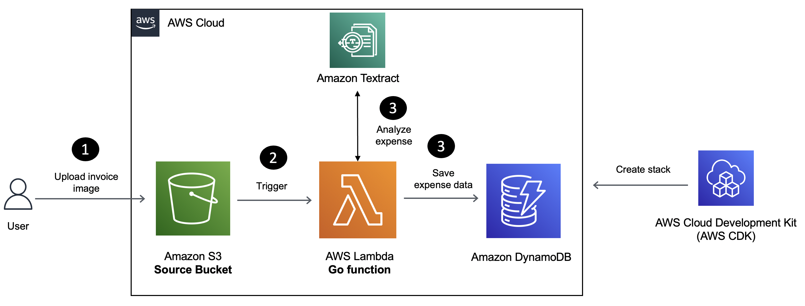
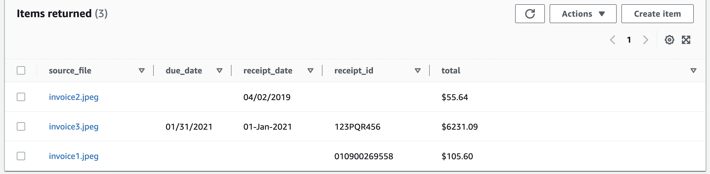

[Amazon Textract](https://docs.aws.amazon.com/textract/latest/dg/what-is.html) is a machine learning service that automatically extracts text, handwriting, and data from scanned documents. It goes beyond simple optical character recognition (OCR) to identify, understand, and extract data from forms and tables. It helps add document text detection and analysis to applications which help businesses automate their document processing workflows and reduce manual data entry, which can save time, reduce errors, and increase productivity.

In this tutorial, you will learn how to build a Serverless solution for invoice processing using Amazon Textract, [AWS Lambda](https://aws.amazon.com/lambda/) and the [Go](https://go.dev/) programming language. We will cover how to:

- Deploy the solution using [AWS CloudFormation](https://aws.amazon.com/cloudformation/).
- Verify the solution.

We will be using the following Go libraries:

- [AWS Lambda for Go](https://github.com/aws/aws-lambda-go).
- [AWS Go SDK](https://pkg.go.dev/github.com/aws/aws-sdk-go-v2/service/textract), specifically for Amazon Textract.
- [Go bindings for AWS CDK](https://docs.aws.amazon.com/cdk/v2/guide/work-with-cdk-go.html) to implement "Infrastructure-as-code" (IaC) for the entire solution and deploy it with the [AWS Cloud Development Kit (CDK) CLI](https://docs.aws.amazon.com/cdk/v2/guide/cli.html).

## Application overview



Here is how the application works:

1. Invoice receipt images uploaded to [Amazon S3](https://docs.aws.amazon.com/AmazonS3/latest/userguide/Welcome.html) trigger a Lambda function.
2. The Lambda function extracts invoice metadata (such as ID, date, amount) and saves it to an [Amazon DynamoDB](https://docs.aws.amazon.com/amazondynamodb/latest/developerguide/Introduction.html) table. 

## Prerequisites

Before starting this tutorial, you will need the following:

- An AWS Account (if you don't yet have one, you can create one and [set up your environment here](https://aws.amazon.com/getting-started/guides/setup-environment/)).
- [Go programming language](https://go.dev/dl/) (**v1.18** or higher).
- [AWS CDK](https://docs.aws.amazon.com/cdk/v2/guide/getting_started.html#getting_started_install).
- [AWS CLI](https://docs.aws.amazon.com/cli/latest/userguide/getting-started-install.html).
- [Git](https://git-scm.com/downloads).

## Sections
<!-- Update with the appropriate values -->
| Attributes                |                                   |
| ------------------- | -------------------------------------- |
| ✅ AWS Level        | 100 - Beginner                          |
| ⏱ Time to complete  | 20 minutes                             |
| 💰 Cost to complete | Free when using the AWS Free Tier      |
| 💻 Code Sample         | Code sample used in tutorial on [GitHub](TODO)                             |
| 📢 Feedback            | <a href="https://pulse.buildon.aws/survey/DEM0H5VW" target="_blank">Any feedback, issues, or just a</a> 👍 / 👎 ?    |
| ⏰ Last Updated     | YYYY-MM-DD                             |

| ToC |
|-----|
<!-- Use the above to auto-generate the table of content. Only build out a manual one if there are too many (sub) sections. -->


## Use AWS CDK to deploy the solution

Clone the project and change to the right directory:

```bash
git clone TODO

cd TODO
```

AWS CDK is a framework that lets you define your cloud infrastructure as code in one of its supported programming and provision it through [AWS CloudFormation](https://aws.amazon.com/cloudformation/).

To start the deployment, invoke the `cdk deploy` command. You will see a list of resources that will be created and will need to provide your confirmation to proceed.

```bash
cd cdk

cdk deploy

# output

Bundling asset TextractInvoiceProcessingGolangStack/textract-function/Code/Stage...

✨  Synthesis time: 5.26

//.... omitted

Do you wish to deploy these changes (y/n)? y
```

Enter `y` to start creating the AWS resources required for the application.

> If you want to see the AWS CloudFormation template which will be used behind the scenes, run `cdk synth` and check the `cdk.out` folder

You can keep track of the stack creation progress in the terminal or navigate to AWS console: `CloudFormation > Stacks > TextractInvoiceProcessingGolangStack`. 

Once the stack creation is complete, you should have:

- An `S3` bucket - Source bucket to upload images.
- A Lambda function to process invoice images using Amazon Textract.
- A `DyanmoDB` table to store the invoice data for each image.
- And a few other components (like `IAM` roles etc.)

You will also see the following output in the terminal (resource names will differ in your case) - these are the names of the `S3` buckets created by CDK:

```bash
✅  TextractInvoiceProcessingGolangStack

✨  Deployment time: 113.51s

Outputs:
TextractInvoiceProcessingGolangStack.invoiceinputbucketname = textractinvoiceprocessin-invoiceimagesinputbucket-bro1y13pib0r
TextractInvoiceProcessingGolangStack.invoiceoutputtablename = textractinvoiceprocessin-invoiceimagesinputbucket-bro1y13pib0r_invoice_output
.....
```

You are ready to verify the solution.

## Extract expense metadata from invoices

To try the solution, you can either use an image of your own or use the sample files provided in the [GitHub repository](TODO) which has a few sample invoices. Use the AWS CLI to upload files:

```bash
export SOURCE_BUCKET=<enter source S3 bucket name from the CDK output>

aws s3 cp ./invoice1.jpeg s3://$SOURCE_BUCKET

# verify that the file was uploaded
aws s3 ls s3://$SOURCE_BUCKET
```

This Lambda function will extract invoice data (ID, total amount etc.) from the image and store them in a `DynamoDB` table. 

Upload other files:

```bash
export SOURCE_BUCKET=<enter source S3 bucket name - check the CDK output>

aws s3 cp ./invoice2.jpeg s3://$SOURCE_BUCKET
aws s3 cp ./invoice3.jpeg s3://$SOURCE_BUCKET
```

Check the `DynamoDB` table in the AWS console - you should see the extracted invoice information.



`DynamoDB` table is designed with source file name as the `partition` key. This allows you to retrieve all invoice data for a given image.

You can also use the AWS CLI to `scan` the table:

```bash
aws dynamodb scan --table-name <enter table name - check the CDK output>
```

## Clean up

Once you're done, to delete all the services, simply use:

```bash
cdk destroy

#output prompt (choose 'y' to continue)

Are you sure you want to delete: RekognitionLabelDetectionGolangStack (y/n)?
```

## Conclusion

In this tutorial, you used AWS CDK to deploy a Go Lambda function to process invoice images using Amazon Textract and store the results in a DynamoDB table.