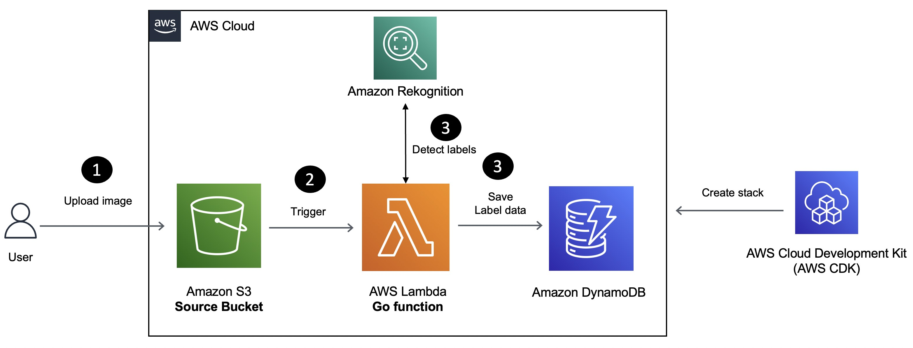
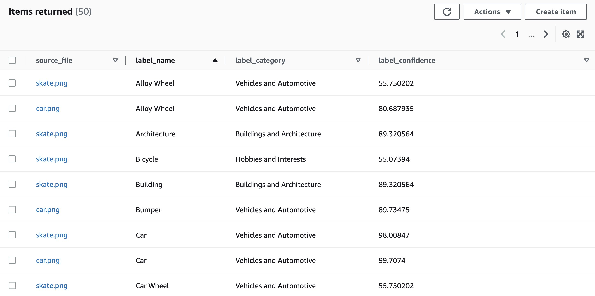

[Amazon Rekognition](https://docs.aws.amazon.com/rekognition/latest/dg/what-is.html?sc_channel=el&sc_campaign=datamlwave&sc_content=label-detection-rekognition-lambda-golang&sc_geo=mult&sc_country=mult&sc_outcome=acq) is a service that lets you analyze images and videos in your applications. You can identify objects, people, text, scenes, and activities, and detect inappropriate content. You can also do facial analysis, face comparison, and face search for various use cases like user verification and public safety. Amazon Rekognition is built on deep learning technology that doesn't require machine learning expertise to use. It has an easy-to-use API that can analyze any image or video file in [Amazon S3](https://docs.aws.amazon.com/AmazonS3/latest/userguide/Welcome.html?sc_channel=el&sc_campaign=datamlwave&sc_content=label-detection-rekognition-lambda-golang&sc_geo=mult&sc_country=mult&sc_outcome=acq).

In this tutorial, you will learn how to build a Serverless solution for image label detection using Amazon Rekognition, [AWS Lambda](https://aws.amazon.com/lambda/?sc_channel=el&sc_campaign=datamlwave&sc_content=label-detection-rekognition-lambda-golang&sc_geo=mult&sc_country=mult&sc_outcome=acq) and the [Go](https://go.dev/) programming language. A label refers to any of the following: objects (flower, tree, or table), events (a wedding, graduation, or birthday party), concepts (a landscape, evening, and nature) or activities (getting out of a car). For example, a photo of people on a tropical beach may contain labels such as Palm Tree (object), Beach (scene), Running (action), and Outdoors (concept).

> Label detection in Rekognition also works for video content. However, this tutorial focuses on image label detection.

We will cover how to:

- Deploy the solution using [AWS CloudFormation](https://aws.amazon.com/cloudformation/?sc_channel=el&sc_campaign=datamlwave&sc_content=label-detection-rekognition-lambda-golang&sc_geo=mult&sc_country=mult&sc_outcome=acq).
- Verify the solution.

We will be using the following Go libraries:

- [AWS Lambda for Go](https://github.com/aws/aws-lambda-go).
- [AWS Go SDK](https://pkg.go.dev/github.com/aws/aws-sdk-go-v2/service/rekognition), specifically for Amazon Rekognition.
- [Go bindings for AWS CDK](https://docs.aws.amazon.com/cdk/v2/guide/work-with-cdk-go.html?sc_channel=el&sc_campaign=datamlwave&sc_content=label-detection-rekognition-lambda-golang&sc_geo=mult&sc_country=mult&sc_outcome=acq) to implement "Infrastructure-as-code" (IaC) for the entire solution and deploy it with the [AWS Cloud Development Kit (CDK) CLI](https://docs.aws.amazon.com/cdk/v2/guide/cli.html?sc_channel=el&sc_campaign=datamlwave&sc_content=label-detection-rekognition-lambda-golang&sc_geo=mult&sc_country=mult&sc_outcome=acq).

## Application overview



Here is how the application works:

1. Images uploaded to [Amazon S3](https://docs.aws.amazon.com/AmazonS3/latest/userguide/Welcome.html?sc_channel=el&sc_campaign=datamlwave&sc_content=label-detection-rekognition-lambda-golang&sc_geo=mult&sc_country=mult&sc_outcome=acq) trigger a Lambda function.
2. The Lambda function extracts list of labels (with their name, category and confidence level) and saves it to an [Amazon DynamoDB](https://docs.aws.amazon.com/amazondynamodb/latest/developerguide/Introduction.html?sc_channel=el&sc_campaign=datamlwave&sc_content=label-detection-rekognition-lambda-golang&sc_geo=mult&sc_country=mult&sc_outcome=acq) table.


## Prerequisites

Before starting this tutorial, you will need the following:

- An AWS Account (if you don't yet have one, you can create one and [set up your environment here](https://aws.amazon.com/getting-started/guides/setup-environment/?sc_channel=el&sc_campaign=datamlwave&sc_content=label-detection-rekognition-lambda-golang&sc_geo=mult&sc_country=mult&sc_outcome=acq)).
- [Go programming language](https://go.dev/dl/) (**v1.18** or higher).
- [AWS CDK](https://docs.aws.amazon.com/cdk/v2/guide/getting_started.html#getting_started_install?sc_channel=el&sc_campaign=datamlwave&sc_content=label-detection-rekognition-lambda-golang&sc_geo=mult&sc_country=mult&sc_outcome=acq).
- [AWS CLI](https://docs.aws.amazon.com/cli/latest/userguide/getting-started-install.html?sc_channel=el&sc_campaign=datamlwave&sc_content=label-detection-rekognition-lambda-golang&sc_geo=mult&sc_country=mult&sc_outcome=acq).
- [Git](https://git-scm.com/downloads).

## Sections
<!-- Update with the appropriate values -->
| Attributes                |                                   |
| ------------------- | -------------------------------------- |
| ✅ AWS Level        | 100 - Beginner                          |
| ⏱ Time to complete  | 20 minutes                             |
| 💰 Cost to complete | Free when using the AWS Free Tier      |
| 💻 Code Sample         | Code sample used in tutorial on [GitHub](TODO)                             |
| 📢 Feedback            | <a href="https://pulse.buildon.aws/survey/DEM0H5VW" target="_blank">Any feedback, issues, or just a</a> 👍 / 👎 ?    |
| ⏰ Last Updated     | 2023-06-20                             |

| ToC |
|-----|
<!-- Use the above to auto-generate the table of content. Only build out a manual one if there are too many (sub) sections. -->

## Use AWS CDK to deploy the solution

Clone the project and change to the right directory:

```bash
git clone TODO

cd TODO
```

The AWS Cloud Development Kit (AWS CDK) is a framework that lets you define your cloud infrastructure as code in one of its supported programming and provision it through [AWS CloudFormation](https://aws.amazon.com/cloudformation/?sc_channel=el&sc_campaign=datamlwave&sc_content=label-detection-rekognition-lambda-golang&sc_geo=mult&sc_country=mult&sc_outcome=acq).

To start the deployment, simply invoke `cdk deploy` and wait for a bit. You will see a list of resources that will be created and will need to provide your confirmation to proceed.

```bash
cd cdk

cdk deploy

# output

Bundling asset RekognitionLabelDetectionGolangStack/rekognition-function/Code/Stage...

✨  Synthesis time: 5.44

//.... omitted

Do you wish to deploy these changes (y/n)? y
```

Enter `y` to start creating the AWS resources required for the application.

> If you want to see the AWS CloudFormation template which will be used behind the scenes, run `cdk synth` and check the `cdk.out` folder

You can keep track of the stack creation progress in the terminal or navigate to AWS console: `CloudFormation > Stacks > RekognitionLabelDetectionGolangStack`. 

Once the stack creation is complete, you should have:

- A `S3` bucket - Source bucket to upload images.
- An AWS Lambda function to extract image labels using Amazon Rekognition.
- A `DynamoDB` table to store the label data for each image.
- And a few other resources (such as `IAM` roles etc.)

You will also see the following output in the terminal (resource names will differ in your case). In this case, these are the names of the `S3` buckets created by CDK:

```bash
 ✅  RekognitionLabelDetectionGolangStack

✨  Deployment time: 119.56s

Outputs:
RekognitionLabelDetectionGolangStack.abeldetectionoutputtablename = rekognitionlabeldetectio-labeldetectioninputbucke-v3vn9o06q3kb_labels_output
RekognitionLabelDetectionGolangStack.labeldetectioninputbucketname = rekognitionlabeldetectio-labeldetectioninputbucke-v3vn9o06q3kb
.....
```

You are ready to verify the solution.

## Extract labels from image

To try the solution, you can either use an image of your own or use the sample files provided in the [GitHub repository](TODO). I will be used the AWS CLI to upload the file, but you can [use the AWS console](https://docs.aws.amazon.com/AmazonS3/latest/userguide/upload-objects.html) as well.

```bash
export SOURCE_BUCKET=<enter source S3 bucket name - check the CDK output>

aws s3 cp ./car.png s3://$SOURCE_BUCKET

# verify that the file was uploaded
aws s3 ls s3://$SOURCE_BUCKET
```

This Lambda function will extract labels from the image and store them in a `DynamoDB` table. 

Upload another file:

```bash
export SOURCE_BUCKET=<enter source S3 bucket name - check the CDK output>

aws s3 cp ./skate.png s3://$SOURCE_BUCKET
```

Check the `DynamoDB` table in the AWS console - you should see results of the label detection for both the images.



`DynamoDB` table is designed with source file name as the partition key and (detected) label name as the sort key. This allows for a couple of query patterns:

- You can get all the labels for a given image.
- You can query for the metadata (category and confidence) for a specific source image and it's label.

You can use the AWS CLI to query the `DynamoDB` table:

```bash
aws dynamodb scan --table-name <enter table name - check the CDK output>
```

Now that you have verified the end-to-end solution, you can clean up the resources and explore the Lambda function logic.

## Clean up

Once you're done, to delete all the services, simply use:

```bash
cdk destroy

#output prompt (choose 'y' to continue)

Are you sure you want to delete: RekognitionLabelDetectionGolangStack (y/n)?
```

## Lambda function code walk through

Here is a quick overview of the Lambda function logic. Please note that some code (error handling, logging etc.) has been omitted for brevity since we only want to focus on the important parts.

```go
func handler(ctx context.Context, s3Event events.S3Event) {
	for _, record := range s3Event.Records {

		sourceBucketName := record.S3.Bucket.Name
		fileName := record.S3.Object.Key

		err := labelDetection(sourceBucketName, fileName)
	}
}
```

The Lambda function is triggered when a new image is uploaded to the source bucket. The function iterates through the list of files and calls the `labelDetection` function for each image.

Let's go through the `labelDetection` function.

```go
func labelDetection(sourceBucketName, fileName string) error {

	resp, err := rekognitionClient.DetectLabels(context.Background(), &rekognition.DetectLabelsInput{
		Image: &types.Image{
			S3Object: &types.S3Object{
				Bucket: aws.String(sourceBucketName),
				Name:   aws.String(fileName),
			},
		},
	})

	for _, label := range resp.Labels {
		item := make(map[string]ddbTypes.AttributeValue)

		item["source_file"] = &ddbTypes.AttributeValueMemberS{Value: fileName}
		item["label_name"] = &ddbTypes.AttributeValueMemberS{Value: *label.Name}
		item["label_category"] = &ddbTypes.AttributeValueMemberS{Value: *label.Categories[0].Name}
		item["label_confidence"] = &ddbTypes.AttributeValueMemberN{Value: fmt.Sprintf("%v", aws.ToFloat32(label.Confidence))}

		_, err := dynamodbClient.PutItem(context.Background(), &dynamodb.PutItemInput{
			TableName: aws.String(table),
			Item:      item,
		})
	}

	return nil
}
```

- The `labelDetection` function uses the Amazon Rekognition [DetectLabels](https://pkg.go.dev/github.com/aws/aws-sdk-go-v2/service/rekognition#Client.DetectLabels) API to returns a list of labels.
- The function then iterates through each of those labels and stores the label name, category and confidence score in the `DynamoDB` table.

## Conclusion

In this tutorial, you used AWS CDK to deploy a Go Lambda function to detect labels in images using Amazon Rekognition and store the results in a DynamoDB table. Here are a few things you can try out to extend this solution: 

- Explore how to build a solution to [analyze videos](https://docs.aws.amazon.com/rekognition/latest/dg/video.html?sc_channel=el&sc_campaign=datamlwave&sc_content=label-detection-rekognition-lambda-golang&sc_geo=mult&sc_country=mult&sc_outcome=acq) stored in a `S3` bucket.
- Even better, try to [processing streaming video](https://docs.aws.amazon.com/rekognition/latest/dg/streaming-video.html?sc_channel=el&sc_campaign=datamlwave&sc_content=label-detection-rekognition-lambda-golang&sc_geo=mult&sc_country=mult&sc_outcome=acq) to extract labels in real-time.