In this tutorial, you will learn how to deploy a trained machine learning (ML) model to a real-time inference endpoint using Amazon SageMaker Studio.

SageMaker Studio is an integrated development environment (IDE) for ML that provides a fully managed Jupyter notebook interface where you can perform end-to-end ML lifecycle tasks, including model deployment.

SageMaker offers different inference options to support a broad range of use-cases, such as:

* [SageMaker Real-Time](https://docs.aws.amazon.com/sagemaker/latest/dg/realtime-endpoints.html) Inference for workloads with low latency requirements in the order of milliseconds
* [SageMaker Serverless Inference](https://docs.aws.amazon.com/sagemaker/latest/dg/serverless-endpoints.html) for workloads with intermittent or infrequent traffic patterns
* [SageMaker Asynchronous Inference](https://docs.aws.amazon.com/sagemaker/latest/dg/async-inference.html) for inferences with large payload sizes or requiring long processing times
* [SageMaker batch transform](https://docs.aws.amazon.com/sagemaker/latest/dg/batch-transform.html) to run predictions on batches of data

Specifically, you will learn how to do the following:

- Create a SageMaker model from a trained model artifact.
- Configure and deploy a real-time inference endpoint to serve the model.
- Invoke the endpoint to run sample predictions using test data.
- Attach an auto scaling policy to the endpoint to handle traffic changes.

You will use the Real-Time Inference option to deploy a binary classification XGBoost model that has already been trained on a synthetic auto insurance claims dataset. The dataset consists of details and extracted features from claims and customer tables along with a fraud column indicating whether a claim was fraudulent or something else. The model predicts the probability of a claim being fraudulent. For the purposes of this tutorial, you will play the role of a machine learning engineer that deploys this model and runs sample inferences.


## Table of Contents

| Attributes                |                                   |
| ------------------- | -------------------------------------- |
| ✅ AWS Level        | 100 - Beginner                          |
| ⏱ Time to complete  | 25 minutes                             |
| 💰 Cost to complete | See [SageMaker pricing](https://aws.amazon.com/sagemaker/pricing/) to estimate cost for this tutorial. |
| 🧩 Prerequisites    | [AWS Account](https://aws.amazon.com/resources/create-account/?sc_channel=el&sc_campaign=devopswave&sc_content=cicdcdkpthnec2aws&sc_geo=mult&sc_country=mult&sc_outcome=acq)                         |
| 📢 Feedback            | <a href="https://pulse.buildon.aws/survey/DEM0H5VW" target="_blank">Any feedback, issues, or just a</a> 👍 / 👎 ?    |
| ⏰ Last Updated     | YYYY-MM-DD                             |


| ToC |
|-----|


## Setting up your Amazon SageMaker Studio domain

With Amazon SageMaker, you can deploy models visually using the console or programmatically using SageMaker Studio or SageMaker notebooks. In this tutorial, you will deploy the models programmatically using a SageMaker Studio notebook, which requires a SageMaker Studio domain.

An AWS account can have multiple Studio domains per AWS Region. If you already have a SageMaker Studio domain in the US East (N. Virginia) Region, follow the [SageMaker Studio Set Up guide](https://aws.amazon.com/getting-started/hands-on/machine-learning-tutorial-set-up-sagemaker-studio-account-permissions/) to attach the required AWS Identity and Access Management (IAM) policies to your SageMaker Studio account. Then, skip the **Set up your Amazon SageMaker Studio domain** step, and proceed directly to step **Set up a SageMaker Studio notebook.**

If you don't have an existing SageMaker Studio domain, continue with step **Set up your Amazon SageMaker Studio domain** to run an AWS CloudFormation template that creates a SageMaker Studio domain and adds the permissions required for the rest of this tutorial.

Begin by choosing [AWS CloudFormation stack](https://us-east-1.console.aws.amazon.com/cloudformation/home?region=us-east-1#/stacks/quickcreate?templateURL=https://sagemaker-sample-files.s3.amazonaws.com/libraries/sagemaker-user-journey-tutorials/CFN-SM-IM-Lambda-catalog.yaml&stackName=CFN-SM-IM-Lambda-Catalog). This opens the AWS CloudFormation console and creates your SageMaker Studio domain and a user named studio-user. It also adds the required permissions to your SageMaker Studio account. In the CloudFormation console, confirm that `US East (N. Virginia)` is the `Region` displayed in the upper-right corner. `Stack name` should be `CFN-SM-IM-Lambda-Catalog`, and should not be changed. This stack takes about 10 minutes to create all the resources.

This stack assumes that you already have a public virtual private cloud (VPC) set up in your account. If you do not have a public VPC, read [VPC with a single public subnet](https://docs.aws.amazon.com/vpc/latest/userguide/VPC_Scenario1.html) to learn how to create a public VPC. Your console should be as follows: 

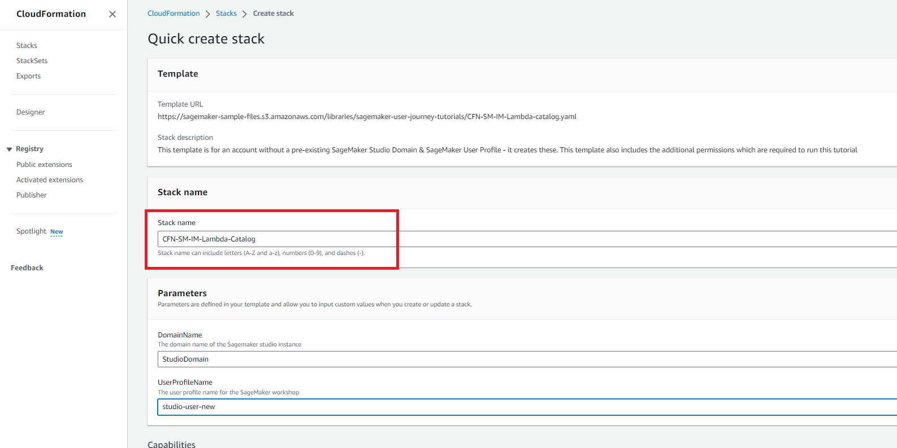

Next, select `I acknowledge that AWS CloudFormation might create IAM resources` and choose `Create stack`:

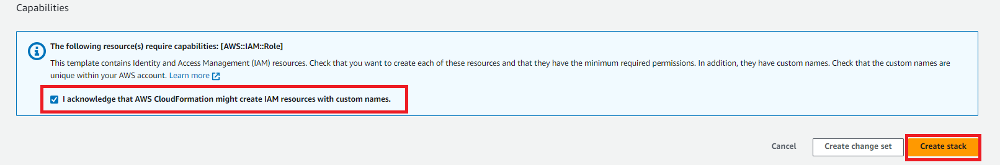

On the [CloudFormation] pane, choose [Stacks]. It takes about 10 minutes for the stack to be created. When the stack is created, the status of the stack changes from `[CREATE_IN_PROGRESS]` to `[CREATE_COMPLETE]`:

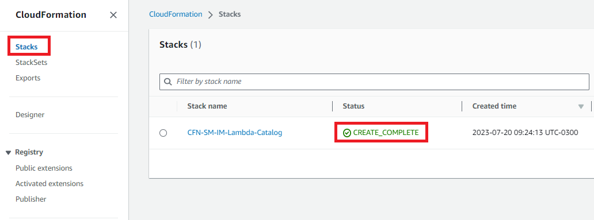

Your SageMager Studio domain is now successfully set up.


## Setting up a SageMaker Studio notebook

In this step, you will launch a new SageMaker Studio notebook instance, install the necessary open-source libraries, and configure the SageMaker variables required to fetch the trained model artifacts from Amazon S3. Since the model artifact cannot be directly deployed for inference, you need to first create SageMaker models from the model artifacts. Thesemodels will contain the training and inference code that SageMaker will use for model deployment.

First, enter `SageMaker Studio` into the console search bar, and then choose `SageMaker Studio`:

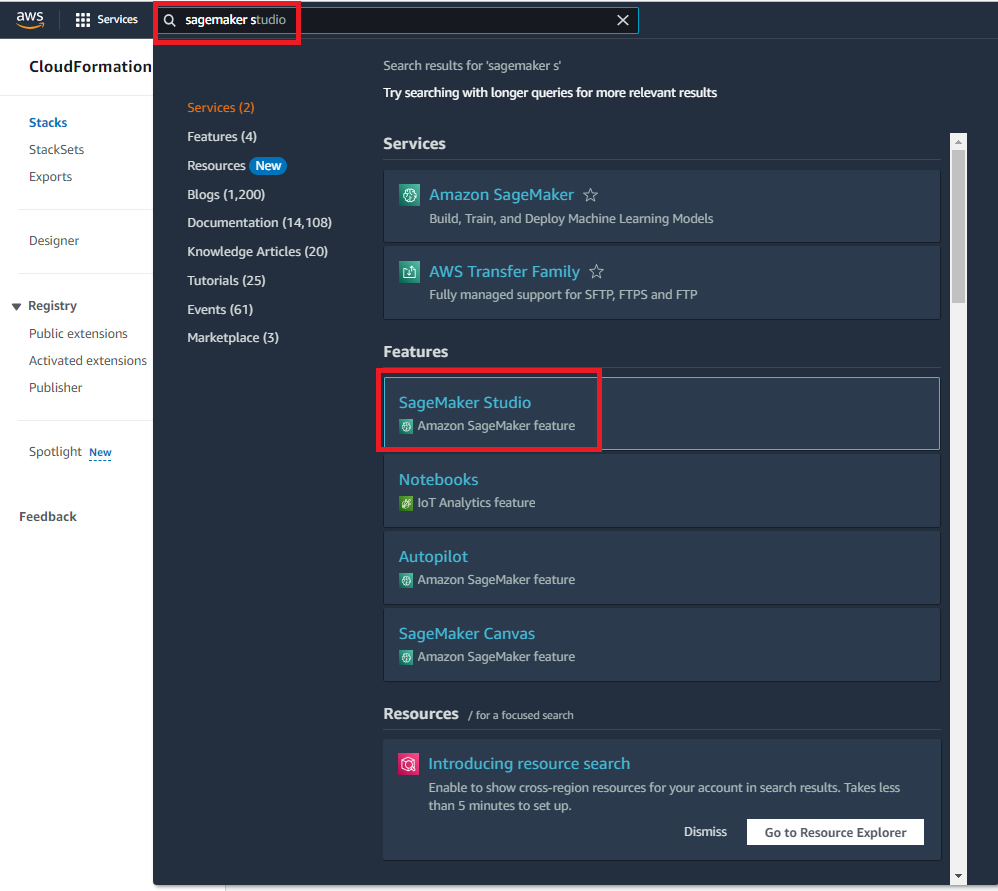

Choose `US East (N. Virginia)` from the `Region` drop-down list on the upper-right corner of the SageMaker console. Select `Studio` from the left navigation pane to open the SageMaker Studio using the studio-user profile:

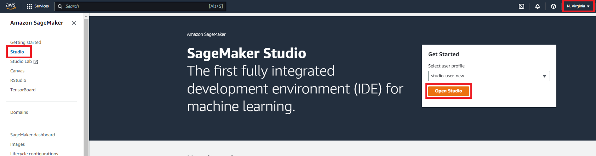

Now open the SageMaker Studio interface. On the navigation bar, choose `File`, `New`, then `Notebook`:

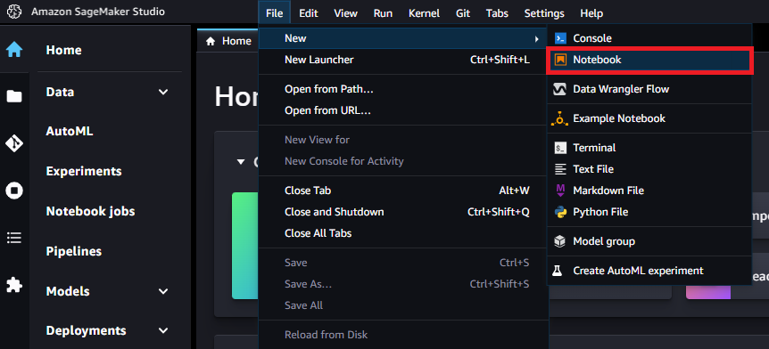

In the `Set up notebook environment` dialog box, under `Image`, select `Data Science`. The `Python 3` kernel is selected automatically. Choose `Select`:

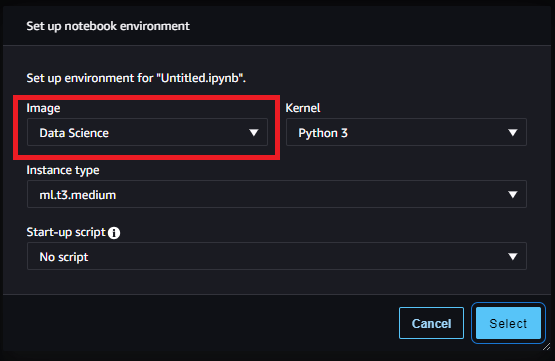

Next, insert the following code snippet into a cell in the notebook, and press `Shift + Enter` to run the current cell to update the `aiobotocore` library, which is an API to interact with many of the AWS services. **Ignore any warnings to restart the kernel or any dependency conflict errors**:

```Python
%pip install --upgrade -q aiobotocore
```

You also need to instantiate the S3 client object and the locations inside your default S3 bucket, where the model artifacts are uploaded. To do this, insert the following code into a cell in the notebook and run it. Notice that the write bucket *`sagemaker-<your-Region>-<your-account-id>`* is automatically created by the `SageMaker session` object in `line 16` in the following code. The datasets that you use for training exist in a public S3 bucket named `sagemaker-sample-files`, which has been specified as the read bucket in `line 29`. The location inside the bucket is specified through the read prefix:

```Python
import pandas as pd
import numpy as np
import boto3
import sagemaker
import time
import json
import io
from io import StringIO
import base64
import pprint
import re

from sagemaker.image_uris import retrieve

sess = sagemaker.Session()
write_bucket = sess.default_bucket()
write_prefix = "fraud-detect-demo"

region = sess.boto_region_name
s3_client = boto3.client("s3", region_name=region)
sm_client = boto3.client("sagemaker", region_name=region)
sm_runtime_client = boto3.client("sagemaker-runtime")
sm_autoscaling_client = boto3.client("application-autoscaling")

sagemaker_role = sagemaker.get_execution_role()

# S3 locations used for parameterizing the notebook run
read_bucket = "sagemaker-sample-files"
read_prefix = "datasets/tabular/synthetic_automobile_claims" 
model_prefix = "models/xgb-fraud"

data_capture_key = f"{write_prefix}/data-capture"

# S3 location of trained model artifact
model_uri = f"s3://{read_bucket}/{model_prefix}/fraud-det-xgb-model.tar.gz"

# S3 path where data captured at endpoint will be stored
data_capture_uri = f"s3://{write_bucket}/{data_capture_key}"

# S3 location of test data
test_data_uri = f"s3://{read_bucket}/{read_prefix}/test.csv" 
```

Your SageMaker Studio notebook is now set up and you’re ready to move on to the next step.


## Creating a Real-Time Inference endpoint

In SageMaker, there are multiple methods to deploy a trained model to a Real-Time Inference endpoint, such as [SageMaker SDK](https://sagemaker.readthedocs.io/en/stable/v2.html), [AWS SDK - Boto3](https://boto3.amazonaws.com/v1/documentation/api/latest/reference/services/sagemaker.html), and SageMaker console. For more information, read [Deploy Models for Inference](https://docs.aws.amazon.com/sagemaker/latest/dg/deploy-model.html) in the Amazon SageMaker Developer Guide. SageMaker SDK has more abstractions compared to the AWS SDK - Boto3, with the latter exposing lower-level APIs for greater control over model deployment. In this tutorial, you will deploy the model using the AWS SDK - Boto3. There are three steps you need to follow in sequence to deploy a model:

- Create a SageMaker model from the model artifact.
- Create an endpoint configuration to specify properties, including instance type and count.
- Create the endpoint using the endpoint configuration.

To create a SageMaker model using the trained model artifacts stored in Amazon S3, insert the following code. The `create_model` method takes the Docker container with the training image (for this model, the XGBoost container) and the Amazon S3 location of the model artifacts as parameters:

```Python
# Retrieve the SageMaker managed XGBoost image
training_image = retrieve(framework="xgboost", region=region, version="1.3-1")

# Specify a unique model name that does not exist
model_name = "fraud-detect-xgb"
primary_container = {
                     "Image": training_image,
                     "ModelDataUrl": model_uri
                    }

model_matches = sm_client.list_models(NameContains=model_name)["Models"]
if not model_matches:
    model = sm_client.create_model(ModelName=model_name,
                                   PrimaryContainer=primary_container,
                                   ExecutionRoleArn=sagemaker_role)
else:
    print(f"Model with name {model_name} already exists! Change model name to create new")
```

You can check the newly created model in the SageMaker console under the `Models` section:

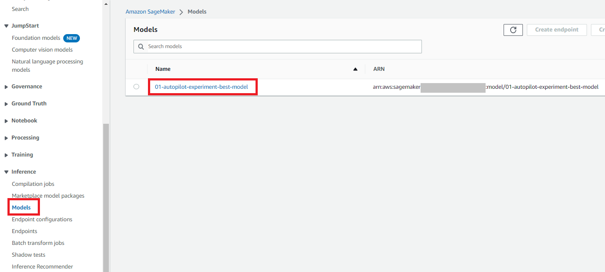

After the SageMaker model is created, insert the following code to use the `Boto3 create_endpoint_config` method to configure the endpoint. The main inputs to `the create_endpoint_config` method are the endpoint configuration name and variant information, such as inference instance type and count, the name of the model to be deployed, and the traffic share the endpoint should handle. Alongside these settings, you can also set up data capture by specifying a `DataCaptureConfig`. This feature allows you to configure the real-time endpoint to capture and store the requests and/or responses in Amazon S3. The data capture is one of the steps in setting up [model monitoring](https://docs.aws.amazon.com/sagemaker/latest/dg/model-monitor.html), and when combined with baseline metrics and monitoring jobs, it helps you to monitor the model performance by comparing test data metrics with baselines. This monitoring is useful to schedule model re-training based on model,data drift, and auditing purposes. In the current setup, both the input (incoming test data) and output (model predictions) are captured and stored in your default S3 bucket:

```Python
# Endpoint Config name
endpoint_config_name = f"{model_name}-endpoint-config"

# Endpoint config parameters
production_variant_dict = {
                           "VariantName": "Alltraffic",
                           "ModelName": model_name,
                           "InitialInstanceCount": 1,
                           "InstanceType": "ml.m5.xlarge",
                           "InitialVariantWeight": 1
                          }

# Data capture config parameters
data_capture_config_dict = {
                            "EnableCapture": True,
                            "InitialSamplingPercentage": 100,
                            "DestinationS3Uri": data_capture_uri,
                            "CaptureOptions": [{"CaptureMode" : "Input"}, {"CaptureMode" : "Output"}]
                           }

# Create endpoint config if one with the same name does not exist
endpoint_config_matches = sm_client.list_endpoint_configs(NameContains=endpoint_config_name)["EndpointConfigs"]
if not endpoint_config_matches:
    endpoint_config_response = sm_client.create_endpoint_config(
                                                                EndpointConfigName=endpoint_config_name,
                                                                ProductionVariants=[production_variant_dict],
                                                                DataCaptureConfig=data_capture_config_dict
                                                               )
else:
		print(f"Endpoint config with name {endpoint_config_name} already exists! Change endpoint config name to create new")
```

You can check the endpoint configuration in the SageMaker console under the `Endpoint configurations` section:

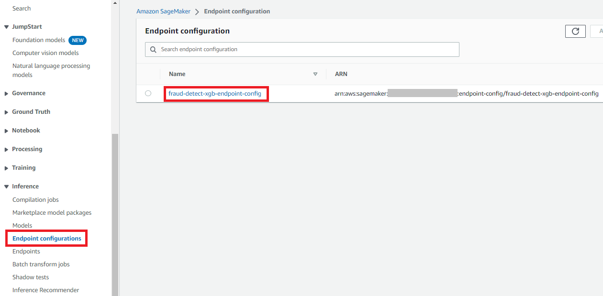

Insert the following code to create the endpoint. The `create_endpoint` method takes the endpoint configuration as a parameter, and deploys the model specified in the endpoint configuration to a compute instance. It takes about six minutes to deploy the model:

```Python
endpoint_name = f"{model_name}-endpoint"

endpoint_matches = sm_client.list_endpoints(NameContains=endpoint_name)["Endpoints"]
if not endpoint_matches:
    endpoint_response = sm_client.create_endpoint(
                                                  EndpointName=endpoint_name,
                                                  EndpointConfigName=endpoint_config_name
                                                 )
else:
    print(f"Endpoint with name {endpoint_name} already exists! Change endpoint name to create new")

resp = sm_client.describe_endpoint(EndpointName=endpoint_name)
status = resp["EndpointStatus"]
while status == "Creating":
    print(f"Endpoint Status: {status}...")
    time.sleep(60)
    resp = sm_client.describe_endpoint(EndpointName=endpoint_name)
    status = resp["EndpointStatus"]
print(f"Endpoint Status: {status}")
```

To check the status of the endpoint, select `Deployments` from the `Home` menu in the SageMaker Studio console. Select `Endpoints`, and double-click on the `fraud-detect-xgb-endpoint`:

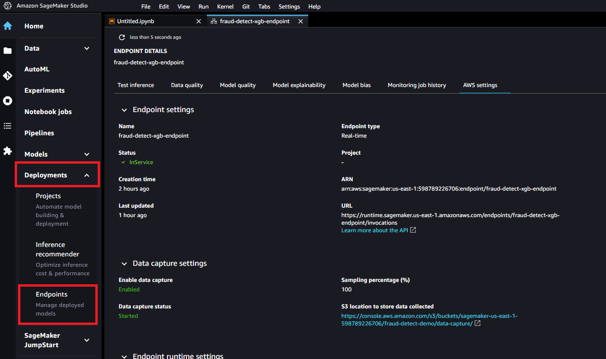

Your Real-Time Inference endpoint is now ready to be invoked in the next step. 


## Invoke the inference endpoint

After the endpoint status changes to `InService`, you can invoke the endpoint using the REST API, AWS SDK - Boto3, SageMaker Studio, AWS CLI, or SageMaker Python SDK. In this tutorial, you will use the AWS SDK - Boto3. Before calling an endpoint, it is important that the test data is formatted suitably for the endpoint using serialization and deserialization. Serialization is the process of converting raw data to a format such as .csv to byte streams that the endpoint can use. Deserialization is the reverse process of converting byte streams to human-readable format. In this tutorial, you will invoke the endpoint by sending the first five samples from a test dataset. 

To invoke the endpoint and get prediction results, insert the following code. Since the request to the endpoint (test dataset) is in the .csv format, a csv serialization process is used to create the payload. The response is then deserialized to an array of predictions. After the execution completes, the cell returns the model predictions and the true labels for the test samples. Notice that the XGBoost model returns probabilities instead of actual class labels. The model has predicted a very low likelihood for the test samples to be fraudulent claims and the predictions are in line with the true labels:

```Python
# Fetch test data to run predictions with the endpoint
test_df = pd.read_csv(test_data_uri)

# For content type text/csv, payload should be a string with commas separating the values for each feature
# This is the inference request serialization step
# CSV serialization
csv_file = io.StringIO()
test_sample = test_df.drop(["fraud"], axis=1).iloc[:5]
test_sample.to_csv(csv_file, sep=",", header=False, index=False)
payload = csv_file.getvalue()
response = sm_runtime_client.invoke_endpoint(
                                             EndpointName=endpoint_name,
                                             Body=payload,
                                             ContentType="text/csv",
                                             Accept="text/csv"
                                            )

# This is the inference response deserialization step
# This is a bytes object
result = response["Body"].read()
# Decoding bytes to a string
result = result.decode("utf-8")
# Converting to list of predictions
result = re.split(",|\n",result)

prediction_df = pd.DataFrame()
prediction_df["Prediction"] = result[:5]
prediction_df["Label"] = test_df["fraud"].iloc[:5].values
prediction_df 
```

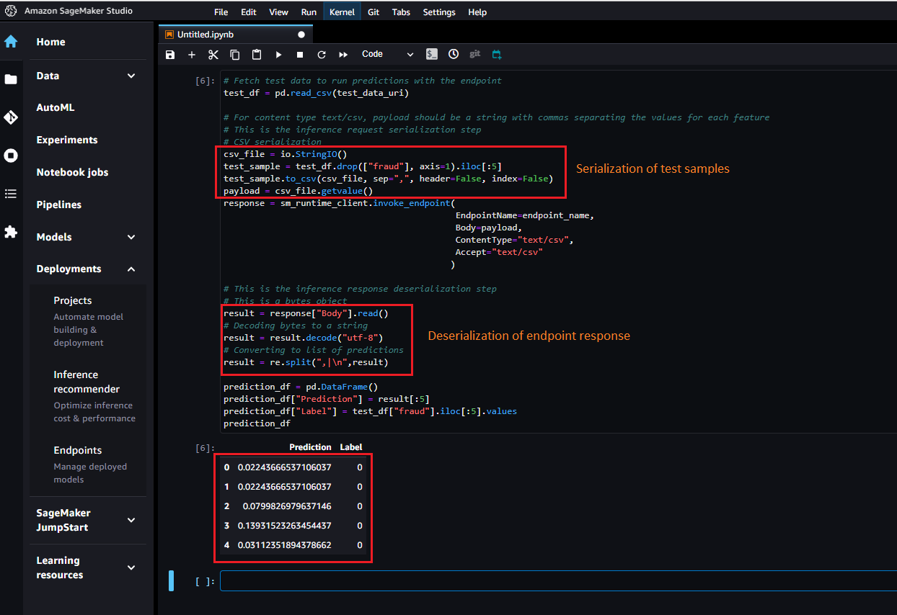

To monitor the endpoint invocation metrics, open the SageMaker console. From`Inference`, select `Endpoints`, `fraud-detect-xgb-endpoint`:


On the `Endpoint details` page, under `Monitor`, choose `View invocation metrics`. Initially, you might see only a single dot in the metrics chart. But after multiple invocations, you will see a line similar to the one in the following example:

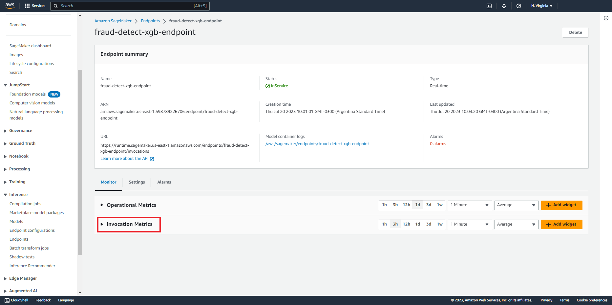

The `Metrics` page shows multiple endpoint performance metrics. You can choose different time periods, such as over 1 hour or 3 hours, to visualize the endpoint performance. Select any metric to see its trend over the chosen time period. In the next step, you choose one of these metrics to define auto scaling policies:

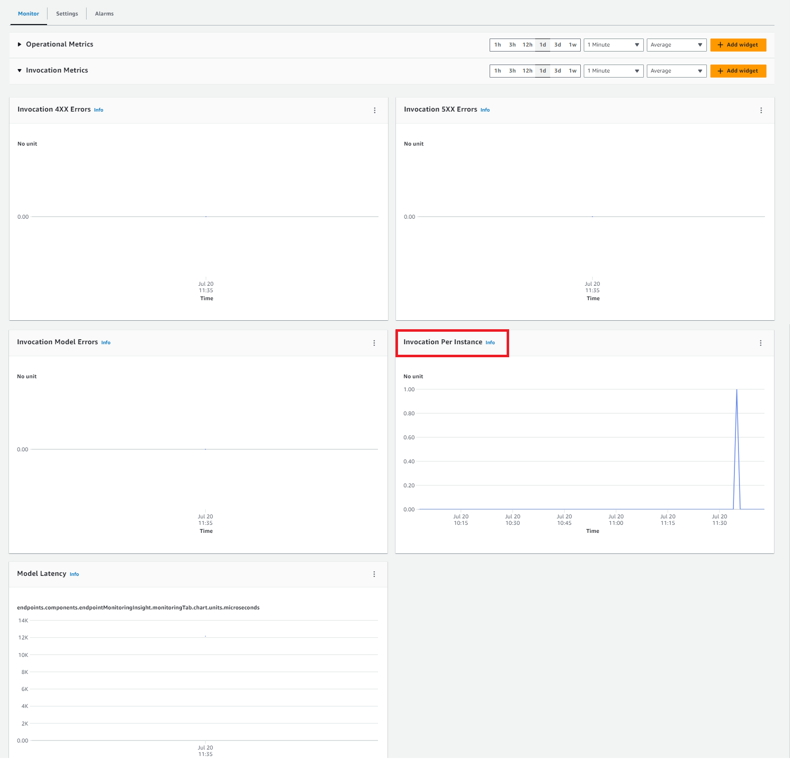

Because data capture was set up in the endpoint configuration, you have a way to inspect what payload was sent to the endpoint alongside its response. The captured data takes some time to get fully uploaded to S3. Insert the following code to check if data capture is complete:

```Python
from sagemaker.s3 import S3Downloader
print("Waiting for captures to show up", end="")
for _ in range(90):
    capture_files = sorted(S3Downloader.list(f"{data_capture_uri}/{endpoint_name}"))
    if capture_files:
        capture_file = S3Downloader.read_file(capture_files[-1]).split("\n")
        capture_record = json.loads(capture_file[0])
        if "inferenceId" in capture_record["eventMetadata"]:
            break
    print(".", end="", flush=True)
    time.sleep(1)
print()
print(f"Found {len(capture_files)} Data Capture Files:")
```

The captured data is stored as a separate file for each endpoint invocation in S3 in [JSON Lines](https://jsonlines.org/), a newline-delimited format to store structured data where each line is a JSON value. Insert the following code to retrieve the data capture files:

```Python
capture_files = sorted(S3Downloader.list(f"{data_capture_uri}/{endpoint_name}"))
capture_file = S3Downloader.read_file(capture_files[0]).split("\n")
capture_record = json.loads(capture_file[0])
capture_record
```

Now insert the following code to decode the data in the captured files using `base64`. The code retrieves the five test samples that were sent in as payload, and their predictions. This feature is useful in inspecting endpoint loads with model responses and monitoring the model performance:

```Python
input_data = capture_record["captureData"]["endpointInput"]["data"]
output_data = capture_record["captureData"]["endpointOutput"]["data"]
input_data_list = base64.b64decode(input_data).decode("utf-8").split("\n")
print(input_data_list)
output_data_list = base64.b64decode(output_data).decode("utf-8").split("\n")
print(output_data_list)
```

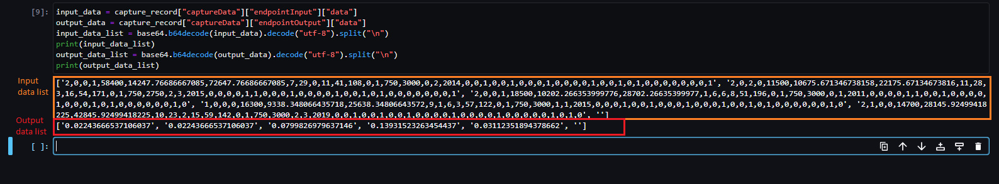

Now that you’ve invoked your inference endpoint, you can continue to the next step to configure it for auto scaling. 


## Configuring auto scaling for endpoint

Workloads that use Real-Time Inference endpoints usually have low latency requirements. Furthermore, when traffic spikes, Real-Time Inference endpoints can experience CPU overload, high latency, or timeouts. Therefore, it's important to scale capacity to handle traffic changes efficiently with low latency. SageMaker inference auto scaling monitors your workloads and dynamically adjusts the instance count to maintain steady and predictable endpoint performance at a low cost. When the workload increases, auto scaling brings more instances online, and when the workload decreases, it removes unnecessary instances, helping you reduce your compute cost. In this step, you will use AWS SDK - Boto3 to set up auto scaling to your endpoint. SageMaker provides multiple types of autoscaling: target tracking scaling, step scaling, on-demand scaling, and scheduled scaling. Additionally, you willuse a [target tracking scaling policy](https://docs.aws.amazon.com/autoscaling/application/APIReference/API_TargetTrackingScalingPolicyConfiguration.html), which is triggered when a chosen scaling metric increases over a chosen target threshold.

Auto scaling can be set up in two steps. First, you can configure a scaling policy with details of minimum, desired, and maximum number of instances per endpoint. Insert the following code to configure a target tracking scaling policy. The specified maximum number of instances are launched when traffic goes over chosen thresholds, which you will choose in the next step:

```Python
resp = sm_client.describe_endpoint(EndpointName=endpoint_name)

# SageMaker expects resource id to be provided with the following structure
resource_id = f"endpoint/{endpoint_name}/variant/{resp['ProductionVariants'][0]['VariantName']}"

# Scaling configuration
scaling_config_response = sm_autoscaling_client.register_scalable_target(
                                                          ServiceNamespace="sagemaker",
                                                          ResourceId=resource_id,
                                                          ScalableDimension="sagemaker:variant:DesiredInstanceCount", 
                                                          MinCapacity=1,
                                                          MaxCapacity=2
                                                        )
```

Now, insert the following code to create the scaling policy. The chosen scaling metric is `SageMakerVariantInvocationsPerInstance`, which is the average number of times per minute that each inference instance for a model variant is invoked. When this number crosses the chosen threshold of `5`, the auto scaling is triggered:

```Python
# Create Scaling Policy
policy_name = f"scaling-policy-{endpoint_name}"
scaling_policy_response = sm_autoscaling_client.put_scaling_policy(
                                                PolicyName=policy_name,
                                                ServiceNamespace="sagemaker",
                                                ResourceId=resource_id,
                                                ScalableDimension="sagemaker:variant:DesiredInstanceCount",
                                                PolicyType="TargetTrackingScaling",
                                                TargetTrackingScalingPolicyConfiguration={
                                                    "TargetValue": 5.0, # Target for avg invocations per minutes
                                                    "PredefinedMetricSpecification": {
                                                        "PredefinedMetricType": "SageMakerVariantInvocationsPerInstance",
                                                    },
                                                    "ScaleInCooldown": 600, # Duration in seconds until scale in
                                                    "ScaleOutCooldown": 60 # Duration in seconds between scale out
                                                }
                                            )
```

Then insert the following code to retrieve the scaling policy details:

```Python
response = sm_autoscaling_client.describe_scaling_policies(ServiceNamespace="sagemaker")

pp = pprint.PrettyPrinter(indent=4, depth=4)
for i in response["ScalingPolicies"]:
    pp.pprint(i["PolicyName"])
    print("")
    if("TargetTrackingScalingPolicyConfiguration" in i):
        pp.pprint(i["TargetTrackingScalingPolicyConfiguration"])
```

Next, insert the following code to stress-test the endpoint. The code runs for 250 seconds and invokes the endpoint repeatedly by sending randomly selected samples from the test dataset:

```Python
request_duration = 250
end_time = time.time() + request_duration
print(f"Endpoint will be tested for {request_duration} seconds")
while time.time() < end_time:
    csv_file = io.StringIO()
    test_sample = test_df.drop(["fraud"], axis=1).iloc[[np.random.randint(0, test_df.shape[0])]]
    test_sample.to_csv(csv_file, sep=",", header=False, index=False)
    payload = csv_file.getvalue()
    response = sm_runtime_client.invoke_endpoint(
                                                 EndpointName=endpoint_name,
                                                 Body=payload,
                                                 ContentType="text/csv"
                                                )
```

You can monitor the endpoint metrics using Amazon SageMaker. For a list of available endpoint metrics, including *invocation*, read [SageMaker Endpoint Invocation Metrics](https://docs.aws.amazon.com/sagemaker/latest/dg/monitoring-cloudwatch.html#cloudwatch-metrics-endpoint-invocation). On the SageMaker console, under `Inference`, choose `Endpoints`and then `fraud-detect-xgb-endpoint`. On the `Endpoint details` page, navigate to the `Monitor` section, and choose `View invocation metrics`. On the `Metrics` page, select `InvocationsPerInstance`, a monitoring metric you choose when setting up the scaling policy.

On the `Monitor` page, you can visually inspect the traffic pattern received by the endpoint, and change the time granularity, for example from the default `5` minutes to `1` minute. It may take a few minutes for auto scaling to add the second instance. Once the new instance is added, you will notice that invocations per instance are half of the total invocations:

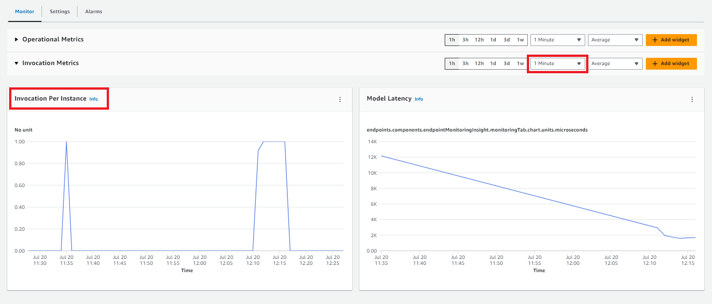

When the endpoint receives the increased payload, you can check the status of the endpoint by running the following code. This code checks when the status of the endpoint changes from `InService` to `Updating` and keeps track of the instance counts. After a few minutes, you can see the status changing from `InService` to `Updating` and back to `InService` but with a higher instance count:

```Python
# Check the instance counts after the endpoint gets more load
response = sm_client.describe_endpoint(EndpointName=endpoint_name)
endpoint_status = response["EndpointStatus"]
request_duration = 250
end_time = time.time() + request_duration
print(f"Waiting for Instance count increase for a max of {request_duration} seconds. Please re run this cell in case the count does not change")
while time.time() < end_time:
    response = sm_client.describe_endpoint(EndpointName=endpoint_name)
    endpoint_status = response["EndpointStatus"]
    instance_count = response["ProductionVariants"][0]["CurrentInstanceCount"]
    print(f"Status: {endpoint_status}")
    print(f"Current Instance count: {instance_count}")
    if (endpoint_status=="InService") and (instance_count>1):
        break
    else:
        time.sleep(15)
```

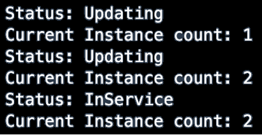

Now that you’ve successfully configured auto scaling for your endpoint, next you will clean up your resources.

## Cleaning up resources

It is a best practice to delete resources that you are no longer using so that you don't incur additional charges.

First, delete the model, endpoint configuration, and endpoint you created in this tutorial by running the following code block in your notebook. If you do not delete the endpoint, your account will keep accumulating charges for the compute instance running at the endpoint:

```Python
# Delete model
sm_client.delete_model(ModelName=model_name)

# Delete endpoint configuration
sm_client.delete_endpoint_config(EndpointConfigName=endpoint_config_name)

# Delete endpoint
sm_client.delete_endpoint(EndpointName=endpoint_name)
```

To delete the S3 bucket, take the following steps:

- Open the Amazon S3 console. On the navigation bar, choose `Buckets`, `sagemaker-<your-Region>-<your-account-id>`, and then select the checkbox next to `fraud-detect-demo`. Then, choose `Delete`.
- On the `Delete objects` dialog box, verify that you have selected the proper object to delete and enter `permanently delete` into the `Permanently delete objects` confirmation box.
- Once this is complete and the bucket is empty, you can delete the `sagemaker-<your-Region>-<your-account-id>` bucket by following the same procedure again.

Your deleted S3 bucket should be as follows: 

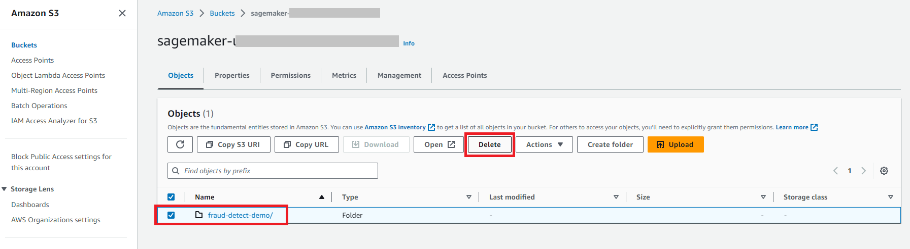

The Data Science kernel used for running the notebook image in this tutorial will accumulate charges until you stop the kernel or perform the following steps to delete the apps. For more information, read [Shut Down Resources](https://docs.aws.amazon.com/sagemaker/latest/dg/notebooks-run-and-manage-shut-down.html) in the Amazon SageMaker Developer Guide.

To delete the SageMaker Studio apps, on the SageMaker Studio console choose `studio-user`, and then delete all the apps listed under `Apps` by choosing `Delete app`. Wait until the `Status` changes to `Deleted`:

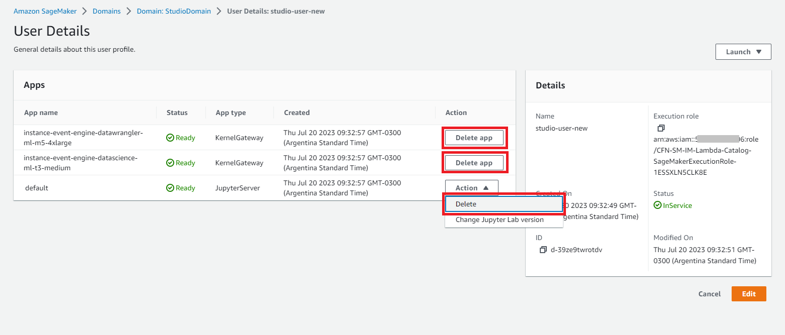

If you used an existing SageMaker Studio domain in step **Setting up your Amazon SageMaker Studio domain**, skip the rest of step **Cleaning up the resources** and proceed directly to the conclusion section.

If you ran the CloudFormation template in step **Setting up your Amazon SageMaker Studio domain** to create a new SageMaker Studio domain, continue with the following step to delete the domain, user, and the resources created by the CloudFormation template:

Open the CloudFormation console and in the pane choose `Stacks`. Select `CFN-SM-IM-Lambda-catalog`, choose `Delete` to delete the stack along with the resources it created in step **Setting up your Amazon SageMaker Studio domain**.

You’ve now successfully deleted and cleaned up all of your resources for this tutorial.


## Conclusion

In this tutorial, you created a SageMaker model and deployed it to a real-time inference endpoint. You used the AWS SDK - Boto3 API to invoke the endpoint and test it by running sample inferences while leveraging the data capture feature to save endpoint payloads and responses to Amazon S3. Finally, you configured auto-scaling by using a target endpoint invocation metric to handle traffic fluctuations.
