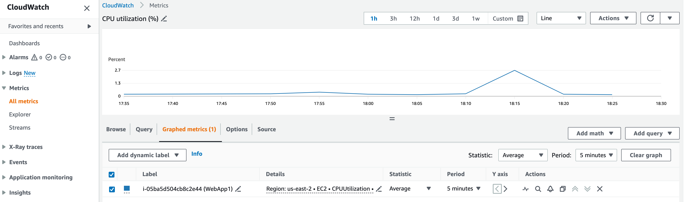
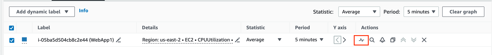
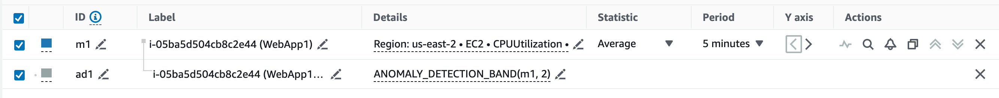
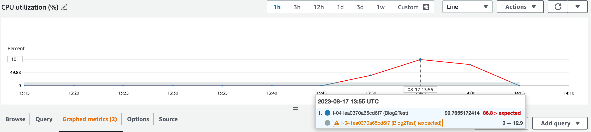
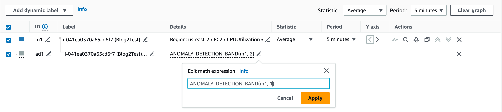
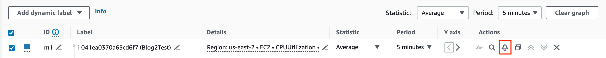
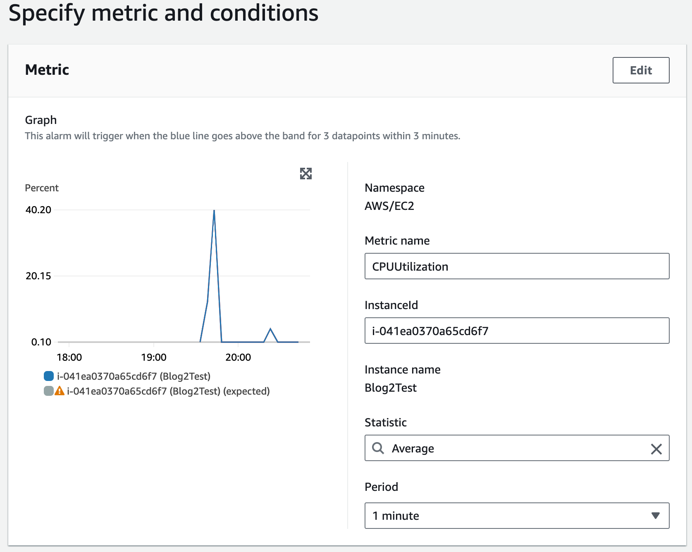
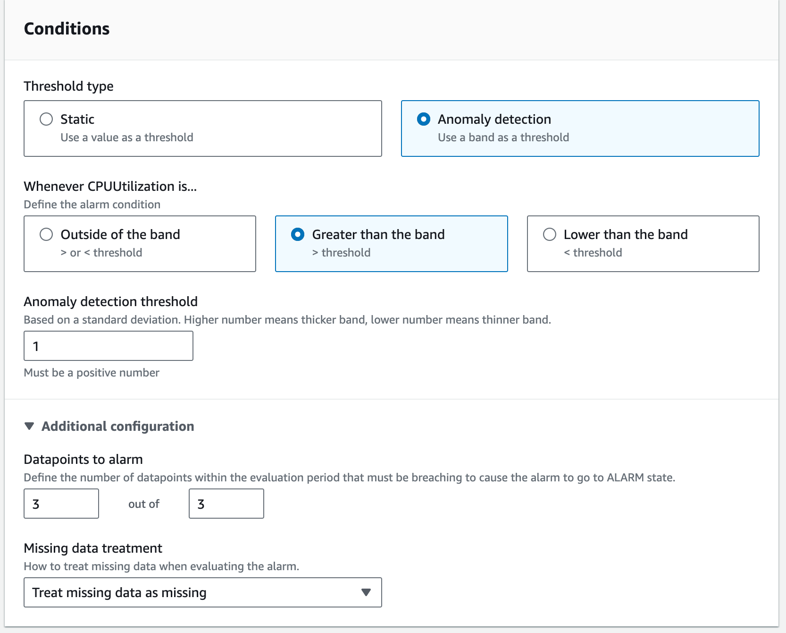
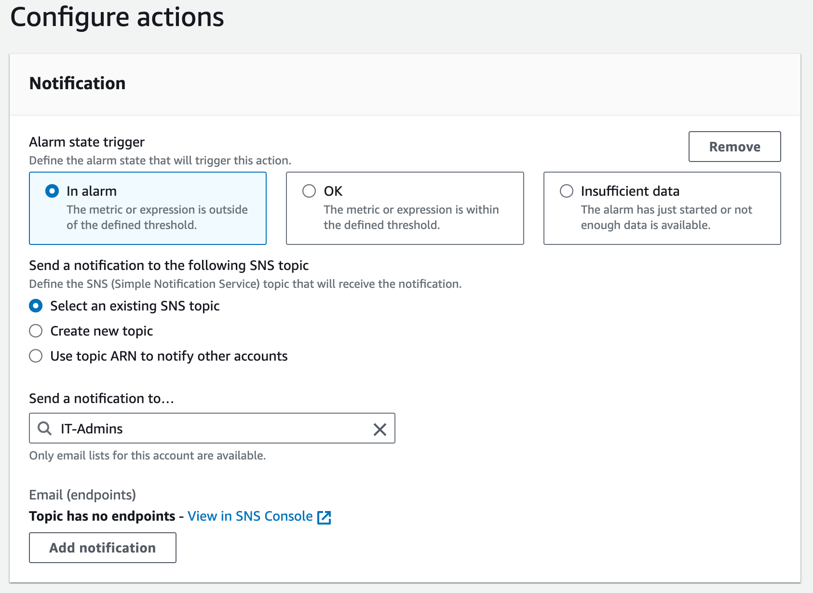

Have you ever tried to access your favorite application, and instead you were greeted by an error? As you refresh multiple times, you are left with a feeling of disappointment and decide to move on to something else. That split second of application downtime can result in a lost customer, a missed sale, and ultimately lost revenue. What if there is a way to monitor your application to prevent downtime, and do it in a way that requires minimal setup and ongoing maintenance? 

In this post I will show you how to enable and configure CloudWatch anomaly detection so you can spend more time developing your application and less time on maintenance.

## What you will learn

- How to enable CloudWatch anomaly detection
- How to create alarms and actions in CloudWatch

## Prerequisites

| Attributes                |                                   |
| ------------------- | -------------------------------------- |
| ✅ AWS Level        | Intermediate - 200                         |
| ⏱ Time to complete  | 15 minutes                             |
| 💰 Cost to complete | Free when using the AWS Free Tier or USD 1.01      |
| 🧩 Prerequisites    | [AWS Account](https://aws.amazon.com/resources/create-account/?sc_channel=el&sc_campaign=devopswave&sc_content=cicdetlsprkaws&sc_geo=mult&sc_country=mult&sc_outcome=acq)
| 💻 Code Sample         | Code sample used in tutorial on [GitHub](<link if you have a code sample associated with the post, otherwise delete this line>)                             |
| 📢 Feedback            | <a href="https://pulse.buildon.aws/survey/DEM0H5VW" target="_blank">Any feedback, issues, or just a</a> 👍 / 👎 ?    |
| ⏰ Last Updated     | YYYY-MM-DD                             |

| ToC |
|-----|
<!-- Use the above to auto-generate the table of content. Only build out a manual one if there are too many (sub) sections. -->

---
## Step 1 - Determine metrics to monitor

First, we need to determine the best CloudWatch metrics for monitoring the uptime of your application. Here are some metrics to consider:

* **Application Load Balancer**: active connection count, failed connection count, request count, latency
* **Auto Scaling**: number of instances, scaling activities, desired capacity
* **Database Pool**: number of connections, idle connections, connection errors
* **Error Rate**: errors from application logs [integrated with CloudWatch logs](https://docs.aws.amazon.com/AmazonCloudWatch/latest/monitoring/Install-CloudWatch-Agent.html)
* **Heartbeat/Ping Monitoring**: custom metric that pings application endpoint for a heartbeat
* **HTTP(S) Requests**: response time, status codes (2xx, 4xx, 5xx)
* **Instance Utilization**: CPU usage, memory utilization, disk space monitor
* **Network**: network in/out

In addition to the above metrics, you can also create custom metrics specific to your business. For example, if your application processes orders or sells goods, you could create a custom metric to monitor the number of orders processed successfully.

Once enabled on each of the above metrics, CloudWatch Anomaly Detection will apply machine learning to the metric data and surface anomalies in their behavior. This allows you to focus only on addressing behaviors outside of expected behavior and no longer have to adjust alarm thresholds to yield the results you want from unexpected fluctuations in your incoming data.

## Step 2 - Enable anomaly detection

Now that we know the types of metrics we want to monitor for our application, we need to set them up in CloudWatch. I will setup anomaly detection on the EC2 Instance Utilization metric using the steps below. The same process can be applied to any metric.

In the Amazon CloudWatch console, select Metrics, and choose your metric. Once selected, navigate to the ‘Graphed metrics’ tab.

Select the anomaly detection icon in the actions menu

A new anomaly generated metric will be created with its own band

At this point, anomaly detection is now enabled on the selected metric. Once enabled, CloudWatch applies machine learning algorithms to the metric’s past data to create a model of expected values. It is recommended to have at least two weeks of historical data to train the model, but it can still work with less than two weeks.

You will see gray confidence bands overlayed in the graph as shown below. The gray bands indicate the expected values according the CloudWatch machine learning models and the anomalous values are red. In this example, there was a spike of 100% CPU Utilization for several minutes.

You can adjust the sensitivity of the anomaly detection by editing the threshold and changing the second number in the math expression box. Change the number to a smaller value such as 1.0 if you need tighter bands for greater precision or increase the number for a wider range. Click Apply to save the change.

## Step 3 - Configure alarms & actions

Now that we have the metrics we want to monitor configured for CloudWatch anomaly detection, we can choose to send an alarm via Amazon SNS or triggering a AWS Lambda function at the first signs of trouble. While viewing the metric with anomaly detection enabled, select the bell icon to configure an alarm.

Here I will set the alarm to trigger when the anomaly threshold is higher than the band more than three times within a period of one minute. This means an alarm will be sent if the CPU utilization is higher than normal usage for a sustained period of three minutes.

On the next page, I have set the CloudWatch alarm to send a notification to an Amazon SNS topic. With the Amazon SNS topic, you can subscribe pertinent users to be notified about the alarm or subscribe a Lambda function to perform custom remediation actions.

## Clean up

Do I need this section since nothing was provisioned?

## Conclusion

In this tutorial, I explained how to use the machine learning features of CloudWatch anomaly detection to monitor key metrics helpful in detecting issues before applications fail. I also showed you how to proactively take action with an alert and triggering a remediation action. This is determined by the Anomaly Detection model, which has learned expected behavior from historical CPU Utilization data.

By using CloudWatch Anomaly Detection to monitor application uptime, we are able proactively identify and address issues before they escalate, leading to improved customer experience. You no longer have to set and adjust alarm thresholds, leaving you more time to run your business!
Identify natural next steps for curious readers, and suggest two or three useful articles based on those next steps.

For a detailed look on how to fine tune your Cloudwatch anomaly learning models, visit the [CloudWatch anomaly detection user guide](https://docs.aws.amazon.com/AmazonCloudWatch/latest/monitoring/CloudWatch_Anomaly_Detection.html).

If you enjoyed this tutorial, found any issues, or have feedback for us, <a href="https://pulse.buildon.aws/survey/DEM0H5VW" target="_blank">please send it our way!</a>
