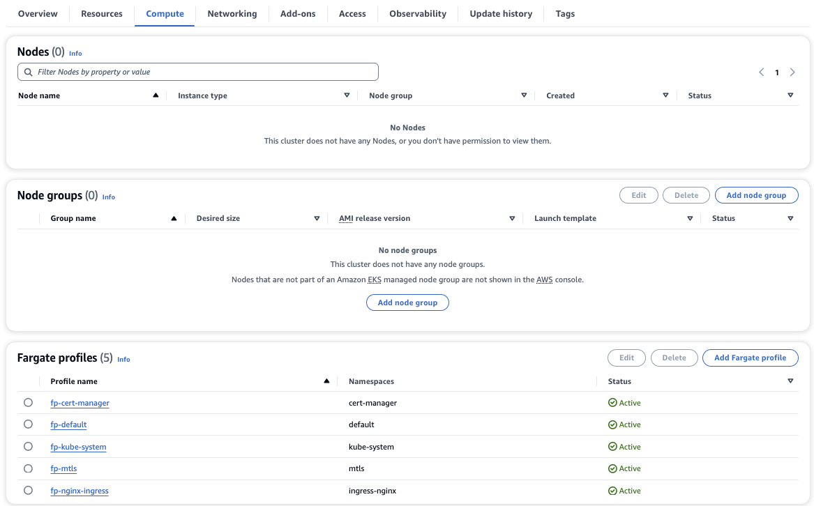

In the realm of [Open Banking](https://docs.aws.amazon.com/wellarchitected/latest/financial-services-industry-lens/open-banking.html?sc_channel=el&sc_campaign=devops&sc_content=eks-cluster-financial-workloads&sc_geo=mult&sc_country=mult&sc_outcome=acq), safeguarding sensitive financial information and upholding strict regulatory standards are paramount. Security isn't just a priority; it serves as the foundational cornerstone upon which trust and compliance are constructed. Enterprises must not only guarantee the security of their containerized applications but also streamline their management, all while minimizing administrative overhead. For sectors like Banking, where security is non-negotiable, the demand for simplified and robust cluster setups cannot be overstated. This tutorial equips organizations to precisely address this need. By harnessing the power of [Amazon Elastic Kubernetes Service](https://aws.amazon.com/eks/?sc_channel=el&sc_campaign=devops&sc_content=eks-cluster-financial-workloads&sc_geo=mult&sc_country=mult&sc_outcome=acq) (EKS) in conjunction with [Fargate](https://aws.amazon.com/fargate/?sc_channel=el&sc_campaign=devops&sc_content=eks-cluster-financial-workloads&sc_geo=mult&sc_country=mult&sc_outcome=acq) — a serverless container compute engine free from conventional nodes—you can liberate yourself from the complexities of infrastructure management. Instead, you can establish highly secure Kubernetes clusters that seamlessly align with the rigorous security requirements of sectors like Open Banking.

This tutorial shows you how to create an [AWS Fargate](https://docs.aws.amazon.com/AmazonECS/latest/userguide/what-is-fargate.html?sc_channel=el&sc_campaign=devops&sc_content=eks-cluster-financial-workloads&sc_geo=mult&sc_country=mult&sc_outcome=acq)-based Amazon EKS cluster using an [eksctl](https://eksctl.io/) “quickstart” template. This use case-specific template creates and sets up a cluster preconfigured and ready to run your utmost security-sensitive workloads.


| Attributes             |                                                                 |
|------------------------|-----------------------------------------------------------------|
| ✅ AWS experience      | 200 - Intermediate                                              |
| ⏱ Time to complete     | 30 minutes                                                      |
| 🧩 Prerequisites       | - [AWS Account](https://aws.amazon.com/resources/create-account/?sc_channel=el&sc_campaign=devops&sc_content=eks-cluster-financial-workloads&sc_geo=mult&sc_country=mult&sc_outcome=acq)|
| 📢 Feedback            | <a href="https://www.pulse.aws/survey/Z8XBGQEL" target="_blank">Any feedback, issues, or just a</a> 👍 / 👎 ?    |
| ⏰ Last Updated        | 2024-01-15                                                    |

| ToC |
|-----|

## Prerequisites

Before you begin this tutorial, you need to:

* An active [Amazon Web Services (AWS) account](https://aws.amazon.com/resources/create-account/?sc_channel=el&sc_campaign=devops&sc_content=eks-cluster-financial-workloads&sc_geo=mult&sc_country=mult&sc_outcome=acq).
* Install and configure the latest version of the [AWS CLI (v2)](https://docs.aws.amazon.com/cli/latest/userguide/getting-started-install.html?sc_channel=el&sc_campaign=devops&sc_content=eks-cluster-financial-workloads&sc_geo=mult&sc_country=mult&sc_outcome=acq). To check your version, run: `aws --version`.
* Install the latest version of [kubectl](https://kubernetes.io/docs/tasks/tools/#kubectl). To check your version, run: `kubectl version`.
* Install the latest version of [eksctl](https://eksctl.io/installation/). To check your version, run: `eksctl info`.

## Overview

This tutorial is part of a series on managing security-sensitive workloads using Amazon EKS, and it's dedicated to simplifying cluster management with AWS Fargate. This tutorial shows not only how to create an EKS cluster with Fargate but also how to manage your workloads on it. It covers the following components:

* **Serverless Compute**: [AWS Fargate](https://docs.aws.amazon.com/eks/latest/userguide/fargate.html?sc_channel=el&sc_campaign=devops&sc_content=eks-cluster-financial-workloads&sc_geo=mult&sc_country=mult&sc_outcome=acq) obviates the need for overseeing underlying infrastructure, sparing you from having to managed EC2 instances. Traditional Kubernetes deployments often involve manual provisioning, scaling, patching, and maintenance of these instances. With Fargate, AWS takes care of these tasks, reducing administrative overhead. When AWS Fargate creates a Fargate pod, it attaches an ENI in the isolated subnet to the pod.
* **Authentication**: Necessary IAM Roles for Service Accounts (IRSAs) mappings to enable communication between Kubernetes pods and AWS services. This includes the [AWS Load Balancer Controller (LBC)](https://kubernetes-sigs.github.io/aws-load-balancer-controller/) used to expose applications, [Kubernetes External DNS](https://github.com/kubernetes-sigs/external-dns) to automatically manage DNS records and facilitate external service discovery, and [Cert Manager](https://cert-manager.io/) to streamline management of SSL/TLS certificates. Additionally, an [OpenID Connect (OIDC) endpoint](https://docs.aws.amazon.com/eks/latest/userguide/enable-iam-roles-for-service-accounts.html?sc_channel=el&sc_campaign=devops&sc_content=eks-cluster-financial-workloads&sc_geo=mult&sc_country=mult&sc_outcome=acq) enables seamless and secure communication.
* **Sample Application Deployment**: Deploy a sample workload in an mTLS namespace. This workload encompasses the deployment of a sample application configured to use Fargate for the compute capacity.
* **Networking Modes**: [Cluster endpoint](https://docs.aws.amazon.com/eks/latest/userguide/cluster-endpoint.html?sc_channel=el&sc_campaign=devops&sc_content=eks-cluster-financial-workloads&sc_geo=mult&sc_country=mult&sc_outcome=acq) access control lets you configure whether the endpoint is reachable from the public internet or through your VPC. You can enable the public endpoint (default), private endpoint, or both endpoints at the same time. You can change the endpoint settings at anytime using the EKS console or API. Disabling the public endpoint is mostly ideal for Financial workloads that intends to prevent unwanted connectivity from the internet.
* **Control Plane Logging**: Enable [Amazon EKS control plane logging](https://docs.aws.amazon.com/eks/latest/userguide/control-plane-logs.html?sc_channel=el&sc_campaign=devops&sc_content=eks-cluster-financial-workloads&sc_geo=mult&sc_country=mult&sc_outcome=acq) to provide audit and diagnostic logs directly from the Amazon EKS control plane to CloudWatch Logs.
* **Secret Encryption**: Further encrypt [Kubernetes secrets](https://kubernetes.io/docs/concepts/configuration/secret/) with KMS keys that you create or import keys generated from another system to AWS KMS and use them with the cluster. The KMS keys that you create are customer managed keys (CMK). This further encryption is considered a [security best practice](https://aws.github.io/aws-eks-best-practices/security/docs/data/#recommendations_1) for applications that store sensitive data.

## Step 1: Configure the Cluster

In this section, you will configure the Amazon EKS cluster to meet the specific demands of security-sensitive applications. By creating this `cluster-config.yaml` file, you'll define the settings for IAM roles for service accounts, your own [AWS KMS](https://docs.aws.amazon.com/kms/latest/developerguide/overview.html?sc_channel=el&sc_campaign=devops&sc_content=eks-cluster-financial-workloads&sc_geo=mult&sc_country=mult&sc_outcome=acq) key to enable secret encryption in your cluster, enabled all the available control log type that corresponds to the available components of the Kubernetes control plane and configure log retention for 60 days. you'll also create several Linux node pools provided by [Fargate Profiles](https://docs.aws.amazon.com/eks/latest/userguide/fargate-profile.html?sc_channel=el&sc_campaign=devops&sc_content=eks-cluster-financial-workloads&sc_geo=mult&sc_country=mult&sc_outcome=acq) for the respective workloads in specified namespaces.

1. Create a Customer Managed Key (CMK) in the region you in intend to create the cluster to further encrypt your Kubernetes secrets.  We will input the CMK into the create cluster command:

```bash
export AWS_DEFAULT_REGION="us-east-2"
aws kms create-alias --alias-name alias/fgsecurityquickstart --target-key-id $(aws kms create-key --query KeyMetadata.Arn --output text)
export KMS_KEY_ARN=$(aws kms describe-key --key-id alias/fgsecurityquickstart --query KeyMetadata.Arn --output text)
echo $KMS_KEY_ARN
```

1. Create a `cluster-config.yaml` file and paste the following contents into it. Replace the `region` with your preferred region. The region should be the same as the CMK created in earlier step.

```yaml

apiVersion: eksctl.io/v1alpha5
kind: ClusterConfig

metadata:
  name: fg-security-quickstart
  region: us-east-2
  version: "1.28"
  tags:
    # Add more cloud tags if needed for billing
    environment: fargate-security-quickstart

iam:
  withOIDC: true  
  serviceAccounts:
  - metadata:
      name: aws-load-balancer-controller
      namespace: kube-system
    wellKnownPolicies:
      awsLoadBalancerController: true    
  - metadata:
      name: external-dns
      namespace: kube-system
    wellKnownPolicies:
      externalDNS: true
  - metadata:
      name: cert-manager
      namespace: cert-manager
    wellKnownPolicies:
      certManager: true

vpc:
    cidr: 10.20.0.0/24
    # optional: disable public access to endpoint and only allow private access
    clusterEndpoints:
      publicAccess: true
      privateAccess: true    

fargateProfiles:
  - name: fp-default
    selectors:
      - namespace: default

  - name: fp-nginx-ingress
    selectors:
      - namespace: ingress-nginx

  - name: fp-mtls
    selectors:
      - namespace: mtls

  - name: fp-kube-system
    selectors:
      - namespace: kube-system

  - name: fp-cert-manager
    selectors:
      - namespace: cert-manager
      
cloudWatch:
 clusterLogging:
 # enable all types of cluster control plane logs 
   enableTypes: ["*"]
    # Sets the number of days to retain the logs for (see [CloudWatch docs](https://docs.aws.amazon.com/AmazonCloudWatchLogs/latest/APIReference/API_PutRetentionPolicy.html#API_PutRetentionPolicy_RequestSyntax)).
    # By default, log data is stored in CloudWatch Logs indefinitely.
   logRetentionInDays: 60
   
secretsEncryption:
  # replace this with the ARN of the KMS key
  keyARN: "arn:aws:kms:us-east-2:000000000000:key/00000000-0000-0000-0000-000000000000"  
   
```

## **Step 2: Create the Cluster**

Now, we're ready to create our Amazon EKS cluster. This process takes several minutes to complete. If you'd like to monitor the status, see the [AWS CloudFormation](https://console.aws.amazon.com/cloudformation?sc_channel=el&sc_campaign=devops&sc_content=eks-cluster-financial-workloads&sc_geo=mult&sc_country=mult&sc_outcome=acq) console.

1. Create the EKS cluster using the `cluster-config.yaml`.

```bash
eksctl create cluster -f cluster-config.yaml
```

Upon completion, you should see the following response output:

```bash
2023-12-10 05:24:20 [✔]  EKS cluster "fg-security-quickstart" in "us-east-2" region is ready
```

Note: The command above will create an Amazon EKS cluster with some pre-configured service accounts needed for the steps in the solution.  

**Optionally**, open the [Amazon EKS console](https://console.aws.amazon.com/eks/home#/clusters?sc_channel=el&sc_campaign=devops&sc_content=eks-cluster-financial-workloads&sc_geo=mult&sc_country=mult&sc_outcome=acq), choose the ‘fg-security-quickstart’ and select the **Compute** tab. You will see that there are no Amazon EC2 nodes in the cluster, eliminating the possibility of logging into the nodes to install or configure packages.



When the previous command completes, verify the state of your cluster by running the following command:

```bash
kubectl get pods -A -o wide
```

The expected output should look like this:

```bash
NAMESPACE     NAME                       READY   STATUS    RESTARTS   AGE     IP            NODE                                                NOMINATED NODE   READINESS GATES
kube-system   coredns-747476996f-bnmrs   1/1     Running   0          7m14s   10.20.0.168   fargate-ip-10-20-0-168.us-east-2.compute.internal   <none>           <none>
kube-system   coredns-747476996f-zhvvp   1/1     Running   0          7m14s   10.20.0.133   fargate-ip-10-20-0-133.us-east-2.compute.internal   <none>           <none>
```

## Step 3: Deploy Sample Application

Now, you're ready to deploy security-sensitive workloads to your Kubernetes cluster. The sample application that follows is a basic frontend web application that returns a text message. Copy and paste the following code block in its entirety into your terminal to create the sample workload:

```yaml
cat << EOF > mtls.yaml
kind: Deployment
apiVersion: apps/v1
metadata:
  name: mtls-app
  labels:
    app: mtls
spec:
  replicas: 1
  selector:
    matchLabels:
      app: mtls
  template:
    metadata:
      labels:
        app: mtls
    spec:
      containers:
      - name: mtls-app
        image: hashicorp/http-echo
        args:
          - "-text=Sample Application in Amazon EKS on Fargate"

---
kind: Service
apiVersion: v1
metadata:
  name: mtls-service
spec:
  selector:
    app: mtls
  ports:
    - port: 5678 # Default port for the container image
EOF
```

Run the following commands to create the ‘mtls’ namespace and deploy the application:

```bash
kubectl create namespace mtls

kubectl create -f mtls.yaml -n mtls
```

After about 60 seconds, verify that the application is running on Fargate:

```bash
kubectl get pods -n mtls -o wide
```

The expected output should look like this:

```bash
NAME                       READY   STATUS    RESTARTS   AGE   IP            NODE                                                NOMINATED NODE   READINESS GATES
mtls-app-f586f477c-9h4lj   1/1     Running   0          54s   10.20.0.145   fargate-ip-10-20-0-145.us-east-2.compute.internal   <none>           <none>
```

Run the commands below to create a test pod in the same namespace as the application:

```bash
kubectl run tmp --image=nginx:alpine -n mtls

kubectl get pod tmp -n mtls
```

Wait for about 60s for the pod to be in running state. Verify the application is successfully deployed:

```bash
kubectl exec -it tmp -n mtls -- curl http://mtls-service:5678 
```

Expected result:

```bash
Sample Application in Amazon EKS on Fargate
```

Refer to the [mTLS in Amazon EKS Fargate](https://community.aws/tutorials/navigating-amazon-eks#list-of-all-tutorials) tutorial where we build onto this tutorial and explored how to enable Mutual TLS to authenticate clients while establishing TLS-encrypted connections—a common requirement for business-to-business applications.

## Clean up

To avoid incurring future charges, you should delete the resources created during this tutorial. You can delete the resources with the following commands:

```bash
# Delete the namespace and all resources
kubectl delete namespace mtls

# Delete the cluster
eksctl delete cluster -f ./cluster-config.yaml
```

## Conclusion

In this tutorial, you’ve successfully set up an Amazon EKS cluster with only Fargate nodes. This infrastructure has laid the foundation you need for secured workload deployments with reduced risks and less administrative efforts in managing the cluster. To further tighten the security of the cluster, you can enable private only cluster endpoint. With private endpoint only enabled, all traffic to your cluster API server must come from within your cluster’s VPC or a connected network using [AWS VPN](https://docs.aws.amazon.com/vpn/index.html?sc_channel=el&sc_campaign=devops&sc_content=eks-cluster-financial-workloads&sc_geo=mult&sc_country=mult&sc_outcome=acq) or AWS [DirectConnect](https://docs.aws.amazon.com/directconnect/latest/UserGuide/Welcome.html?sc_channel=el&sc_campaign=devops&sc_content=eks-cluster-financial-workloads&sc_geo=mult&sc_country=mult&sc_outcome=acq). There is no public access to your API server from the internet. Any `kubectl` commands must be executed from within the VPC or a connected network. To build on this setup, the installation of the [ExternalDNS](https://kubernetes-sigs.github.io/aws-load-balancer-controller/v2.5/guide/integrations/external_dns/), [AWS Load Balancer Controller](https://docs.aws.amazon.com/eks/latest/userguide/aws-load-balancer-controller.html?sc_channel=el&sc_campaign=devops&sc_content=eks-cluster-financial-workloads&sc_geo=mult&sc_country=mult&sc_outcome=acq) and [Fargate logging](https://docs.aws.amazon.com/eks/latest/userguide/fargate-logging.html?sc_channel=el&sc_campaign=devops&sc_content=eks-cluster-financial-workloads&sc_geo=mult&sc_country=mult&sc_outcome=acq) are still required. For an example, explore the tutorial on setting up [mTLS in Amazon EKS Fargate](https://community.aws/tutorials/navigating-amazon-eks#list-of-all-tutorials).