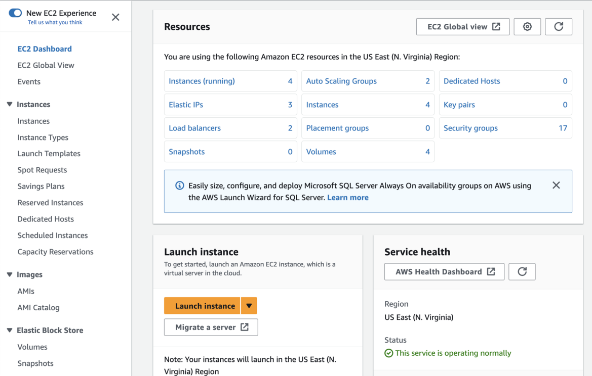
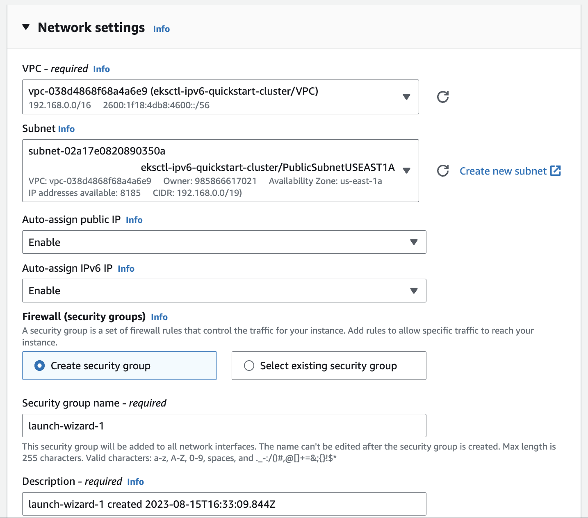
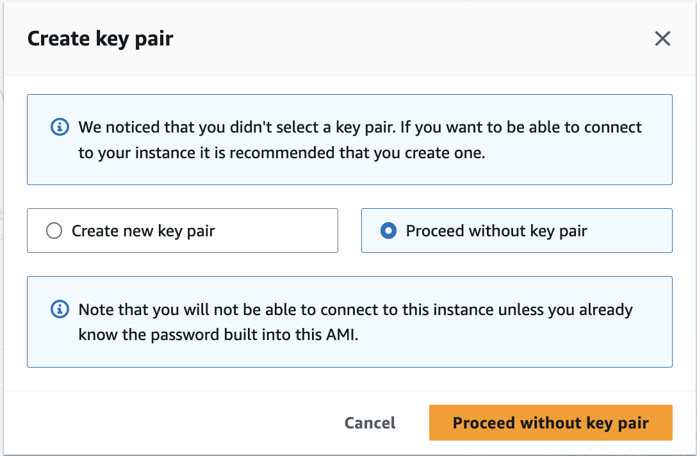
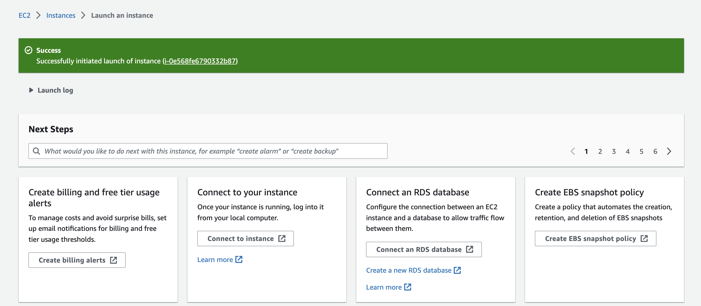
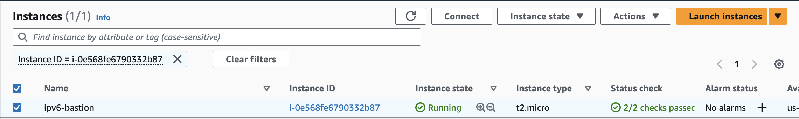
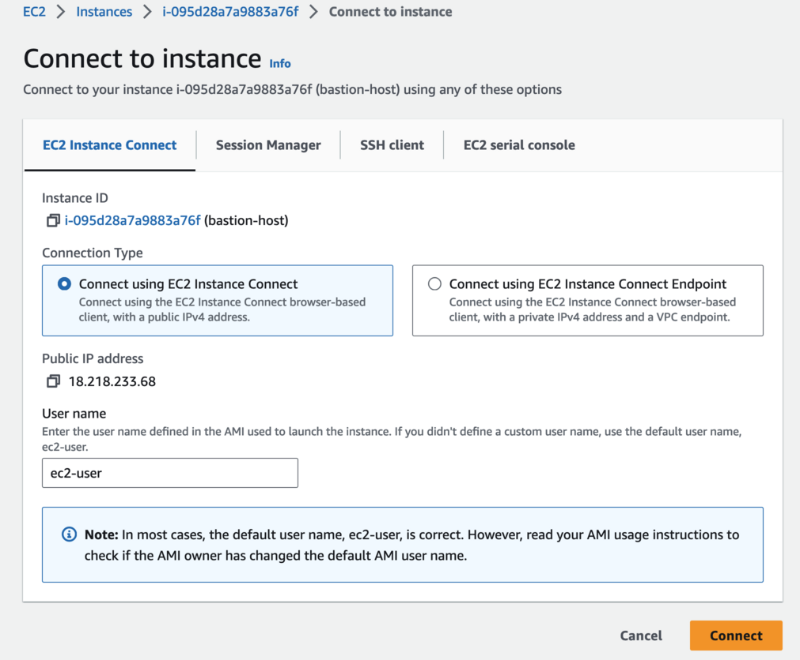
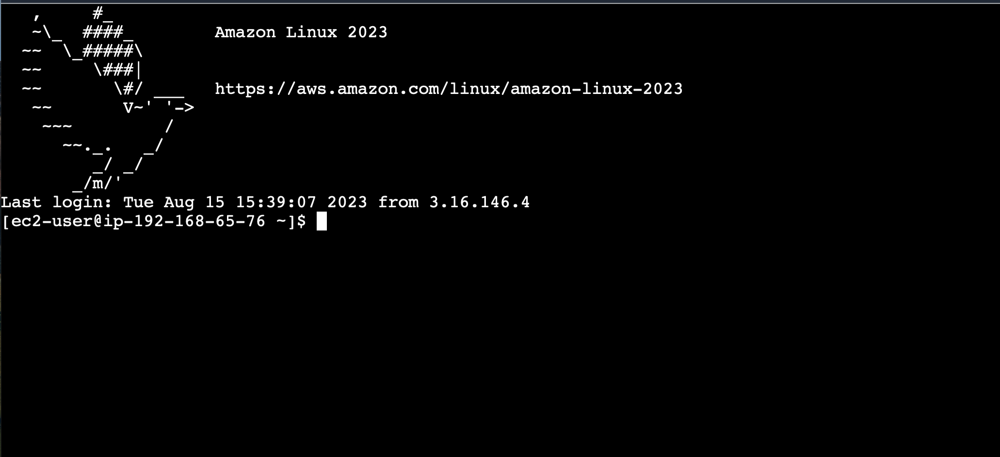

With the explosive growth of the internet and the exponential increase in the number of internet-enabled applications, the need for routable IP addresses has been steadily increasing. With depleting IP addresses in the IPv4 address space, the industry has been transitioning into using IPv6. A number of businesses running containerized applications on Amazon EKS have experienced the IP exhaustion problem, caused by the limited size of the IPv4 address space. Temporary solutions like custom networking on IPv4 or using private NAT gateways involve complex routing configurations. With EKS IPv6 support, businesses can now create EKS clusters where pods are assigned a globally routable IPv6 address, easily scaling applications without consuming limited private IPv4 address space. With 128 bits of address space, IPv6 provides 340 undecillion IP addresses, offering a truly long-term solution to the IP exhaustion problem without needing complex routing mechanisms, while improving network performance. The globally routable IPv6 address can be used to directly communicate with any IPv6 endpoint in Amazon VPC, on-premises network, or the public internet, enabled through the Amazon VPC CNI plugin, which integrates with the EC2 networking stack for high performance and reliability.

| Attributes             |                                                                 |
|------------------------|-----------------------------------------------------------------|
| ✅ AWS experience      | 200 - Intermediate                                              |
| ⏱ Time to complete     | 30 minutes                                                      |
| 🧩 Prerequisites       | - [AWS Account](https://aws.amazon.com/resources/create-account/?sc_channel=el&sc_campaign=appswave&sc_content=eks-cluster-ipv6-globally-scalable&sc_geo=mult&sc_country=mult&sc_outcome=acq)|
| 📢 Feedback            | <a href="https://www.pulse.aws/survey/Z8XBGQEL" target="_blank">Any feedback, issues, or just a</a> 👍 / 👎 ?    |
| ⏰ Last Updated        | 2023-08-30                                                      |

| ToC |
|-----|

This tutorial shows you how to create a managed node groups-based Amazon EKS cluster using an [eksctl](https://eksctl.io/) “quickstart” template. This use case-specific template creates and sets up a cluster optimized for IPv6-enabled applications, ensuring a scalable and efficient solution to the IP exhaustion problem, configured for enhanced networking performance and global reach.

>Note that if you're still within your initial 12-month AWS Free Tier period, certain Amazon EC2 instances for managed node groups and additional AWS services may not be included, and charges may apply based on your usage.

## Prerequisites

Before you begin this tutorial, you need to:

* Install the latest version of [kubectl](https://kubernetes.io/docs/tasks/tools/#kubectl). To check your version, run: `kubectl version --short`.
* Install the latest version of [eksctl](https://eksctl.io/introduction/#installation). To check your version, run: `eksctl info`.

## Overview

This tutorial is the first part of a series on deploying an IPv6-enabled Amazon EKS cluster, tailored for extra large, modern applications requiring a vast range of IP addresses. Utilizing the eksctl cluster template provided, you'll construct a robust, scalable, and secure Amazon EKS cluster with managed node groups, optimized for IPv6 workloads. This tutorial will guide you in choosing Amazon EC2 Nitro Amazon Linux 2 instance types as worker nodes. The configuration deploys an Amazon IPv6 Virtual Private Cloud (VPC), and requires version “1.10.1” or later of the [Amazon VPC CNI Add-On](https://aws.github.io/aws-eks-best-practices/networking/vpc-cni/). It configures the following components:

* **Public/Private Networking**: The cluster is configured to use the IPv6 IP family, offering a broad range of globally routable IP addresses. By default, Amazon EKS sets up a public endpoint for the managed Kubernetes API server, enabling access via tools like [kubectl](https://kubernetes.io/docs/tasks/tools/). For those looking to enhance security, you have the option to configure the cluster API endpoint to be private. This restricts all communication between nodes and the API server to within the Virtual Private Cloud (VPC), eliminating direct exposure to the public internet. With the support for IPv6, this setup provides a flexible networking environment that can be tailored to various access control needs: public access, private access within a VPC, or a combination of both.
* **Add-ons**: Latest versions of the following [add-ons](https://docs.aws.amazon.com/eks/latest/userguide/eks-add-ons.html#workloads-add-ons-available-eks?sc_channel=el&sc_campaign=appswave&sc_content=eks-cluster-ipv6-globally-scalable&sc_geo=mult&sc_country=mult&sc_outcome=acq): "vpc-cni" enable the Amazon VPC Container Network Interface, "coredns" facilitates DNS resolution, and "kube-proxy" maintains network rules on each Amazon EC2 node.
* **Authentication**: An [OpenID Connect (OIDC) endpoint](https://docs.aws.amazon.com/eks/latest/userguide/enable-iam-roles-for-service-accounts.html?sc_channel=el&sc_campaign=appswave&sc_content=eks-cluster-ipv6-globally-scalable&sc_geo=mult&sc_country=mult&sc_outcome=acq) for authentication within the Amazon EKS cluster to enable communication between Kubernetes pods and AWS services.
* **Node Lifecycle Management**: Managed node groups simplify the handling of Amazon EC2 instances, registering them as Kubernetes nodes. This configuration employs `m6i.xlarge` and `m6a.xlarge` Amazon Linux 2 (AL2) [instance types](https://docs.aws.amazon.com/eks/latest/userguide/choosing-instance-type.html?sc_channel=el&sc_campaign=appswave&sc_content=eks-cluster-ipv6-globally-scalable&sc_geo=mult&sc_country=mult&sc_outcome=acq), optimized for [Amazon Linux 2 (AL2)](https://docs.aws.amazon.com/eks/latest/userguide/eks-optimized-ami.html?sc_channel=el&sc_campaign=appswave&sc_content=eks-cluster-ipv6-globally-scalable&sc_geo=mult&sc_country=mult&sc_outcome=acq). The configuration balances resources, specifying a volume size of "100" and type "gp3". Node groups are tailored with a minimum size of "1" and a maximum size of "3," facilitating manual scaling. Volume encryption enhances security, while custom labels (e.g., “os-distribution: amazon-linux-2”) enhance manageability, allowing the identification and categorization of nodes, and ensuring their alignment with the intended AL2 distribution.

## Step 1: Configure the Cluster

In this section, you will configure the Amazon EKS cluster to support IPv6 networking, addressing the growing need for globally routable IP addresses. By creating this `cluster-config.yaml` file, you'll define the settings for IPv6 networking, public and private access, managed node groups, essential add-ons, and security features like volume encryption. These configurations are essential for ensuring that the cluster is robust, flexible, and secure, with optimized performance for a long-term solution to the IP exhaustion problem and efficient resource management.

**To create the cluster config:**

1. Create a `cluster-config.yaml` file and paste the following contents into it. Replace the sample `region`. 

```yaml
apiVersion: eksctl.io/v1alpha5
kind: ClusterConfig

metadata:
  name: ipv6-quickstart
  version: "1.27"
  region: us-east-2

kubernetesNetworkConfig:
  ipFamily: IPv6

vpc:
  clusterEndpoints:
    publicAccess: true
    privateAccess: true

iam:
  withOIDC: true

addons:
  - name: vpc-cni
    version: latest 
  - name: coredns
    version: latest 
  - name: kube-proxy
    version: latest 

managedNodeGroups:
  - name: x86-al2-on-demand-xl
    amiFamily: AmazonLinux2
    instanceTypes: [ "m6i.xlarge", "m6a.xlarge" ]
    minSize: 1
    desiredCapacity: 2
    maxSize: 3
    volumeSize: 100
    volumeType: gp3
    volumeEncrypted: true
    labels:
      os-distribution: amazon-linux-2
```

## Step 2: Create the Cluster

Now we're ready to create our Amazon EKS cluster. This process takes several minutes to complete. If you'd like to monitor the status, see the [AWS CloudFormation](https://console.aws.amazon.com/cloudformation?sc_channel=el&sc_campaign=appswave&sc_content=eks-cluster-ipv6-globally-scalable&sc_geo=mult&sc_country=mult&sc_outcome=acq) console.

Create the EKS cluster using the `cluster-config.yaml`.

```bash
eksctl create cluster -f cluster-config.yaml
```

**Note**: if you receive an “Error: checking AWS STS access” in the response, be sure to check that you’re using the right user identity for the current shell session. To check the current user identity, run `aws sts get-caller-identity` in the terminal. Depending on how you configured the AWS CLI, you may also need to specify a named profile (for example, `--profile clusteradmin`).

Upon completion, you should see the following response output:

```bash
2023-08-26 13:10:23 [✔]  EKS cluster "ipv6-quickstart" in "us-east-2" region is ready
```

## Step 3: Verify Cluster Node and Pod Health

Now that you've successfully created the EKS cluster with IPv6 networking, it's a best practice to ensure that the cluster nodes and pods are in a healthy state. This is to ensure that the cluster is healthy and is ready for deployment of applications.

```bash
kubectl get pods -n kube-system -o wide
```

The pods you see should be in a `Running` or `Completed` state, and there shouldn't be any pods in an `Error` or `CrashLoopBackOff` status. Also confirm that default Pods in the `kube-system` namespace are assigned `IPv6` addresses.

```bash
NAME                       READY   STATUS    RESTARTS   AGE   IP                                        NODE                                           NOMINATED NODE   READINESS GATES
aws-node-5cc8x             1/1     Running   0          41m   2600:1f16:1cc8:4002:bdb2:7cde:e292:5f19   ip-192-168-92-106.us-east-2.compute.internal   <none>           <none>
aws-node-rnc2g             1/1     Running   0          41m   2600:1f16:1cc8:4001:c4bd:a35b:9a08:6c6b   ip-192-168-48-127.us-east-2.compute.internal   <none>           <none>
coredns-85dbc867bc-22qvz   1/1     Running   0          38m   2600:1f16:1cc8:4002:f92b::2               ip-192-168-92-106.us-east-2.compute.internal   <none>           <none>
coredns-85dbc867bc-x8dz5   1/1     Running   0          38m   2600:1f16:1cc8:4001:9b29::                ip-192-168-48-127.us-east-2.compute.internal   <none>           <none>
kube-proxy-9bntj           1/1     Running   0          38m   2600:1f16:1cc8:4001:c4bd:a35b:9a08:6c6b   ip-192-168-48-127.us-east-2.compute.internal   <none>           <none>
kube-proxy-hv2d8           1/1     Running   0          38m   2600:1f16:1cc8:4002:bdb2:7cde:e292:5f19   ip-192-168-92-106.us-east-2.compute.internal   <none>           <none>
```

Verify that all of your nodes have reached the `Ready` state with the following command. It’s also important to note that the nodes have been assigned an IPv6 internal address.

```bash
kubectl get node -o wide
```

The expected output should look like this:

```bash
NAME                                           STATUS   ROLES    AGE   VERSION               INTERNAL-IP                              EXTERNAL-IP   OS-IMAGE         KERNEL-VERSION                  CONTAINER-RUNTIME
ip-192-168-26-20.us-east-2.compute.internal    Ready    <none>   50m   v1.27.1-eks-2f008fe   2600:1f16:3bf:5f00:9bf1:c33c:16e7:d724   <none>        Amazon Linux 2   5.10.184-175.731.amzn2.x86_64   containerd://1.6.19
ip-192-168-40-126.us-east-2.compute.internal   Ready    <none>   50m   v1.27.1-eks-2f008fe   2600:1f16:3bf:5f01:202e:f3c1:dd02:c74    <none>        Amazon Linux 2   5.10.184-175.731.amzn2.x86_64   containerd://1.6.19
```

Additionally, also check that default services are assigned `IPv6` addresses.

```bash
kubectl get services -n kube-system -o wide
```

The expected output should look like this:

```bash
NAME       TYPE        CLUSTER-IP          EXTERNAL-IP   PORT(S)         AGE   SELECTOR
kube-dns   ClusterIP   fdde:a64b:91a6::a   <none>        53/UDP,53/TCP   51m   k8s-app=kube-dns
```

## Step 4: Enable Connectivity Using a Linux Bastion Host

In an EKS cluster using IPv6, pods and services will be assigned IPv6 addresses. This ensures connectivity for legacy IPv4 endpoints to connect with services running on IPv6 clusters, and for pods to connect with legacy IPv4 endpoints outside the cluster. All pod-to-pod communication within an EKS cluster always operates via IPv6. To test connectivity to applications running on our IPv6 EKS cluster, we'll deploy a Linux bastion host in the VPC named `eksctl-ipv6-quickstart-cluster/VPC`, which was created when the EKS cluster was initially set up.

### Create a Linux EC2 Bastion Host

1. Open the [Amazon EC2 console](https://console.aws.amazon.com/ec2/?sc_channel=el&sc_campaign=appswave&sc_content=eks-cluster-ipv6-globally-scalable&sc_geo=mult&sc_country=mult&sc_outcome=acq).
2. Under “Launch instance”, click the **Launch instance** button.
   
3. Enter the following information to customize the instance:
    1. Type `ipv6-bastion` in **Name.**
    2. Select `t2.micro` (or `t3.micro` for newer regions if not available) for **Instance type.**
    3. Keep the default selections for the other configuration settings for your instance, including the Amazon Linux AMI.
4. Under **Network**, enter the following:
    1. Select **Edit**, and choose `eksctl-ipv6-quickstart-cluster/VPC` for **VPC**.
    2. Keep the default selections for the other network settings, including the subnets and security group.
      

5. Click **Launch instance**, and select **Proceed without key pair**, **Proceed without key pair**, then **Launch instance**.
   

### Connect to the Linux EC2 Bastion Host

1. After your instance has launched, select your instance (e.g., `i-0a001fe6790332b87`).
   
2. After selecting your instance, click the **Connect** button.
   
3. On the **Connect to instance** page:
    1. Keep the default selections for the network settings, including “Connect using EC2 Instance Connect” and “User name.”
    2. Click **Connect**.
      

You should see the following connection terminal:



**Congratulations!** You now have a fully operational Amazon EKS Cluster with IPv6 networking, ready to tackle the growing demands of globally scalable applications. Your transition to IPv6 has set the stage for a future-proof networking environment, capable of supporting the exponential growth of internet-enabled applications.

## (Optional) Step 5: Deploy a Sample Application

Now, we’re all set to launch a sample application and enable its accessibility on the internet through an Application Load Balancer. For step-by-step guidance, check out the tutorial at [Exposing and Grouping Applications using the AWS Load Balancer Controller (LBC) on an EKS IPv6 Cluster](/tutorials/navigating-amazon-eks/eks-cluster-load-balancer-ipv6). This tutorial will guide you through the required Ingress annotations for the AWS Application Load Balancer Controller (LBC), an essential mechanism for controlling external access to services within an EKS cluster. You’ll also explore Ingress Groupings, a sophisticated feature that amalgamates multiple Ingress resources into one Application Load Balancer (ALB), enhancing both efficiency and ALB management.

## Clean Up

To avoid incurring future charges, you should delete the resources created during this tutorial. You can delete the EKS cluster with the following command:

```bash
eksctl delete cluster -f ./cluster-config.yaml
```

Upon completion, you should see the following response output:

```bash
2023-08-26 17:26:44 [✔]  all cluster resources were deleted
```

## Conclusion

Upon completion of this tutorial, you will have successfully established an Amazon EKS Cluster with IPv6 networking and deployed a network configuration. The IPv6 in EKS clusters enables the efficient and streamlined deployment of applications, allowing for more pods per node without exhausting IP addresses. IPv6 on EKS can also simplify the routing configuration of your EKS cluster. However, it's worth carefully considering specific [key factors](https://docs.aws.amazon.com/eks/latest/userguide/cni-ipv6.html?sc_channel=el&sc_campaign=appswave&sc_content=eks-cluster-ipv6-globally-scalable&sc_geo=mult&sc_country=mult&sc_outcome=acq) when designing your EKS cluster with IPv6 support. To deploy a scalable network, you need to set up configurations like preconfigured [add-ons](https://docs.aws.amazon.com/eks/latest/userguide/eks-add-ons.html?sc_channel=el&sc_campaign=appswave&sc_content=eks-cluster-ipv6-globally-scalable&sc_geo=mult&sc_country=mult&sc_outcome=acq). These final installations will provide you with a robust, fully functional environment, ready for deploying Kubernetes workloads to your IPv6-enabled EKS clusters.
