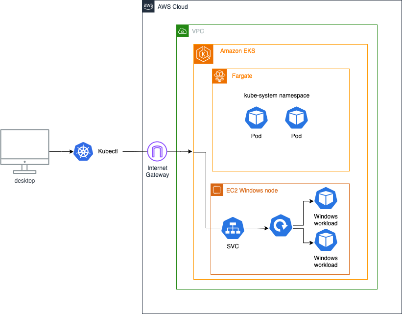
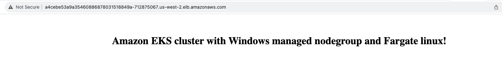

Windows Containers in Kubernetes allow organisations to easily migrate their existing Windows workloads to Amazon EKS. For example, when deploying a typical legacy monolithic .NET framework application, you might need to be concerned about the application dependencies with its environment, perform configuration tuning, and data transfer between hosting servers. These amongst other tasks introduce risk to new deployments and delay new software releases. Instead, customers can migrate their existing legacy .NET applications by using Windows containers in Kubernetes to containerize their applications and deploy to Amazon EKS. This approach has helped teams to eliminate manual steps, and to save time and cost involved in deploying and maintaining Windows applications. The application packaging and deployment process can be fully automated giving developers more time to focus on coding rather than operational tasks.

In addition, many companies want agility, faster time to market, and improved speed of deployment in a reliable manner. Windows Containers in Kubernetes has made it possible for teams building Windows applications to set up a continuous deployment pipeline to Amazon EKS while adopting GitOps approach. GitOps is a way of managing application and infrastructure deployment so that the whole system is described declaratively in a Git repository.  




| Attributes             |                                                                 |
|------------------------|-----------------------------------------------------------------|
| ✅ AWS experience      | 200 - Intermediate                                              |
| ⏱ Time to complete     | 30 minutes                                                      |
| 🧩 Prerequisites       | - [AWS Account](https://aws.amazon.com/resources/create-account/?sc_channel=el&sc_campaign=devops&sc_content=eks-monitor-containerized-applications&sc_geo=mult&sc_country=mult&sc_outcome=acq)|
| 📢 Feedback            | <a href="https://www.pulse.aws/survey/Z8XBGQEL" target="_blank">Any feedback, issues, or just a</a> 👍 / 👎 ?    |
| ⏰ Last Updated        | 2023-11-30                                                    |

| ToC |
|-----|

## Prerequisites

Before you begin this tutorial, you need to:

* Install the latest version of [kubectl](https://kubernetes.io/docs/tasks/tools/#kubectl). To check your version, run: `kubectl version`.
* Install the latest version of [eksctl](https://eksctl.io/introduction/#installation). To check your version, run: `eksctl info`.

## Overview

Using the eksctl cluster template that follows, you'll build an Amazon Windows EKS cluster that will be a mixture of Windows nodes running on EC2 and Linux nodes running on Fargate. It configures the following components:

* **Managed Node Groups**: With Amazon EKS managed node groups, you don't need to separately provision or register the Amazon EC2 instances that provide compute capacity to run your Kubernetes applications. For Kubernetes v1.28, operating system compatibility for Windows nodes (and Pods) includes Windows Server 2019, and Windows Server 2022. Windows Server 2022 is built on the strong foundation of Windows Server 2019 with many innovations on management and security. As part of this tutorial, we will create a Windows managed node group using the Amazon EKS optimized Windows Server 2022 Full AMI,  `WINDOWS_FULL_2022_x86_64` with the help of `eksctl`. This node group will provide the compute capacity to run Windows workloads in the cluster. The Amazon EKS optimized AMI is built on top of Windows Server 2022, and it includes **containerd**, the **kubelet**, and the **AWS IAM Authenticator** to work with Amazon EKS out of the box.
* **Fargate Profile**: [AWS Fargate](https://docs.aws.amazon.com/eks/latest/userguide/fargate-getting-started.html?sc_channel=el&sc_campaign=devops&sc_content=eks-monitor-containerized-applications&sc_geo=mult&sc_country=mult&sc_outcome=acq) is a compute engine for EKS that removes the need to configure, manage, and scale EC2 instances. Fargate ensures Availability Zone spread while removing the complexity of managing EC2 infrastructure and works to ensure that pods in a Replica Service are balanced across Availability Zones. Each Pod running on Fargate gets its own worker node. Fargate automatically scales the worker nodes as Kubernetes scales pods. In this tutorial, we will use Fargate to provide the compute capacity we need to run the core cluster’s components like CoreDNS in the kube-system namespace. This way, we ease the burden of ensuring the availability and scalability of the CoreDNS pods in the cluster.
* **Control Plane Logging**: You can enable [Amazon EKS control plane logging](https://docs.aws.amazon.com/eks/latest/userguide/control-plane-logs.html?sc_channel=el&sc_campaign=devops&sc_content=eks-monitor-containerized-applications&sc_geo=mult&sc_country=mult&sc_outcome=acq) to provide audit and diagnostic logs directly from the Amazon EKS control plane to CloudWatch Logs. In this tutorial, we’ve enabled all the available control log type that corresponds to the available components of the Kubernetes control plane.

To run Windows workloads on Amazon EKS, you’d need Windows nodes and a Linux node in the cluster. Windows containers aren't supported for Amazon EKS Pods on Fargate currently, hence Windows containers must run on Amazon EC2. The Linux nodes are critical to the functioning of the cluster as they run a core cluster’s components, and thus, for a production-grade cluster, such organization must ensure that the Linux nodes are well architected for high availability.

While Amazon EKS clusters must contain one or more Linux or Fargate nodes to run core system Pods that only run on Linux, such as CoreDNS, organizations seeking to reduce operational overhead in managing a Windows EKS cluster can leverage the benefits of Managed Node groups for Windows containers and Fargate for Linux containers.

## Step 1: Configure the Cluster

In this section, you will configure the Amazon EKS cluster to meet the specific requirements of Windows EKS cluster. By creating this `cluster-config.yaml` file, you'll define the settings for Fargate profile and Windows Managed node group.

**To create the cluster config**:

Copy and paste the content below in your terminal to create a `cluster-config.yaml` file. Replace the `region` with your preferred region.

```yaml
cat << EOF > cluster-config.yaml
---
apiVersion: eksctl.io/v1alpha5
kind: ClusterConfig

metadata:
  name: eks-windows-mng-fg-mix
  region: us-west-2
  version: '1.28'
  
managedNodeGroups:
  - name: windows-managed-ng-2022
    amiFamily: WindowsServer2022FullContainer
    instanceType: m5.large
    volumeSize: 50
    minSize: 2
    maxSize: 4
    taints:
      - key: os
        value: "windows"
        effect: NoSchedule

fargateProfiles:
  - name: fargate
    selectors:
      - namespace: default
      - namespace: kube-system

cloudWatch:
 clusterLogging:
   enableTypes: ["*"]
    # Sets the number of days to retain the logs for (see [CloudWatch docs](https://docs.aws.amazon.com/AmazonCloudWatchLogs/latest/APIReference/API_PutRetentionPolicy.html#API_PutRetentionPolicy_RequestSyntax)).
    # By default, log data is stored in CloudWatch Logs indefinitely.
   logRetentionInDays: 60   
EOF
```

With the `cluster-config.yaml` file, we’ve created two node pools, which include Linux and Windows. The Linux node pool is provided by the Fargate profile called **fargate**, and the Windows node pool is provided by the managed node group called **windows-managed-ng-2022**. In order to run Windows containers, it must be scheduled on the Windows node pool. Since we are running a mix of Linux and Windows nodes, we’ve configured `NoSchedule` [taints](https://eksctl.io/usage/nodegroup-taints/) on the Windows managed nodes to help ensure Linux pods are not scheduled onto Windows nodes and vice versa. All Linux pods will be scheduled on Fargate in the default or kube-system namespaces.

## Step 2: Create the Cluster

Now, we're ready to create our Amazon EKS cluster. This process takes several minutes to complete. If you'd like to monitor the status, see the [AWS CloudFormation](https://console.aws.amazon.com/cloudformation) console.

Create the EKS cluster using the `cluster-config.yaml`.

```bash
eksctl create cluster -f cluster-config.yaml
```

Upon completion, you should see the following response output:

```bash
2023-11-13 14:19:14 [ℹ]  nodegroup "windows-managed-ng-2022" has 2 node(s)
2023-11-13 14:19:14 [ℹ]  node "ip-192-168-14-166.us-west-2.compute.internal" is ready
2023-11-13 14:19:14 [ℹ]  node "ip-192-168-58-84.us-west-2.compute.internal" is ready
2023-11-13 14:19:15 [✔]  EKS cluster "eks-windows-mng-fg-mix" in "us-west-2" region is ready
```

When the previous command completes, verify that all of your nodes have reached the `Ready` state with the following command:

```bash
kubectl get nodes -o=custom-columns=NODE:.metadata.name,OS-Image:.status.nodeInfo.osImage,OS:.status.nodeInfo.operatingSystem
```

The expected output should look like this:

```bash
NODE                                                    OS-Image                         OS
fargate-ip-192-168-114-130.us-west-2.compute.internal   Amazon Linux 2                   linux
fargate-ip-192-168-146-30.us-west-2.compute.internal    Amazon Linux 2                   linux
ip-192-168-14-166.us-west-2.compute.internal            Windows Server 2022 Datacenter   windows
ip-192-168-58-84.us-west-2.compute.internal             Windows Server 2022 Datacenter   windows
```

Let’s verify the core cluster’s components:

```bash
kubectl get pods -n kube-system -o wide
```

The expected output should look like this:

```bash
NAME                       READY   STATUS    RESTARTS   AGE   IP                NODE                                                    NOMINATED NODE   READINESS GATES
coredns-56666498f9-lx8xj   1/1     Running   0          66m   192.168.114.130   fargate-ip-192-168-114-130.us-west-2.compute.internal   <none>           <none>
coredns-56666498f9-xqqlz   1/1     Running   0          66m   192.168.146.30    fargate-ip-192-168-146-30.us-west-2.compute.internal    <none>           <none>
```

To achieve a highly available CoreDNS application in the cluster in the event of disruptions, Kubernetes offers a feature called Pod Disruption Budget. An appropriate [Pod Disruption Budgets](https://kubernetes.io/docs/concepts/workloads/pods/disruptions/#pod-disruption-budgets) (PDBs) was automatically created for the CoreDNS to control the number of pods that can be down simultaneously when we created the cluster.

Run the command below to verify this is in place:

```bash
kubectl get PodDisruptionBudget -A
```

The expected output should look like this:

```bash
NAMESPACE     NAME                 MIN AVAILABLE   MAX UNAVAILABLE   ALLOWED DISRUPTIONS   AGE
kube-system   coredns              N/A             1                 1                     12m
```

## Step 3: Deploy Sample Windows Application

The sample Windows application is a basic front-facing Windows Web application based on IIS (Internet Information Services) web server. The deployment manifest uses IIS base image.

1. Copy and paste the content below in file called `windows-workload.yaml`.

```yaml

apiVersion: v1
kind: Namespace
metadata:
  labels:
    kubernetes.io/metadata.name: windows
  name: windows
---  
apiVersion: apps/v1
kind: Deployment
metadata:
  name: windows-server-iis-ltsc2022
  namespace: windows
spec:
  selector:
    matchLabels:
      app: windows-server-iis-ltsc2022
      tier: backend
      track: stable
  replicas: 2
  template:
    metadata:
      labels:
        app: windows-server-iis-ltsc2022
        tier: backend
        track: stable
    spec:
      containers:
      - name: windows-server-iis-ltsc2022
        image: mcr.microsoft.com/windows/servercore/iis:windowsservercore-ltsc2022
        ports:
        - name: http
          containerPort: 80
        imagePullPolicy: IfNotPresent
        command:
        - powershell.exe
        - -command
        - "Add-WindowsFeature Web-Server; Invoke-WebRequest -UseBasicParsing -Uri 'https://dotnetbinaries.blob.core.windows.net/servicemonitor/2.0.1.6/ServiceMonitor.exe' -OutFile 'C:\\ServiceMonitor.exe'; echo '<html><body><br/><br/><center><h1>Amazon EKS cluster with Windows managed nodegroup and Fargate linux nodes!</h1></center></body><html>' > C:\\inetpub\\wwwroot\\iisstart.htm; C:\\ServiceMonitor.exe 'w3svc'; "
      nodeSelector:
        kubernetes.io/os: windows
      tolerations:
          - key: "os"
            operator: "Equal"
            value: "windows"
            effect: "NoSchedule"
---
apiVersion: v1
kind: Service
metadata:
  name: windows-server-iis-ltsc2022-service
  namespace: windows
spec:
  ports:
  - port: 80
    protocol: TCP
    targetPort: 80
  selector:
    app: windows-server-iis-ltsc2022
    tier: backend
    track: stable
  sessionAffinity: None
  type: LoadBalancer
```

2. For a Windows Pod to be scheduled on Windows node, it would need both the `nodeSelector` and the appropriate matching toleration to select Windows. We’ve configured both [nodeSelector](https://kubernetes.io/docs/concepts/scheduling-eviction/assign-pod-node/#nodeselector) and [toleration](https://kubernetes.io/docs/concepts/scheduling-eviction/taint-and-toleration/#taint-nodes-by-condition) in the Windows workload deployment manifest to help ensure Windows Pods are only deployed to the Windows nodes based on matching taints (os=windows) and matching label (kubernetes.io/os=windows). Deploy the sample application with the command below:

```bash
kubectl apply -f windows-workload.yaml
```

3. Verify the Windows workload deployment:

```bash
kubectl get pods -o wide -n windows
```

The expected output should look like this:

```bash
NAME                                          READY   STATUS    RESTARTS   AGE    IP               NODE                                           NOMINATED NODE   READINESS GATES
windows-server-iis-ltsc2022-ddd54677b-hsgxk   1/1     Running   0          116s   192.168.4.69     ip-192-168-14-166.us-west-2.compute.internal   <none>           <none>
windows-server-iis-ltsc2022-ddd54677b-hvbqg   1/1     Running   0          116s   192.168.34.153   ip-192-168-58-84.us-west-2.compute.internal    <none>           <none>
```

We had exposed the deployment externally using a LoadBalancer service type. Use the command below to get the service URL:

```bash
kubectl get svc -n windows
```

The expected output should look like this:

```bash
NAME                                  TYPE           CLUSTER-IP       EXTERNAL-IP                                                              PORT(S)        AGE
windows-server-iis-ltsc2022-service   LoadBalancer   10.100.134.219   af25ec7b2cb504I4c8a36c5cIb189b07-1100871459.us-west-2.elb.amazonaws.com   80:30267/TCP   13m
```

Copy the EXTERNAL-IP URL into your browser of choice and you should be presented with a basic HTML site.



## Step 4: (Optional) Create a Workload on Fargate

If you’d like to deploy a sample Linux workload in the same cluster, you’d need to use the Fargate profile by specifying any of the kube-system or default namespaces.

Run the command below to create a sample nginx pod in the default namespace:

```bash
kubectl run test --image=nginx
```

It may take about a minute for the pod to be scheduled on a fargate node. Run the command below to confirm that the pod is in running state:

```bash
kubectl get pods -o wide
```

The expected output should look like this:

```bash
NAME   READY   STATUS    RESTARTS   AGE   IP               NODE                                                   NOMINATED NODE   READINESS GATES
test   1/1     Running   0          11m   192.168.103.37   fargate-ip-192-168-103-37.us-west-2.compute.internal   <none>           <none>
```

## Clean Up

To avoid incurring future charges, you should delete the resources created during this tutorial. Delete the sample deployment.

```bash
kubectl delete -f windows-workload.yaml
```

You can delete the EKS cluster with the following command:

```bash
eksctl delete cluster -f cluster-config.yaml
```

Upon completion, you should see the following response output:

```bash
2023-11-13 15:27:19 [✔]  all cluster resources were deleted
```

## Conclusion

In this tutorial, you've successfully set up an Amazon EKS Windows Cluster mixed with Windows managed nodes and Fargate node to reduce the amount of operational task you have to perform in managing a Amazon EKS Windows cluster. This cluster gives you the infrastructure you need to start deploying your Windows application deployments. To explore more tutorials, check out [Navigating Amazon EKS](https://community.aws/tutorials/navigating-amazon-eks#list-of-all-tutorials).
