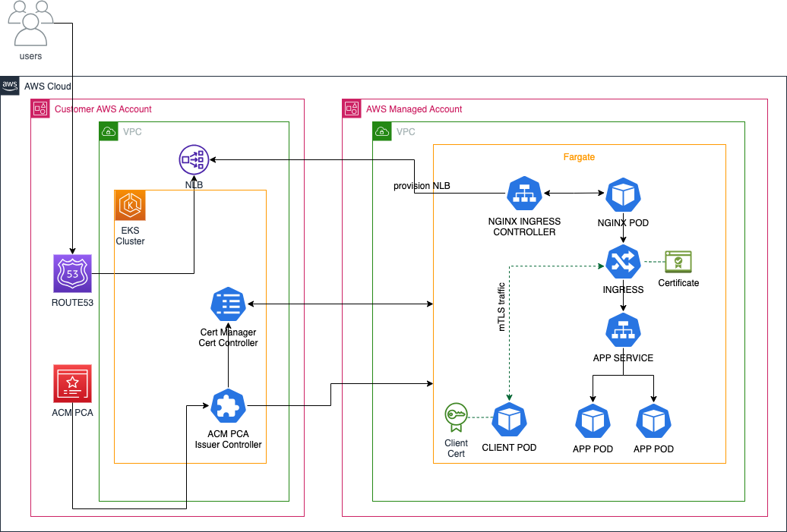

Businesses are leveraging the benefits of the cloud as they migrate their workloads to the cloud. The flexibility of the cloud helps organizations to scale as quickly as possible while generating immense application traffic. Preventing “man-in-the-middle attacks” or other forms of cyber-attacks becomes a necessity for these businesses building solutions such as Microservice architectures, Business-to-business (B2B) APIs, User Authentications, Content Delivery, Internet of Things (IoT) sensors and many more. Mutual Transport Layer Security (mTLS) helps businesses to improve the security of their applications or to comply with industry standards or a specific compliance requirement by ensuring that the integrity of the parties at each end of a network connection are proven to each other. In microservice architectures, a service mesh is predominantly used to provide the infrastructure you need to safely implement mTLS between services. Configuring a service mesh introduces more components and complexity, such as sidecar proxies, control plane components, and the need to manage configurations and policies.

In this tutorial, I’ll show you how to set up mTLS for an application running on Amazon Elastic Kubernetes Service (Amazon EKS) Fargate using NGINX Ingress Controller and ACM Private CA without using a service mesh. Mutual TLS adds extra layer to secure Kubernetes workload traffic. It can be used for business-to-business applications or standards such as [Open Banking](https://docs.aws.amazon.com/wellarchitected/latest/financial-services-industry-lens/open-banking.html).

This tutorial addresses two challenges:

1. Setting up NGINX Ingress Controller on Amazon EKS Fargate
2. Configuring mTLS with NGINX Ingress Controller using certificate issued by ACM Private CA

Some limitations to keep in mind:

* For mTLS support with NGINX Ingress controller behind a Service of `Type=LoadBalancer`, you will need to create a TCP listener using a Network Load Balancer and implement mTLS on the target. 
* Privileged containers [aren't supported on Fargate](https://docs.aws.amazon.com/eks/latest/userguide/fargate.html).




| Attributes             |                                                                 |
|------------------------|-----------------------------------------------------------------|
| ✅ AWS experience      | 200 - Intermediate                                              |
| ⏱ Time to complete     | 30 minutes                                                      |
| 🧩 Prerequisites       | - [AWS Account](https://aws.amazon.com/resources/create-account/?sc_channel=el&sc_campaign=devops&sc_content=eks-monitor-containerized-applications&sc_geo=mult&sc_country=mult&sc_outcome=acq)|
| 📢 Feedback            | <a href="https://www.pulse.aws/survey/Z8XBGQEL" target="_blank">Any feedback, issues, or just a</a> 👍 / 👎 ?    |
| ⏰ Last Updated        | 2023-12-30                                                    |

| ToC |
|-----|

## Prerequisites

* An active Amazon Web Services ([AWS) account](https://signin.aws.amazon.com/signin?redirect_uri=https://portal.aws.amazon.com/billing/signup/resume&client_id=signup).
* Install the latest version of [Helm CLI](https://helm.sh/docs/intro/install/)
* Install the latest version of [AWS Command Line Interface (AWS CLI)](http://aws.amazon.com/cli)
* Install the latest version of [kubectl](https://kubernetes.io/docs/tasks/tools/#kubectl). To check your version, run: `kubectl version`.
* Install the latest version of [eksctl](https://eksctl.io/installation/). To check your version, run: `eksctl info`.
* A custom domain name to test the application.

## Overview

This tutorial is part of a series on managing security-sensitive workloads using Amazon EKS, and it's dedicated to ensuring secure communications between Kubernetes workloads with mTLS in Amazon EKS Fargate. This tutorial builds on an existing [Amazon EKS cluster with Fargate](https://quip-amazon.com/qQUzAskUSBMy/Building-an-Amazon-EKS-Cluster-Preconfigured-to-Run-Sensitive-Workloads) configured for running sensitive workloads. It covers the following components:

* [**Ingress-Nginx Controller**](https://kubernetes.github.io/ingress-nginx/deploy/#aws): It is an Ingress controller for Kubernetes using [NGINX](https://www.nginx.org/) as a reverse proxy and load balancer. It can enable [Client Certificate Authentication](https://github.com/kubernetes/ingress-nginx/blob/main/docs/user-guide/nginx-configuration/annotations.md#client-certificate-authentication) using additional annotations in Ingress Rule to achieve mTLS.
* [**AWS Certificate Manager Private CA**](https://docs.aws.amazon.com/acm-pca/latest/userguide/PcaCreateCa.html#create-ca-console-procedure): enables creation of private certificate authority (CA) hierarchies, including root and subordinate CAs, without the investment and maintenance costs of operating an on-premises CA.
* **[AWS Private CA Issuer](https://github.com/cert-manager/aws-privateca-issuer):** It is an addon to cert-manager that signs off certificate requests using AWS Private CA.
* [**AWS Load Balancer Controller**](https://kubernetes-sigs.github.io/aws-load-balancer-controller/v2.4/): A Kubernetes controller to help manage Elastic Load Balancers for the Kubernetes cluster
* [**Cert-manager**](https://cert-manager.io/v1.1-docs): is a Kubernetes add-on to automate the management and issuance of TLS certificates from various issuing sources.
* **[ExternalDNS](https://kubernetes-sigs.github.io/aws-load-balancer-controller/v2.5/guide/integrations/external_dns/)**: helps to automatically manage DNS routing of your applications using [Amazon Route 53](https://docs.aws.amazon.com/Route53/latest/DeveloperGuide/Welcome.html)
* **Sample Application Deployment**: Deploy a sample workload for an mTLS-enabled service. This workload encompasses the deployment of a sample application configured for mutual TLS (mTLS) within a Kubernetes environment, with a specific focus on Amazon EKS.

>There is a charge for operating a private CA. $400 per private CA per month for general-purpose mode and $50 per private CA per month for short-lived certificate mode. This charge is pro-rated for partial months based on when you create and delete the CA.

## Step 1: Configure the Cluster

In this section, you will configure the Amazon EKS cluster with only [Fargate Profiles](https://docs.aws.amazon.com/eks/latest/userguide/fargate-profile.html). For step-by-step guidance, check out the tutorial at [Building an Amazon EKS Cluster Pre-configured for Financial Workload](https://community.aws/tutorials/navigating-amazon-eks/eks-cluster-financial-workload).

## Step 2: Install and configure the cluster components

### Install ALB Controller on Fargate using Helm option

Retrieve the VPC automatically created for the cluster and substitute values below with your own:

```bash
export AWS_DEFAULT_REGION*=*"us-east-2"
export vpcid=$(aws eks describe-cluster --name fg-security-quickstart --query 'cluster.resourcesVpcConfig.vpcId' --output text)
export mycluster=fg-security-quickstart
export region="us-east-2"
```

Install the ALB controller with the command below:

```bash
helm repo add eks https://aws.github.io/eks-charts

helm repo update eks

helm install aws-load-balancer-controller eks/aws-load-balancer-controller \
  -n kube-system \
  --set clusterName=$mycluster \
  --set serviceAccount.create=false \
  --set serviceAccount.name=aws-load-balancer-controller \
  --set region=$region \
  --set vpcId=$vpcid
```

### Download NGINX Ingress Controller manifest and customize it for Amazon EKS Fargate

Privileged containers aren't supported on Fargate. The default NGINX Ingress controller pod requires privilege escalation to run. We will download the original NGINX ingress controller manifest and customize it by following the steps below:

1. Download the deploy.yaml template from https://kubernetes.github.io/ingress-nginx/deploy/#aws

```bash
curl -O https://raw.githubusercontent.com/kubernetes/ingress-nginx/controller-v1.8.2/deploy/static/provider/aws/deploy.yaml
```

2. Edit the downloaded deploy.yaml file to make the following changes:

Locate the line text below and change the loadbalancer type to `nlb-ip` as shown below:

```bash
service.beta.kubernetes.io/aws-load-balancer-type: nlb # to nlb-ip
```

Change the default ports of the **ingress-nginx-controller** service as shown below:

```yaml
kind: Service
  name: ingress-nginx-controller
  namespace: ingress-nginx
...
spec:
  ports:
  - appProtocol: http
    targetPort: http  # to 8080
  - appProtocol: https
    targetPort: https # to 8081
```

(Optional) Add the extra annotation below to the service section if you want to expose your application publicly:

```bash
service.beta.kubernetes.io/aws-load-balancer-scheme: "internet-facing" 
```

Add `http-port=8080` and `https-port=8081` as extra args to the deployment manifest as shown below:

```yaml

kind: Deployment
...
    spec:
      containers:
      - args:
        ...
        - --http-port=8080 
        - --https-port=8081        
```

Change the controller container ports in the deployment manifest as shown below:

```yaml
        name: controller
        ports:
        - containerPort: 80 # to 8080
          name: http
          protocol: TCP
        - containerPort:443 # to 8081
          name: https
          protocol: TCP
```

Set privilege escalation to false:

```yaml
        securityContext:
          allowPrivilegeEscalation: true # to false
```

3. Deploy the modified manifest

```bash
kubectl apply -f deploy.yaml
```

4. Wait for about 60seconds for Fargate to schedule to ingress controller pod. Verify the installation with this command:

```bash
kubectl get pods -n ingress-nginx
```

Expected output:

```bash
NAME                                        READY   STATUS      RESTARTS   AGE
ingress-nginx-admission-create-xfv5j        0/1     Completed   0          52s
ingress-nginx-admission-patch-5szks         0/1     Completed   2          52s
ingress-nginx-controller-84c9764964-mwxfc   1/1     Running     0          52s
```

### Install Cert Manager with Helm

Kubelet listens on port 10250 by default which clashes with the default port for the cert-manager webhook. In the command below, the listening port of the webhook has been set to 10260 to prevent this challenge in EKS Fargate.

```bash
helm repo add jetstack https://charts.jetstack.io
helm repo update
helm install \
  cert-manager jetstack/cert-manager \
  --namespace cert-manager \
  --version v1.12.2 \
  --set installCRDs=true \
  --set serviceAccount.create=false \
  --set serviceAccount.name=cert-manager \
  --set webhook.securePort=10260
```

### Install and Setup [External DNS](https://github.com/kubernetes-sigs/external-dns/releases) in the cluster (optional) 

You may manually create a DNS record in Amazon Route53 for your application. Refer to the [documentation](https://kubernetes-sigs.github.io/aws-load-balancer-controller/v2.4/guide/integrations/external_dns/) to setup and manage records in Route 53 that point to controller deployed ALBs.
To setup ExternalDNS in your Kubernetes cluster, see [Setting up ExternalDNS for services on AWS](https://github.com/kubernetes-sigs/external-dns/blob/master/docs/tutorials/aws.md) (on the GitHub website) and [Set up ExternalDNS](https://kubernetes-sigs.github.io/aws-load-balancer-controller/v2.4/guide/integrations/external_dns/).

1. Download sample `external-dns` manifest

```bash
wget https://raw.githubusercontent.com/kubernetes-sigs/aws-load-balancer-controller/main/docs/examples/external-dns.yaml
```

2. Open the downloaded `external-dns.yaml` file and edit the `--domain-filter` flag to include your hosted zone(s). The following example is for a hosted zone `example.com`:

```yaml
args:
- --source=service
- --source=ingress
- --domain-filter=example.com # will make ExternalDNS see only the hosted zones matching provided domain, omit to process all available hosted zones
- --provider=aws
- --policy=upsert-only 
- --aws-zone-type=public 
- --registry=txt
- --txt-owner-id=my-identifier  # Your Route53 Zone ID

```

3. Deploy the downloaded `external-dns.yaml` file

```bash
kubectl apply -f external-dns.yaml 
```

4. Verify it deployed successfully.

```bash
kubectl logs -f $(kubectl get po | egrep -o 'external-dns[A-Za-z0-9-]+')
```

## Step 3: Create Private Certificate Authority

Follow the steps below to create an [AWS Certificate Manager Private CA](https://docs.aws.amazon.com/privateca/latest/userguide/create-CA.html) with RSA 2048 selected as the key algorithm in the same region as the cluster.

1. To create a private certificate authority, execute the content below in your terminal, replace [example.com](http://example.com/) with your own value:

```bash
export AWS_DEFAULT_REGION="us-east-2"
export SERVICES_DOMAIN="example.com"

export ROOT_CA_ARN=`aws acm-pca create-certificate-authority \
    --certificate-authority-type ROOT \
    --certificate-authority-configuration \
    "KeyAlgorithm=RSA_2048,
    SigningAlgorithm=SHA256WITHRSA,
    Subject={
        Country=US,
        State=WA,
        Locality=Seattle,
        Organization=Build on EKS,
        OrganizationalUnit=mTLS Example,
        CommonName=${SERVICES_DOMAIN}}" \
        --query CertificateAuthorityArn --output text`  
```

2. Create and install your private CA certificate

```bash
ROOT_CA_CSR=`aws acm-pca get-certificate-authority-csr \
    --certificate-authority-arn ${ROOT_CA_ARN} \
    --query Csr --output text`
```

3. Issue the root certificate with the csr file from the previous step. Note that if you are using AWS CLI version 2, you will need to pass the CSR data through encoding prior to invoking the 'issue-certificate' command.

```bash
AWS_CLI_VERSION=$(aws --version 2>&1 | cut -d/ -f2 | cut -d. -f1)
[[ ${AWS_CLI_VERSION} -gt 1 ]] && ROOT_CA_CSR="$(echo ${ROOT_CA_CSR} | base64)"

ROOT_CA_CERT_ARN=`aws acm-pca issue-certificate \
    --certificate-authority-arn ${ROOT_CA_ARN} \
    --template-arn arn:aws:acm-pca:::template/RootCACertificate/V1 \
    --signing-algorithm SHA256WITHRSA \
    --validity Value=10,Type=YEARS \
    --csr "${ROOT_CA_CSR}" \
    --query CertificateArn --output text`
```

4. Import the signed certificate as the root CA

```bash
ROOT_CA_CERT=`aws acm-pca get-certificate \
    --certificate-arn ${ROOT_CA_CERT_ARN} \
    --certificate-authority-arn ${ROOT_CA_ARN} \
    --query Certificate --output text`
```

5. Import the root CA certificate to install it on the CA. AWS CLI version 2 needs passing the certificate data through encoding. Execute the command below:

```bash
[[ ${AWS_CLI_VERSION} -gt 1 ]] && ROOT_CA_CERT="$(echo ${ROOT_CA_CERT} | base64)"

aws acm-pca import-certificate-authority-certificate \
    --certificate-authority-arn $ROOT_CA_ARN \
    --certificate "${ROOT_CA_CERT}"
```

6. Inspect the status of the CA and confirm it is in active state. If it is active state, then it is ready for use

```bash
aws acm-pca describe-certificate-authority \
      --certificate-authority-arn "$ROOT_CA_ARN" \
      --output json
```

7. Get the ARN of the CA:

```bash
echo $ROOT_CA_ARN
```

## Step 4: Install AWS-PCA-ISSUER

The [AWS PrivateCA Issuer plugin](https://github.com/cert-manager/aws-privateca-issuer) acts as an addon to cert-manager that signs certificate requests using ACM Private CA.
Define your environment variable:

```bash
export ROOT_CA_ARN="YOUR_PRIVATE_CA_ARN"
export SERVICES_DOMAIN="example.com"
```

Remember to replace YOUR_PRIVATE_CA_ARN and [example.com](http://example.com/) with your own values.
The AWS PCA Issuer plugin works as an addon to the cert-manager that signs off certificate requests using AWS Certificate Manager Private Certificate Authority. 

1. Copy and paste the command below in your terminal to create a `pca-iam-policy.json` file:

```bash
cat << EOF > pca-iam-policy.json
{
    "Version": "2012-10-17",
    "Statement": [
      {
        "Sid": "awspcaissuer",
        "Action": [
          "acm-pca:DescribeCertificateAuthority",
          "acm-pca:GetCertificate",
          "acm-pca:IssueCertificate"
        ],
        "Effect": "Allow",
        "Resource": "${ROOT_CA_ARN}"
      }
    ]
  }
EOF
```

2. Create and IAM policy called AWSPCAIssuerIAMPolicy with the command below:

```bash
aws iam create-policy --policy-name AWSPCAIssuerIAMPolicy --policy-document file://pca-iam-policy.json
```

**Note the IAM policy Arn in the command output. This is required in the next step.**

3. Create a Service Account for the AWS PCA Issuer plugin with the command below:

```bash
export mycluster=fg-security-quickstart
export ARN="IAM_POLICY_ARN"

eksctl create iamserviceaccount \
--cluster=$mycluster \
--namespace=default \
--name=aws-pca-issuer \
--attach-policy-arn=$ARN \
--override-existing-serviceaccounts \
--approve \
--region us-east-2
```

Replace the IAM_POLICY_ARN with the ARN value retrieved previously.

4. Add the AWS PCA Issuer Helm repository and run the helm install command:

```bash
helm repo add awspca https://cert-manager.github.io/aws-privateca-issuer

helm install aws-pca-issuer awspca/aws-privateca-issuer -n default \
--set serviceAccount.create=false \
--set serviceAccount.name=aws-pca-issuer
```

5. Verify that AWS PCA issuer is configured correctly by running following command after about 60 seconds:

```bash
% kubectl get pods
NAME                                                   READY   STATUS    RESTARTS   AGE
aws-pca-issuer-aws-privateca-issuer-6cf57c44bf-t9qgb   1/1     Running   0          53s
```

6. Copy and paste the command below in your terminal to create the Cluster Issuer and Certificates files:

```yaml
cat << EOF > cluster-issuer.yaml
apiVersion: awspca.cert-manager.io/v1beta1
kind: AWSPCAClusterIssuer
metadata:
  name: demo-test-root-ca
spec:
  arn: ${ROOT_CA_ARN}
  region: us-east-2
EOF
```

7. Copy and paste the command below in your terminal to create `mtls-cert.yaml` file. The file will create a secret containing CA certificate along with the Server Certificate that can be used for both TLS and Client Auth. It will also create an additional secret that will be used by the client application or you can create just one certificate use the same secret.

```yaml
cat << EOF > mtls-cert.yaml
kind: Certificate
apiVersion: cert-manager.io/v1
metadata:
  name: mtls-cert-acm
spec:
  commonName: mtls.${SERVICES_DOMAIN}
  dnsNames:
    - www.mtls.${SERVICES_DOMAIN}
    - mtls.${SERVICES_DOMAIN}
  duration: 2160h0m0s
  issuerRef:
    group: awspca.cert-manager.io
    kind: AWSPCAClusterIssuer
    name: demo-test-root-ca
  renewBefore: 360h0m0s
  secretName: mtls-cert
  usages:
    - server auth
    - client auth
  privateKey:
    algorithm: "RSA"
    size: 2048
---

kind: Certificate
apiVersion: cert-manager.io/v1
metadata:
  name: mtls-cert-acm-client
spec:
  commonName: mtls.${SERVICES_DOMAIN}
  dnsNames:
    - www.mtls.${SERVICES_DOMAIN}
    - mtls.${SERVICES_DOMAIN}
  duration: 2160h0m0s
  issuerRef:
    group: awspca.cert-manager.io
    kind: AWSPCAClusterIssuer
    name: demo-test-root-ca
  renewBefore: 360h0m0s
  secretName: mtls-cert-client
  usages:
    - server auth
    - client auth
  privateKey:
    algorithm: "RSA"
    size: 2048    
EOF 
```

8. Create an issuer in Amazon EKS Cluster and generate TLS certificates for the backend applications

```bash
kubectl apply -f cluster-issuer.yaml 

kubectl create namespace mtls

kubectl apply -f mtls-cert.yaml -n mtls

```

## Step 5: Deploy a Sample Application

1. Copy and paste the command below in your terminal to create an example workload:

```yaml
cat << EOF > mtls.yaml
kind: Deployment
apiVersion: apps/v1
metadata:
  name: mtls-app
  labels:
    app: mtls
spec:
  replicas: 1
  selector:
    matchLabels:
      app: mtls
  template:
    metadata:
      labels:
        app: mtls
    spec:
      containers:
      - name: mtls-app
        image: hashicorp/http-echo
        args:
          - "-text=mTLS in Amazon EKS Fargate with NGINX Ingress Controller"

---
kind: Service
apiVersion: v1
metadata:
  name: mtls-service
spec:
  selector:
    app: mtls
  ports:
    - port: 5678 # Default port for image
EOF    
```

2. Run the commands below to create the workload:

```bash
kubectl create namespace mtls

kubectl create -f mtls.yaml -n mtls
```

3. Copy and paste the command below in your terminal to create an Ingress manifest file `ingress.yaml` for the workload:

```yaml
cat << EOF > ingress.yaml
apiVersion: networking.k8s.io/v1
kind: Ingress
metadata:
  # annotations:
  # # Enable client certificate authentication
  #   nginx.ingress.kubernetes.io/auth-tls-verify-client: "on"
  # # The secret containing the trusted ca certificates. Namespace\secretname
  #   nginx.ingress.kubernetes.io/auth-tls-secret: mtls/mtls-cert
  name: mtls-ingress
spec:
  ingressClassName: nginx
  rules:
  - host: "mtls.${SERVICES_DOMAIN}"
    http:
      paths:
      - path: /
        pathType: Prefix
        backend:
          service:
            name: mtls-service
            port:
              number: 5678
  tls:
  - hosts:
    - "mtls.${SERVICES_DOMAIN}"
    secretName: mtls-cert
EOF
```

Deploy the manifest:

```bash
kubectl create -f ingress.yaml -n mtls
```

After about 2mins, run the command below to verify the ingress created

```bash
kubectl get ingress -n mtls
```

Expected output:

```bash
NAME           CLASS   HOSTS                                  ADDRESS                                                     PORTS     AGE
mtls-ingress   nginx   mtls.example.com   k8s-ingressn-ingressn-f661079efc-a1c19cd4348edbec.elb.us-east-2.amazonaws.com   80, 443   96s
```

4. Copy and paste the command below in your terminal to create a test client pod that has the necessary client certificate to interact with the application:

```yaml
cat << EOF > mtls-cert-client.yaml
apiVersion: v1
kind: Pod
metadata:
  name: mtls-test-pod
spec:
  containers:
    - name: mtls-container
      image: nginx
      args:
      - /bin/sh
      - -c
      - >
        while true;
        do
          curl -v -sk "https://mtls.${SERVICES_DOMAIN}" --cert /etc/secret-volume/tls.crt --key /etc/secret-volume/tls.key;
          sleep 60
        done
      volumeMounts:
        - name: secret-volume
          mountPath: /etc/secret-volume
          readOnly: true
  volumes:
    - name: secret-volume
      secret:
        secretName: mtls-cert-client
EOF
```

```bash
kubectl apply -f mtls-cert-client.yaml -n mtls
```

5. Let’s verify if we can access the application from the test pod. Exec into the pod: 

```bash
kubectl exec -it mtls-test-pod -n mtls -- sh
```

6. Run a curl command to test connectivity to the application

```bash
curl -sk -v https://mtls.example.com
```

You should see a **200** HTTP response for a successful request.

7. Let’s **enable** **mTLS** in the ingress manifest `ingress.yaml` we previously created. Uncomment the annotations below in the `ingress.yaml` as shown below:

```yaml
metadata:
  annotations:
  # Enable client certificate authentication
    nginx.ingress.kubernetes.io/auth-tls-verify-client: "on"
  # The secret containing the trusted ca certificates. Namespace\secretname
    nginx.ingress.kubernetes.io/auth-tls-secret: mtls/mtls-cert
  name: mtls-ingress
```

Apply the change by executing the command below:

```bash
kubectl apply -f ingress.yaml -n mtls
```

8. Verify that the test pod is able to connect with the application using a mutual certificate key file. Exec into the pod:

```bash
kubectl exec -it mtls-test-pod -n mtls -- sh
```

9. Run a curl command to test connectivity to the application

```bash
curl -v -sk "https://mtls.example.com" --cert /etc/secret-volume/tls.crt --key /etc/secret-volume/tls.key 
```

You should see a **200** HTTP response only when the certificate and key is specified in the curl command.

## Clean up

To avoid incurring future charges, you should delete the resources created during this tutorial. You can delete the resources with the following command:

```bash
kubectl delete namespace mtls

helm delete aws-pca-issuer 

helm delete cert-manager --namespace cert-manager

eksctl delete cluster -f cluster.yaml

# delete the certificates
aws acm delete-certificate --certificate-arn $CERTIFICATE_ARN
aws acm-pca update-certificate-authority --certificate-authority-arn $ROOT_CA_ARN --status DISABLED
aws acm-pca delete-certificate-authority --certificate-authority-arn $ROOT_CA_ARN
```

## Conclusion

In this tutorial, you’ve successfully set up a mutual TLS for an application running in Amazon EKS on Fargate using a customized NGINX Ingress controller installation to deploy [Network Load Balancer](https://docs.aws.amazon.com/elasticloadbalancing/latest/network/introduction.html) that is provisioned by [AWS Load Balancer Controller](https://docs.aws.amazon.com/eks/latest/userguide/aws-load-balancer-controller.html). To explore more tutorials, check out [Navigating Amazon EKS](https://community.aws/tutorials/navigating-amazon-eks#list-of-all-tutorials).
