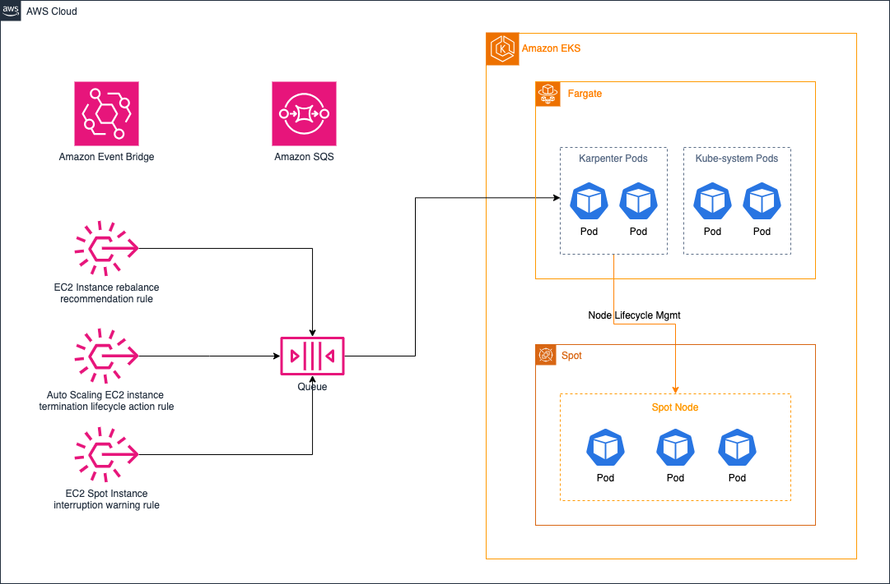
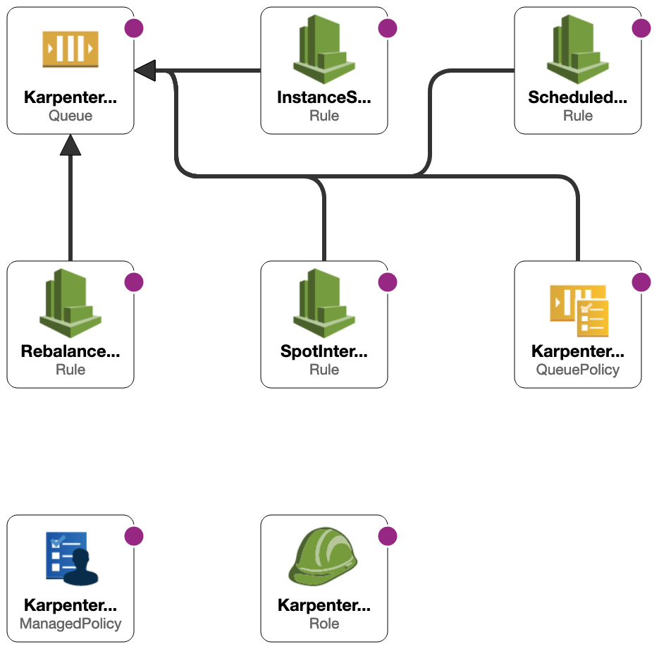

Customers seeking to architect their Kubernetes cluster for best practices maximise on autoscaling which is an important concept in the [AWS well-architected](https://aws.amazon.com/architecture/well-architected/?wa-lens-whitepapers.sort-by=item.additionalFields.sortDate&wa-lens-whitepapers.sort-order=desc&wa-guidance-whitepapers.sort-by=item.additionalFields.sortDate&wa-guidance-whitepapers.sort-order=desc) framework. As workloads increases and often times with changing compute capacity requirements, organizations wants to adapt to these changes but with concerns for selecting the resource types and sizes optimized for workload requirements and ultimately avoid unnecessary costs. 

Karpenter is an open-source cluster autoscaler that automatically provisions new nodes in response to unschedulable pods in Kubernetes cluster. With Karpenter, you don’t need to create several node groups to achieve flexibility and diversity if you want to isolate nodes based on operating systems or compute type. For example, you may have a cluster that consist of GPU, CPU and Habana Gaudi accelerators instance types, to achieve this without Karpenter, you will need to create dedicated node groups for each instance type and use [nodeSelectors](https://kubernetes.io/docs/concepts/scheduling-eviction/assign-pod-node/) to achieve node selection constraint. 

When you deploy Karpenter in your Kubernetes cluster, it installs the Karpenter controller and a webhook pod that must be in running state before the controller can be used for scaling your cluster. This would require a minimum of one small node group with at least one worker node. As an alternative, you can run these pods on EKS Fargate by creating a Fargate profile for the `karpenter` namespace. Doing so will cause all pods deployed into this namespace to run on EKS Fargate. 




| Attributes             |                                                                 |
|------------------------|-----------------------------------------------------------------|
| ✅ AWS experience      | 200 - Intermediate                                              |
| ⏱ Time to complete     | 30 minutes                                                      |
| 🧩 Prerequisites       | - [AWS Account](https://aws.amazon.com/resources/create-account/?sc_channel=el&sc_campaign=devops&sc_content=eks-monitor-containerized-applications&sc_geo=mult&sc_country=mult&sc_outcome=acq)|
| 📢 Feedback            | <a href="https://www.pulse.aws/survey/Z8XBGQEL" target="_blank">Any feedback, issues, or just a</a> 👍 / 👎 ?    |
| ⏰ Last Updated        | 2024-01-12                                                    |

| ToC |
|-----|

## Prerequisites

Before you begin this tutorial, you need to:

* Install the latest version of [kubectl](https://kubernetes.io/docs/tasks/tools/#kubectl). To check your version, run: `kubectl version`.
* Install the latest version of [eksctl](https://eksctl.io/installation/). To check your version, run: `eksctl info`.
* Install the latest version of [Helm CLI](https://helm.sh/docs/intro/install/)

## Overview

Using the `eksctl` cluster template that follows, you'll build an Amazon EKS cluster with Fargate profile to provide the compute capacity we need to run the core clusters components in the karpenter and kube-system namespaces. It configures the following components:

* **Fargate Profile:** [AWS Fargate](https://aws.amazon.com/fargate/) is a compute engine for EKS that removes the need to configure, manage, and scale EC2 instances. Fargate ensures Availability Zone spread while removing the complexity of managing EC2 infrastructure and works to ensure that pods in a Replica Service are balanced across Availability Zones. 
* **Authentication:** Necessary IAM Roles for Service Accounts (IRSAs) mappings to enable communication between Kubernetes pods and AWS services. This includes the Karpenter Controller responsible for provisioning EC2 compute capacity needed in the cluster. Additionally, an [OpenID Connect (OIDC) endpoint](https://docs.aws.amazon.com/eks/latest/userguide/enable-iam-roles-for-service-accounts.html?sc_channel=el&sc_campaign=appswave&sc_content=eks-cluster-high-traffic&sc_geo=mult&sc_country=mult&sc_outcome=acq) enables seamless and secure communication.
* **Identity Mappings**: Necessary mapping for the Karpenter IAM principal and the required cluster's role-based access control (RBAC) configuration in the Amazon EKS control plane.
* **Sample Application Deployment:** Create a sample deployment to validate that Karpenter autoscales compute capacity needed as pod counts increase.

## Step 1: Create the Cluster

In this section, you will deploy a base infrastructure using CloudFormation which Karpenter need for its core functions. Then you will proceed with creating this `cluster config`, you'll define the settings for Fargate profile to provide the compute capacity needed by Karpenter and also core cluster such as CoreDNS.

**To create the cluster**

1. Copy and paste the content below in your terminal to define your environment variable parameters

```bash
export KARPENTER_NAMESPACE=kube-system
export KARPENTER_VERSION=v0.33.0
export K8S_VERSION=1.28
export AWS_PARTITION="aws" 
export CLUSTER_NAME="karpenter-fargate"
export AWS_DEFAULT_REGION="us-west-2"
export AWS_ACCOUNT_ID="$(aws sts get-caller-identity --query Account --output text)"
export TEMPOUT=$(mktemp)
```

2. Copy and paste the content below in your terminal to use CloudFormation to set up the infrastructure needed by the EKS cluster. 

```bash
curl -fsSL https://raw.githubusercontent.com/aws/karpenter-provider-aws/"${KARPENTER_VERSION}"/website/content/en/preview/getting-started/getting-started-with-karpenter/cloudformation.yaml  > $TEMPOUT \
&& aws cloudformation deploy \
  --stack-name "Karpenter-${CLUSTER_NAME}" \
  --template-file "${TEMPOUT}" \
  --capabilities CAPABILITY_NAMED_IAM \
  --parameter-overrides "ClusterName=${CLUSTER_NAME}"
```




Above is a graphical representation of the interrelationship between the resources such as SQS queue, events rules and IAM role that the CloudFormation template will deploy. 
Now, we're ready to create our Amazon EKS cluster. This process takes several minutes to complete. If you'd like to monitor the status, see the [AWS CloudFormation](https://us-west-2.console.aws.amazon.com/cloudformation/home?region=us-west-2) console and change the region if you are creating the cluster in a different AWS region.

3. Copy and paste the content below in your terminal to create the Amazon EKS cluster.

```yaml
eksctl create cluster -f - <<EOF
---
apiVersion: eksctl.io/v1alpha5
kind: ClusterConfig
metadata:
  name: ${CLUSTER_NAME}
  region: ${AWS_DEFAULT_REGION}
  version: "${K8S_VERSION}"
  tags:
    karpenter.sh/discovery: ${CLUSTER_NAME}

iam:
  withOIDC: true
  serviceAccounts:
  - metadata:
      name: karpenter
      namespace: "${KARPENTER_NAMESPACE}"
    roleName: ${CLUSTER_NAME}-karpenter
    attachPolicyARNs:
    - arn:${AWS_PARTITION}:iam::${AWS_ACCOUNT_ID}:policy/KarpenterControllerPolicy-${CLUSTER_NAME}
    roleOnly: true

iamIdentityMappings:
- arn: "arn:${AWS_PARTITION}:iam::${AWS_ACCOUNT_ID}:role/KarpenterNodeRole-${CLUSTER_NAME}"
  username: system:node:{{EC2PrivateDNSName}}
  groups:
  - system:bootstrappers
  - system:nodes

fargateProfiles:
- name: karpenter
  selectors:
  - namespace: "${KARPENTER_NAMESPACE}"
EOF
```

4. Verify the cluster creation by executing the commands below in your terminal:

```bash
export CLUSTER_ENDPOINT="$(aws eks describe-cluster --name ${CLUSTER_NAME} --query "cluster.endpoint" --output text)"
export KARPENTER_IAM_ROLE_ARN="arn:${AWS_PARTITION}:iam::${AWS_ACCOUNT_ID}:role/${CLUSTER_NAME}-karpenter"
echo $CLUSTER_ENDPOINT $KARPENTER_IAM_ROLE_ARN
```

## Step 2: Install Karpenter on the Cluster

Upon successful verification of the cluster creation, we are now ready to install Karpenter in the cluster.

1. Logout of helm registry to perform an unauthenticated pull against the public ECR just in case you were logged in.

```bash
helm registry logout public.ecr.aws 
docker logout public.ecr.aws
```

2. Proceed to install Karpenter with the command below:

```bash
helm upgrade --install karpenter oci://public.ecr.aws/karpenter/karpenter --version "${KARPENTER_VERSION}" --namespace "${KARPENTER_NAMESPACE}" --create-namespace \
  --set "serviceAccount.annotations.eks\.amazonaws\.com/role-arn=${KARPENTER_IAM_ROLE_ARN}" \
  --set "settings.clusterName=${CLUSTER_NAME}" \
  --set "settings.interruptionQueue=${CLUSTER_NAME}" \
  --set controller.resources.requests.cpu=1 \
  --set controller.resources.requests.memory=1Gi \
  --set controller.resources.limits.cpu=1 \
  --set controller.resources.limits.memory=1Gi \
  --wait
```

When the previous command completes, verify that Karpenter pods and CoreDNS, a core cluster component, are in `Running` state with the following command with Fargate providing the compute capacity:

```bash
kubectl get pods -n kube-system -o wide
```

Sample output:

```bash
NAME                        READY   STATUS    RESTARTS   AGE   IP                NODE                                                    NOMINATED NODE   READINESS GATES
coredns-56666498f9-7j8zh    1/1     Running   0          16m   192.168.135.152   fargate-ip-192-168-135-152.us-west-2.compute.internal   <none>           <none>
coredns-56666498f9-lj8q8    1/1     Running   0          16m   192.168.143.82    fargate-ip-192-168-143-82.us-west-2.compute.internal    <none>           <none>
karpenter-c95c9f6fb-24r8c   1/1     Running   0          81s   192.168.167.246   fargate-ip-192-168-167-246.us-west-2.compute.internal   <none>           <none>
karpenter-c95c9f6fb-fxvmv   1/1     Running   0          81s   192.168.117.84    fargate-ip-192-168-117-84.us-west-2.compute.internal    <none>           <none>
```

The previous output shows that Karpenter is healthy and ready to start provision EC2 compute capacity that will be required by the workloads we will be deploying in the cluster.

## Step 3: Create a default NodePool

After installing Karpenter, you need to setup a default [NodePool](https://karpenter.sh/docs/concepts/nodepools/). The NodePool’s task is to set constraints on the nodes that can be created by Karpenter and the pods that can be scheduled on those nodes.

1. Copy and paste the content below in your terminal to create the default provisioner for the cluster:

```yaml
cat <<EOF | envsubst | kubectl apply -f -
apiVersion: karpenter.sh/v1beta1
kind: NodePool
metadata:
  name: default
spec:
  template:
    spec:
      requirements:
        - key: kubernetes.io/arch
          operator: In
          values: ["amd64"]
        - key: kubernetes.io/os
          operator: In
          values: ["linux"]
        - key: karpenter.sh/capacity-type
          operator: In
          values: ["spot"]
        - key: karpenter.k8s.aws/instance-category
          operator: In
          values: ["c", "m", "r"]
        - key: karpenter.k8s.aws/instance-generation
          operator: Gt
          values: ["2"]
      nodeClassRef:
        name: default
  limits:
    cpu: 1000
  disruption:
    consolidationPolicy: WhenUnderutilized
    expireAfter: 720h 
---
apiVersion: karpenter.k8s.aws/v1beta1
kind: EC2NodeClass
metadata:
  name: default
spec:
  amiFamily: AL2 # Amazon Linux 2
  role: "KarpenterNodeRole-${CLUSTER_NAME}" 
  subnetSelectorTerms:
    - tags:
        karpenter.sh/discovery: "${CLUSTER_NAME}" 
  securityGroupSelectorTerms:
    - tags:
        karpenter.sh/discovery: "${CLUSTER_NAME}" 
EOF
```

This NodePool will create EC2 spot instances as the capacity we need to run subsequent pods in other namespaces aside kube-system namespace running core cluster components and the Karpenter pods. 

## Step 4: Autoscaling Demo

1. Deploy the sample application with 0 count using the command below:

```bash
kubectl create deployment app --image=public.ecr.aws/nginx/nginx:latest --replicas=0
```

2. Now we are ready to observe how Karpenter autoscale and provision EC2 compute capacity needed by pods. Open a second terminal and run the command below to monitor Karpenter:

```bash
kubectl logs -f -n kube-system -l app.kubernetes.io/name=karpenter -c controller
```

3. In the previous terminal, run the command below to scale the workload and watch the Karpenter controller logs in the other terminal:

```bash
kubectl scale deployment app --replicas 5
```

4. The previous command will launch 5 pods that needs to be scheduled on an EC2 worker node(s). Verify Karpenter has launched the pods on EC2 instance worker node:

```bash
kubectl get pods -o wide
```

Sample output:

```bash
NAME                   READY   STATUS    RESTARTS   AGE    IP               NODE                                          NOMINATED NODE   READINESS GATES
app-6d954fd7d9-9ss7f   1/1     Running   0          6m5s   192.168.76.132   ip-192-168-73-43.us-west-2.compute.internal   <none>           <none>
app-6d954fd7d9-bxbmh   1/1     Running   0          6m5s   192.168.86.102   ip-192-168-73-43.us-west-2.compute.internal   <none>           <none>
app-6d954fd7d9-hsndg   1/1     Running   0          6m5s   192.168.86.252   ip-192-168-73-43.us-west-2.compute.internal   <none>           <none>
app-6d954fd7d9-ljnzc   1/1     Running   0          6m5s   192.168.67.91    ip-192-168-73-43.us-west-2.compute.internal   <none>           <none>
app-6d954fd7d9-q9x4d   1/1     Running   0          6m5s   192.168.89.34    ip-192-168-73-43.us-west-2.compute.internal   <none>           <none>
```

## Clean Up

To avoid incurring future charges, you should delete the resources created during this tutorial. Delete the sample deployment 

```bash
kubectl delete deployment app
```

Uninstall Karpenter:

```bash
helm uninstall karpenter --namespace kube-system
```

Delete the Infrastructure deployed with CloudFormation

```bash
aws ec2 describe-launch-templates --filters Name=tag:karpenter.k8s.aws/cluster,Values=${CLUSTER_NAME} |
    jq -r ".LaunchTemplates[].LaunchTemplateName" |
    xargs -I{} aws ec2 delete-launch-template --launch-template-name {}
```

You can delete the EKS cluster with the following command:

```bash
eksctl delete cluster --name "${CLUSTER_NAME}" 
```

Upon completion, you should see the following response output:

```bash
2023-12-15 14:44:58 [ℹ]  will delete stack "eksctl-karpenter-fargate-cluster"
2023-12-15 14:45:01 [✔]  all cluster resources were deleted
```

## Conclusion

In this article, you've successfully set up an Amazon EKS cluster with Karpenter deployed on Fargate to autoscale the cluster with the needed EC2 compute capacity as your workload increases. With Fargate providing compute capacity for the Karpenter pods, you will not need to manage that node. Karpenter manages the lifecycle of the other nodes in the EKS cluster. To explore more tutorials, check out [Navigating Amazon EKS](https://community.aws/tutorials/navigating-amazon-eks#list-of-all-tutorials).
