|ToC|
|---|

Artificial Intelligence used to be the specialized domain of data scientists and computer programmers. No-code/Low-code (NCLC) removes barriers, allowing anyone to use artificial intelligence without having to write a line of computer code. NCLC platforms are replacing the need for programming with a visual drag-and-drop interface.

In this blog post, I will go through a step-by-step process on how to build stock price predictions without writing a single line of code.

We will be using the No-code approach with [Amazon SageMaker Canvas](https://docs.aws.amazon.com/sagemaker/index.html?sc_channel=el&sc_campaign=datamlwave&sc_geo=mult&sc_country=mult&sc_outcome=acq&sc_content=no-code-ai-with-sagemaker-canvas). This example is not meant to be for investment purposes but rather to showcase the ease of development of predictions. ML models based on the history of stock prices are inadequate for predicting future prices, as they fail to incorporate crucial elements such as policy changes and economic swings, which can significantly impact the stock market's behavior and introduce unpredictability beyond what historical data alone can capture. Please do not make any financial decisions based on the forecasted results.

I will walk you through the following steps:

* Part 1 - Configuring prerequisites and obtaining a dataset
* Part 2 - Building predictions with SageMaker Canvas
* Part 3 - Using the model to generate predictions
* Part 4 - Creating a visualization dashboard using QuickSight

## Solution Overview

Amazon SageMaker Canvas allows building ML models using a visual interface instead of writing code. It includes pre-built ML models for a variety of use cases including sentiment analysis, object detection on images, document analysis, and more. You can import and join data from different external resources Amazon S3, Snowflake, Google Analytics, and many more.

For our example, we will create a custom model using time-series forecasting and import a dataset stored from Amazon S3.

Time series forecasting refers to the process of predicting future values or patterns in a sequence of data points that are collected over time. It involves analyzing historical patterns, trends, and seasonality within the data to make predictions about future values, enabling decision-making, planning, and understanding of future trends.

Below is an architectural diagram and the high-level steps:

1. Obtain a historical dataset from Nasdaq
2. Modify the dataset and upload it to Amazon S3 bucket
3. Use SageMaker Canvas to build a model
4. Visualize the forecasted dataset using Amazon QuickSight

Let’s get started!

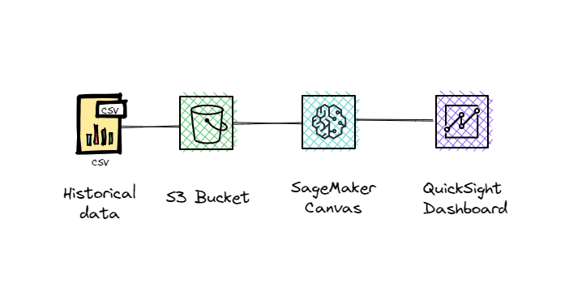

Diagram 1 - No-Code Solution Architecture for building and visualizing ML predictions.

## Part 1 - Configuring Prerequisites & Obtaining a Dataset

To get started with Amazon SageMaker Canvas, we will first need to create a domain. You can think of a domain as a central store where configuration, notebooks, and other artifacts will be stored and shared between users.

To create a domain, open the AWS Console and then search for SageMaker. Select a region that you would like to use. Click **Get Started** button.

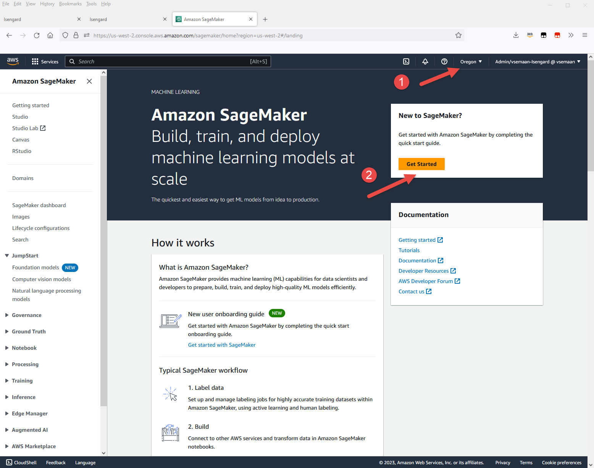

In the new window, click **Setup SageMaker Domain** and provide a name, for example, `Predictions`. We will need to create a new IAM role to allow access to your AWS account. Click **Create a new role**, then select Any S3 bucket and click **Create New Role**. Once it’s done, click **Submit** at the bottom of the page.

Please note, you can limit permissions in the IAM policy to a particular bucket or folder and outline more a granular access for different users.

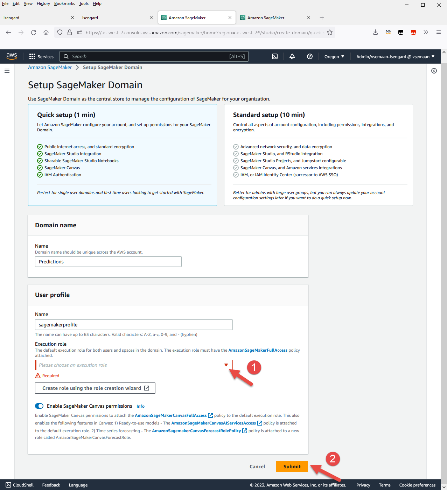

It will take a few minutes to create a new domain. In the meantime, we can download historical data.

Go to [Nasdaq](https://www.nasdaq.com/market-activity/stocks/aapl/historical) and search for a stock that you are interested to forecast. For more accurate results, pick a stock that  has a few years worth of historical data and click MAX. For this example, we will use Apple Inc. Common Stock - AAPL and download all historical data. Nasdaq limits to the past 10 years.

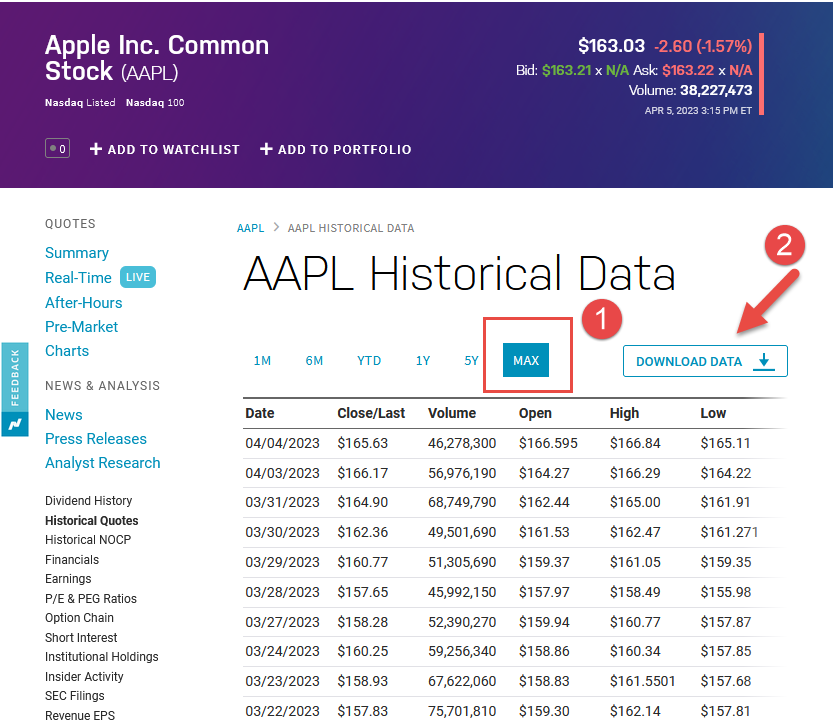

Next, we need to make small changes to the historical dataset to prepare it for processing with Sagemaker.

Open the CSV file and make the following modifications:

* Add a Column *Ticker* with value AAPL
* Rename *Close/Last* to *MarketClose*
* Rename  *Open* to *MarketOpen*
* Set Format Cells to Number with 2 decimals for the following fields: *MarketClose*, *MarketOpen*, *High*, *Low*.

Save all changes. Rename file to AAPL_<today's date> for example AAPL_20230421.csv

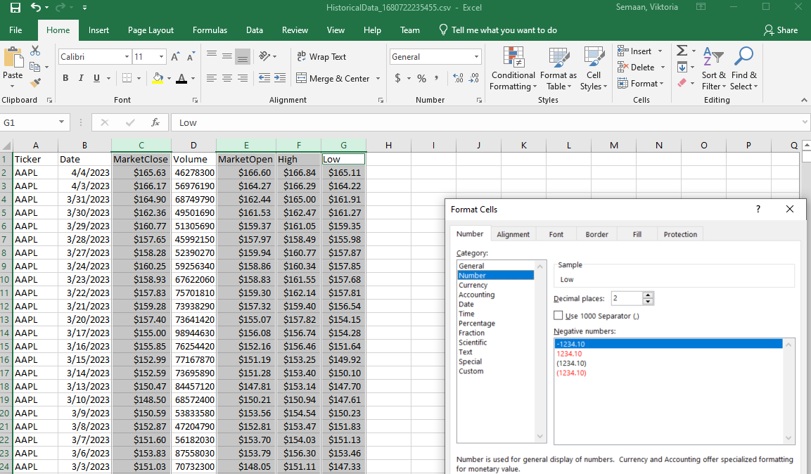

As a next step, upload the dataset to an Amazon S3 bucket.

An Amazon S3 bucket is a storage container provided by Amazon Web Services (AWS) that allows users to store and retrieve data in the cloud. It functions like a folder or directory where you can upload and organize files, such as documents, images, or videos. It offers a scalable and reliable storage solution, accessible from anywhere on the internet, and can be integrated with various applications and services for data storage and backup purposes.

You can create a new bucket or use any existing buckets.

To create a new S3 bucket, go to AWS Console and search for S3. Click the **Create bucket** button. Give a bucket a unique name and keep all other parameters as default.

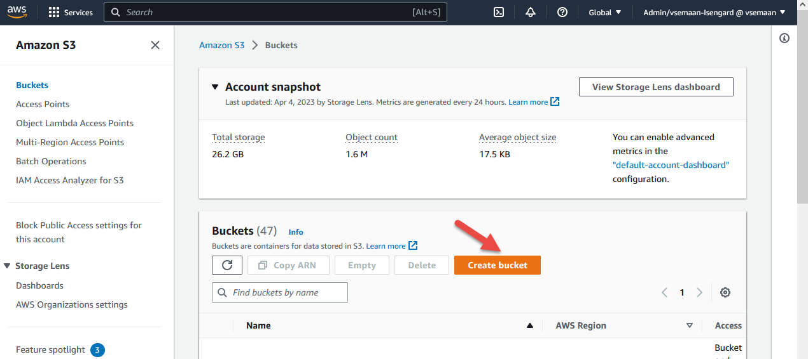

Once a bucket is created, navigate inside it and drop the dataset file there. Keep all default options and click **Upload**.

Next, we will add this file to SageMaker Canvas as a dataset. Go back to the SageMaker console and check if your domain is ready. On the navigation pane, click **Domains** and you will see  **Status**. Wait until you see *In Service* and then click on the domain hyperlink.

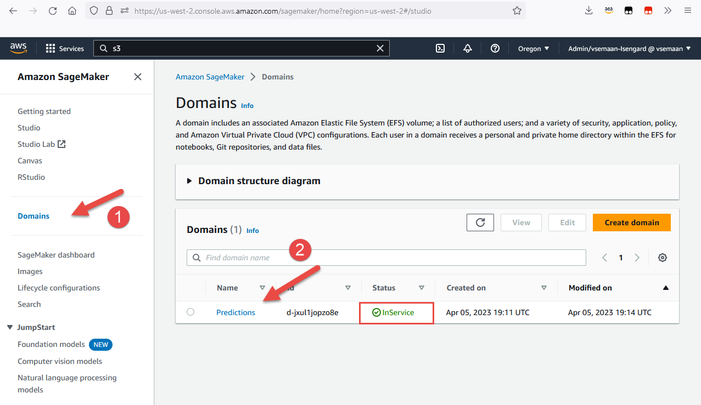

On the domain details page, click on the **Launch** dropdown and pick **Canvas**. It will take a a few minutes to launch Canvas for the first to create an application. When you log into SageMaker Canvas for the first time, there is a welcome message with quick getting started tutorials that you can follow for a walkthrough of the SageMaker Canvas application. Feel free to explore the tutorials or click **Skip for now**.

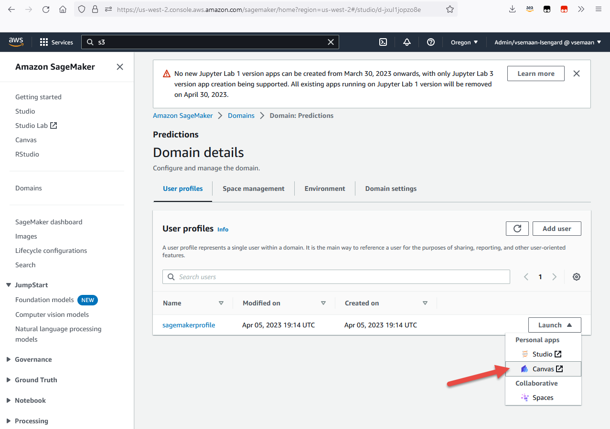

On the left menu, click **Datasets** and then click the **Import** button. From the dropdown, select **Amazon S3** as the Data Source. If you have many buckets, you can use the search functionality to filter buckets on your account. Select your CSV file and click the **Import data** button at the bottom. You will see an option to preview the first 100 rows and import the data.

Now we are ready to use our dataset and build predictions!

## Part 2 - Building Predictions with SageMaker Canvas

On the left menu, click **My Models** and click the **New Model** button. Provide a name - for example `AAPL Predictions` - and click the **Create** button.
On the next screen, select your dataset and click the **Select dataset** button at the bottom.

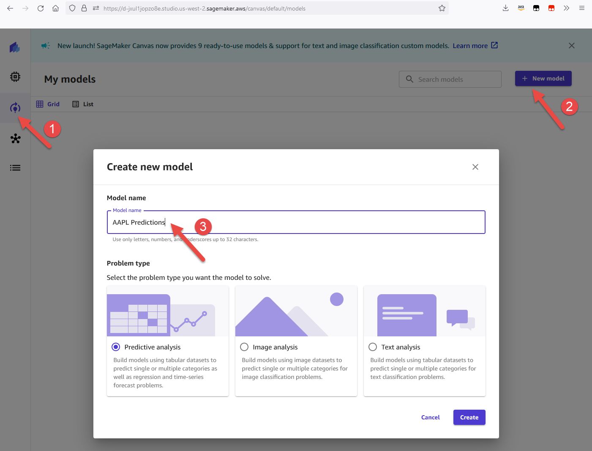

On the next screen, we will configure the model for training. There are two types of training:

* Quick build – Builds a model in a fraction of the time compared to a standard build. It results in potentially lower accuracy in exchange of greater speed. It takes about 15-20 minutes to complete Quick Build.
* Standard build – Builds the best model from an optimized process powered by AutoML. It takes a longer time but provides more accurate results. It may take around 4-5 hours to build a model using our dataset.

If you're starting with an experiment, it's faster to use quick build, validate your forecast, and later proceed with standard build. That will save you money once you start using SageMaker Canvas beyond Free Tier.

> Quick note:
> 
> Amazon SageMaker Canvas's 2-month free tier includes workspace instance (Session-Hrs) usage up to 750 hours/month for using the SageMaker Canvas application.

The first step of the training ML model process is to choose the **Target column**. Let’s pick the *MarketClose* variable because it will help us to evaluate the accuracy of the model in the future by looking at the historical market close values.

SageMaker Canvas will automatically detect that we will use *Time Series model* based on the imported dataset. Check all the fields to include them in the model training as on the screenshot below.

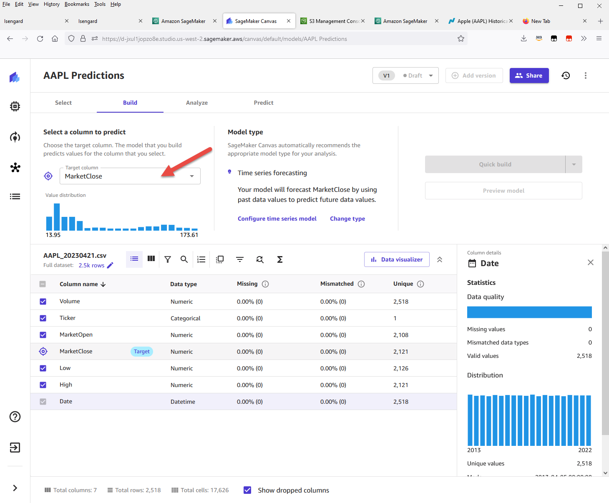

Click **Configure time series model** and complete configuration in the popup window as follows:

* The column that uniquely identifies items in the dataset: *Ticker*
* The column that contains the time stamps: *Date*
* Specify Number of days for forecast: *30*
* Use holiday schedule: Enable and pick *United States*. The Nasdaq Stock Market is closed during the US holidays.

Click **Save** button at the bottom.

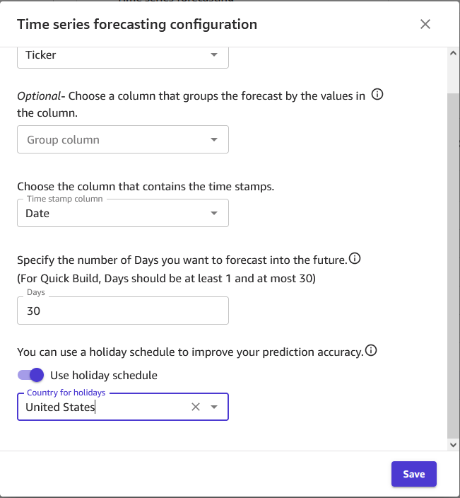

You will see the status of fields will update as on the picture below. Click **Quick build**.

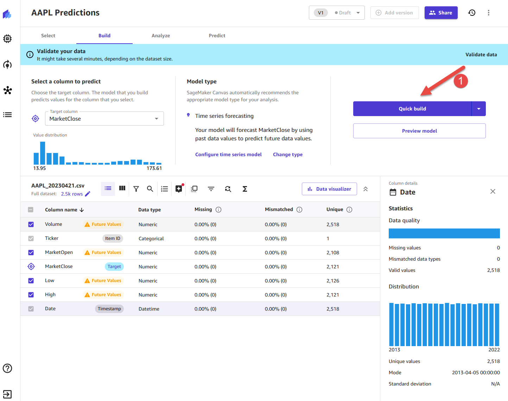

You may get a pop-up asking to validate your data. You can skip it and click **Start Quick build** to validate. It will take a few seconds to validate the data and about 15-20 minutes to build an ML model.

## Part 3 - Using the Model to Generate Predictions

When the model training finishes, you will be navigated to the **Analyze** tab. There you can see the average prediction accuracy, and how different columns impact the outcome of predictions. Please note that actual numbers might differ from the one you see on the screenshot below, due to stochastic nature of the Machine Learning process. (The term stochastic refers to the fact that there is an inherent uncertainty and randomness involved in ML algorithms.)

Canvas separates the dataset into training and test sets. The training dataset is the data Canvas uses to build the model. The test set is used to see if the model performs well with new data. The following screenshot shows how the model performed on the test set. To learn more, refer to [Evaluating Your Model’s Performance in Amazon SageMaker Canvas](https://docs.aws.amazon.com/sagemaker/latest/dg/canvas-evaluate-model.html?sc_channel=el&sc_campaign=datamlwave&sc_geo=mult&sc_country=mult&sc_outcome=acq&sc_content=no-code-ai-with-sagemaker-canvas).

Our model looks quite accurate based on the model status metrics.

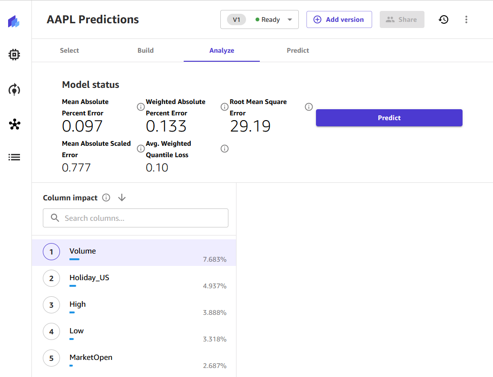

Let’s proceed to the fun part with building predictions by clicking the **Predict** button. You will be brought to the **Predict** tab.

To create forecast predictions, let’s provide a maximum value - a 30-day window. Since our dataset only includes one stock ticker, select **Single item** for prediction type and pick *AAPL* from the **Item** dropdown. Review the predicted results.

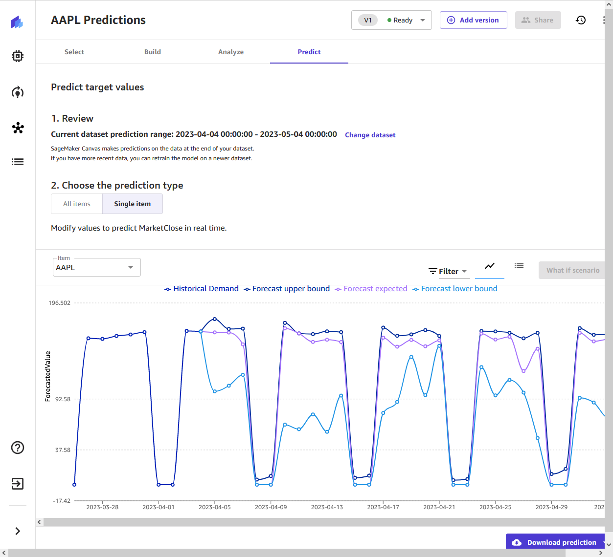

Canvas generates probabilistic forecasts at three default quantiles: 10% (p10), 50% (p50), and 90% (p90). "P" stands for Percentile. You can choose the forecast that suits your needs. For the p10 forecast, the true value is expected to be lower than the predicted value 10% of the time. With the p90 forecast, the true value is expected to be lower than the predicted value 90% of the time. If missing customer demand would result in either a significant amount of lost revenue or a poor customer experience, the p90 forecast is more useful. For our use case, the p50 Forecast will suit better for evaluation. If we want to identify a point when it's a good time to buy stock, then we would use p10. If we wanted to identify times to sell stock, then we would use p90.

You can notice how prediction drops to zeros during the weekend. Let’s build a dashboard in QuickSight and filter out weekends so we can get a better picture of the predicted trend. Click **Download prediction button** at the bottom.

**Important!** Once you are done with Canvas, click the **Log out** button on the left menu at the bottom. Log out will release resources and stop session charges. Your datasets and models will not be affected. Don’t forget to log out when you are not using SageMaker Canvas!

## Part 4 - Creating a Visualization Dashboard Using QuickSight

Open Amazon QuickSight from the AWS console. On the left menu, select **Datasets**, then click **New dataset** button.

Select **Upload file**. Select the file you downloaded from SageMaker Canvas. Click **Next**, then **Visualize**.

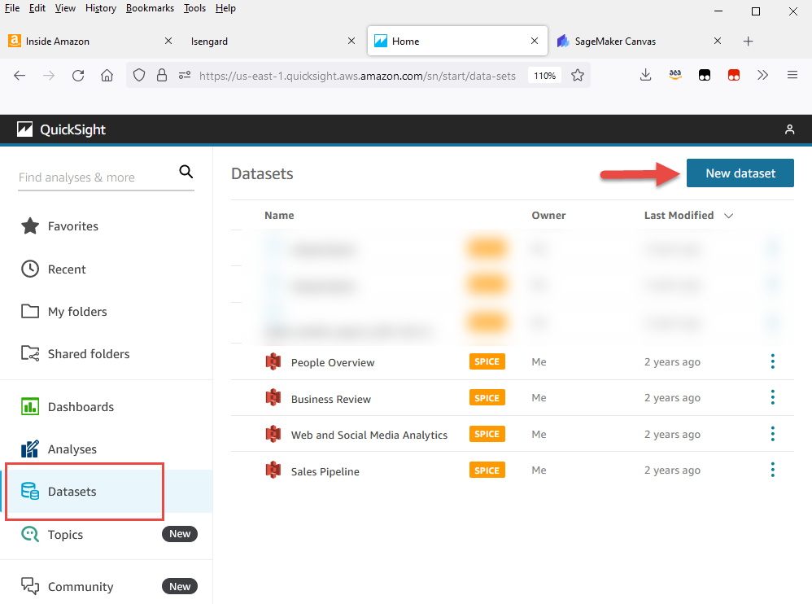

Amazon Quicksight allows you to build visualization dashboards and supports different visualization types. You can add calculated fields, apply filters, and change fields and datatypes. Let’s add a filter to remove drops to zero.

On the left pane, select **Edit Filter** and set:

* Aggregation: *No aggregation*
* Filter condition: *Greater than*
* Minimum value: *1*

Click **Apply** at the bottom.

As a last step, let’s configure the dashboard. Select **Line chart* visualization and configure as follows:

**X axis**: Date,  **Value**: Forecast upper bound, Forecast expected, Forecast lower bound

You should see results similar to the screenshot below:

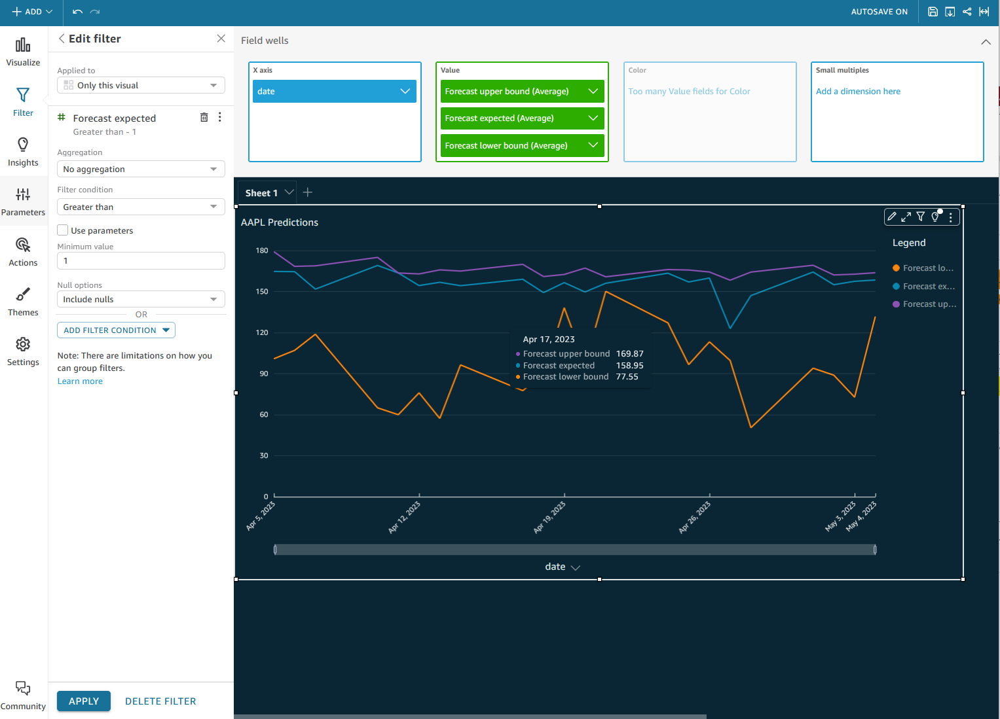

## Conclusion

We completed the entire process from data prep, model building analysis of predictions to building visualization dashboards - all without writing a single line of code. Congratulations!

I hope you enjoyed getting hands-on experience building No-Code Machine Learning Models. Please remember that predicting a stock value is difficult: this blogpost is about showcasing the process of creating a time-series forecast, not about stock forecasting itself. Please don’t use prediction results for investment purposes!

If you are interested in experimenting with other SageMaker Canvas ML models and use cases, check out [SageMaker Canvas Immersion day](https://catalog.us-east-1.prod.workshops.aws/workshops/80ba0ea5-7cf9-4b8c-9d3f-1cd988b6c071/en-US?sc_channel=el&sc_campaign=datamlwave&sc_geo=mult&sc_country=mult&sc_outcome=acq&sc_content=no-code-ai-with-sagemaker-canvas).

## About the Author

Viktoria is a Senior Developer Advocate and passionate about helping developers to build and innovate using new technologies. She is a content creator and frequently shares content on [LinkedIn](https://www.linkedin.com/in/semaan/). Viktoria has been named one of the Top Cloud Influencers and the [#9 LinkedIn Female Content Creator WorldWide](https://app.favikon.com/creators-tops/women-content-creators/all-niches/linkedin/).
