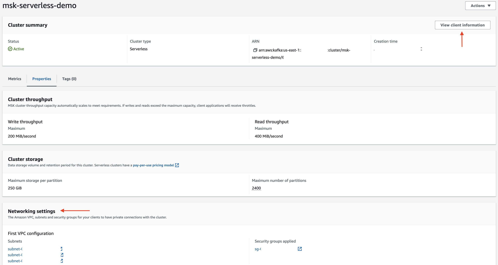
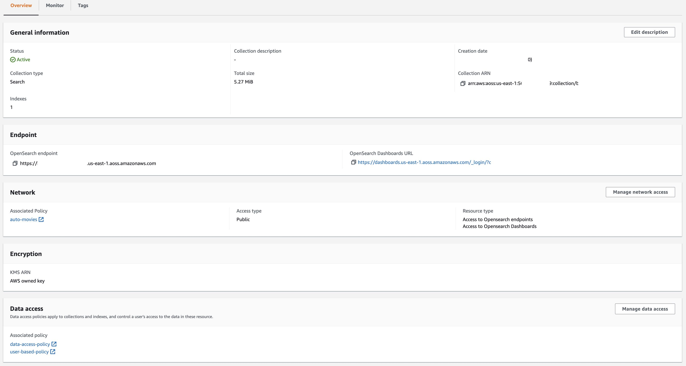
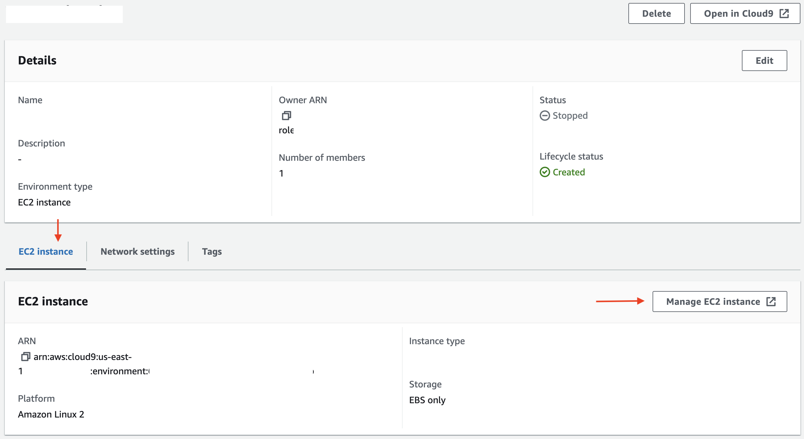
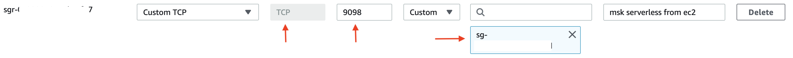
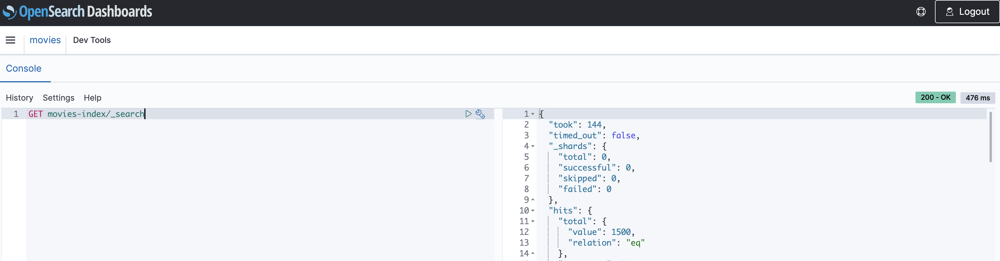
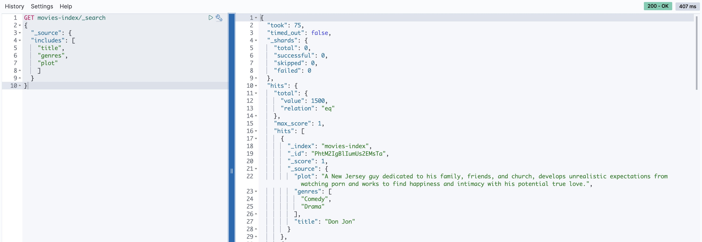
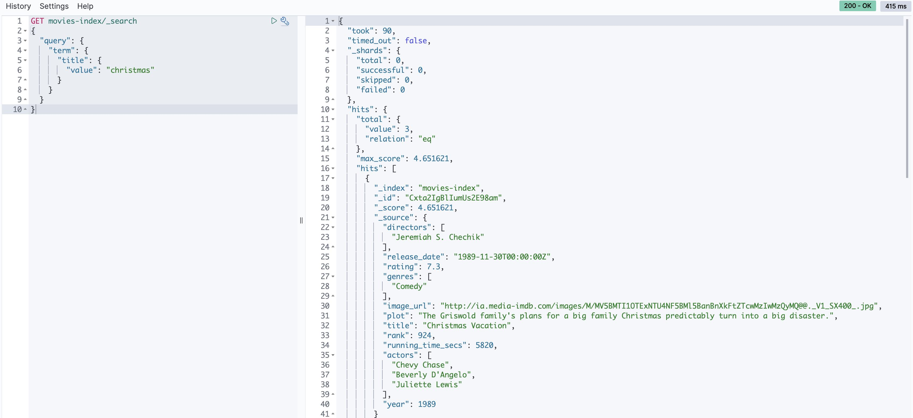
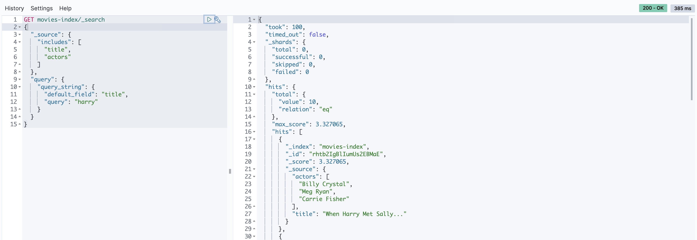

Scalable data ingestion is a key aspect for a large-scale distributed search and analytics engine like [OpenSearch](https://opensearch.org/). One of the ways to build a real-time data ingestion pipeline is to use [Apache Kafka](https://kafka.apache.org/). It's an open-source event streaming platform used to handle high data volume (and velocity) and integrates with a variety of sources including relational and NoSQL databases. For example, one of the canonical use cases is real-time synchronization of data between heterogeneous systems (source components) to ensure that OpenSearch indexes are fresh and can be used for analytics or consumed downstream applications via dashboards and visualizations.

| Attributes             |                                                                 |
|------------------------|-----------------------------------------------------------------|
| ✅ AWS experience      | 200 - Intermediate                                                        |
| ⏱ Time to complete    | 60 minutes                                                      |
| 💰 Cost to complete    | [Free tier](https://aws.amazon.com/free/?sc_channel=el&sc_campaign=datamlwave&sc_content=opensearch-kafka-golang&sc_geo=mult&sc_country=mult&sc_outcome=acq) eligible                                               |
| 🧩 Prerequisites       | - [AWS account](https://aws.amazon.com/resources/create-account/?sc_channel=el&sc_campaign=datamlwave&sc_content=opensearch-kafka-golang&sc_geo=mult&sc_country=mult&sc_outcome=acq)<br>-CDK installed: Visit [Get Started with AWS CDK](https://aws.amazon.com/getting-started/guides/setup-cdk/) to learn more.  |
| 💻 Code Sample         | Code sample used in tutorial on [GitHub](https://github.com/build-on-aws/opensearch-using-kafka-golang)                             |
| 📢 Feedback            | <a href="https://pulse.buildon.aws/survey/DEM0H5VW" target="_blank">Any feedback, issues, or just a</a> 👍 / 👎 ?    |
| ⏰ Last Updated        | 2023-07-10                                                      |

| ToC |
|-----|

This blog post will cover how to create a data pipeline wherein data written into Apache Kafka is ingested into [OpenSearch](https://opensearch.org/). We will be using [Amazon OpenSearch Serverless](https://docs.aws.amazon.com/opensearch-service/latest/developerguide/serverless.html?sc_channel=el&sc_campaign=datamlwave&sc_content=opensearch-kafka-golang&sc_geo=mult&sc_country=mult&sc_outcome=acq), [Amazon Managed Streaming for Apache Kafka (Amazon MSK) Serverless](https://docs.aws.amazon.com/msk/latest/developerguide/serverless.html?sc_channel=el&sc_campaign=datamlwave&sc_content=opensearch-kafka-golang&sc_geo=mult&sc_country=mult&sc_outcome=acq). [Kafka Connect](https://kafka.apache.org/documentation/#connect) is a great fit for such requirements. It provides sink connectors for OpenSearch as well as ElasticSearch (which can be used if you opt for the ElasticSearch OSS engine with Amazon OpenSearch). Sometimes though, there are specific requirements or reasons which may warrant the use of a custom solution. 

For example, you might be using a data source which is not supported by Kafka Connect (rare, but could happen) and don't want to write one from scratch. Or, this could be a one-off integration and you're  wondering if it's worth the effort to set up and configure Kafka Connect. Perhaps there are other concerns, like licensing etc.

Thankfully, Kafka and OpenSearch provide client libraries for a variety of programming languages which make it possible to write your own integration layer. This is exactly what's covered in this blog! We will make use of a custom [Go](http://go.dev/) application to ingest data using Go clients for [Kafka](https://github.com/twmb/franz-go) and [OpenSearch](https://opensearch.org/docs/latest/clients/go/). 

You will learn:

- Overview of how to set up the required AWS services - OpenSearch Serverless, MSK Serverless, AWS Cloud9 along with IAM policies and security configurations.
- High-level walk through of the application.
- Get the data ingestion pipeline up and running.
- How to query data in OpenSearch.

Before we get into the nitty-gritty, here is a quick overview of OpenSearch Serverless and Amazon MSK Serverless.

## Introduction to Amazon OpenSearch Serverless and Amazon MSK Serverless

OpenSearch is an open-source search and analytics engine used for log analytics, real-time monitoring, and clickstream analysis. Amazon OpenSearch Service is a managed service that simplifies the deployment and scaling of OpenSearch clusters in AWS.

> Amazon OpenSearch Service supports OpenSearch and legacy Elasticsearch OSS (up to 7.10, the final open source version of the software). When you create a cluster, you have the option of which search engine to use.

You can [create an OpenSearch Service domain](https://docs.aws.amazon.com/opensearch-service/latest/developerguide/gsgcreate-domain.html?sc_channel=el&sc_campaign=datamlwave&sc_content=opensearch-kafka-golang&sc_geo=mult&sc_country=mult&sc_outcome=acq) (synonymous with an OpenSearch cluster) to represent a cluster, with each Amazon EC2 instance acting as a *node*. However, OpenSearch Serverless eliminates operational complexities by providing on-demand serverless configuration for OpenSearch service. It uses collections of indexes to support specific workloads, and unlike traditional clusters, it separates indexing and search components, with [Amazon S3](https://docs.aws.amazon.com/AmazonS3/latest/userguide/Welcome.html?sc_channel=el&sc_campaign=datamlwave&sc_content=opensearch-kafka-golang&sc_geo=mult&sc_country=mult&sc_outcome=acq) as the primary storage for indexes. This architecture enables independent scaling of search and indexing functions.

> You can refer to the details in [Comparing OpenSearch Service and OpenSearch Serverless](https://docs.aws.amazon.com/opensearch-service/latest/developerguide/serverless-overview.html#serverless-comparison?sc_channel=el&sc_campaign=datamlwave&sc_content=opensearch-kafka-golang&sc_geo=mult&sc_country=mult&sc_outcome=acq).


Amazon MSK (Managed Streaming for Apache Kafka) is a fully managed service for processing streaming data with Apache Kafka. It handles cluster management operations like creation, updates, and deletions. You can use standard Apache Kafka data operations for producing and consuming data without modifying your applications. It supports open-source Kafka versions, ensuring compatibility with existing tools, plugins, and applications.


MSK Serverless is a cluster type within Amazon MSK that eliminates the need for manual management and scaling of cluster capacity. It automatically provisions and scales resources based on demand, taking care of topic partition management. With a pay-as-you-go pricing model, you only pay for the actual usage. MSK Serverless is ideal for applications requiring flexible and automated scaling of streaming capacity.

Let's start by discussing the high level application architecture before moving on to the architectural considerations.

## Application overview and key architectural considerations

Here is a simplified version of the application architecture that outlines the components and how they interact with each other.


The application consists of producer and consumer components, which are Go applications deployed to an `EC2` instance:

- As the name suggests, the producer sends data to the MSK Serverless cluster.
- The consumer application receives data (`movie` information) from the MSK Serverless topic and uses the OpenSearch Go client to index data in the `movies` collection.

### Focus on simplicity
  
It's worth noting that the blog post has been optimized for simplicity and ease of understanding, hence the solution is not tuned for running production workloads. The following are some of the simplifications that have been made:

- The producer and consumer applications run on the *same* compute platform (an EC2 instance).
- There is a *single* consumer application instance processing data from the MSK topic. However, you can try to run multiple instances of the consumer application and see how the data is distributed across the instances.
- Instead of using the Kafka CLI to produce data, a custom producer application was written in Go along with a REST endpoint to send data. This demonstrates how to write a Kafka producer application in Go and mimics the Kafka CLI.
- The volume of data used is small.
- OpenSearch Serverless collection has a **Public** access type.

For a production workload, here are some of the things you should consider:

- Choose an appropriate compute platform for your consumer application based on data volume and scalability requirements - more on this below.
- Choose **VPC** access type for your OpenSearch Serverless collection
- Consider using [Amazon OpenSearch Ingestion](https://docs.aws.amazon.com/opensearch-service/latest/developerguide/ingestion.html?sc_channel=el&sc_campaign=datamlwave&sc_content=opensearch-kafka-golang&sc_geo=mult&sc_country=mult&sc_outcome=acq) to create your data pipelines.

If you still need to deploy your custom application to build a data pipeline from MSK to OpenSearch, here are the range of compute options you can choose from:

- Containers - You can package your consumer application as a Docker container (`Dockerfile` is available in the GitHub repository) and deploy it to [Amazon EKS](https://docs.aws.amazon.com/eks/latest/userguide/what-is-eks.html?sc_channel=el&sc_campaign=datamlwave&sc_content=opensearch-kafka-golang&sc_geo=mult&sc_country=mult&sc_outcome=acq) or [Amazon ECS](https://docs.aws.amazon.com/AmazonECS/latest/developerguide/Welcome.html?sc_channel=el&sc_campaign=datamlwave&sc_content=opensearch-kafka-golang&sc_geo=mult&sc_country=mult&sc_outcome=acq).
- If you deploy the application to Amazon EKS, you can also consider using [KEDA](https://keda.sh/) to auto-scale your consumer application based on the number of messages in the MSK topic.
- Serverless - It's also possible to use [MSK as an event source for AWS Lambda functions](https://docs.aws.amazon.com/lambda/latest/dg/with-msk.html?sc_channel=el&sc_campaign=datamlwave&sc_content=opensearch-kafka-golang&sc_geo=mult&sc_country=mult&sc_outcome=acq). You can write your consumer application as a Lambda function and configure it to be triggered by MSK events or alternatively run it on [AWS Fargate](https://docs.aws.amazon.com/AmazonECS/latest/developerguide/AWS_Fargate.html?sc_channel=el&sc_campaign=datamlwave&sc_content=opensearch-kafka-golang&sc_geo=mult&sc_country=mult&sc_outcome=acq).
- Since the producer application is a REST API, you can deploy it to AWS App Runner.
- Finally, you can leverage [Amazon EC2 Auto Scaling groups](https://docs.aws.amazon.com/autoscaling/ec2/userguide/auto-scaling-groups.html?sc_channel=el&sc_campaign=datamlwave&sc_content=opensearch-kafka-golang&sc_geo=mult&sc_country=mult&sc_outcome=acq) to auto-scale the EC2 fleet for you consumer application.

There is enough material out there that talks about how to use Java based Kafka applications to connect with [MSK Serverless using IAM](https://docs.aws.amazon.com/msk/latest/developerguide/iam-access-control.html?sc_channel=el&sc_campaign=datamlwave&sc_content=opensearch-kafka-golang&sc_geo=mult&sc_country=mult&sc_outcome=acq).
Let's take a short detour into understanding how this works with Go.

### How do Go client applications authenticate with MSK Serverless using IAM ?

MSK Serverless requires IAM access control to handle both authentication and authorization for your MSK cluster. This means that your MSK clients applications (producer and consumer in this case) have to use IAM to authenticate to MSK, based on which they will be allowed or denied specific Apache Kafka actions.

The good thing is that the `franz-go` Kafka client library supports IAM authentication. Here are snippets from the consumer application that show how it works in practice:

```go
func init() {
//......
	cfg, err = config.LoadDefaultConfig(context.Background(), config.WithRegion("us-east-1"), config.WithCredentialsProvider(ec2rolecreds.New()))
	
  creds, err = cfg.Credentials.Retrieve(context.Background())
//....

func initializeKafkaClient() {

	opts := []kgo.Opt{
		kgo.SeedBrokers(strings.Split(mskBroker, ",")...),
		kgo.SASL(sasl_aws.ManagedStreamingIAM(func(ctx context.Context) (sasl_aws.Auth, error) {

			return sasl_aws.Auth{
				AccessKey:    creds.AccessKeyID,
				SecretKey:    creds.SecretAccessKey,
				SessionToken: creds.SessionToken,
				UserAgent:    "msk-ec2-consumer-app",
			}, nil
		})),
//.....
```

- First, the application uses the `ec2rolecreds.New()` credentials provider to retrieve the temporary IAM credentials from the EC2 instance metadata service. The EC2 Instance role should have appropriate IAM role (with permissions) to execute required operations on MSK cluster components (more on this in the subsequent sections).
- These credentials are then used to initialize the Kafka client with the `AWS_MSK_IAM` SASL authentication implementation in the [sasl_aws](https://pkg.go.dev/github.com/twmb/franz-go/pkg/sasl/aws) package.

> Note: Since there are multiple Go clients for Kafka (including [Sarama](https://github.com/Shopify/sarama)), please make sure to consult their client documentation to confirm whether they support IAM authentication.

Ok, with that background, let's set up the services required to run our ingestion pipeline.

## Infrastructure setup

This section will help you set up the following components:

- Required IAM roles
- MSK Serverless Cluster
- OpenSearch Serverless collection
- AWS Cloud9 EC2 environment to run your application

### MSK Serverless Cluster

You can follow [this documentation](https://docs.aws.amazon.com/msk/latest/developerguide/create-serverless-cluster.html?sc_channel=el&sc_campaign=datamlwave&sc_content=opensearch-kafka-golang&sc_geo=mult&sc_country=mult&sc_outcome=acq) to setup a MSK Serverless cluster using the AWS Console. Once you do that, note down the following cluster information - VPC, Subnet, Security group (**Properties** tab) and the cluster Endpoint (click **View client information**).



### Application IAM role

There are different IAM roles you will need for this tutorial.

Start by creating an IAM role to execute the subsequent steps and use OpenSearch Serverless in general with permissions as per [Step 1: Configure permissions](https://docs.aws.amazon.com/opensearch-service/latest/developerguide/serverless-getting-started.html#serverless-gsg-permissions?sc_channel=el&sc_campaign=datamlwave&sc_content=opensearch-kafka-golang&sc_geo=mult&sc_country=mult&sc_outcome=acq) (in the Amazon OpenSearch documentation).

Create another IAM role for the clients applications which will interact with MSK Serverless cluster and use OpenSearch Go client to index data in the OpenSearch Serverless collection. Create an inline IAM policy as below - make sure to substitute the required values.

```json
{
    "Version": "2012-10-17",
    "Statement": [
        {
            "Effect": "Allow",
            "Action": [
                "kafka-cluster:*"
            ],
            "Resource": [
                "<ARN of the MSK Serverless cluster>",
                "arn:aws:kafka:us-east-1:<AWS_ACCOUNT_ID>:topic/<MSK_CLUSTER_NAME>/*",
                "arn:aws:kafka:us-east-1:AWS_ACCOUNT_ID:group/<MSK_CLUSTER_NAME>/*"
            ]
        },
        {
            "Effect": "Allow",
            "Action": [
                "aoss:APIAccessAll"
            ],
            "Resource": "*"
        }
    ]
}
```

Use the following Trust policy:

```json
{
    "Version": "2012-10-17",
    "Statement": [
        {
            "Effect": "Allow",
            "Principal": {
                "Service": "ec2.amazonaws.com"
            },
            "Action": "sts:AssumeRole"
        }
    ]
}
```

Finally, another IAM role to which you will attach OpenSearch Serverless [Data access policies](https://docs.aws.amazon.com/opensearch-service/latest/developerguide/serverless-data-access.html?sc_channel=el&sc_campaign=datamlwave&sc_content=opensearch-kafka-golang&sc_geo=mult&sc_country=mult&sc_outcome=acq) - more on this in the next step.

### OpenSearch Serverless collection

Create an OpenSearch Serverless collection using [the documentation](https://docs.aws.amazon.com/opensearch-service/latest/developerguide/serverless-getting-started.html?sc_channel=el&sc_campaign=datamlwave&sc_content=opensearch-kafka-golang&sc_geo=mult&sc_country=mult&sc_outcome=acq). While following **point 8** in [Step 2: Create a collection](https://docs.aws.amazon.com/opensearch-service/latest/developerguide/serverless-getting-started.html#serverless-gsg-create?sc_channel=el&sc_campaign=datamlwave&sc_content=opensearch-kafka-golang&sc_geo=mult&sc_country=mult&sc_outcome=acq), make sure to configure **two** Data policies i.e. one each of the IAM roles created in step 2 and 3 in the previous section.

> Note the for the purposes of this tutorial, we chose **Public** access type. It's recommended to select **VPC** for production workloads.



### AWS Cloud9 EC2 environment

Use [this documentation](https://docs.aws.amazon.com/cloud9/latest/user-guide/tutorial-create-environment.html?sc_channel=el&sc_campaign=datamlwave&sc_content=opensearch-kafka-golang&sc_geo=mult&sc_country=mult&sc_outcome=acq) to create an AWS Cloud9 EC2 development environment - make sure to use the **same** VPC as the MSK Serverless cluster.

Once complete, you need to do the following: Open the Cloud9 environment, under **EC2 Instance**, click **Manage EC2 instance**. In the EC2 instance, navigate to Security and make a note of the attached security group.



Open the Security Group associated with the MSK Serverless cluster and add an inbound rule to allow the Cloud9 EC2 instance to connect to it. Choose the security group of the Cloud9 EC2 instance as the source, **9098** as the Port and **TCP** protocol.



## You are now ready to run the application!

Select the Cloud9 environment and choose **Open in Cloud9** to launch the IDE. Open a terminal window, clone the GitHub repository and change directory to the folder.

```bash
git clone https://github.com/build-on-aws/opensearch-using-kafka-golang

cd opensearch-using-kafka-golang
```

Start the producer application:

```bash
cd msk-producer

export MSK_BROKER=<enter MSK Serverless cluster endpoint>
export MSK_TOPIC=movies

go run main.go
```

You should see the following logs in the terminal:

```bash
MSK_BROKER <MSK Serverless cluster endpoint>
MSK_TOPIC movies
starting producer app
http server ready
```

To send data to the MSK Serverless cluster, use a bash script that will invoke the `HTTP` endpoint exposed by the application you just started and submit movie data (from `movies.txt` file) in `JSON` format using `curl`:

```bash
./send-data.sh
```

In the producer application terminal logs, you should see output similar to this:

```bash
producing data to topic
payload {"directors": ["Joseph Gordon-Levitt"], "release_date": "2013-01-18T00:00:00Z", "rating": 7.4, "genres": ["Comedy", "Drama"], "image_url": "http://ia.media-imdb.com/images/M/MV5BMTQxNTc3NDM2MF5BMl5BanBnXkFtZTcwNzQ5NTQ3OQ@@._V1_SX400_.jpg", "plot": "A New Jersey guy dedicated to his family, friends, and church, develops unrealistic expectations from watching porn and works to find happiness and intimacy with his potential true love.", "title": "Don Jon", "rank": 1, "running_time_secs": 5400, "actors": ["Joseph Gordon-Levitt", "Scarlett Johansson", "Julianne Moore"], "year": 2013}
record produced successfully to offset 2 in partition 0 of topic movies

producing data to topic
payload {"directors": ["Ron Howard"], "release_date": "2013-09-02T00:00:00Z", "rating": 8.3, "genres": ["Action", "Biography", "Drama", "Sport"], "image_url": "http://ia.media-imdb.com/images/M/MV5BMTQyMDE0MTY0OV5BMl5BanBnXkFtZTcwMjI2OTI0OQ@@._V1_SX400_.jpg", "plot": "A re-creation of the merciless 1970s rivalry between Formula One rivals James Hunt and Niki Lauda.", "title": "Rush", "rank": 2, "running_time_secs": 7380, "actors": ["Daniel Br\u00c3\u00bchl", "Chris Hemsworth", "Olivia Wilde"], "year": 2013}
record produced successfully to offset 4 in partition 1 of topic movies

.....
```

> For the purposes of this tutorial and to keep it simple and easy to follow, the amount of data has been purposely restricted to 1500 records and the script intentionally sleeps for 1 second after sending each record to the producer. You should be able to follow along comfortably.

While the producer application is busy sending data to the `movies` topic, you can start the consumer application start processing data from the MSK Serverless cluster and index it in the OpenSearch Serverless collection.

```bash
cd msk-consumer

export MSK_BROKER=<enter MSK Serverless cluster endpoint>
export MSK_TOPIC=movies
export OPENSEARCH_INDEX_NAME=movies-index
export OPENSEARCH_ENDPOINT_URL=<enter OpenSearch Serverless endpoint>

go run main.go
```

You should see the following output in the terminal which will indicate that it has indeed started receiving data from the MSK Serverless cluster and indexing it in the OpenSearch Serverless collection.

```bash
using default value for AWS_REGION - us-east-1
MSK_BROKER <MSK Serverless cluster endpoint>
MSK_TOPIC movies
OPENSEARCH_INDEX_NAME movies-index
OPENSEARCH_ENDPOINT_URL <OpenSearch Serverless endpoint>
using credentials from: EC2RoleProvider
kafka consumer goroutine started. waiting for records
paritions ASSIGNED for topic movies [0 1 2]

got record from partition 1 key= val={"directors": ["Joseph Gordon-Levitt"], "release_date": "2013-01-18T00:00:00Z", "rating": 7.4, "genres": ["Comedy", "Drama"], "image_url": "http://ia.media-imdb.com/images/M/MV5BMTQxNTc3NDM2MF5BMl5BanBnXkFtZTcwNzQ5NTQ3OQ@@._V1_SX400_.jpg", "plot": "A New Jersey guy dedicated to his family, friends, and church, develops unrealistic expectations from watching porn and works to find happiness and intimacy with his potential true love.", "title": "Don Jon", "rank": 1, "running_time_secs": 5400, "actors": ["Joseph Gordon-Levitt", "Scarlett Johansson", "Julianne Moore"], "year": 2013}
movie data indexed
committing offsets
got record from partition 2 key= val={"directors": ["Ron Howard"], "release_date": "2013-09-02T00:00:00Z", "rating": 8.3, "genres": ["Action", "Biography", "Drama", "Sport"], "image_url": "http://ia.media-imdb.com/images/M/MV5BMTQyMDE0MTY0OV5BMl5BanBnXkFtZTcwMjI2OTI0OQ@@._V1_SX400_.jpg", "plot": "A re-creation of the merciless 1970s rivalry between Formula One rivals James Hunt and Niki Lauda.", "title": "Rush", "rank": 2, "running_time_secs": 7380, "actors": ["Daniel Br\u00c3\u00bchl", "Chris Hemsworth", "Olivia Wilde"], "year": 2013}
movie data indexed
committing offsets

.....
```

After the process is complete, you should have `1500` movies indexed in the OpenSearch Serverless collection. You don't have to wait for it to finish though. Once there are a few hundred records, you can go ahead and navigate to [Dev Tools in the OpenSearch dashboard](https://opensearch.org/docs/latest/dashboards/dev-tools/index-dev/) to execute the below queries.

## Query movies data in OpenSearch

### Run a simple query

Let's start with a simple query to list *all* the documents in the index (without any parameters or filters).

```bash
GET movies-index/_search
```



### Fetch data only for specific fields

By default, a search request retrieves the entire JSON object that was provided when indexing the document. Use the `_source` option to retrieve the source from selected fields. For example, to retrieve only the `title`, `plot` and `genres` fields, run the following query:

```json
GET movies-index/_search
{
  "_source": {
  "includes": [
    "title",
    "plot",
    "genres"
    ]
  }
}
```



### Fetch data to match the exact search term a Term Query

You can use a Term query to achieve this. For example, to search for movies with the term `christmas` in the `title` field, run the following query:

```json
GET movies-index/_search
{
  "query": {
    "term": { 
      "title": {
        "value": "christmas"
      }
    }
  }
}
```



**Combine selective field selection with term query

You can use this query to only retrieve certain fields but are interested in a particular term:

```json
GET movies-index/_search
{
  "_source": {
    "includes": [
      "title",
      "actors"
    ]
  },
  "query": {
    "query_string": {
      "default_field": "title",
      "query": "harry"
    }
  }
}
```



### Aggregation

Use aggregations to compute summary values based on groupings of the values in a particular field. For example, you can summarize fields like `ratings`, `genre`, and `year` to search results based on the values of those fields. With aggregations, we can answer questions like ‘How many movies are in each genre?“

```json
GET movies-index/_search
{
  "size":0,
  "aggs": {
    "genres": {
      "terms":{"field": "genres.keyword"}
    }
  }
}
```

## Clean up

After you are done with the demo, make sure to delete all the services to avoid incurring any additional charges. You can follow the steps in the respective documentation to delete the services.

- [Delete OpenSearch Serverless collection](https://docs.aws.amazon.com/opensearch-service/latest/developerguide/serverless-manage.html#serverless-delete?sc_channel=el&sc_campaign=datamlwave&sc_content=opensearch-kafka-golang&sc_geo=mult&sc_country=mult&sc_outcome=acq)
- [Delete MSK Serverless cluster](https://docs.aws.amazon.com/msk/latest/developerguide/delete-resources.html?sc_channel=el&sc_campaign=datamlwave&sc_content=opensearch-kafka-golang&sc_geo=mult&sc_country=mult&sc_outcome=acq)
- [Delete Cloud9 environment](https://docs.aws.amazon.com/cloud9/latest/user-guide/delete-environment.html?sc_channel=el&sc_campaign=datamlwave&sc_content=opensearch-kafka-golang&sc_geo=mult&sc_country=mult&sc_outcome=acq)
- Also delete IAM roles and policies

## Conclusion

To recap, you deployed a pipeline to ingest data into OpenSearch Serverless using Kafka and then queried it in different ways. Along the way, you also learned about the architectural considerations and compute options to keep in mind for production workloads as well as using Go based Kafka applications with MSK IAM authentication.

This was pretty lengthy (I think!). Thank you reading it till the end! If you enjoyed this tutorial, found any issues, or have feedback for us, <a href="https://pulse.buildon.aws/survey/DEM0H5VW" target="_blank">please send it our way!</a>
