Java EE is still in production and will likely remain there for a while. I know many companies that run Java EE applications using Apache Tomcat and JBoss, and when they consider migrating to AWS, most of them consider Amazon EC2 first; it's similar to running in your own infrastructure -- kind of a classical lift and shift approach. But thanks to containerization, we have more ways to pack the old Java EE application and deploy as gold containerized apps.

For this tutorial I chose JBoss 4.2.3 as an example, but you can replace it with your choice of a Java EE application server very easily. At the end of this tutorial, you will have a simple Java EE application built with Docker and running with a public URL.

Here are the basic steps we need to do it:

1. Download a copy of JBoss 4.2.3
2. Create a Simple Java EE Application (or use your existing one!)
3. Install Docker
4. Create a Dockerfile
5. Build and Tag the Docker Image
6. Create an Amazon ECR private repository
7. Tag and Push Image to ECR
8. Create an AWS App Runner Service Using ECR Image URI

... And you'll be done. Now let's build it!

## 1. Download JBoss

I used the version 4.2.3, but you can use any other version -- or even another application server -- with small changes.

You can download [JBoss 4.2.3 here](https://sourceforge.net/projects/JBoss/files/JBoss/JBoss-4.2.3.GA/JBoss-4.2.3.GA-jdk6.zip/download
).

Create a project directory and unzip JBoss there.

```bash
mkdir javaee-docker
cd javaee-docker
unzip <downloaded_jboss.zip>
```

## 2. Create a Simple Java EE Application

You can use your own application here, but in case you don't have one, let's create a very simple Java EE application. In your project directory, create this:

```bash
myapp
    --WEB-INF
    ----web.xml
    index.html
```

Create the directories:

```bash
mkdir myapp
cd myapp
mkdir WEB-INF
```

Create index.html in `myapp` directory with this simple content:

```html
<html>
    <body>
    <p>Hello!</p>
    </body>
</html>
```

Create the classical web.xml in `myapp/WEB-INF`:

```xml
<?xml version="1.0"?>
<!DOCTYPE web-app PUBLIC
    "-//Sun Microsystems, Inc.//DTD Web Application 2.3//EN"
    "http://java.sun.com/dtd/web-app_2_3.dtd">

<web-app>
    <description>Simple Java App!</description>
</web-app>
```

Your Java app is done!

## 3. Install Docker

Follow the [Docker website](https://docs.docker.com/get-docker/) instructions to download and install it.

## 4. Create a Dockerfile

We have the JBoss app server and also our simple Java EE app ready, so now we need to create a Dockerfile to describe the commands that will build the image.

Start by creating a file named `javaee.DockerFile` in your project directory with the following code:

```dockerfile
FROM amazoncorretto:8

EXPOSE 8080
COPY "jboss-4.2.3.GA" "/opt/jboss"
COPY "myapp" "/opt/jboss/server/default/deploy/myapp.war"

RUN find /opt/jboss | grep myapp

ENTRYPOINT ["/opt/jboss/bin/run.sh", "-b", "0.0.0.0"]
```

Now let's explain this file step-by-step:

Our image will be based on a public Amazon Corretto 8 image that will provide us the right SDK to run JBoss:

```dockerfile
FROM amazoncorretto:8
```

The following line doesn't have any practical impact, but it can inform the container's services that we need to expose the port number 8080.

```dockerfile
EXPOSE 8080
```

Now we are going to copy our JBoss application server inside the container's directory /opt/JBoss:

```dockerfile
COPY "JBoss-4.2.3.GA" "/opt/JBoss"
```

And we are going to copy our Java EE simple app to the deployment directory:

```dockerfile
COPY "myapp" "/opt/JBoss/server/default/deploy/myapp.war"
```

This is just to help us debug and be sure that our app was included in our image:

```dockerfile
RUN find /opt/JBoss | grep myapp
```

This is our container execution entry point where we are starting JBoss and binding
the port to 0.0.0.0:

```dockerfile
ENTRYPOINT ["/opt/JBoss/bin/run.sh", "-b", "0.0.0.0"]
```

Now we are ready to build the image!

## 5. Build and Tag the Docker Image

To build the image we are going to run a docker command line command with the target platform and docker file. We will also tag this image as `jboss:latest`:

```bash
docker build --platform=linux/amd64  --no-cache --progress=plain -f javaee.DockerFile . -t javaee-app1:latest
```

## 6. Create an ECR Private Repository

Open your AWS Management Console and go to ECR (or Elastic Container Registry). Select "Create Repository".

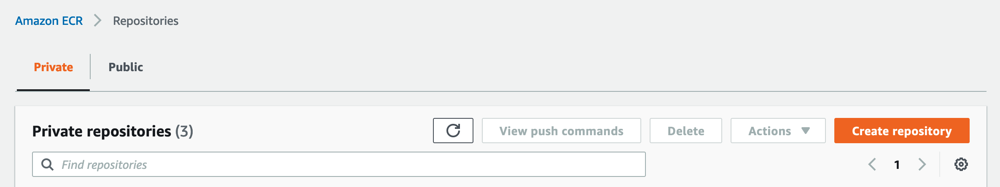

Type `javaee-app1` as the name of this repository and use default config for other parameters.

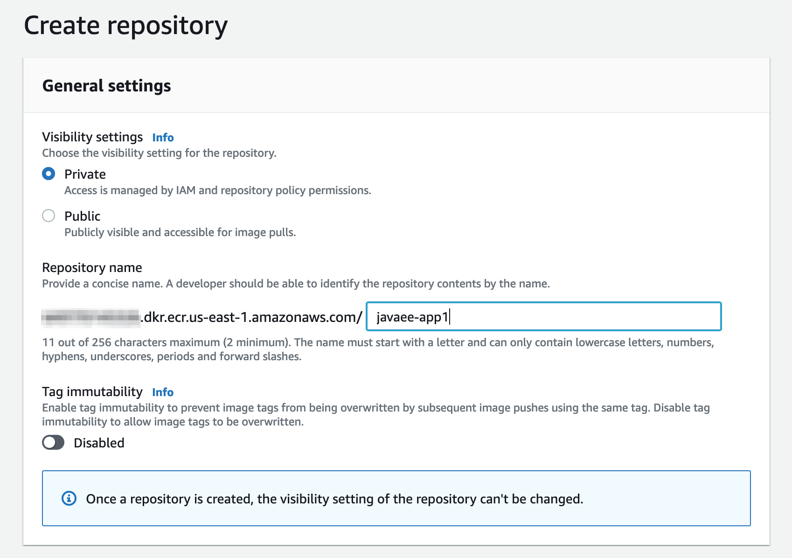

Now that you can see it listed, select the repository link.

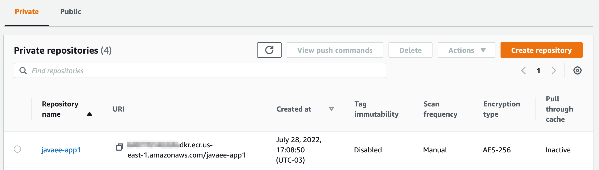

Now select "View push commands".

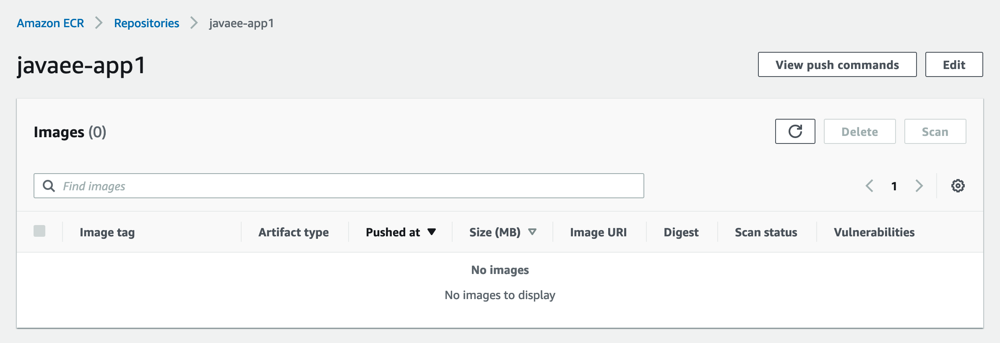

Now you can copy it into a notes document to use later.

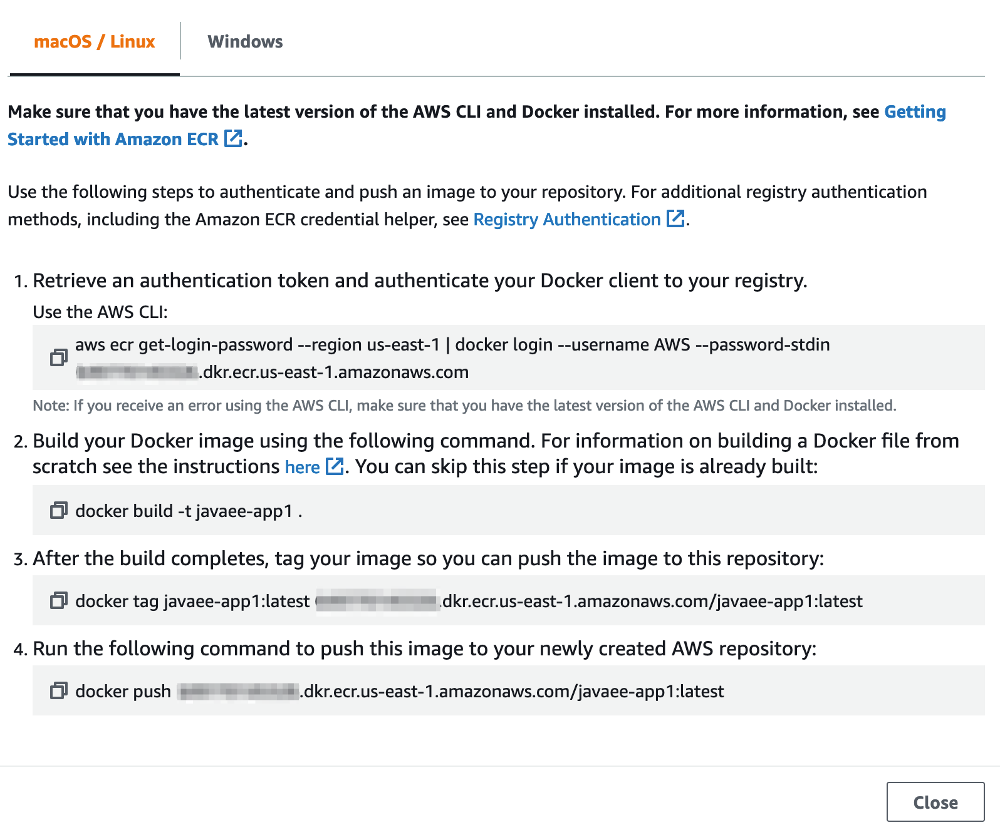

It's all good with ECR, so we can push our image in this private repository!

## 7. Tag and Push Image to ECR

Retrieve a token to authentic your Docker client to our registry, which is the first command that you copied from the console:

```bash
aws ecr get-login-password --region us-east-1 | docker login --username AWS --password-stdin 649770145326.dkr.ecr.us-east-1.amazonaws.com
```

We already built our image previously. Now we just need to tag it:

```bash
docker tag javaee-app1:latest 649770145326.dkr.ecr.us-east-1.amazonaws.com/javaee-app1:latest
```

It's time to push it to Amazon ECR:

```bash
docker push 649770145326.dkr.ecr.us-east-1.amazonaws.com/javaee-app1:latest
```

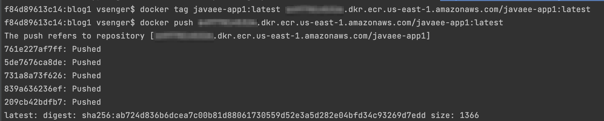

The image should be listed in your ECR console like this:

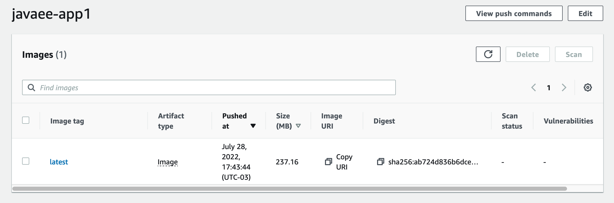

Select the image link to access some required information.

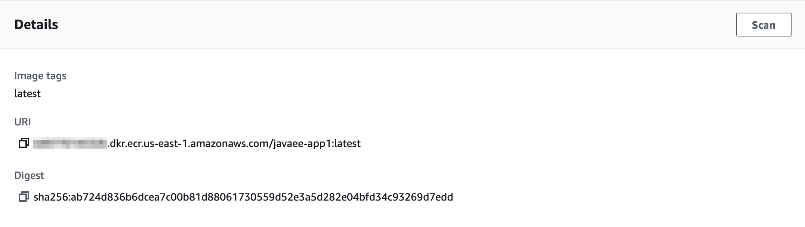

Now that you have URI for your image, copy this information to use in the next step with App Runner.

## 8. Create an App Runner Service Using ECR Image URI

Log into App Runner console and select "Create new service". Paste the Container image URI:
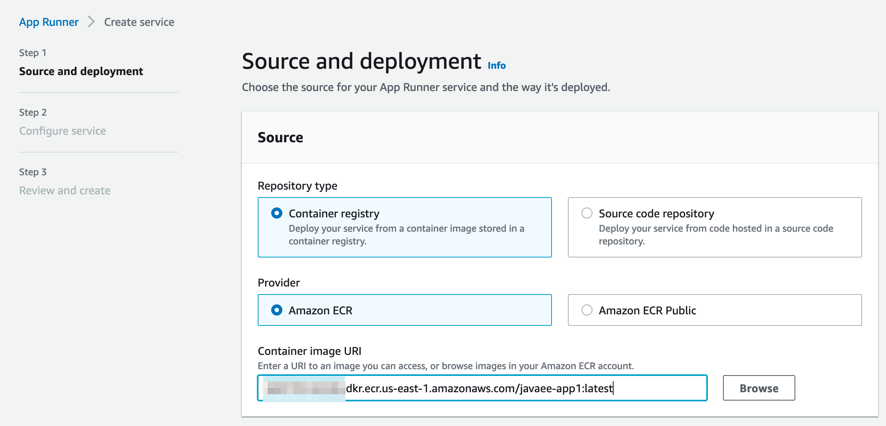

Choose Automatic deployment and ask it to create as new service role.
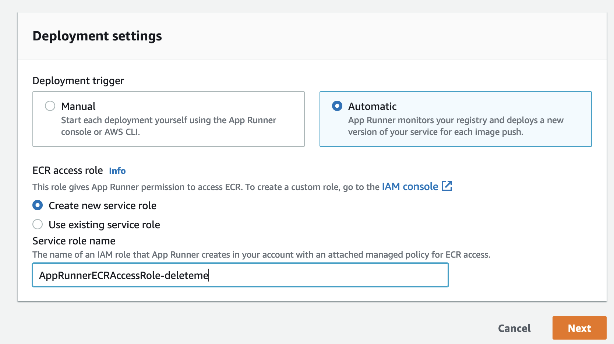

Give a name to your service and use default parameters -- or customize it for your workload.
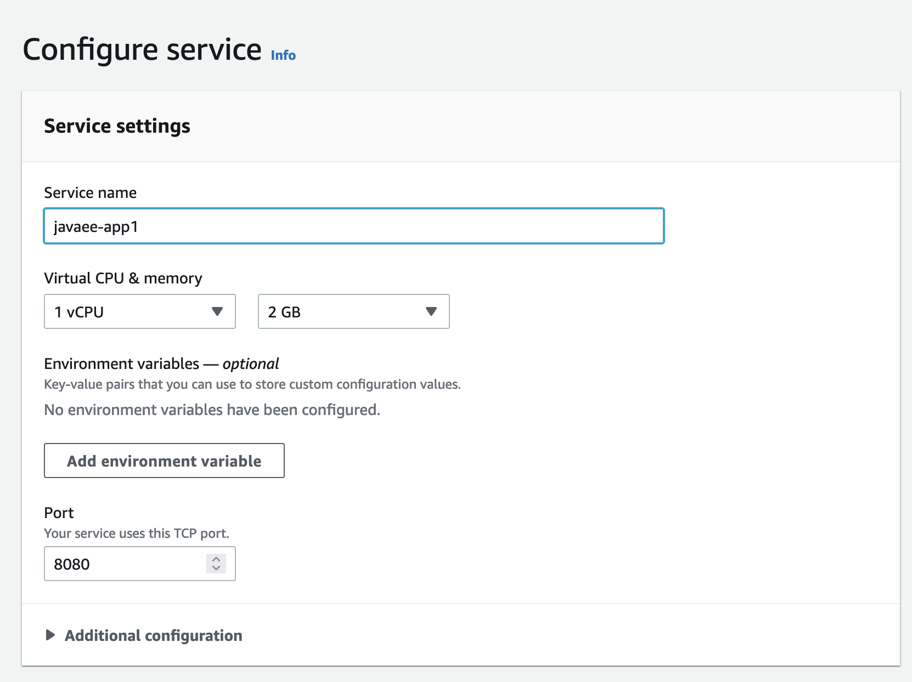

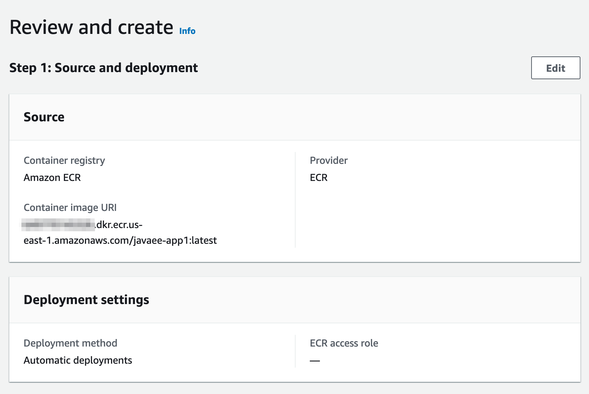

Select "Create & deploy" and your app will soon be ready!

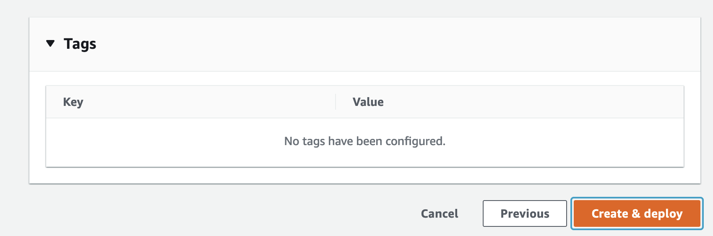

Now we can select the link and access our JBoss Application Server.

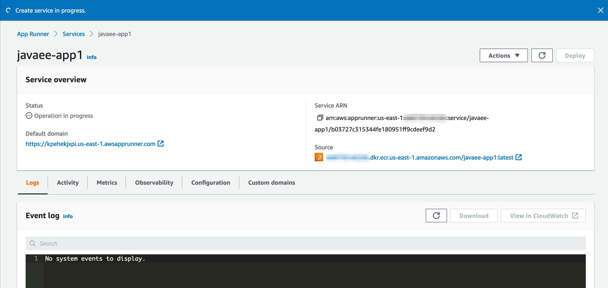

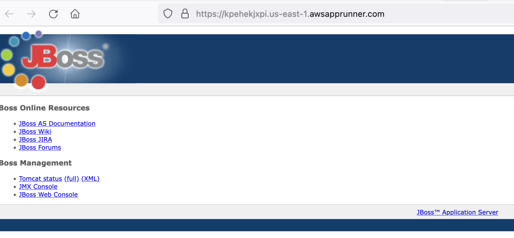

You can change your Java EE App and run docker build, tag and push commands to update your App Runner automatically.

## Summary

Now you have a simple Java EE application built with Docker and running with a public URL! And thanks to containerization, you have more ways to pack your old Java EE application and deploy it as a containerized app.

I hope you enjoyed this tutorial, and please feel free to provide us with any feedback!
