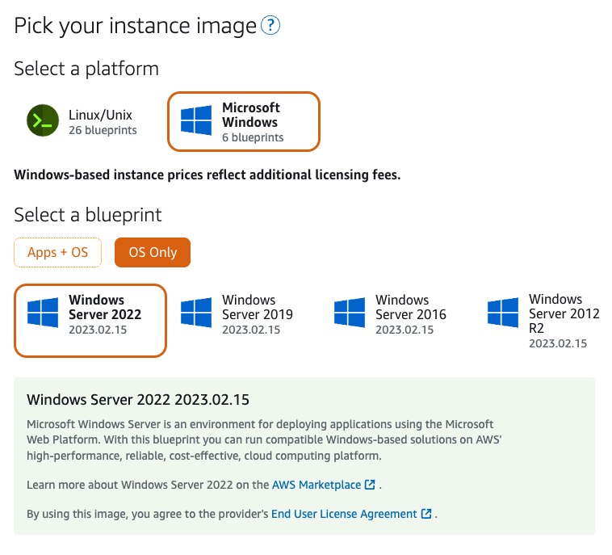
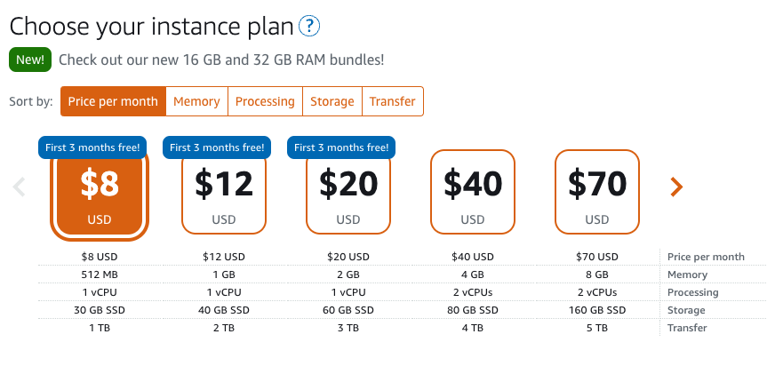
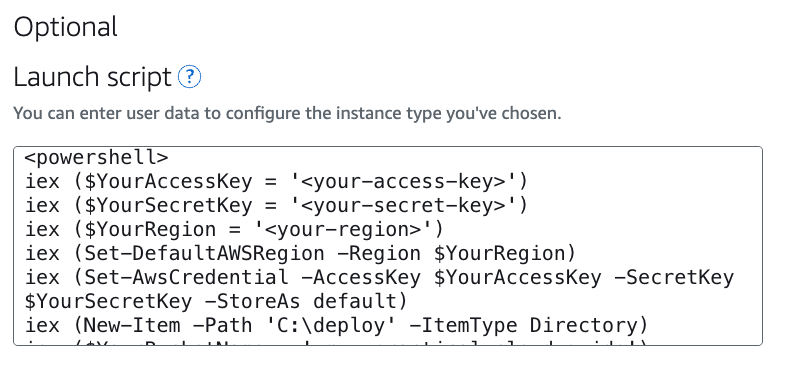
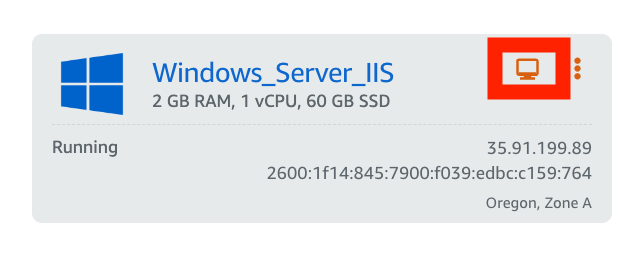
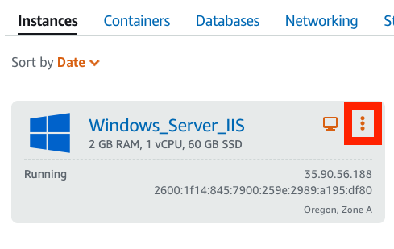
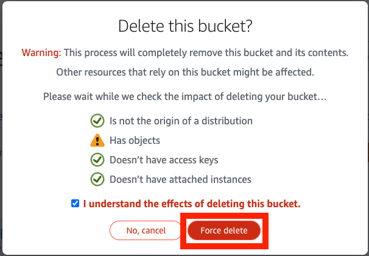

Deploying applications is a fundamental task for IT Pros. The Run in the Cloud stage of the Practical Cloud Guide for IT Professionals uses AWS Lightsail - a managed service for Virtual Private Servers (VPS), containers, databases, storage, and networking. The goal of the Run in the Cloud is to gain experience working in the cloud without building a cloud infrastructure.

## Lightsail Introduction

For this task you will deploy an ASP.NET Core application on IIS in Windows Server. The application is simple web applications but requires installing and configuring IIS in addition to deploying it.

Let’s begin with an AWS Lightsail overview to familiarize working with this service. Note that this is brief introduction to get familiar with the service. If you want to get started on the tutorial, go to [Module 1](#module-1-clone-the-repository-and-compile)

Open the AWS Console in a browser and use the search bar to find AWS Light Sail.


The Lightsail menu displays an option for **Instances**, or Virtual Private Servers. Choose **Instances**, then choose **Create instance**.


**Create an instance** has several options. First, choose the **Instance location**, you can leave the default or choose the closest AWS Region. Second, choose a Windows Server for the VPS. Third, choose an OS only Windows Server blueprint


You can choose the Instance plan. One of the advantages of Lightsail is a fixed monthly cost for a VPS.


This is a brief overview of AWS Lightsail. As we progress through the tasks, we’ll go in depth with Lightsail’s other services.

## Getting started

In this tutorial you will create a Windows Server 2022 instance and deploy a ASP.NET Core application on IIS

| Attributes          |                                        |
| ------------------- | -------------------------------------- |
| ✅ AWS Level | Intermediate - 200 |
| ⏱ Time to complete  | 45 mins |
| 💰 Cost to complete| Free Tier eligible |
|  🧩 Prerequisites | - An AWS account: If you don't have an account, follow the [Setting Up Your AWS Environment](https://aws.amazon.com/getting-started/guides/setup-environment/?sc_channel=el&sc_campaign=tutorial&sc_content=deploy-an-asp-net-core-application-on-windows-server-with-aws-lightsail&sc_geo=mult&sc_country=mult&sc_outcome=acq) tutorial for a quick overview. For a quick overview for creating account follow [Create Your AWS Account](https://aws.amazon.com/getting-started/guides/setup-environment/module-one/?sc_channel=el&sc_campaign=tutorial&sc_content=deploy-an-asp-net-core-application-on-windows-server-with-aws-lightsail&sc_geo=mult&sc_country=mult&sc_outcome=acq).<br>- AWS credentials: Follow the instructions in [Access Your Security Credentials](https://aws.amazon.com/blogs/security/how-to-find-update-access-keys-password-mfa-aws-management-console/#:~:text=Access%20your%20security%20credentials?sc_channel=el&sc_campaign=tutorial&sc_content=deploy-an-asp-net-core-application-on-windows-server-with-aws-lightsail&sc_geo=mult&sc_country=mult&sc_outcome=acq) to get your AWS credentials <br>- A git client: Follow the instructions to [Install Git](https://github.com/git-guides/install-git) for your operating system.<br> - [.NET](https://dotnet.microsoft.com/en-us/download) installed <br>- [Powershell](https://learn.microsoft.com/en-us/powershell/scripting/install/installing-powershell?view=powershell-7.3) for your operating system. |
| 💻 Code Sample         | Code sample used in tutorial on [GitHub](https://github.com/build-on-aws/practical-cloud-guide-code) |
| 📢 Feedback            | <a href="https://pulse.buildon.aws/survey/DEM0H5VW" target="_blank">Any feedback, issues, or just a</a> 👍 / 👎 ?    |
| ⏰ Last Updated     | 2023-06-30  |

| ToC |
|-----|

---

## Overview

In [DevOps](/concepts/devops-essentials), applications are typically built with Continuous Integration (CI) software. Code is pushed into the CI by developers where it is built and tested and released into cloud storage.

This tutorial is based on a scenario where a compiled and packaged application has been pushed into [object storage (AWS S3)](https://aws.amazon.com/what-is/object-storage/?sc_channel=el&sc_campaign=tutorial&sc_content=deploy-an-asp-net-core-application-on-windows-server-with-aws-lightsail&sc_geo=mult&sc_country=mult&sc_outcome=acq) by a CI process. We'll simulate that uploading the application and an IIS configuration script to AWS S3. Note that the configuration script is for deploying and configuring the application on the Windows 2022 server and is not part of a Continuous Delivery (CD) process.

## Module 1: Clone the repository and compile

In this module, the software and deployment script is in a GitHub repository. You will clone the repository to copy the files to your local drive. You will compile the application with [.NET](https://dotnet.microsoft.com/en-us/download) and package it in a zip file.  

### Implementation instructions

Step 1: Clone the `practical-cloud-guide-code` repository. Build and zip the application.

```bash
git clone https://github.com/build-on-aws/practical-cloud-guide-code
```

Step 2: Compile the ASP.NET Core application.

This step compiles the C# code into an executable and creates a `publish` directory.

In Windows, Linux, or macOS:

```powershell
cd ./practical-cloud-guide-code/run-to-build/windows-app-deploy/aspnetcoreapp/
dotnet publish -c release
```

Step 3: Package the application as a zip file.

This step packages all the application files into a zip file that can unloaded to cloud storage and deployed on a Windows server. Note that you must be in the `publish` directory when compressing the application. When the zip file is uncompressed, all the files will be in the root directory of th website.

In Windows or Powershell:

```powershell
cd ./practical-cloud-guide-code/run-to-build/windows-app-deploy/aspnetcoreapp/bin/Release/net6.0/publish
Compress-Archive -Path ./ -DestinationPath ./deploy/app.zip
```

In Linux or macOS:

```bash
cd ./practical-cloud-guide-code/run-to-build/windows-app-deploy/aspnetcoreapp/bin/Release/net6.0/publish
zip ./windows-app-deploy/deploy/app.zip ./*
```

## Module 2: Create an S3 bucket and upload files

The next step is to create an S3 bucket to store the files that can be accessed by a Windows Server.

### Implementation instructions

Step 1: Open the AWS Console and choose Lightsail.


Step 2: Create an S3 bucket

Choose **Storage**.


In the **Create a new bucket** page choose the **5GB storage plan** and give the bucket a unique name, such as `<my>-practical-cloud-guide`. Note that bucket names must be globally unique. Select **Create Bucket**.


You will see a menu page for the `practical-cloud-guide` bucket, choose **Objects**.


The **Object list** displays the objects in the bucket. Choose **Upload** to put the application and deployment file in the bucket.


Choose **File**.


Select `app.zip` and `deploy_iis.ps1` from `./practical-cloud-guide-code/run-to-build/windows-app-deploy
/deploy/` and choose **Open**.


The files will be added to the **Object list**.


## Module 3: Deploy Windows 2022 Server

A common task is to deploy a Windows Server configured with IIS. We will use the AWS Lightsail console to instantiate Windows Server 2000 and configure it to install .NET core and IIS with a Powershell script.

### Implementation instructions

Step 1: Deploy Windows Server 2022

Choose **Create instance**.


Choose **Microsoft Windows**, then choose **Windows Server 2022**.



Choose an instance plan, for this tutorial you can use the smallest plan, but larger plans are more responsive.



Add a script to create a directory and download the application and deploy script. Copy this script into the **Launch script** input box. Replace the values for the access key, security key, and region with your account.

```powershell
<powershell>
iex ($YourAccessKey = '<your-access-key>')
iex ($YourSecretKey = '<your-secret-key>')
iex ($YourRegion = '<your-region>')
iex (Set-DefaultAWSRegion -Region $YourRegion)
iex (Set-AwsCredential -AccessKey $YourAccessKey -SecretKey $YourSecretKey -StoreAs default)
iex (New-Item -Path 'C:\deploy' -ItemType Directory)
iex ($YourBucketName = '<my>-practical-cloud-guide')
iex ($YourAppKey = 'deploy_iis.ps1')
iex (Copy-S3Object -BucketName practical-cloud-guide -Key deploy_iis.ps1 -LocalFoil C:\deploy\deploy_iis.ps1)
iex (Copy-S3Object -BucketName $YourBucketName -Key $YourAppKey -LocalFile C:\deploy\$YourAppKey)
</powershell>
```

> Note: Using access keys is not recommended practice, but for purposes of demonstration access keys are used in this tutorial. The keys will be deleted after the deployment.



Name your instance `Windows_Server_IIS`. Then choose **Create Instance**.

## Module 4: Deploy an ASP.NET Core application

In the previous module, you created a Windows 2022 server with Lightsail. The next step is to provision the server with IIS and deploy a web application written in C#.

This module shows how to install and configure IIS in Windows Server 2022 and deploy a ASP.NET Core application from an S3 bucket with a Powershell Script

### Implementation instructions

Step 1: Deploy IIS and an ASP.NET Core application

The deploy_iis.ps1 Powershell script automates the process of installing IIS and its management tools, configuring a new website, and deploying a ASP.NET Core Razor application. Let's start by logging into the server using the built in Remote Desktop Client (RDP). Choose the computer icon to open the RDP window.



Open a Powershell terminal from the Windows Start menu. Change the directory to `C:\deploy` and use notepad to view the `deploy_iis.ps1` script.

```powershell
cd C:\deploy
notepad.exe ./deploy_iis.ps1
```

Let’s break down the script before running it.

The first part of the script installs IIS and the management tools. To host the ASP.NET Core application, IIS requires ASP.NET Core 6.0 hosting bundle. To learn more about IIS configuration see the IIS documentation. Note that the script sets ProgressPreference to `SilentlyContinue` to prevent cmdlet outputs from writing to the terminal.

```powershell
Set-Variable $global:ProgressPreference SilentlyContinue

# Install IIS
Install-WindowsFeature Web-Server -IncludeManagementTools

# Download and install the ASP.NET Core 6.0 Hosting Bundle
$filein = "https://download.visualstudio.microsoft.com/download/pr/7ab0bc25-5b00-42c3-b7cc-bb8e08f05135/91528a790a28c1f0fe39845decf40e10/dotnet-hosting-6.0.16-win.exe"
Invoke-WebRequest -Uri $filein -OutFile "$(pwd)\dotnet-hosting-6.0.16-win.exe"

Start-Process -FilePath "$(pwd)\dotnet-hosting-6.0.16-win.exe" -Wait -ArgumentList /passive

# Stop and start IIS
net stop was /y
net start w3svc
```

The second part of the script creates an directory for the application. The script downloads `app.zip` from the S3 bucket created earlier and unzips it on the directory.

```powershell
# download and unzip the application
New-Item -Path 'C:\inet\newsite' -ItemType Directory
$YourBucketName = "<my>-practical-cloud-guide"
$AppKey = "app.zip"
$AppFile = "C:\inet\newsite\" + $AppKey
Copy-S3Object -BucketName $YourBucketName -Key $AppKey -LocalFile $AppFile
Expand-Archive $AppFile -DestinationPath "C:\inet\newsite"
```

The third part of the script disables the default IIS website, configures a new ApplicationPool, a website, and deploys the application. If the script runs successfully, it opens Microsoft Edge and displays the application. See the Microsoft documentation for website configuration.

At the end of the script, your AWS credentials are removed. Removing the credentials is a best security practice because the server does not need access to other AWS services or resources. In future tutorials, you will learn how to use the Identity and Access Management (IAM) service to build infrastructure with temporary credentials.

```powershell
# Create application pool
$appPoolName = 'DemoAppPool'
New-WebAppPool -Name $appPoolName -force

# Create website
New-Item IIS:\Sites\DemoSite -physicalPath C:\inet -bindings @{protocol="http";bindingInformation=":8080:"}
Set-ItemProperty IIS:\Sites\DemoSite -name applicationPool -value $appPoolName

# Add application to website
New-Item IIS:\Sites\DemoSite\DemoApp -physicalPath C:\inet\newsite -type Application
Set-ItemProperty IIS:\sites\DemoSite\DemoApp -name applicationPool -value $appPoolName

# start new website
Start-WebAppPool -Name $appPoolName
Start-WebSite -Name "DemoSite"

# Open application on Edge
start microsoft-edge:http://localhost:8080/DemoApp

# delete AWS credentials
Remove-AWSCredentialProfile -Force -ProfileName default
```

Run the script to complete the installation and deployment.

```powershell
C:\deploy\deploy_iis.ps1
```

## Module 4: Clean up

To prevent additional costs, delete the Windows Server 2022. Deleting the S3 bucket is optional. You can keep the S3 bucket to use with other tutorials.

Step 1: Delete Windows Server 2022

Choose **Instances** in the Lightsail Menu and select the three red dots.



Choose **Delete**.


Choose **Yes, delete**.


Step 2: Delete the S3 bucket (Optional)

Choose **Storage** on the Lightsail menu. Select the three vertical dots.


Choose **Delete**.


Choose **Force Delete** to delete the files and the S3 bucket.



## What did you accomplish?

The first cloud resource you created was an S3 bucket to store files that are accessible to cloud services. S3 is an object storage which is different from a file system which supports file read and write. You had to copy files from S3 to the Windows server to work with them.

The second cloud resource you created was a Virtual Private Server running Windows Server 2022. The Lightsail service provisions networking services within AWS that support connecting to other services such as S3. The Windows Server instance includes AWS Tools for Powershell and by adding your credentials, you can access other AWS services.

The `deploy_iis.ps1` Powershell script shows how you can use familiar scripting tools and commands to automate configuring Windows services such as IIS while interacting with AWS resources. Although a simple example, this shows how to script can implement a continuous deployment in a DevOps workflow. In future articles, we will examine how to build a Continuous Integration/Continuous Deployment pipeline to automate the delivery of applications.

## What’s next?

In the next section of the Practical Cloud Guide, you will deploy a Java application on a Linux server with AWS Lightsail - see the link below.

|SeriesToC|
|---------|
