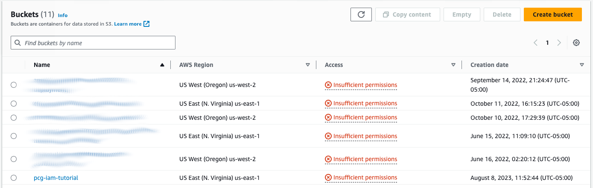

In a [previous article](https://community.aws/tutorials/practical-cloud-guide/manage-security-and-costs-across-the-enterprise-with-aws-organizations?sc_channel=el&sc_campaign=tutorial&sc_content=itpros&sc_geo=mult&sc_country=global&sc_outcome=acq&sc_publisher=amazon_media&sc_category=other&sc_medium=inline), we introduced AWS Organizations, a service to centrally manage billing, services, and resources. The partner to Organizations is AWS Identity and Access Management (IAM), a service for verifying and authorizing members of an Organization. The difference between Organizations and IAM is that Organizations can globally set limits to services and resources and IAM can authenticate an account and set fine grained permissions. In this tutorial, we introduce the Identity and Access Management service. We will create users and groups and demonstrate how to use policies to assign permissions to resources.

## What you will learn

- Best practice for securing your AWS account
- What are AWS Identities and policies
- How to write and apply policies to control access to resources

## Prerequisites

Before starting this tutorial, you will need the following:

| Attributes                |                                   |
| ------------------- | -------------------------------------- |
| ✅ AWS Level        | Intermediate - 200                         |
| ⏱ Time to complete  | 45 minutes                             |
| 💰 Cost to complete | Free when using the AWS Free Tier or USD 1.01      |
| 🧩 Prerequisites    | - [AWS Account](https://aws.amazon.com/resources/create-account/?sc_channel=el&sc_campaign=tutorial&sc_content=itpros&sc_geo=mult&sc_country=global&sc_outcome=acq&sc_publisher=amazon_media&sc_category=other&sc_medium=inline)<br>- [AWS CLI version 2](https://docs.aws.amazon.com/cli/latest/userguide/getting-started-install.html) |
| 📢 Feedback            | <a href="https://pulse.buildon.aws/survey/DEM0H5VW" target="_blank">Any feedback, issues, or just a</a> 👍 / 👎 ?    |
| ⏰ Last Updated     | 2023-08-14                             |

| ToC |
|-----|

This article is an introduction to AWS Identity and Access Management(IAM). Managing access and permissions to AWS services and resources is a complex topic because policies can be created at different organizational levels, they can overlap, and intersect in ways. We’ll start this discussion with best practices for managing administrative accounts and then cover the Identity and Access Management service. Before launching into the tutorial, we will introduce IAM key concepts to establish a baseline of terminology and the relationships between them.

## Best Practice for Securing Accounts

If you’re the administrator or one of several administrators for your organization’s AWS account, you are responsible for managing resources and who has access to them. A top priority for any administrator is ensure accounts are secure by implementing best practices for your organization. You should implement the following actions for account users to minimize data breaches and misuse of resources by bad actors. 

1. Share the responsibility. Create an AWS administrator email distribution list with primary and alternate contacts. A group notification removes a single point of failure and adds flexibility to add and remove admins. Additionally, create email lists for operations, security notifications, and billing.
2. The root user of an AWS account has full access to all the services. Protect this account by restricting the use of the root user by creating IAM identities.
3. Use federated identities when possible. Manage user accounts with a central identity provider such as Active Directory, Okta, or AWS IAM Identity center. If your organization doesn’t have a identity provider solution, you can create user accounts directly with IAM but it is not a recommended because each user are assigned long-term credentials that do not expire.
4. Require multi-factor authentication (MFA). These devices respond  to an authentication call to complete sign-in. Use MFA with long-term credentials such as root access or IAM user accounts.
5. Implement a strong password policy that is resistant to brute force or social engineering attacks.
6. Log events using [AWS CloudTrail](https://docs.aws.amazon.com/awscloudtrail/latest/userguide/cloudtrail-create-a-trail-using-the-console-first-time.html?sc_channel=el&sc_campaign=tutorial&sc_content=itpros&sc_geo=mult&sc_country=global&sc_outcome=acq&sc_publisher=amazon_media&sc_category=other&sc_medium=inline) to audit usage.

These are the some of the important best practices for securing AWS accounts. Be sure to check out [AWS Startup Security Baseline](https://docs.aws.amazon.com/prescriptive-guidance/latest/aws-startup-security-baseline/welcome.html?sc_channel=el&sc_campaign=tutorial&sc_content=itpros&sc_geo=mult&sc_country=global&sc_outcome=acq&sc_publisher=amazon_media&sc_category=other&sc_medium=inline) for detailed instructions.

## Identities

Identities provide access to the AWS account and to associated services and resources.  We’ve already talked about the AWS account user has access to all resources. An IAM user, or simply a **user**, is a person or an application that has specific permissions to access resources. Users have long term credentials, such as passwords and access keys, that grant them permanent access to specified resources.

Users can belong to a **group** , which is a logical set of users. For example, you can set up a billing group for your accounting department so they can monitor cost and usage. Groups simplify managing permissions for a set of users.

Roles are identities with specific permissions, but they are not associated with a user. Roles are temporary and can be assumed by a user to perform a task. A common use for roles is cross-account access where another user is given access to resources in your account. For example, you are the database administrator but an engineer on the operations team needs to restore a database from a back up. They can assume a database administrator role with access to backups in an S3 bucket and restore the database with the backup.


The diagram above shows the relationship between groups, users, and roles. **Policies** can be attached to identities. Users can belong to a group and inherit the group policies. Users are considered permanent identities because they have long term credentials in the form of passwords and access keys. In addition, users can assume roles with policies that let them access resources specified by the policy. Roles are temporary and assumed by users to perform specific tasks. This brief overview describes the basic relationships between identities; the User Guide provides an in depth discussion of [IAM Identities (users, user groups, and roles)](https://docs.aws.amazon.com/IAM/latest/UserGuide/id.html?sc_channel=el&sc_campaign=tutorial&sc_content=itpros&sc_geo=mult&sc_country=global&sc_outcome=acq&sc_publisher=amazon_media&sc_category=other&sc_medium=inline).

## IAM Policy Concepts

IAM Policies are documents that specify who, what, and under what conditions resources can be accessed. As with any configuration document, there are specific terms to describe the parts and actions:

- **Sid** - A statement ID is an optional identifier for the policy statement. Sids are descriptive names of a statement written in camel case.
- **Principal** - a principal can be a person or a role that can request an operation on an AWS resource.
- **Authentication** - AWS supports three kinds of authentication that allow principals to work with cloud resources. 
    1. IAM users can authenticate by providing their account ID, a user name, and passwords. In addition, using MFA when signing in is best practice. 
    2. Federated users use an identity provider such as Amazon, Facebook, Google, or Microsoft Active Directory to log into AWS. 
    3. You can login as the root user (not recommended) but you should use multi-factor authentication and temporary credentials to keep your account secure.
- **Request** -  when you use the AWS CLI, AWS Management Console, or AWS API an AWS API call is sent to a service. The API call or request contains actions to be performed against resources. The request context includes: who made the request (the principal), environment data such as an IP address, and resource data such as a tag.
- **Resources** - a resource is an object within a service, for example a bucket is a resource in S3.
- **Actions** - actions are what you can do with a resource and the type of action is defined by a resource. For example, S3 has a ```CreateBucket``` operation.

## Anatomy of a Policy

An IAM policy is an document attached to a resource that defines what a principal can do with that resource. When a request is sent, it is evaluated by the service and determines if the request is allowed or denied. IAM policies are typically JSON documents. Let’s take a look at the syntax of a policy:

```json
{
  "Version": "version"
  "Statement":[{
    "Effect":"effect",
    "Action":"action",
    "Resource":"arn",
    "Condition":{
      "condition":{
        "key":"value"
        }
      }
    }
  ]
}
```

A policy can contain one or more statements. A statement contains:

- **Effect** - An effect is either and **Allow** or **Deny**. All requests are denied by default, which is overridden by an explicit allow. Conversely, and explicit deny overrides any allows.
- **Action** - An action is specific to a service. The effect allows or denies and action.
- **Resource** - A resource is an object in a service. Sending a request specifies an action applied to a resource.
- **Condition** - A condition is optional. It can trigger an effect based on a value. AWS defines several general conditions and services have defined conditions.

Let’s examine a policy restricting an S3 bucket to specific user.

```json
{
    "Version": "2012-10-17",
    "Statement": [
        {
            "Sid": "AllowRootAndHomeListingOfCompanyBucket",
            "Principal": {
                "AWS": [
                    "arn:aws:iam::111122223333:user/JohnDoe"
                ]
            },
            "Effect": "Allow",
            "Action": ["s3:ListBucket"],
            "Resource": ["arn:aws:s3:::DOC-EXAMPLE-BUCKET"],
            "Condition": {
                "StringEquals": {
                    "s3:prefix": ["", "home/", "home/JohnDoe"],
                    "s3:delimiter": ["/"]
                }
            }
        },
        {
            "Sid": "AllowListingOfUserFolder",
            "Principal": {
                "AWS": [
                    "arn:aws:iam::111122223333:user/JohnDoe"
                ]
            },
            "Action": ["s3:ListBucket"],
            "Effect": "Allow",
            "Resource": ["arn:aws:s3:::DOC-EXAMPLE-BUCKET"],
            "Condition": {
                "StringLike": {
                    "s3:prefix": ["home/JohnDoe/*"]
                }
            }
        },
        {
            "Sid": "AllowAllS3ActionsInUserFolder",
            "Effect": "Allow",
            "Principal": {
                "AWS": [
                    "arn:aws:iam::111122223333:user/JohnDoe"
                ]
            },
            "Action": ["s3:*"],
            "Resource": ["arn:aws:s3:::DOC-EXAMPLE-BUCKET/home/JohnDoe/*"]
        }
    ]
}
```

This policy contains several statements, but note that they are applied to a specific user (JohnDoe). The first statement allows the Principal to list the buckets in the root and home bucket of the S3 resource. The second statement allows the Principal to list the objects in their home directory, if the path is `home/JohnDoe/*`.

The policy follows the principle of least privilege, i.e., the minimum permission required to complete a task. The first statement allows only listing of buckets for the Principal. The second statement allows only listing the objects in the Principal’s bucket. Finally, the last statement allows the Principal to request any action in their home directory.

## Hands On

Let’s put what we learned into practice by creating IAM users, an S3 bucket as a resource, a group, and policies to control access. Although we can use the AWS console, we'll use the AWS CLI to complete this tutorial so you can see the process directly.

**Step 1**: First we’ll create two IAM users:

```bash
aws iam create-user --user-name yeemin
aws iam create-user --user-name alicia
```

and provide them with access to the AWS Console. For this tutorial, we’ll set a password and not require resetting the password when signing in for the first time. However, it is best practice to require resetting the password when signing in for the first time. Remember that IAM users have permanent credentials.

```bash
aws iam create-login-profile --user-name yeemin --password pcgUser#1 --no-password-reset-required
aws iam create-login-profile --user-name alicia --password pcgUser#2 --no-password-reset-required
```

Next, we’ll create a group and add our users to the group:

```bash
aws iam create-group —group-name pcg-experts
aws iam add-user-to-group --user-name yeemin --group-name pcg-experts
aws iam add-user-to-group --user-name alicia --group-name pcg-experts
```

Our IAM users were created under the master account, and to sign in to the the console we use a URL with the master account id. If you don’t know the account id, you can find it with this command:

```bash
aws sts get-caller-identity

{
"UserId": "AI334FYWB3ZZKE53QA4OP",
"Account": "123456789101",
"Arn": "arn:aws:iam::123456789101:user/default"
}
```

The account ID is 123456789101 and your users can login at an address which takes the form of `https://<account id>.signin.aws.amazon.com/console`, e.g., `https://123456789101.signin.aws.amazon.com/console`.

If you login as either user, you will see that you can't access any resources.

**Step 2**: We’ll need a resource to manage. We’ll create an S3 bucket with several folders containing files. Note that S3 buckets require that you choose unique name, so replace `my-unique-bucket-name` in the command:

```bash
aws s3api create-bucket --bucket my-unique-bucket-name --region us-east-1
```

Next, we’ll create the folders and files locally and put them in a bucket. Make a directory on your computer, go into the directory and run the following commands:

```bash
mkdir Development/ Finance/ Private/
touch ./Development/project1.xls ./Development/project2.xls
touch ./Finance/Tax2023/document1.pdf ./Finance/Tax2023/document2.pdf
touch ./Private/privDoc1.pdf ./Private/privDoc2.pdf
touch s3-info.txt
```

Next, we’ll use the AWS CLI to copy the directories and files to S3 with the `put-object` command, remember to replace `my-unique-bucket-name` with your bucket name:

```bash
aws s3api put-object --bucket my-unique-bucket-name --key Development/project1.xls
aws s3api put-object --bucket my-unique-bucket-name --key Development/project1.xls
aws s3api put-object --bucket my-unique-bucket-name --key Development/project2.xls
aws s3api put-object --bucket my-unique-bucket-name --key Finance/Tax2023/document1.pdf
aws s3api put-object --bucket my-unique-bucket-name --key Finance/Tax2023/document2.pdf
aws s3api put-object --bucket my-unique-bucket-name --key Private/privDoc2.txt
aws s3api put-object --bucket my-unique-bucket-name --key Private/privDoc1.txt
aws s3api put-object --bucket my-unique-bucket-name --key s3-dg.pdf
```

**Step 3**: Now that we have 2 users, a group, and an S3 bucket set up, we can create our first policy. Our first policy allows listing all the buckets at the root of the account:

```json
{
    "Version": "2012-10-17",
    "Statement": [
        {
            "Sid": "AllowGroupToSeeBucketListInTheConsole",
            "Action": ["s3:ListAllMyBuckets"],
            "Effect": "Allow",
            "Resource": ["arn:aws:s3:::*"]
        }
    ]
}
```

Copy the policy into a text editor and save it as `GroupPolicy.json`.  We’ll create the policy first:

```bash
aws iam create-policy --policy-name GroupPolicy --policy-document file://GroupPolicy.json
{
    "Policy": 
    {
        "PolicyName": "GroupPolicy",
        "PolicyId": "ANPA4XYZU3UAF7HXTVH43",
        "Arn": "arn:aws:iam::123456789101:policy/GroupPolicy",
        "Path": "/",
        "DefaultVersionId": "v1",
        "AttachmentCount": 0,
        "PermissionsBoundaryUsageCount": 0,
        "IsAttachable": true,
        "CreateDate": "2023-08-09T01:04:51+00:00",
        "UpdateDate": "2023-08-09T01:04:51+00:00"
    }
}
```

Next, attach the policy to the group:

```bash
aws iam attach-group-policy --policy-arn arn:aws:iam::123456789101:policy/GroupPolicy  --group-name pcg-experts 
```

Let’s test the policy by logging in Yeemin. In a browser, put your sign-in URL in the address bar, .e.g., `https://<account-id>.signin.aws.amazon.com/console`


In the AWS Console, choose S3.


The S3 will display all the buckets that belong to the master account including the bucket we created. Note that the bucket is marked with insufficient permissions, and if you choose the bucket and try to open it you will see the message `Insufficient permissions to list objects`.



**Step 4**: We can update the group policy to let all our users to list the folders and the objects at the root of our bucket. We’ll add this statement to our policy. Note that the `resource` is the bucket we created earlier and we've added a condition to allow listing the objects in the bucket.

```json
{
    "Sid": "AllowRootLevelListingOfBucket",
    "Action": ["s3:ListBucket"],
    "Effect": "Allow",
    "Resource": ["arn:aws:s3:::<my-unique-bucket-name>"],
    "Condition":{ 
        "StringEquals":{
            "s3:prefix":[""], "s3:delimiter":["/"]
            }
    }
}
```

Add the statement to the `GroupPolicy.json` file and save the file. The updated policy looks like this:

```json
{
  "Version": "2012-10-17",                 
  "Statement": [
     {
       "Sid": "AllowGroupToSeeBucketListAndAlsoAllowGetBucketLocationRequiredForListBucket",
       "Action": [ "s3:ListAllMyBuckets", "s3:GetBucketLocation" ],
       "Effect": "Allow",
       "Resource": [ "arn:aws:s3:::*"  ]
     },
     {
       "Sid": "AllowRootLevelListingOfBucket",
       "Action": ["s3:ListBucket"],
       "Effect": "Allow",
       "Resource": ["arn:aws:s3:::<my-unique-bucket-name>"],
       "Condition":{ 
             "StringEquals":{
                    "s3:prefix":[""], "s3:delimiter":["/"]
                           }
                   }
     }
  ] 
}
```

Next, we’ll update the policy and version it. The updated policy will become the default policy and IAM retains the previous version.

```bash
aws iam create-policy-version --policy-arn arn:aws:iam::123456789010:policy/GroupPolicy --policy-document file://GroupPolicy.json --set-as-default
```

Go back to the browser with the S3 console open while logged in as `Yeemin`. You’ll be able to list the folders and objects in the bucket.


Although, anyone in the group can list the contents of the bucket, they cannot list the objects in the folders. In the next section, we’ll define a policy for a user that lets them list, get, and put objects in a folder.

**Step 5**:  Alicia is a developer and needs access to the Development folder as part of her job. For this, we’ll create an [inline policy](https://docs.aws.amazon.com/IAM/latest/UserGuide/access_policies_managed-vs-inline.html#inline-policies?sc_channel=el&sc_campaign=tutorial&sc_content=itpros&sc_geo=mult&sc_country=global&sc_outcome=acq&sc_publisher=amazon_media&sc_category=other&sc_medium=inline). An inline policy is created for a single IAM identity which can be a user, a group, or a role. There is a strict one-to-one relationship between an identity and an inline policy.

Alicia needs to list objects in the bucket and the Development folder. In addition, she must be able to get and put objects (files) in the folder. However, she doesn't need access other folders that are not part of her job. In the policy below, the first statement lets Alicia list the bucket with the Development folder using the S3 prefix `“Development/*”` as a condition. Listing any other folder is not allowed. The second statement enables listing, putting, and getting objects in the Development folder.

Copy and save the policy (remember to replace the bucket name) to `AliciaDevPolicy.json`.

```json
{
     "Version": "2012-10-17",
     "Statement":[
      {
         "Sid":"AllowListBucketIfSpecificPrefixIsIncludedInRequest",
         "Action":["s3:ListBucket"],
         "Effect":"Allow",
         "Resource":["arn:aws:s3:::your-unique-bucket-name"],
         "Condition":{
            "StringLike":{"s3:prefix":["Development/*"]
            }
         }
      },
      {
        "Sid":"AllowUserToReadWriteObjectDataInDevelopmentFolder", 
        "Action":["S3:ListObject","s3:GetObject", "s3:PutObject"],
        "Effect":"Allow",
        "Resource":["arn:aws:s3:::your-unique-bucket-name/Development/*"]
      }
   ]
}
```

Apply the policy to your S3 bucket:

```bash
aws iam put-user-policy --user-name alicia --policy-name AliciaDevPolicy --policy-document file://A1liciaDevPolicy.json
```

As we did previously with Yeemin, sign in Alicia to the AWS Console:


Next, open the S3 console, choose your bucket, then choose the Development folder. The policy lets Alicia list, get, and put files (objects) in the Development folder.


However, if Alicia tries to open the Finance folder, she sees the `Insufficient permissions` message.


## Clean Up

To avoid additional charges from the tutorial, we need to clean up the S3 bucket, users, the group, and policies that we created for this tutorial.

First, we’ll delete the inline policy attached to Alicia:

```bash
aws iam delete-user-policy --user-name alicia --policy-name AliciaDevPolicy
```

Deleting the group policy takes extra steps. First we have to detach the policy from the group. Note that this requires the policy ARN, which takes the form of `arn:aws:iam::<account id>:policy/policy-name`.

```bash
aws iam detach-group-policy --group-name pcg-experts --policy-arn arn:aws:iam::123456789010:policy/GroupPolicy
```

Because we versioned this policy, we must delete the previous versions before deleting the default policy:

```bash
aws iam delete-policy-version --policy-arn arn:aws:iam::837028011264:policy/GroupPolicy --version-id v1
aws iam delete-policy --policy-arn arn:aws:iam::123456789010:policy/GroupPolicy
```

Deleting the users also takes multiple steps. First, we must remove them from the group. The next step is to remove their login profile. The last step is to delete the IAM identity.

```bash
aws iam remove-user-from-group --group-name pcg-experts --user-name yeemin
aws iam remove-user-from-group --group-name pcg-experts --user-name alicia
aws iam delete-login-profile --user-name yeemin
aws iam delete-login-profile --user-name alicia
aws iam delete-user --user-name yeemin
aws iam delete-user --user-name alicia
```

Next we’ll delete the group:

```bash
aws iam delete-group --group-name pcg-experts
```

Finally, delete the S3 bucket. Because we did not enable versioning, we can delete the bucket and its contents with the `—force` parameter. Note that we used the higher level `s3 rb` command to delete the bucket for convenience, `s3api` does not support the `--force` parameter and would require deleting the objects in the bucket.  

```bash
aws s3 rb s3://your-unique-bucket-name —force
```

## Let's Review

We created two types of policies. The first policy was a **Customer Managed policy** applied to a group and by extension, all the members of the group. We used S3 as an example resource but it can be applied to any AWS resource such as EC2, the AWS compute service. This policy is a one-to-many policy, meaning that the policy is applied to multiple IAM identities. Any of our users can list the buckets at the root account and the contents in the root of the S3 bucket we created.

The second policy is an **inline policy** which is a one-to-one relationship between a policy and an IAM identity. In our example, we attached a policy to a IAM user (Alicia) so she could access a folder. Note that an IAM identity can be a single user, a group, or a role. If we had several developers we could create a developers group, add the users to the group, and attach the policy to the group with the `attach-group-policy` command. This would allow access to the Developers folder to everyone in that group.

## What's Next

We’ve covered a lot of topics ranging from best practices to securing your AWS account, to identity concepts and how they relate to each other, and we’ve done a deep dive in to the structure of policies. To put the IAM service in context, we completed an exercise for managing group and user access to a resource. However, we did not examine how to use roles and temporary credentials to provide access to resources from one account to another. In an upcoming article we’ll demonstrate how to use [IAM roles](https://docs.aws.amazon.com/IAM/latest/UserGuide/id_roles.html?sc_channel=el&sc_campaign=tutorial&sc_content=itpros&sc_geo=mult&sc_country=global&sc_outcome=acq&sc_publisher=amazon_media&sc_category=other&sc_medium=inline).

Until the next installment of the Practical Cloud Guide, checkout this short [video introduction to AWS Identity and Access Management](https://explore.skillbuilder.aws/learn/course/120/introduction-to-aws-identity-and-access-management-iam?sc_channel=el&sc_campaign=tutorial&sc_content=itpros&sc_geo=mult&sc_country=global&sc_outcome=acq&sc_publisher=amazon_media&sc_category=other&sc_medium=inline) by signing up for [AWS Skill Builder](https://skillbuilder.aws/?sc_channel=el&sc_campaign=tutorial&sc_content=itpros&sc_geo=mult&sc_country=global&sc_outcome=acq&sc_publisher=amazon_media&sc_category=other&sc_medium=inline) for training and certification videos and tutorials; many are available at no cost.
