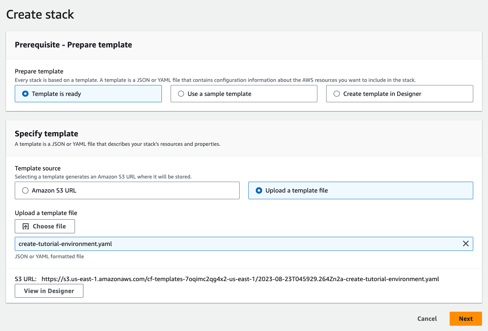
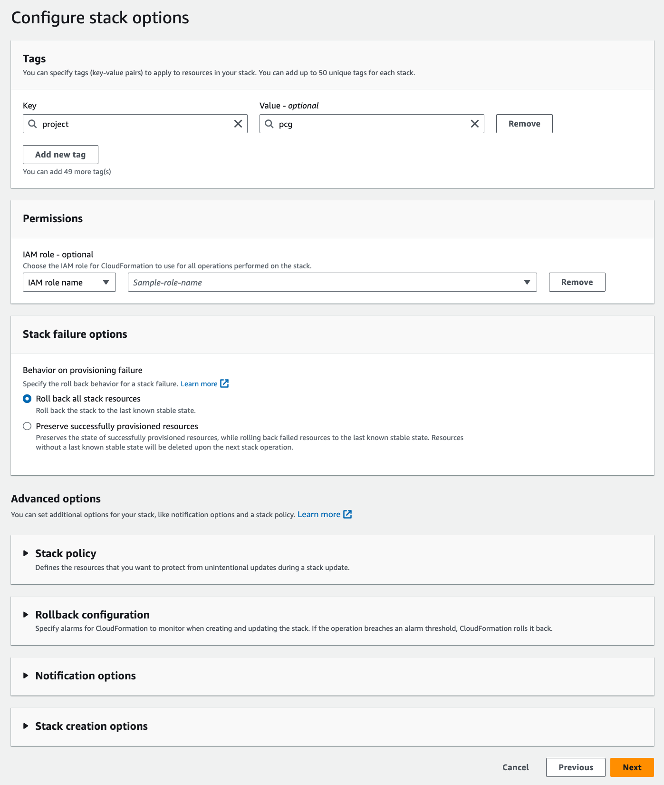
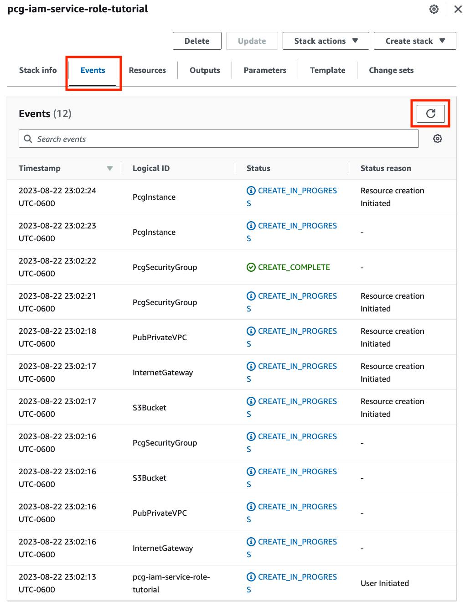
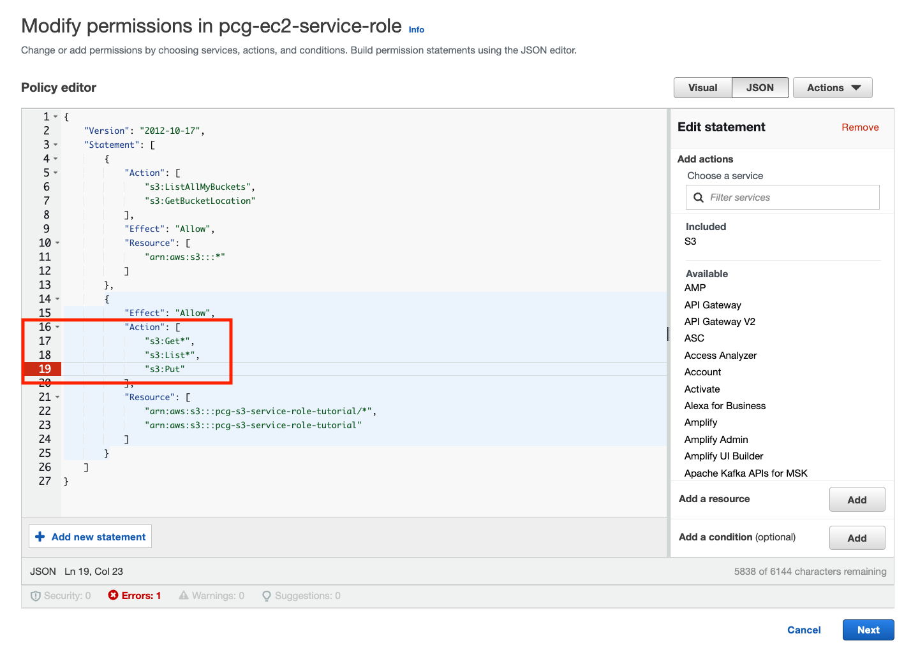

When we access a resource as a user, our credentials such as passwords and access keys are used to confirm that we can use a resource. However, there are instances where we will need to access resources belonging to another user or where a resource has to access another resource. This is accomplished with roles which use temporary credentials to provide access. In this tutorial, we will configure an EC2 instance with a service role to securely access an S3 bucket.

## What You Will Learn

- Create a working environment with Cloudformation
- How to create a role and attach a policy
- How to modify a policy
- How to attach a role to a policy

## Prerequisites

Before starting this tutorial, you will need the following:

| Attributes                |                                   |
| ------------------- | -------------------------------------- |
| ✅ AWS Level        | Intermediate - 200                         |
| ⏱ Time to complete  | 145 minutes                             |
| 💰 Cost to complete | Free when using the AWS Free Tier or USD 1.01      |
| 🧩 Prerequisites    | - An AWS account: If you don't have an account, follow the [Setting Up Your AWS Environment](https://aws.amazon.com/getting-started/guides/setup-environment/?sc_channel=el&sc_campaign=tutorial&sc_content=migrate-a-sql-server-database-in-the-cloud&sc_geo=mult&sc_country=mult&sc_outcome=acq) tutorial for a quick overview. For a quick overview for creating account follow [Create Your AWS Account](https://aws.amazon.com/getting-started/guides/setup-environment/module-one/?sc_channel=el&sc_campaign=tutorial&sc_content=migrate-a-sql-server-database-in-the-cloud&sc_geo=mult&sc_country=mult&sc_outcome=acq).|
| 💻 Code Sample         | Code sample used in tutorial on [GitHub](https://github.com/build-on-aws/practical-cloud-guide-code/tree/main/run-to-build/securely-access-resources-with-service-roles)                             |
| 📢 Feedback            | <a href="https://pulse.buildon.aws/survey/DEM0H5VW" target="_blank">Any feedback, issues, or just a</a> 👍 / 👎 ?    |
| ⏰ Last Updated     | 2023-09-03                            |

| ToC |
|-----|

## Setting Up Our Working Environment

We will create the tutorial environment with AWS Cloudformation, which is a service that creates and configures AWS resources. Cloudformation uses a template that describes all the resources that we want to setup. Our tutorial environment includes a Virtual Private Cloud (VPC), and EC2 Linux server instance, and an S3 bucket. Setting up these resources with either the AWS console or CLI can take time and effort. We will use Cloudformation to create our tutorial environment rapidly and efficient so we can get to the tutorial for managing access to AWS resources.

Let’s start with opening the Cloudformation console.


In Cloudformation, resources built with a template are treated as a logical grouping of services called stacks. Choose **Create stack**.


Download the Cloudformation template [create-tutorial-environment.yaml](https://raw.githubusercontent.com/build-on-aws/practical-cloud-guide-code/main/run-to-build/securely-access-resources-with-service-roles/create-tutorial-environment.yaml). Choose **Upload a template file**, select the **Choose file** button to upload the file, then click **Next**.



In this section, we will name the stack and the S3 bucket which requires a unique name. Choose **Next** to advance to the next screen.

> Tip: Creating a consistent naming scheme can help find and keep track of resources. For example, preface the name with `pcg-`` for "practical cloud guide" and follow it with the name of the service to make it easier to find resources by project.


In the **Configure stack options** screen, we will accept the default values and choose **Next**. You can optionally add tags to the stack to organize your resources which helps when searching for them. Tags have a key and a value that you choose. In the example below, the tag is `project` and the value is `pcg`.



The final create stack screen reviews the options you have chosen such as the stack and bucket name.


Choose **Submit** to create the stack.


The next screen displays the status of the stack we are building. Selecting the **Events** tab shows which the status of the resources. The screen does not refresh automatically, but pressing the refresh button updates the screen.



The stack is ready when the status is **CREATE_COMPLETE**.


With our environment set up, we’re ready to start working with AWS IAM roles. But before we leave Cloudformation, choose the Outputs tab. Make note of the **S3 bucket name** and the **EC2 instance id**. We’ll need those values when creating policies and configuring the EC2 instance.


## Service Roles

AWS Identities provide access to AWS resources. IAM users are identities that are tied to an individual user and have long term credentials in the form of passwords and access keys. IAM roles are another type of identity but have temporary credentials that provide permission to access resources based on an attached policy.


To understand the importance of roles let’s take a look at a scenario where we have an EC2 instance with an application that uses files in an S3 bucket. The application uses the AWS API to copy the files but it needs permission to access the bucket.

If the application were running on a local computer it could use our IAM identity and credentials. However, the application is running on an EC2 instance and you should never leave your credentials on an instance because anyone who can log into the instance would have access to your credentials. This is where service roles come into play. Recall that roles use temporary credentials to complete a task so that your credentials are not exposed.

## Creating Service Roles

Let’s get started by opening the IAM console by searching for the service in the AWS console home screen.


On the left of the IAM console, choose Roles under Access Management.


On the **Roles** page choose **Create role**.


In the next screen, we can select the type of user or service for the role. Because we’re creating a service role, make sure that **AWS Service** is selected. We need to specify the service and under **Common use cases**, choose EC2 and choose **Next**.


A role is a type of AWS Identity and identities have policies for accessing resources. In the **Add permissions** page, choose **Create policy** to write a policy for the role.


On the following page (**Specify permissions**) we can create the policy by choosing **JSON** as an option. Copy and paste the policy document below into the editor window. Remember the bucket name from the Cloudformation output? Replace the bucket name in the ARNs with the bucket name, then choose **Next**.

```json
{
    "Version": "2012-10-17",
    "Statement": [
        {
        "Action": ["s3:ListAllMyBuckets", "s3:GetBucketLocation"],
        "Effect": "Allow",
        "Resource": ["arn:aws:s3:::"]
        },
        {
            "Effect": "Allow",
            "Action": [
                "s3:Get",
                "s3:List"
            ],
            "Resource": [
                "arn:aws:s3:::bucket-name/",
                "arn:aws:s3:::bucket-name"
            ]
        }
    ]
}
```


We name the policy and review the permissions in the policy in the following screen, and optionally tag the policy. Choose **Create policy** to complete the process.


When complete, the policy is ready and it will be listed on the IAM Policies page.


## Testing the Service Role

Test the service role by connecting to EC2 instance in the stack we created earlier. Like the S3 bucket, we can find the instance id from the Cloudformation output. Navigate to the EC2 Console and select the instance, choose **Connect**.


We’ll use **EC2 Instance Connect** to open a terminal in a browser window. Choose **Connect** to open the terminal.


When the terminal opens it will display a prompt. EC2 instances include the AWS CLI, and we can check the version of the client with the `--version` option.

```bash

       __|  __|_  )
       _|  (     /   Amazon Linux 2 AMI
      ___|\___|___|

https://aws.amazon.com/amazon-linux-2/
4 package(s) needed for security, out of 4 available
Run "sudo yum update" to apply all updates.
[ec2-user@ip-172-31-46-36 ~]$ aws --version
aws-cli/1.18.147 Python/2.7.18 Linux/4.14.320-243.544.amzn2.x86_64 botocore/1.18.6
```

Let’s try to list the S3 bucket.

```bash
[ec2-user@ip-172-31-46-36 ~]$ aws s3 ls s3://pcg-s3-service-role-tutorial
Unable to locate credentials. You can configure credentials by running "aws configure".
```

As expected, the instance doesn’t have permission to access S3. We can fix that by adding the service role to the instance. Go back to the EC2 console and choose the server’s Instance ID to open the summary of details about the instance.


In the summary, we can see that the IAM Role is blank.


We can fix that by choosing **Actions** > **Security** > **Modify IAM Role**.


In the **Modify IAM Role** screen, select the role we created previously, the choose **Update IAM role**.


Let test the role by going back to the terminal and list the contents of the bucket again.

```bash
[ec2-user@ip-172-31-46-36 ~]$ aws s3 ls s3://pcg-s3-service-role-tutorial
[ec2-user@ip-172-31-46-36 ~]$ 
```

No errors! But we haven’t put anything in bucket yet. Let’s try that next by creating a file and copying it to the bucket.

```bash
[ec2-user@ip-172-31-46-36 ~]$ echo "Making roles" > file.txt
[ec2-user@ip-172-31-46-36 ~]$ aws s3 cp file.txt s3://pcg-s3-service-role-tutorial
upload failed: ./file.txt to s3://pcg-s3-service-role-tutorial/file.txt An error occurred (AccessDenied) when calling the PutObject operation: Access Denied
```

The upload failed because our policy only allows listing and getting objects in the bucket. However, we can change that! Open the IAM console and choose **Roles** to open the role menu. We can use the search bar to find our role. Choose the **Role name** to open the **Summary** page for the role.


In the **Permissions policies** section, choose the role under **Policy name** to open the Policy details page.


On the Policy details page go to the **Permissions defined in this policy** section and choose **Edit** to open the policy editor.


In the policy editor, add `"s3:Put"` to the list of actions. This policy change allows the EC2 instance to copy files to the S3 bucket. Choose **Next** to review the changes.



The Review page shows the changes in the policy, notice that Write is now an action. Choose Save Changes to update the policy.


## Test the Updated Service Role

Time to test the updated role by uploading a file.

```bash
[ec2-user@ip-172-31-46-36 ~]$ aws s3 cp file.txt s3://pcg-s3-service-role-tutorial
upload: ./file.txt to s3://pcg-s3-service-role-tutorial/file.txt 
```

No errors, but lets list it to make sure it is in the bucket.

```bash
[ec2-user@ip-172-31-46-36 ~]$ aws s3 ls s3://pcg-s3-service-role-tutorial
2023-08-23 05:34:34         13 file.txt
```

For completeness, we’ll download the file into another directory and display the file contents.

```bash
ec2-user@ip-172-31-46-36 ~]$ mkdir download
[ec2-user@ip-172-31-46-36 ~]$ aws s3 cp s3://pcg-s3-service-role-tutorial/file.txt ./download/
download: s3://pcg-s3-service-role-tutorial/file.txt to download/file.txt
[ec2-user@ip-172-31-46-36 ~]$ cat ./download/file.txt
Making roles
```

The EC2 instance can securely access file from an S3 bucket by using a service role.

## Clean Up

In the Cloudformation console, select and delete the stack.


In the IAM console, select Roles on the side menu, select the role we created, and choose **Delete**.


## What We Did

At the start of this tutorial we set up out environment, however this is not the focus of the tutorial. Cloudformation is a powerful tool  but we will cover it in following articles. The focus of this tutorial how to securely access resources with roles and temporary credentials. We created a role for a service and applied a policy that allowed it to access another resource. In this case, we attached a role to an EC2 instance that let it access an S3 bucket. We also saw that we can edit a role and add an action in this simple example.We could also add other statements, such as providing access to a relational database. The takeaway is to use roles to enable actions without exposing user credentials by placing them in service such as EC2.

## What’s Next

Our next article will cover storage and the different forms of cloud storage. We will examine the primary use cases for different types of storage and how to set them up. In the mean time, you can read about the different types of cloud storage and when to [use them](/concepts/how-to-store-data-in-the-cloud).

If you enjoyed this tutorial, found any issues, or have feedback for us, <a href="https://pulse.buildon.aws/survey/DEM0H5VW" target="_blank">please send it our way!</a>
