## Overview

You can centralize and automate data protection across multiple AWS services using [AWS Backup](https://aws.amazon.com/backup/), a fully managed AWS service.[Amazon DynamoDB](https://aws.amazon.com/dynamodb/) users who need to meet regulatory compliance or business continuity requirements can use AWS Backup to protect the data in their Amazon DynamoDB tables, following a specific frequency and retention period they define. You can use AWS Backup to restore a database table that may have become corrupted through a softwre error or inadvertently deleted by a user. You can also use AWS Backup reporting capabilities to demonstrate compliance by showing proof that you have backed up your databases. After you configure your backup policies and assign Amazon DynamoDB resources to the policies, AWS Backup automates the creation of Amazon DynamoDB on-demand backups and securely stores the backups in an encrypted backup vault that you designate in your backup plan. Following a data-loss event, customers can use AWS Backup to recover their DynamoDB tables.

AWS Backup currently supports DynamoDB on-demand backups but not point-in-time restores for DynamoDB. AWS Backup enhances DynamoDB on-demand backups by enabling you to schedule and to manage the lifecycle of your backups. You can also monitor and audit backups across AWS services, including DynamoDB.

In this tutorial, we provide step-by-step guidance for protecting your DynamoDB tables using AWS Backup. The tutorial should take approximately 30 minutes to complete.

## Prerequisites

As a prerequisites, you should have familiarity with the AWS Console and using the console to launch AWS services.

* An [AWS account](https://docs.aws.amazon.com/aws-backup/latest/devguide/setting-up.html?sc_channel=el&sc_campaign=resiliencewave&sc_geo=mult&sc_country=mult&sc_outcome=acq&sc_content=protect-dynamodb-with-awsbackup?sc_channel=el&sc_campaign=resiliencewave&sc_geo=mult&sc_country=mult&sc_outcome=acq&sc_content=protect-dynamodb-with-awsbackup). For more information on using AWS Backup for the first time, view the [AWS Backup documentation](https://docs.aws.amazon.com/aws-backup/latest/devguide/setting-up.html?sc_channel=el&sc_campaign=resiliencewave&sc_geo=mult&sc_country=mult&sc_outcome=acq&sc_content=protect-dynamodb-with-awsbackup?sc_channel=el&sc_campaign=resiliencewave&sc_geo=mult&sc_country=mult&sc_outcome=acq&sc_content=protect-dynamodb-with-awsbackup). For AWS Backup pricing, refer to the [AWS Backup pricing page](https://aws.amazon.com/backup/pricing?sc_channel=el&sc_campaign=resiliencewave&sc_geo=mult&sc_country=mult&sc_outcome=acq&sc_content=protect-dynamodb-with-awsbackup)
* An Amazon DynamoDB table to protect. For information on how to create the sample table that is used for this tutorial, visit the documentation on [Getting started with Amazon DynamoDB](https://docs.aws.amazon.com/amazondynamodb/latest/developerguide/GettingStartedDynamoDB.html?sc_channel=el&sc_campaign=resiliencewave&sc_geo=mult&sc_country=mult&sc_outcome=acq&sc_content=protect-dynamodb-with-awsbackup).  For DynamoDB pricing, refer to the [DynamoDB pricing page](https://aws.amazon.com/dynamodb/pricing?sc_channel=el&sc_campaign=resiliencewave&sc_geo=mult&sc_country=mult&sc_outcome=acq&sc_content=protect-dynamodb-with-awsbackup). 

## What You Will Accomplish

In this tutorial, you will:

* Create an on-demand backup of an Amazon DynamoDB table, for scenarios where you need to create a standalone, unscheduled backup, with AWS Backup.
* Create a backup plan to automate your backups on a schedule.
* Define resources to be protected by adding them to an existing backup plan using tags.

## Implementation

### Step 1: Go to the AWS Backup Console 

**1.1 — Sign in**

* Log in to the [AWS Management Console](https://console.aws.amazon.com/), and navigate to the AWS Backup console. Confirm that you are configuring AWS Backup in the same Region as your DynamoDB table.

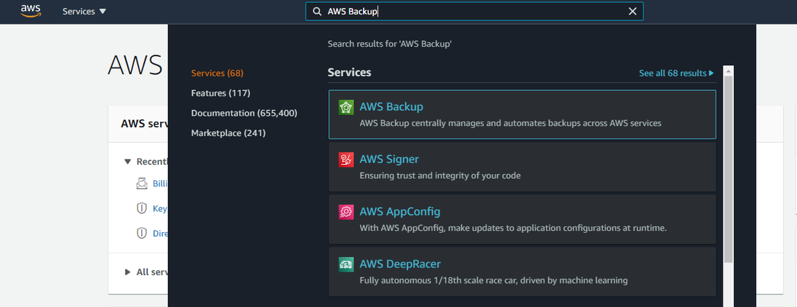

### Step 2: Configure an On-Demand AWS Backup Job of an Amazon DynamoDB Table 

**2.1 Configure the services used with AWS Backup**

* In the navigation pane on the left of the console, choose **Settings**.
* On the **Service opt-in** page, choose the **Configure resources**** **** **button.

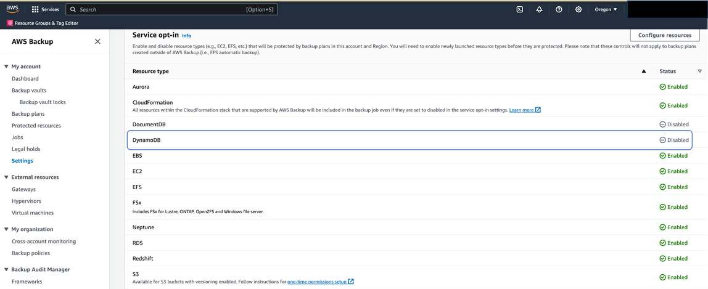

    * On the **Configure resources** page, use the toggle switches to enable or disable the services used with AWS Backup. In this case, enable DynamoDB. Choose **Confirm** when your services are configured. 

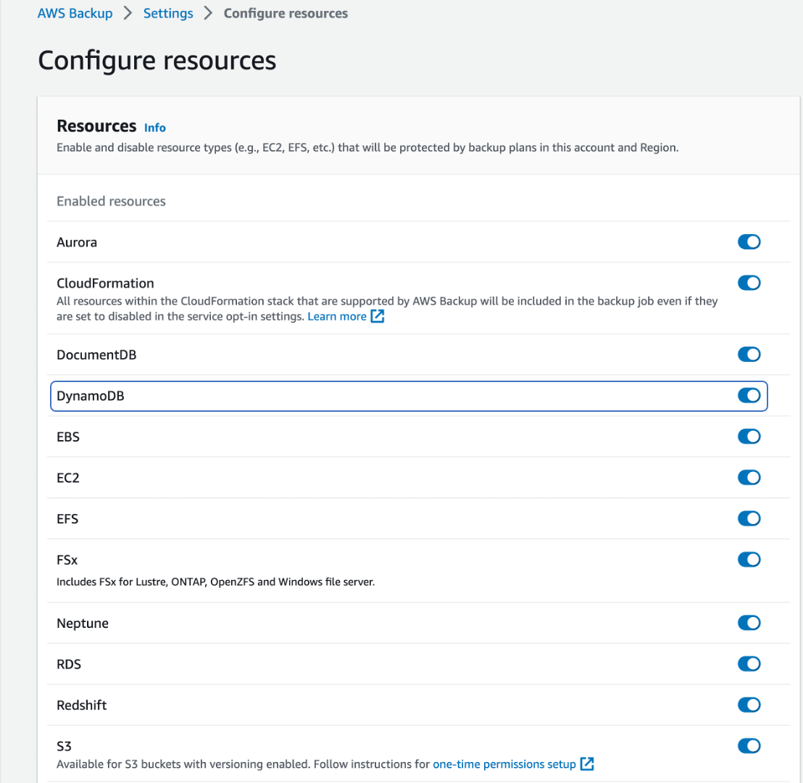

**2.2 Enable Advanced features for Amazon DynamoDB backups**

* Scroll down Setting page to the **Advanced features for Amazon DynamoDB backups** section.
* Confirm that this is Enabled. If Disabled, enable before continuing. To learn more these advanced features, visit the [Advanced DynamoDB backup](https://docs.aws.amazon.com/aws-backup/latest/devguide/advanced-ddb-backup.html?sc_channel=el&sc_campaign=resiliencewave&sc_geo=mult&sc_country=mult&sc_outcome=acq&sc_content=protect-dynamodb-with-awsbackup) page in the AWS Backup documentation.

**2.3 — Create an on-demand backup job of an Amazon DynamoDB table**

* Back in the [AWS Backup console](https://console.aws.amazon.com/backup), under **My account**, select **Protected resources** in the left navigation pane. Then choose the **Create on-demand backup** button.

**Note:** An on-demand backup, in AWS Backup, is a job that you trigger manually instead of scheduling. It can be applied to any resource supported by AWS Backup, including a DynamoDB table. A DynamoDB on-demand backup can be triggered manually (an AWS Backup on-demand backup) or be scheduled via AWS Backup.

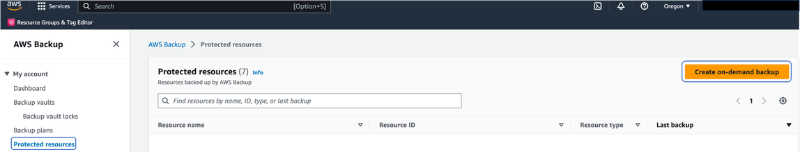

**2.3.1 - Configure on-demand backup job  setting for an Amazon DynamoDB table**

    * On the **Create on-demand backup** page, choose the **Resource type** that you want to back up; choose **DynamoDB, from the list of supported resources,** to back up an Amazon DynamoDB table.
    * Choose the **Table** **name** of the DynamoDB resource that you want to protect.
    * In the **Backup window** section, select **Create backup now**. This initiates a backup immediately and enables you to see your saved resource sooner on the **Protected resources** page. Choosing **Customize Backup Window** can be used if you would prefer to configure the backup job to start at a later time.
    * For **Transition to cold storage,** you can define how long your data will remain on primary storage before transitioning to a lower cost storage tier. For this tutorial, enter 7 days.
    * For **Retention period** select **Days** and enter the number of days you want to retain the backups for. For this tutorial, enter 97 days. Backups can be retained indefinitely in cold storage, with a minimum retention of 90 days. The total retention period is the sum of the time that backups are stored in warm and and cold storage. You can learn more about [AWS Backup lifecycle to cold storage](https://docs.aws.amazon.com/aws-backup/latest/devguide/creating-a-backup-plan.html#plan-options-and-configuration?sc_channel=el&sc_campaign=resiliencewave&sc_geo=mult&sc_country=mult&sc_outcome=acq&sc_content=protect-dynamodb-with-awsbackup) in the AWS Backup documentation.
    * For **Backup vault**, select one of the existing vaults and continue with step 2.3.3, or follow step 2.3.2 to create a new backup vault (which begins with selecting **Create new Backup vault**). You may see a Default Vault in your account, if you have not removed it previously. You can use the Default vault for this tutorial. In practice, we see customers create new backup vaults so they can group backups storage according to their organizational structure. For example, customers may want to store backups from different business units in different vaults. 

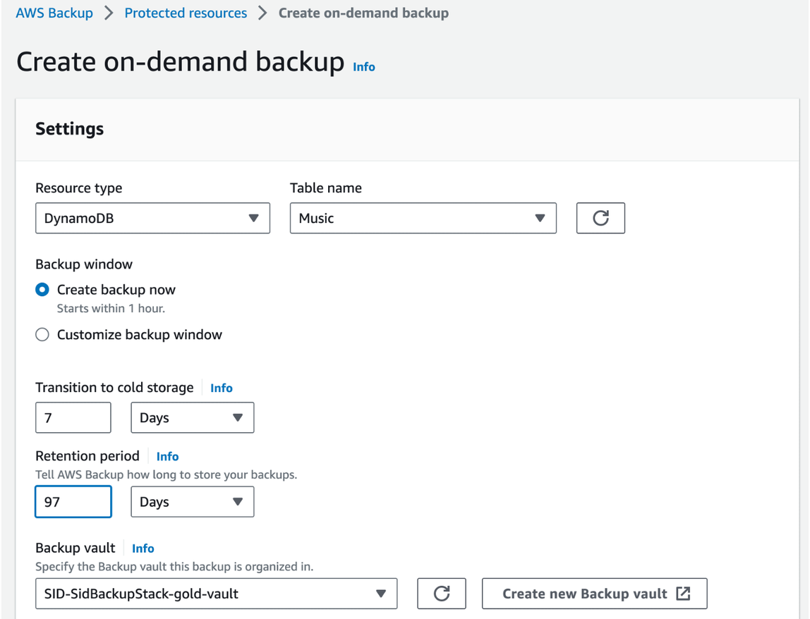

**2.3.2 — Create a new backup vault**
Instead of using the Default vault or another existing vault, you can create a new backup vault.

    * On the **Create on-demand backup** page, choose **Create new Backup vault** This opens a new browser tab with the **Create a backup vault** page.
    * Enter a name for your backup vault. You can name your vault to reflect what you will store in it, which will also make it easier to search for the backups you need. For example, you could name it *WebappBackups.*
    * Select an AWS Key Management Service (AWS KMS) key. You can use either a key that you already created or select the default AWS Backup KMS key.

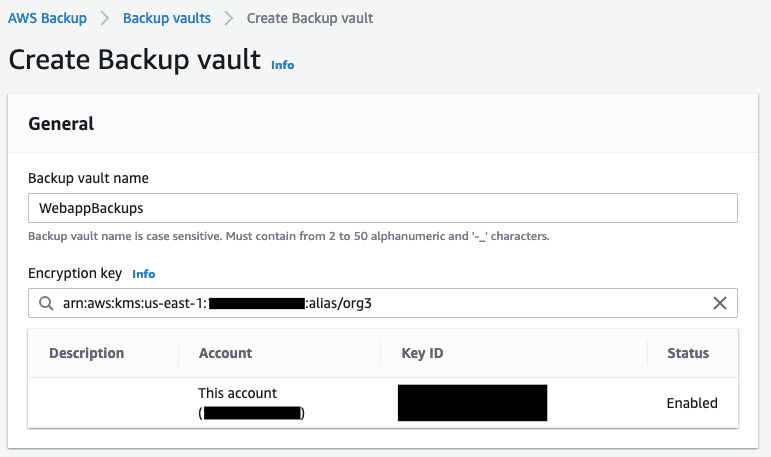

    * Optionally, add tags that will help you search for and identify your backup vault.

    * After adding tags, click on the **Create backup vault** button to finish creating the backup vault. You will be redirected to the details page for the newly created *WebappBackups vault.*

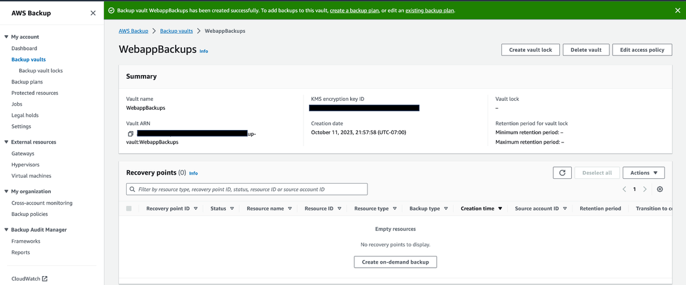

**2.3.3 — Finish configuring on-demand backup job**

    * Close the current browser tab and return to the browser tab with the **Create on-demand backup** page. Select the *WebappBackups* backup vault.

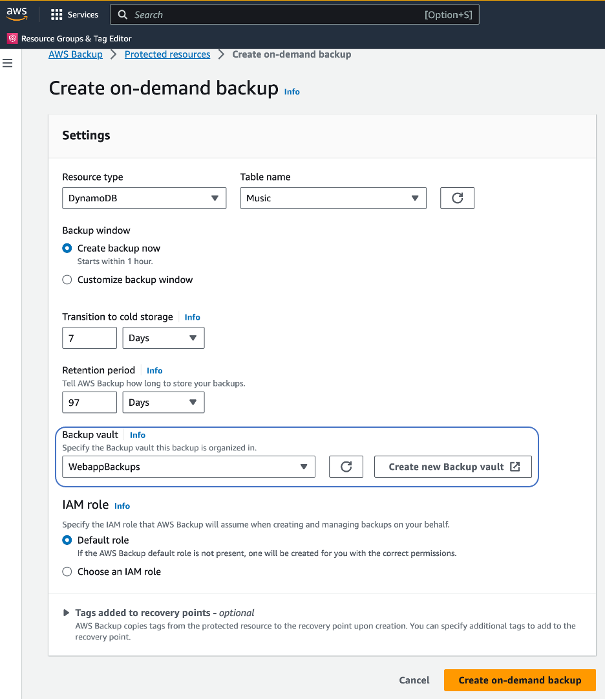

* Choose the **Default role** for the** **** IAM role**, as shown in the screenshot below. If the AWS Backup **Default role** is not present in your account, one will be automatically created for you with the correct permissions.

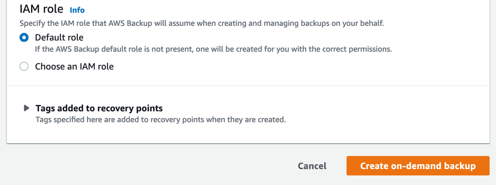

    * Choose the **Create on-demand backup** button. This takes you to the **Jobs** page, where you will see a list of AWS Backup jobs. From here, you will be able to monitor the progress of active backup jobs, as well as recovery and copy jobs. After a few minutes, the status of the backup job you created will change from **Created** to **Completed**. We will look at your recovery points in **step 4**, when we restore our newly created backup.

### Step 3: Configure a Scheduled AWS Backup Job of an Amazon DynamoDB Table 

**3.1 — Configure a backup plan for an Amazon DynamoDB table**

In AWS Backup, a backup plan can be created to schedule and to define how you want to back up supported AWS resources. You can assign resources to backup plans and AWS Backup will automate when those resources are backed up and how their backups are managed. 

* In the [AWS Backup console](https://console.aws.amazon.com/backup), under **My account**, select **Backup plans** in the left navigation pane, and then choose the **Create Backup plan** button.

* AWS Backup provides three options to create a backup plan: In this tutorial, you will build a new plan.
    * **Start with a template -** You can create a new backup plan based on the configurations in an existing plan. Be aware that backup plans created by AWS Backup are based on backup best practices and common backup policy configurations available in the [AWS Backup Developer Guide](https://docs.aws.amazon.com/aws-backup/latest/devguide/about-backup-plans.html). When you select an existing backup plan to start from, the configurations from that backup plan are automatically populated for your new backup plan. You can then change any of these configurations according to your backup requirements.
    * **Build a new plan -** You can create a new backup plan by specifying each of the backup configuration details, as described in the next section. You can choose from the recommended default configurations.
    * **Define a plan using JSON**: You can modify the JSON expression of an existing backup plan or create a new expression.
* Choose **Build a new plan**.
* For **Backup plan name**, You must provide a unique name. If you choose a name that is identical to the name of an existing plan, you will receive an error message. For this tutorial, create a backup plan named *DynamoDB-backup*.

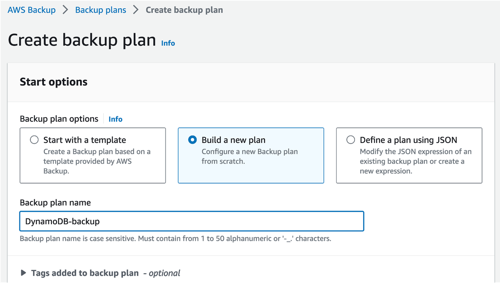

* For **Backup rule name**, enter a descriptive name such as *DynamoDB-dailies*
* For **Backup vault**, select one of the existing vaults or use the *WebappBackups* vault, created previously in Step 2.
* For **Backup Frequency**, choose **Daily**. The backup frequency determines how often a backup is created. You can choose a frequency of every 12 hours, daily, weekly, or monthly. When selecting weekly, you can specify which days of the week you want backups to be taken. When selecting monthly, you can choose a specific day of the month.
* In the **Backup window** section, leave the default **Start time**, **Start within** duration, and the **Complete within** duration.. If you would like to customize the backup frequency and backup window, refer to the [documentation](https://docs.aws.amazon.com/aws-backup/latest/devguide/creating-a-backup-plan.html#plan-options-and-configuration?sc_channel=el&sc_campaign=resiliencewave&sc_geo=mult&sc_country=mult&sc_outcome=acq&sc_content=protect-dynamodb-with-awsbackup) for more information.
* As noted in the console and in the tutorial overview, continuous backups is not supported for DynamoDB, by AWS Backup. So, leave the checkbox empty.

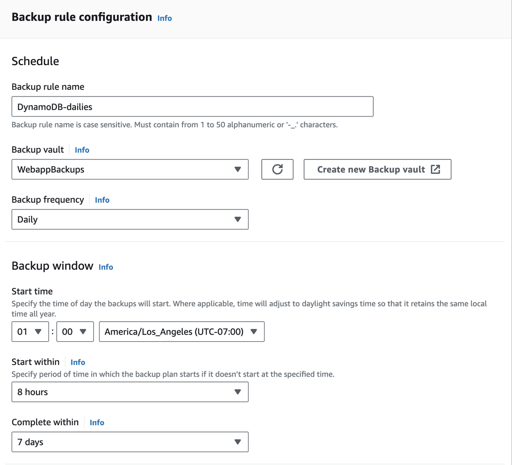

* For **Transition to cold storage,** you can define how long your data will remain on primary storage before transitioning to a lower cost storage tier. In this tutorial, enter 7 days.
* For **Retention period** select **Days** and enter the number of days you want to retain the backups for. In this tutorial, enter 97 days.

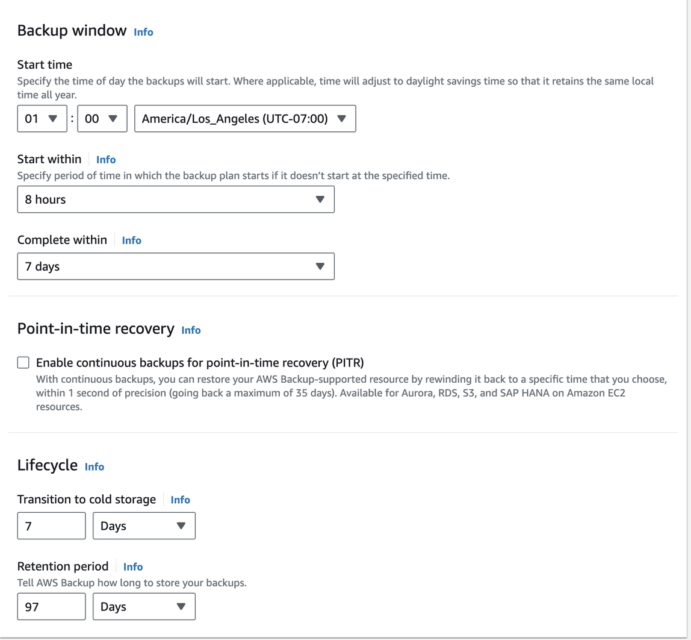

* For **Copy to destination**, leave this unselected, since this tutorial covers backups within the same AWS Region.
* For **Advanced backup settings**, **** leave **Windows VSS** unchecked. This setting enables application-consistent backups for third-party applications that are running on Amazon EC2 instances. You can refer to the [documentation](https://docs.aws.amazon.com/aws-backup/latest/devguide/windows-backups.html?sc_channel=el&sc_campaign=resiliencewave&sc_geo=mult&sc_country=mult&sc_outcome=acq&sc_content=protect-dynamodb-with-awsbackup%20Yesterday%20KH%20Ken%20Hui,%20October%2011,%202023%20at%202:43%20pm%20Ken%20Hui%C2%B728h) for more details.
* Then, choose the **Create plan** button.

**3.2 — Assign resources to the backup plan**
When you assign a resource to a backup plan, that resource is backed up automatically according to the backup plan. The backups for that resource are managed according to the backup plan. You can assign resources using tags or resource IDs. Using tags to assign resources is a simple and scalable way to back up multiple resources.

* Select the created backup plan and choose the **Assign resources **** **button.

* You will be redirected to another window where you can assign resources to your new backup plan. For **Resource assignment name**, enter a name such as *DynamoDB-resources*.
* Choose the **Default role** for the** **** IAM role**, as shown in the screenshot below. If the AWS Backup **Default role** is not present in your account, one will be automatically created for you with the correct permissions.

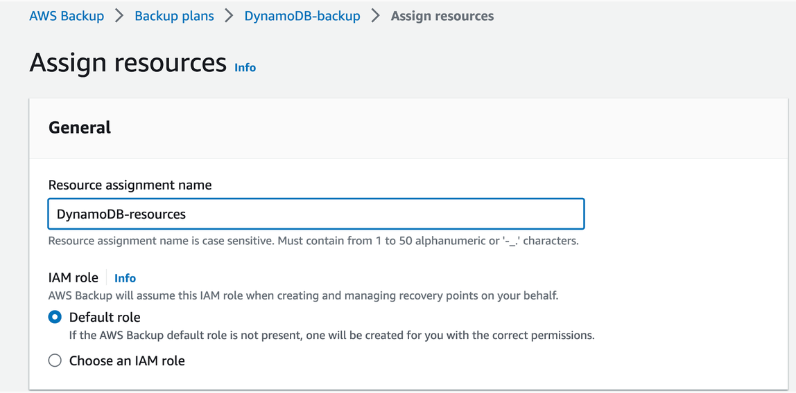

* AWS Backup provides two options for assigning resources to a backup plan. In this tutorial, you will include your DynamoDB table as a specific resource in your new backup plan.
    * **Include all resource types** - This option will select all resources and it can be further refined with key value pair selection in the step below.
    * **Include** **specific resource types** - This option will allow you to select the specific resource types, including DynamoDB, you will want to back up with this backup rule.
* Select **Include specific resource types** and you will be presented with additional options to choose the resource type you want to back up.
* In the **Select specific resource types** section, use the **Select resource types** drop-down list and select **DynamoDB**.
* For **Table names**, use the **choose resources** drop-down list and select **Music**.

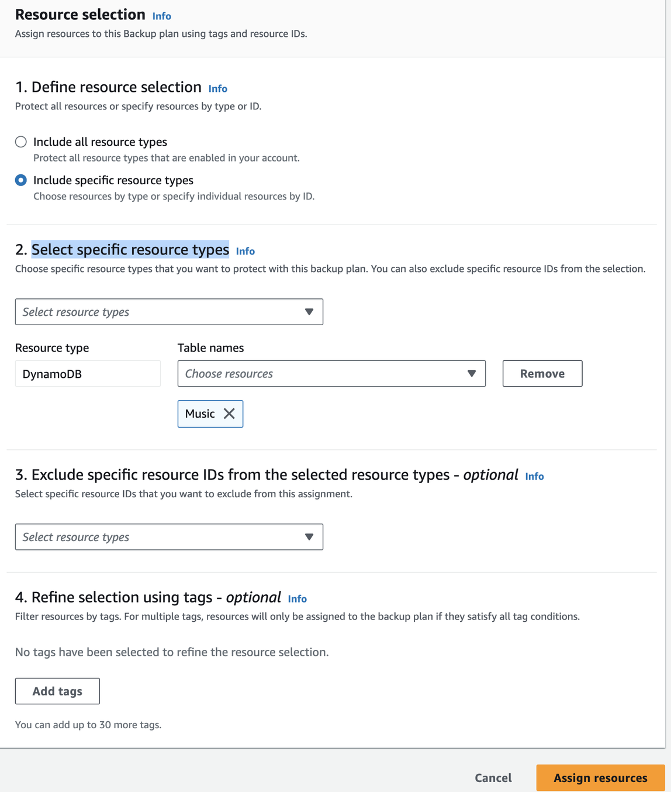

* Skip to the bottom and select the **Assign resources** button. **** The will assign the DynamoDB table, named *Music*, as a resource to the backup plan.
* You will be redirected to another page where you will see the details for your newly created backup plan. You will see your **Backup rules** and **Resource assignments**.

### Step 4: Restore an Amazon DynamoDB Table Using AWS Backup

A backup, or recovery point, represents the content of a resource, such as an Amazon DynamoDB table, at a specified time. *Recovery point* is a term that refers generally to the different backups in AWS services, such as Amazon DynamoDB snapshots. In AWS Backup, recovery points are saved in backup vaults, which you can organize according to your business needs. Each recovery point has a unique ID.

**4.1 — Selecting a recovery point to restore**

* Navigate to the *WebappBackups* backup vault that has been used in this tutorial. Select the latest completed DynamoDB backup by clicking on the recovery point ARN. This will be the on-demand backup recovery point created in Section 2.

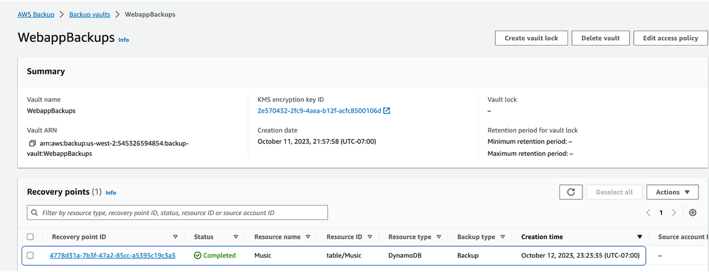

* In the recovery point page, select the **Restore** **** ****button.

]**4.2 — Configuring a restore job**

* The restore of the recovery point ARN will bring you to a **Restore backup** screen that will have the **Original table name**, and other configurations.
    * For **New table name**, enter a name such as DynamoDB-restore.

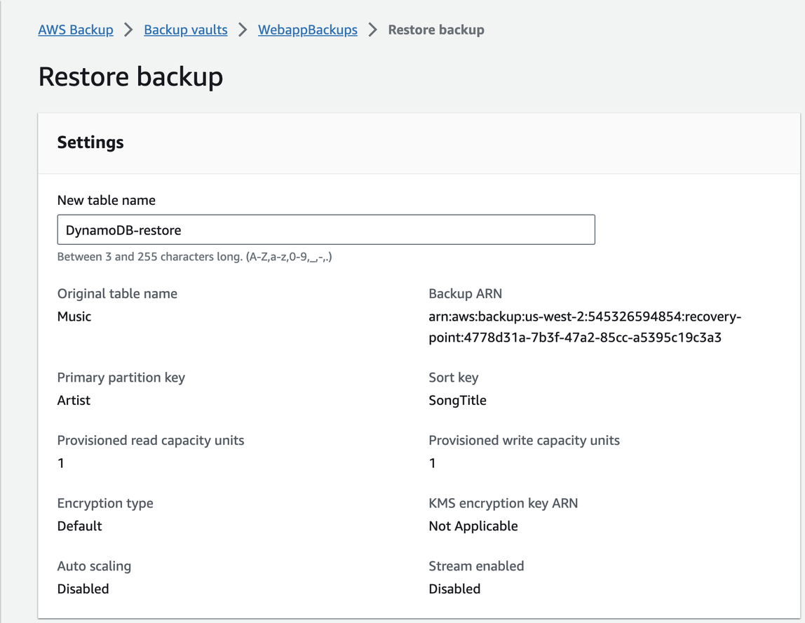

    * For **Encryption key,** choose the A**mazon DynamoDB-owned key**. You also have the option of choosing a different KMS key for encrypting you restored DynamoDB table.
    * Choose the **Default role** for the** **Restore** role**, as shown in the screenshot below. If the AWS Backup **Default role** is not present in your account, one will be automatically created for you with the correct permissions.
    * Verify all your entries, and choose **Restore backup**.

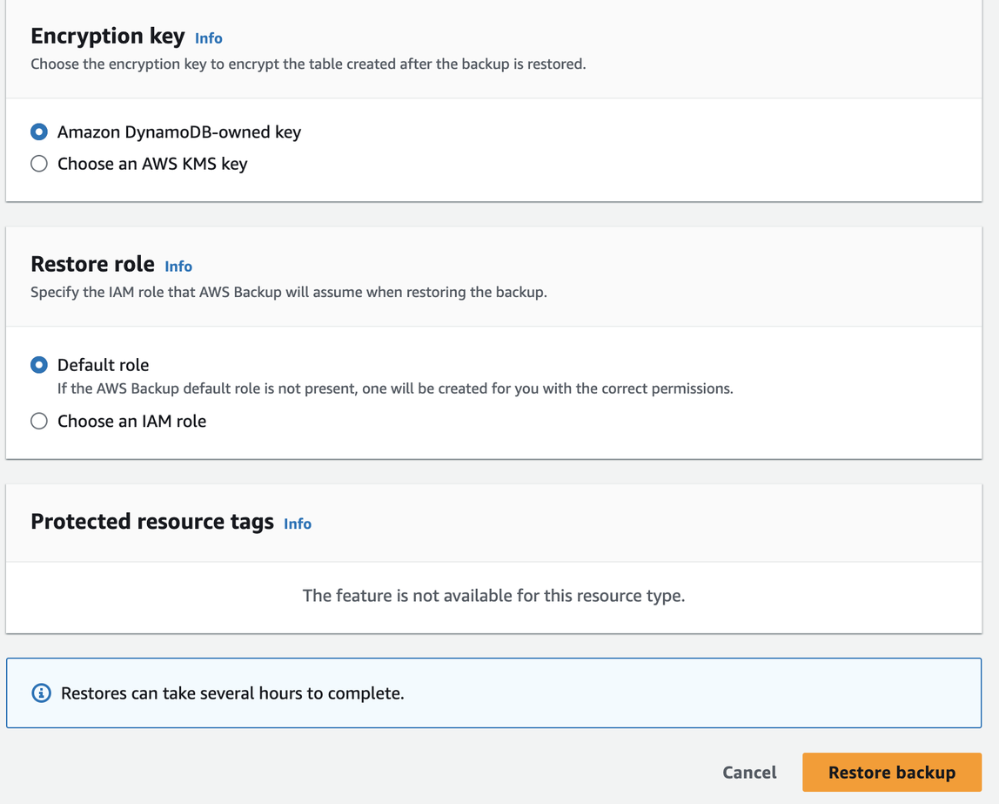

* You will be redirected to the AWS Backup Jobs page, where you can track the progress of your restore job.

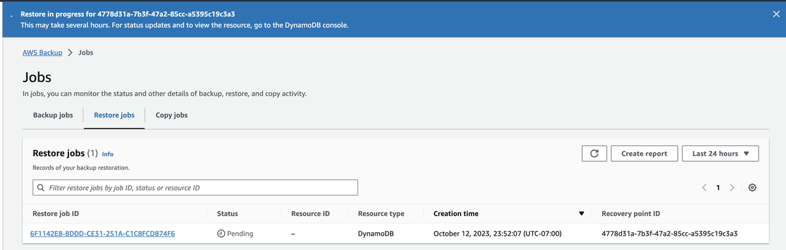

* Once the job status appears as completed, navigate to the Amazon DynamoDB console. Select T**ables** in the left navigation pane to see the restored DynamoDB table. 

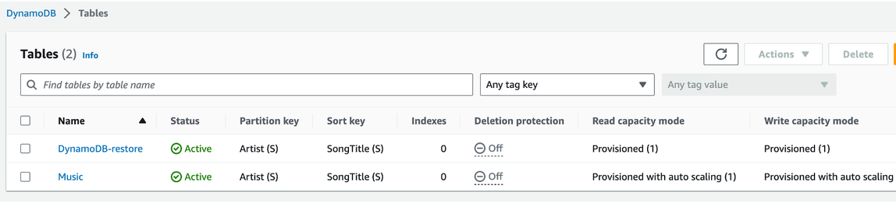

* Open the restored table and confirm that it is identical to original *Music* table.

### Step 5: Clean-Up

In the following steps, you can clean up the resources you created in this tutorial. It is a best practice to delete resources that you are no longer using so that you are not continually charged for them.

**5.1 — Clean up AWS Backup**

* 5.1.1 - Open the AWS Backup console. Navigate to the vault where the recovery point is stored.
* 5.1.2 - Select the recovery point and select **Delete** from the drop-down menu.
* 5.1.3 - Delete the backup vault if no longer needed.
* 5.1.4 - Navigate to the backup plans page.
* 5.1.5 - Navigate to the details page for any recovery point you no longer need.
* 5.1.6 - Delete the resource assignment for the recovery point and then delete the recovery point.

**5.2 — Clean up DynamoDB**

* 5.2.1 — Open the Amazon DynamoDB console.
* 5.2.2 — In the navigation pane on the left, choose T**ables** under **DynamoDB**.
* 5.2.3 — Select the restored DynamoDB table and choose **Delete.** Delete all CloudWatch alarms for the restored table. Confirm the deletion by typing **confirm**.
* 5.2.4 - You can repeat the above steps to delete the *Music* DynamoDB table you backed up, if it is no longer needed.

*Note: This process can take several minutes to complete.*

## Conclusion

Congratulations! In this tutorial, you learned how to protect your DynamoDB table using AWS Backup by creating on-demand and scheduled backups, and restoring your backup to a new table. To learn more about AWS Backup visit the [AWS Storage Blog](https://aws.amazon.com/blogs/storage/category/storage/aws-backup?sc_channel=el&sc_campaign=resiliencewave&sc_geo=mult&sc_country=mult&sc_outcome=acq&sc_content=protect-dynamodb-with-awsbackup). 
