With [AWS Backup](https://aws.amazon.com/backup/), a fully managed and compliance-ready service, you can centralize and automate data protection across AWS services. Using AWS Backup, you can protect key data stores on demand, on a specific schedule by creating a backup plan, and for specific resources by using tags, which help you organize and classify your AWS resources. If you need to meet enterprise governance or industry compliance requirements, you can define backups that follow a specific frequency and retention period. AWS Backup provides unlimited retention options and the ability to create backups as frequently as every hour. You can also use AWS Backup to copy backups across AWS Regions and accounts.

Amazon S3 is natively integrated with AWS Backup, a fully managed, policy-based service that you can use to centrally define backup policies to protect your data in Amazon S3. After you define your backup policies and assign Amazon S3 resources to the policies, AWS Backup automates the creation of Amazon S3 backups and securely stores the backups in an encrypted backup vault that you designate in your backup plan.

When using AWS Backup for Amazon S3, you can perform the following actions:

* Create continuous backups and periodic backups. Continuous backups are useful for point-in-time restore, and periodic backups are useful to meet your long-term data-retention needs.
* Automate backup scheduling and retention by centrally configuring backup policies.
* Restore backups of Amazon S3 data to a point in time that you specify.

In this tutorial, we provide step-by-step guidance for protecting your Amazon S3 buckets using AWS Backup.

## Prerequisites

Before starting this tutorial, you will need the following:

| Attributes                |                                   |
| ------------------- | -------------------------------------- |
| ✅ AWS Level        | Intermediate - 200                         |
| ⏱ Time to complete  | 30 minutes                             |
| 💰 Cost to complete | For Amazon S3 pricing, refer to the [Amazon S3 pricing page](https://aws.amazon.com/s3/pricing/?gclid=CjwKCAiA-vOsBhAAEiwAIWR0TbUvLaxvlh_vYvsHbK5iyvvDgQRYUITRelkedMQihF1pt7NfKhUAlRoCYgIQAvD_BwE&trk=20e04791-939c-4db9-8964-ee54c41bc6ad&sc_channel=ps&ef_id=CjwKCAiA-vOsBhAAEiwAIWR0TbUvLaxvlh_vYvsHbK5iyvvDgQRYUITRelkedMQihF1pt7NfKhUAlRoCYgIQAvD_BwE:G:s&s_kwcid=AL!4422!3!651751060962!e!!g!!amazon%20s3%20pricing!19852662362!145019251177)   For AWS Backup pricing, refer to the [AWS Backup pricing page](https://aws.amazon.com/backup/pricing/)   |
| 🧩 Prerequisites    | An [AWS account](https://docs.aws.amazon.com/aws-backup/latest/devguide/setting-up.html?sc_channel=el&sc_campaign=resiliencewave&sc_geo=mult&sc_country=mult&sc_outcome=acq&sc_content=protect-dynamodb-with-awsbackup?sc_channel=el&sc_campaign=resiliencewave&sc_geo=mult&sc_country=mult&sc_outcome=acq&sc_content=protect-dynamodb-with-awsbackup). For more information on using AWS Backup for the first time, view the [AWS Backup documentation](https://docs.aws.amazon.com/aws-backup/latest/devguide/setting-up.html?sc_channel=el&sc_campaign=resiliencewave&sc_geo=mult&sc_country=mult&sc_outcome=acq&sc_content=protect-dynamodb-with-awsbackup?sc_channel=el&sc_campaign=resiliencewave&sc_geo=mult&sc_country=mult&sc_outcome=acq&sc_content=protect-dynamodb-with-awsbackup). - [An Amazon S3 Bucket to protect. For information on how to create the sample bucket that is used for this tutorial, visit the documentation on [Getting started with Amazon S3](https://docs.aws.amazon.com/AmazonS3/latest/userguide/GetStartedWithS3.html).|                           |
| 📢 Feedback            | <a href="https://pulse.buildon.aws/survey/DEM0H5VW" target="_blank">Any feedback, issues, or just a</a> 👍 / 👎 ?    |
| ⏰ Last Updated     | 2024-1-9                             |

## What You Will Accomplish

In this tutorial, you will:

* Create an on-demand backup of an Amazon S3 bucket, for scenarios where you need to create a standalone, unscheduled backup, with AWS Backup.
* Create a Backup Plan to automate your backups on a schedule.
* Define resources to be protected by adding them to an existing backup plan using tags.

## Implementation

### Step 1: Go to the AWS Backup console 

**1.1 — Sign in**

* Log in to the [AWS Management Console](https://console.aws.amazon.com/), and open the [AWS Backup console](https://console.aws.amazon.com/backup).

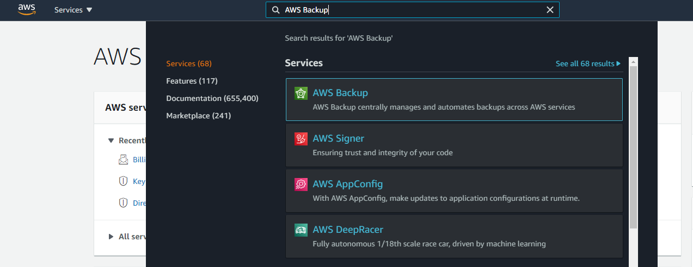

### Step 2: Configure an on-demand AWS Backup job of an Amazon S3 Bucket

**2.1 Configure the services to be used with AWS Backup**

* In the navigation pane on the left of the console, choose **Settings**.
* On the **Service opt-in** page, choose the **Configure resources** button.

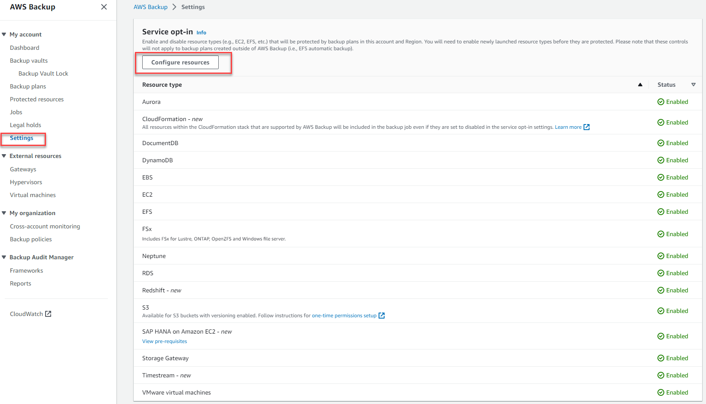

* On the **Configure resources** page, use the toggle switches to enable or disable the services used with AWS Backup. In this case, select **Amazon S3**. Choose **Confirm** when your services are configured. 
* Please note:
  * AWS resources that you're backing up should be in the Region that you're using for this tutorial. Your resources must all be in the same AWS Region. This tutorial uses the US East (N. Virginia) Region (us-east-1).
  * Amazon S3 buckets require versioning to be enabled prior to initiating a backup job, for additional information refer to the Amazon S3 documentation on [versioning for S3 buckets](https://docs.aws.amazon.com/AmazonS3/latest/userguide/manage-versioning-examples.html).
  
**2.2 — Create an on-demand backup job of an Amazon S3 bucket**
Back in the [AWS Backup console](https://console.aws.amazon.com/backup), under **My account**, select **Protected resources** in the left navigation pane. Then choose the **Create on-demand backup** button.

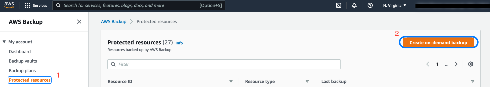

**2.2.1 — Create an on-demand backup job of an Amazon S3 bucket (continued)**

* On the **Create on-demand backup** page, choose the **Resource type** that you want to back up; for example, choose S3 for an Amazon S3 bucket.
  * Choose the bucket name that you want to protect.
  * In the **Backup window** section, select **Create backup now**. This initiates a backup immediately and enables you to see your saved resource sooner on the **Protected resources** page.
  * In the **Retention period** section, select **Days** and enter the number of days you want to retain the backups for. In this example, we selected 7 days.
  * In the **Backup vault** section, select one of the pre-existing vaults and continue with step 2.3, or follow step 2.2.2 to create a new backup vault (which begins with selecting **Create new Backup vault**) before continuing with step 2.3.

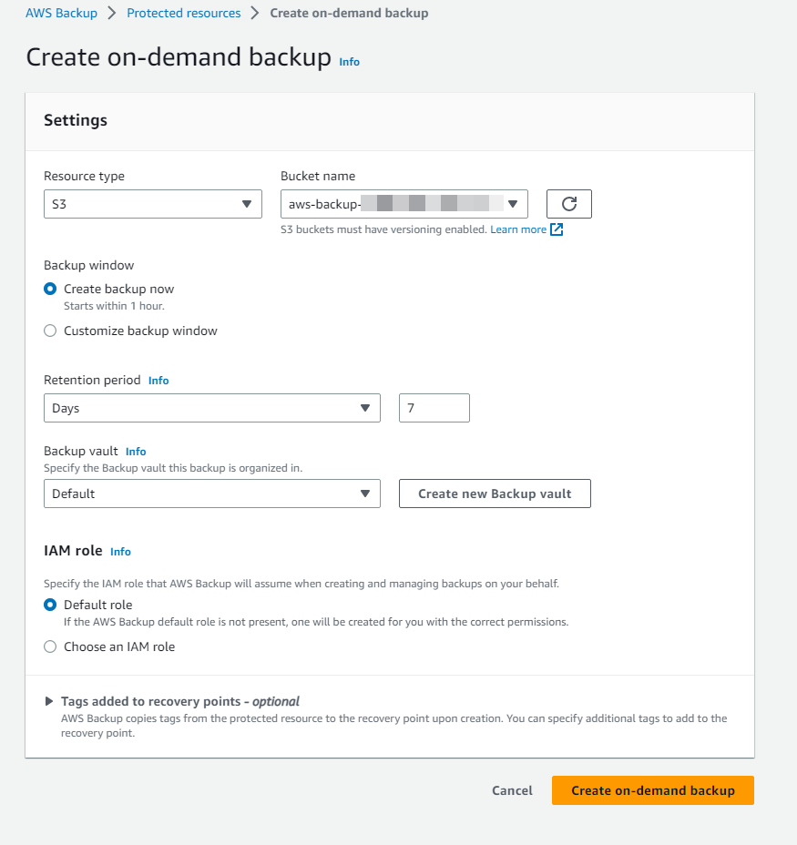

**2.2.2 — Create a backup vault:** Instead of using the default backup vault that is automatically created for you on the AWS Backup console, you can create specific backup vaults to save and organize groups of backups in the same vault. 

* On the **Create on-demand backup** page, choosing **Create new Backup vault** opens a new page to create a vault, and you are returned to the **Create on-demand backup page** after you are finished.

  * You can also go to the AWS Backup console in the navigation pane on the left and select **Backup vaults** and then **Create backup vault** to create a backup vault.

* Enter a name for your backup vault. You can name your vault to reflect what you will store in it, which will also make it easier to search for the backups you need. For example, you could name it *WebappBackups.*
* Select an AWS Key Management Service (AWS KMS) key. You can use either a key that you already created or select the default AWS Backup KMS key.

**2.2.2 — Create a backup vault (continued)**

* Optionally, add tags that will help you search for and identify your backup vault.

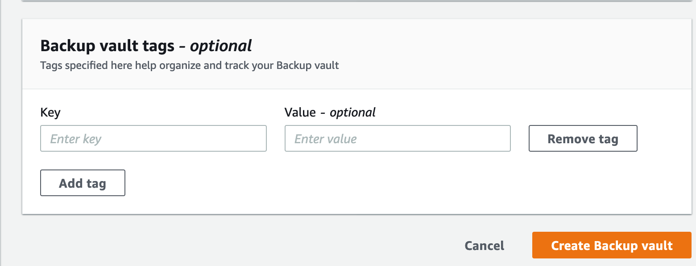

**2.2.2 — Create a backup vault (continued)**

* Back on the **Create on-demand backup** page, after you have selected an existing backup vault or created a new one, choose the **Default role** for the **IAM role**, as shown in the following screenshot, or **Choose an IAM role**.
  * Note: If the AWS Backup **Default role** is not present in your account, one will be created for you with the correct permissions.
* Choose the **Create on-demand backup** button. This takes you to the **Jobs** page, where you will see a list of jobs.

**2.3 — Checking job details**

* In the **Jobs** panel under **My account**, ensure the **Backup jobs** tab is selected. 
* Choose the **Backup job ID** for the resource that you chose to back up to see the details of that job.
* After some time, the **Status** of the backup job will go from **Created** to **Completed**.

### Step 3: Configure an automatic AWS Backup job of an Amazon S3 Bucket

**3.1 — Configure the services to be used with AWS Backup**

* Refer to step 2.1 to enable the Amazon S3 service in AWS Backup

**3.2 — Configure a backup plan for an Amazon S3 Bucket**

* In the [AWS Backup console](https://console.aws.amazon.com/backup), under **My account**, select **Backup plans** in the left navigation pane, and then choose the **Create Backup plan** button.

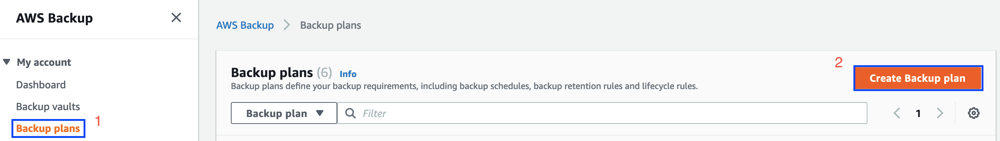

**3.2.1 — Configure a backup plan for an Amazon S3 Bucket (continued)**
* AWS Backup provides three ways to get started using the AWS Backup console:
    * **Start from an existing plan**: You can create a new backup plan based on the configurations in an existing plan. Be aware that backup plans created by AWS Backup are based on backup best practices and common backup policy configurations available in the [AWS Backup Developer Guide](https://docs.aws.amazon.com/aws-backup/latest/devguide/about-backup-plans.html). When you select an existing backup plan to start from, the configurations from that backup plan are automatically populated for your new backup plan. You can then change any of these configurations according to your backup requirements.
    * **Build a new plan from scratch**: You can create a new backup plan by specifying each of the backup configuration details, as described in the next section. You can choose from the recommended default configurations.
    * **Define a plan using JSON**: You can modify the JSON expression of an existing backup plan or create a new expression.
    * **Backup plan name** — You must provide a unique backup plan name. If you try to create a backup plan that is identical to an existing plan, you get an *AlreadyExistsException* error.

In this example we will be building a new plan from scratch.

**3.2.2 — Configure a backup plan for an Amazon S3 Bucket (continued)**
Once the **Build a new plan** option is selected, the following options are presented:

* **Backup rule name** - Backup plans are composed of one or more backup rules. Backup rule names are case sensitive and must contain from 1 to 63 alphanumeric characters or hyphens.
* In the **Backup vault** section, you can select the default vault or one of the pre-existing vaults. Backups created by a backup rule are organized in the backup vault that you specify in the backup rule. You can use backup vaults to set the AWS KMS encryption key that is used to encrypt backups in the backup vault and to control access to the backups in the backup vault. You can also add tags to backup vaults to help you organize them. If you don't want to use the default vault, you can create your own.
* **Create new Backup vault** - Instead of using the default backup vault that is automatically created for you on the AWS Backup console, you can create specific backup vaults to save and organize groups of backups in the same vault.
* In the **Backup Frequency** section, choose **Daily**. The backup frequency determines how often a backup is created. You can choose a frequency of every 12 hours, daily, weekly, or monthly. When selecting weekly, you can specify which days of the week you want backups to be taken. When selecting monthly, you can choose a specific day of the month.
* AWS Backup for Amazon S3 supports **continuous and periodic backups**. Refer to the [AWS Backup for Amazon S3](https://docs.aws.amazon.com/aws-backup/latest/devguide/s3-backups.html) documentation for additional details. By not selecting **Enable continuous backup for point-in-time-recovery (PITR)** the backup created through this plan will be periodic.
* In the **Backup window** section, select **Use backup window defaults**, which initiates the backup job at 5 AM UTC (Coordinated Universal Time) and lasts 8 hours. If you would like to customize the backup frequency, refer to the [documentation](https://docs.aws.amazon.com/aws-backup/latest/devguide/creating-a-backup-plan.html) for more information.
* In the **Transition to cold storage** section, select **Never**.
* In the **Retention period** section, select **Days** and enter *7* as the number of days that you want to retain the backup.

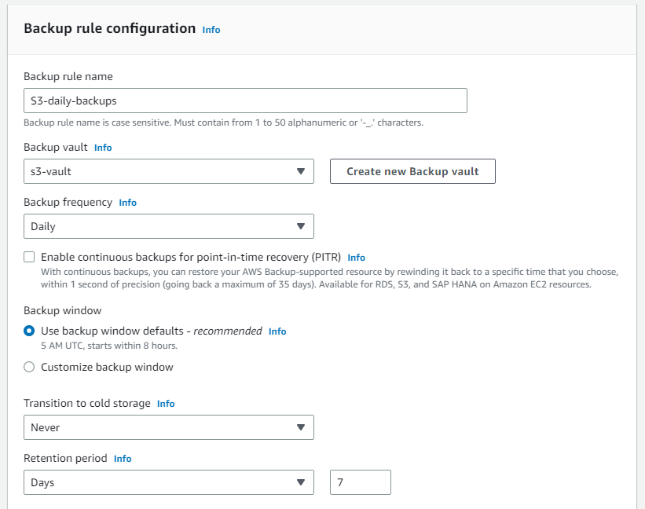

**3.2.3 — Configure a backup plan for an Amazon S3 bucket (continued)**

* In the **Copy to destination** section, leave it as the default, since this tutorial covers backups within the same AWS Region. As part of your backup plan, you can optionally create a backup copy in another AWS Region or AWS Account. Using AWS Backup, you can copy backups to multiple AWS Regions on-demand, or automatically as part of a scheduled backup plan. Cross-region replication is particularly valuable if you have business continuity or compliance requirements to store backups a minimum distance away from your production data. When you define a backup copy, you configure the following options:
  * Destination Region: The destination Region for the backup copy
  * (Advanced Settings) Backup Vault: The destination backup vault for the copy.
  * (Advanced Settings) IAM Role: The IAM role that AWS Backup uses when creating the copy. The role must also have AWS Backup listed as a trusted entity, which enables AWS Backup to assume the role. If you choose **Default** and the AWS Backup default role is not present in your account, a role is created for you with the correct permissions.
  * (Advanced Settings) Lifecycle: Specifies when to expire (delete) the copy.

**Note**: Cross-region copy incurs additional data transfer costs. You can refer to the [AWS Backup pricing page](https://aws.amazon.com/backup/pricing/) for more details.

* **Tags added to recovery points**: The tags that you list here are automatically added to backups when they are created.
* **Advanced backup settings**: Enables application-consistent backups for third-party applications that are running on Amazon EC2 instances. Currently, AWS Backup supports Windows VSS backups. This is only applicable for EC2 instances running SQL Server or Exchange databases. You can refer to the [documentation](https://docs.aws.amazon.com/aws-backup/latest/devguide/windows-backups.html) for more details.
* Then, choose the **Create plan** button. Once the plan is created, tags and resources can be added to the backup plan.

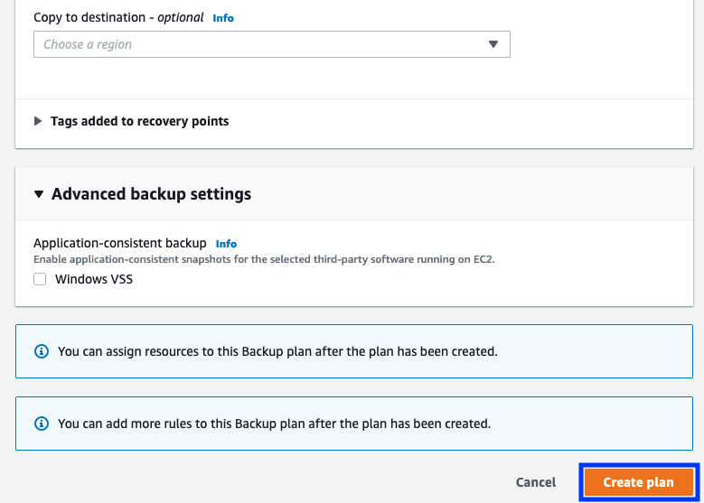

**3.4 — Assign resources to the backup plan**

When you assign a resource to a backup plan, that resource is backed up automatically according to the backup plan. The backups for that resource are managed according to the backup plan. You can assign resources using tags or resource IDs. Using tags to assign resources is a simple and scalable way to back up multiple resources.

* **Resource assignment name**: Provide a resource assignment name.
* **IAM role**: When creating a tag-based backup plan, if you choose a role other than **Default role**, make sure that it has the necessary permissions to back up all tagged resources. AWS Backup tries to process all resources with the selected tags. If it encounters a resource that it doesn't have permission to access, the backup plan fails.

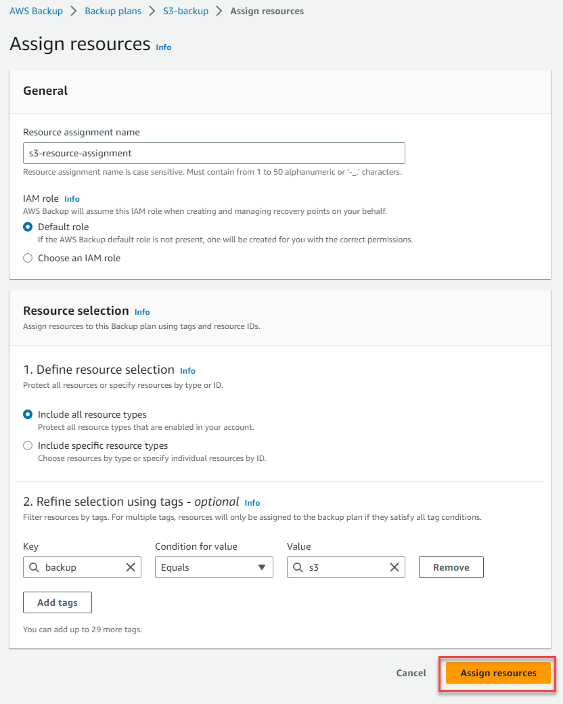

**3.4.2 — Assign resources to the backup plan (continued)**

* **Define resource selection** You can select **Include all resource types**. This option will select all resources and it can be further refined with key value pair selection in the step below.
* **Refine selection using tags** This feature allows you to refine your current selection to include a subset of your resources using tags.
* Select **Assign resources** The backup plan will then have the resources assigned to it.

Navigate to the [AWS Backup console](https://console.aws.amazon.com/backup) and select **Jobs** in the left navigation pane. Once there, you will be able to see your **Backup jobs**.

A backup, or recovery point, represents the content of a resource, such as an Amazon S3 bucket or Amazon RDS database, at a specific point in time. *Recovery point* is a term that refers generally to the different backups in AWS services, such as Amazon EBS snapshots and Amazon RDS backups. In AWS Backup, recovery points are saved in backup vaults, which you can organize according to your business needs. Each recovery point has a unique ID.

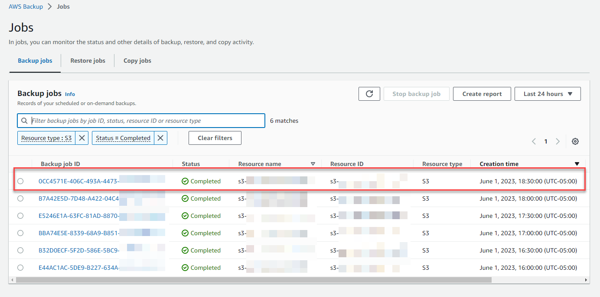

### Step 4: Restore an Amazon S3 Bucket using AWS Backup

**4.1 — Restoring your Amazon S3 Bucket**

* To demonstrate the restore process, identify one or multiple objects in the S3 bucket that was backed up, and delete them. Once you go through the restore steps the objects will be re-created in their original location.
* Navigate to the backup vault that was selected in the backup plan and select the latest completed backup. To restore the S3 bucket, select the recovery point ARN (Amazon Resource Name) and choose the **Restore** button.

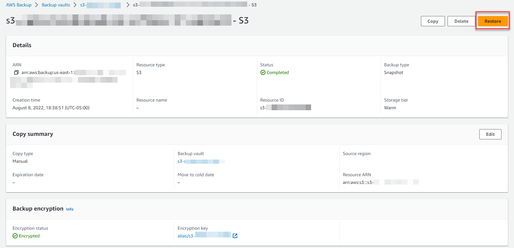

**4.1.1 — Restoring your Amazon S3 bucket (continued)**

* The restore of the ARN will bring you to a **Restore backup** screen that will have the Backup ID, and other configurations.
  * **Restore type** - You can select if the entire bucket of specific items should be restored. In this tutorial we will restore the entire bucket.
  * **Restore destination** - Select if the destination should be the source bucket, an existing one or if you need to create a new bucket.
  * **Restored object encryption** - In this option you can select the encryption key to be used for the restored objects. Select to use the original key, substitute with another one, the Amazon S3 key (SSE-S3), or the AWS KMS key (SSE-KMS).

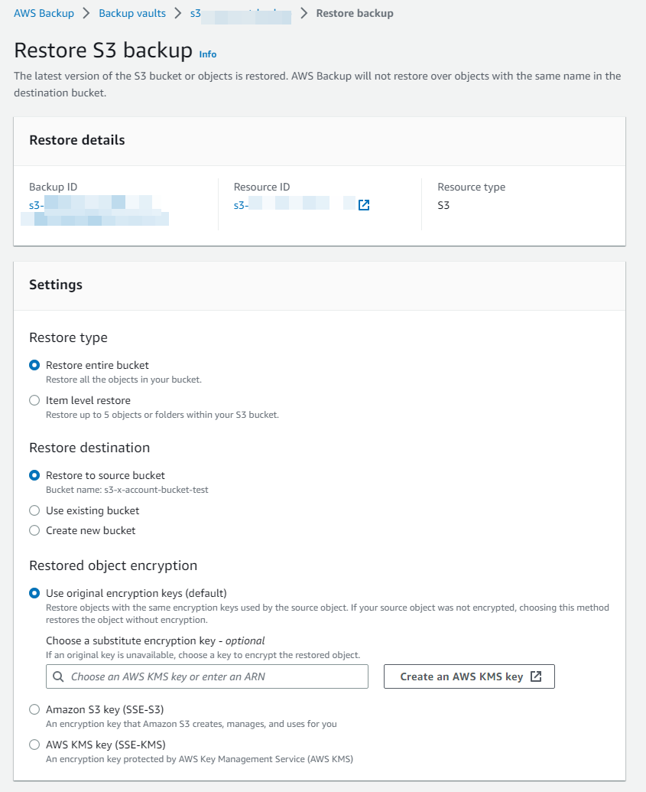

**4.1.2 — Restoring your Amazon S3 Bucket (continued)**

* **Restore role** — Choose the IAM role that AWS Backup will use to create and manage your backups on your behalf. We recommend that you choose the **Default role**. If there is no default role, one is created for you with the correct permissions. You can also provide your IAM role.
* Verify all your entries, and choose **Restore backup**.

**4.1.3 — Restoring your Amazon S3 Bucket (continued)**

* The restored backup job will appear under **Restore jobs** in the [AWS Backup console](https://console.aws.amazon.com/backup).
* Once the job status appears as completed, navigate to the Amazon S3 console, select the bucket that was restored and validate the objects that were deleted in the first step of this section are available again.

### Step 5: Clean up

In the following steps, you clean up the resources you created in this tutorial. It is a best practice to delete instances and resources that you are no longer using so that you are not continually charged for them.

**5 — Delete the S3 backup**

* Open the [AWS Backup console](https://console.aws.amazon.com/backup). Navigate to the vault where the recovery point is stored.
* Select the recovery point and select **Delete**.

*Note: This process can take several seconds to complete.*

### Next steps

Congratulations! In this tutorial, you learned how to protect your Amazon S3 bucket using AWS Backup by creating on-demand and scheduled backups, and restoring deleted objects to the source bucket.
