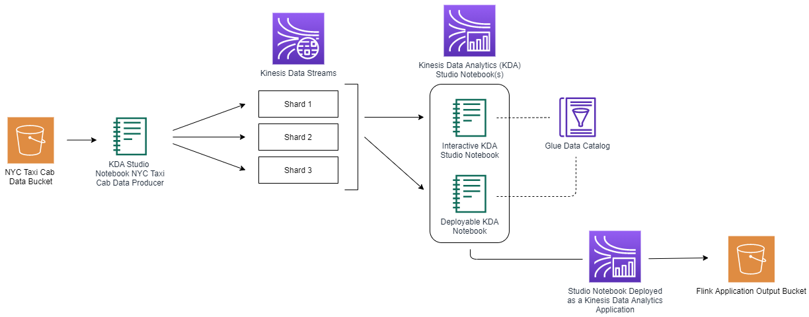
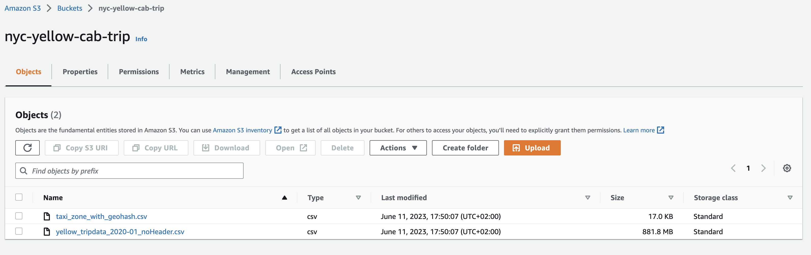
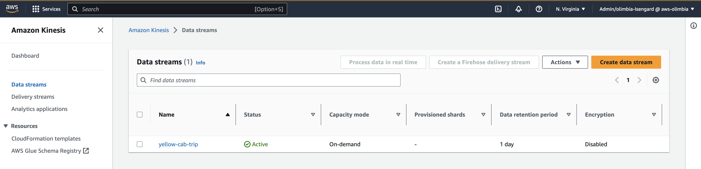
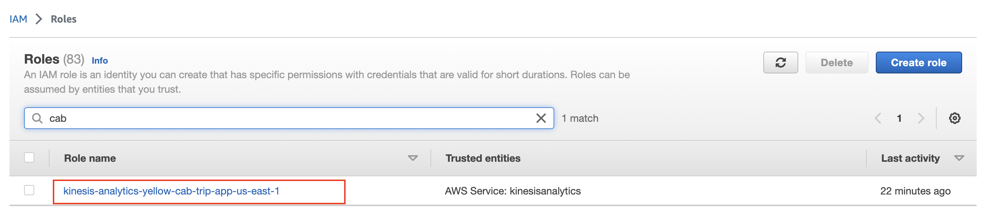
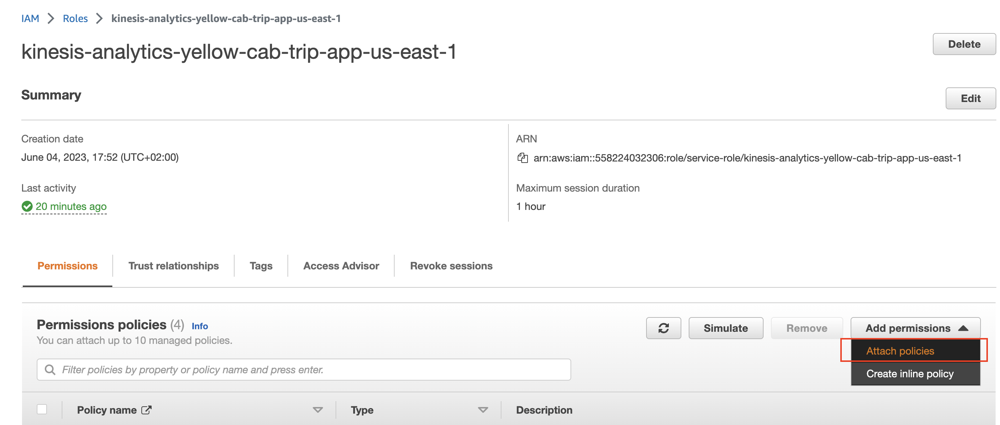
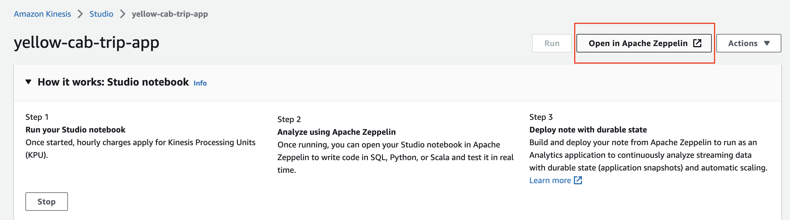
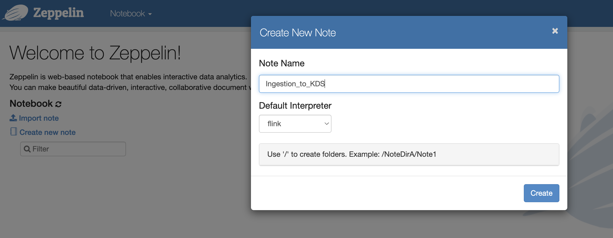
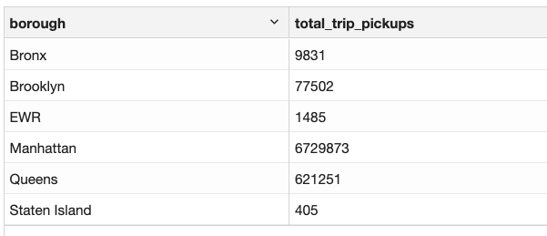
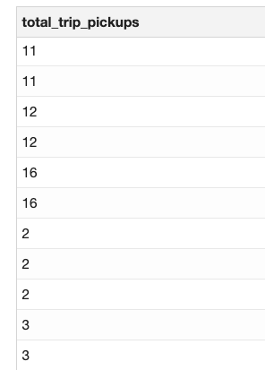

Real-time data analytics allows businesses to stay ahead of their competitors by enabling them to identify emerging trends or changes in customer behavior while also providing them with the ability to monitor critical events in real-time.
Some common use cases for real-time data analytics include:

1. Clickstream analytics to determine customer behavior
2. Analyze real-time events from IoT devices
3. Feed real-time dashboards
4. Trigger real-time notifications and alarms

To perform real-time analytics, a distinct set of tools are necessary for the collection and analysis of streaming data as compared to traditional analytic methods. The required infrastructure entails the selection of a messaging system, such as [Amazon Kinesis Data Streams (KDS)](https://aws.amazon.com/kinesis/data-streams?sc_channel=el&sc_campaign=datamlwave&sc_content=cicdetlsprkaws&sc_geo=mult&sc_country=mult&sc_outcome=acq) or Apache Kafka to support the capture of real-time data, and a real-time processing engine such as Amazon Kinesis Data Analytics or Apache Spark, to enable fast processing and analysis of incoming information.
In this blog post we will ingest data into Kinesis Data Streams and analyze it using Amazon Kinesis Data Analytics for Apache Flink (KDA).

Apache Flink is an open-source stream processing engine that enables businesses to process streams and batch data for analytics, ETL processes, and data pipelines. At the heart of its functioning is a streaming runtime that provides distributed processing and fault tolerance capabilities.
Apache Flink enables developers familiar with SQL to process and analyze streaming data with ease. Flink offers SQL syntax that supports event processing, time windows, and aggregations. This combination makes it a highly effective streaming query engine.

[Amazon Kinesis Data Analytics (KDA)](https://aws.amazon.com/kinesis/data-analytics?sc_channel=el&sc_campaign=datamlwave&sc_content=cicdetlsprkaws&sc_geo=mult&sc_country=mult&sc_outcome=acq) is a fully managed service that allows businesses to analyze real-time streaming data using SQL or programming languages such as Java, Scala, and Python. Running on Apache Flink, Amazon KDA diminishes the complication of building, preserving, and integrating Apache Flink applications with other AWS services.

Performing SQL queries with KDA is possible by utilizing KDA Studio Notebooks. These Notebooks are backed by Apache Zeppelin, allowing you to query data streams interactively in real-time and develop stream processing applications that use common SQL, Python, and Scala. By clicking just a few buttons, you can start a serverless notebook in the AWS Management console to query data streams and receive quick results. These notebooks provide a user-friendly interactive development experience while taking advantage of powerful capabilities powered by Apache Flink.

| Attributes          |                                   |
| ------------------- | -------------------------------------- |
| ✅ AWS Level        | 200                             |
| ⏱ Time to complete  | 45 mins - 60 mins                      |
| 🧩 Prerequisites       | An [AWS Account](https://aws.amazon.com/resources/create-account/?sc_channel=el&sc_campaign=datamlwave&sc_content=cicdetlsprkaws&sc_geo=mult&sc_country=mult&sc_outcome=acq)|
| 🔨 Services used | - Kinesis Data Streams <br> - Kinesis Data Analytics <br> - S3 bucket <br> - Glue Data Catalog |
| ⏰ Last Updated     | 2023-06-29                           |

|ToC|
|--|

## What we’ll learn

1. How to run SQL queries on streaming data with KDA Studio Notebooks
2. How to deploy KDA studio notebook as a long-running KDA application

## What we’ll build



The proposed solution consists of the following elements:

* Our sample data is *NYC Taxi Cab Trips* data set that includes fields capturing pick-up and drop-off dates/times/locations, trip distances and more. This will behave as a streaming data. We are going to enrich this data with a *Taxi Zone Geohash* data provided in another file.
* Ingest the data from S3 to KDS via KDA Studio Notebooks
* Analyze data in KDS with SQL via KDA Studio Notebooks
* Write processed data to S3
* Build and deploy the KDA application

## Walkthrough

### Setting up the environment

#### Create an Amazon S3 bucket and upload the sample data

1. Go to the [S3 Console](https://s3.console.aws.amazon.com/s3/home?sc_channel=el&sc_campaign=datamlwave&sc_content=cicdetlsprkaws&sc_geo=mult&sc_country=mult&sc_outcome=acq)
2. Click on **Create bucket**
3. Enter a name for the bucket
4. Leave all other settings as is and click on **Create bucket**
5. Upload the [*NYC Taxi Cab Trips*](https://sharkech-public.s3.amazonaws.com/flink-on-kda/yellow_tripdata_2020-01_noHeader.csv) file that will represent our stream data and the reference file [*Taxi Zone Geohash*](https://github.com/build-on-aws/real-time-analytics-with-flink-sql/blob/main/dataset/taxi_zone_with_geohash.csv) that enriches the stream data.

Your S3 bucket should look like the following screenshot.



#### Create a Kinesis Data Stream

1. Go to the [Kinesis Console](https://console.aws.amazon.com/kinesis/home?sc_channel=el&sc_campaign=datamlwave&sc_content=cicdetlsprkaws&sc_geo=mult&sc_country=mult&sc_outcome=acq)
2. Under data streams click on **Create data stream**
3. Enter a name for the Kinesis Data Stream *yellow-cab-trip*
4. Leave all other settings as is and click on **Create data stream**



#### Create Kinesis Data Analytics Studio Notebooks

1. Go to the [Kinesis Data Analytics Console](https://console.aws.amazon.com/kinesisanalytics/home?sc_channel=el&sc_campaign=datamlwave&sc_content=cicdetlsprkaws&sc_geo=mult&sc_country=mult&sc_outcome=acq)
2. Click on **Studio**
3. Click on **Create Studio Notebook**
4. Click on **Create with custom settings** under the creation method section
5. Enter a studio notebook name
6. Select **Apache Flink 1.13, Apache Zeppelin 0.9**
7. Click on **Next**
8. Under the IAM role section, select **Create / Update IAM role ... with required policies.** Record the name of the IAM role
9. Under the AWS Glue database, click on **Create**. This will open a new tab/window in your web browser
10. In the new window opened click on **Add database**
11. Enter a database name
12. Click on **Create**
13. Close the browser window and return to the browser window where you were previously configuring the Kinesis Data Analytics studio deployment
14. Under the AWS Glue Database section click on the small refresh button and select the database you just created from the drop down
15. Leave the rest of the settings with the default configurations and click on **Next** at the bottom of the screen
16. Under the Deploy as application configuration - *optional* section, click on **Browse** and select the S3 bucket you created earlier
17. Leave the rest of the setting with the default configurations and click on **Next** at the bottom of the screen
18. Click on **Create Studio Notebook** at the bottom of the screen

#### Update the IAM permissions

1. Go to the [_IAM Console Roles_](https://console.aws.amazon.com/iamv2/home?#/roles?sc_channel=el&sc_campaign=datamlwave&sc_content=cicdetlsprkaws&sc_geo=mult&sc_country=mult&sc_outcome=acq)
2. Search for the name of the role that you created earlier in Step 8 during the KDA Studio creation.



1. Click on **Add permission** and then select **Attach policies**
2. Search for and add **AmazonS3FullAccess**, **AmazonKinesisFullAccess** and **AWSGlueServiceRole**



Now that we have set up the environment, let’s jump into running some analytics query with SQL.

### Stream Analysis

#### Ingest data stored in S3 bucket to Kinesis Data Stream

Notes in Zeppelin Notebook refer to the individual documents that users can create, which can contain a combination of code, text, images, and visualizations. These notes can be used to document the data processing steps, communicate findings, and share insights. You can create new notes, open existing ones, import and export notes, and organize them into folders.

Let’s create a new note for the ingestion of data from S3 to Kinesis Data Streams.

##### Create a note in KDA Studio Notebooks (Zeppelin)

1. Go to the [_Kinesis Data Analytics Console_](https://console.aws.amazon.com/kinesisanalytics/home?sc_channel=el&sc_campaign=datamlwave&sc_content=cicdetlsprkaws&sc_geo=mult&sc_country=mult&sc_outcome=acq)
2. Click on **Studio**
3. Click on the KDA studio instance you created
4. Click **Run**
5. Click on **Open in Apache Zeppelin**



6. Click on **Create new note** and select **Flink** for the **Default Interpreter**



##### SQL

It’s time to run our first SQL in Flink.

Different from a traditional database, Flink does not manage data at rest locally, instead its queries operate continuously over external tables. The metadata of these tables will be stored in AWS Glue Data Catalog, which we defined before.

Flink queries operate on top of tables. There are conceptually two types of tables: source and sink, therefore we need to create one table that will represent the data that is stored in S3 bucket and another table that will represent the data in Kinesis Data Streams.

You can replace the `<BUCKET_NAME>` in the path with the name of the S3 bucket you created earlier.

Below we define a source table referencing trip data stored in S3.

```sql
%flink.ssql

DROP TEMPORARY TABLE IF EXISTS s3_yellow_trips;

CREATE TEMPORARY TABLE s3_yellow_trips (
 `VendorID` INT,
 `tpep_pickup_datetime` TIMESTAMP(3),
 `tpep_dropoff_datetime` TIMESTAMP(3),
 `passenger_count` INT,
 `trip_distance` FLOAT,
 `RatecodeID` INT,
 `store_and_fwd_flag` STRING,
 `PULocationID` INT,
 `DOLocationID` INT,
 `payment_type` INT,
 `fare_amount` FLOAT,
 `extra` FLOAT,
 `mta_tax` FLOAT,
 `tip_amount` FLOAT,
 `tolls_amount` FLOAT,
 `improvement_surcharge` FLOAT,
 `total_amount` FLOAT,
 `congestion_surcharge` FLOAT
) 
 WITH (
 'connector' = 'filesystem',
 'path' = 's3://<BUCKET_NAME>/reference_data/yellow_tripdata_2020-01_noHeader.csv',
 'format' = 'csv'
);
```

Now we will define a sink table referencing data stored in Kinesis Data Streams.

```sql
%flink.ssql

DROP TEMPORARY TABLE IF EXISTS kinesis_yellow_trips;

CREATE TEMPORARY TABLE kinesis_yellow_trips (
 `VendorID` INT,
 `tpep_pickup_datetime` TIMESTAMP(3),
 `tpep_dropoff_datetime` TIMESTAMP(3),
 `passenger_count` INT,
 `trip_distance` FLOAT,
 `RatecodeID` INT,
 `store_and_fwd_flag` STRING,
 `PULocationID` INT,
 `DOLocationID` INT,
 `payment_type` INT,
 `fare_amount` FLOAT,
 `extra` FLOAT,
 `mta_tax` FLOAT,
 `tip_amount` FLOAT,
 `tolls_amount` FLOAT,
 `improvement_surcharge` FLOAT,
 `total_amount` FLOAT,
 `congestion_surcharge` FLOAT
) 
 WITH (
 'connector' = 'kinesis',
 'stream' = 'yellow-cab-trip',
 'aws.region' = 'us-east-1',
 'format' = 'json'
);
```

In order to ingest data into KDS we can simply use an `INSERT INTO` statement and insert all data from the S3 source table into Kinesis sink table.

```sql
%flink.ssql(type=update, parallelism=1)

INSERT INTO kinesis_yellow_trips SELECT * FROM s3_yellow_trips
```

You are now successfully sending data to the Kinesis Data Stream you created earlier. Leave a browser window open with the notebook running. This will ensure it continues to send data to your Kinesis Data Stream as you work on the next section of the lab.

Note the `Ingestion_to_KDS` will send data to Kinesis Data Stream for approx 30 minutes. You may need to periodically rerun the notebook to sample data sent to Kinesis Data Stream. If you are working on the subsequent notebook and do not see any results check that your *note* is still running and does not need to be restarted.

*[Here](https://github.com/build-on-aws/real-time-analytics-with-flink-sql/blob/main/zeppelin/Ingestion_to_KDS.zpln) is the Zeppelin note that contains the ingestion of data to KDS.*

#### Analyze data in KDS with SQL via KDA Studio Notebooks

Now that we are ingesting the data into KDS, let’s create a new Zeppelin note following the steps above for the analyical queries.

##### Query 1: Count number of trips for every borough in NYC

In order to count the number of trips for every borough in NYC we will need pickup location information.

The data in `trips` table contains pickup location id (`PULocationID`), however, it does not contain information in which borough the trip was initiated. Luckily, we have the information which borough does every `LocationID` correspond to, in the separate file on S3 named `taxi_zone_with_geohash.csv`.

First, we need to create a table that will represent the data in the `taxi_zone_with_geohash.csv` file.

```sql
%flink.ssql

DROP TABLE IF EXISTS locations;
CREATE TABLE locations (
 `LocationID` INT,
 `borough` STRING,
 `zone` STRING,
 `service_zone` STRING,
 `latitude` FLOAT,
 `longitude` FLOAT,
 `geohash` STRING
) WITH (
 'connector'='filesystem',
 'path' = 's3://<BUCKET_NAME>/taxi_zone_with_geohash.csv',
 'format' = 'csv',
 'csv.ignore-parse-errors' = 'true'
)
```

After we defined our reference table, we can execute the query while joining the original source stream table `trip` with the reference table `locations`.

```sql
%flink.ssql(type=update)

SELECT
 locations.borough as borough,
 COUNT(*) as total_trip_pickups
FROM trips
JOIN locations
ON trips.PULocationID = locations.LocationID
GROUP BY locations.borough
```



##### Query 2: Count number of trips that occurred in Manhattan every hour

The purpose of this query is to determine in which time windows NYC taxi demand is the highest in Manhattan. For that we will introduce streaming windows.

Windows in Apache Flink are a way of dividing up a stream into a series of finite sub-streams, each containing all of the events that fall within a certain time frame. This makes it possible to perform computations and analyses on those sub-streams as discrete units.

One type of window that Flink supports is a tumble window. Tumbling windows are a fixed-size, non-overlapping windows that partition a stream into a series of non-overlapping windows of equal length. The start time of each window is determined by a fixed window size. In our case we will define a tumbling window of one hour interval.

```sql
%flink.ssql(type=update)

SELECT COUNT(*) AS total_trip_pickups
FROM trips
WHERE EXISTS (
 SELECT *
 FROM locations
 WHERE locations.LocationID = trips.PULocationID
 AND locations.Borough = 'Manhattan'
)
GROUP BY TUMBLE(trips.tpep_dropoff_datetime, INTERVAL '60' MINUTE)
```



*[Here](https://github.com/build-on-aws/real-time-analytics-with-flink-sql/blob/main/zeppelin/Analytics.zpln) is the Zeppelin note that contains the analytics queries.*

#### Write the query result to S3

After running the analytical queries we can feed their output to update real-time dashboards or write to other streams. In our case we will send the query results to S3.

We can write the results of our SQL queries the same way we were ingesting data into Kinesis Data Streams - by using `INSERT INTO` statement. First, we would need to define a sink table, where we would like to write the data into and then perform the corresponding query.

```sql
%flink.ssql(type=update)

CREATE TABLE s3_query1 (
 `borough` STRING,
 `total_trip_pickups` INT
) WITH (
 'connector'='filesystem',
 'path' = 's3://<BUCKET_NAME>/query1',
 'format' = 'json'
)
```

Below you can see how we send to S3 the results of Query 1.

```sql
%flink.ssql(type=update, parallelism=1)

INSERT INTO s3_query1
    SELECT
      locations.borough as borough,
      COUNT(*) as total_trip_pickups
    FROM trips
    JOIN locations
    ON trips.PULocationID = locations.LocationID
    GROUP BY locations.borough
```

### Build and deploy the KDA Studio Notebooks as a long running app

KDA Studio Notebooks gave us the possibility to develop and test our queries interactively, by running and getting the results in real-time. For a production Flink application, we would need to deploy the Studio Notebook. This will create an application that will run continuously, by reading data from the data sources, performing the analysis and writing the data to the defined destinations. This application will scale automatically based on the throughput of the source data stream.
To build and deploy the KDA Studio notebooks you need to follow the below steps:

1. Select the first option Build `<Filename>`, on the top-right dropdown Actions for `<Filename>`
2. Wait for the Build to complete. It might take several minutes
3. Select Deploy `<Filename>`, on the top-right dropdown Actions for `<Filename>`
4. Leave all the others as default and click **Create Streaming Application**
5. Wait for the deployment to complete. It might take several minutes
6. Once the deployment is complete, go to [Kinesis Data Analytics Console](https://console.aws.amazon.com/kinesisanalytics/home?sc_channel=el&sc_campaign=datamlwave&sc_content=cicdetlsprkaws&sc_geo=mult&sc_country=mult&sc_outcome=acq)
7. Notice your application under the Streaming applications
8. To start the application, first select it and then click on Run
9. Now your KDA Studio Notebook is deployed as a KDA application

*[Here](https://github.com/build-on-aws/real-time-analytics-with-flink-sql/blob/main/zeppelin/Deployment.zpln) is the Zeppelin note that is used for deployment.*

### Clean up the data

To remove the resources created as part of this walkthrough, you can follow the step below

#### Delete Kinesis Data Stream

1. Go to [**Kinesis Data Stream Console**](https://console.aws.amazon.com/kinesis/home?region=us-east-1#/streams/list?sc_channel=el&sc_campaign=datamlwave&sc_content=cicdetlsprkaws&sc_geo=mult&sc_country=mult&sc_outcome=acq)
2. Select the **data stream**
3. Click on **Actions** and select **Delete**

#### Delete the S3 bucket

1. Go to [**S3 console**](https://s3.console.aws.amazon.com/s3/home?sc_channel=el&sc_campaign=datamlwave&sc_content=cicdetlsprkaws&sc_geo=mult&sc_country=mult&sc_outcome=acq)
2. Select the **S3 bucket** and click on **Delete**

#### Delete the KDA Studio Notebooks and the KDA application

1. Go to [**Kinesis Data Analytics** **Console**](https://console.aws.amazon.com/kinesisanalytics/home?sc_channel=el&sc_campaign=datamlwave&sc_content=cicdetlsprkaws&sc_geo=mult&sc_country=mult&sc_outcome=acq)
2. Select the **Streaming applications**
3. Click on **Actions** and select **Delete**
4. Click on **Studio**
5. Select the **Studio notebooks**
6. Click on **Actions** and select **Delete**

## Conclusion

In this blog post, you have learned how to use Kinesis Data Analytics Studio Notebooks to analyze streaming data by using Flink SQL as well as how to create and deploy long lasting streaming applications.
You can also analyze data using programming languages like Java, Python and Scala as explained in [this Workshop](https://catalog.us-east-1.prod.workshops.aws/workshops/c342c6d1-2baf-4827-ba42-52ef9eb173f6/en-US/flink-on-kda?sc_channel=el&sc_campaign=datamlwave&sc_content=cicdetlsprkaws&sc_geo=mult&sc_country=mult&sc_outcome=acq).

Happy Building! 🎉